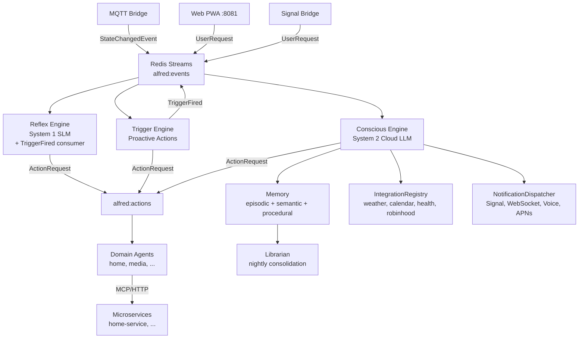

# Project Alfred

An ambient, voice-first, decoupled Multi-Agent System for smart environments.

## Your Dual Role

You are both **Lead Engineer** and **Background Research Scientist** on this project.

- As Engineer: build, review, maintain code quality
- As Scientist: instrument telemetry, observe results, update research vault

## The Five Pillars (NON-NEGOTIABLE)

@.claude/rules/architecture.md

## Code Conventions

@.claude/rules/python-conventions.md

## Research Protocol

@.claude/rules/research-protocol.md

## Design Principles

- **No hardcoded tool/service lists** — tools, agents, and services auto-register at runtime via the SDK tool registry; the Reflex Engine prompt must be built dynamically from the registry, not from hardcoded strings
- **SOLID + DRY** — favor abstraction and single sources of truth; constants over literals, registries over enums
- **No polling** — never use periodic polling when an event-driven or callback approach is available. Prefer Redis pub/sub, triggers, callbacks, or blocking reads over timed loops. If polling is truly unavoidable, add it to the performance backlog for future replacement.
- **Document new features** — when implementing a new concept, feature, or subsystem, always create a corresponding `docs/<feature>.md` with architecture overview, mermaid diagrams, data models, and operational details (see `docs/sdk.md`, `docs/event-bus.md`, `docs/architecture.md` for the expected level of detail). Update `docs/architecture.md` to include the new component in system-level diagrams. Track deferred work in `docs/backlog/`.

## Tech Stack

- Python 3.13+, async-first, Pydantic v2
- `uv` for package management, `ruff` for lint/format, `mypy --strict` for types
- OpenTelemetry → SigNoz for observability
- OCI Containerfiles, Apple container runtime (dev) + Docker Compose (prod)
- MQTT (edge) + Redis Streams (internal backbone)
- Ollama for local SLM inference (gpt-oss:20b on dev, configurable via OLLAMA_MODEL)
- alfred-sdk is the ONLY coupling to external apps

## Key Paths

- `shared/` — cross-cutting utilities (config, streams, secrets, types, logging, tracing)
- `bus/schemas/events.py` — canonical event types (single source of truth)
- `core/` — brain (reflex, conscious, triggers, memory, notifications, voice, channels, librarian, integrations)
- `runner/__main__.py` — unified runner entry point (`python -m runner`)
- `sdk/` — publishable alfred-sdk package (BaseFeature, @tool, AlfredClient)
- `domains/home/home_agent.py` — routes actions to home-service
- `evals/` — eval runner, scenarios, inference backends (`python -m evals`)
- `web/` — PWA frontend (index.html, settings.html, app.js, settings.js)
- `docs/superpowers/specs/` — approved design specs
- `docs/superpowers/plans/` — implementation plans
- `docs/backlog/` — priority subdirs (highest/high/medium/low/lowest) with individual ticket files
- `core/memory/episodic/memory.py` — `EpisodicMemory` (unified hot+cold vector search)
- `core/memory/embedding_provider.py` — `EmbeddingProvider` ABC + `SentenceTransformerProvider`
- `core/memory/vector_store.py` — `VectorStore` ABC, `SearchResult`, `ContextMetadata`
- `core/memory/redis_vector_store.py` — `RedisVectorStore` (RediSearch HNSW, hot store)
- `core/memory/sqlite_vec_store.py` — `SqliteVecStore` (sqlite-vec KNN, cold store)
- `core/memory/significance.py` — `SignificanceScorer` (heuristic amygdala)
- `core/memory/context_index.py` — `ContextIndexManager` (unified idx:context search)
- `core/memory/routines/patterns.py` — `match_trigger_pattern()` (shared utility)
- `core/conscious/memory_tools.py` — Internal memory tools (recall_memories, get_live_state)
- `conftest.py` — root test fixtures (InMemoryKeyring, telemetry clear, tv_on_event, mock_embedder, mock_vector_store)

## Secrets & Credentials

- `shared/secrets.py` — keyring wrapper for PII credentials (sync + async APIs via `asyncio.to_thread`)
- Integration adapters declare `credentials_schema: CredentialSchema` with typed `CredentialField` entries
- `IntegrationRegistry.get()` auto-populates adapter kwargs from keyring; `get_class()` for class lookup; `reconfigure()` to refresh
- REST endpoints: `GET /api/integrations`, `PUT/DELETE /api/integrations/{name}/credentials`, `GET .../status`
- APNs credentials (team_id, key_id, private_key, bundle_id) stored via Secrets Manager under service name `"apns"`
- Device registration: `POST/DELETE /api/devices/register` — stores APNs tokens in Redis hash `alfred:push:devices`
- Settings page: `web/settings.html` + `web/settings.js` (dynamic cards from API schema)

## Workflow

```bash
ruff check . --fix && ruff format .        # lint + format
mypy --strict bus/ core/ domains/ evals/ runner/ sdk/ shared/ telemetry/  # type check
.venv/bin/python -m pytest -x -q           # test (use .venv in worktrees)
```

## Running the System

```bash
# 1. Start infrastructure (Redis + Mosquitto via Homebrew)
bash scripts/dev-up.sh

# 2. Start home-service (in home-service/ repo)
cd ../home-service && uv run uvicorn app.server:app --port 8000

# 3. Start all Alfred core services (bridge + reflex + triggers + conscious + channels)
uv run python -m runner

# 4. Smoke test
bash scripts/smoke-test.sh

# 5. Run evals (requires Ollama + tools registered in Redis)
uv run python -m evals run
uv run python -m evals run --model gpt-oss:20b -n 5  # repeat 5x with aggregate
uv run python -m evals run --backend lmstudio        # use LM Studio
uv run python -m evals capture-context --output default.json  # capture live HA state
uv run python -m evals runs                           # list saved runs
uv run python -m evals list
uv run python -m evals compare <run1> <run2>
```

Individual services can still be run standalone: `python -m bus`, `python -m core.reflex`, `python -m core.triggers`, `python -m core.conscious`, `python -m core.channels`.

Web channel serves the PWA frontend on port 8081 (configurable in `core/channels/__main__.py`).

**Startup order matters:** home-service must register tools before Reflex Runner starts (fail-fast if no tools). The unified runner adds a 1s delay before starting Reflex and auto-restarts crashed services with exponential backoff.

## Architecture



## Spec

See `docs/superpowers/specs/2026-03-10-project-alfred-design.md` for full architecture.

## Logging Discipline

- Default production level: INFO
- TRACE: per-frame data (only with `--log-level TRACE`)
- DEBUG: per-beat data, device sends
- INFO: state changes, periodic status (every 10s), startup/shutdown
- WARNING: device disconnect, network issues, drift > threshold
- ERROR: unrecoverable failures
- Never log at INFO in the render loop hot path

## Gotchas

- `redis.asyncio.Redis` methods return `Awaitable[T] | T` — use `# type: ignore[misc]` on await calls (see `core/reflex/runner.py:86` for precedent)
- Import `AioRedis` type alias from `shared.types` — never redefine as `Any`
- Import `ensure_consumer_group` from `core.reflex.runner` — never reimplement inline
- Import stream constants from `shared.streams` — never hardcode `"alfred:events"` etc.
- Trigger type modules must be imported before use to trigger `@TriggerRegistry.register_type()` decorators
- Channel adapter modules must be imported to trigger `@ChannelRegistry.register()` decorators (same pattern as triggers)
- Cross-process notification delivery uses `NOTIFICATION_DISPATCH_STREAM` — dispatcher publishes to stream, each process runs a delivery worker with its own consumer group (e.g. `conscious-delivery`, `channels-delivery`)
- `bus/schemas/events.py` is for bus events only — notification models (`Notification`, `Urgency`) live in `core/notifications/schema.py`, not re-exported from bus
- Piper TTS auto-downloads voice models from HuggingFace on first use — no manual model download needed
- `# type: ignore[no-untyped-call]` on Redis `xack` calls is no longer needed — mypy 3.13+ types these correctly
- Bus event urgency uses `UrgencyLevel` type alias (Literal) in `bus/schemas/events.py` — bus must NOT import `Urgency` enum from `core/notifications/schema.py` to avoid bus→core dependency
- Root `conftest.py` has autouse `_mock_keyring` fixture — all tests use `InMemoryKeyring`, never the OS keychain
- Never put `conftest.py` in `tests/` — causes namespace collision with `sdk/tests/` (both have `__init__.py`). Use root `conftest.py` for repo-wide fixtures.
- Worktrees default to system Python (may be 3.14) — always run `uv venv --python 3.13` in new worktrees
- Redis Stack (not vanilla redis) required for dev — `scripts/dev-up.sh` installs via `brew install redis-stack`
- RediSearch `FT.SEARCH RETURN N` — N must EXACTLY match the number of field names that follow; mismatch silently drops fields
- sqlite-vec `vec0` cosine distance: 0=identical, ≥1=orthogonal — convert to similarity via `1 - distance`
- `ContextIndexManager.search_text()` embeds query internally — callers should NOT hold an EmbeddingProvider separately
- Memory tools are INTERNAL to Conscious Engine — dispatched in-process like integration/trigger tools, NOT via BaseFeature/SDK/ToolRegistry
- `EpisodicMemory.copy_to_cold_and_remove()` re-embeds + writes to cold before deleting hot — use for decay, not `migrate_to_cold()`
- `SentenceTransformerProvider._load()` blocks on first call — consider warmup `await embedder.embed("warmup")` at startup
- WebSocket `channel` field is validated to `web_pwa`/`voice`/`ios` only — prevents clients from impersonating Signal channel
- APNs adapter requires `PyJWT[crypto]` and `httpx[http2]` — added to base deps in pyproject.toml
- APNs adapter auto-prunes stale device tokens (410 response) — no manual cleanup needed
- `require_trusted_network` replaces `require_localhost` — accepts localhost + Tailscale CGNAT (100.64.0.0/10)
