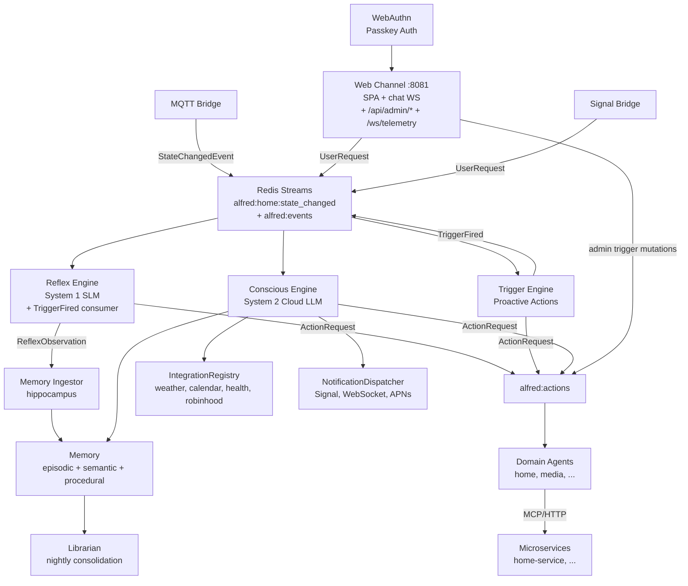

# Project Alfred

An ambient, voice-first, decoupled Multi-Agent System for smart environments.

## Your Dual Role

You are both **Lead Engineer** and **Background Research Scientist** on this project.

- As Engineer: build, review, maintain code quality
- As Scientist: instrument telemetry, observe results, update research vault

## The Five Pillars (NON-NEGOTIABLE)

@.claude/rules/architecture.md

## Code Conventions

@.claude/rules/python-conventions.md

## Research Protocol

@.claude/rules/research-protocol.md

## Design Principles

- **No hardcoded tool/service lists** — tools, agents, and services auto-register at runtime via the SDK tool registry; the Reflex Engine prompt must be built dynamically from the registry, not from hardcoded strings
- **SOLID + DRY** — favor abstraction and single sources of truth; constants over literals, registries over enums
- **No polling** — never use periodic polling when an event-driven or callback approach is available. Prefer Redis pub/sub, triggers, callbacks, or blocking reads over timed loops. If polling is truly unavoidable, add it to the performance backlog for future replacement.
- **Document new features** — when implementing a new concept, feature, or subsystem, always create a corresponding `docs/<feature>.md` with architecture overview, mermaid diagrams, data models, and operational details (see `docs/sdk.md`, `docs/event-bus.md`, `docs/architecture.md` for the expected level of detail). Update `docs/architecture.md` to include the new component in system-level diagrams. Track deferred work in `docs/backlog/`.
- **Keep the PRD current** — `docs/PRD.md` is the public product source of truth. Any PR that adds or changes a user-facing capability updates the relevant Capability Catalog row(s) (status + reference) in the same branch, and bumps the "statuses current as of" date.

## Tech Stack

- Python 3.13+, async-first, Pydantic v2
- `uv` for package management, `ruff` for lint/format, `mypy --strict` for types
- OpenTelemetry → SigNoz for observability
- OCI Containerfiles, Apple container runtime (dev) + Docker Compose (prod) — one fat image, launched via `alfredctl` (build/up/down/logs/shell/urls/smoke)
- MQTT (edge) + Redis Streams (internal backbone)
- Local SLM inference (System 1): Ollama by default (OLLAMA_MODEL), or any OpenAI-compatible server (vLLM/LM Studio) via REFLEX_BACKEND=openai + OPENAI_COMPAT_HOST/OPENAI_COMPAT_MODEL
- alfred-sdk is the ONLY coupling to external apps

## Key Paths

- `alfredctl/` — container launcher CLI (`typer`): `main.py` (commands), `runtime.py` (runtime detection + per-runtime gateway/subnet knowledge), `launch.py` (`run` arg assembly), `staging.py` (git-tracked build context), `smoke.py` (containerized health checks). See `docs/containerization.md`.
- `shared/` — cross-cutting utilities (config, streams, secrets, types, logging, tracing)
- `shared/usertime.py` — `get_user_timezone()`/`set_user_timezone()` (Redis key `alfred:user:timezone`; resolution: stored → `ALFRED_TIMEZONE` env → UTC)
- `bus/schemas/events.py` — canonical event types (single source of truth)
- `core/` — brain (reflex, conscious, triggers, memory, notifications, voice, channels, librarian, integrations)
- `runner/__main__.py` — unified runner entry point (`python -m runner`)
- `sdk/` — publishable alfred-sdk package (BaseFeature, @tool, AlfredClient)
- `domains/home/home_agent.py` — routes actions to home-service
- `evals/` — eval runner, scenarios, inference backends (`python -m evals`)
- `web/` — Vite + React 19 SPA frontend (src/lib, src/shell, src/chat, src/pages; npm run dev|build|test|lint) — built `web/dist/` is served by the web channel
- `docs/superpowers/specs/` — approved design specs
- `docs/superpowers/plans/` — implementation plans
- `docs/backlog/` — priority subdirs (highest/high/medium/low/lowest) with individual ticket files
- `core/memory/episodic/memory.py` — `EpisodicMemory` (unified hot+cold vector search)
- `core/memory/embedding_provider.py` — `EmbeddingProvider` ABC + `SentenceTransformerProvider`
- `core/memory/vector_store.py` — `VectorStore` ABC, `SearchResult`, `ContextMetadata`
- `core/memory/redis_vector_store.py` — `RedisVectorStore` (RediSearch HNSW, hot store)
- `core/memory/sqlite_vec_store.py` — `SqliteVecStore` (sqlite-vec KNN, cold store)
- `core/memory/significance.py` — `SignificanceScorer` (heuristic amygdala)
- `core/memory/context_index.py` — `ContextIndexManager` (unified idx:context search)
- `core/memory/routines/patterns.py` — `match_trigger_pattern()` (shared utility)
- `core/memory/ingestor.py` — Memory Ingestor (hippocampus: ReflexObservation → episodic memory)
- `core/memory/ingestor_main.py` — Memory Ingestor service entry point
- `core/conscious/memory_tools.py` — Internal memory tools (recall_memories, get_live_state)
- `core/warmup.py` — `start_warmup()` background model/component warmup at service startup
- `core/identity/credentials.py` — `CredentialStore` (async SQLite, WebAuthn credential CRUD)
- `core/identity/auth_routes.py` — WebAuthn registration/login/logout endpoints (6 routes under `/api/auth/`)
- `core/identity/auth_middleware.py` — `AuthCookieMiddleware` (cookie → Redis session lookup)
- `core/identity/ws_auth.py` — `authenticate_ws_cookie()` (shared WS cookie auth for `/ws` + `/ws/telemetry`)
- `core/channels/web_server.py` — `create_app()` web channel FastAPI app (chat WS, auth, SPA, admin); run via `python -m core.channels`
- `core/channels/admin_api.py` — `create_admin_router()` (`/api/admin/*` — 11 reads + 6 controls, cookie + trusted-network gated)
- `core/channels/telemetry_ws.py` — `/ws/telemetry` live stream fan-out (cookie-authed)
- `core/channels/stream_catalog.py` — Redis stream catalog + defensive entry decoding for admin reads
- `core/channels/spa.py` — `mount_spa()` (serves `web/dist/`: real assets + index.html fallback for client-side routes)
- `core/channels/satellite/` — Wyoming voice satellite bridge: `config.py` (fleet loader), `endpointing.py` (streaming VAD/`UtteranceCollector`), `bridge.py` (`SatelliteConnection`/`SatelliteBridge`, reconnect + protocol handling), `pipeline.py` (`SatellitePipeline`: STT → Conscious → TTS). See `docs/voice-satellites.md`.
- `core/channels/request_bus.py` — `publish_and_wait()`, the shared XADD-then-XREAD request/response helper used by both the web channel and the satellite pipeline
- `core/channels/voice_models.py` — shared lazy Whisper/TTS/SpeakerID loaders for the channels process (`aget_stt`, `aget_tts`, `aget_speaker_id`)
- `core/voice/speaker_id.py` — `SpeakerID` (now real, not a stub): ECAPA-TDNN voiceprint enroll/identify
- `conftest.py` — root test fixtures (InMemoryKeyring, telemetry clear, tv_on_event, mock_embedder, mock_vector_store)

## Secrets & Credentials

- `shared/secrets.py` — keyring wrapper for PII credentials (sync + async APIs via `asyncio.to_thread`)
- Integration adapters declare `credentials_schema: CredentialSchema` with typed `CredentialField` entries
- `IntegrationRegistry.get()` auto-populates adapter kwargs from keyring; `get_class()` for class lookup; `reconfigure()` to refresh
- REST endpoints: `GET /api/integrations`, `PUT/DELETE /api/integrations/{name}/credentials`, `GET .../status`
- APNs credentials configured via env (`APNS_TEAM_ID`, `APNS_KEY_ID`, `APNS_BUNDLE_ID`, optional `APNS_KEY_PATH`); the `.p8` signing key lives in `secrets/` (gitignored)
- Device registration: `POST/DELETE /api/devices/register` — stores APNs tokens in Redis hash `alfred:push:devices`
- Settings page: `web/src/pages/SettingsPage.tsx` — React SPA route at `/settings` (integration credential cards via `IntegrationCard`)
- WebAuthn credentials: SQLite at `data/credentials.db` — credential ID, public key, sign count, device name
- Auth sessions: Redis at `alfred:auth:{session_id}` — 24hr TTL, HttpOnly cookie `alfred_auth`
- WebAuthn challenges: Redis at `alfred:webauthn:challenge:{id}` — 5min TTL, one-time use
- Sovereign services declare `credentials_schema`/`credentials_endpoint` via `AlfredClient`; `register()` publishes `ServiceRegistered` to `alfred:events` AFTER the registry hset
- `core/channels/service_credentials.py` — service credential helpers + `credential_push_worker` (consumer group `channels-credentials` on `alfred:events`) re-pushes keyring credentials whenever a service re-registers
- `GET /api/integrations` merges adapters (`kind: "adapter"`) and registry-declared services (`kind: "service"`); service PUT pushes to the service's `credentials_endpoint`, service status proxies its `/health`

## Workflow

```bash
# Python (ruff >=0.15.16, mypy >=2.1)
ruff check . --fix && ruff format .        # lint + format
mypy --strict alfredctl/ bus/ core/ domains/ evals/ runner/ sdk/ shared/ telemetry/  # type check
.venv/bin/python -m pytest -x -q           # test (use .venv in worktrees)

# Frontend (run from web/)
cd web && npm run lint && npm run test && npm run build   # build emits web/dist/ for the runner to serve
```

## Branching & PRs

- PR-only; branch `<type>/<slug>` (`feat|fix|chore|docs|refactor|test|ci|perf`); PR title
  is a conventional commit line (it becomes the squash commit — release-please reads it).
- Squash-only; branches auto-delete on merge; never reuse a branch.
- Worktree discipline: the main checkout stays parked on the trunk and is pull-only —
  never commit from it. One worktree per topic branch, created inside this repo; delete
  the worktree as soon as its PR merges.
- Never emit `[skip ci]`/`[no ci]` on PR branches.
- CI gate is the single `ci-ok` aggregate check (python, web, spa, pr-title,
  artifact-guard). See `docs/superpowers/specs/2026-07-18-branching-strategy-design.md`.
- GitHub-dispatched agents exist: commenting `@claude <task>` on an issue/PR (write-access
  users only) runs an agent via Actions; every human PR gets an automatic Claude review
  (once the Claude GitHub App + OAuth token are configured).

## Running the System

**Option A — containerized (one command, builds the image, starts everything):**

```bash
uv run alfredctl up --mode seed
uv run alfredctl smoke   # health-check it in one shot (boots seed mode, verifies, tears down)
```

**Option B — native (bring your own Redis Stack + Mosquitto; Homebrew infra scripts are retired):**

```bash
# 1. Start infrastructure yourself, e.g.:
redis-stack-server & mosquitto &

# 2. Start home-service (in home-service/ repo)
cd ../home-service && uv run uvicorn app.server:app --port 8000

# 3. Start all Alfred core services (bridge + reflex + triggers + conscious + channels)
uv run python -m runner

# 4. Smoke test
bash scripts/smoke-test.sh
```

**Either path** — run evals (requires Ollama + tools registered in Redis):

```bash
uv run python -m evals run
uv run python -m evals run --model gpt-oss:20b -n 5  # repeat 5x with aggregate
uv run python -m evals run --backend lmstudio        # use LM Studio
uv run python -m evals capture-context --output default.json  # capture live HA state
uv run python -m evals runs                           # list saved runs
uv run python -m evals list
uv run python -m evals compare <run1> <run2>
```

Individual services can still be run standalone: `python -m bus`, `python -m core.reflex`, `python -m core.triggers`, `python -m core.conscious`, `python -m core.channels`, `python -m core.memory.ingestor_main`.

Web channel (`core/channels/web_server.py`, run via `python -m core.channels`) serves the built SPA (`web/dist/`) on port 8081 (configurable in `core/channels/__main__.py`). For frontend dev, `cd web && npm run dev` runs Vite (proxies `/api/*`, `/health`, `/ws*` to :8081) — run `npm run build` so the runner can serve the SPA.

**Startup order is flexible:** Reflex starts even if no tools are registered yet — it logs a warning and picks up tools dynamically as services register them (5-minute TTL cache refresh). The unified runner adds a 1s delay before starting Reflex and auto-restarts crashed services with exponential backoff.

## Dev Environment Notes

- Cloud/Linux sessions: use `.devcontainer/` (redis-stack + mosquitto included). macOS: `uv run alfredctl up` (containerized, no Homebrew infra needed) or your own Homebrew-managed Redis Stack + Mosquitto for native dev.

## Architecture



## Spec

See `docs/superpowers/specs/2026-03-10-project-alfred-design.md` for full architecture.

## Logging Discipline

- Default production level: INFO
- TRACE: per-frame data (only with `--log-level TRACE`)
- DEBUG: per-beat data, device sends
- INFO: state changes, periodic status (every 10s), startup/shutdown
- WARNING: device disconnect, network issues, drift > threshold
- ERROR: unrecoverable failures
- Never log at INFO in the render loop hot path

## Gotchas

- `redis.asyncio.Redis` methods return `Awaitable[T] | T` under the current redis stubs — `hset`/`hdel`/`xadd` awaits need NO ignore (e.g. `core/reflex/runner.py`, `sdk/alfred_sdk/client.py`); for `xreadgroup`/`xread`/`xrevrange`, use `read_group`/`read`/`revrange` from `shared.redis_streams` — the ignore lives there once
- Import `AioRedis` type alias from `shared.types` — never redefine as `Any`
- Import `ensure_consumer_group` from `core.reflex.runner` — never reimplement inline
- Reflex inference goes through `core/reflex/inference.py` (dispatches on `REFLEX_BACKEND`, ollama|openai, per call) — engine/__main__ import `inference`, never a concrete client; the openai path (vLLM/LM Studio) requires `OPENAI_COMPAT_MODEL` (fails loud)
- Import stream constants from `shared.streams` — never hardcode `"alfred:events"` etc.
- Trigger type modules must be imported before use to trigger `@TriggerRegistry.register_type()` decorators
- Channel adapter modules must be imported to trigger `@ChannelRegistry.register()` decorators (same pattern as triggers)
- Cross-process notification delivery uses `NOTIFICATION_DISPATCH_STREAM` — dispatcher publishes to stream, each process runs a delivery worker with its own consumer group (e.g. `conscious-delivery`, `channels-delivery`)
- `bus/schemas/events.py` is for bus events only — notification models (`Notification`, `Urgency`) live in `core/notifications/schema.py`, not re-exported from bus
- TTS is a pluggable ABC-adapter (registry `core/voice/tts_registry.py`, port `tts_backend.py`): Kokoro-82M default (`ALFRED_TTS_BACKEND`, voice `am_michael`), Piper fallback. Both auto-download from the HF Hub. See `docs/voice.md`.
- Never set ambient `PHONEMIZER_ESPEAK_*`/`ESPEAK_DATA_PATH` env vars — they break Kokoro's espeak phonemization (`phontab: No such file or directory`); `KokoroTTS` passes an explicit `EspeakConfig` from `espeakng_loader` instead (see `docs/voice.md`)
- `# type: ignore[no-untyped-call]` on Redis `xack` calls is no longer needed — mypy 3.13+ types these correctly
- Bus event urgency uses `UrgencyLevel` type alias (Literal) in `bus/schemas/events.py` — bus must NOT import `Urgency` enum from `core/notifications/schema.py` to avoid bus→core dependency
- Root `conftest.py` has autouse `_mock_keyring` fixture — all tests use `InMemoryKeyring`, never the OS keychain
- Never put `conftest.py` in `tests/` — causes namespace collision with `sdk/tests/` (both have `__init__.py`). Use root `conftest.py` for repo-wide fixtures.
- Worktrees default to system Python (may be 3.14) — always run `uv venv --python 3.13` in new worktrees
- Redis Stack (not vanilla redis) required for dev — `uv run alfredctl up` bundles it in the container; native dev installs it yourself via `brew install redis-stack`
- RediSearch `FT.SEARCH RETURN N` — N must EXACTLY match the number of field names that follow; mismatch silently drops fields
- sqlite-vec `vec0` cosine distance: 0=identical, ≥1=orthogonal — convert to similarity via `1 - distance`
- `ContextIndexManager.search_text()` embeds query internally — callers should NOT hold an EmbeddingProvider separately
- Memory tools are INTERNAL to Conscious Engine — dispatched in-process like integration/trigger tools, NOT via BaseFeature/SDK/ToolRegistry
- `EpisodicMemory.copy_to_cold_and_remove()` re-embeds + writes to cold before deleting hot — use for decay, not `migrate_to_cold()`
- `SentenceTransformerProvider._load()` is thread-safe (lock) and blocks on first call — services warm it automatically via `core/warmup.py` background startup tasks
- Trigger engine sensor evaluation consumes `HOME_STATE_STREAM` (not `alfred:events`) — `alfred:events` only carries TriggerFired/TriggerCreated
- Voice models (Whisper/TTS) load and run via `asyncio.to_thread` in channels — never call `transcribe()`/`synthesize()` directly on the event loop
- WebSocket `channel` field is validated to `web_pwa`/`voice`/`ios` only — prevents clients from impersonating Signal channel
- APNs adapter requires `PyJWT[crypto]` and `httpx[http2]` — added to base deps in pyproject.toml
- APNs adapter auto-prunes stale device tokens (410 response) — no manual cleanup needed
- `require_trusted_network` replaces `require_localhost` — accepts localhost + Tailscale CGNAT (100.64.0.0/10)
- `_group_by_entity_date()` is a module-level function in `consolidator.py` — used by `_apply_decay()` for compression grouping
- Decay formula is subtractive: `age_factor - significance*2 - recency*1.5 - frequency*1.0` — high values RESIST migration (negative pressure = stays in hot)
- `EpisodicMemory.recall()` persists retrieval stats to hot store — each recall triggers HSET on Redis (retrieval_count + last_retrieved)
- Routines are indexed in `idx:context` on detection and removed on archive — search via `type="routine"` filter
- Proactive routine suggestions run every 15 minutes in the conscious process background loop
- Compression at cold migration groups by entity+date — summary goes to cold, originals marked `compressed="yes"`
- `VectorStore` ABC has `update_metadata(id, fields)` — use for retrieval stats, do NOT mutate Redis hash fields directly
- Ignored routine suggestions decrement confidence by 0.05/cycle — archived at threshold 0.3, removed from context index
- WebAuthn registration endpoints require trusted network — passkey creation is gated to localhost/Tailscale
- `AuthCookieMiddleware` reads Redis lazily from `request.app.state.redis` — redis is not available at middleware init time (lifespan hasn't run yet)
- WebSocket auth gate parses cookies manually (BaseHTTPMiddleware doesn't run for WS upgrades) — cookie name constant is `COOKIE_NAME` from `core.identity.auth_middleware`
- `identity_claim` in WS handler is server-derived from auth state (`"sir"` if authenticated), not client-supplied — frontend no longer sends `identity` field
- Reflex Runner no longer writes to scratchpad — publishes structured `ReflexObservation` to `REFLEX_OBSERVATIONS_STREAM` instead; Memory Ingestor consumes and writes to episodic memory
- Import `publish_observation` from `core.reflex.runner` to publish observations from new code paths
- SPA catch-all (`mount_spa`) MUST register in the FastAPI lifespan AFTER the auth router — routes added during lifespan register after `create_app` routes, so an early mount would shadow `/api/auth/*`. Tests don't catch this because `web/dist/` doesn't exist in CI (mount is a no-op).
- Backend `GET /health` is the service healthcheck consumed by the iOS AlfredKit client — the SPA's system page lives at `/system` so the catch-all never shadows `/health`.
- `web/dist/` must be built (`npm run build`) for the runner to serve the SPA; `npm run dev` (Vite) proxies `/api/*`, `/health`, `/ws*` to :8081 instead.
- Admin trigger mutations (fire/enable) go through `ACTIONS_STREAM` → triggers process (consumer group `triggers-internal`) — NEVER write `alfred:triggers` directly from other processes; `TriggerStore` keeps Redis + YAML in sync. Internal action handlers live in `core/triggers/__main__.py` and `core/conscious/__main__.py` (`run_librarian`).
- `TriggerFired.fired_by` records provenance (admin vs engine fires) — set it when publishing a fire.
- Use `EpisodicMemory.recall(..., update_stats=False)` for non-mutating reads (admin search) — the default `True` persists retrieval stats (HSET per recall).
- `core/channels/admin_api.py` + `telemetry_ws.py` are gated by BOTH `require_trusted_network` AND `require_authenticated` (session cookie) — `/ws/telemetry` authenticates via the shared `authenticate_ws_cookie()` helper.
- Frontend (`web/src`): `erasableSyntaxOnly` TS flag is on — no parameter properties (declare + assign fields explicitly). `eslint-plugin-react-hooks` v7 purity rule bans `Date.now()`/`Math.random()` in render — compute them in effects/handlers, not in the render body.
- Wyoming satellites stop mic streaming only on `Transcript`/`Error` — always send `Transcript` even for empty/failed runs, or the satellite streams forever
- Announcements are bare `AudioStart`/`AudioChunk`/`AudioStop` streams — no announce event exists in the Wyoming usage here; it's the same code path as a spoken reply
- `pysilero-vad` frames are exactly 1024 bytes (512 samples @ 16 kHz s16 mono) — `UtteranceCollector.feed()` buffers arbitrary-size input and slices exact frames before calling the VAD
- ECAPA cosine same-speaker scores run ≈ 0.4–0.7 — `SPEAKER_ID_THRESHOLD` defaults to 0.45, not 0.7 (a 0.7 floor would reject genuine matches)
- TriggerStore coherence is pub/sub (`alfred:triggers:changed`) — never mutate `alfred:triggers` without going through TriggerStore
- User timezone lives at `alfred:user:timezone` via `shared/usertime.py` — resolution stored → `ALFRED_TIMEZONE` → UTC. Clients send their IANA zone per message; the conscious engine (not the web channel) persists it via `set_user_timezone` (write-on-change)
- Service credential push failures return HTTP 502 from PUT but the keyring write persists — recovery is event-driven via the next `ServiceRegistered`, never a retry loop
- redis-py 8 defaults `socket_timeout` to 5s (was `None`), which races idle blocking stream reads (`block=5000`) and raises spurious `Timeout reading from <host>` every ~5s — always construct async Redis clients via `shared.redis_streams.create_redis()` (`socket_timeout=None`, `block=` governs read timeouts instead), never `redis.asyncio.from_url()` directly. Exception: `sdk/alfred_sdk/client.py` keeps redis-py defaults — the SDK only issues short non-blocking commands and cannot import `shared`.
- Downloaded models: Piper/Kokoro TTS, Whisper, and the embedding model all route through the HF hub cache (`HF_HOME`, `/models/hf` in the container — see `core/voice/hf_models.ensure_model()`); only ECAPA speaker-ID uses `shared.config.models_root()` directly (`models_root()/spkrec-ecapa-voxceleb`, env `ALFRED_MODELS_DIR`)
- The container image build stages context from `git ls-files -z -co --exclude-standard` (`alfredctl/staging.py`), not the repo directory directly — gitignored files (`.env`, `secrets/`, personal `core/memory/preferences|profile/*`) can never reach the image regardless of runtime `.dockerignore` support; `.dockerignore` itself is only a defense-in-depth fallback for a direct `docker build` against an unstaged checkout
- `ALFRED_SECRETS_BACKEND=cryptfile` set *explicitly* without `ALFRED_SECRETS_PASSPHRASE` raises `RuntimeError` at import time (`shared/secrets.py`) — fails loud, no silent insecure fallback; the fallback only applies when `cryptfile` is auto-detected (unset backend on a bare Linux host)
- Apple `container`'s `inspect`/`network inspect` JSON nests fields under a `status` key, not top-level — `networks[].ipv4Address` and `ipv4Subnet` live at `entry["status"]["networks"][0]["ipv4Address"]` / `entry["status"]["ipv4Subnet"]` (see `alfredctl/runtime.py`, `alfredctl/main.py`)
- Mosquitto's config is generated at runtime, not shipped as a static file — `runner/__main__.py:_write_mosquitto_conf()` writes `data_path("mosquitto")/mosquitto.conf` with `persistence` set from `ALFRED_DATA_MODE` (`infra/mosquitto.conf` was deleted as dead — the old compose file was its only consumer)
