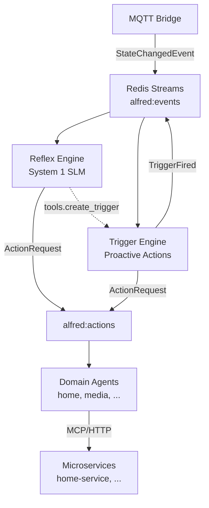

# Project Alfred

An ambient, voice-first, decoupled Multi-Agent System for smart environments.

## Your Dual Role

You are both **Lead Engineer** and **Background Research Scientist** on this project.

- As Engineer: build, review, maintain code quality
- As Scientist: instrument telemetry, observe results, update research vault

## The Four Pillars (NON-NEGOTIABLE)

@.claude/rules/architecture.md

## Code Conventions

@.claude/rules/python-conventions.md

## Research Protocol

@.claude/rules/research-protocol.md

## Design Principles

- **No hardcoded tool/service lists** — tools, agents, and services auto-register at runtime via the SDK tool registry; the Reflex Engine prompt must be built dynamically from the registry, not from hardcoded strings
- **SOLID + DRY** — favor abstraction and single sources of truth; constants over literals, registries over enums

## Tech Stack

- Python 3.13+, async-first, Pydantic v2
- `uv` for package management, `ruff` for lint/format, `mypy --strict` for types
- OpenTelemetry → SigNoz for observability
- OCI Containerfiles, Apple container runtime (dev) + Docker Compose (prod)
- MQTT (edge) + Redis Streams (internal backbone)
- Ollama for local SLM inference (gpt-oss:20b on dev, configurable via OLLAMA_MODEL)
- alfred-sdk is the ONLY coupling to external apps

## Key Paths

- `shared/streams.py` — Redis stream/key constants (single source of truth for all stream names)
- `shared/config.py` — central env config (loads .env via python-dotenv)
- `bus/schemas/events.py` — canonical event types (single source of truth)
- `core/reflex/__main__.py` — Reflex Runner entry point (`python -m core.reflex`)
- `core/reflex/tool_registry.py` — reads tool manifests from Redis `alfred:tool_registry`
- `core/triggers/__main__.py` — Trigger Engine entry point (`python -m core.triggers`)
- `core/triggers/registry.py` — TriggerRegistry for dynamic trigger type registration
- `core/triggers/store.py` — Redis CRUD + YAML snapshots (primary: Redis hash `alfred:triggers`)
- `bus/__main__.py` — Bridge entry point (`python -m bus`)
- `core/memory/preferences/` — Markdown preference files (read-only at runtime)
- `core/memory/scratchpad.md` — ephemeral observations (append-only at runtime)
- `sdk/alfred_sdk/feature.py` — `BaseFeature`, `@tool` decorator, manifest models
- `sdk/` — publishable alfred-sdk package
- `scripts/smoke-test.sh` — end-to-end smoke test (MQTT → Reflex → action result)
- `domains/home/home_agent.py` — routes actions to home-service via MCP/HTTP
- `research/` — Obsidian vault with experiments, data, paper drafts
- `docs/backlog/` — deferred work items from code reviews and simplification passes
- `docs/superpowers/specs/` — approved design specs
- `docs/superpowers/plans/` — implementation plans

## Running the System

```bash
# 1. Start infrastructure (Redis + Mosquitto via Homebrew)
brew services start redis
brew services start mosquitto

# 2. Start home-service (in home-service/ repo)
cd ../home-service && uv run uvicorn app.server:app --port 8000

# 3. Start Bridge (in alfred/ repo)
uv run python -m bus

# 4. Start Reflex Runner (in alfred/ repo)
uv run python -m core.reflex

# 5. Start Trigger Engine (in alfred/ repo)
uv run python -m core.triggers

# 6. Smoke test
bash scripts/smoke-test.sh
```

**Startup order matters:** home-service must register tools before Reflex Runner starts (fail-fast if no tools).

## Architecture



## Spec

See `docs/superpowers/specs/2026-03-10-project-alfred-design.md` for full architecture.

## Gotchas

- `redis.asyncio.Redis` methods return `Awaitable[T] | T` — use `# type: ignore[misc]` on await calls (see `core/reflex/runner.py:86` for precedent)
- Import `AioRedis` type alias from `core.reflex.runner` — never redefine as `Any`
- Import `ensure_consumer_group` from `core.reflex.runner` — never reimplement inline
- Import stream constants from `shared.streams` — never hardcode `"alfred:events"` etc.
- Trigger type modules must be imported before use to trigger `@TriggerRegistry.register_type()` decorators
