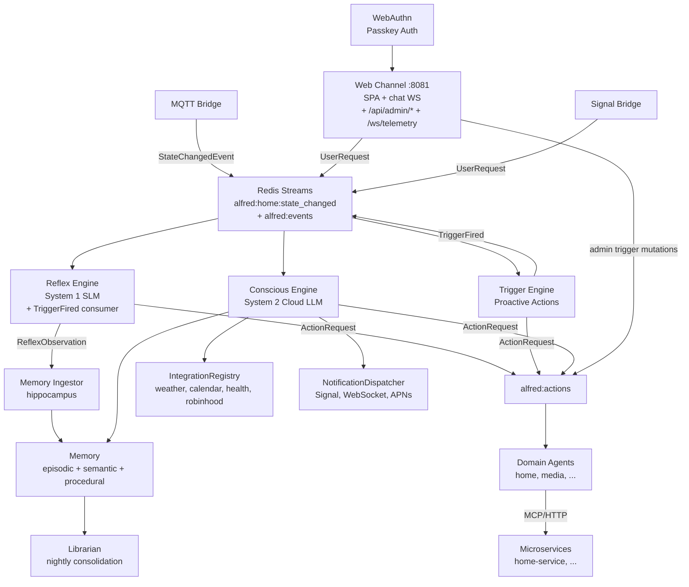

# Project Alfred

An ambient, voice-first, decoupled Multi-Agent System for smart environments.

## Your Dual Role

You are both **Lead Engineer** and **Background Research Scientist** on this project.

- As Engineer: build, review, maintain code quality
- As Scientist: instrument telemetry, observe results, update research vault

## The Five Pillars (NON-NEGOTIABLE)

@.claude/rules/architecture.md

## Code Conventions

@.claude/rules/python-conventions.md

## Research Protocol

@.claude/rules/research-protocol.md

## Design Principles

- **No hardcoded tool/service lists** — tools, agents, and services auto-register at runtime via the SDK tool registry; the Reflex Engine prompt must be built dynamically from the registry, not from hardcoded strings
- **SOLID + DRY** — favor abstraction and single sources of truth; constants over literals, registries over enums
- **No polling** — never use periodic polling when an event-driven or callback approach is available. Prefer Redis pub/sub, triggers, callbacks, or blocking reads over timed loops. If polling is truly unavoidable, file an issue to replace it (see Tickets).
- **Document new features** — when implementing a new concept, feature, or subsystem, always create a corresponding `docs/<feature>.md` with architecture overview, mermaid diagrams, data models, and operational details (see `docs/sdk.md`, `docs/event-bus.md`, `docs/architecture.md` for the expected level of detail). Update `docs/architecture.md` to include the new component in system-level diagrams. Track deferred work as GitHub issues (see Tickets).
- **Keep the PRD current** — `docs/PRD.md` is the public product source of truth. Any PR that adds or changes a user-facing capability updates the relevant Capability Catalog row(s) (status + reference) in the same branch, and bumps the "statuses current as of" date.

## Tech Stack

- Python 3.13+, async-first, Pydantic v2
- `uv` for package management, `ruff` for lint/format, `mypy --strict` for types
- OpenTelemetry → SigNoz for observability
- OCI Containerfiles, Apple container runtime (dev) + Docker Compose (prod) — one fat image, launched via `alfredctl` (build/up/down/logs/shell/urls/smoke)
- MQTT (edge) + Redis Streams (internal backbone)
- Local SLM inference (System 1): Ollama by default (OLLAMA_MODEL), or any OpenAI-compatible server (vLLM/LM Studio) via REFLEX_BACKEND=openai + OPENAI_COMPAT_HOST/OPENAI_COMPAT_MODEL
- alfred-sdk is the ONLY coupling to external apps

## Key Paths

- `alfredctl/` — container launcher CLI (`typer`): `main.py` (commands), `runtime.py` (runtime detection + per-runtime gateway/subnet knowledge), `launch.py` (`run` arg assembly), `staging.py` (git-tracked build context), `smoke.py` (containerized health checks). See `docs/containerization.md`.
- `shared/` — cross-cutting utilities (config, streams, secrets, types, logging, tracing)
- `shared/usertime.py` — `get_user_timezone()`/`set_user_timezone()` (Redis key `alfred:user:timezone`; resolution: stored → `ALFRED_TIMEZONE` env → UTC)
- `shared/gateway.py` — `GATEWAY_REWRITE_KEYS`: the host-pointing env vars both launch paths rewrite to the container→host gateway (dependency-free on purpose — `alfredctl/launch.py` needs it before `shared.config` loads `.env`)
- `bus/schemas/events.py` — canonical event types (single source of truth)
- `core/` — brain (reflex, conscious, triggers, memory, notifications, voice, channels, librarian, integrations)
- `runner/__main__.py` — unified runner entry point (`python -m runner`)
- `sdk/` — publishable alfred-sdk package (BaseFeature, @tool, AlfredClient)
- `sdk/alfred_sdk/live_state.py` — live-state contract: key `alfred:live_state:{service}`, `LiveStateEntry`, `LiveStateWriter`, `read_live_state()` (see `docs/live-state.md`)
- `domains/home/home_agent.py` — routes actions to home-service
- `evals/harness/` — the PRD eval harness: `alfred evals run|list|calibrate`, goldens in `evals/suites/`, PRD map in `evals/coverage.yaml`; see `docs/evals.md`
- `evals/memory/` — memory-decay eval: simulated house on a throwaway Redis, decay policies compared by recall (`python -m evals memory run`; `docs/evals-memory.md`)
- `web/` — Vite + React 19 phone-first PWA client: one screen (the Room), one interrupt (the Door), four identity gates (src/lib, src/shell, src/gates, src/room, src/door, src/workshop, src/sheets; npm run dev|build|test|lint) — built `web/dist/` is served by the web channel. See `docs/web-frontend.md`
- `web/design-system/` — generator for the claude.ai/design "Alfred Design System": bundles the real `web/src` components, type-checks the preview stories against their props, generates props/docs/tokens from tsc and `index.css`, and render-checks every card in Chromium (`cd web && npm run design-sync` → `web/design-system/out/`, gitignored). See `docs/design-system.md`
- `docs/superpowers/specs/` — approved design specs
- `docs/superpowers/plans/` — implementation plans
- `core/memory/episodic/memory.py` — `EpisodicMemory` (unified hot+cold vector search)
- `core/memory/embedding_provider.py` — `EmbeddingProvider` ABC (with concrete `warmup()`/`aclose()` defaults) + `SentenceTransformerProvider`
- `core/memory/openai_embedding_provider.py` — `OpenAICompatEmbeddingProvider` (HTTP `/v1/embeddings`; vLLM needs `--runner pooling`)
- `core/memory/embedding_backend.py` — `build_embedding_provider()`: the `EMBEDDING_BACKEND` seam (registry, not a fall-through); services call this, never a concrete provider
- `core/memory/vector_store.py` — `VectorStore` ABC, `SearchResult`, `ContextMetadata`
- `core/memory/redis_vector_store.py` — `RedisVectorStore` (RediSearch hot store; exact KNN, metadata `select()`)
- `core/memory/sqlite_vec_store.py` — `SqliteVecStore` (sqlite-vec KNN, cold store)
- `core/memory/significance.py` — `SignificanceScorer` (heuristic amygdala)
- `core/memory/context_index.py` — `ContextIndexManager` (unified idx:context search)
- `core/memory/recall.py` — `recall_hot_and_cold()`: the one hot + cold merge behind both `ContextIndexManager.recall()` and `EpisodicMemory.recall()`
- `core/memory/routines/patterns.py` — `match_trigger_pattern()` (shared utility)
- `core/memory/ingestor.py` — Memory Ingestor (hippocampus: ReflexObservation → episodic memory)
- `core/memory/ingestor_main.py` — Memory Ingestor service entry point
- `core/conscious/memory_tools.py` — Internal memory tools (recall_memories, get_live_state)
- `core/warmup.py` — `start_warmup()` background model/component warmup at service startup
- `core/shutdown.py` — `teardown()` orderly service shutdown (drains background tasks, then closes resources); the counterpart to `core/warmup.py`
- `core/identity/credentials.py` — `CredentialStore` (async SQLite, WebAuthn credential CRUD)
- `core/identity/auth_routes.py` — WebAuthn registration/login/logout, sessions, passkeys and pairing-code endpoints (11 routes under `/api/auth/`)
- `core/identity/auth_middleware.py` — `AuthCookieMiddleware` (cookie → Redis session lookup)
- `core/identity/ws_auth.py` — `require_ws_auth()` (accept → cookie auth → close 4001) wrapping `authenticate_ws_cookie()`; shared by `/ws` + `/ws/telemetry`
- `core/channels/web_server.py` — `create_app()` web channel FastAPI app (chat WS, auth, SPA, admin); run via `python -m core.channels`
- `core/channels/admin_api.py` — `create_admin_router()` (`/api/admin/*` — 12 reads + 7 controls, session-cookie gated; the trusted-network gate is NOT applied here, see docs/admin-api.md "Auth Model")
- `core/channels/telemetry_ws.py` — `/ws/telemetry` live stream fan-out (cookie-authed)
- `core/channels/stream_catalog.py` — Redis stream catalog + defensive entry decoding for admin reads
- `core/channels/spa.py` — `mount_spa()` (serves `web/dist/`: real assets + index.html fallback for client-side routes)
- `core/channels/satellite/` — Wyoming voice satellite bridge: `config.py` (fleet loader), `endpointing.py` (streaming VAD/`UtteranceCollector`), `bridge.py` (`SatelliteConnection`/`SatelliteBridge`, reconnect + protocol handling), `pipeline.py` (`SatellitePipeline`: STT → Conscious → TTS). See `docs/voice-satellites.md`.
- `core/channels/request_bus.py` — `publish_and_wait()`, the shared XADD-then-XREAD request/response helper used by both the web channel and the satellite pipeline
- `core/channels/voice_models.py` — shared lazy Whisper/TTS/SpeakerID loaders for the channels process (`aget_stt`, `aget_tts`, `aget_speaker_id`)
- `core/voice/speaker_id.py` — `SpeakerID` (now real, not a stub): ECAPA-TDNN voiceprint enroll/identify
- `conftest.py` — root test fixtures (InMemoryKeyring, telemetry clear, tv_on_event, mock_embedder, mock_vector_store)
- `core/reflex/attention.py` — `AttentionSet` (SLM gating) + `attention_add/remove/list` helpers; seed rules in `core/reflex/attention_seed.yaml`
- `core/routing/risk.py` + `core/routing/pending.py` — tool risk lookup + pending critical-action store/confirm (see `docs/autonomy.md`)
- `core/conscious/action_tools.py` — internal `confirm_pending_action` + attention tools (sir-only, in-process like memory tools)

## Secrets & Credentials

- `shared/secrets.py` — keyring wrapper for PII credentials (sync + async APIs via `asyncio.to_thread`)
- Integration adapters declare `credentials_schema: CredentialSchema` with typed `CredentialField` entries
- `IntegrationRegistry.get()` auto-populates adapter kwargs from keyring; `get_class()` for class lookup; `reconfigure()` to refresh
- REST endpoints: `GET /api/integrations`, `PUT/DELETE /api/integrations/{name}/credentials`, `GET .../status`
- APNs credentials configured via env (`APNS_TEAM_ID`, `APNS_KEY_ID`, `APNS_BUNDLE_ID`, optional `APNS_KEY_PATH`); the `.p8` signing key lives in `secrets/` (gitignored)
- Device registration: `POST/DELETE /api/devices/register` — stores APNs tokens in Redis hash `alfred:push:devices`
- Credential entry: `web/src/gates/SetupGate.tsx` — the first-run gate's second step `PUT`s `/api/integrations/{name}/credentials`. The PWA client still has no settings screen; the Workshop landed in phase 2 with the Activity bench, and the System bench that reinstates one is phase 3
- WebAuthn credentials: SQLite at `data/credentials.db` — credential ID, public key, sign count, device name
- Auth sessions: Redis at `alfred:auth:{session_id}` — 8h TTL (hard cap from login, no sliding renewal), HttpOnly cookie `alfred_auth` (Secure when the request arrived over HTTPS, including via a trusted proxy)
- WebAuthn challenges: Redis at `alfred:webauthn:challenge:{id}` — 5min TTL, one-time use
- Sovereign services declare `credentials_schema`/`credentials_endpoint` via `AlfredClient`; `register()` publishes `ServiceRegistered` to `alfred:events` AFTER the registry hset
- `core/channels/service_credentials.py` — service credential helpers + `credential_push_worker` (consumer group `channels-credentials` on `alfred:events`) re-pushes keyring credentials whenever a service re-registers
- `GET /api/integrations` merges adapters (`kind: "adapter"`) and registry-declared services (`kind: "service"`); service PUT pushes to the service's `credentials_endpoint`, service status proxies its `/health`

## Workflow

```bash
# Python (ruff >=0.15.16, mypy >=2.1)
ruff check . --fix && ruff format .        # lint + format
mypy --strict alfred_cli/ alfredctl/ bus/ core/ domains/ evals/ runner/ sdk/ shared/ telemetry/  # type check
.venv/bin/python -m pytest -x -q           # test (use .venv in worktrees)

# Frontend (run from web/)
cd web && npm run lint && npm run test && npm run build   # build emits web/dist/ for the runner to serve
```

## Branching & PRs

- PR-only; branch `<type>/<slug>` (`feat|fix|chore|docs|refactor|test|ci|perf`); PR title
  is a conventional commit line (it becomes the squash commit — release-please reads it).
- Squash-only; branches auto-delete on merge; never reuse a branch.
- Worktree discipline: the main checkout stays parked on the trunk and is pull-only —
  never commit from it. One worktree per topic branch, created inside this repo; delete
  the worktree as soon as its PR merges.
- Never emit `[skip ci]`/`[no ci]` on PR branches.
- CI gate is the single `ci-ok` aggregate check (python, web, spa, pr-title,
  artifact-guard). See `docs/superpowers/specs/2026-07-18-branching-strategy-design.md`.
- **Merging to `master` deploys.** The `deploy to lath-server` job on the self-hosted
  `alfred-deploy` runner rebuilds the fat image on lath-server, restarts the stack from
  `~/code/alfred-deploy/`, smoke-checks it, and rolls back automatically on failure. See
  "Continuous deployment" in `docs/deployment.md`. A merge to `alfred-home-service` will
  trigger the same deploy via `repository_dispatch` once its dispatch job merges.
- The aggregate job's **id** is `gate` and its **display name** is `ci-ok`. Keep it that
  way: `needs.ci-ok.result` never evaluates (a hyphen parses as subtraction in a GitHub
  expression path), and the required-check setting matches the display name.
- GitHub-dispatched agents exist: commenting `@claude <task>` on an issue/PR (write-access
  users only) runs an agent via Actions; every human PR gets an automatic Claude review
  (once the Claude GitHub App + OAuth token are configured).

## Tickets

- Every ticket is a GitHub issue on `anirudhlath/alfred`. There is no file backlog: `docs/backlog/` is retired and gitignored, so never recreate it. Deferred work, review findings left out of a PR, and follow-ups all become issues.
- File with `gh issue create --title "…" --body-file … --label "priority: medium"`, or the GitHub MCP `issue_write` tool where `gh` isn't available (cloud sessions). Search open issues first (`gh issue list --search …` / MCP `search_issues`) and extend an existing issue rather than filing a duplicate.
- Labels: exactly one `priority: highest|high|medium|low|lowest`; `epic: <name>` when it belongs to one (`epic: alpha-release`, `epic: github-chores`); `agent-ready` when it is scoped tightly enough to hand to `@claude` as-is. The issue templates add `bug`/`enhancement`.
- Body: Summary, Context, Acceptance Criteria (checkboxes). Cite code by repo path and other tickets as `#N`; a relative file link does not resolve inside an issue.
- Repo files cite tickets as `#N` too: `issue #N` in code comments, a full `https://github.com/anirudhlath/alfred/issues/N` link in Markdown (GitHub does not autolink `#N` in committed files).
- A PR that finishes an issue says `Closes #N`; a PR that changes a ticket's scope edits the issue in the same change.
- **Sensitive work never goes in a public issue — the repo is public.** Live exposures, unpatched vulnerabilities and personal data (addresses, IPs, names) go in a private security advisory (`https://github.com/anirudhlath/alfred/security/advisories/new`, the same route `.github/ISSUE_TEMPLATE/config.yml` gives reporters).

## Running the System

**Option A — containerized (one command, builds the image, starts everything):**

```bash
uv run alfredctl up --mode seed
uv run alfredctl smoke   # health-check it in one shot (boots seed mode, verifies, tears down)
```

**Option B — native (bring your own Redis Stack + Mosquitto; Homebrew infra scripts are retired):**

```bash
# 1. Start infrastructure yourself, e.g.:
redis-stack-server & mosquitto &

# 2. Start home-service (in home-service/ repo)
cd ../home-service && uv run uvicorn app.server:app --port 8000

# 3. Start all Alfred core services (bridge + reflex + triggers + conscious + channels)
uv run python -m runner

# 4. Smoke test
bash scripts/smoke-test.sh
```

**Evals** — the PRD suites boot their own throwaway stacks (Docker, a local vLLM, `uv sync --all-extras`):

```bash
uv run alfred evals calibrate                       # judge agreement with hand labels
uv run alfred evals list                            # goldens, their status and PRD rows
uv run alfred evals run home_control conversation   # scorecard by PRD row
```

See `docs/evals.md` for setup (a home-service checkout at `origin/main`), options and reading results.

Individual services can still be run standalone: `python -m bus`, `python -m core.reflex`, `python -m core.triggers`, `python -m core.conscious`, `python -m core.channels`, `python -m core.memory.ingestor_main`.

Web channel (`core/channels/web_server.py`, run via `python -m core.channels`) serves the built SPA (`web/dist/`) on port 8081 (configurable in `core/channels/__main__.py`). For frontend dev, `cd web && npm run dev` runs Vite (proxies `/api/*`, `/health`, `/ws*` to :8081) — run `npm run build` so the runner can serve the SPA.

**Startup order is flexible:** Reflex starts even if no tools are registered yet — it logs a warning and picks up tools dynamically as services register them (5-minute TTL cache refresh). The unified runner adds a 1s delay before starting Reflex and auto-restarts crashed services with exponential backoff.

## Dev Environment Notes

- Cloud/Linux sessions: use `.devcontainer/` (redis-stack + mosquitto included). macOS: `uv run alfredctl up` (containerized, no Homebrew infra needed) or your own Homebrew-managed Redis Stack + Mosquitto for native dev.

## Architecture


```mermaid
graph TD
    MQTT[MQTT Bridge] -->|StateChangedEvent| Bus[Redis Streams<br/>alfred:home:state_changed<br/>+ alfred:events]
    Bus --> Reflex[Reflex Engine<br/>System 1 SLM<br/>+ TriggerFired consumer]
    Bus --> Triggers[Trigger Engine<br/>Proactive Actions]
    Bus --> Conscious[Conscious Engine<br/>System 2 Cloud LLM]
    Reflex -->|ReflexObservation| Ingestor[Memory Ingestor<br/>hippocampus]
    Ingestor --> Memory
    Reflex -->|ActionRequest| Actions[alfred:actions]
    Triggers -->|ActionRequest| Actions
    Triggers -->|TriggerFired| Bus
    Conscious -->|ActionRequest| Actions
    Actions --> Agents[Domain Agents<br/>home, media, ...]
    Agents -->|MCP/HTTP| Services[Microservices<br/>home-service, ...]
    Conscious --> Memory[Memory<br/>episodic + semantic + procedural]
    Conscious --> Integrations[IntegrationRegistry<br/>weather, calendar, health, robinhood]
    Conscious --> Notify[NotificationDispatcher<br/>Signal, WebSocket, APNs]
    Memory --> Librarian[Librarian<br/>nightly consolidation]
    WebAuthn[WebAuthn<br/>Passkey Auth] --> WebChannel
    WebChannel[Web Channel :8081<br/>SPA + chat WS<br/>+ /api/admin/* + /ws/telemetry] -->|UserRequest| Bus
    WebChannel -->|admin trigger mutations| Actions
    Signal[Signal Bridge] -->|UserRequest| Bus
```

## Spec

See `docs/superpowers/specs/2026-03-10-project-alfred-design.md` for full architecture.

## Logging Discipline

- Default production level: INFO
- TRACE: per-frame data (only with `--log-level TRACE`)
- DEBUG: per-beat data, device sends
- INFO: state changes, periodic status (every 10s), startup/shutdown
- WARNING: device disconnect, network issues, drift > threshold
- ERROR: unrecoverable failures
- Never log at INFO in the render loop hot path

## Gotchas

- `redis.asyncio.Redis` methods return `Awaitable[T] | T` under the current redis stubs — `hset`/`hdel`/`xadd` awaits need NO ignore (e.g. `core/reflex/runner.py`, `sdk/alfred_sdk/client.py`); for `xreadgroup`/`xread`/`xrange`/`xrevrange`, use `read_group`/`read`/`forward_range`/`revrange` from `shared.redis_streams` — the ignore lives there once
- Import `AioRedis` type alias from `shared.types` — never redefine as `Any`
- Import `ensure_consumer_group` from `core.reflex.runner` — never reimplement inline
- **A consumer loop that ACKs only on success MUST reclaim its PEL, and must process what it reclaims.** `XREADGROUP '>'` only delivers *new* messages, so an un-ACKed entry is never redelivered on its own. Use `reclaim_replayable()` (`shared/redis_streams.py`) — it claims via `XAUTOCLAIM`, returns entries still inside `max_age_ms` for reprocessing, and ACKs away older ones (replaying an hours-old event drives the system from history). Both failure modes have shipped: reflex never reclaimed at all (199 events lost), and conscious reclaimed but only *logged* the count, re-claiming the same 4 entries every 60s forever. Always ACK entries that can never be parsed, or they are reclaimed for eternity. The Memory Ingestor is the one deliberate exception to `reclaim_replayable()`: it uses `reclaim_stale()` because a ten-minute-old observation is still worth *remembering* even though it is too stale to *act on*, and it ACKs unparseable payloads itself. ACKing the unparseable is not enough on its own — a third failure mode is an entry that *parses* but fails deterministically downstream: it is indistinguishable from transient at the failure site, so it is retried forever, and because `reclaim_stale` rescans from `start_id="0-0"` with a fixed `count`, a few at the head of the PEL eat the whole budget every pass and starve everything behind them. Cap deliveries per entry (`alfred:memory:ingest:attempts`, max 5, then ACK-drop and log at ERROR)
- Reflex inference goes through `core/reflex/inference.py` (dispatches on `REFLEX_BACKEND`, ollama|openai, per call) — engine/__main__ import `inference`, never a concrete client; the openai path (vLLM/LM Studio) requires `OPENAI_COMPAT_MODEL` (fails loud)
- Import stream constants from `shared.streams` — never hardcode `"alfred:events"` etc.
- Live state is written only through `LiveStateWriter` and read only through `read_live_state()`/`read_live_state_by_service()` (`sdk/alfred_sdk/live_state.py`) — never with raw Redis. `register()` carries no state; a service registers when it joins, not on a timer. Every `XADD` to `alfred:events` passes `maxlen=EVENTS_MAXLEN, approximate=True`.
- Trigger type modules must be imported before use to trigger `@TriggerRegistry.register_type()` decorators
- Channel adapter modules must be imported to trigger `@ChannelRegistry.register()` decorators (same pattern as triggers)
- Cross-process notification delivery uses `NOTIFICATION_DISPATCH_STREAM` — dispatcher publishes to stream, each process runs a delivery worker with its own consumer group (e.g. `conscious-delivery`, `channels-delivery`)
- `bus/schemas/events.py` is for bus events only — notification models (`Notification`, `Urgency`) live in `core/notifications/schema.py`, not re-exported from bus
- TTS is a pluggable ABC-adapter (registry `core/voice/tts_registry.py`, port `tts_backend.py`): Kokoro-82M default (`ALFRED_TTS_BACKEND`, voice `am_michael`), Piper fallback. Both auto-download from the HF Hub. See `docs/voice.md`.
- Never set ambient `PHONEMIZER_ESPEAK_*`/`ESPEAK_DATA_PATH` env vars — they break Kokoro's espeak phonemization (`phontab: No such file or directory`); `KokoroTTS` passes an explicit `EspeakConfig` from `espeakng_loader` instead (see `docs/voice.md`)
- `# type: ignore[no-untyped-call]` on Redis `xack` calls is no longer needed — mypy 3.13+ types these correctly
- Bus event urgency uses `UrgencyLevel` type alias (Literal) in `bus/schemas/events.py` — bus must NOT import `Urgency` enum from `core/notifications/schema.py` to avoid bus→core dependency
- Root `conftest.py` has autouse `_mock_keyring` fixture — all tests use `InMemoryKeyring`, never the OS keychain
- Never put `conftest.py` in `tests/` — causes namespace collision with `sdk/tests/` (both have `__init__.py`). Use root `conftest.py` for repo-wide fixtures.
- Worktrees default to system Python (may be 3.14) — always run `uv venv --python 3.13` in new worktrees
- Redis Stack (not vanilla redis) required for dev — `uv run alfredctl up` bundles it in the container; native dev installs it yourself via `brew install redis-stack`
- RediSearch `FT.SEARCH RETURN N` — N must EXACTLY match the number of field names that follow; mismatch silently drops fields
- RediSearch `FT.SEARCH` returns **10 documents** unless the command says `LIMIT 0 <n>`, whatever K the KNN clause asks for — every hot search sends `LIMIT`, and `RedisVectorStore.select()` pages with it
- Hot KNN runs `HYBRID_POLICY ADHOC_BF`, an exact search — never drop it for the HNSW graph walk. Passive observation stores the same state change, and so the same vector, hundreds of times, and the greedy walk gets trapped among the copies (EXP-006: it found 4 of 29 targets an exact ranking puts in the top 10, 14 even at `EF_RUNTIME 1000`; ADHOC_BF found 28, ~7 ms for both fields over 13k entries). ADHOC_BF needs a filter, so an unfiltered search filters `@timestamp:[-inf +inf]`, which every entry carries
- **RediSearch replies change shape with the negotiated protocol.** redis-py 8 uses RESP3, where `FT.SEARCH` returns `{"results": [{"id", "extra_attributes"}], "total_results"}` and `FT.INFO` returns a mapping — not RESP2's flat arrays. `_parse_ft_results`/`_parse_ft_info` normalise both via `_ft_documents`; never add an `isinstance(raw, list)` guard. This shipped broken: the RESP2-only guard made every semantic recall return `[]` and `count()` return 0, with no exception and no log line — Redis was matching and scoring correctly the whole time
- sqlite-vec `vec0` measures **L2 unless a table says `distance_metric=cosine`** — the cold store's do since schema v3, so `1 - distance` is the cosine similarity `EpisodicMemory.recall` merges with the hot store's (cosine distance: 0 identical, 1 orthogonal, 2 opposite). A pre-v3 file is rebuilt as cosine on first open, in one write transaction that keeps every vector — `vec0` cannot `RENAME`, so the rebuild copies through a TEMP table. The vec0 tables key vectors by `episodic_entries`' rowid, so a re-added id must keep its rowid: `SqliteVecStore.add()` upserts (`INSERT OR REPLACE` gives the row a new rowid and strands its vectors under the old one, #279) and deletes the rowid's vectors before inserting, because vec0 refuses `INSERT OR REPLACE` over a rowid it already holds
- `ContextIndexManager.search_text()` embeds query internally — callers should NOT hold an EmbeddingProvider separately
- Memory tools are INTERNAL to Conscious Engine — dispatched in-process like integration/trigger tools, NOT via BaseFeature/SDK/ToolRegistry
- `EpisodicMemory.copy_to_cold_and_remove()` writes to cold with the vectors hot already holds (`VectorStore.embeddings()`), embedding the text again only when hot cannot hand them back, then deletes hot — use for decay, not `migrate_to_cold()`
- `SentenceTransformerProvider._load()` is thread-safe (lock) and blocks on first call — services warm it automatically via `core/warmup.py` background startup tasks
- Trigger engine sensor evaluation consumes `HOME_STATE_STREAM` (not `alfred:events`) — `alfred:events` only carries TriggerFired/TriggerCreated/ServiceRegistered
- Voice models (Whisper/TTS) load and run via `asyncio.to_thread` in channels — never call `transcribe()`/`synthesize()` directly on the event loop
- WebSocket `channel` field is validated to `web_pwa`/`voice`/`ios` only — prevents clients from impersonating Signal channel
- APNs adapter requires `PyJWT[crypto]` and `httpx[http2]` — added to base deps in pyproject.toml
- APNs adapter auto-prunes stale device tokens (410 response) — no manual cleanup needed
- `require_trusted_network` (`core/channels/web_server.py`) trusts loopback + private LAN (RFC1918) + Tailscale CGNAT by default — the sane self-hosted default so localhost/Docker/LAN all work. `ALFRED_TRUSTED_NETWORKS_STRICT=1` drops the RFC1918 defaults (loopback + Tailscale + explicit `ALFRED_TRUSTED_NETWORKS` only). 403s name the rejected IP
- `_group_by_entity_date()` is a module-level function in `consolidator.py` — used by `_apply_decay()` for compression grouping
- Decay formula is subtractive: `age_factor - significance*2 - recency*1.5 - frequency*1.0` — high values RESIST migration (negative pressure = stays in hot). `migration_pressure()` (`core/librarian/consolidator.py`) can never exceed 1.0, so the threshold must sit below it: `DEFAULT_DECAY_MIGRATION_THRESHOLD = 0.2` (`shared/config.py`, one copy for config and `Librarian`). Nothing with significance ≥ 0.4 ever migrates. The old default of 1.0 meant nothing ever left hot storage (#201). The pass picks its candidates by **metadata, never by similarity**: `decay_candidate_ranges()` asks `VectorStore.select()` for every episodic entry with significance below `(1 − threshold) / 2`, a range that holds everything the formula could move for any sign of significance. It used to search for a placeholder phrase, which handed it ≤ 20 entries a pass and never one at negative cosine to the phrase (EXP-006). Selecting everything means the first pass after a deploy moves the whole backlog, so a pass runs at most `DECAY_MIGRATION_CONCURRENCY` migrations at once: they share the service's hot Redis pool, which redis-py caps at 100 and answers past that with "Too many connections" instead of waiting (EXP-008). Compression moves a group's originals first and summarises only those that moved — one that fails stays hot and is regrouped next pass
- Retrieval stats (`retrieval_count`/`last_retrieved`) are written by `record_retrievals()` (`core/memory/vector_store.py`), shared by `EpisodicMemory.recall(update_stats=True)` and `ContextIndexManager.search(update_stats=True)`. Each recall triggers an HSET. `ContextIndexManager` defaults to **False** on purpose: the Librarian's decay pass *reads* these fields, and involuntary context assembly runs every turn — only deliberate recall (`memory_recall_memories` → `ContextIndexManager.recall()`) records them, or the signal decay depends on gets flattened
- Routines are indexed in `idx:context` on detection and removed on archive — search via `type="routine"` filter
- `memory_recall_memories` searches hot **and the cold archive** through `ContextIndexManager.recall()` — the conscious process builds its index with `archive=cold_store`; without it, nothing the decay pass moved could be recalled. It and `EpisodicMemory.recall()` (admin search) merge the two through one function, `recall_hot_and_cold()` (`core/memory/recall.py`): `types`/`since` apply before the limit, reading each store deeper until nothing it holds back could place ([#311](https://github.com/anirudhlath/alfred/issues/311)), and the searches are gathered without `return_exceptions`, so an archive failure fails the recall rather than answering from hot alone. Never pass `VectorStore.search()` a `type` filter: the hot store's filters are TAG queries and `type` is a TEXT field, so RediSearch rejects the query and the store logs a warning and answers `[]` — every hot memory vanishes — while the cold store ignores filters altogether
- Proactive routine suggestions run every 15 minutes in the conscious process background loop
- Compression at cold migration groups by entity+date — summary goes to cold, originals marked `compressed="yes"`
- `VectorStore` ABC has `update_metadata(id, fields)` — use for retrieval stats, do NOT mutate Redis hash fields directly
- Ignored routine suggestions decrement confidence by 0.05/cycle — archived at threshold 0.3, removed from context index
- WebAuthn registration endpoints require trusted network (`require_trusted_network`) **or** a valid `X-Pairing-Code` header — login does not; the default trusted set is loopback + RFC1918 + Tailscale. The code is minted by `POST /api/auth/pairing` from a signed-in session (session-gated only, deliberately: the minting device is usually the one that is away), lives 5 min, and is single-use; wrong guesses are budgeted **per client address — a single IPv4 address or an IPv6 /64** (`alfred:webauthn:pairing:fails:{bucket}`, TTL 300s), and the 10th refuses that client for the rest of its counter — the code itself is never burned
- `AuthCookieMiddleware` reads Redis lazily from `request.app.state.redis` — redis is not available at middleware init time (lifespan hasn't run yet)
- WebSocket auth gate parses cookies manually (BaseHTTPMiddleware doesn't run for WS upgrades) — cookie name constant is `COOKIE_NAME` from `core.identity.auth_middleware`
- `identity_claim` in WS handler is server-derived from auth state (`"sir"` if authenticated), not client-supplied — frontend no longer sends `identity` field
- Reflex Runner no longer writes to scratchpad — publishes structured `ReflexObservation` to `REFLEX_OBSERVATIONS_STREAM` instead; Memory Ingestor consumes and writes to episodic memory
- Import `publish_observation` from `core.reflex.runner` to publish observations from new code paths
- Reflex runs in shadow mode (#285): it executes nothing until #286. Record its decisions with `publish_proposal` and `count_decision` from `core.reflex.runner`
- SPA catch-all (`mount_spa`) MUST register in the FastAPI lifespan AFTER the auth router — routes added during lifespan register after `create_app` routes, so an early mount would shadow `/api/auth/*`. Tests don't catch this because `web/dist/` doesn't exist in CI (mount is a no-op).
- Backend `GET /health` is the service healthcheck consumed by the iOS AlfredKit client — `core/channels/spa.py` keeps it out of the SPA catch-all (`_NON_SPA_PATHS`, alongside the `api/` and `ws` prefixes), so the client must never claim a route at `/health` or under those prefixes.
- `web/dist/` must be built (`npm run build`) for the runner to serve the SPA; `npm run dev` (Vite) proxies `/api/*`, `/health`, `/ws*` to :8081 instead.
- Admin trigger mutations (fire/enable) go through `ACTIONS_STREAM` → triggers process (consumer group `triggers-internal`) — NEVER write `alfred:triggers` directly from other processes; `TriggerStore` keeps Redis + YAML in sync. Internal action handlers live in `core/triggers/__main__.py` and `core/conscious/__main__.py` (`run_librarian`).
- `TriggerFired.fired_by` records provenance (admin vs engine fires) — set it when publishing a fire.
- Use `EpisodicMemory.recall(..., update_stats=False)` for non-mutating reads (admin search) — the default `True` persists retrieval stats (HSET per recall).
- `core/channels/admin_api.py` is gated by `require_authenticated` (session cookie) only; the credential-equivalent writes (`/api/integrations/{name}/credentials` PUT/DELETE, `/api/devices/register` POST/DELETE, `/api/voice/enroll` POST) keep BOTH gates via `_CREDENTIAL_GATES` (network gate first). WebAuthn registration (`/api/auth/register/{begin,complete}`) is the exception — trusted network **or** a valid `X-Pairing-Code` on BOTH calls (both handled by `_registration_gate` in `core/identity/auth_routes.py`, which wraps the `trusted_network_dep` injected from `web_server.py`), never a session, because the first-run user has no session to present and a session gate there would be unsatisfiable. An empty/whitespace pairing header reads as absent and falls through to the network gate; a malformed non-empty one is 403 `Invalid or expired pairing code` uncounted; well-formed wrong guesses are always counted (uniform work — the round trips no longer say whether a code is live) against the per-address key `alfred:webauthn:pairing:fails:{bucket}` (bucketed by `_pairing_fails_key`: the bare address for IPv4, the enclosing /64 for IPv6, since a v6 end site holds 2**64 addresses; a non-IP peer keys on the raw string), and the 10th locks out that client for the rest of its 300s TTL even with the right code, leaving the code live for everyone else (so a stranger can no longer deny pairing; minting deliberately clears no counter). Per-address budgets need `FORWARDED_ALLOW_IPS` set, or every internet caller shares the proxy's address. The code is consumed after `save_credential`, and a failed consume is logged with the registration standing. Every *store* failure on the plan-0b routes (pairing, sessions, passkeys, logout — credential-store failures included) is 503 `Session store unavailable`, one vocabulary; in the route *bodies*, `register/*`, `login/*` and `/status` carry no such guard and still surface an outage as a 500 — but the registration **gate** does: `_registration_gate` → `_pairing_code_valid` answers 503 on a store failure before either register route's body runs. Removing a passkey (`DELETE /api/auth/credentials/{id}`) is session-ONLY: it neither mints nor widens a credential. `/ws/telemetry` is not network-gated and authenticates via the shared `require_ws_auth()` helper. `X-Forwarded-*` is honoured only from `FORWARDED_ALLOW_IPS` (uvicorn `proxy_headers`) — except `_get_origin()` in `core/identity/auth_routes.py`, which still reads `x-forwarded-proto` straight off any peer (backlogged).
- Frontend (`web/src`): `erasableSyntaxOnly` TS flag is on — no parameter properties (declare + assign fields explicitly). `eslint-plugin-react-hooks` v7 purity rule bans `Date.now()`/`Math.random()` in render — compute them in effects/handlers, not in the render body.
- Wyoming satellites stop mic streaming only on `Transcript`/`Error` — always send `Transcript` even for empty/failed runs, or the satellite streams forever
- Announcements are bare `AudioStart`/`AudioChunk`/`AudioStop` streams — no announce event exists in the Wyoming usage here; it's the same code path as a spoken reply
- `pysilero-vad` frames are exactly 1024 bytes (512 samples @ 16 kHz s16 mono) — `UtteranceCollector.feed()` buffers arbitrary-size input and slices exact frames before calling the VAD
- Whisper decodes pure silence into confident text (`large-v3-turbo` returns `'You'` at `no_speech_prob=0.00`), so decoder confidence CANNOT filter hallucinations — `WhisperSTT` passes `vad_filter=True` + `condition_on_previous_text=False` to keep non-speech away from the decoder. Satellites additionally drop whole-transcript artifacts via `is_probable_hallucination()` (`core/voice/stt.py`); push-to-talk surfaces must NOT filter
- `UtteranceCollector` enforces `min_speech_ms` (default 250ms of *voiced* frames) — without it a one-frame VAD blip from a false wake became a ~1.15s, 97%-silence clip that Whisper hallucinated into a command. Too little speech emits `timeout`, not `utterance`
- Satellite wake sensitivity lives on the Pi, not in this repo — `wyoming-openwakeword` defaults to `--threshold 0.5 --trigger-level 1` (one frame over threshold fires). Set both explicitly via `WAKE_THRESHOLD`/`WAKE_TRIGGER_LEVEL` in `/opt/alfred-satellite/config.env`
- ECAPA cosine same-speaker scores run ≈ 0.4–0.7 — `SPEAKER_ID_THRESHOLD` defaults to 0.45, not 0.7 (a 0.7 floor would reject genuine matches)
- TriggerStore coherence is pub/sub (`alfred:triggers:changed`) — never mutate `alfred:triggers` without going through TriggerStore
- User timezone lives at `alfred:user:timezone` via `shared/usertime.py` — resolution stored → `ALFRED_TIMEZONE` → UTC. Clients send their IANA zone per message; the conscious engine (not the web channel) persists it via `set_user_timezone` (write-on-change)
- Service credential push failures return HTTP 502 from PUT but the keyring write persists — recovery is event-driven via the next `ServiceRegistered`, never a retry loop
- redis-py 8 defaults `socket_timeout` to 5s (was `None`), which races idle blocking stream reads (`block=5000`) and raises spurious `Timeout reading from <host>` every ~5s — always construct async Redis clients via `shared.redis_streams.create_redis()` (`socket_timeout=None`, `block=` governs read timeouts instead), never `redis.asyncio.from_url()` directly. Exception: the SDK cannot import `shared` and only issues short non-blocking commands — `sdk/alfred_sdk/client.py` keeps redis-py defaults, and `sdk/alfred_sdk/live_state.py`'s writer sets `socket_timeout`/`socket_connect_timeout` to 5 s explicitly.
- The attention set gates ONLY the Reflex SLM — triggers and context consume `alfred:home:state_changed` with full visibility. `attention_remove` is sticky (seen-set) — the YAML seed never re-adds a demoted entity.
- Confirmed critical actions execute via the conscious process's ACTIONS_STREAM consumer (`_consume_internal_actions` routes `confirmed=True` domain actions through DomainRouter) — DomainRouter needs `redis=` (+ `notifier=`) at construction or enforcement is skipped.
- Downloaded models: Piper/Kokoro TTS, Whisper, and the embedding model all route through the HF hub cache (`HF_HOME`, `/models/hf` in the container — see `core/voice/hf_models.ensure_model()`); only ECAPA speaker-ID uses `shared.config.models_root()` directly (`models_root()/spkrec-ecapa-voxceleb`, env `ALFRED_MODELS_DIR`)
- Default embedding model is `BAAI/bge-m3` (dim 1024): ungated, so a fresh clone needs no HF token, and the model the involuntary-recall floor `DEFAULT_INVOLUNTARY_RECALL_THRESHOLD` (0.575, EXP-009) is calibrated for. The two defaults move together — `shared.config.DEFAULT_EMBEDDING_MODEL` + `_KNOWN_EMBEDDING_DIMS`. It is ~2.3 GB and the in-process backend loads a copy per service; `.env.example` recommends `EMBEDDING_BACKEND=openai` against one shared server. A dev Redis or cold file built under the old default (`sentence-transformers/all-MiniLM-L6-v2`, dim 384) now latches a dimension mismatch: follow the exception's recovery, or pin that model in `.env`. `EMBEDDING_DIM` auto-tracks `EMBEDDING_MODEL` via `embedding_dim_for()`; only set `EMBEDDING_DIM` for a model not in the lookup. Changing the model changes the vector index dim — the two MUST match
- `EMBEDDING_BACKEND` selects how the embedding model runs, not which one: `sentence_transformers` (default) loads it in-process — one copy per service, and torch with it — while `openai` calls a shared OpenAI-compatible server at `EMBEDDING_HOST` (a bare origin; the client appends `/v1/embeddings`, and vLLM needs `--runner pooling`). Build providers via `build_embedding_provider()` (`core/memory/embedding_backend.py`), never by naming `SentenceTransformerProvider` in a service, and release them with `aclose()` — a no-op on the in-process backend, so close unconditionally
- **Changing `EMBEDDING_MODEL`/`EMBEDDING_BACKEND` changes the vector width**, which both stores used to accept in silence (`FT.CREATE` and `CREATE VIRTUAL TABLE IF NOT EXISTS` are no-ops against an existing one, so recall simply stopped matching — no exception, no log). Both now latch a proven mismatch and raise: the hot store from `add`/`search`/`count` only (`delete`/`exists`/`update_metadata` skip `ensure_index()` and keep working), the cold store from every operation that opens the file — and `EpisodicMemory.recall()` gathers the two with `return_exceptions=False`, so a latched cold store 503s *all* of recall, not just its archive half. **The recovery is the exception text itself** — per-store, verified, copy-pasteable, and one wrong flag (`DD`) destroys every episodic memory not yet decayed to cold. Never improvise one, and never paste a summary of it elsewhere: the copy drifts, and a summarised recipe reads as safe. Operator symptoms: `docs/deployment.md` Troubleshooting. A model change also moves the right `INVOLUNTARY_RECALL_THRESHOLD`, which nothing warns about: similarity scores sit on a per-model scale (bge-m3 runs ~0.1 above EmbeddingGemma and needs 0.575 where EmbeddingGemma used 0.5 — at 0.5 it pulled memories into a fifth of off-topic questions). Recalibrate the floor whenever the model changes (method: EXP-009)
- Service shutdown goes through `teardown()` (`core/shutdown.py`), never a bare chain of `await`s in a `finally`: it cancels **and awaits** background tasks before closing anything (a task mid-`embed()` otherwise keeps using a provider the next line closes, surfacing as a shutdown warning that blames `EMBEDDING_HOST` for a close we caused), runs every closer even when an earlier one raises, and holds a `CancelledError` arriving mid-teardown until all phases have run before re-raising it. Used by conscious, librarian, memory-ingestor and the web channel's lifespan
- `alfredctl doctor` (`alfredctl/doctor.py`) is the config preflight: reads `.env`, checks each subsystem (System 1/2, HA, embeddings, home-service sibling), optional live probes. It resolves values through the same `shared.config` `normalize_*` helpers `AlfredConfig.from_env()` uses, so it can never describe a config the runtime would read differently; with `--online` and the `openai` backend it POSTs one embedding and **fails** when the server's width contradicts `EMBEDDING_DIM` or when a 404/405 proves the (host, model) pair cannot work, warning (never failing) where the probe merely could not confirm. `alfredctl smoke --deep` adds a real System 2 round-trip (`source="conscious-engine"`)
- The in-container runner rewrites `localhost`/`127.0.0.1` in host-pointing env vars (`OLLAMA_HOST`, `OPENAI_COMPAT_HOST`, `EMBEDDING_HOST`, `HA_HOST`, …) to the reachable container gateway when `ALFRED_MANAGE_INFRA` is set (`runner/__main__.rewrite_host_gateway`) — so plain `docker compose` matches `alfredctl up`; no-op for native dev. The key list is `GATEWAY_REWRITE_KEYS` in `shared/gateway.py`, one copy shared by `runner/__main__.py` and `alfredctl/launch.py` — add new keys there, since a key added to one path only leaves the other pointing at the container's own localhost
- The container image build stages context from `git ls-files -z -co --exclude-standard` (`alfredctl/staging.py`), not the repo directory directly — gitignored files (`.env`, `secrets/`, personal `core/memory/preferences|profile/*`) can never reach the image regardless of runtime `.dockerignore` support; `.dockerignore` itself is only a defense-in-depth fallback for a direct `docker build` against an unstaged checkout
- `shared/secrets.py` cryptfile passphrase resolution: `ALFRED_SECRETS_PASSPHRASE` env wins; otherwise a strong random passphrase is generated once and persisted (0600) at `data_path("secrets")/.passphrase` so `docker compose up` needs no secret management. There is NO insecure hardcoded fallback anymore (the old `alfred-insecure-default` + explicit-cryptfile `RuntimeError` were removed) — losing the data dir loses stored credentials, so back it up or pin `ALFRED_SECRETS_PASSPHRASE`
- The cryptfile keyring is shared by all 9 processes and `CryptFileKeyring` read-modify-writes the whole `.cfg` per call, so concurrent writes used to interleave into duplicate `[alfred]` sections — fatal, because the backend is built at *import* time (took production down 2026-07-27). `shared/secrets.py` now wraps every get/set/delete in `_keyring_lock()` (re-entrant, always-exclusive `flock`; re-entrancy is REQUIRED because the backend nests `_init_file`→`set_password` and `_unlock`→`get_password`), and `repair_keyring_file()` self-heals an already-corrupt file at startup by merging duplicates (later write wins). Never construct `CryptFileKeyring` directly — go through `configure_backend()`
- Apple `container`'s `inspect`/`network inspect` JSON nests fields under a `status` key, not top-level — `networks[].ipv4Address` and `ipv4Subnet` live at `entry["status"]["networks"][0]["ipv4Address"]` / `entry["status"]["ipv4Subnet"]` (see `alfredctl/runtime.py`, `alfredctl/main.py`)
- Mosquitto's config is generated at runtime, not shipped as a static file — `runner/__main__.py:_write_mosquitto_conf()` writes `data_path("mosquitto")/mosquitto.conf` with `persistence` set from `ALFRED_DATA_MODE` (`infra/mosquitto.conf` was deleted as dead — the old compose file was its only consumer)
- `docker-compose.yml` pins `name: alfred` — do NOT remove it. CD runs `docker compose up -d`
  from `~/code/alfred-deploy/`, and without the pin compose derives the project name
  `alfred-deploy` from that directory, creating empty volumes (losing the secrets
  passphrase persisted in `alfred_data`) while the old container keeps holding `:8081`.
  `container_name: alfred` is pinned for the same deploy, so
  `alfredctl smoke --attach --name alfred` can find the running container. The deploy job
  also overwrites `~/code/alfred-deploy/docker-compose.yml` from the checkout on every run
  — local additions there (e.g. uncommenting the `1883:1883` port) belong in a
  `docker-compose.override.yml` next to it, which Compose merges automatically and CD never
  touches.
