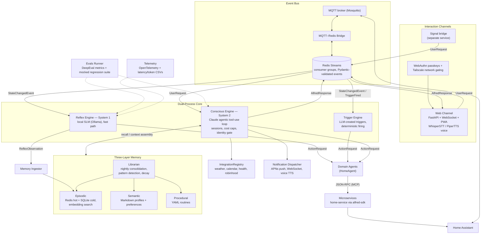

# Alfred

[](https://github.com/anirudhlath/alfred/actions/workflows/ci.yml)

An ambient, voice-first multi-agent system for smart environments. Inspired by Alfred Pennyworth.

Alfred processes real-time events from smart home devices, responds to voice and text commands, and proactively manages your environment — all while maintaining the demeanor of a proper English butler.

**What can Alfred do?** See the [Product Requirements Document](docs/PRD.md) — vision, product principles, and a maintained catalog of every capability with its current status.

## Architecture

Alfred uses a **dual-process cognitive model**:

- **System 1 (Reflex Engine)** — a local SLM (Ollama) handles the fast path. State-change events pass through the SLM in sub-500ms to decide whether an action is needed.
- **System 2 (Conscious Engine)** — Claude handles complex reasoning, multi-step planning, and conversational requests via an agentic tool-use loop.



### Four Pillars

1. **Proactivity** — triggers are created dynamically by the LLM, never hardcoded
2. **Decoupling** — microservices are sovereign apps; `alfred-sdk` is the only bridge
3. **Deterministic Communication** — all inter-agent messages are Pydantic-validated JSON
4. **Stateful Memory** — three-layer biologically-inspired memory with nightly Librarian consolidation

### Components

| Component | Purpose | Entry Point |
|-----------|---------|-------------|
| MQTT-Redis Bridge | Edge transport adapter | `python -m bus` |
| Reflex Engine | System 1 fast path (SLM) | `python -m core.reflex` |
| Trigger Engine | Proactive automation | `python -m core.triggers` |
| Conscious Engine | System 2 reasoning (Claude) | `python -m core.conscious` |
| Web Channel | FastAPI + WebSocket server | `python -m core.channels` |
| Librarian | Nightly memory consolidation | `python -m core.librarian` |
| Unified Runner | Multi-process supervisor | `python -m runner` |

### Memory System

- **Episodic** — Redis (hot) + SQLite (cold) with embedding-based semantic search
- **Semantic** — Markdown profiles and preferences (read-only at runtime)
- **Procedural** — YAML routines encoding learned behavioral sequences

### Integrations

Weather (Open-Meteo), Apple Calendar (CalDAV), Apple Health, Robinhood — all registered via `IntegrationRegistry` with decorator-based discovery.

### Interaction Channels

- **Web PWA** — chat + voice via WebSocket
- **Voice** — WhisperSTT (local) + PiperTTS (local)
- **Signal** — separate bridge service (not yet public)

## Setup

### Prerequisites

- A container runtime — Docker, Apple `container` (macOS), or Podman. `alfredctl`
  auto-detects whichever is on `PATH`.
- [`alfred-home-service`](https://github.com/anirudhlath/alfred-home-service) cloned as
  a sibling directory (`../home-service` relative to this repo, not yet public) — the
  image build stages both repos together.
- Inference for the two engines: `OPENROUTER_API_KEY` (or `CLAUDE_API_KEY`) in `.env`
  for the Conscious Engine, and/or a local [Ollama](https://ollama.com) install for the
  Reflex Engine (e.g. `ollama pull gpt-oss:20b`). `uv run alfredctl up` reaches host
  Ollama automatically via the injected gateway host — it rewrites `OLLAMA_HOST` in
  your `.env` for you. The `docker compose` path below does **not** do this rewrite
  (see the compose snippet).

### Quickstart

```bash
git clone https://github.com/anirudhlath/alfred && cd alfred
uv venv --python 3.13 && uv pip install -e ".[dev]"
uv run alfredctl up --mode seed     # builds the image, starts everything, prints the URL
```

`--mode` picks the data lifecycle:

| Mode | Use case | State |
|------|----------|-------|
| `persistent` (default) | Production / self-hosting | Survives restarts |
| `ephemeral` | Worktree / PR testing | Thrown away on teardown |
| `seed` | Demo / QA | `ephemeral` + dummy fixtures pre-loaded |

Other commands: `uv run alfredctl down`, `logs -f`, `shell`, `urls`, and `smoke` (boots
seed mode, health-checks it, tears it down — the containerized equivalent of the smoke
test below). See [`docs/containerization.md`](docs/containerization.md) for the full
command reference and troubleshooting.

For production (a Docker Compose host), build once and run the compose-of-one instead:

```bash
cp .env.example .env   # fill in OPENROUTER_API_KEY / CLAUDE_API_KEY, HA_TOKEN, etc. —
                        # env_file: .env is required, compose fails without it
uv run alfredctl build --tag alfred:latest
ALFRED_SECRETS_PASSPHRASE=... docker compose up -d
```

Unlike `alfredctl up`, plain `docker compose` passes your `.env` through **untouched** —
if you're running Ollama on the host, set `OLLAMA_HOST=http://host.docker.internal:11434`
in `.env` yourself (the compose file's `extra_hosts` entry makes that hostname resolve
inside the container; `localhost`/`127.0.0.1` in `.env` would otherwise point at the
container itself).

### Native (non-container) dev

`uv run python -m runner` also runs directly against your own Redis Stack + Mosquitto —
no container, no wrapper script required.

```bash
uv sync --extra dev        # core + dev tooling
uv sync --all-extras       # everything (voice, integrations, memory, evals)

# Or pick extras individually
uv sync --extra dev --extra voice         # WhisperSTT + PiperTTS
uv sync --extra dev --extra integrations  # Calendar, Robinhood
uv sync --extra dev --extra memory        # Sentence transformers, sqlite-vec
uv sync --extra dev --extra evals         # DeepEval
```

```bash
# With Redis Stack + Mosquitto already running:
cd ../home-service && uv run uvicorn app.server:app --port 8000   # separate repo
uv run python -m runner                                            # all Alfred services
```

Or run services individually:

```bash
uv run python -m bus              # MQTT-Redis bridge
uv run python -m core.reflex     # Reflex Engine
uv run python -m core.triggers   # Trigger Engine
uv run python -m core.conscious  # Conscious Engine
uv run python -m core.channels   # Web channel + PWA
```

### Smoke Test

```bash
bash scripts/smoke-test.sh    # native — requires the stack already running
uv run alfredctl smoke        # containerized — boots seed mode, verifies, tears down
```

## Evals

```bash
uv run python -m evals run                  # System 1 (requires Ollama)
uv run python -m evals regression           # System 1 regression (mocked, CI-safe)
uv run python -m evals conscious            # System 2 (dry-run)
uv run python -m evals demo                 # Good Morning end-to-end demo
uv run python -m evals run -n 5             # Repeat 5x with aggregate stats
uv run python -m evals compare <run1> <run2> # Compare two runs
```

## Development

```bash
# Lint + format
uv run ruff check . --fix
uv run ruff format .

# Type check
uv run mypy bus/ core/ domains/ evals/ runner/ sdk/ shared/ telemetry/

# Tests
uv run pytest
```

## Configuration

All configuration via environment variables (`.env` file auto-loaded):

| Variable | Default | Description |
|----------|---------|-------------|
| `REDIS_HOST` | `localhost` | Redis server |
| `REDIS_PORT` | `6379` | Redis port |
| `MQTT_HOST` | `localhost` | MQTT broker |
| `MQTT_PORT` | `1883` | MQTT port |
| `OLLAMA_HOST` | `http://localhost:11434` | Ollama API |
| `OLLAMA_MODEL` | `gpt-oss:20b` | SLM model |
| `HA_HOST` | `http://homeassistant.local:8123` | Home Assistant |
| `HA_TOKEN` | — | HA access token |

## Related Repos

- [`alfred-home-service`](https://github.com/anirudhlath/alfred-home-service) — Home Assistant wrapper microservice built on `alfred-sdk`
- [`alfred-ios`](https://github.com/anirudhlath/alfred-ios) — SwiftUI voice + chat companion app
- `alfred-signal-bridge` — Signal messaging channel (not yet public)

## License

[AGPL-3.0-or-later](LICENSE) © 2025–2026 Anirudh Lath

Briefly published under MIT during initial release prep (July 13–15, 2026); relicensed to AGPL-3.0-or-later on 2026-07-15. Contributions require a one-time [CLA](CLA.md) signature and a per-commit [DCO](CONTRIBUTING.md) sign-off.

<!-- protection smoke test: ci-ok ruleset gate verification (task 13) -->
