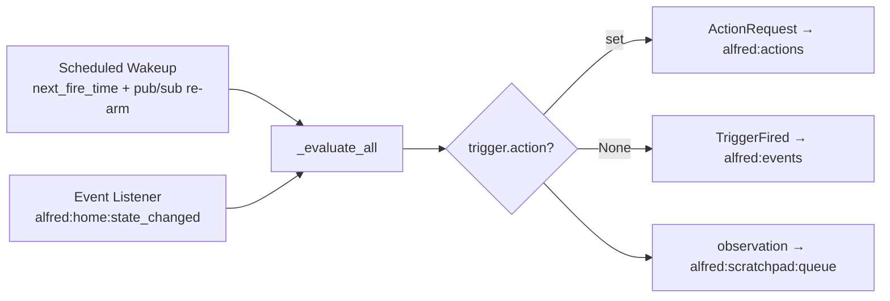

# Core — Alfred OS

This directory contains Alfred's brain:

## Reflex (`reflex/`) — System 1 SLM Engine

Fast event → action loop via local SLM (Ollama).

- `engine.py` — SLM inference with dynamic tool prompt + TriggerFired reasoning
- `tool_registry.py` — Reads tool manifests from Redis `alfred:tool_registry`
- `runner.py` — Event loop orchestration + `ensure_consumer_group()` + `publish_observation()` utilities
- `__main__.py` — Two consumer loops: (1) `HOME_STATE_STREAM` for StateChanged, (2) `EVENTS_STREAM` for TriggerFired (group `reflex-trigger-fired`)
- TriggerFired handling: Path A (notification) fires first, Path B (SLM reasoning) is isolated — SLM failures never block notification delivery

## Memory (`memory/`) — Three-Layer System

Episodic + semantic + procedural, biologically inspired.

- `embedding_provider.py` — EmbeddingProvider ABC + SentenceTransformer (lazy-loaded, async via to_thread)
- `vector_store.py` — VectorStore ABC with dual-embedding search (content + semantic key) + `update_metadata()` for retrieval stats
- `redis_vector_store.py` — Hot store (RediSearch HNSW), uses CONTEXT_INDEX/CONTEXT_PREFIX
- `sqlite_vec_store.py` — Cold store (sqlite-vec), with v1→v2 migration
- `significance.py` — SignificanceScorer: 4 dims (safety/novelty/personal/emotional)
- `context_index.py` — ContextIndexManager: unified search across all memory types, owns RedisVectorStore
- `episodic/memory.py` — EpisodicMemory: hot+cold unified interface
- `schemas.py` — Memory-specific Pydantic models
- `routines/patterns.py` — `match_trigger_pattern()`: shared by engine + librarian
- `ingestor.py` — Memory Ingestor (hippocampus): consumes `ReflexObservation` from `REFLEX_OBSERVATIONS_STREAM`, writes to `EpisodicMemory` via `SignificanceScorer`
- `ingestor_main.py` — Entry point for Memory Ingestor service (`python -m core.memory.ingestor_main`)

## Triggers (`triggers/`) — Dynamic Trigger Engine

Proactive actions created by LLM at runtime.

- `models.py` — BaseTrigger ABC, ActionPayload, TriggerContext
- `registry.py` — TriggerRegistry (decorator-based type registration)
- `types/` — Concrete trigger types (time, sensor, composite)
- `store.py` — Redis CRUD + YAML snapshot/rehydration
- `engine.py` — Evaluation loops and fire logic
- `feature.py` — TriggerFeature (CRUD tools via BaseFeature)
- `server.py` — HTTP endpoint for tool dispatch (port 8001, retry on EADDRINUSE)

### Trigger Engine Data Flow



### Key Patterns
- New trigger types: subclass `BaseTrigger`, define `Conditions` model, implement `evaluate()`, decorate with `@TriggerRegistry.register_type("name")`
- Storage: Redis hash `alfred:triggers` (primary) + YAML snapshots in `core/memory/triggers/` (gitignored)
- CRUD exposed via `TriggerFeature(BaseFeature)` with dynamic tool descriptions from `TriggerRegistry.build_conditions_docs()`

## Conscious (`conscious/`) — System 2 Cloud LLM

Agentic tool-use loop with parallel execution (`asyncio.gather`).

- `engine.py` — Full reasoning loop: budget check → involuntary recall → tool dispatch → response
- `context_assembler.py` — Two-stage: involuntary recall (auto semantic search) + deliberate recall (memory tools)
- `memory_tools.py` — Internal tools: `recall_memories`, `get_live_state` (dispatched in-process, NOT via SDK/ToolRegistry)
- `cost.py` — Daily cap tracking, 80% alert via NotificationPublisher
- `identity.py` — Signal phone + local-claim trust (confidence=0.7) for web_pwa, voice, and ios channels
- `session.py` — Redis-backed sessions, 30min timeout
- `prompts/` — System prompt templates

### Tool Dispatch (4 categories)
1. Integration tools (prefix `integration_`) → `IntegrationRegistry.execute()`
2. Trigger tools → in-process `TriggerFeature` methods
3. Memory tools (prefix `memory_`) → in-process `dispatch_memory_tool()`
4. Domain tools → `DomainRouter` to external services
- `__main__.py` runs a 15-min background loop (`asyncio.wait_for`) for proactive routine suggestions; ignored suggestions have confidence decremented over time

## Voice (`voice/`) — Voice I/O

- `stt.py` — WhisperSTT (faster-whisper CTranslate2, model: `large-v3-turbo`, beam_size=5, accepts `audio_format` param)
- `tts.py` — PiperTTS (ONNX local, `en_GB-alan-medium` voice, auto-downloads from HuggingFace)
- `models/` — Voice data models
- `speaker_id.py` — Speaker identification stub (returns `unknown`, confidence=0.0)

## Librarian (`librarian/`) — Memory Consolidation

- `consolidator.py` — Two-call LLM pipeline: (1) analysis (entities + significance + semantic keys), (2) consolidation (conflict resolution + pattern detection + routine lifecycle + contextual decay)
- `scheduler.py` — Periodic scheduler wired into conscious process (1hr default, `LIBRARIAN_INTERVAL_SECONDS` env var)
- Scratchpad drain: atomic RENAME prevents race; processing key survives crashes for recovery
- Conflict resolution: requires >=5 observations over >=14 days to contradict existing preference
- Decay formula is subtractive: `age_factor - significance*2 - recency*1.5 - frequency*1.0` — high significance/recency/frequency resists cold migration
- Compression at cold migration: groups entries by entity+date, LLM summarization, writes summary to cold, marks originals `compressed="yes"`
- Routine indexing: detected routines indexed into `idx:context` on detection, removed on archive

## Channels (`channels/`) — User-Facing I/O

- `web_server.py` — FastAPI + WebSocket on port 8081, STT/TTS loaded off the event loop (async getters + background warmup, `asyncio.to_thread` for transcribe/synthesize), onboarding wizard, session persistence, iOS channel support, device registration, trusted network auth
- `signal_bridge/` — Signal CLI subprocess, forwards inbound → `USER_REQUESTS_STREAM`, outbound via adapter
- `__main__.py` — Port retry (5 attempts on EADDRINUSE with exponential backoff)

## Notifications (`notifications/`) — Proactive System

- `schema.py` — `Urgency` enum, `Notification` model, `DNDStatus` model
- `dispatcher.py` — DND check → defer or publish to dispatch stream
- `delivery.py` — Stream consumer delivers via local `ChannelRegistry` adapters
- `dnd.py` — DNDChecker (manual Redis key + calendar meeting detection)
- `channels.py` — `ChannelAdapter` ABC + `ChannelRegistry` (decorator-based registration)
- `publisher.py` — Public API (thin facade over dispatcher)
- `adapters/` — Signal, WebSocket, APNs concrete adapters (Voice adapter exists but is not loaded in channels process; TTS for URGENT notifications is handled inline by the WebSocket adapter)

### Notification Data Flow


## Integrations (`integrations/`) — External Data Sources

- `base.py` — `Integration` ABC (`get_capabilities()`, `execute()`, `health_check()`), `CredentialSchema`, `IntegrationResult`
- `registry.py` — `@IntegrationRegistry.register()` decorator, lazy instantiation, keyring auto-population
- 4 adapters: `weather.py` (Open-Meteo, free), `apple_calendar.py` (CalDAV + iCal), `apple_health.py`, `robinhood.py`
- Exposed as OpenAI function-calling tools to Conscious Engine

## Running

```bash
uv run python -m core.reflex     # Reflex Runner (System 1)
uv run python -m core.triggers   # Trigger Engine
uv run python -m core.conscious  # Conscious Engine (System 2)
uv run python -m core.channels   # Web + Signal channels
```

**Dynamic tools:** Reflex Runner starts even with no tools registered — tools are discovered dynamically via a 5-minute TTL cache (call `engine.reload_tools()` to force refresh).

## Gotchas

- Memory tools are INTERNAL — dispatched in-process, NOT via BaseFeature/SDK/ToolRegistry
- `ContextIndexManager.search_text()` embeds query internally — callers don't need separate EmbeddingProvider
- `SentenceTransformerProvider._load()` is thread-safe and blocks on first call — services warm it via `core/warmup.py` (`start_warmup()`) background tasks at startup
- Trigger type modules must be imported before use to trigger `@TriggerRegistry.register_type()` decorators
- Channel adapter modules must be imported to trigger `@ChannelRegistry.register()` decorators
- Web server uses `_FAILED` sentinel to avoid repeated import failures on lazy-load
- Signal bridge expects `signal-cli` binary in PATH
- Piper TTS auto-downloads voice models from HuggingFace on first use
- TriggerStore coherence is pub/sub (`alfred:triggers:changed`) — never mutate `alfred:triggers` without going through TriggerStore
- User timezone lives at `alfred:user:timezone` via `shared/usertime.py` — resolution stored → `ALFRED_TIMEZONE` → UTC

See `.claude/rules/core/` for component-specific constraints.
