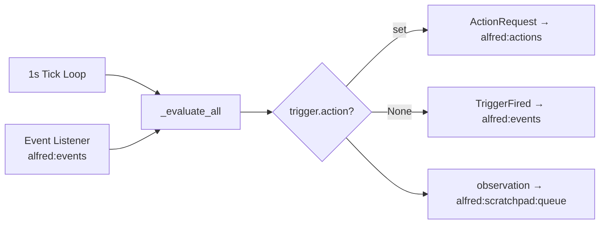
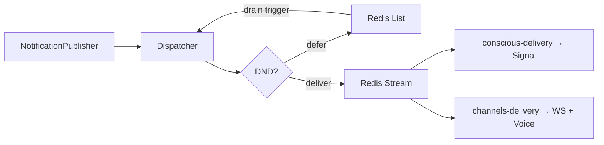

# Core — Alfred OS

This directory contains Alfred's brain:
- `reflex/` — System 1 SLM engine (fast event → action loop)
  - `engine.py` — SLM inference with dynamic tool prompt + TriggerFired reasoning
  - `tool_registry.py` — Reads tool manifests from Redis `alfred:tool_registry`
  - `runner.py` — Event loop orchestration
  - `__main__.py` runs two consumer loops: (1) `HOME_STATE_STREAM` for StateChanged, (2) `EVENTS_STREAM` for TriggerFired (group `reflex-trigger-fired`)
  - TriggerFired handling: Path A (notification) fires first, Path B (SLM reasoning) is isolated — SLM failures never block notification delivery
- `memory/` — Markdown preferences + scratchpad
- `triggers/` — Dynamic trigger engine (proactive actions)
  - `models.py` — BaseTrigger ABC, ActionPayload, TriggerContext
  - `registry.py` — TriggerRegistry (decorator-based type registration)
  - `types/` — Concrete trigger types (time, sensor, composite)
  - `store.py` — Redis CRUD + YAML snapshot/rehydration
  - `engine.py` — Evaluation loops and fire logic
  - `feature.py` — TriggerFeature (CRUD tools via BaseFeature)
  - `server.py` — HTTP endpoint for tool dispatch

### Trigger Engine Data Flow



### Key Patterns
- New trigger types: subclass `BaseTrigger`, define `Conditions` model, implement `evaluate()`, decorate with `@TriggerRegistry.register_type("name")`
- Storage: Redis hash `alfred:triggers` (primary) + YAML snapshots in `core/memory/triggers/` (gitignored)
- CRUD exposed via `TriggerFeature(BaseFeature)` with dynamic tool descriptions from `TriggerRegistry.build_conditions_docs()`
- `conscious/` — System 2 cloud LLM (Phase 3)
- `voice/` — Voice I/O adapters (Phase 3)
- `librarian/` — Nightly preference consolidation (Phase 3)
- `notifications/` — Proactive notification system
  - `schema.py` — `Urgency` enum, `Notification` model, `DNDStatus` model
  - `dispatcher.py` — DND check → defer or publish to dispatch stream
  - `delivery.py` — Stream consumer that delivers via local `ChannelRegistry` adapters
  - `dnd.py` — DNDChecker (manual Redis key + calendar meeting detection)
  - `channels.py` — `ChannelAdapter` ABC + `ChannelRegistry` (decorator-based registration)
  - `publisher.py` — Public API (thin facade over dispatcher)
  - `adapters/` — Signal, WebSocket, Voice concrete adapters

### Notification Data Flow



## Running

```bash
uv run python -m core.reflex  # starts the Reflex Runner
uv run python -m core.triggers  # starts the Trigger Engine
```

**Fail-fast:** Runner exits with RuntimeError if no tools are registered in Redis.
Tools and system prompt are cached after first event (call `engine.reload_tools()` to refresh).

See path-scoped rules in .claude/rules/core/ for component-specific constraints.
