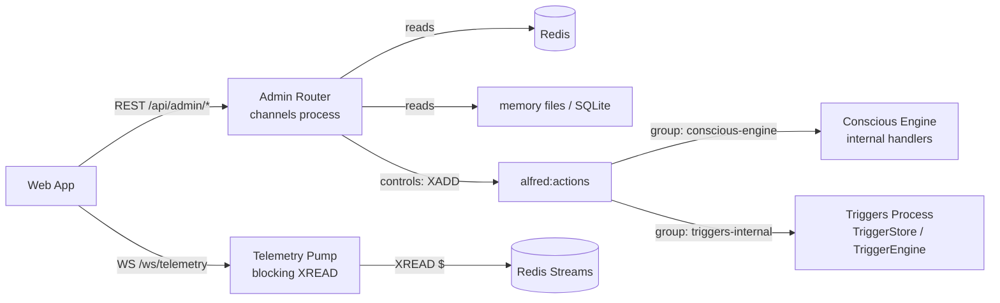

# Alfred Admin API

## Overview

The Admin API is a FastAPI router mounted on the channels process (port 8081) that gives
the web app its Mission Control view. It is entirely separate from the user-facing chat/voice
WebSocket — it is purely for observability and curated operational controls.

Two concerns:

- **Read-only observability** — stream history with cursor pagination, memory snapshots
  (episodic, semantic, routines, scratchpad), trigger state, deferred notifications,
  active sessions, registered devices, and a combined system overview.
- **Curated controls** — a small set of operations that mirror what the system already
  does internally (set DND, drain deferred notifications, run the Librarian, enable/disable
  or manually fire a trigger, end a session).

All routes share the `/api/admin` prefix and are served by the same `core.channels` process
that handles chat WebSocket connections on port 8081.

---

## Auth Model

Every admin endpoint enforces **both** of the following FastAPI dependencies — missing either
results in an error before any Redis/disk access.

| Dependency | Gate | Error |
|---|---|---|
| `require_trusted_network` | Caller's IP must be localhost (`127.0.0.1` / `::1`) or in the Tailscale CGNAT range (`100.64.0.0/10`) | HTTP 403 |
| `require_authenticated` | `AuthCookieMiddleware` must have marked `request.state.authenticated = True` via a valid `alfred_auth` session cookie | HTTP 401 |

Both dependencies are applied at router creation time:

```python
router = APIRouter(
    prefix="/api/admin",
    dependencies=[Depends(trusted_network_dep), Depends(require_authenticated)],
)
```

The `trusted_network_dep` is injected at mount time from `web_server.py` so the same
`require_trusted_network` function handles both admin and credential endpoints.

### Telemetry WebSocket Auth

`/ws/telemetry` uses `authenticate_ws_cookie(websocket, redis)` — the same helper used by
the main `/ws` endpoint. Because `BaseHTTPMiddleware` does not run for WebSocket upgrade
requests, the cookie is parsed manually from the `cookie` header. An unauthenticated
connection is closed with **code 4001** (not 401 — WS close codes are numeric):

```python
if not await authenticate_ws_cookie(websocket, r):
    await websocket.close(code=4001, reason="Authentication required")
    return
```

---

## Endpoint Reference

### Overview

| Method | Path | Purpose |
|---|---|---|
| `GET` | `/api/admin/overview` | Combined system health snapshot |

Returns a single JSON object with:

- `redis.connected` — bool, from a `PING` probe
- `cost` — current `alfred:cost:daily` value (JSON object) or `null` if unset
- `dnd` — current `alfred:memory:dnd` value, defaulting to `{"active": false}`
- `counts.sessions` — number of active `alfred:sessions:*` keys (scan-based)
- `counts.devices` — `HLEN alfred:push:devices`
- `counts.deferred` — `LLEN alfred:notifications:deferred`
- `counts.triggers` — `HLEN alfred:triggers`
- `streams` — same payload as `GET /api/admin/streams`
- `inference.ollama` — bool: probe `{OLLAMA_HOST}/api/tags` returns < 500
- `inference.lmstudio` — bool: probe `{LMSTUDIO_HOST}/v1/models` returns < 500

Inference probes use the lifespan-owned `httpx.AsyncClient` (`request.app.state.http`).
In tests (no lifespan) the client is absent and both bools are deterministically `false`.

---

### Streams

| Method | Path | Purpose |
|---|---|---|
| `GET` | `/api/admin/streams` | Length + recency for all catalog streams |
| `GET` | `/api/admin/streams/{name}` | Paginated history for a named stream |

**Stream names** (from `STREAM_CATALOG` in `core/channels/stream_catalog.py`):

| Name | Redis key |
|---|---|
| `events` | `alfred:events` |
| `actions` | `alfred:actions` |
| `user_requests` | `alfred:user:requests` |
| `user_responses` | `alfred:user:responses` |
| `reflex_observations` | `alfred:reflex:observations` |
| `notifications` | `alfred:notifications:dispatch` |
| `home_state` | `alfred:home:state_changed` |
| `home_action_results` | `alfred:home:action_results` |

**`GET /api/admin/streams`** returns one entry per catalog stream:

```json
{
  "events": {"length": 1042, "last_id": "1749600000000-0", "last_ts": 1749600000.0},
  "actions": {"length": 87, "last_id": "1749599990000-0", "last_ts": 1749599990.0}
}
```

Missing streams (stream key does not exist in Redis yet) report `{"length": 0, "last_id": null, "last_ts": null}` — never raises.

**`GET /api/admin/streams/{name}`** parameters:

| Parameter | Default | Constraint |
|---|---|---|
| `count` | `50` | Clamped to `[1, 200]` |
| `before` | (none) | Must match `\d+-\d+` if supplied; **400** otherwise |

The endpoint calls `XREVRANGE key (before +` with `count` limit (newest-first).
`decode_entry` is applied to each raw Redis entry — it unwraps the primary JSON payload
field (`event` for most streams, `notification` for the dispatch stream) so callers
receive the deserialized event object, not a raw JSON string.

Response:

```json
{
  "entries": [
    {"id": "1749600000000-0", "event": {"event_type": "trigger_fired", ...}},
    {"id": "1749599990000-0", "event": {"event_type": "action_request", ...}}
  ],
  "next_before": "1749599990000-0"
}
```

**Cursor contract:** `next_before` is the `id` of the last entry in the page when the
page is full (`len(entries) == count`); `null` when the page is shorter (no more history).
The client passes `?before=<next_before>` to fetch the next page. When the total stream
length is an exact multiple of `count`, the final request returns an empty page
(`entries: [], next_before: null`) — this is intentional standard cursor behavior.

Unknown stream names return **404**.

---

### Memory

| Method | Path | Purpose |
|---|---|---|
| `GET` | `/api/admin/memory/episodic` | Browse or search episodic memory |
| `GET` | `/api/admin/memory/semantic` | List semantic memory files with content |
| `GET` | `/api/admin/memory/routines` | List procedural routines |
| `GET` | `/api/admin/memory/scratchpad` | Scratchpad content + pending queue depth |

#### Episodic (`/memory/episodic`)

Query parameters: `q` (optional search string), `limit` (default 30, clamped to `[1, 100]`).

**Without `?q`** (recent listing):

- Hot store: scans `ctx:*` keys (RediSearch HNSW prefix), retains only entries where
  `type == "episodic"`. The `CONTEXT_PREFIX` keyspace is shared — it also holds
  `type="semantic"` and `type="routine"` entries that are filtered out here.
- Cold store: queries `episodic_entries` table in `core/memory/episodic_cold.db` ordered
  by `timestamp DESC LIMIT ?limit`.
- Returns `{"entries": hot[:limit] + cold}` where each entry carries a `"store"` field
  (`"hot"` or `"cold"`). Limit is applied **per store independently** (not merged-sorted).

**With `?q`** (vector search):

- Calls `EpisodicMemory.recall(query=q, limit=limit, update_stats=False)`.
- `update_stats=False` is critical: admin browsing must not increment retrieval counters or
  perturb the decay-relevant `retrieval_count`/`last_retrieved` fields that the Librarian
  uses to decide what stays hot vs. migrates cold.
- `EpisodicMemory` is instantiated lazily on first search (heavy sentence-transformers model
  load). If initialization fails, the endpoint returns **503**.

#### Semantic (`/memory/semantic`)

Reads all `.md` files from `core/memory/preferences/` and `core/memory/profile/` (sorted
alphabetically, dotfiles excluded). Each file entry includes `name`, `dir`, `content`, and
`modified` (ISO 8601 UTC).

#### Routines (`/memory/routines`)

Uses `RoutineStore.list_all()` (sync glob + YAML reads). The blocking I/O is offloaded via
`asyncio.to_thread()` so the channels event loop (which also serves chat WebSocket
connections) is not blocked.

#### Scratchpad (`/memory/scratchpad`)

Returns `content` (full text of `core/memory/scratchpad.md`, empty string if absent) and
`pending_queue` (`LLEN alfred:scratchpad:queue` — entries waiting to be flushed to disk by
the `ScratchpadWriter`).

---

### Triggers

| Method | Path | Purpose |
|---|---|---|
| `GET` | `/api/admin/triggers` | List all triggers from Redis |

Reads `HGETALL alfred:triggers`, deserializes each value as JSON, and returns them sorted
by `created_at` descending. Corrupt JSON values (stored by an older version of the trigger
engine) are silently skipped — never raises.

---

### Notifications

| Method | Path | Purpose |
|---|---|---|
| `GET` | `/api/admin/notifications/deferred` | List deferred notifications |

Reads the full `alfred:notifications:deferred` Redis List. Each element is a JSON-encoded
`Notification` object. Corrupt list items are skipped silently.

---

### Sessions

| Method | Path | Purpose |
|---|---|---|
| `GET` | `/api/admin/sessions` | List active sessions with metadata |
| `DELETE` | `/api/admin/sessions/{session_id}` | Terminate a session immediately |

**List sessions** scans `alfred:sessions:*` keys. For each session it fetches the hash
fields (`hgetall`), counts conversation turns from the JSON `history` field, and reads the
Redis `TTL`. Binary embedding fields (keys starting with `embedding`) are stripped before
returning. The N+1 pattern (one `hgetall+ttl` per session) is intentional — session counts
are small and this is low-frequency admin traffic.

Response per session: `session_id`, `channel`, `created_at`, `turns`, `ttl_seconds`.

**Delete session** calls `DEL alfred:sessions:{session_id}`. Returns `{"deleted": true}` if
the key existed, `{"deleted": false}` if not. Logs at INFO regardless.

---

### Devices

| Method | Path | Purpose |
|---|---|---|
| `GET` | `/api/admin/devices` | List registered APNs device tokens |

Reads `HGETALL alfred:push:devices`. Each field is a device token; each value is a JSON
object with registration metadata (channel, registered_at, etc.). Corrupt values fall back
to `{"device_token": tok}`.

---

### Controls

| Method | Path | Purpose |
|---|---|---|
| `POST` | `/api/admin/dnd` | Set or clear Do-Not-Disturb |
| `POST` | `/api/admin/notifications/drain` | Drain deferred notification queue |
| `POST` | `/api/admin/librarian/run` | Trigger an immediate Librarian consolidation |
| `POST` | `/api/admin/triggers/{trigger_id}/enabled` | Enable or disable a trigger |
| `POST` | `/api/admin/triggers/{trigger_id}/fire` | Manually fire a trigger |

All control endpoints log at INFO when they execute.

#### DND (`POST /api/admin/dnd`)

Request body:

```json
{"active": true, "until": "2026-06-11T22:00:00Z", "reason": "sleeping"}
```

- `active: false` — deletes `alfred:memory:dnd` immediately.
- `active: true` — writes `{"active": true, "until": ..., "reason": ..., "source": "manual"}`
  to `alfred:memory:dnd`. `until` and `reason` are optional.

The `NotificationDispatcher` (in the conscious process) reads this key on each dispatch
decision. There is no TTL — manual DND stays active until explicitly cleared.

#### Drain (`POST /api/admin/notifications/drain`)

Publishes an `ActionRequest` with `tool_name="drain_deferred_notifications"` to
`alfred:actions`. The conscious process's `_INTERNAL_HANDLERS` consumer picks this up and
calls `NotificationDispatcher.drain_deferred()`. Returns `{"status": "queued"}` — the drain
happens asynchronously.

#### Librarian (`POST /api/admin/librarian/run`)

Publishes an `ActionRequest` with `tool_name="run_librarian"` to `alfred:actions`. The
conscious process's `_INTERNAL_HANDLERS` consumer starts a Librarian consolidation run
immediately (outside the scheduled 1-hour cycle). Returns `{"status": "queued"}`.

#### Trigger Enabled (`POST /api/admin/triggers/{trigger_id}/enabled`)

Request body: `{"enabled": true}` or `{"enabled": false}`.

The endpoint does a **read-only** existence check against `alfred:triggers` (via `HGET`),
then publishes an `ActionRequest` (`tool_name="set_trigger_enabled"`,
`target_service="trigger-engine"`, `parameters={"trigger_id", "enabled"}`) to
`alfred:actions`. The channels process performs **no** direct hash write. **404** if the
trigger does not exist. **500** if the stored JSON is corrupt:

```json
{"detail": "Trigger 'abc123' has corrupt stored data"}
```

Response: `{"status": "queued", "trigger_id": ..., "enabled": ..., "effective_within_seconds": 60}`.

The triggers process consumes the action (group `triggers-internal`), loads the trigger from
its `TriggerStore`, and persists the toggle via `TriggerStore.save()` — which writes **both**
the Redis hash and the YAML snapshot, so the change survives a cold-start rehydration. The
consumer applies the change within ms; the `effective_within_seconds: 60` value reflects the
worst-case Trigger Engine cache-refresh window.

#### Fire Trigger (`POST /api/admin/triggers/{trigger_id}/fire`)

The endpoint does a **read-only** existence check against `alfred:triggers` (via `HGET`),
then publishes an `ActionRequest` (`tool_name="fire_trigger"`,
`target_service="trigger-engine"`, `parameters={"trigger_id"}`) to `alfred:actions`. The
channels process performs **no** stream/hash writes of its own — it does not mirror the fire
logic.

Response: `{"status": "queued", "trigger_id": ...}`.

The triggers process consumes the action (group `triggers-internal`), loads the trigger from
its `TriggerStore`, and calls the real `TriggerEngine.fire(trigger, ctx, fired_by="admin")`.
That single code path handles everything consistently:

- `trigger.action` set → publishes an `ActionRequest` to `alfred:actions`.
- `trigger.action` is `None` → publishes a `TriggerFired` event to `alfred:events`
  (with `fired_by="admin"` provenance, so downstream pattern detection can distinguish manual
  admin fires from organic engine fires).
- A scratchpad observation is written.
- One-shot triggers are deleted via `TriggerStore.delete()` (Redis + YAML snapshot).
- Non-one-shot triggers have `last_fired` persisted via `TriggerStore.save()` (Redis + YAML).

**404** if trigger not found. **500** if stored JSON is corrupt.

Because the triggers process owns `TriggerStore`, both Redis and the YAML snapshots stay
consistent — there is no cold-start drift (one-shot triggers do not resurrect, toggles do not
roll back).

---

## Telemetry WebSocket Protocol

`/ws/telemetry` provides a live fan-out of Redis stream entries to the web app. It uses a
per-connection model: a receive loop handles subscribe/unsubscribe messages while a pump task
runs blocking `XREAD` calls.

### Connection

```
GET /ws/telemetry
Upgrade: websocket
Cookie: alfred_auth=<session_id>
```

Auth is checked before `accept()`. Unauthenticated connections are closed immediately with
code **4001**.

### Client Messages (send to server)

**Subscribe:**

```json
{"type": "subscribe", "streams": ["events", "actions", "user_requests"]}
```

**Unsubscribe:**

```json
{"type": "unsubscribe", "streams": ["home_state"]}
```

Stream names must match the `STREAM_CATALOG` keys (see table above). Unknown names are
silently ignored.

### Server Messages (received by client)

**Subscribed acknowledgment** — sent after every subscribe or unsubscribe message:

```json
{"type": "subscribed", "streams": ["actions", "events", "user_requests"]}
```

The `streams` list reflects the complete current subscription set (sorted). Sent even if no
valid stream names were in the request.

**Entry** — one per new Redis stream entry across any subscribed stream:

```json
{
  "type": "entry",
  "stream": "events",
  "id": "1749600000000-0",
  "event": {"event_type": "trigger_fired", "trigger_id": "abc123", ...}
}
```

`decode_entry` is applied — the `event` field contains the deserialized payload object, not
a raw JSON string.

**Status** — sent on transient pump errors:

```json
{"type": "status", "detail": "redis_error"}
```

Followed by a 1-second backoff before the pump retries `XREAD`. The connection is kept
alive; the client can continue sending subscribe/unsubscribe messages during the backoff.

**Error** — sent when the client sends malformed JSON:

```json
{"type": "error", "message": "invalid JSON"}
```

### Cursor Semantics

The pump starts each subscribed stream at cursor `"$"` — the Redis "deliver only new entries"
sentinel. **There is no history replay on connect.** The web app receives only entries that
arrive after the subscription is established. To see history, use `GET /api/admin/streams/{name}`.

The pump updates the per-stream cursor after each delivered entry so that on temporary
`XREAD` failure (Redis blip), entries are not re-delivered.

`XREAD` blocks server-side for 2 seconds (`_XREAD_BLOCK_MS = 2000`) before returning empty.
An empty subscription set parks the pump on an `asyncio.Event` (no busy-wait) until at
least one stream is subscribed.

### Teardown

The pump task is cancelled when the receive loop exits (disconnect or error). The
`CancelledError` is suppressed after `await pump_task` so the in-flight `XREAD` unwinds
cleanly before the handler returns.

---

## Controls Execution Model

| Control | Mechanism | Who executes |
|---|---|---|
| DND set/clear | Direct `SET`/`DEL alfred:memory:dnd` | Admin API (channels process) |
| Trigger `enabled` toggle | `XADD alfred:actions` (`set_trigger_enabled`, `target_service=trigger-engine`) | Triggers process (`triggers-internal` consumer → `TriggerStore.save`) |
| Session delete | `DEL alfred:sessions:{id}` | Admin API (channels process) |
| Drain deferred notifications | `XADD alfred:actions` (`drain_deferred_notifications`) | Conscious process `_INTERNAL_HANDLERS` |
| Run Librarian | `XADD alfred:actions` (`run_librarian`) | Conscious process `_INTERNAL_HANDLERS` |
| Fire trigger | `XADD alfred:actions` (`fire_trigger`, `target_service=trigger-engine`) | Triggers process (`triggers-internal` consumer → `TriggerEngine.fire`) |

Direct Redis writes take effect immediately. `XADD`-based controls are queued into
`alfred:actions` and executed asynchronously by the owning process. The admin API returns
`{"status": "queued"}` for these and cannot report the outcome of the downstream operation.

`alfred:actions` is consumed by **multiple distinct consumer groups** — each group sees every
entry independently and acts only on entries whose `target_service` matches it (acking and
skipping the rest):

- `conscious-engine` group → `target_service="conscious-engine"` (drain, librarian, …)
- `triggers-internal` group → `target_service="trigger-engine"` (fire / enable)
- domain agents (e.g. home) → their own `target_service`



### Trigger Mutation Execution (YAML-consistent)

Trigger fire and enable/disable are owned by the **triggers process**, which holds the
authoritative `TriggerStore`. The `triggers-internal` ACTIONS_STREAM consumer:

- `fire_trigger` → `TriggerStore.get(trigger_id)` then `TriggerEngine.fire(..., fired_by="admin")`.
  This is the same code path organic engine fires use, so action-vs-`TriggerFired` branching,
  the scratchpad observation, one-shot deletion (`TriggerStore.delete`), and `last_fired`
  persistence (`TriggerStore.save`) all stay consistent. Unknown id → warn + ack.
- `set_trigger_enabled` → `TriggerStore.get`, set `enabled`, `TriggerStore.save`. Unknown id → warn + ack.

Because every mutation goes through `TriggerStore`, the Redis hash AND the YAML snapshots in
`core/memory/triggers/` stay consistent. There is **no cold-start drift**: admin-fired one-shot
triggers do not resurrect on rehydration, and enable toggles do not roll back. (This replaced
the earlier channels-process direct-hash-write approach, which only updated Redis.)

`POST .../fire` validates conditions are *not* re-evaluated: the trigger fires unconditionally
(unlike the engine's evaluate-then-fire loop). Provenance is recorded via `fired_by="admin"` on
the emitted `TriggerFired` event.

### Trigger Cache Caveat (60s delay)

The Trigger Engine keeps an in-memory cache of all triggers loaded from Redis, refreshed every
60 seconds. The consumer applies an `enabled` toggle to `TriggerStore` within ms (which also
updates the cache for triggers it owns), but the `effective_within_seconds: 60` value reflects
the worst-case window before the evaluation loop observes the change. The `fire_trigger` and
`set_trigger_enabled` action handlers automatically call `store.refresh()` on a cache miss, so
freshly-created triggers (written to Redis by the conscious process <60 s ago) are still
actionable immediately.
