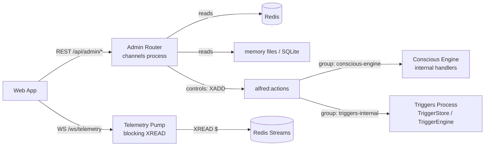

# Alfred Admin API

## Overview

The Admin API is a FastAPI router mounted on the channels process (port 8081) that gives
the web app its Mission Control view. It is entirely separate from the user-facing chat/voice
WebSocket — it is purely for observability and curated operational controls.

Two concerns:

- **Read-only observability** — stream history with cursor pagination, memory snapshots
  (episodic, semantic, routines, scratchpad), trigger state, deferred notifications,
  active sessions, registered devices, the Reflex attention set, and a combined system
  overview.
- **Curated controls** — a small set of operations that mirror what the system already
  does internally (set DND, drain deferred notifications, run the Librarian, enable/disable
  or manually fire a trigger, end a session, edit an attention domain).

All routes share the `/api/admin` prefix and are served by the same `core.channels` process
that handles chat WebSocket connections on port 8081.

---

## Auth Model

Every admin endpoint — reads and controls alike — enforces exactly one FastAPI dependency:

| Dependency | Gate | Error |
|---|---|---|
| `require_authenticated` | `AuthCookieMiddleware` must have marked `request.state.authenticated = True` via a valid `alfred_auth` session cookie | HTTP 401 |

There is deliberately **no** trusted-network gate here: the admin API is usable from the
public hostname once signed in with a passkey. The network gate (`require_trusted_network`,
HTTP 403) is reserved for endpoints that can mint or widen credentials, and it comes in
two shapes:

| Endpoints | Gates | Why |
|---|---|---|
| `PUT/DELETE /api/integrations/{name}/credentials`, `POST/DELETE /api/devices/register`, `POST /api/voice/enroll` | **both** (`_CREDENTIAL_GATES`, network first) | A caller who can write these can widen Alfred's reach, so being on the LAN/tailnet *and* signed in are both required. |
| `POST /api/auth/register/{begin,complete}` | **network or pairing code** (`_registration_gate` in `core/identity/auth_routes.py`, wrapping `trusted_network_dep` injected from `web_server.py`) | Registration is how the first session comes into existence — the first-run user has no cookie yet, so a session gate here would be unsatisfiable. Trust therefore comes from network position, or from a short-lived `X-Pairing-Code` an already-signed-in device minted. |

Removing a passkey (`DELETE /api/auth/credentials/{credential_id}`) sits on the **session
only**, like the admin surface: it neither mints nor widens a credential, so the rule above
does not reach it.

Minting the code that makes the second row's alternative possible
(`POST /api/auth/pairing`) is **session only** for a different reason — the code it hands
out *does* authorise a passkey mint from off-LAN, so the rule would reach it. Requiring the
LAN here would defeat the point: the signed-in device doing the minting is often the one
that is away. What stands in for the network half is the code's own budget — it must be
presented on **both** `register/begin` and `register/complete`, it lives 5 minutes, it is
consumed the moment the passkey is saved, and ten wrong guesses from one client address —
a single IPv4 address or an IPv6 /64 — refuse that client for the rest of its 5-minute counter — the code itself stays live for
everyone else, so a stranger cannot deny pairing to the device that is waiting.

See [`webauthn.md` → Sessions, passkeys and pairing](webauthn.md) for that whole surface.

The dependency is applied at router creation time:

```python
router = APIRouter(
    prefix="/api/admin",
    dependencies=[Depends(require_authenticated)],
)
```

### Telemetry WebSocket Auth

`/ws/telemetry` calls `require_ws_auth(websocket, redis)` from `core/identity/ws_auth.py`
— the same helper the main `/ws` endpoint uses. It owns the whole handshake:

```python
if not await require_ws_auth(websocket, r):
    return
```

Inside, it **accepts the socket first**, then authenticates, and closes with **code 4001**
(not 401 — WS close codes are numeric) if the session is missing or invalid. The ordering
is load-bearing: closing before accepting surfaces to the browser as a plain HTTP 403 on
the upgrade with no close code, so the client never sees 4001 and reconnects forever.
Authentication itself is `authenticate_ws_cookie()`, which parses the `alfred_auth` cookie
straight out of the `cookie` header — `BaseHTTPMiddleware` does not run for WebSocket
upgrades — and checks the `alfred:auth:{session_id}` hash in Redis.

`/ws/telemetry` is **not** network-gated, matching the admin REST surface above.

---

## Endpoint Reference

### Overview

| Method | Path | Purpose |
|---|---|---|
| `GET` | `/api/admin/overview` | Combined system health snapshot |

Returns a single JSON object with:

- `redis.connected` — bool, from a `PING` probe
- `cost` — current `alfred:cost:daily` value (JSON object) or `null` if unset. The blob is written only on spend, so before the day's first `record_spend` it is the previous day's state (check `date`); `request_count` (calls billed today) and `avg_usd` (spend per call) are absent entirely from state written before the upgrade — treat both as optional
- `dnd` — current `alfred:memory:dnd` value, defaulting to `{"active": false}`
- `counts.sessions` — number of active `alfred:sessions:*` keys (scan-based)
- `counts.devices` — `HLEN alfred:push:devices`
- `counts.deferred` — `LLEN alfred:notifications:deferred`
- `counts.triggers` — `HLEN alfred:triggers`
- `streams` — same payload as `GET /api/admin/streams`
- `inference.ollama` — bool: probe `{OLLAMA_HOST}/api/tags` returns < 500
- `inference.lmstudio` — bool: probe `{LMSTUDIO_HOST}/v1/models` returns < 500
- `reflex.model` — the model the Reflex Engine decides with: `OPENAI_COMPAT_MODEL` when `REFLEX_BACKEND=openai`, `OLLAMA_MODEL` when it is `ollama` (both matched case-insensitively after stripping, as the dispatcher does). `null` when that backend's model is unconfigured **or** when `REFLEX_BACKEND` names a backend the dispatcher does not accept — `core/reflex/inference.py` raises on those, so no model runs at all, and the overview mirrors its `REFLEX_BACKENDS` set rather than retyping it
- `reflex.last_ms` — decision latency of the newest `reflex_observations` entry, in ms, rounded to 0.1 ms
- `reflex.p50_ms` — median of those latencies over the newest 20 observations, in ms, rounded to 0.1 ms
- `librarian.last_run_at` — ISO timestamp of the Librarian's last pass, or `null` before its first run
- `librarian.reviewed` — int: scratchpad lines drained on that pass (`len(lines)` in `consolidator.py`, not a count of memories written), or `null` when unset or non-numeric
- `librarian.next_run_at` — ISO timestamp of the next scheduled pass, or `null` when none is scheduled
- `session.idle_minutes` — `SESSION_TIMEOUT_MINUTES`: how long a chat session survives without a turn. Config, not Redis, so it is present on the degraded path too. Served so the web client can window the Room to the current session without hard-coding 30

Inference probes use the lifespan-owned `httpx.AsyncClient` (`request.app.state.http`).
In tests (no lifespan) the client is absent and both bools are deterministically `false`.

Reflex latency is derived, not stored: each observation stamps its own `timestamp` and carries
the originating event under `trigger_event.timestamp`, so the difference is how long the engine
took to decide. The overview reads the newest 20 with one `XREVRANGE`; entries that don't parse
(and mixed naive/aware timestamps, which can't be subtracted) are skipped, and `last_ms`/`p50_ms`
are both `null` when nothing usable remains or the stream is unreadable.

The `librarian.*` fields come from the `alfred:librarian:status` hash. `last_run_at` and
`reviewed` are written by the consolidator at the end of each pass (`_record_run`); `next_run_at`
is written by `LibrarianScheduler.run` — once at startup, so the stamp is not left holding the
previous process's value while the first cycle runs, and again after every cycle. A missing hash
or a failed read yields all three as `null` rather than an error.

---

### Streams

| Method | Path | Purpose |
|---|---|---|
| `GET` | `/api/admin/streams` | Length, recency + 5-minute rate for all catalog streams |
| `GET` | `/api/admin/streams/{name}` | Paginated history for a named stream |

**Stream names** (from `STREAM_CATALOG` in `core/channels/stream_catalog.py`):

| Name | Redis key |
|---|---|
| `events` | `alfred:events` |
| `actions` | `alfred:actions` |
| `user_requests` | `alfred:user:requests` |
| `user_responses` | `alfred:user:responses` |
| `reflex_observations` | `alfred:reflex:observations` |
| `notifications` | `alfred:notifications:dispatch` |
| `home_state` | `alfred:home:state_changed` |
| `home_action_results` | `alfred:home:action_results` |

**`GET /api/admin/streams`** returns one entry per catalog stream:

```json
{
  "events": {"length": 1042, "last_id": "1749600000000-0", "last_ts": 1749600000.0, "rate_5m": 1.234},
  "actions": {"length": 87, "last_id": "1749599990000-0", "last_ts": 1749599990.0, "rate_5m": 0.0}
}
```

Missing streams (stream key does not exist in Redis yet) report `{"length": 0, "last_id": null, "last_ts": null, "rate_5m": 0.0}` — never raises.

`rate_5m` is entries per second over the trailing 300 seconds, measured with one bounded
`XREVRANGE key + {now-300s} COUNT 100` per stream (`_RATE_SAMPLE_SIZE` in
`core/channels/stream_catalog.py`). Fewer than 100 entries come back → the scan was not
truncated, the sample is the whole window, and the figure is exact (`n / 300`). Exactly 100
come back → the window holds at least that many, so the rate is **extrapolated**:
`100 / (now - oldest_sampled_ts)`, which is how a busy stream reports its real rate rather
than saturating. A full sample spanning no time — or one whose oldest entry id will not
parse — falls back to the window (`100 / 300`), the floor of the estimate. `0.0` covers both
an idle stream and any Redis failure.

The extrapolated denominator runs to **now**, not to the newest sampled entry, so a quiet
stretch after a burst is counted against the rate. That is deliberate: a stream that fired
100 entries and then stopped decays toward zero as the silence grows, instead of reporting
the burst's rate until those entries age out of the window. **For client authors:** once the
sample fills, `rate_5m` tracks the interval the newest 100 entries span up to now, so it
responds faster — in both directions — than a flat 300-second mean would. Two polls a few
seconds apart can legitimately differ on an unchanged stream; render it as a live rate, not
as a stable five-minute average.

**`GET /api/admin/streams/{name}`** parameters:

| Parameter | Default | Constraint |
|---|---|---|
| `count` | `50` | Clamped to `[1, 200]` |
| `before` | (none) | Must match `\d+-\d+` if supplied; **400** otherwise |

The endpoint calls `XREVRANGE key (before +` with `count` limit (newest-first).
`decode_entry` is applied to each raw Redis entry — it unwraps the primary JSON payload
field (`event` for most streams, `notification` for the dispatch stream) so callers
receive the deserialized event object, not a raw JSON string.

Response:

```json
{
  "entries": [
    {"id": "1749600000000-0", "event": {"event_type": "trigger_fired", ...}},
    {"id": "1749599990000-0", "event": {"event_type": "action_request", ...}}
  ],
  "next_before": "1749599990000-0"
}
```

**Cursor contract:** `next_before` is the `id` of the last entry in the page when the
page is full (`len(entries) == count`); `null` when the page is shorter (no more history).
The client passes `?before=<next_before>` to fetch the next page. When the total stream
length is an exact multiple of `count`, the final request returns an empty page
(`entries: [], next_before: null`) — this is intentional standard cursor behavior.

Unknown stream names return **404**.

---

### Memory

| Method | Path | Purpose |
|---|---|---|
| `GET` | `/api/admin/memory/episodic` | Browse or search episodic memory |
| `GET` | `/api/admin/memory/semantic` | List semantic memory files with content |
| `GET` | `/api/admin/memory/routines` | List procedural routines |
| `GET` | `/api/admin/memory/scratchpad` | Scratchpad content + pending queue depth |

#### Episodic (`/memory/episodic`)

Query parameters: `q` (optional search string), `limit` (default 30, clamped to `[1, 100]`).

**Without `?q`** (recent listing):

- Hot store: scans `ctx:*` keys (RediSearch HNSW prefix), retains only entries where
  `type == "episodic"`. The `CONTEXT_PREFIX` keyspace is shared — it also holds
  `type="semantic"` and `type="routine"` entries that are filtered out here.
- Cold store: queries `episodic_entries` table in `core/memory/episodic_cold.db` ordered
  by `timestamp DESC LIMIT ?limit`.
- Returns `{"entries": hot[:limit] + cold}` where each entry carries a `"store"` field
  (`"hot"` or `"cold"`). Limit is applied **per store independently** (not merged-sorted).

**With `?q`** (vector search):

- Calls `EpisodicMemory.recall(query=q, limit=limit, update_stats=False)`.
- `update_stats=False` is critical: admin browsing must not increment retrieval counters or
  perturb the decay-relevant `retrieval_count`/`last_retrieved` fields that the Librarian
  uses to decide what stays hot vs. migrates cold.
- `EpisodicMemory` is instantiated lazily on first search (heavy sentence-transformers model
  load). If initialization fails, the endpoint returns **503**.

#### Semantic (`/memory/semantic`)

Reads all `.md` files from `core/memory/preferences/` and `core/memory/profile/` (sorted
alphabetically, dotfiles excluded). Each file entry includes `name`, `dir`, `content`, and
`modified` (ISO 8601 UTC).

#### Routines (`/memory/routines`)

Uses `RoutineStore.list_all()` (sync glob + YAML reads). The blocking I/O is offloaded via
`asyncio.to_thread()` so the channels event loop (which also serves chat WebSocket
connections) is not blocked.

Each routine carries `confidence_history` — a list of floats, oldest first, newest last,
capped at the **8 newest**. The Librarian appends one sample per lifecycle cycle
(`_append_confidence` in `core/librarian/consolidator.py`, rounded to 4 decimals), which is
what the Triggers bench renders as a sparkline. The cap is enforced both on append and on
load, so a hand-edited or legacy YAML file with more than 8 entries is trimmed to its newest
8 rather than rejected — a routine must never fail to load over its own history. A routine
that has not been through a lifecycle cycle yet reports `[]`.

#### Scratchpad (`/memory/scratchpad`)

Returns `content` (full text of `core/memory/scratchpad.md`, empty string if absent) and
`pending_queue` (`LLEN alfred:scratchpad:queue` — entries waiting to be flushed to disk by
the `ScratchpadWriter`).

---

### Triggers

| Method | Path | Purpose |
|---|---|---|
| `GET` | `/api/admin/triggers` | List all triggers from Redis |

Reads `HGETALL alfred:triggers`, deserializes each value as JSON, and returns them sorted
by `created_at` descending. Corrupt JSON values (stored by an older version of the trigger
engine) are silently skipped — never raises.

---

### Notifications

| Method | Path | Purpose |
|---|---|---|
| `GET` | `/api/admin/notifications/deferred` | List deferred notifications |

Reads the full `alfred:notifications:deferred` Redis List. Each element is a JSON-encoded
`Notification` object. Corrupt list items are skipped silently.

---

### Sessions

| Method | Path | Purpose |
|---|---|---|
| `GET` | `/api/admin/sessions` | List active sessions with metadata |
| `DELETE` | `/api/admin/sessions/{session_id}` | Terminate a session immediately |

**List sessions** scans `alfred:sessions:*` keys. For each session it fetches the hash
fields (`hgetall`), counts conversation turns from the JSON `history` field, and reads the
Redis `TTL`. Binary embedding fields (keys starting with `embedding`) are stripped before
returning. The N+1 pattern (one `hgetall+ttl` per session) is intentional — session counts
are small and this is low-frequency admin traffic.

Response per session: `session_id`, `channel`, `created_at`, `turns`, `ttl_seconds`.

**Delete session** calls `DEL alfred:sessions:{session_id}`. Returns `{"deleted": true}` if
the key existed, `{"deleted": false}` if not. Logs at INFO regardless.

---

### Devices

| Method | Path | Purpose |
|---|---|---|
| `GET` | `/api/admin/devices` | List registered APNs device tokens |

Reads `HGETALL alfred:push:devices`. Each field is a device token; each value is the JSON
object `POST /api/devices/register` wrote — `platform`, `identity` and `registered_at`
(`web_server.py`). Corrupt values fall back to `{"device_token": tok}`.

`device_token` is **truncated to its first 12 characters and never returned in full** — a
whole APNs token is credential-equivalent, and this route needs only a session, so it is
reachable from the public hostname. 12 characters is what the UI renders and is enough to
distinguish devices.

---

### Attention

| Method | Path | Purpose |
|---|---|---|
| `GET` | `/api/admin/attention` | Every Reflex attention domain: `members` (entities that wake the SLM) and `seen` (entities already evaluated, which the YAML seed leaves alone) |
| `PUT` | `/api/admin/attention/{domain}` | Add entities to, or sticky-remove them from, one domain |

`GET` returns `{"domains": [{"domain": "home", "members": [...], "seen": [...]}, ...]}`,
sorted by domain, with both member lists sorted. A domain appears if it has an attention
set **or** a `:seen` set. One unreadable domain costs its own row (logged, skipped); a
failed **scan** is **503** `Attention store unavailable`, like the `PUT`. It deliberately
does not degrade to `{"domains": []}` — that is the shape "nothing is configured" has, and
a client's setup gate must not read an outage as an empty configuration.

`PUT` takes `{"allow": ["light.kitchen"], "ask": ["binary_sensor.motion"]}` — `allow`
entities go through `attention_add` (into the set, marked seen); `ask` entities go through
`attention_remove` (out of the set, marked seen so the seed cannot re-add them). `ask` is
applied after `allow`, so an entity in both lists ends up removed and sticky. The refreshed
domain is returned in the `GET` row shape, read back after the writes — a write is not
confirmed until it reads.

| Rejection | Status |
|---|---|
| Domain outside `[a-z0-9_]{1,64}` (`fullmatch`, so a trailing newline is not accepted) | **400** `Invalid domain` |
| More than 200 entries in either list | **422** |
| An entry that is blank/whitespace-only, or longer than 256 characters | **422** |
| Redis failed part-way (the log line says how many of the changes landed) | **503** `Attention store unavailable` |

Entries are stripped before they are written. Colons are deliberately allowed — these are
set *members*, not key names, so an entity id cannot escape its domain; the domain grammar
is what refuses `home:seen`, which would otherwise write straight into the sticky set. The
writes are not transactional: a mid-list failure leaves the earlier changes applied.

`AttentionSet.should_fire` checks membership with `SISMEMBER` per event, so an edit applies
to the next state change — no reload, no restart. See
[`autonomy.md` → Attention Set](autonomy.md) for what the set gates.

---

### Controls

| Method | Path | Purpose |
|---|---|---|
| `POST` | `/api/admin/dnd` | Set or clear Do-Not-Disturb |
| `POST` | `/api/admin/notifications/drain` | Drain deferred notification queue |
| `POST` | `/api/admin/librarian/run` | Trigger an immediate Librarian consolidation |
| `POST` | `/api/admin/triggers/{trigger_id}/enabled` | Enable or disable a trigger |
| `POST` | `/api/admin/triggers/{trigger_id}/fire` | Manually fire a trigger |
| `PUT` | `/api/admin/attention/{domain}` | Edit one Reflex attention domain ([Attention](#attention)) |
| `DELETE` | `/api/admin/sessions/{session_id}` | Terminate a session ([Sessions](#sessions)) |

All control endpoints log at INFO when they execute.

#### DND (`POST /api/admin/dnd`)

Request body:

```json
{"active": true, "until": "2026-06-11T22:00:00Z", "reason": "sleeping"}
```

- `active: false` — deletes `alfred:memory:dnd` immediately.
- `active: true` — writes `{"active": true, "until": ..., "reason": ..., "source": "manual"}`
  to `alfred:memory:dnd`. `until` and `reason` are optional.

The `NotificationDispatcher` (in the conscious process) reads this key on each dispatch
decision. There is no TTL — manual DND stays active until explicitly cleared.

#### Drain (`POST /api/admin/notifications/drain`)

Publishes an `ActionRequest` with `tool_name="drain_deferred_notifications"` to
`alfred:actions`. The conscious process's `_INTERNAL_HANDLERS` consumer picks this up and
calls `NotificationDispatcher.drain_deferred()`. Returns `{"status": "queued"}` — the drain
happens asynchronously.

#### Librarian (`POST /api/admin/librarian/run`)

Publishes an `ActionRequest` with `tool_name="run_librarian"` to `alfred:actions`. The
conscious process's `_INTERNAL_HANDLERS` consumer starts a Librarian consolidation run
immediately (outside the scheduled 1-hour cycle). Returns `{"status": "queued"}`.

#### Trigger Enabled (`POST /api/admin/triggers/{trigger_id}/enabled`)

Request body: `{"enabled": true}` or `{"enabled": false}`.

The endpoint does a **read-only** existence check against `alfred:triggers` (via `HGET`),
then publishes an `ActionRequest` (`tool_name="set_trigger_enabled"`,
`target_service="trigger-engine"`, `parameters={"trigger_id", "enabled"}`) to
`alfred:actions`. The channels process performs **no** direct hash write. **404** if the
trigger does not exist. **500** if the stored JSON is corrupt:

```json
{"detail": "Trigger 'abc123' has corrupt stored data"}
```

Response: `{"status": "queued", "trigger_id": ..., "enabled": ..., "effective_within_seconds": 60}`.

The triggers process consumes the action (group `triggers-internal`), loads the trigger from
its `TriggerStore`, and persists the toggle via `TriggerStore.save()` — which writes **both**
the Redis hash and the YAML snapshot, so the change survives a cold-start rehydration. The
consumer applies the change within ms; the `effective_within_seconds: 60` value reflects the
worst-case Trigger Engine cache-refresh window.

#### Fire Trigger (`POST /api/admin/triggers/{trigger_id}/fire`)

The endpoint does a **read-only** existence check against `alfred:triggers` (via `HGET`),
then publishes an `ActionRequest` (`tool_name="fire_trigger"`,
`target_service="trigger-engine"`, `parameters={"trigger_id"}`) to `alfred:actions`. The
channels process performs **no** stream/hash writes of its own — it does not mirror the fire
logic.

Response: `{"status": "queued", "trigger_id": ...}`.

The triggers process consumes the action (group `triggers-internal`), loads the trigger from
its `TriggerStore`, and calls the real `TriggerEngine.fire(trigger, ctx, fired_by="admin")`.
That single code path handles everything consistently:

- `trigger.action` set → publishes an `ActionRequest` to `alfred:actions`.
- `trigger.action` is `None` → publishes a `TriggerFired` event to `alfred:events`
  (with `fired_by="admin"` provenance, so downstream pattern detection can distinguish manual
  admin fires from organic engine fires).
- A scratchpad observation is written.
- One-shot triggers are deleted via `TriggerStore.delete()` (Redis + YAML snapshot).
- Non-one-shot triggers have `last_fired` persisted via `TriggerStore.save()` (Redis + YAML).

**404** if trigger not found. **500** if stored JSON is corrupt.

Because the triggers process owns `TriggerStore`, both Redis and the YAML snapshots stay
consistent — there is no cold-start drift (one-shot triggers do not resurrect, toggles do not
roll back).

---

## Telemetry WebSocket Protocol

`/ws/telemetry` provides a live fan-out of Redis stream entries to the web app. It uses a
per-connection model: a receive loop handles subscribe/unsubscribe messages while a pump task
runs blocking `XREAD` calls.

### Connection

```
GET /ws/telemetry
Upgrade: websocket
Cookie: alfred_auth=<session_id>
```

The socket is **accepted first**, then authenticated; an unauthenticated connection is
closed immediately afterwards with code **4001**. The ordering is deliberate and lives in
`require_ws_auth()` (`core/identity/ws_auth.py`): closing before `accept()` surfaces to
the browser as a bare HTTP 403 upgrade rejection carrying no close code, so the client
never sees 4001 and reconnects forever.

### Client Messages (send to server)

**Subscribe:**

```json
{"type": "subscribe", "streams": ["events", "actions", "user_requests"]}
```

**Unsubscribe:**

```json
{"type": "unsubscribe", "streams": ["home_state"]}
```

**Ping** — keepalive; Cloudflare drops proxied WebSockets idle ~100s:

```json
{"type": "ping"}
```

Stream names must match the `STREAM_CATALOG` keys (see table above). Unknown names are
silently ignored. A frame that is valid JSON but not an object (`[]`, `"str"`, `1`) is
answered with the `{"type": "error", "message": "invalid JSON"}` frame; the connection
stays open.

### Server Messages (received by client)

**Subscribed acknowledgment** — sent after every subscribe or unsubscribe message:

```json
{"type": "subscribed", "streams": ["actions", "events", "user_requests"]}
```

The `streams` list reflects the complete current subscription set (sorted). Sent even if no
valid stream names were in the request.

**Entry** — one per new Redis stream entry across any subscribed stream:

```json
{
  "type": "entry",
  "stream": "events",
  "id": "1749600000000-0",
  "event": {"event_type": "trigger_fired", "trigger_id": "abc123", ...}
}
```

`decode_entry` is applied — the `event` field contains the deserialized payload object, not
a raw JSON string.

**Pong** — the only reply to a `ping`. No `subscribed` ack is emitted and the
subscription set is untouched:

```json
{"type": "pong"}
```

**Status** — sent on transient pump errors:

```json
{"type": "status", "detail": "redis_error"}
```

Followed by a 1-second backoff before the pump retries `XREAD`. The connection is kept
alive; the client can continue sending subscribe/unsubscribe messages during the backoff.

**Error** — sent when the client sends malformed JSON, a frame that is valid JSON but not
an object (`[]`, `"str"`, `1`), or a binary frame instead of a text one:

```json
{"type": "error", "message": "invalid JSON"}
```

### Cursor Semantics

On subscribe, `_last_id` (`core/channels/telemetry_ws.py`) resolves each stream's current
last-generated id via `XREVRANGE` and the pump starts strictly after it — `"0-0"` when the
stream is empty. The literal `"$"` sentinel is deliberately **not** used: it re-evaluates on
every `XREAD`, so entries landing between two blocking reads on a stream that has not yet
delivered on this connection would be silently skipped. Pinning a concrete id closes that
window without replaying history. **There is still no history replay on connect** — the web
app receives only entries that arrive after the subscription is established. To see history,
use `GET /api/admin/streams/{name}`.

The pump updates the per-stream cursor after each delivered entry so that on temporary
`XREAD` failure (Redis blip), entries are not re-delivered.

`XREAD` blocks server-side for 2 seconds (`_XREAD_BLOCK_MS = 2000`) before returning empty.
An empty subscription set parks the pump on an `asyncio.Event` (no busy-wait) until at
least one stream is subscribed.

### Teardown

The pump task is cancelled when the receive loop exits (disconnect or error). The
`CancelledError` is suppressed after `await pump_task` so the in-flight `XREAD` unwinds
cleanly before the handler returns.

---

## Controls Execution Model

| Control | Mechanism | Who executes |
|---|---|---|
| DND set/clear | Direct `SET`/`DEL alfred:memory:dnd` | Admin API (channels process) |
| Trigger `enabled` toggle | `XADD alfred:actions` (`set_trigger_enabled`, `target_service=trigger-engine`) | Triggers process (`triggers-internal` consumer → `TriggerStore.save`) |
| Session delete | `DEL alfred:sessions:{id}` | Admin API (channels process) |
| Drain deferred notifications | `XADD alfred:actions` (`drain_deferred_notifications`) | Conscious process `_INTERNAL_HANDLERS` |
| Run Librarian | `XADD alfred:actions` (`run_librarian`) | Conscious process `_INTERNAL_HANDLERS` |
| Fire trigger | `XADD alfred:actions` (`fire_trigger`, `target_service=trigger-engine`) | Triggers process (`triggers-internal` consumer → `TriggerEngine.fire`) |
| Attention edit | Direct `SADD`/`SREM` on `alfred:attention:{domain}` + `:seen` | Admin API (channels process) |

Direct Redis writes take effect immediately. `XADD`-based controls are queued into
`alfred:actions` and executed asynchronously by the owning process. The admin API returns
`{"status": "queued"}` for these and cannot report the outcome of the downstream operation.

`alfred:actions` is consumed by **multiple distinct consumer groups** — each group sees every
entry independently and acts only on entries whose `target_service` matches it (acking and
skipping the rest):

- `conscious-engine` group → `target_service="conscious-engine"` (drain, librarian, …)
- `triggers-internal` group → `target_service="trigger-engine"` (fire / enable)
- domain agents (e.g. home) → their own `target_service`


```mermaid
graph LR
    SPA[Web App] -->|REST /api/admin/*| Admin[Admin Router<br/>channels process]
    SPA -->|WS /ws/telemetry| Pump[Telemetry Pump<br/>blocking XREAD]
    Admin -->|reads| Redis[(Redis)]
    Admin -->|reads| Files[memory files / SQLite]
    Admin -->|controls: XADD| Actions[alfred:actions]
    Pump -->|XREAD $| Streams[(Redis Streams)]
    Actions -->|group: conscious-engine| Conscious[Conscious Engine<br/>internal handlers]
    Actions -->|group: triggers-internal| Triggers[Triggers Process<br/>TriggerStore / TriggerEngine]
```

### Trigger Mutation Execution (YAML-consistent)

Trigger fire and enable/disable are owned by the **triggers process**, which holds the
authoritative `TriggerStore`. The `triggers-internal` ACTIONS_STREAM consumer:

- `fire_trigger` → `TriggerStore.get(trigger_id)` then `TriggerEngine.fire(..., fired_by="admin")`.
  This is the same code path organic engine fires use, so action-vs-`TriggerFired` branching,
  the scratchpad observation, one-shot deletion (`TriggerStore.delete`), and `last_fired`
  persistence (`TriggerStore.save`) all stay consistent. Unknown id → warn + ack.
- `set_trigger_enabled` → `TriggerStore.get`, set `enabled`, `TriggerStore.save`. Unknown id → warn + ack.

Because every mutation goes through `TriggerStore`, the Redis hash AND the YAML snapshots in
`core/memory/triggers/` stay consistent. There is **no cold-start drift**: admin-fired one-shot
triggers do not resurrect on rehydration, and enable toggles do not roll back. (This replaced
the earlier channels-process direct-hash-write approach, which only updated Redis.)

`POST .../fire` validates conditions are *not* re-evaluated: the trigger fires unconditionally
(unlike the engine's evaluate-then-fire loop). Provenance is recorded via `fired_by="admin"` on
the emitted `TriggerFired` event.

### Trigger Cache Caveat (60s delay)

The Trigger Engine keeps an in-memory cache of all triggers loaded from Redis, refreshed every
60 seconds. The consumer applies an `enabled` toggle to `TriggerStore` within ms (which also
updates the cache for triggers it owns), but the `effective_within_seconds: 60` value reflects
the worst-case window before the evaluation loop observes the change. The `fire_trigger` and
`set_trigger_enabled` action handlers automatically call `store.refresh()` on a cache miss, so
freshly-created triggers (written to Redis by the conscious process <60 s ago) are still
actionable immediately.
