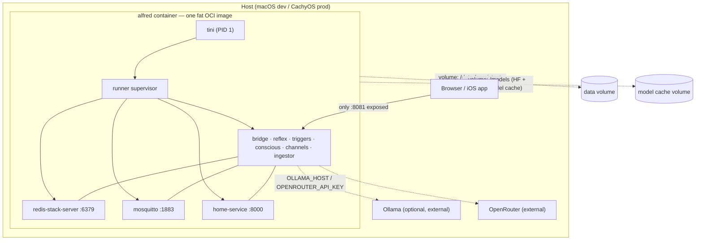
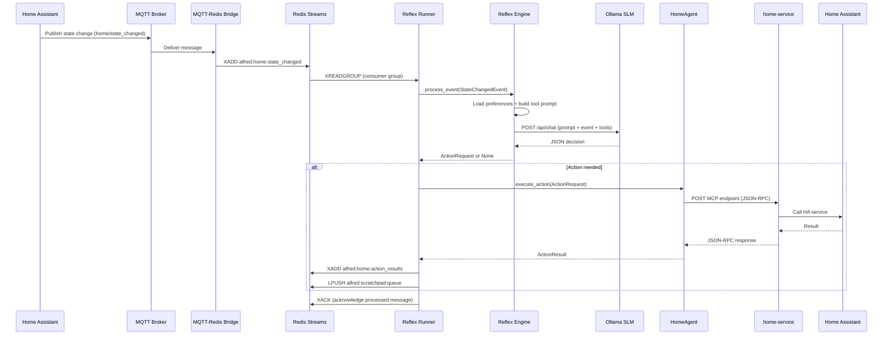
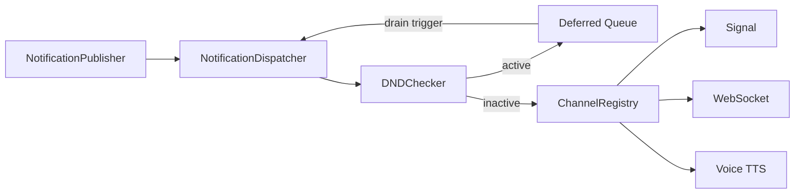
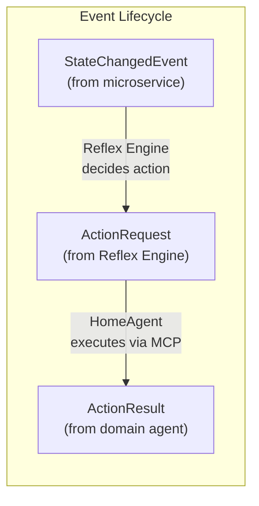

# Alfred System Architecture

## 1. System Overview

Alfred is an ambient, voice-first multi-agent system for smart environments. It processes real-time events from smart home devices and autonomously takes actions based on learned user preferences.

The system uses a **dual-process cognitive model**:

- **System 1 (Reflex Engine)** -- a local Small Language Model (Ollama, default `gpt-oss:20b`) handles the fast path. Every state-change event passes through the SLM, which decides in sub-500ms whether an action is needed and, if so, which tool to call.
- **System 2 (Conscious Engine)** -- a cloud LLM (Claude) handles complex reasoning, multi-step planning, and ambiguous user requests. Receives `UserRequest` events, assembles context from integrations and memory, runs an agentic tool-use loop, and returns `AlfredResponse` events.

The system is governed by four non-negotiable architectural pillars:

1. **Proactivity** -- triggers are created dynamically by the LLM, never hardcoded.
2. **Decoupling** -- microservices are sovereign applications; `alfred-sdk` is the only bridge.
3. **Deterministic Communication** -- all inter-agent messages are Pydantic-validated JSON. No natural language between agents.
4. **Stateful Memory (Librarian Pattern)** -- three-layer biologically-inspired memory: episodic (Redis hot + SQLite cold), semantic (Markdown profiles), procedural (YAML routines). The Librarian drains the scratchpad nightly and consolidates into long-term memory.

Alfred runs as six supervised OS processes communicating over Redis Streams rather than one async process — see [process-model.md](process-model.md) for the rationale (latency isolation for System 1, native-crash containment, restart granularity, observable boundaries) and the honest costs.

### 1.1 Deployment Topology

Alfred ships as a single "fat" OCI image containing every core service, Redis Stack, and
Mosquitto, supervised by `tini` (PID 1) + the unified runner (`ALFRED_MANAGE_INFRA=1`).
Multi-container orchestration is deliberately avoided — Apple's `container` runtime has
no compose and no `-p` port mapping, so a fat image is the only shape that runs
identically on Docker, Apple `container`, and Podman via the `alfredctl` launcher. All
state is externalized to two volumes; the container itself is disposable.



This is the deployment shape only — [Section 3](#3-component-architecture) below details
the internal wiring between those same core services, and applies whether they run
containerized or natively. See [containerization.md](containerization.md) for the full
image contents, `alfredctl` command reference, data lifecycle modes, and troubleshooting.

## 2. Event Pipeline

The full path from a physical device state change to an executed action:



**Key behaviors:**

- If Ollama is down, `process_event` raises an exception. The Runner does NOT ACK the message, so Redis redelivers it on the next `XREADGROUP` cycle.
- If the SLM returns `{"action": "none"}`, no action is dispatched and the message is ACKed normally.
- The SLM response is validated: `target_service` must match a registered service in the tool registry. Unknown services are rejected.

## 3. Component Architecture

```mermaid
graph TB
    subgraph External
        HA[Home Assistant]
        MQTT[MQTT Broker<br/>Mosquitto]
    end

    subgraph "Alfred Core"
        Bridge["MQTT-Redis Bridge<br/><code>uv run python -m bus</code>"]
        Runner["Reflex Runner<br/><code>uv run python -m core.reflex</code>"]
        AttnSet["AttentionSet<br/>Tier-2 SLM gate"]
        Engine[Reflex Engine]
        CtxReader[ContextReader]
        Registry[ToolRegistry]
        MemReader[Memory Reader]
        ScratchWriter[ScratchpadWriter]
        TelCollector[Telemetry Collector]
    end

    subgraph "Trigger Engine Process"
        TrigMain["Trigger Engine<br/><code>uv run python -m core.triggers</code>"]
        TrigEngine[TriggerEngine]
        TrigStore[TriggerStore]
        TrigFeature["TriggerFeature<br/>(CRUD tools)"]
    end

    subgraph Infrastructure
        Redis[(Redis<br/>Streams + Hashes)]
        Ollama[Ollama SLM]
    end

    subgraph "Domain Agents"
        DomRouter["DomainRouter<br/>risk enforcement +<br/>critical-action interception"]
        HomeAgent[HomeAgent]
    end

    subgraph "Microservices (separate repos)"
        HomeSvc["home-service<br/>(alfred-sdk)"]
    end

    subgraph "Preferences (disk)"
        Prefs["core/memory/preferences/*.md"]
        Scratch["core/memory/scratchpad.md"]
    end

    subgraph "Conscious Engine Process (System 2)"
        ConsMain["Conscious Engine<br/><code>uv run python -m core.conscious</code>"]
        ConsEngine[ConsciousEngine]
        IdentityGate[IdentityGate]
        SessionMgr[SessionManager]
        CostTracker[CostTracker]
        CtxAssembler[ContextAssembler]
        ActionTools["Action Tools<br/>confirm_pending_action +<br/>attention_* (sir-only)"]
    end

    subgraph "Memory System"
        EpisodicStore[EpisodicStore<br/>Redis hot + SQLite cold]
        SemanticProfile["Semantic Profiles<br/>core/memory/profile/*.md"]
        Routines["Procedural Routines<br/>core/memory/routines/*.yaml"]
        Librarian["Librarian<br/>nightly consolidation"]
    end

    subgraph "Integration Registry"
        IntRegistry[IntegrationRegistry]
        WeatherInt[WeatherIntegration]
        CalendarInt[AppleCalendarIntegration]
        HealthInt[AppleHealthIntegration]
        RobinhoodInt[RobinhoodIntegration]
    end

    subgraph "Interaction Channels"
        WebAuthn["WebAuthn<br/>Passkey Auth"]
        WebChannel["Web Channel<br/><code>uv run python -m core.channels</code>"]
        AdminRouter["Admin API<br/>/api/admin/*"]
        TelemetryWS["Telemetry WS<br/>/ws/telemetry"]
        WebPWA["Web PWA<br/>web/"]
        VoicePipeline["Voice Pipeline"]
        WhisperSTT[WhisperSTT]
        TTS["TTS Backend<br/>Kokoro (default) / Piper"]
        Satellites["Voice Satellites<br/>wyoming-satellite"]
        WebAuthn --> WebChannel
        WebChannel --> AdminRouter
        WebChannel --> TelemetryWS
        Satellites <-->|Wyoming TCP| WebChannel
        CredPushWorker["Credential Push Worker<br/>(channels-credentials)"]
        WebAuthn --> WebChannel
        WebChannel --> AdminRouter
        WebChannel --> TelemetryWS
        WebChannel --> CredPushWorker
    end

    subgraph "Evals Runner"
        EvalsCLI["Evals CLI<br/><code>uv run python -m evals</code>"]
        EvalsScenarios["YAML Scenarios"]
        EvalsCtx["Context Fixtures"]
        EvalsConscious["System 2 Evals<br/>DeepEval metrics"]
        EvalsRegression["Regression Mode<br/>Mocked Ollama"]
    end

    subgraph "Research Vault"
        CSV["research/data/*/raw.csv"]
    end

    HA <-->|state changes<br/>service calls| MQTT
    MQTT <-->|subscribe + publish| Bridge
    Bridge <-->|XADD / XREAD| Redis

    Runner -->|XREADGROUP| Redis
    Runner --> AttnSet
    AttnSet -->|SADD/SMEMBERS<br/>alfred:attention:*| Redis
    AttnSet --> Engine
    Runner --> DomRouter
    DomRouter --> HomeAgent
    DomRouter -->|SET/GETDEL<br/>alfred:pending_actions:*| Redis
    Runner --> ScratchWriter
    Runner --> TelCollector

    Engine --> CtxReader
    Engine --> Registry
    Engine --> MemReader
    Engine -->|POST /api/chat| Ollama
    CtxReader -->|GET alfred:context:*| Redis
    Registry -->|HGETALL alfred:tool_registry| Redis
    MemReader -->|read| Prefs
    ScratchWriter -->|LPOP queue| Redis
    ScratchWriter -->|append| Scratch

    HomeAgent -->|HGET endpoint| Redis
    HomeAgent -->|POST JSON-RPC| HomeSvc
    HomeSvc -->|register/unregister| Redis
    HomeSvc <-->|HA API| HA

    TelCollector -->|flush CSV| CSV

    TrigMain --> TrigEngine
    TrigMain --> TrigStore
    TrigMain --> TrigFeature
    TrigEngine -->|XREADGROUP| Redis
    TrigEngine -->|ActionRequest XADD| Redis
    TrigEngine -->|TriggerFired XADD| Redis
    TrigEngine -->|LPUSH observation| Redis
    TrigStore -->|HSET/HGET| Redis
    TrigStore -->|YAML snapshot| YAML2["core/memory/triggers/*.yaml"]
    TrigFeature -->|TriggerCreated XADD| Redis
    TrigFeature -->|register tools| Redis

    ConsMain --> ConsEngine
    ConsMain --> IdentityGate
    ConsMain --> SessionMgr
    ConsMain --> CostTracker
    ConsEngine --> CtxAssembler
    ConsEngine -->|POST /v1/messages| Claude["Claude API"]
    ConsEngine -->|XREAD requests| Redis
    ConsEngine -->|XADD responses| Redis
    ConsEngine -->|domain tool calls| DomRouter
    ConsEngine -->|sir-only tool calls| ActionTools
    ActionTools -->|GETDEL + XADD alfred:actions| Redis
    ActionTools -->|SADD/SREM alfred:attention:*| Redis
    CtxAssembler --> IntRegistry
    CtxAssembler --> EpisodicStore
    CtxAssembler --> MemReader
    IntRegistry --> WeatherInt
    IntRegistry --> CalendarInt
    IntRegistry --> HealthInt
    IntRegistry --> RobinhoodInt
    SessionMgr -->|GET/SET sessions| Redis
    CostTracker -->|GET/SET cost| Redis
    IdentityGate -->|voiceprint lookup| Redis
    EpisodicStore -->|hot writes| Redis
    EpisodicStore -->|cold archive| SQLite["SQLite DB"]
    Librarian -->|drain scratchpad| Redis
    Librarian -->|write episodic| EpisodicStore
    Librarian -->|update profiles| SemanticProfile

    WebChannel -->|XADD requests| Redis
    WebChannel -->|XREAD responses| Redis
    WebChannel <-->|WebSocket| WebPWA
    VoicePipeline --> WhisperSTT
    VoicePipeline --> TTS
    WebChannel --> VoicePipeline
    AdminRouter -->|reads streams + state| Redis
    AdminRouter -->|reads memory files| Prefs
    AdminRouter -->|XADD drain/librarian| Redis
    TelemetryWS -->|XREAD $| Redis
    CredPushWorker -->|XREADGROUP channels-credentials| Redis
    CredPushWorker -->|POST credentials_endpoint| HomeSvc

    EvalsCLI -->|build_prompt + parse_response| Engine
    EvalsCLI -->|POST /api/chat| Ollama
    EvalsCLI -->|load| EvalsScenarios
    EvalsCLI -->|load| EvalsCtx
    EvalsCLI -->|HGETALL tools| Redis
    EvalsCLI -->|flush CSV| CSV
    EvalsConscious -->|custom metrics| EvalsCLI
    EvalsRegression -->|mocked Ollama| EvalsCLI
```



### 3.1 Event Bus: MQTT Bridge + Redis Streams

**Files:** `bus/bridge.py`, `bus/__main__.py`

MQTT is the edge transport (Home Assistant publishes here). Redis Streams is the internal backbone. The bridge is a stateless, bidirectional forwarder with no business logic.

**Topic-to-stream mapping:**

| Direction | Source | Target | Example |
|-----------|--------|--------|---------|
| MQTT to Redis | `home/state_changed` | `alfred:home:state_changed` | HA state change |
| Redis to MQTT | `alfred:reflex:actions` | `reflex/actions` | Action feedback |

The conversion rule is simple: replace `/` with `:` and prepend `alfred:` (or reverse). See `mqtt_topic_to_stream_key()` and `stream_key_to_mqtt_topic()` in `bus/bridge.py`.

The bridge subscribes to MQTT topics `home/#` and `media/#` by default and listens on Redis streams `alfred:reflex:actions` for the reverse direction.

### 3.2 Reflex Engine (System 1 SLM Inference)

**Files:** `core/reflex/engine.py`, `core/reflex/ollama_client.py`

The `ReflexEngine` class is the System 1 fast path. It is a pure inference component with no side effects -- it takes a `StateChangedEvent` and returns an `ActionRequest | None`.

**How it works:**

1. Loads user preferences from `core/memory/preferences/` (cached after first read).
2. Fetches registered tools from `ToolRegistry` (cached, invalidatable via `reload_tools()`).
3. Fetches entity context from `ContextReader` (cached with 5-minute TTL, renders as Markdown).
4. Builds a system prompt dynamically from the tool registry -- tool names, parameters, and descriptions are injected at runtime; nothing is hardcoded.
5. Constructs a user prompt with entity context, preferences, and event details.
5. Sends the combined prompt to Ollama via `/api/chat` with `format: "json"`.
6. Parses the JSON response: either `{"action": "none"}` or `{"tool_name": "...", "target_service": "...", "parameters": {...}}`.
7. Validates `target_service` against registered services. Rejects unknown services.

The `@track_latency(category="reflex")` decorator on `process_event` records inference latency to the telemetry buffer. The `@track_tokens(model="ollama")` decorator on `ollama_client.infer` records token usage.

**Ollama client** (`core/reflex/ollama_client.py`): thin async wrapper using a long-lived `httpx.AsyncClient` for TCP connection reuse on the hot path.

#### 3.2.1 AttentionSet (Tiered Autonomy — Reflex Gating)

**Files:** `core/reflex/attention.py`, `core/reflex/attention_seed.yaml`

Every `state_changed` event still reaches triggers and context (Tier 1, full visibility), but
only entities in the **attention set** trigger SLM inference (Tier 2). `AttentionSet` is a
Redis SET per domain (`alfred:attention:{domain}`); membership is lazily seeded from
`attention_seed.yaml` (domain + device-class rules) on first sight of an entity and persisted
via `SADD`. A companion `alfred:attention:{domain}:seen` set makes runtime removals sticky --
the YAML seed never re-adds a demoted entity. The gate lives in `core/reflex/runner.py
process_stream_entry()`, upstream of `Engine`; gated-out events are still `XACK`ed. The
Conscious action tools (`attention_add`/`attention_remove`/`attention_list`, see 3.8) and the
Librarian can reshape membership at runtime. Full detail: [docs/autonomy.md](autonomy.md).

### 3.3 ToolRegistry (Dynamic Tool Discovery)

**Files:** `core/reflex/tool_registry.py`

The `ToolRegistry` reads tool manifests from the Redis hash `alfred:tool_registry`. Each key in the hash is a service name (e.g., `home-service`), and the value is a JSON manifest containing features and their tools.

**Data model (read side):**

```
ToolInfo(
    name="lighting.dim_lights",
    description="Dim lights in a room",
    parameters={"room": {"type": "str"}, "level": {"type": "int"}},
    feature_name="lighting",
    feature_description="Smart home lighting control",
    target_service="home-service",
)
```

The registry is a read-only layer. Writing happens on the microservice side via `AlfredClient.register()` (see SDK section below).

### 3.4 alfred-sdk (Microservice Integration)

**Files:** `sdk/alfred_sdk/feature.py`, `sdk/alfred_sdk/client.py`, `sdk/alfred_sdk/telemetry.py`

The SDK is a standalone Python package -- it has no imports from `alfred/core`, `alfred/bus`, or `alfred/domains`. It is the only coupling point between Alfred and external microservices.

**Core abstractions:**

- **`BaseFeature`** -- base class for grouping related tools. Subclass it and decorate methods with `@tool`. Tool metadata (name, description, parameters) is auto-extracted from Python type hints and Google-style docstrings.
- **`@tool`** -- marks a method as an MCP tool. Supports both bare `@tool` and `@tool(name="...", description="...")`.
- **`ContextProvider`** -- protocol for features that publish entity context. `BaseFeature` provides a default no-op; features override `get_context()` to return a `ContextSnapshot`.
- **`AlfredClient`** -- the entry point for microservices. Key operations:
  - `discover_features(package)` -- scans a Python package for `BaseFeature` subclasses, instantiates them, and builds a dispatch table.
  - `register()` -- writes the service manifest to Redis `alfred:tool_registry` via `HSET`, and writes merged entity context to `alfred:context:{service_name}` with a 10-minute TTL.
  - `unregister()` -- removes the service from the registry via `HDEL` on graceful shutdown.
  - `dispatch(method, params)` -- routes an incoming MCP call to the correct bound method on the feature instance.

**Registration flow:** microservice starts --> discovers features --> calls `register()` --> Alfred's `ToolRegistry` sees tools on next `HGETALL`, `ContextReader` sees entity context on next cache miss.

See `docs/context-provider.md` for full details on the context publishing and consumption pipeline.

### 3.5 Trigger Engine (Proactive Automation)

**Files:** `core/triggers/engine.py`, `core/triggers/store.py`, `core/triggers/feature.py`, `core/triggers/registry.py`, `core/triggers/models.py`, `core/triggers/types/`, `core/triggers/__main__.py`

The Trigger Engine enables proactive behavior -- actions that fire based on time, sensor state, or composite conditions without requiring SLM inference. Triggers are created dynamically by the SLM via CRUD tools (never hardcoded).

**Components:**

- **`TriggerRegistry`** -- decorator-based type registry mapping strings to `BaseTrigger` subclasses.
- **`TriggerStore`** -- Redis hash `alfred:triggers` for runtime CRUD, YAML snapshots for cold-start recovery.
- **`TriggerEngine`** -- dual evaluation loops (scheduled wakeup on `next_fire_time()` + event listener) with deterministic fire logic.
- **`TriggerFeature`** -- `BaseFeature` subclass exposing CRUD tools with dynamic descriptions.

**Trigger types:** `time` (cron/datetime), `sensor` (entity/state/attribute match), `composite` (N-of-M child conditions).

**Fire logic:** If `trigger.action` is set, publishes `ActionRequest` to `alfred:actions`. If `None`, publishes `TriggerFired` to `alfred:events` for the Reflex Engine to handle.

See `docs/trigger-engine.md` for full architecture details.

### 3.6 Domain Agents (HomeAgent)

**Files:** `domains/home/home_agent.py`

Domain agents are Alfred's internal staff. They translate high-level `ActionRequest` events into microservice-specific MCP tool calls over HTTP.

`HomeAgent.execute_action(action)`:

1. Looks up the target service's HTTP endpoint from the Redis tool registry manifest (`service_endpoint` field). Endpoint is cached after first lookup.
2. Sends a JSON-RPC POST request to the microservice: `{"method": "<tool_name>", "params": {...}, "id": "<request_id>"}`.
3. Parses the response. MCP uses JSON-RPC, so errors appear in the response body (not HTTP status codes).
4. Returns a typed `ActionResult` with `status: "success" | "error"`.

The `httpx.AsyncClient` is long-lived (reuses TCP connections). If the service is unreachable, the error is captured and returned as an `ActionResult` with `status: "error"`.

### 3.7 Memory System (Three-Layer)

**Files:** `core/memory/`, `core/librarian/consolidator.py`

Alfred's memory is biologically-inspired with three layers:

**Episodic Memory** (`core/memory/episodic/`):

Two-tier storage: Redis for hot (recent) entries, SQLite for cold archive. Entries are `EpisodicEntry` models with timestamps, source, content, and importance scores. Embeddings are computed via `sentence-transformers` for semantic search. A `DecayScheduler` handles time-based importance decay.

**Semantic Memory** (`core/memory/profile/`, `core/memory/preferences/`):

Read-only Markdown files with YAML frontmatter. Preferences contain user behavioral patterns; profiles contain identity and contextual information. The `read_preferences()` function strips frontmatter and concatenates all `.md` files for prompt injection.

Current preference files: `lighting.md`, `media.md`, `routines.md`.

**Procedural Memory** (`core/memory/routines/`):

YAML-defined routines (e.g., morning routine, bedtime routine) that encode learned behavioral sequences.

**Scratchpad** (`core/memory/scratchpad.md`):

Append-only log of runtime observations. Components push entries to `alfred:scratchpad:queue` via `LPUSH`. The `ScratchpadWriter` drains the queue every 5 seconds and appends to disk.

**Librarian** (`core/librarian/consolidator.py`):

Nightly consolidation process. Drains the scratchpad via atomic `RENAME`, extracts episodic entries, archives to cold storage, and updates semantic profiles. Run via `python -m core.librarian`.

### 3.8 Conscious Engine (System 2)

**Files:** `core/conscious/engine.py`, `core/conscious/identity.py`, `core/conscious/session.py`, `core/conscious/cost.py`, `core/conscious/context_assembler.py`

The Conscious Engine handles complex user requests via the Claude API with an agentic tool-use loop.

**Pipeline:**

1. **IdentityGate** (`identity.py`) -- resolves `identity_claim` from a `UserRequest` to a verified identity (sir/guest). Supports Signal phone lookup, WebAuthn session verification, and voiceprint matching.
2. **SessionManager** (`session.py`) -- manages conversation sessions in Redis (`alfred:sessions:{id}`). Maintains message history with a configurable window.
3. **CostTracker** (`cost.py`) -- enforces daily Claude API budget via Redis key `alfred:cost:daily`. Tracks input/output tokens and maps to dollar cost.
4. **ContextAssembler** (`context_assembler.py`) -- gathers context from integrations, episodic memory, and preferences. Builds the system prompt with Alfred's identity and available data.
5. **ConsciousEngine** (`engine.py`) -- runs the agentic loop: sends the request to Claude with tools, executes tool calls, feeds results back, repeats until Claude produces a final text response. Returns an `AlfredResponse`.

**Identity prompts** are in `core/conscious/prompts/` -- separate system prompts for sir vs guest interactions, enforcing the privacy boundary.

**Action tools** (`core/conscious/action_tools.py`) -- `confirm_pending_action` (republishes a
parked critical action once the user approves) and `attention_add`/`attention_remove`/`attention_list`
(reshape the Reflex `AttentionSet`, see 3.2.1), dispatched in-process like memory tools. Offered
in the tool manifest only when `identity.identity == "sir"`, and re-checked at dispatch time in
`_dispatch_tool_call()` -- a guest turn that somehow emits one of these calls is refused rather
than executed (defense-in-depth). See [docs/autonomy.md](autonomy.md).

### 3.9 Integration Registry

**Files:** `core/integrations/base.py`, `core/integrations/registry.py`, `core/integrations/sanitizer.py`

The `IntegrationRegistry` uses a decorator-based registration pattern (matching `TriggerRegistry`). Integration adapters are registered at import time via `@IntegrationRegistry.register()`.

**Available integrations:**

| Integration | File | Capabilities |
|-------------|------|-------------|
| Weather | `weather.py` | Current conditions via Open-Meteo API |
| Apple Calendar | `apple_calendar.py` | Today's events via CalDAV |
| Apple Health | `apple_health.py` | Sleep data (stub -- requires HealthKit bridge) |
| Robinhood | `robinhood.py` | Portfolio summary via robin_stocks |

The `DataSanitizer` (`sanitizer.py`) strips sensitive data from integration responses before exposing to guest identities.

### 3.10 Interaction Channels

**Files:** `core/channels/web_server.py`, `core/channels/admin_api.py`,
`core/channels/telemetry_ws.py`, `core/voice/stt.py`, `core/voice/tts.py`

**Web Channel** (`core/channels/`):

FastAPI + WebSocket server on port 8081. Receives user messages (text or audio) via
WebSocket, publishes `UserRequest` to `alfred:user:requests`, waits for `AlfredResponse` on
`alfred:user:responses`, and sends the response back. Supports voice input via the voice
pipeline.

**Admin API** (`core/channels/admin_api.py`):

Read-only observability endpoints plus curated controls, all under `/api/admin/`. Requires
both a trusted network IP (localhost or Tailscale CGNAT) and a valid `alfred_auth` session
cookie. See [docs/admin-api.md](admin-api.md) for full details.

**Telemetry WebSocket** (`core/channels/telemetry_ws.py`):

`/ws/telemetry` fans out Redis stream entries to the web app in real time. Clients
subscribe/unsubscribe by stream name; the server pushes `entry` frames via blocking `XREAD`
(2s block interval). Auth uses the same cookie gate as `/ws` (code 4001 on failure).

**Voice Pipeline** (`core/voice/`):

- `WhisperSTT` (`stt.py`) -- wraps `faster-whisper` for local speech-to-text. Transcribes audio bytes to text.
- **TTS backend** (`tts_backend.py` ABC + `tts_registry.py`) -- config-selected
  neural TTS. `KokoroTTS` (`tts_kokoro.py`, Kokoro-82M via `kokoro-onnx`) is the
  default; `PiperTTS` (`tts.py`) the fallback. Both return 16-bit PCM WAV and
  auto-download from the HF Hub. See [docs/voice.md](voice.md).

**Voice Satellites** (`core/channels/satellite/`):

Physical Wyoming-protocol devices (e.g. `wyoming-satellite` on a Raspberry Pi) connect over
TCP to a bridge running as asyncio tasks inside the channels process -- wake word streaming,
server-side VAD endpointing (`pysilero-vad`), speaker identification (ECAPA-TDNN), and the
same Whisper/TTS instances used by the web channel. See
[docs/voice-satellites.md](voice-satellites.md) for the full architecture, protocol handling,
and configuration reference.

**Web PWA** (`web/`):

Mission Control SPA built with Vite 8 / React 19 / TypeScript / Tailwind v4 / TanStack
Query / react-router v7. Provides chat, live telemetry rail, memory inspection, trigger
management, health monitoring, integration settings, and a ⌘K command palette. Built to
`web/dist/` and served by `core/channels/spa.mount_spa()` (static assets + index.html
SPA fallback). See `docs/web-frontend.md` for the full architecture reference.

### 3.11 Domain Routing (Tiered Autonomy Enforcement)

**Files:** `core/routing/domain_router.py`, `core/routing/risk.py`, `core/routing/pending.py`

The `DomainRouter` maps `ActionRequest` events to the correct domain agent based on
`target_service` -- a registry-based lookup, not hardcoded agent dispatch. It is also the
**dispatch-layer enforcement point** for tiered autonomy (defense-in-depth alongside the
Reflex prompt filter, 3.2.1): every `route()` call looks up the tool's risk
(`tool_risk()`, default `"benign"`); a Reflex-sourced request above benign risk is rejected
and recorded as a `ReflexObservation`, and an unconfirmed `risk == "critical"` request is
parked (not executed) via the **pending-action store** (`core/routing/pending.py`,
Redis key `alfred:pending_actions:{request_id}`, 5-minute TTL) while an URGENT notification
asks the user to confirm. Confirmation -- via `POST /api/actions/{id}/confirm` or the
`confirm_pending_action` action tool (3.8) -- atomically `GETDEL`s the pending entry and
republishes it with `confirmed=True`, so concurrent confirms of the same id can never both
execute. Full flow and sequence diagram: [docs/autonomy.md](autonomy.md).

### 3.12 Telemetry

**Files:** `sdk/alfred_sdk/telemetry.py`, `telemetry/collector.py`, `telemetry/schemas.py`

**SDK decorators** (in `sdk/alfred_sdk/telemetry.py`):

- `@track_latency(category="reflex")` -- records function execution time in milliseconds.
- `@track_tokens(model="ollama")` -- records prompt/completion/total token counts and inference duration.
- `@track_event(bus="redis")` -- records event bus publish latency.

All decorators write to an in-memory buffer (`_telemetry_buffer`). The buffer is flushed periodically by the telemetry collector.

**Collector** (in `telemetry/collector.py`):

Runs as a background task in the Reflex Runner (30-second flush interval). Reads the in-memory buffer, groups entries by category (`latency`, `tokens`, `event_throughput`), and appends them to CSV files in the research vault (`research/data/{category}/raw.csv`).

**Schemas** (in `telemetry/schemas.py`):

Typed Pydantic models for each metric category: `LatencyMetric`, `TokenMetric`, `EventMetric`. These define canonical CSV column headers.

### 3.13 Evals Runner

**Files:** `evals/__main__.py`, `evals/pipeline.py`, `evals/scorer.py`, `evals/inference.py`, `evals/context_fixtures.py`

Three-layer eval strategy:

**System 1 Evals** (existing):

Scenario-based evaluation that tests the Reflex Engine's SLM output. Reuses the engine's public API (`build_prompt()`, `parse_response()`) to ensure eval prompts match production prompts exactly. YAML scenarios in `evals/scenarios/<domain>/` define event + expected action pairs.

**System 1 Regression Mode** (`evals/regression/`):

Mocked Ollama client (`MockOllamaClient`) for deterministic CI runs without GPU. Canned responses keyed by entity ID substring matching. Run via `python -m evals regression`.

**System 2 Evals** (`evals/conscious/`):

Custom metrics for Conscious Engine output quality:

| Metric | What it checks |
|--------|---------------|
| `ButlerPersonalityScore` | Formal language, "sir" address, absence of casual markers |
| `PrivacyLeakScore` | No personal data leaked to guest identities |
| `ProactivityRelevanceScore` | Unsolicited suggestions are contextually useful (stub) |
| `MemoryRetrievalPrecision` | Retrieved memories actually appear in the response |

YAML scenarios in `evals/conscious/scenarios/` define user requests + expected behavior (mentions, forbidden mentions, tool call counts, metric thresholds). Run via `python -m evals conscious`.

**Good Morning Demo** (`evals/e2e/demo_good_morning.py`):

End-to-end script that publishes a `UserRequest` to Redis, waits for an `AlfredResponse`, and scores it with all custom metrics. Exercises every Phase 3 component. Run via `python -m evals demo`.

**Other capabilities:**

- Context fixtures in `evals/contexts/` replay captured HA state
- Parallel execution within each run
- Multi-run aggregation (`-n N`) with per-scenario pass rates
- Pluggable backends (Ollama, LM Studio) via `InferFn` protocol
- Run comparison diffs verdict changes and latency deltas

See [docs/evals-runner.md](evals-runner.md) for full documentation.

## 4. Notification System



The notification system is deterministic — no LLM calls. The Dispatcher checks DND state,
defers non-urgent notifications during DND, and routes to auto-discovered channel adapters
by urgency level. URGENT notifications always bypass DND.

## 4.5 Authentication (WebAuthn)

The web PWA uses passkey-based authentication via the WebAuthn standard. Registration is gated to the Tailscale trusted network. Auth sessions are stored in Redis and carried via HttpOnly cookies. The WebSocket handler validates the cookie on connection and rejects unauthenticated clients (code 4001). See [docs/webauthn.md](webauthn.md) for details.

## 5. Data Flow

### 5.1 Event Types

All event types are defined in `bus/schemas/events.py` -- the single source of truth.



| Event Type | Source | Purpose | Key Fields |
|---|---|---|---|
| `StateChangedEvent` | Microservices via MQTT | Reports a device/entity state change | `domain`, `entity_id`, `old_state`, `new_state`, `attributes` |
| `ActionRequest` | Reflex Engine | Requests a tool execution on a microservice | `target_service`, `tool_name`, `parameters` |
| `ActionResult` | Domain agents | Reports the outcome of a tool execution | `request_id`, `tool_name`, `status`, `result`, `error` |
| `TelemetryEvent` | Any component | Observability metric | `metric_type`, `category`, `value`, `unit` |
| `ToolRegistration` | Microservices | Announces available tools | `service_name`, `service_endpoint`, `tools` |
| `TriggerFired` | Trigger Engine | A trigger's conditions were met (no direct action) | `trigger_id`, `trigger_name`, `trigger_type`, `context` |
| `UserRequest` | Interaction channels | Inbound user interaction (text/audio) | `channel`, `session_id`, `identity_claim`, `content_type`, `content` |
| `AlfredResponse` | Conscious Engine | Outbound response to user | `channel`, `session_id`, `text`, `actions_taken`, `mood` |
| `TriggerCreated` | Trigger Engine | A trigger was dynamically created | `trigger_type`, `name`, `conditions`, `action`, `one_shot` |

All events extend `BaseEvent`, which provides `event_id` (UUID), `event_type`, `timestamp`, and `source`.

### 5.2 Redis Keys

| Key | Type | Purpose |
|-----|------|---------|
| `alfred:home:state_changed` | Stream | State change events from the home domain |
| `alfred:home:action_results` | Stream | Action execution results |
| `alfred:tool_registry` | Hash | Service name to tool manifest JSON |
| `alfred:scratchpad:queue` | List | Pending scratchpad observations |
| `alfred:context:{service}` | String (JSON) | Service entity context snapshot (TTL 600s) |
| `alfred:triggers` | Hash | Trigger ID → JSON (Trigger Engine runtime store) |
| `alfred:triggers:changed` | Pub/Sub | Cross-process `TriggerStore` coherence (saved/deleted/tz-changed) |
| `alfred:user:timezone` | String | User's IANA timezone (`shared/usertime.py`; resolution: stored → `ALFRED_TIMEZONE` env → UTC) |
| `alfred:user:requests` | Stream | Inbound user requests from channels |
| `alfred:user:responses` | Stream | Outbound Alfred responses to channels |
| `alfred:sessions:{id}` | String (JSON) | Conversation session state |
| `alfred:cost:daily` | String (JSON) | Daily Claude API cost tracking |
| `alfred:memory:episodic` | Stream | Hot episodic memory entries |
| `alfred:identity:voiceprint` | Hash | Voiceprint embeddings for identity |
| `alfred:notifications:queue` | Stream | Proactive notification queue |
| `alfred:attention:{domain}` | Set | Tier-2 Reflex attention set membership (`core/reflex/attention.py`) |
| `alfred:attention:{domain}:seen` | Set | Sticky removals -- entities the YAML seed must not re-add |
| `alfred:pending_actions:{request_id}` | String (JSON) | Parked critical `ActionRequest` awaiting confirmation (TTL 300s, `core/routing/pending.py`) |

### 5.3 Consumer Groups

The Reflex Runner uses a consumer group (`reflex-engine`, consumer `worker-1`) on `alfred:events`. The Trigger Engine uses a separate consumer group (`trigger-engine`, consumer `worker-1`) on the same stream. This enables:

- At-least-once delivery (messages are not lost if the consumer crashes).
- Future horizontal scaling (add `worker-2`, `worker-3`, etc.).
- Message acknowledgment (`XACK`) only after successful processing.

## 6. Configuration

**File:** `shared/config.py`

All configuration flows through the `AlfredConfig` dataclass, which reads from environment variables with sensible defaults. A `.env` file in the project root is loaded automatically via `python-dotenv`.

| Environment Variable | Default | Description |
|---|---|---|
| `REDIS_HOST` | `localhost` | Redis server hostname |
| `REDIS_PORT` | `6379` | Redis server port |
| `MQTT_HOST` | `localhost` | MQTT broker hostname |
| `MQTT_PORT` | `1883` | MQTT broker port |
| `OLLAMA_HOST` | `http://localhost:11434` | Ollama API base URL |
| `OLLAMA_MODEL` | `gpt-oss:20b` | SLM model name for inference |
| `HA_HOST` | `http://homeassistant.local:8123` | Home Assistant URL |
| `HA_TOKEN` | (empty) | Home Assistant long-lived access token |
| `RESEARCH_VAULT_PATH` | `./research` | Path to the Obsidian research vault |
| `SIGNOZ_ENABLED` | `true` | Enable OpenTelemetry export to SigNoz |
| `OTEL_EXPORTER_OTLP_ENDPOINT` | `http://localhost:4317` | OpenTelemetry collector endpoint |

The `AlfredConfig.redis_url` property constructs `redis://{host}:{port}` from the individual fields.

Microservices using `alfred-sdk` have their own config via environment variables: `ALFRED_SERVICE_NAME`, `ALFRED_SERVICE_ENDPOINT`, `REDIS_URL`, `MQTT_HOST`.

## 7. Running the System

### 7.1 Prerequisites

- Python 3.13+
- Redis server running on localhost:6379
- Mosquitto (MQTT broker) running on localhost:1883
- Ollama running with a model pulled (e.g., `ollama pull gpt-oss:20b`)
- At least one microservice registered (e.g., `home-service`)

On macOS (dev), use Homebrew services for Redis and Mosquitto (Apple `container` CLI does not support `-p` port forwarding).

### 7.2 Installation

```bash
uv venv --python 3.13
uv pip install -e ".[dev]"
```

### 7.3 Startup Order

Services must start in this order:

1. **Infrastructure:** Redis, Mosquitto, Ollama
2. **Microservices:** `home-service` (registers tools into `alfred:tool_registry`)
3. **All Alfred services:** `uv run python -m runner` (starts bridge, reflex, triggers, conscious, channels with correct ordering and auto-restart)

Or individually:

1. **MQTT-Redis Bridge:** `uv run python -m bus`
2. **Reflex Runner:** `uv run python -m core.reflex`
3. **Trigger Engine:** `uv run python -m core.triggers`
4. **Conscious Engine:** `uv run python -m core.conscious`
5. **Web Channel:** `uv run python -m core.channels`

The Reflex Runner fail-fast checks for registered tools at startup. If `alfred:tool_registry` is empty, it exits with an error telling you to start a microservice first. The unified runner adds startup delays (1-2s) and auto-restarts crashed services with exponential backoff.

### 7.4 Commands

```bash
# Start all services (recommended)
uv run python -m runner

# Or start individually
uv run python -m bus              # MQTT-Redis bridge
uv run python -m core.reflex     # Reflex Runner (System 1)
uv run python -m core.triggers   # Trigger Engine
uv run python -m core.conscious  # Conscious Engine (System 2)
uv run python -m core.channels   # Web Channel server
uv run python -m core.librarian  # Librarian (nightly consolidation)

# Lint and format
uv run ruff check . --fix
uv run ruff format .

# Type check
uv run mypy bus/ core/ domains/ evals/ runner/ sdk/ shared/ telemetry/

# Run tests
uv run pytest

# Run evals
uv run python -m evals run                  # System 1 evals (requires Ollama)
uv run python -m evals regression           # System 1 regression (mocked, CI-safe)
uv run python -m evals conscious            # System 2 evals (dry-run)
uv run python -m evals demo                 # Good Morning end-to-end demo
```

### 7.5 Shutdown

The Reflex Runner handles `SIGTERM` and `SIGINT` gracefully:

1. Sets a shutdown flag to exit the event loop.
2. Cancels background tasks (scratchpad writer, telemetry flusher).
3. Closes the Redis connection.

Microservices should call `AlfredClient.unregister()` on shutdown to remove their tools from the registry.
