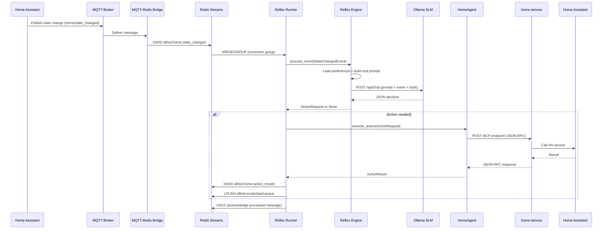
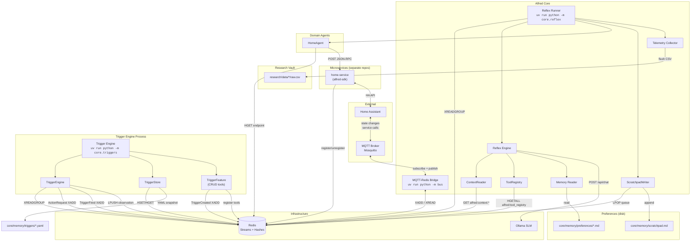
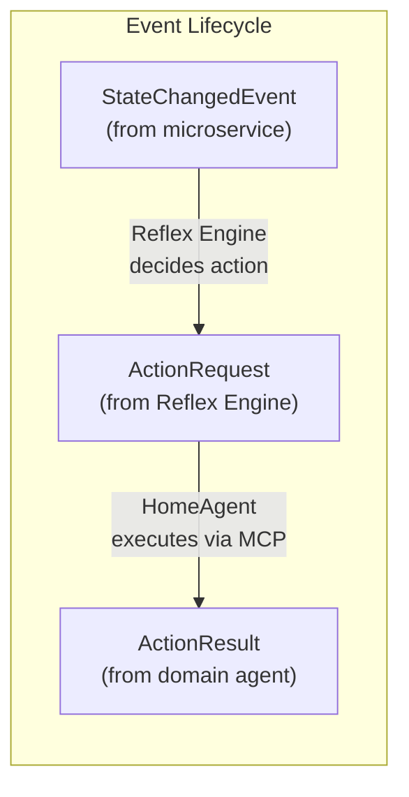

# Alfred System Architecture

## 1. System Overview

Alfred is an ambient, voice-first multi-agent system for smart environments. It processes real-time events from smart home devices and autonomously takes actions based on learned user preferences.

The system uses a **dual-process cognitive model**:

- **System 1 (Reflex Engine)** -- a local Small Language Model (Ollama, default `gpt-oss:20b`) handles the fast path. Every state-change event passes through the SLM, which decides in sub-500ms whether an action is needed and, if so, which tool to call. This is the only inference path implemented in Phase 1.
- **System 2 (Conscious Engine)** -- a cloud LLM (Claude) handles complex reasoning, multi-step planning, and ambiguous situations. Planned for Phase 3; not yet implemented.

The system is governed by four non-negotiable architectural pillars:

1. **Proactivity** -- triggers are created dynamically by the LLM, never hardcoded.
2. **Decoupling** -- microservices are sovereign applications; `alfred-sdk` is the only bridge.
3. **Deterministic Communication** -- all inter-agent messages are Pydantic-validated JSON. No natural language between agents.
4. **Stateful Memory (Librarian Pattern)** -- preferences in Markdown, runtime observations to a scratchpad, nightly consolidation (Phase 3).

## 2. Event Pipeline

The full path from a physical device state change to an executed action:



**Key behaviors:**

- If Ollama is down, `process_event` raises an exception. The Runner does NOT ACK the message, so Redis redelivers it on the next `XREADGROUP` cycle.
- If the SLM returns `{"action": "none"}`, no action is dispatched and the message is ACKed normally.
- The SLM response is validated: `target_service` must match a registered service in the tool registry. Unknown services are rejected.

## 3. Component Architecture



### 3.1 Event Bus: MQTT Bridge + Redis Streams

**Files:** `bus/bridge.py`, `bus/__main__.py`

MQTT is the edge transport (Home Assistant publishes here). Redis Streams is the internal backbone. The bridge is a stateless, bidirectional forwarder with no business logic.

**Topic-to-stream mapping:**

| Direction | Source | Target | Example |
|-----------|--------|--------|---------|
| MQTT to Redis | `home/state_changed` | `alfred:home:state_changed` | HA state change |
| Redis to MQTT | `alfred:reflex:actions` | `reflex/actions` | Action feedback |

The conversion rule is simple: replace `/` with `:` and prepend `alfred:` (or reverse). See `mqtt_topic_to_stream_key()` and `stream_key_to_mqtt_topic()` in `bus/bridge.py`.

The bridge subscribes to MQTT topics `home/#` and `media/#` by default and listens on Redis streams `alfred:reflex:actions` for the reverse direction.

### 3.2 Reflex Engine (System 1 SLM Inference)

**Files:** `core/reflex/engine.py`, `core/reflex/ollama_client.py`

The `ReflexEngine` class is the System 1 fast path. It is a pure inference component with no side effects -- it takes a `StateChangedEvent` and returns an `ActionRequest | None`.

**How it works:**

1. Loads user preferences from `core/memory/preferences/` (cached after first read).
2. Fetches registered tools from `ToolRegistry` (cached, invalidatable via `reload_tools()`).
3. Fetches entity context from `ContextReader` (cached with 5-minute TTL, renders as Markdown).
4. Builds a system prompt dynamically from the tool registry -- tool names, parameters, and descriptions are injected at runtime; nothing is hardcoded.
5. Constructs a user prompt with entity context, preferences, and event details.
5. Sends the combined prompt to Ollama via `/api/chat` with `format: "json"`.
6. Parses the JSON response: either `{"action": "none"}` or `{"tool_name": "...", "target_service": "...", "parameters": {...}}`.
7. Validates `target_service` against registered services. Rejects unknown services.

The `@track_latency(category="reflex")` decorator on `process_event` records inference latency to the telemetry buffer. The `@track_tokens(model="ollama")` decorator on `ollama_client.infer` records token usage.

**Ollama client** (`core/reflex/ollama_client.py`): thin async wrapper using a long-lived `httpx.AsyncClient` for TCP connection reuse on the hot path.

### 3.3 ToolRegistry (Dynamic Tool Discovery)

**Files:** `core/reflex/tool_registry.py`

The `ToolRegistry` reads tool manifests from the Redis hash `alfred:tool_registry`. Each key in the hash is a service name (e.g., `home-service`), and the value is a JSON manifest containing features and their tools.

**Data model (read side):**

```
ToolInfo(
    name="lighting.dim_lights",
    description="Dim lights in a room",
    parameters={"room": {"type": "str"}, "level": {"type": "int"}},
    feature_name="lighting",
    feature_description="Smart home lighting control",
    target_service="home-service",
)
```

The registry is a read-only layer. Writing happens on the microservice side via `AlfredClient.register()` (see SDK section below).

### 3.4 alfred-sdk (Microservice Integration)

**Files:** `sdk/alfred_sdk/feature.py`, `sdk/alfred_sdk/client.py`, `sdk/alfred_sdk/telemetry.py`

The SDK is a standalone Python package -- it has no imports from `alfred/core`, `alfred/bus`, or `alfred/domains`. It is the only coupling point between Alfred and external microservices.

**Core abstractions:**

- **`BaseFeature`** -- base class for grouping related tools. Subclass it and decorate methods with `@tool`. Tool metadata (name, description, parameters) is auto-extracted from Python type hints and Google-style docstrings.
- **`@tool`** -- marks a method as an MCP tool. Supports both bare `@tool` and `@tool(name="...", description="...")`.
- **`ContextProvider`** -- protocol for features that publish entity context. `BaseFeature` provides a default no-op; features override `get_context()` to return a `ContextSnapshot`.
- **`AlfredClient`** -- the entry point for microservices. Key operations:
  - `discover_features(package)` -- scans a Python package for `BaseFeature` subclasses, instantiates them, and builds a dispatch table.
  - `register()` -- writes the service manifest to Redis `alfred:tool_registry` via `HSET`, and writes merged entity context to `alfred:context:{service_name}` with a 10-minute TTL.
  - `unregister()` -- removes the service from the registry via `HDEL` on graceful shutdown.
  - `dispatch(method, params)` -- routes an incoming MCP call to the correct bound method on the feature instance.

**Registration flow:** microservice starts --> discovers features --> calls `register()` --> Alfred's `ToolRegistry` sees tools on next `HGETALL`, `ContextReader` sees entity context on next cache miss.

See `docs/context-provider.md` for full details on the context publishing and consumption pipeline.

### 3.5 Trigger Engine (Proactive Automation)

**Files:** `core/triggers/engine.py`, `core/triggers/store.py`, `core/triggers/feature.py`, `core/triggers/registry.py`, `core/triggers/models.py`, `core/triggers/types/`, `core/triggers/__main__.py`

The Trigger Engine enables proactive behavior -- actions that fire based on time, sensor state, or composite conditions without requiring SLM inference. Triggers are created dynamically by the SLM via CRUD tools (never hardcoded).

**Components:**

- **`TriggerRegistry`** -- decorator-based type registry mapping strings to `BaseTrigger` subclasses.
- **`TriggerStore`** -- Redis hash `alfred:triggers` for runtime CRUD, YAML snapshots for cold-start recovery.
- **`TriggerEngine`** -- dual evaluation loops (1s tick + event listener) with deterministic fire logic.
- **`TriggerFeature`** -- `BaseFeature` subclass exposing CRUD tools with dynamic descriptions.

**Trigger types:** `time` (cron/datetime), `sensor` (entity/state/attribute match), `composite` (N-of-M child conditions).

**Fire logic:** If `trigger.action` is set, publishes `ActionRequest` to `alfred:actions`. If `None`, publishes `TriggerFired` to `alfred:events` for the Reflex Engine to handle.

See `docs/trigger-engine.md` for full architecture details.

### 3.6 Domain Agents (HomeAgent)

**Files:** `domains/home/home_agent.py`

Domain agents are Alfred's internal staff. They translate high-level `ActionRequest` events into microservice-specific MCP tool calls over HTTP.

`HomeAgent.execute_action(action)`:

1. Looks up the target service's HTTP endpoint from the Redis tool registry manifest (`service_endpoint` field). Endpoint is cached after first lookup.
2. Sends a JSON-RPC POST request to the microservice: `{"method": "<tool_name>", "params": {...}, "id": "<request_id>"}`.
3. Parses the response. MCP uses JSON-RPC, so errors appear in the response body (not HTTP status codes).
4. Returns a typed `ActionResult` with `status: "success" | "error"`.

The `httpx.AsyncClient` is long-lived (reuses TCP connections). If the service is unreachable, the error is captured and returned as an `ActionResult` with `status: "error"`.

### 3.7 Memory (Preferences + Scratchpad)

**Files:** `core/reflex/memory_reader.py`, `core/memory/scratchpad_writer.py`, `core/memory/preferences/*.md`

**Preferences** (`core/memory/preferences/`):

Read-only Markdown files with YAML frontmatter. The frontmatter contains metadata (`domain`, `updated`, `confidence`); the body contains natural-language preference statements. The `read_preferences()` function strips frontmatter and concatenates all `.md` files into a single string for injection into the SLM prompt.

Example preference file (`lighting.md`):
```yaml
---
domain: home
updated: 2026-03-10
confidence: manual
---
# Lighting Preferences

- I prefer dim lighting when watching TV or movies
- Default brightness during daytime: 80%
```

Current preference files: `lighting.md`, `media.md`, `routines.md`.

Preferences are never modified at runtime. Only humans or the Librarian Agent (Phase 3) edit them.

**Scratchpad** (`core/memory/scratchpad.md`):

Append-only log of runtime observations. Components push entries to a Redis List (`alfred:scratchpad:queue`) using `LPUSH`. The `ScratchpadWriter` runs as a background coroutine inside the Reflex Runner, draining the queue every 5 seconds and appending entries to `scratchpad.md` on disk.

Entry format: `{timestamp} [{source}] {tool_name}({parameters}) -> {status}`

The scratchpad is gitignored. It serves as raw material for the Librarian Agent's nightly consolidation (Phase 3).

### 3.8 Telemetry

**Files:** `sdk/alfred_sdk/telemetry.py`, `telemetry/collector.py`, `telemetry/schemas.py`

**SDK decorators** (in `sdk/alfred_sdk/telemetry.py`):

- `@track_latency(category="reflex")` -- records function execution time in milliseconds.
- `@track_tokens(model="ollama")` -- records prompt/completion/total token counts and inference duration.
- `@track_event(bus="redis")` -- records event bus publish latency.

All decorators write to an in-memory buffer (`_telemetry_buffer`). The buffer is flushed periodically by the telemetry collector.

**Collector** (in `telemetry/collector.py`):

Runs as a background task in the Reflex Runner (30-second flush interval). Reads the in-memory buffer, groups entries by category (`latency`, `tokens`, `event_throughput`), and appends them to CSV files in the research vault (`research/data/{category}/raw.csv`).

**Schemas** (in `telemetry/schemas.py`):

Typed Pydantic models for each metric category: `LatencyMetric`, `TokenMetric`, `EventMetric`. These define canonical CSV column headers.

## 4. Data Flow

### 4.1 Event Types

All event types are defined in `bus/schemas/events.py` -- the single source of truth.



| Event Type | Source | Purpose | Key Fields |
|---|---|---|---|
| `StateChangedEvent` | Microservices via MQTT | Reports a device/entity state change | `domain`, `entity_id`, `old_state`, `new_state`, `attributes` |
| `ActionRequest` | Reflex Engine | Requests a tool execution on a microservice | `target_service`, `tool_name`, `parameters` |
| `ActionResult` | Domain agents | Reports the outcome of a tool execution | `request_id`, `tool_name`, `status`, `result`, `error` |
| `TelemetryEvent` | Any component | Observability metric | `metric_type`, `category`, `value`, `unit` |
| `ToolRegistration` | Microservices | Announces available tools | `service_name`, `service_endpoint`, `tools` |
| `TriggerFired` | Trigger Engine | A trigger's conditions were met (no direct action) | `trigger_id`, `trigger_name`, `trigger_type`, `context` |
| `TriggerCreated` | Trigger Engine | A trigger was dynamically created | `trigger_type`, `name`, `conditions`, `action`, `one_shot` |

All events extend `BaseEvent`, which provides `event_id` (UUID), `event_type`, `timestamp`, and `source`.

### 4.2 Redis Keys

| Key | Type | Purpose |
|-----|------|---------|
| `alfred:home:state_changed` | Stream | State change events from the home domain |
| `alfred:home:action_results` | Stream | Action execution results |
| `alfred:tool_registry` | Hash | Service name to tool manifest JSON |
| `alfred:scratchpad:queue` | List | Pending scratchpad observations |
| `alfred:context:{service}` | String (JSON) | Service entity context snapshot (TTL 600s) |
| `alfred:triggers` | Hash | Trigger ID → JSON (Trigger Engine runtime store) |

### 4.3 Consumer Groups

The Reflex Runner uses a consumer group (`reflex-engine`, consumer `worker-1`) on `alfred:events`. The Trigger Engine uses a separate consumer group (`trigger-engine`, consumer `worker-1`) on the same stream. This enables:

- At-least-once delivery (messages are not lost if the consumer crashes).
- Future horizontal scaling (add `worker-2`, `worker-3`, etc.).
- Message acknowledgment (`XACK`) only after successful processing.

## 5. Configuration

**File:** `shared/config.py`

All configuration flows through the `AlfredConfig` dataclass, which reads from environment variables with sensible defaults. A `.env` file in the project root is loaded automatically via `python-dotenv`.

| Environment Variable | Default | Description |
|---|---|---|
| `REDIS_HOST` | `localhost` | Redis server hostname |
| `REDIS_PORT` | `6379` | Redis server port |
| `MQTT_HOST` | `localhost` | MQTT broker hostname |
| `MQTT_PORT` | `1883` | MQTT broker port |
| `OLLAMA_HOST` | `http://localhost:11434` | Ollama API base URL |
| `OLLAMA_MODEL` | `gpt-oss:20b` | SLM model name for inference |
| `HA_HOST` | `http://homeassistant.local:8123` | Home Assistant URL |
| `HA_TOKEN` | (empty) | Home Assistant long-lived access token |
| `RESEARCH_VAULT_PATH` | `./research` | Path to the Obsidian research vault |
| `SIGNOZ_ENABLED` | `true` | Enable OpenTelemetry export to SigNoz |
| `OTEL_EXPORTER_OTLP_ENDPOINT` | `http://localhost:4317` | OpenTelemetry collector endpoint |

The `AlfredConfig.redis_url` property constructs `redis://{host}:{port}` from the individual fields.

Microservices using `alfred-sdk` have their own config via environment variables: `ALFRED_SERVICE_NAME`, `ALFRED_SERVICE_ENDPOINT`, `REDIS_URL`, `MQTT_HOST`.

## 6. Running the System

### 6.1 Prerequisites

- Python 3.13+
- Redis server running on localhost:6379
- Mosquitto (MQTT broker) running on localhost:1883
- Ollama running with a model pulled (e.g., `ollama pull gpt-oss:20b`)
- At least one microservice registered (e.g., `home-service`)

On macOS (dev), use Homebrew services for Redis and Mosquitto (Apple `container` CLI does not support `-p` port forwarding).

### 6.2 Installation

```bash
uv venv --python 3.13
uv pip install -e ".[dev]"
```

### 6.3 Startup Order

Services must start in this order:

1. **Infrastructure:** Redis, Mosquitto, Ollama
2. **Microservices:** `home-service` (registers tools into `alfred:tool_registry`)
3. **MQTT-Redis Bridge:** `uv run python -m bus`
4. **Reflex Runner:** `uv run python -m core.reflex`
5. **Trigger Engine:** `uv run python -m core.triggers`

The Reflex Runner fail-fast checks for registered tools at startup. If `alfred:tool_registry` is empty, it exits with an error telling you to start a microservice first.

### 6.4 Commands

```bash
# Start the MQTT-Redis bridge
uv run python -m bus

# Start the Reflex Runner (System 1 pipeline)
uv run python -m core.reflex

# Start the Trigger Engine (proactive automation)
uv run python -m core.triggers

# Lint and format
uv run ruff check . --fix
uv run ruff format .

# Type check
uv run mypy bus/ core/ domains/ sdk/ shared/ telemetry/

# Run tests
uv run pytest
```

### 6.5 Shutdown

The Reflex Runner handles `SIGTERM` and `SIGINT` gracefully:

1. Sets a shutdown flag to exit the event loop.
2. Cancels background tasks (scratchpad writer, telemetry flusher).
3. Closes the Redis connection.

Microservices should call `AlfredClient.unregister()` on shutdown to remove their tools from the registry.
