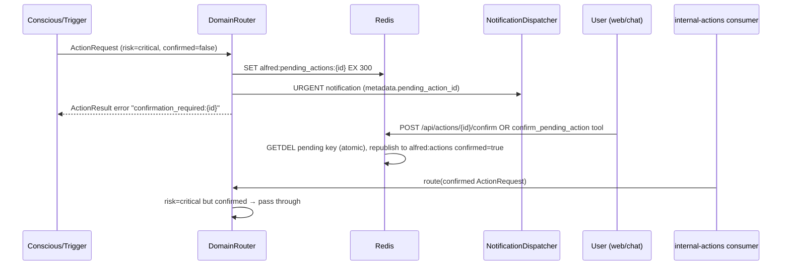

# Tiered Autonomy — Attention Set, Risk Enforcement, Confirmation Flow

Alfred observes everything but reacts selectively, and its two engines have
different action rights. Spec: `docs/superpowers/specs/2026-07-15-real-home-ha-integration-design.md` (Section 3).

## Attention Set (Reflex SLM gating)

Tier 1: every `state_changed` event reaches triggers and context (full
visibility). Tier 2: only attention-set members fire the Reflex SLM.

- Membership: Redis SET `alfred:attention:{domain}` (`ATTENTION_PREFIX`).
- Lazy seeding: on first sight of an entity, YAML rules
  (`core/reflex/attention_seed.yaml`: domains + device classes) decide
  membership; the result is persisted via SADD. A companion
  `alfred:attention:{domain}:seen` SET makes runtime removals sticky.
- Runtime primitives (Conscious internal tools, sir-only):
  `attention_add(domain, entity_id)`, `attention_remove(domain, entity_id)`,
  `attention_list(domain)`. The Librarian may promote/demote entities during
  consolidation using the same helpers (`core/reflex/attention.py`).
- Firing rules: real transitions only (`new_state != old_state` — attribute-only
  updates are forwarded with equal states and gated here) + per-entity 5s
  in-process cooldown.
- Gate location: `core/reflex/runner.py` `process_stream_entry()` — gated
  events are still XACKed.

## Tiered autonomy — enforced twice

1. **Prompt layer:** `ReflexEngine._get_tools_and_prompt()` builds the SLM
   prompt only from registry tools tagged `audience: "reflex"` (untagged
   tools default to `"conscious"`).
2. **Dispatch layer:** `DomainRouter.route()` looks up the tool's risk
   (`core/routing/risk.py: tool_risk()`, default `"benign"`). An
   ActionRequest whose `source` starts with `"reflex"` targeting risk above
   benign is rejected (`autonomy_violation:`), logged, and recorded as a
   `ReflexObservation`.

## Confirmation flow for critical actions

- Pending store helpers: `core/routing/pending.py` (`PENDING_TTL_SECONDS=300`).
  `confirm_pending_action()` uses an atomic `GETDEL` (not GET-then-DELETE) so two
  concurrent confirms of the same id can never both republish — only one caller ever
  gets the ActionRequest back; every other confirm (concurrent or after) gets `None`.
  This is what prevents a critical action (e.g. a door unlock) from executing twice.
- Web confirm: `POST /api/actions/{request_id}/confirm` (auth cookie
  required; 404 when expired). The SPA renders a Confirm button on the
  notification toast (`web/src/lib/notifications.ts`).
- Chat confirm: Conscious internal tool `confirm_pending_action(request_id)`
  (`core/conscious/action_tools.py`) — works over Signal/iOS/web chat. Action tools
  (confirm + `attention_*`) are offered to sir turns only in the tool manifest, and
  `ConsciousEngine._dispatch_tool_call()` re-checks the resolved identity at dispatch
  time before executing any of them — defense-in-depth against a guest-turn model
  hallucinating the call.
- Execution: the conscious process's `_consume_internal_actions` consumer
  (group `conscious-engine` on `alfred:actions`) routes `confirmed=True`
  domain actions through the DomainRouter.
- Expiry: silent (Redis TTL); confirming an expired action returns 404 /
  a tool error.
- **v1 rule:** critical actions require confirmation even when directly
  user-initiated — the LLM never self-certifies.

## Resilience

- `bus/bridge.py` caps MQTT→Redis forwards with `maxlen=10000,
  approximate=True` so a chatty apartment cannot grow
  `alfred:home:state_changed` unboundedly.
