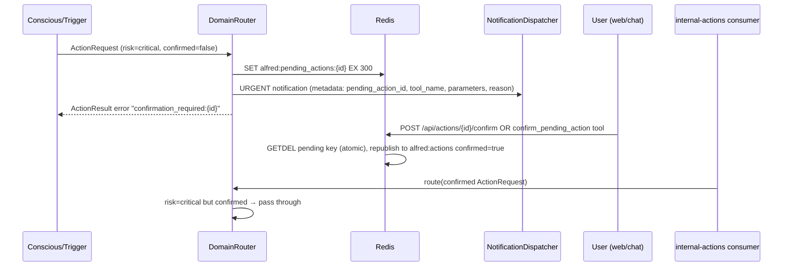

# Tiered Autonomy — Attention Set, Risk Enforcement, Confirmation Flow

Alfred observes everything but reacts selectively, and its two engines have
different action rights. Spec: `docs/superpowers/specs/2026-07-15-real-home-ha-integration-design.md` (Section 3).

## Attention Set (Reflex SLM gating)

Tier 1: every `state_changed` event reaches triggers and context (full
visibility). Tier 2: only attention-set members fire the Reflex SLM.

- Membership: Redis SET `alfred:attention:{domain}` (`ATTENTION_PREFIX`).
- Lazy seeding: on first sight of an entity, YAML rules
  (`core/reflex/attention_seed.yaml`: domains + device classes) decide
  membership; the result is persisted via SADD. A companion
  `alfred:attention:{domain}:seen` SET makes runtime removals sticky.
- Runtime primitives (Conscious internal tools, sir-only):
  `attention_add(domain, entity_id)`, `attention_remove(domain, entity_id)`,
  `attention_list(domain)`. The Librarian may promote/demote entities during
  consolidation using the same helpers (`core/reflex/attention.py`).
- HTTP surface: `GET /api/admin/attention` lists every domain with its members
  and its sticky `seen` companion; `PUT /api/admin/attention/{domain}` runs the
  same two primitives from a request body (`allow` → `attention_add`, `ask` →
  `attention_remove`, `ask` applied second). Session-gated like the rest of the
  admin API; see [`admin-api.md` → Attention](admin-api.md#attention).
- Firing rules: real transitions only (`new_state != old_state` — attribute-only
  updates are forwarded with equal states and gated here) + per-entity 5s
  in-process cooldown.
- Gate location: `core/reflex/runner.py` `process_stream_entry()` — gated
  events are still XACKed.

## Tiered autonomy — enforced twice

1. **Prompt layer:** `ReflexEngine._get_tools_and_prompt()` builds the SLM
   prompt only from registry tools tagged `audience: "reflex"` (untagged
   tools default to `"conscious"`).
2. **Dispatch layer:** `DomainRouter.route()` looks up the tool's risk
   (`core/routing/risk.py: tool_risk()`). An ActionRequest whose `source`
   starts with `"reflex"` targeting anything other than `"benign"` is
   rejected (`autonomy_violation:`), logged, and recorded as a
   `ReflexObservation`.

### The dispatch layer fails closed

`tool_risk()` returns three kinds of answer:

| Registry state | Risk | Reflex may execute |
|---|---|---|
| Tool declared with a `risk` field | that value | only if `benign` |
| Tool declared, no `risk` field | `benign` | yes (legacy manifests predate risk tagging) |
| Tool **not** declared, service absent, or manifest unparseable | `unknown` | no |

The last row is the important one. The registry is the only evidence a tool
exists at all, so a name it has never heard of gets no autonomy. This is not
hypothetical: the Reflex SLM emitted `home.light_turn_on` — absent from
`home-service`'s generated manifest — and while unknown risk read as
`"benign"` the gate passed it straight through to a real house, unconfirmed,
for weeks. Prompt-layer filtering (rule 1) cannot prevent this on its own,
because a model is free to emit a tool name that was never in its prompt.

Note the asymmetry: `"unknown"` blocks *reflex* only. System 2 keeps full
action rights over undeclared tools, since an incomplete manifest must not
stop the user from asking Alfred for something directly.

## Confirmation flow for critical actions

```mermaid
sequenceDiagram
    participant CE as Conscious/Trigger
    participant DR as DomainRouter
    participant R as Redis
    participant N as NotificationDispatcher
    participant U as User (web/chat)
    participant IC as internal-actions consumer

    CE->>DR: ActionRequest (risk=critical, confirmed=false)
    DR->>R: SET alfred:pending_actions:{id} EX 300
    DR->>N: URGENT notification (metadata: pending_action_id, tool_name, parameters, reason)
    DR-->>CE: ActionResult error "confirmation_required:{id}"
    U->>R: POST /api/actions/{id}/confirm  OR  confirm_pending_action tool
    R->>R: GETDEL pending key (atomic), republish to alfred:actions confirmed=true
    IC->>DR: route(confirmed ActionRequest)
    DR->>DR: risk=critical but confirmed → pass through
```

- Confirmation metadata: the URGENT notification carries `pending_action_id`,
  `tool_name`, `parameters` and `reason` — enough for a client to render the prompt
  without a second lookup. `reason` is the actor's one-sentence justification, offered
  as an extra argument on critical tools and moved off `parameters` by
  `ConsciousEngine._dispatch_tool_call()` so the domain service never sees it —
  unless the tool declares `reason` as its own parameter, in which case it belongs
  to the service and `ActionRequest.reason` stays null.
  It is **null for every non-conscious source** (trigger-fired actions —
  `core/triggers/engine.py` — and any caller that omits it), so clients must render
  the prompt without a reason rather than assuming one is present.
- Pending store helpers: `core/routing/pending.py` (`PENDING_TTL_SECONDS=300`).
  `confirm_pending_action()` uses an atomic `GETDEL` (not GET-then-DELETE) so two
  concurrent confirms of the same id can never both republish — only one caller ever
  gets the ActionRequest back; every other confirm (concurrent or after) gets `None`.
  This is what prevents a critical action (e.g. a door unlock) from executing twice.
- Web confirm: `POST /api/actions/{request_id}/confirm` (auth cookie
  required; 404 when expired). The SPA renders a Confirm button on the
  notification toast (`web/src/lib/notifications.ts`).
- Web reads: `GET /api/actions/pending` → `{"actions": [...]}`, oldest request first,
  and `GET /api/actions/{request_id}` → one action (404 `Pending action not found or
  expired` when it is missing or the TTL has run out). Both are session-gated by the
  same auth cookie as the confirm route, and both are **non-consuming** — a plain `GET`,
  never the `GETDEL` the confirm path uses — so a client may poll or re-open a push-tap
  deep link without spending the confirmation. Each entry carries `request_id`,
  `tool_name`, `target_service`, `parameters`, `reason`, `source`, `timestamp`,
  `ttl_seconds` and `expires_at`. `ttl_seconds` is clamped at 0 (Redis reports -2 for a
  key that vanished between the read and the TTL, -1 for one with no expiry), so clients
  can render the remaining fuse directly without guarding for a negative.
- Chat confirm: Conscious internal tool `confirm_pending_action(request_id)`
  (`core/conscious/action_tools.py`) — works over Signal/iOS/web chat. Action tools
  (confirm + `attention_*`) are offered to sir turns only in the tool manifest, and
  `ConsciousEngine._dispatch_tool_call()` re-checks the resolved identity at dispatch
  time before executing any of them — defense-in-depth against a guest-turn model
  hallucinating the call.
- Execution: the conscious process's `_consume_internal_actions` consumer
  (group `conscious-engine` on `alfred:actions`) routes `confirmed=True`
  domain actions through the DomainRouter.
- Expiry: silent (Redis TTL); confirming an expired action returns 404 /
  a tool error.
- **v1 rule:** critical actions require confirmation even when directly
  user-initiated — the LLM never self-certifies.

## Resilience

- `bus/bridge.py` caps MQTT→Redis forwards with `maxlen=10000,
  approximate=True` so a chatty apartment cannot grow
  `alfred:home:state_changed` unboundedly.
