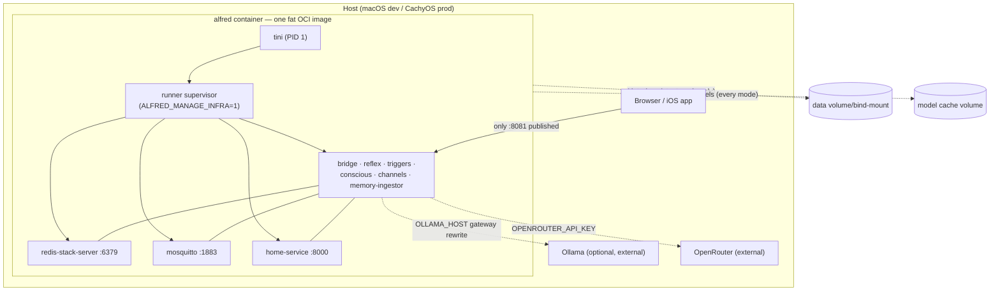

# Containerization

Alfred ships as a single "fat" OCI image — Redis Stack, Mosquitto, the six core Python
services, and home-service, supervised by `tini` + the unified runner. This doc covers
the full workflow: architecture, image contents, the `alfredctl` launcher, data
lifecycle, models, secrets, networking, production deployment, and troubleshooting.

Design rationale lives in
[`docs/superpowers/specs/2026-07-19-alfred-containerization-design.md`](superpowers/specs/2026-07-19-alfred-containerization-design.md);
this doc describes what actually shipped.

## 1. Why one fat container

Apple's `container` runtime (the dev-machine default on macOS) has no compose and no
`-p` port mapping — every container gets its own VM with its own IP. Orchestrating
Redis + Mosquitto + six services + home-service as separate containers would need a
different bring-up mechanism per runtime. Baking the whole runtime into **one image**
means the same `alfredctl up` works identically on Docker, Apple `container`, and
Podman — the trade-off is owning Redis Stack + Mosquitto packaging inside the image, and
a larger image than a slim app-only container. All state is externalized (Section 4) so
the container itself stays disposable.

## 2. Runtime topology



Only `:8081` (web UI, PWA, iOS client) is exposed by default. Redis and Mosquitto never
leave the container. `:1883` (a real Home Assistant publishing to the edge broker) and
`:8000` (home-service debugging) are opt-in via `--expose-ha` / `--expose-home`.

## 3. Image contents

Built from the repo-root `Containerfile` (multi-stage):

| Stage | Contents |
|---|---|
| `webbuild` (`node:22-slim`) | `npm ci && npm run build` → `web/dist/`, copied into the final stage |
| `redis` (`redis:8-bookworm`) | Source for `redis-server`, `redis-cli`, and the RediSearch/RedisJSON modules — copied binary-only into the final stage (both images are Debian 12, so glibc/openssl match) |
| Final (`python:3.13-slim-bookworm`) | Everything below |

Inside the final stage:

- **`uv`** — copied from `ghcr.io/astral-sh/uv:latest`, used for the dependency install layer
- **System packages** — `tini` (PID 1, zombie reaping + signal forwarding), `mosquitto` +
  `mosquitto-clients` (MQTT broker + CLI for smoke checks), `libgomp1` (RediSearch's
  OpenMP runtime dependency)
- **Redis** — `redis-server`/`redis-cli` binaries + `/usr/local/lib/redis/modules/*.so`
  copied from the `redis` stage
- **Python deps** — `alfred[voice,memory,integrations]` and home-service's own
  `pyproject.toml` deps, installed via `uv pip install --system` in a cache-friendly
  layer *before* source is copied (deps rarely change; source changes every commit)
- **Source, not site-packages** — `bus/`, `core/`, `domains/`, `runner/`, `sdk/`,
  `shared/`, `telemetry/` (alfred) and `app/`, `alfred_ext/` (home-service) are copied as
  source trees and run via `PYTHONPATH=/app:/app/sdk:/srv/home-service` — one copy, no
  editable-install duplication
- **Frontend** — the built `web/dist/` from the `webbuild` stage
- **Entrypoint** — `tini -- python -m runner --no-reload`

### Build context: `git ls-files`, not `.dockerignore`

`uv run alfredctl build` does **not** hand the repo directory to `docker build` as the
context. `alfredctl/staging.py` first stages a clean temp directory containing only
`git ls-files -z -co --exclude-standard` output (tracked files + untracked-but-not-
ignored files) from both `alfred/` and the sibling `home-service/` checkout, then builds
from that staged copy. Gitignored content — `.env`, `secrets/`, personal preference
files under `core/memory/preferences/`/`core/memory/profile/`, `.venv/`, `node_modules/`
— can **never** reach the image this way, regardless of whether the active container
runtime honors ignore files at all.

`.dockerignore` at the repo root is a **secondary, defense-in-depth** exclusion list —
it only takes effect if someone runs `docker build` directly against an unstaged repo
checkout (bypassing `alfredctl`). It mirrors the same personal-data patterns
(`core/memory/preferences/*` / `core/memory/profile/*`, keeping the `.example` template
subdirectories) so that path is safe too.

`container-build.yml` CI builds the image on both `amd64` and `arm64` via this same
staged-context path and asserts `bus`/`core.reflex`/`runner`/`alfred_sdk`/`app.server`
all import, RediSearch loads, and `tini --version` runs.

## 4. Data directory & lifecycle modes

All runtime-writable state (SQLite databases, the scratchpad, routines, preferences,
profile, trigger snapshots, the secrets keyring file, Redis persistence, the generated
Mosquitto config) resolves through `shared.config.data_root()` / `data_path()`:

- **`ALFRED_DATA_DIR`** — root for all runtime-writable state. Container default `/data`;
  native default `./data`.

Package-shipped preference/profile/routine files under `core/memory/` are read-only
templates; `core.memory.paths.seed_defaults()` copies them into the data dir on first
boot only (never overwrites an existing file — see `core/memory/paths.py` for the
two-pass real-file-then-`.example` promotion order).

**`ALFRED_DATA_MODE`** (`persistent` | `ephemeral` | `seed`) is a pure env switch read by
`shared.config.data_mode()`; `alfredctl up --mode` sets it and wires the matching volume
behavior:

| Mode | `/data` volume | Redis persistence | Mosquitto persistence | Use |
|---|---|---|---|---|
| `persistent` (default) | bind-mounted (`<repo>/data` or `--persist PATH`) | AOF on | on | production / self-hosting |
| `ephemeral` | **not mounted** — lives in the container's writable layer, discarded on `alfredctl down` | RDB off, AOF off | off | worktree / PR testing |
| `seed` | same as `ephemeral` today | RDB off, AOF off | off | demo / QA |

**Honest gap:** `seed` mode does not yet load dummy fixture data (a sample HA snapshot,
sample user, sample memories) — it currently behaves identically to `ephemeral`. Fixture
loading is deferred; see
[`docs/backlog/medium/seed-mode-fixtures-pack.md`](backlog/medium/seed-mode-fixtures-pack.md).
`alfredctl smoke` uses `--mode seed` purely because it needs a throwaway `/data`, not
because fixtures exist yet.

## 5. Models — cached volume, not baked

Models (`faster-whisper`, Piper/Kokoro TTS, ECAPA speaker-ID, the embedding model) are
**not** baked into the image — they download on first use to a dedicated cache volume
mounted in **every** mode (including `ephemeral`/`seed`), so worktrees share one cache
and never re-download gigabytes on teardown:

- **`HF_HOME=/models/hf`** — HuggingFace's own cache dir. Whisper, the embedding model,
  and both TTS backends (Piper + Kokoro via `core/voice/hf_models.ensure_model()`) all
  route through `huggingface_hub`, so this covers nearly everything. It is a
  subdirectory of the same `/models` volume by default.
- **`ALFRED_MODELS_DIR`** (container default `/models`) — root resolved by
  `shared.config.models_root()`. Used by the one non-HF cache: the ECAPA speaker-ID
  model at `models_root()/spkrec-ecapa-voxceleb` (`core/voice/speaker_id.py`).
- `alfredctl up --hf-cache <path>` mounts an **existing** HF cache directory straight at
  `/models/hf`, overriding the general `/models` volume for that one path — point it at
  `~/.cache/huggingface` to reuse models you've already downloaded on the host instead of
  re-fetching them into the container's own cache.
- `alfredctl up --models <path>` overrides the general model volume itself (default
  `~/.cache/alfred/models`, shared across all worktrees/branches on the host).
- **`HF_TOKEN`** — the default embedding model (`google/embeddinggemma-300m`) is
  HuggingFace-license-gated. `alfredctl` passes `HF_TOKEN` through from your host
  environment if set; without it, first download of a memory-enabled service fails with
  an HF access error. See
  [`docs/backlog/high/embedding-model-gated-first-run.md`](backlog/high/embedding-model-gated-first-run.md)
  (that ticket also tracks evaluating a non-gated default, which would remove this
  friction entirely).
- `HF_HUB_OFFLINE` is **not** forced — models must be reachable on first boot; once the
  cache is warm, subsequent boots are offline-capable.

## 6. Secrets

`shared/secrets.py` wraps the `keyring` library and selects a backend via
`select_backend_name()`:

- **`ALFRED_SECRETS_BACKEND`** — `native` (macOS Keychain, default on Darwin) or
  `cryptfile` (encrypted file-based keyring, used inside containers/Linux where no OS
  keychain exists). Auto-detected from `sys.platform` if unset; the Containerfile sets
  it explicitly to `cryptfile`.
- **`ALFRED_SECRETS_PASSPHRASE`** — passphrase unlocking the cryptfile store at
  `$ALFRED_DATA_DIR/secrets/keyring.cfg`.

**Fail-loud behavior:** if `ALFRED_SECRETS_BACKEND=cryptfile` is set *explicitly* (as it
always is inside the container) and `ALFRED_SECRETS_PASSPHRASE` is empty, `shared/secrets.py`
raises `RuntimeError` at import time — the process refuses to start rather than silently
using a weak default. (If the `cryptfile` backend is only *auto-detected*, e.g. a bare
Linux dev host, it falls back to an insecure default passphrase with a loud warning
instead of raising — that path is for throwaway dev only, never a real deployment.)

### `alfredctl`'s passphrase flow (`_passphrase()` in `alfredctl/main.py`)

1. `ALFRED_SECRETS_PASSPHRASE` in your shell environment always wins.
2. Otherwise, in `persistent` mode: read `<persist-dir>/.secrets-passphrase` if it
   exists; if not, generate one (`secrets.token_urlsafe(32)`), write it there with mode
   `0600`, and reuse it on every subsequent `up` — so a persistent container's stored
   credentials stay decryptable across restarts without you managing a passphrase by
   hand.
3. In `ephemeral`/`seed` mode: a fresh random passphrase every run (there's nothing to
   decrypt across restarts since `/data` isn't mounted anyway).

Storing the generated passphrase as a plaintext file next to your data dir is a known
trade-off, not the end state — see
[`docs/backlog/low/secrets-passphrase-host-keychain.md`](backlog/low/secrets-passphrase-host-keychain.md).

## 7. Trusted networks

`core/channels/web_server.py` gates WebAuthn registration and the admin API to trusted
CIDRs (localhost + Tailscale CGNAT `100.64.0.0/10` by default). Requests arriving
through a container network appear to come from the **bridge/vmnet gateway**, not
localhost — which would block first-run passkey registration from a browser hitting the
container's published port.

- **`ALFRED_TRUSTED_NETWORKS`** — comma-separated extra trusted CIDRs.
- `alfredctl up` computes the active runtime's container subnet
  (`alfredctl/runtime.py:trusted_subnet()` — Docker `172.16.0.0/12`, Podman
  `10.88.0.0/16`, Apple `container` `192.168.64.0/24`) and appends it to whatever's
  already in your `.env`, automatically. Plain `docker compose` does **not** do this —
  if you need WebAuthn/admin access over compose, set `ALFRED_TRUSTED_NETWORKS`
  yourself in `.env`.

## 8. `alfredctl` command reference

```bash
uv run alfredctl <command> [options]
```

| Command | Options | Behavior |
|---|---|---|
| `build` | `--runtime docker\|container\|podman`, `--tag TEXT` (default `alfred:<branch-slug>`) | Stages the git-tracked context and builds the image |
| `up` | `--runtime`, `--mode persistent\|ephemeral\|seed` (default `persistent`), `--persist PATH`, `--models PATH`, `--hf-cache PATH`, `--expose-ha`, `--expose-home`, `--port INT` (default 8081), `--env/-e KEY=VALUE` (repeatable), `--build/--no-build` (default: build) | Builds (unless `--no-build`), removes any existing container of the same name, starts the container, prints the reachable URL |
| `down` | `--runtime` | Stops and removes this branch's container |
| `logs` | `--runtime`, `--follow/-f` | Streams container logs |
| `shell` | `--runtime` | `exec -it <container> bash` |
| `urls` | `--runtime`, `--port INT` | Prints the reachable URL without starting/stopping anything |
| `smoke` | `--runtime`, `--keep`, `--attach`, `--hf-cache PATH`, `--timeout FLOAT` (default 300s) | Boots `seed` mode (unless `--attach`, which checks an already-running container instead), runs the check suite below, tears down unless `--keep`/`--attach`; exits non-zero on any failure |

### Worktree/branch isolation

The image tag and container name derive from the current branch:
`alfred:<branch-slug>` / `alfred-<branch-slug>` (`alfredctl/runtime.py:image_tag()` /
`container_name()`, slug = lowercased, non-alnum collapsed to `-`, capped at 40 chars).
Every worktree gets its own container and image tag automatically — no manual naming,
no port collisions on Apple `container` (each container gets its own vmnet IP). On
Docker/Podman, re-running `up` on the same branch removes and replaces the prior
container of that name.

### `smoke` checks

`alfredctl/smoke.py` runs, in order, against the resolved base URL:

1. **health** — poll `GET /health` until 200 or `--timeout` elapses (this is the only
   check that polls; everything else runs once, since the runner's own readiness gating
   already guarantees the rest are up once `/health` is green)
2. **redis** — `redis-cli ping` → `PONG`
3. **redisearch** — `redis-cli MODULE LIST` contains `search`
4. **mqtt** — `mosquitto_pub -h localhost -t alfred/smoke -m ok`
5. **spa** — `GET /` returns 200 with `text/html`
6. **data-dir** — `/data/scratchpad.md` and `/data/routines` exist

## 9. Production deployment (compose-of-one)

`docker-compose.yml` at the repo root is intentionally minimal — it runs the **same
prebuilt fat image**, not a multi-service stack:

```yaml
services:
  alfred:
    image: alfred:latest
    env_file: .env
    environment:
      ALFRED_DATA_MODE: persistent
      ALFRED_SECRETS_PASSPHRASE: ${ALFRED_SECRETS_PASSPHRASE:?set ALFRED_SECRETS_PASSPHRASE}
    volumes:
      - alfred_data:/data
      - alfred_models:/models
    ports:
      - "8081:8081"
    extra_hosts:
      - "host.docker.internal:host-gateway"   # reach host Ollama on Linux
    restart: unless-stopped
volumes:
  alfred_data:
  alfred_models:
```

```bash
cp .env.example .env      # fill in OPENROUTER_API_KEY / CLAUDE_API_KEY, HA_TOKEN, etc.
uv run alfredctl build --tag alfred:latest
ALFRED_SECRETS_PASSPHRASE=... docker compose up -d
```

Two things `alfredctl up` does for you that plain `docker compose` does **not**:

- **Gateway rewriting** — `alfredctl` rewrites `localhost`/`127.0.0.1` in `OLLAMA_HOST`
  (and `LMSTUDIO_HOST`, `OPENAI_COMPAT_HOST`, `HA_HOST`, `OTEL_EXPORTER_OTLP_ENDPOINT`) to the runtime's host
  gateway. Compose passes `.env` through **untouched** — if Ollama runs on the compose
  host, set `OLLAMA_HOST=http://host.docker.internal:11434` in `.env` yourself (the
  `extra_hosts` entry above makes that hostname resolve on Linux; Docker Desktop
  provides it natively on macOS/Windows).
- **Trusted-network injection** — see Section 7; set `ALFRED_TRUSTED_NETWORKS` in `.env`
  yourself if you need WebAuthn/admin access through compose.

Named volumes (`alfred_data`, `alfred_models`) persist across `docker compose down`/`up`
as long as you don't pass `-v`. Data mode is hardcoded to `persistent` in this file —
that's the only mode that makes sense for a production compose-of-one.

### `alfredctl` vs. `docker compose`: the volume seam

These two paths use **different volume mechanisms and do not share state**:

- `alfredctl up --mode persistent` **bind-mounts** `<repo>/data` (or `--persist PATH`)
  to `/data`, and a host directory (default `~/.cache/alfred/models`) to `/models`.
- `docker compose up` uses **named volumes** `alfred_data` and `alfred_models`.

A container started one way will not see state written by the other — they're disjoint
storage locations even though both ultimately mount to `/data`/`/models` inside the
container. If you build with `alfredctl build` for local iteration and then switch to
`docker compose up` for a "prod-like" test, expect a fresh `/data` (no WebAuthn
credentials, no memory) and a cold model cache unless you explicitly point one at the
other's host paths.

## 10. Runtime matrix

| | Docker | Apple `container` | Podman |
|---|---|---|---|
| Port publishing | `-p 8081:8081` | **not supported** — reach the container at its own IP | `-p 8081:8081` |
| URL resolution | `http://localhost:<port>` | `alfredctl` runs `container inspect <name>`, reads `status.networks[0].ipv4Address` from the JSON, prints `http://<ip>:8081` | `http://localhost:<port>` |
| Host gateway (reach Ollama/LM Studio/HA on the host) | `host.docker.internal` (native on Docker Desktop; needs `--add-host`/`extra_hosts: host-gateway` on Linux Docker Engine) | vmnet gateway, derived from `container network inspect default` → `status.ipv4Subnet`, base + `.1` (fallback `192.168.64.1`) | `host.containers.internal` |
| Trusted container subnet (auto-added to `ALFRED_TRUSTED_NETWORKS`) | `172.16.0.0/12` | `192.168.64.0/24` | `10.88.0.0/16` |
| VM sizing | Docker Desktop / host limits apply | **per-container VM defaults to 2 GB RAM** — far too small for the full stack (the VM OOMs and stops silently). `alfredctl up` passes `--memory 8g --cpus 4` (tune with `--memory`/`--cpus`) | host limits apply |
| Detection order on macOS | 2nd | 1st (preferred when present) | 3rd |
| Detection order elsewhere | 1st | n/a | 2nd |
| `alfredctl exec`-style commands (`shell`, smoke's internal checks) | `docker exec` | `container exec` | `podman exec` |

`alfredctl detect()` (`alfredctl/runtime.py`) picks the first available runtime in
platform order unless `--runtime` is passed explicitly.

**Apple `container` + host inference caveat:** Docker's `host.docker.internal`
forwards to the host's *loopback*, so a default Ollama (`127.0.0.1:11434`) just
works. The Apple `container` vmnet gateway does **not** — the host service must
actually listen on the vmnet interface. Run Ollama with `OLLAMA_HOST=0.0.0.0`
(or enable "Expose Ollama to the network" in the Ollama app); otherwise the
container's rewritten `OLLAMA_HOST=http://192.168.64.1:11434` gets connection
refused while everything else works.

## 11. devcontainer — deviation from the design spec

**Deviation from spec §11:** the design spec's testing strategy assumed the
`.devcontainer` would build/run the fat image so cloud dev matches local exactly. In
practice, `.devcontainer/` intentionally keeps its own lightweight
`docker-compose.yml` (a plain `redis/redis-stack-server` + `eclipse-mosquitto`
alongside a `mcr.microsoft.com/devcontainers/python:3.13` dev container) instead of
building the fat image on container start — building the multi-stage fat image
(including the `node:22-slim` frontend stage) every time a Codespace/cloud session boots
would be prohibitively slow for what is meant to be an edit/test loop, not a deployment
target. `postCreateCommand` runs `uv sync --all-extras` and `npm ci` directly against
the checked-out source instead. Revisit this if cloud agents need to exercise the full
containerized boot path (health checks, smoke tests) rather than just running services
individually or via `pytest`.

## 12. Validation gotcha: one-off commands need `--entrypoint`

The image's `ENTRYPOINT` is `tini -- python -m runner --no-reload` — running
`docker run alfred:latest <anything>` appends `<anything>` as arguments to that
entrypoint, it does **not** replace it. One-off diagnostic commands need an explicit
`--entrypoint` override, and since the `cryptfile` secrets backend fails loud without a
passphrase (Section 6), most non-trivial one-offs also need
`-e ALFRED_SECRETS_PASSPHRASE=...`. This is exactly what `container-build.yml` CI does
to assert the image is well-formed without booting the full stack:

```bash
docker run --rm --entrypoint python -e ALFRED_SECRETS_PASSPHRASE=ci alfred:ci \
  -c "import bus, core.reflex, runner, alfred_sdk, app.server"

docker run --rm --entrypoint tini alfred:ci --version
```

## 13. Troubleshooting

### Apple `container`: `Error: builtin network is not present` / `container network create` DecodingError

**Symptom:** `container network create`, `container run`, or `alfredctl up --runtime
container` fails with `Error: builtin network is not present` or a `DecodingError` while
parsing the CLI's own network-create response.

**Cause:** version skew between the `container` CLI binary and its background
`container-apiserver` — typically because `launchd` still has agents registered against
an older install (e.g. a stale Homebrew `container` 0.10.0 apiserver) while a newer CLI
(installed via a different channel, or a Homebrew upgrade that didn't bounce the
running daemon) is now on `PATH`. The CLI and the daemon disagree about the network
JSON shape.

**Fix:**

```bash
container system stop

# List what's actually registered first — labels vary slightly by version
launchctl list | grep com.apple.container

launchctl bootout gui/$UID/com.apple.container.apiserver
launchctl bootout gui/$UID/com.apple.container.container-core-images          2>/dev/null || true
launchctl bootout gui/$UID/com.apple.container.container-network-vmnet.default 2>/dev/null || true

# Remove the stale apiserver plist so launchd doesn't resurrect the old agent
rm -f ~/Library/Application\ Support/com.apple.container/apiserver/*.plist

container system start
```

**Verify:** `container network ls` must show a `default` network. If it's missing or the
command still errors, re-check for a second `container` binary earlier on `PATH`
(`which -a container`) — a Homebrew-installed CLI shadowing an Apple-installed one (or
vice versa) reproduces the same skew.

### `docker build`/`alfredctl build` fails with "home-service repo not found"

`alfredctl/staging.py` expects `alfred-home-service` cloned as a sibling of this repo:
`../home-service` relative to `alfred/` (i.e. both under the same workspace root,
resolved via `git rev-parse --path-format=absolute --git-common-dir` so it works from
any worktree). Clone it there:

```bash
git clone https://github.com/anirudhlath/alfred-home-service ../home-service
```

### `alfredctl smoke` health check times out

The image's `HEALTHCHECK`/the `smoke` health poll allow up to 300s (`--timeout`) because
a cold model/dependency cache can genuinely take minutes on first boot. If it's timing
out well past that on a *warm* cache, check `alfredctl logs -f` for the actual failing
service — the runner logs each supervised process with its own name prefix.

### WebAuthn registration returns 403 through the container

You're hitting the trusted-network gate from an IP the server doesn't recognize as
trusted (Section 7). If you used `alfredctl up`, the active runtime's subnet is added
automatically — check `ALFRED_TRUSTED_NETWORKS` was actually picked up (`alfredctl
shell` → `env | grep TRUSTED`). If you used `docker compose`, add it yourself.

## 14. What's deferred

- `seed` mode fixture loading (dummy HA snapshot, sample user, sample memories) — Section 4
- Publishing prebuilt multi-arch images to a registry (build-from-source only today) —
  [`docs/backlog/low/registry-publish-images.md`](backlog/low/registry-publish-images.md)
- Host-keychain-backed secrets passphrase instead of a plaintext file — Section 6,
  [`docs/backlog/low/secrets-passphrase-host-keychain.md`](backlog/low/secrets-passphrase-host-keychain.md)
- CPU-only PyTorch index to shrink the image — [`docs/backlog/medium/cpu-only-torch-index.md`](backlog/medium/cpu-only-torch-index.md)
