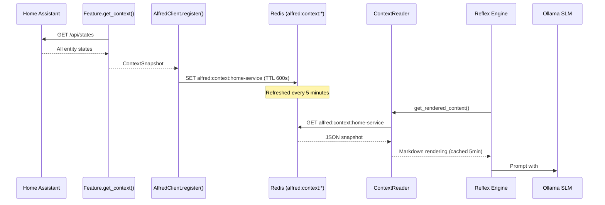

# Context Provider

Situational awareness for the Reflex Engine — services publish structured entity context to Redis so the SLM knows what devices exist and their current state.

## Overview

Without context, the Reflex Engine can only react to individual events in isolation. It knows *what changed* but not *what else exists*. The Context Provider system gives the SLM a snapshot of all controllable entities and sensors, enabling decisions like "dim the lights in the room where the TV just turned on" even if the lights haven't changed recently.

**Data flow:**



## Data Models

Defined in `sdk/alfred_sdk/context.py`:

```python
class ContextEntry(BaseModel):
    """A single entity's state snapshot."""
    entity_id: str          # e.g. "light.living_room"
    state: str              # e.g. "on", "off", "22.5"
    attributes: dict[str, Any] = {}  # e.g. {"brightness": 255}

class ContextSnapshot(BaseModel):
    """Structured context from a service, grouped by domain."""
    controllable: dict[str, list[ContextEntry]] = {}  # things the SLM can act on
    sensors: dict[str, list[ContextEntry]] = {}       # read-only observations

class ContextProvider(Protocol):
    """Protocol for services/features that provide context to Alfred."""
    async def get_context(self) -> ContextSnapshot: ...
```

`BaseFeature` implements `ContextProvider` with a default no-op (`return ContextSnapshot()`). Features override `get_context()` to publish their domain's entities.

## Write Path (SDK → Redis)

### Feature Implementation

Each `BaseFeature` subclass overrides `get_context()` to query its data source and return a typed snapshot:

```python
class LightingFeature(BaseFeature):
    async def get_context(self) -> ContextSnapshot:
        return await context_for_domain(self.ha, "light")
```

The `context_for_domain()` helper in `alfred_ext/ha_utils.py` handles the HA query, filtering, and error handling.

### Collection and Storage

`AlfredClient.register()` collects context from all features and writes it alongside the tool manifest:

1. Calls `get_context()` on each registered feature
2. Merges results into a single `ContextSnapshot` (keyed by domain)
3. Writes to `alfred:context:{service_name}` with a 10-minute TTL
4. If the merged snapshot is empty (no controllable entities, no sensors), the key is not written

The context key uses the `CONTEXT_KEY_PREFIX` constant (`alfred:context:`), defined in both `shared/streams.py` (for core consumers) and `sdk/alfred_sdk/client.py` (SDK must be standalone — no monorepo imports).

### Refresh Cycle

`home-service/app/server.py` runs a background task that calls `client.register()` every 5 minutes, refreshing both the tool manifest and entity context. The Redis TTL (600s) acts as a safety net — if the service crashes, stale context expires automatically.

## Read Path (Redis → Reflex Engine)

### ContextReader

`core/reflex/context_reader.py` provides the `ContextReader` class:

- Accepts the runner's long-lived Redis connection (no per-call connection churn)
- Reads from `alfred:context:{service_name}` on cache miss
- Caches the rendered Markdown for 5 minutes (matches the write-side refresh interval)
- Returns `""` if no context key exists (graceful degradation)

### Markdown Rendering

`render_snapshot()` converts a `ContextSnapshot` into Markdown for the LLM prompt:

```markdown
### Lights
- light.living_room: on (brightness: 255)
- light.bedroom: off

### Scenes
- scene.movie_night: scening

### Sensors
- sensor.temperature: 22.5
```

Controllable entities include their attributes (parenthesized). Sensors show state only. Domains are sorted alphabetically for deterministic prompts.

### Prompt Injection

The `ReflexEngine` inserts the rendered context as a `## Home State` section, positioned between the system prompt (with tools) and user preferences:

```
{system prompt with available tools}

## Home State
{rendered context}

## User Preferences
{preferences from core/memory/preferences/}

## Event
{current event details}

## Your Decision (JSON only):
```

If no context is available (reader returns `""`), the section is omitted entirely.

## Key Files

| File | Purpose |
|------|---------|
| `sdk/alfred_sdk/context.py` | `ContextEntry`, `ContextSnapshot`, `ContextProvider` protocol |
| `sdk/alfred_sdk/feature.py` | Default `get_context()` on `BaseFeature` |
| `sdk/alfred_sdk/client.py` | `_collect_context()`, context write in `register()` |
| `shared/streams.py` | `CONTEXT_KEY_PREFIX` constant |
| `core/reflex/context_reader.py` | `ContextReader` (TTL cache) + `render_snapshot()` |
| `core/reflex/engine.py` | Context injection into LLM prompt |
| `core/reflex/__main__.py` | `ContextReader` wiring |

## Redis Keys

| Key | Type | TTL | Purpose |
|-----|------|-----|---------|
| `alfred:context:{service_name}` | String (JSON) | 600s | Service's entity context snapshot |

## Deferred Work

See `docs/backlog/context-provider.md`:

- **Agent-scoped context visibility** — replace hardcoded `home-service` key with multi-service scan (`SCAN alfred:context:*`)
- **Option C entities** — automations, scripts, input_booleans (entities the SLM should know about but aren't tools)
