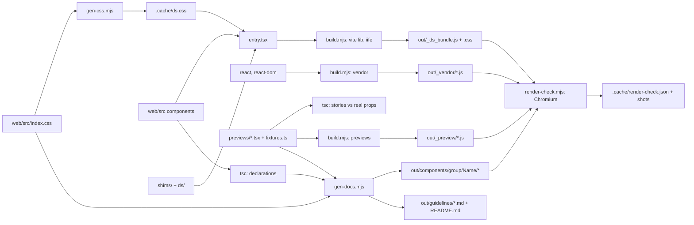

# Design System Sync

The web client's components, tokens and type, packaged as a design system for
claude.ai/design ("Alfred Design System"), so designs are composed from what ships
rather than from a mock-up. Everything in the package is generated from `web/`; the
only things written by hand are the preview stories and their sample data, and those
are type-checked against the real component props on every run.

The design handoff (`docs/design/2026-09-04-pwa-client-handoff/`) is the goal the client
was built towards. This package is the other end: what the client actually renders
today. Where the two disagree, this one is true.

## Running it

```bash
cd web
npm ci                 # once
npm run design-sync    # → web/design-system/out/  (gitignored)
```

The run stops at the first step that disagrees with the code:

| Step | What it checks | Fails when |
|---|---|---|
| `gen-css.mjs` | `web/src/index.css` still has the token blocks and base layer it rewrites | the stylesheet changed shape |
| `tsc -p tsconfig.previews.json` | every story against the real props in `web/src` | a prop was renamed, removed or retyped |
| `tsc -p tsconfig.decl.json` | declarations emit for every exported component | a component stops type-checking |
| `build.mjs` | the bundle, React globals, fonts and previews build | an import no longer resolves |
| `gen-docs.mjs` | every component in `GROUPS` is exported and has a doc comment and a story | a component moved or lost its export |
| `render-check.mjs` | every card and every story renders in Chromium with no page or console error, nothing empty, no two variants identical | a component throws, or a story renders nothing |

The render check needs Playwright with Chromium. The cloud dev container ships both;
elsewhere, `npm i -g playwright && npx playwright install chromium`, or point
`CHROMIUM_PATH` at a Chromium binary. `DESIGN_SYNC_SKIP_RENDER=1` skips it, and a
build that skipped it should not be uploaded.

Uploading is done from a Claude session with the `DesignSync` tool: list the project's
files, lock a plan to the paths in `out/`, and write them. The project is a
design-system project; uploads overwrite in place.

## Pipeline



## What is in the package

```
out/
  README.md                 what it is, how to build with it, component index
  styles.css                the one stylesheet: fonts, then _ds_bundle.css
  _ds_bundle.js / .css      window.Alfred: the components; the tokens and Tailwind utilities
  _vendor/react*.js         React 19 as window.React / window.ReactDOM (19 ships no UMD)
  fonts/                    DM Sans Variable + Geist Mono, from the client's @fontsource packages
  guidelines/               colour, type, motion: tables parsed from index.css, with its comments
  components/<group>/<Name>/
    <Name>.prompt.md        the component's doc comment, its stories, its props
    <Name>.d.ts             tsc's declaration, plus every local type it uses, inlined
    <Name>.html             a card rendering every story (first line: @dsCard group)
    <Name>.jsx              window.Alfred.<Name> re-exported to window
  _preview/<Name>.js        the stories, built
```

Groups: `foundation` (Page, RoomScreen), `room`, `timeline`, `door`, `gates`, `sheets`,
`workshop`. The list is `GROUPS` in `gen-docs.mjs`.

## The two canvas-only pieces

- **`Page`** (`ds/Page.tsx`) gives a subtree a theme. The app writes `data-theme` on
  `<html>` because it is the whole document; a canvas shows several pages side by side,
  so the tokens are re-scoped from `:root[data-theme]` to `[data-theme]` (in
  `gen-css.mjs`) and the theme comes from the nearest Page. `shims/ThemeProvider.tsx`
  replaces `web/src/shell/ThemeProvider.tsx` in the bundle with the same `useTheme()`
  shape, so `ThemeToggle` and `PresenceField` are unmodified.
- **`RoomScreen`** (`ds/RoomScreen.tsx`) is `web/src/room/Room.tsx`'s layout with props
  where Room has its socket, hooks and providers. If Room's layout changes, this file
  changes with it.

Everything else in `window.Alfred` is the component from `web/src`, bundled unmodified.

## Sample data

`previews/fixtures.ts` holds raw stream entries and API shapes, not finished rows. The
Room's thread goes through the client's own `toTimelineItems`, `tombstoneItems` and
`withDividers`, so divider labels, meta lines and tombstone copy are whatever the code
makes of them. The clock is pinned (`NOW`), so fuses and "tomorrow" labels do not move
between runs.

## Adding a component

1. Export it from `entry.tsx`.
2. Add `previews/<Name>.tsx`: named PascalCase exports, each a story wrapped in a `<Page>`.
   Use both themes across the stories, and take data from `fixtures.ts`.
3. Add its name to a group in `GROUPS` (`gen-docs.mjs`). Overlays that portal to `<body>`
   go in `FRAMES`; phone-sized stories in `PHONE`.
4. Make sure the source has a doc comment above `export function <Name>`: it becomes the
   component's description.
5. `npm run design-sync`.

## Left out, and why

The four benches, `Workshop`, the Held-back and Why sheets, `SetupGate`, `SignInGate`,
`ExpiredGate` and `IntegrationRow` read live data through react-query hooks or call
WebAuthn, so they do not render without a server. Their rows and controls are in the
package.

## Gotchas

- **CommonJS and browser globals.** `react-dom` `require`s `react`. Marking `react`
  external maps ESM imports to `window.React`, but leaves CommonJS calling a `require`
  that does not exist in a browser. `build.mjs` aliases `react`, `react-dom` and `@ds` to
  one-line shims (`module.exports = window.React`) instead.
- **Portals and theme.** `Sheet` and `DoorLayer` portal to `<body>`, outside their Page,
  so they take their tokens from `<html>`. Their cards render each story in its own
  frame, and a story rendered alone copies its Page's theme onto `<html>`.
- **Lists.** `EventRow`, `TriggerRow` and `RoutineRow` are `<li>`s. Their stories wrap
  them in the bench's own `<ul role="list" className="m-0 flex list-none flex-col p-0">`.
