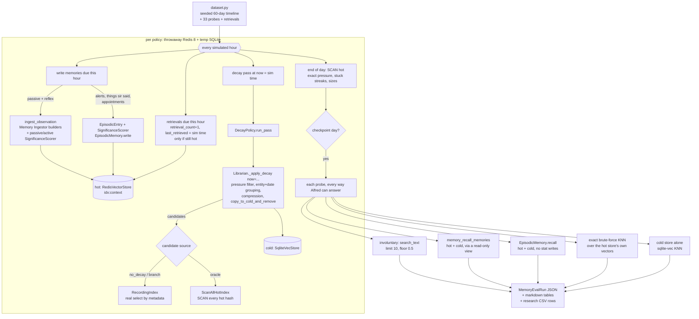

# Memory-Decay Eval

Measures what the Librarian's contextual decay does **for the user**: does moving
episodic memories from the hot store (Redis) to the cold store (SQLite) help Alfred
recall what matters, and what does it cost? It replays weeks of a simulated house
against the real memory stack in minutes, compares decay policies side by side, and
needs no LLM.

```bash
# All registered policies, 60 simulated days, production's embedding model on CPU
CUDA_VISIBLE_DEVICES="" EMBEDDING_MODEL=google/embeddinggemma-300m \
  uv run python -m evals memory run --research-csv research/data/memory-decay.csv

uv run python -m evals memory run --policy branch --policy oracle --days 30
uv run python -m evals memory policies        # what is registered
uv run python -m evals memory runs            # saved runs (evals/runs/memory/, gitignored)
uv run python -m evals memory show <run-id>   # re-print a saved run's tables
```

The run needs Docker (or `--redis-url` pointing at an **empty** Redis 8 / Redis
Stack you started yourself) and the `memory` extra. Experiment log:
`research/experiments/EXP-006-memory-decay.md`.

## Why decay exists

Passive observation writes memories whether or not anyone talks to Alfred (~220 a
day in the simulated house). Before every reply the Conscious Engine pulls the 10
closest hot memories into its prompt — involuntary recall,
`ContextIndexManager.search_text(limit=INVOLUNTARY_RECALL_LIMIT,
min_similarity=INVOLUNTARY_RECALL_THRESHOLD)` in `core/conscious/engine.py`. The
design (`docs/superpowers/specs/2026-03-24-phase3-memory-completion-design.md` §8.3)
says routine state changes should leave hot within a cycle or two, alerts should
stay for weeks and frequently recalled memories indefinitely, so that "hallway light
off" never crowds out "plumber is coming Thursday".

## Isolation

Nothing in the eval can reach a live Alfred:

- **Redis.** RediSearch indexes exist only in DB 0, so a different DB number on a
  shared server would still share `idx:context`. Every policy gets its own
  container (`redis:8-bookworm` — the image the fat Alfred image copies its
  redis-server and modules from), published on a random loopback port and removed
  afterwards. `RedisSandbox` refuses any server that holds a single key or index,
  or lacks the query engine, and refuses the configured `REDIS_URL` outright.
- **Cold store.** SQLite in a `TemporaryDirectory`, deleted after each policy.
- **Files.** Semantic sections and routines are written to the same temp dir; the
  repo's `core/memory/preferences|profile` are never read.

## Flow



## What is real and what is not

| Piece | In the eval |
|---|---|
| RediSearch, vector index, KNN | Real (Redis 8.2, the production query engine) |
| sqlite-vec cold store | Real |
| Embedding model | Real, via `build_embedding_provider()`; set `EMBEDDING_MODEL` to match the deployment |
| Write path | Real: `ingest_observation` for passive/Reflex, `SignificanceScorer` + `EpisodicMemory.write` for the rest |
| Significance | Real heuristic scorer, with the per-population frequency keys the ingestor uses |
| Decay | Real `Librarian._apply_decay`, driven through its `now=` seam |
| Compression summary | The Librarian's own no-LLM fallback (`" \| ".join(contents)`) — deterministic; summary *quality* is out of scope |
| Entities on significant memories | Hand-written — what the Librarian's analysis LLM would extract |
| Retrievals | Written as stats at simulated times (`retrieval_count`, `last_retrieved`), and only while the memory is hot — the same rule `record_retrievals` follows |
| Clock | Simulated: data timestamps and every `now` the decay code sees |

Two lenses wrap the real stack (`evals/memory/env.py`):

- `CountingEmbedder` counts and times every `embed()` by phase. Writes and probes may
  be served from a text cache (the model is deterministic, so the vectors are the
  same); decay passes never are, so their cost is real.
- `ReadOnlyStore` runs the real `memory_recall_memories` path but swallows the
  `update_metadata` it triggers: `record_retrievals` stamps the **wall clock**, which
  inside a simulation would plant 2026 retrievals into memories the decay pass then
  reads. Suppressed writes are counted in each policy's result.

## The simulated house

`evals/memory/scenario.py` holds the content, `dataset.py` the seeded timeline.

| Category | Count (60 days) | What it is |
|---|---|---|
| `routine` | ~12,800 | Passive state changes: motion, lights, doors, locks, thermostat, outdoor temperature, TV and speaker sessions, vacuum, presence, sun |
| `reflex` | ~430 | System 1 actions (motion lights, porch at sunset, dim for the TV) |
| `significant` | 30 | Alerts, things sir said, appointments and deliveries |
| `recalled` | 5 | Memories sir asks about every 2–7 days |
| `detail` | 8 | One-off low-significance observations sir might ask about later (a documentary title, a washing-machine error) |

Plus 13 semantic sections (two Markdown files, indexed by
`reindex_semantic_files()`) and 6 routines (indexed by `_reindex_routines()`), so
non-episodic entries occupy search slots exactly as they do in production.

**Probes.** 33 questions, each with one known target: 20 significant, 5 recalled,
8 detail. They were written as a user would ask them, before any run. A probe is
asked at a checkpoint only once its target exists.

## Policies

Every policy implements `DecayPolicy.run_pass(now) -> PassStats` and registers with
`@register_policy`. The three baselines all run the real `_apply_decay` and differ
only in the candidate source and the threshold:

| Policy | Candidates | Threshold | Answers |
|---|---|---|---|
| `no_decay` | real selection — none at 1.0 | 1.0 (master) | What master does: no pressure exceeds 1.0, so nothing moves (and the pass makes no query) |
| `branch` | real `select()` by metadata (`decay_candidate_ranges`) | 0.2 | What this branch does |
| `oracle` | every hot hash, by SCAN | 0.2 | Is the **formula** good, if selection were perfect? |

**Adding a fix.** A fix that changes `_apply_decay` itself shows up under `branch`
on the next run, and the saved run JSON plus the EXP log keep the old numbers. A fix
that is a different strategy registers as a new policy — subclass `LibrarianDecay`
and override `candidate_source()` / `effective_threshold()`, or subclass
`DecayPolicy` directly — and appears as one more row in every table.

## Metrics

Measured at each checkpoint (default days 30, 45, 60):

| Metric | Definition |
|---|---|
| **Involuntary hit@10** (headline) | Target among what involuntary recall returns, exactly as the engine calls it. Compared against `no_decay` |
| Exact-search hit@10 | Target in the top 10 of a brute-force cosine ranking over the hot store's own vectors, above the floor — what a perfect KNN would return |
| Hit@10 at floor 0 | The same real search with `min_similarity=0.0` — separates "under the threshold" from "ranked too low" |
| Noise in top-10 | Mean `routine`/`reflex` entries in what involuntary recall returned |
| Deliberate reachability | For targets no longer hot: found by `memory_recall_memories` (`ContextIndexManager.recall`, hot + the cold archive), by `EpisodicMemory.recall` (hot + cold), and by the cold store searched alone — which separates "the archive does not hold it" from "the merge with hot results buried it". A compression summary containing the target counts. The bar is the spec's (§6.2, §7.4): archived memories stay reachable |
| Kept | Share of `significant` / `recalled` memories still hot |
| Forgotten | Hot episodic size over time; share of `routine`+`reflex` memories older than 14 days that left hot |
| Stuck | Hot memories whose exact pressure (at the configured threshold, for every policy) has been above it at ≥2 consecutive daily checks (≥24 passes) or ≥8 (≥7 days) |
| Unselected | Eligible hot memories the decay pass's own `select()` would not return — zero unless the metadata ranges stop covering the pressure formula |
| Search misses | Targets the exact ranking puts in the top 10 that the real query did not return — for the filtered involuntary query and the unfiltered tool query. Hot KNN is exact (`HYBRID_POLICY ADHOC_BF`; EXP-006 measured 73–90% misses under the HNSW walk), so what remains is ties — the exact rank does not count entries scoring the same as the target against it, and passive observations share semantic keys by the hundred — and, for the tool, cold results outranking a hot target in the merge |
| Cost | Wall time and `embed()` calls per decay pass; embeds per migrated memory; summed embed time per pass (a pass embeds concurrently, so this can exceed its wall time) |

## Determinism

Seeded timeline, deterministic ids (`obs-DD-NNNN`, `rfx-…`, `sig-NN`, `rec-NN`,
`det-NN`), fixed write order. Before hot searches became exact, two 60-day runs with
the same seed agreed on every number except the ones the **unfiltered** KNN query
produced — `memory_recall_memories` hits (T), `EpisodicMemory.recall` hits on hot
targets (R) and the tool's miss rate — which moved by one or two targets per
checkpoint, because RediSearch does not build the same HNSW graph twice. Exact KNN
takes the graph out of every query; the filtered involuntary query, migrations, sizes
and every decay metric were identical even then. Wall-clock fields always differ (`wall_ms`, `embed_ms`, `wall_seconds`,
`decay_embed_seconds`, `run_id`, `timestamp`); compression summary ids are `uuid4`
but are never compared.

## Outputs

- `evals/runs/memory/<run-id>.json` — `MemoryEvalRun` (gitignored): every pass,
  every daily snapshot, every probe outcome.
- Markdown tables on stdout (`format_run`), and again from `memory show`.
- One CSV row per (policy, checkpoint), appended to `--research-csv` (default
  `<RESEARCH_VAULT_PATH>/data/memory-decay.csv`) — append-only, per the research
  protocol.

## Key paths

| Path | What |
|---|---|
| `evals/memory/scenario.py` | Devices, significant events, recalled and detail memories, probes, semantic files, routines |
| `evals/memory/dataset.py` | `build_dataset(seed, days)` — the deterministic timeline |
| `evals/memory/sandbox.py` | `RedisSandbox`, `assert_disposable` |
| `evals/memory/env.py` | `SimEnv` wiring, `CountingEmbedder`, `ReadOnlyStore`, `scan_hot`, `stored_vectors` |
| `evals/memory/policies.py` | `DecayPolicy`, `POLICIES`, the three baselines |
| `evals/memory/metrics.py` | `decay_pressure`, `EligibilityTracker`, probes, checkpoints |
| `evals/memory/runner.py` | The hour-by-hour replay |
| `evals/memory/report.py` | Markdown tables |
| `evals/memory/cli.py` | `python -m evals memory …` |
| `core/librarian/consolidator.py` | `_apply_decay(now=…)` — the clock seam |

## Gotchas

- **Use the deployment's embedding model.** Similarity scales differ by model, and
  involuntary recall's 0.5 floor is absolute. The deployment runs
  `google/embeddinggemma-300m`; a fresh clone defaults to `all-MiniLM-L6-v2`.
- **Run it on CPU** (`CUDA_VISIBLE_DEVICES=""`) on a box whose GPU serves vLLM.
- **The tests** run without Redis or a model. The end-to-end test against a real
  container is opt-in: `ALFRED_MEMORY_EVAL_DOCKER=1 uv run pytest
  tests/evals/test_memory_runner.py`.
