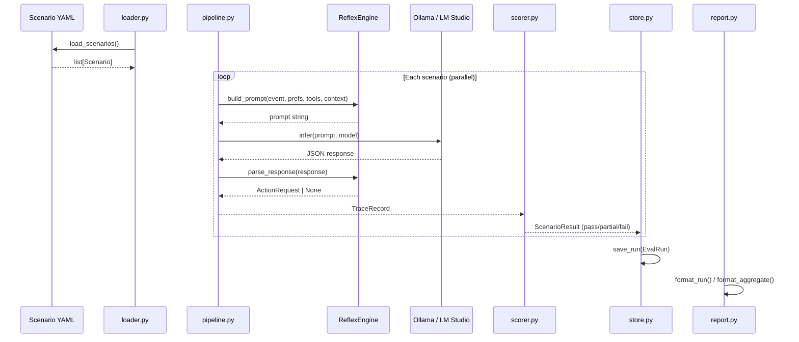

# Evals Runner

Scenario-based evaluation framework for the Reflex Engine — tests SLM output against predefined YAML scenarios, captures full inference traces, and supports run-over-run comparison.

## Overview

The Evals Runner measures how reliably the Reflex Engine's SLM produces correct actions for known events. Each scenario defines an event, the expected action (or no action), and optionally a captured context fixture from live Home Assistant state. The runner scores each response as pass/partial/fail, saves full traces, and supports aggregate reporting across multiple runs to measure consistency.

**Data flow:**



## CLI Usage

```bash
# List available scenarios
python -m evals list

# Run all scenarios (default: Ollama)
python -m evals run --model gpt-oss:20b

# Run with LM Studio backend
python -m evals run --model gpt-oss:20b --backend lmstudio

# Run 5 times with aggregate pass rates
python -m evals run --model gpt-oss:20b -n 5

# Filter by tag
python -m evals run --tag lighting

# Run a single scenario
python -m evals run --scenario evals/scenarios/home/tv_on_dims_lights.yaml

# Capture live HA context from Redis
python -m evals capture-context --output default.json

# List saved runs
python -m evals runs

# Compare two runs
python -m evals compare <run_id_1> <run_id_2>
```

## Data Models

Defined in `evals/models.py`:

```python
class ExpectedAction(BaseModel):
    tool_name: str                          # e.g. "lighting.dim_lights"
    target_service: str | None = None       # e.g. "home-service"
    parameters: dict[str, Any] | None = None  # e.g. {"room": "living_room"}

class Scenario(BaseModel):
    name: str
    description: str | None = None
    tags: list[str] = []
    event: StateChangedEvent
    preferences_dir: str | None = None
    context: str | None = None              # fixture filename in evals/contexts/
    expected: ExpectedAction | None         # None = no action expected

class Verdict(StrEnum):
    PASS = "pass"
    PARTIAL = "partial"                     # correct tool, wrong params
    FAIL = "fail"

class ScenarioResult(BaseModel):
    scenario: Scenario
    verdict: Verdict
    reason: str
    trace: TraceRecord                      # full inference trace

class EvalRun(BaseModel):
    run_id: str
    timestamp: datetime
    model: str
    results: list[ScenarioResult]
    scenario_count: int                     # computed field
    summary: dict[Verdict, int]             # computed field
```

## Scenario Format

YAML files in `evals/scenarios/<domain>/`:

```yaml
name: tv_on_dims_lights
description: "When TV turns on, dim living room lights"
tags: [home, lighting, canonical]
context: default.json                       # optional: HA context fixture
event:
  domain: home
  entity_id: media_player.living_room_tv
  old_state: "off"
  new_state: "on"
  source: eval
  attributes:
    friendly_name: "Living Room TV"
expected:
  tool_name: lighting.dim_lights
  parameters:
    room: living_room
```

For negative scenarios (no action expected), set `expected: null`.

## Context Fixtures

Context fixtures ground the SLM with real HA entity state. Without them, the model guesses room names from natural language in preferences (e.g., "living room" vs "living_room").

**Capture from live services:**

```bash
# Requires home-service running and publishing context to Redis
python -m evals capture-context --output default.json
```

This reads all `alfred:context:*` keys from Redis and saves raw `ContextSnapshot` JSON to `evals/contexts/default.json`.

**Fixture format** (maps service names to ContextSnapshot objects):

```json
{
  "home-service": {
    "controllable": {
      "light": [
        {"entity_id": "light.living_room", "state": "on", "attributes": {"brightness": 102}},
        {"entity_id": "light.bedroom", "state": "off", "attributes": {}}
      ]
    },
    "sensors": {}
  }
}
```

At eval time, fixtures are loaded, deserialized into `ContextSnapshot` objects, rendered to Markdown via `render_snapshot()`, and injected as the `## Home State` prompt section.

## Scoring Logic

Defined in `evals/scorer.py`:

| Condition | Verdict |
|-----------|---------|
| Expected no action, got no action | PASS |
| Expected no action, got an action | FAIL |
| Expected action, got no action | FAIL |
| Wrong tool_name | FAIL |
| Wrong target_service | FAIL |
| Correct tool, all params match (with type coercion) | PASS |
| Correct tool, params mismatch | PARTIAL |
| Correct tool, no params specified in expected | PASS |

Type coercion handles the SLM returning `"40"` instead of `40`.

## Inference Backends

Defined in `evals/inference.py`:

- **`ollama`** (default) — hits `/api/chat` with `format: "json"`
- **`lmstudio`** — hits OpenAI-compatible `/v1/chat/completions` with `response_format: {"type": "json_object"}`

Both backends share a connection-limited httpx client (`max_connections=16`). The `InferFn` protocol allows adding new backends.

## Parallel Execution

- **Within a run:** All scenarios execute concurrently via `asyncio.gather`
- **Across runs:** Repeats (`-n N`) execute sequentially to give reliable latency measurements and avoid overwhelming the inference server
- **Context caching:** Fixture files are loaded and rendered once per unique filename (`@functools.cache`)

## Key Paths

| Path | Description |
|------|-------------|
| `evals/__main__.py` | CLI entry point |
| `evals/models.py` | Scenario, Verdict, EvalRun, ScenarioResult |
| `evals/pipeline.py` | EvalContext, run_scenario() |
| `evals/inference.py` | InferFn protocol, Ollama/LM Studio backends |
| `evals/scorer.py` | score() — verdict logic |
| `evals/loader.py` | YAML scenario loading with tag filtering |
| `evals/store.py` | JSON save/load for EvalRun |
| `evals/compare.py` | Run-over-run diff |
| `evals/report.py` | Terminal formatting, aggregate stats |
| `evals/context_fixtures.py` | Context fixture loading and rendering |
| `evals/scenarios/` | YAML scenario files by domain |
| `evals/contexts/` | Captured context fixtures |
| `evals/runs/` | Saved run JSON (gitignored) |
| `shared/tracing.py` | TraceRecord model |
