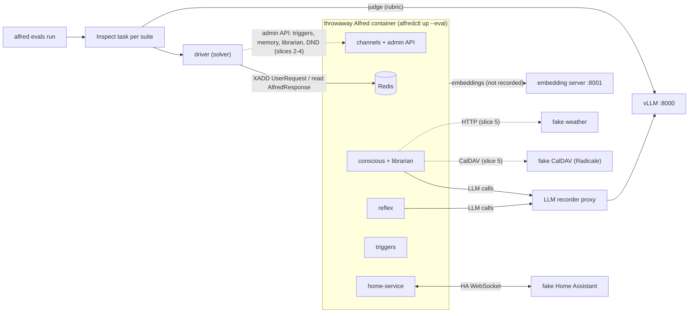
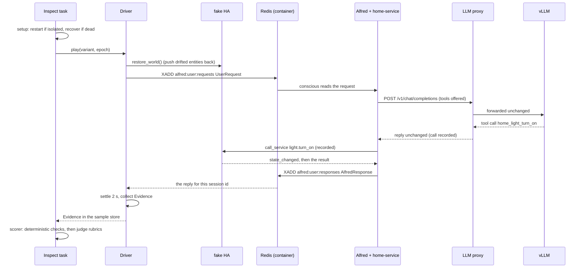

# PRD Eval Suite

Developer documentation for `alfred evals` -- the harness that checks whether Alfred does
what `docs/PRD.md` says it does.

## Overview

Every requirement in the PRD that an LLM decides is to be asserted by **goldens**: short
scripted conversations played against the real assembled stack. Rows whose suite is not
built yet are mapped as pending until it is. A golden says what the user types
(or what happens in the house) and what must follow: which Home Assistant service was
called, which tool the model chose and with which arguments, what the reply says, how fast
it came, and, where only a reader can tell, whether a judge model agrees the reply is right.

The suite proves three things that unit tests cannot:

1. **The wiring works.** Each golden runs against a throwaway copy of the production fat
   image, driven over its own Redis bus. The home-service bundled into it is the commit
   production runs, and it talks to a fake Home Assistant over the real WebSocket API.
2. **The model's judgment holds.** Each golden runs several times (epochs) and in several
   phrasings (variants), so a feature that works once, or for one wording, shows up as flaky.
3. **Nothing in the PRD is forgotten.** `evals/coverage.yaml` maps every PRD row to goldens,
   to tests, or to a stated reason it involves no LLM, and a pytest check keeps that map
   complete as the PRD changes.

**Every LLM role runs on vLLM.** System 1 (Reflex), System 2 (Conscious), the Librarian and
the judge all use the vLLM-served model (`gemma-4-26b-a4b` by default), and embeddings come
from the local embedding server (`BAAI/bge-m3`). A run costs nothing per call. Production's
System 2 runs a different model, so System 2 scores describe the eval model; `--model`
changes it for every role at once.

The harness is built on [Inspect AI](https://inspect.aisi.org.uk): one Inspect task per
suite, epochs for model noise, and Inspect's local log viewer for every failure.

Slice 1 (this document) ships two suites, `home_control` and `conversation`, against one
world, `apartment`. The design and the later slices are in
`docs/superpowers/specs/2026-10-06-prd-eval-suite-design.md`.

The memory-decay eval is separate and unchanged: `python -m evals memory` (or
`alfred evals memory`, which passes its arguments through), documented in
`docs/evals-memory.md`.

---

## Architecture



Dashed edges are later slices. Everything outside the container runs on the host, in the
`alfred evals` process: the fake Home Assistant, the proxy, the driver and the judge. The
fakes listen on the docker bridge's gateway address, and the container reaches them as
`host.docker.internal`.

**The fake Home Assistant** (`evals/harness/fake_ha.py`) is a WebSocket server speaking the
subset of HA's API that home-service uses: auth, `subscribe_events`, the entity, device and
area registry lists, `get_states`, `get_services` and `call_service`. It serves a **world**
(`evals/harness/worlds/apartment.yaml`): a fictional two-bedroom apartment with areas,
devices, lights, a switch, a media player, scenes, a lock, a garage cover, an alarm panel,
door, motion and temperature sensors, and the services that act on them. A `call_service`
is validated the way HA validates it (unknown service, number out of its selector's range),
recorded with a timestamp, applied to the fake's state (`light.turn_on` with
`brightness_pct` sets `brightness`, `lock.lock` sets `locked`, and so on), and pushed back
as `state_changed` before the result is sent, so Alfred's live state follows exactly as it
would with a real HA. The driver also pushes state changes through it (`ha_event` steps).
Before each sample, every entity that drifted is restored to the world and the change
pushed, so goldens do not inherit each other's lights.

**The LLM recorder proxy** (`evals/harness/proxy.py`) is an OpenAI-compatible pass-through
in front of vLLM. System 2's tool calls go to the model and to home-service, never onto a
stream, so the proxy is the only place their arguments can be seen. It records every
`POST /v1/chat/completions`: the role (System 1, System 2 or the Librarian, told apart by
the first message's text, `ROLE_FINGERPRINTS`; anything else is `unknown`), the messages,
the tools offered, the reply text, the tool calls with their arguments, token counts and
latency. It never changes a request or a reply. Other paths pass through unrecorded, and
streaming requests are refused. At most 4 requests are upstream at once, because the vLLM
server is shared with production.

**The driver** (`evals/harness/driver.py`) is the Inspect solver. It plays one variant of a
golden: for each `user` step it `XADD`s a `UserRequest` to `alfred:user:requests` with a
session id unique to the golden, variant and epoch, and waits up to 120 s for the
`AlfredResponse` on `alfred:user:responses` (the same `publish_and_wait()` the web channel
uses), then waits a 2 s settle window for side effects. A reply from anything but System 2
is a harness error. When the steps are done it collects the **evidence**
(`evals/harness/evidence.py`): the transcript, every reply with its latency, the fake HA's
calls and the proxy's LLM calls inside the sample's time window, and the fake HA's final
states. Evidence is the only input the checks and the judge see.

**The stack** (`evals/harness/stack.py`) boots one throwaway container per suite with
`alfredctl up --eval` (see "Eval mode" in `docs/containerization.md`) on a fresh data dir.
The harness passes every setting the stack needs (`container_env()`), never the operator's:
System 1 and System 2 pointed at the proxy, embeddings at the embedding server, `HA_HOST` at
the fake HA with a fake token, and the Librarian's interval pushed to a day so it never runs
mid-suite. The stack is ready when `/health` answers, home-service has connected to the fake
HA, and System 2 has answered a real request ("Reply with the single word: ready.") -- up to
420 s in all. It records the suite's first boot time and that first reply's latency for the
scorecard. Before each sample the task checks the container is still running and restarts a
dead one, once per suite. Teardown removes the container and wipes the data dir (the
container writes it as root).

### One sample



---

## Running locally

### Requirements

- **Docker on Linux.** The harness builds and runs the image with `--runtime docker`, and
  the fakes bind the docker bridge's gateway address, which the host owns on a Linux
  Docker engine.
- **vLLM** serving the eval model at `http://localhost:8000/v1`, and an **embedding
  server** (vLLM with `--runner pooling`) serving `BAAI/bge-m3` at `http://localhost:8001`.
  Both are checked before anything is built.
- **A home-service checkout at `origin/main`**, with no uncommitted changes.

### One-time setup

```bash
uv sync --all-extras    # the `evals` extra holds inspect-ai, aiohttp and websockets

# A home-service checkout pinned to what production runs, apart from your working copy:
git -C ~/code/alfred-deploy/home-service fetch origin main
git -C ~/code/alfred-deploy/home-service worktree add --detach \
  ~/code/.worktrees/home-service/evals-main origin/main
export ALFRED_EVALS_HOME_SERVICE=~/code/.worktrees/home-service/evals-main
```

`--home-service PATH` does the same per run. Without either, the build uses the
`home-service` checkout beside the main Alfred checkout. Each run fetches `origin/main` and refuses a checkout that is
behind it or dirty; move the worktree forward with
`git -C <checkout> checkout --detach origin/main`.

### Calibrate the judge

```bash
uv run alfred evals calibrate                 # --model, --vllm-url as for run
```

```
answered       100% of 5  trusted
faithfulness    88% of 8  trusted  disagreed: faithfulness-6
tone            80% of 5  UNTRUSTED  disagreed: tone-4
saved ~/.local/share/alfred-evals/calibration.json
```

(Illustrative numbers.) Run it once per model: a run on a model with no calibration of its
own treats every judge check as untrusted. See [The judge and calibration](#the-judge-and-calibration).

### List the goldens

```bash
uv run alfred evals list --include-pending    # suites and --tag filter as for run
```

```
home_control.control_surface.media_volume               pending  ×1  4.4.control-surface
home_control.devices.coffee_maker                       shipped  ×2  principle.3
home_control.lights.dim_to_percent                      shipped  ×2  4.4.lights-scenes
```

One line per golden: id, status, how many samples its variants make, and the PRD rows it
cites. `list` loads and validates every golden, so it is also the quick check after editing
one.

### Run suites

```bash
uv run alfred evals run home_control conversation
uv run alfred evals run --epochs 1 --tag lights            # a quick pass over one topic
uv run alfred evals run --include-pending --no-build --keep
```

| Option | Default | What it does |
|---|---|---|
| `[suites]...` | all | Suites to run, by directory name under `evals/suites/` |
| `--tag` | none | Only goldens carrying this tag (repeatable; any match) |
| `--include-pending` | off | Also run `pending` goldens |
| `--epochs` | 3 | Runs per sample |
| `--model` | `gemma-4-26b-a4b` | vLLM served model, used in every LLM role and as the judge |
| `--vllm-url` | `http://localhost:8000/v1` | vLLM base URL, with `/v1` |
| `--embed-url` | `http://localhost:8001` | Embedding server, without `/v1` |
| `--embed-model` | `BAAI/bge-m3` | Embedding model (bge-m3 also sets its recall floor, 0.575) |
| `--home-service` | `$ALFRED_EVALS_HOME_SERVICE`, else the sibling repo | home-service checkout to bundle |
| `--allow-stale-home-service` | off | Accept a checkout that is not at `origin/main`, or whose fetch failed; never a dirty one |
| `--build` / `--no-build` | build | Build the image first. With `--no-build` the scorecard marks the commit "(image not rebuilt)", because it cannot know what the image holds |
| `--keep` | off | Leave the container and data dirs for debugging. Every suite's container has the same name, so only the last suite's survives; every suite's data dir is kept. A restart (an isolated golden, or a recovery) replaces that suite's data dir |
| `--display` | `rich` | Inspect's console display: `rich`, `plain` or `none`. Inspect's `full` display crashes under `eval_async`, so it is not offered (`evals/harness/display.py`) |

### What a run does

1. **Plan.** Load the suites, pick goldens by tag and status, and expand variants. A golden
   that fails validation stops the run here.
2. **Preflight**, before anything is built:
   - vLLM lists `--model`, and the embedding server lists `--embed-model`;
   - the home-service checkout is clean and at `origin/main` (its commit goes on the
     scorecard);
   - the Alfred commit, with `+dirty` when the tree has uncommitted or untracked files
     (the build stages both);
   - the judge calibration file reads (a corrupt one is a one-line error telling you to
     re-run `calibrate`);
   - the docker bridge has a gateway address.
3. **Build** the image with `alfredctl build --runtime docker`, bundling the checked
   home-service. A failed build is a one-line error after the build output.
4. **Start the fakes** -- the fake HA and the proxy -- on the bridge gateway.
5. **Each suite, one at a time:** boot its stack, run its Inspect task one sample at a time
   (an errored sample is retried once), and tear the stack down. A suite whose stack fails
   to start is recorded under "Run problems" and the next suite still runs.
6. **Scorecard.** Print it, and write `report.md` and `report.json` to the run directory.

An error before step 5 -- a bad golden, a preflight failure, a failed build -- is a message
on stderr starting `alfred evals:`, and exit 1. After a run
whose stacks all started the exit code is 0, whatever the scores. If any suite's stack
failed to start, the scorecard is still written and the command exits 1, naming the failed
suites.

---

## Reading results

A run writes to `evals/logs/<UTC timestamp>/` (gitignored) and ends by printing it:

```
logs and report: evals/logs/20261007T141500Z  (inspect view --log-dir evals/logs/20261007T141500Z)
```

| File | What it holds |
|---|---|
| `report.md` | The scorecard, as printed |
| `report.json` | The same scorecard as data (`Scorecard` in `evals/harness/report.py`), stack numbers included |
| Inspect logs | One per suite: every sample and epoch with its transcript, score and evidence |
| `data/` | Each stack's data dir; removed at teardown unless `--keep` |

### The values

Each sample epoch scores one value:

| Value | Meaning | Counts against Alfred? |
|---|---|---|
| `C` | Every counted check passed | -- |
| `I` | A counted check failed | Yes |
| `N` | Inconclusive: no counted check failed, but one errored (a judge with no verdict, a check that raised), or nothing counted at all (only untrusted judge checks) | No |
| `E` | The harness failed: no reply from System 2 in time, a dead container, unreadable data. Inspect retries the sample once first | No |

A check is **counted** unless it is a judge check in an untrusted category.

### The scorecard

Sections, in order:

1. **Header.** Model, Alfred commit, home-service commit, epochs, and the judge's trust:
   which categories are trusted, untrusted and uncalibrated. With no calibration for the
   model, it says every judge check is untrusted.
2. **Stack lines**, one per suite that started: `boot` (seconds to the first ready), `first
   reply` (the readiness request, the very first request after boot -- the cold-start
   number for PRD 4.7's warmup row) and `recoveries` (dead-container restarts; there is one
   per suite, and once it is spent every later sample in the suite errors at once).
3. **Run problems**, when there are any: suites whose stack never started, logs that failed
   or were cancelled, and sample epochs missing from a log.
4. **PRD rows.** One row per PRD id that shipped goldens cite: how many goldens, the mean of
   their pass rates, and how many of them passed every run (pass^k).
5. **One table per suite** of shipped goldens:
   - **variants**, **runs** (variants × epochs);
   - **pass rate** = `C / (C + I)` -- errors and inconclusive runs are left out, and the
     rate is `—` when nothing was scored;
   - **pass^k** ✓ only when every run of every variant scored `C`;
   - **flaky** ⚠ when the golden passed some scored runs and failed others;
   - **errors**, the count of `E` runs;
   - **first failing check**: counted check failures from `I` runs first, then harness
     errors, then errored checks from `N` runs (mostly judge errors).
6. **Not yet working (pending).** Pending goldens and their pass rates. They never count
   toward a PRD row.
7. **LLM usage** by role (calls, prompt and completion tokens, p50 and p95 latency), then
   the reply latency p50 and p95 over every reply.

### Inspect's viewer

```bash
uv run inspect view --log-dir evals/logs/<run>
```

Each sample shows:

- **Messages:** the transcript -- user turns, Alfred's replies, and `[home event]` turns for
  `ha_event` steps.
- **Score explanation:** one line per check, `PASS`, `FAIL` or `ERROR`, then the check's
  name and reason. A `*` after the status (`FAIL*`) marks a check that did not count: a
  judge check in an untrusted category, whose reason also reads `[<category>, untrusted]`.
  Judge lines carry the rubric, the answer and the judge's rationale.
- **Store → `evidence`:** everything the checks saw. Each LLM call has its role, the full
  messages, the tools offered, the tool calls and arguments, tokens and latency; each HA
  call its domain, service, data and targets; and the fake HA's final states.

---

## Writing a golden

A golden is one YAML file under `evals/suites/<suite>/`. A suite directory holds only
`*.yaml` goldens: hidden files are ignored and anything else is an error.

```yaml
id: conversation.session.followup_refers_back   # <suite>.<topic>.<case>, lowercase
prd: [4.1.sessions, 4.4.lights-scenes]          # ids from evals/coverage.yaml
status: shipped                                 # shipped | pending
tags: [sessions, lights]
steps:
  - user: "Turn on the bedroom lamp."
  - user: "Actually, make it half brightness."
expect:
  - ha_called:
      domain: light
      service: turn_on
      entity_id: light.bedroom_lamp
      data: {brightness_pct: {approx: 50, tol: 5}}
      after_step: 1                             # only calls from the second step on
  - ha_state:
      entity_id: light.bedroom_lamp
      state: "on"                               # quoted: a bare on is a YAML boolean
      attributes: {brightness: {approx: 128, tol: 13}}
```

| Field | Default | Meaning |
|---|---|---|
| `id` | required | `<suite>.<topic>.<case>`: lowercase, dot-separated, starting with the suite's name; unique across suites |
| `prd` | required | PRD ids the golden evidences (at least one) |
| `status` | required | `shipped`, or `pending` for a row not built yet: it runs only with `--include-pending` and is reported apart |
| `tags` | `[]` | Free labels for `--tag` |
| `world` | `apartment` | The world the fake HA serves (slice 1 has only `apartment`) |
| `isolated` | `false` | Restart the stack before each of this golden's samples (every variant and epoch), for a golden that needs a fresh container: clean memory and sessions, or a reply soon after boot |
| `as` | `{who: sir, channel: web_pwa, tz: America/Denver}` | Who is speaking: `who` is `sir` or `guest`; `channel` is `web_pwa`, `signal`, `voice`, `ios` or `satellite`; `tz` is the client's IANA zone |
| `steps` | required | At least one step |
| `expect` | required | At least one check (see [Checks](#checks)) |

### Steps

| Step | Fields | What the driver does |
|---|---|---|
| `user: <text>` | `variants: [<text>, …]`, `as: {…}` | Sends the utterance and waits for System 2's reply, then 2 s for side effects. `as` overrides the golden's actor for this step, which is how a conversation moves between channels |
| `ha_event: {entity_id, state, attributes}` | `settle: <seconds>` (default 3) | Pushes a state change through the fake HA, merging `attributes` into the entity's current ones, then waits `settle` |
| `wait: <seconds>` | -- | Lets time pass (more than 0, at most 600) |

**Variants.** One `user` step may carry `variants`. Each variant is its own sample, with the
same checks, named `<id>~1`, `<id>~2` and so on; the scorecard groups them under the golden,
so a feature that works for only one phrasing shows up as flaky.

**Epochs share a container.** A non-isolated golden's later epochs see what earlier
goldens and epochs left in memory and sessions, as a real home would. The fake HA's states
are restored before every sample. Mark a golden `isolated: true` when its result depends on
a fresh stack.

### The quoted-`"on"` gotcha

YAML reads a bare `on`, `off`, `yes` or `no` as a boolean. HA states are strings, so quote
them: `state: "on"`. The schema rejects a boolean where a string belongs, so the mistake
fails at load instead of matching nothing. The same holds in the world file.

### Step indexes

Two kinds of index appear in checks, and they count different things. Both are Python list
indexes, so `-1` is the last.

| Field | Used by | Counts | Default |
|---|---|---|---|
| `step` | `reply_contains`, `reply_not_contains`, `latency` | **User steps** (each produces one reply). `step: 0` is the first reply. Reply checks also take `step: any`: any reply | `-1`, the last reply |
| `after_step` | `ha_called` | **All steps**, whatever their kind. Only HA calls made from that step's start onward count | none: every call in the sample |

In a golden with steps `[ha_event, user, user]`, the second reply is `step: 1` (or `-1`),
and the calls made from the first `user` step on are `after_step: 1`.

### Identity

The driver sends every request the way the production channels do: `authenticated=False`,
with a claim the channel derives, so the claim alone selects sir or guest.

| `who` | `channel` | Claim sent | Alfred resolves |
|---|---|---|---|
| `sir` | `signal` | The registered number (the container's `SIGNAL_PHONE_NUMBER`) | sir, by phone number |
| `guest` | `signal` | Another number | guest |
| `sir` | `web_pwa`, `voice`, `ios`, `satellite` | `sir` | sir, as a local claim with low risk clearance -- exactly as in production |
| `guest` | `web_pwa`, `voice`, `ios`, `satellite` | `guest` | guest |

A guest on `web_pwa` is synthetic: the real web socket always claims sir. It stands in for an
unauthenticated session.

### What the loader and tests enforce

At load (`evals/harness/scenario.py`), so a mistake fails before a container boots: the id's
shape and suite prefix, unique ids, known check names and valid params, exactly one step kind
per step, at most one step with variants, and at least one `user` step when a check reads a
reply (`reply_*`, `latency`, `judge`).

`tests/evals/test_goldens_load.py` adds what needs the world: every `entity_id` in an
`ha_event` or a check exists in it; every `step` and `after_step` names a real step; every
`domain`/`service` a check names is a service the world offers; and every home tool a check
names is one home-service would generate, `home.{domain}_{service}`. It also pins the reply
patterns of a few goldens to phrasings they must accept and near misses they must reject.

### Good goldens

- **Three per PRD row:** a happy path, an edge or ambiguous case, and a negative case
  ("Dim it a bit." must ask which light, not act). The guest boundary, critical actions and
  triggers get more. The coverage test enforces the count from slice 7.
- **Cite PRD ids** in `prd`, using the ids `evals/coverage.yaml` defines (`4.4.live-state`,
  `principle.3`, `1.butler`). The coverage test fails on an id it does not define, and on a
  suite entry that no golden in that suite cites.
- **Prefer deterministic checks.** Use the judge only for what a pattern cannot decide --
  tone, whether the question was answered, whether the reply is faithful to the house. A
  reply pattern for "is the door locked?" passes "it is not locked", so pair it with a
  `faithfulness` judge.
- **Keep it fictional.** The repo is public: goldens use the invented world and invented
  utterances, never real names, places or production traffic.

---

## Checks

Every check is a pure function of the evidence (`evals/harness/checks/`), registered in
`DETERMINISTIC` (`evals/harness/checks/__init__.py`) with its params model; the judge is
scored separately. Params are validated at load and unknown keys are rejected.

| Check | Params | Passes when |
|---|---|---|
| `ha_called` | `domain`, `service` (required); `entity_id` (one or a list); `data` (mapping); `after_step` (int) | Some HA call (from `after_step` on, when given) has that domain and service, has every given `entity_id` among its targets (`entity_id` and `area_id` targets, areas expanded within the domain), and has every `data` key with a matching value |
| `ha_not_called` | `domain`, `service`, `entity_id` (all optional) | No HA call in the sample matches every given field. `ha_not_called: {}` means no call at all |
| `ha_state` | `entity_id` (required); `state`; `attributes` (mapping) | The entity is in the fake HA at the end of the sample, its state matches `state`, and each listed attribute matches |
| `tool_called` | `tool` (required); `role` (default `system2`) | That role's recorded LLM replies include a call to the tool |
| `tool_not_called` | `tool` (required); `role` (default `system2`) | No such call |
| `llm_tool_args` | `tool`, `args` (required); `role` (default `system2`) | One call to the tool has every key in `args`, each with a matching value |
| `llm_tool_args_absent` | `tool`, `key` (required); `role` (default `system2`) | No call to the tool carries `key` |
| `reply_contains` | exactly one of `text`, `any` (list), `regex`; `step` (int or `any`, default `-1`) | The reply at `step` (any reply, for `any`) contains `text` or one of `any` (case-insensitive), or `regex` matches it (`re.search`, case-insensitive). No reply at that step fails |
| `reply_not_contains` | as `reply_contains` | No needle hits the chosen replies. No reply at that step fails |
| `latency` | `metric: reply_ms` (the only metric in slice 1); `max` (ms, > 0); `step` (int, default `-1`) | The reply at `step` arrived within `max` ms of its request |
| `judge` | `category` (required); `rubric` (required, at least 10 characters); `reference` (optional) | The judge answers yes to the rubric about Alfred's last reply. See below |

**Matching values** (`evals/harness/checks/matching.py`), for `data`, `args`, `state` and
`attributes`:

- Strings compare whole, trimmed and case-insensitive.
- Numbers compare as numbers, so `30` matches `30.0` and `"30"`.
- `{approx: x, tol: t}` matches a number within `t` of `x`.
- Booleans match booleans, or the strings `"true"`/`"false"`.
- A list matches a list that has a match for each expected element.

**Tool names.** System 2 sees home-service's `home.light_turn_on` as `home_light_turn_on`;
the checks treat dots and underscores alike, so either spelling works. `role` is `system1`,
`system2`, `librarian` or `unknown`, the proxy's classification.

**A check that raises scores `error`, never `fail`**: a bug in the harness must not read as
Alfred failing.

**The verdict.** A sample is `C` when every counted check passes, `I` when any counted check
fails, and `N` otherwise (see [The values](#the-values)). Every check's result is kept, so
partial correctness stays visible in the explanation.

---

## The judge and calibration

The judge answers one yes/no rubric question about Alfred's last reply, with the whole
conversation in front of it (user turns, Alfred's replies and home events) and, when the
golden gives one, a `reference` reply showing what a good answer looks like. It explains in
at most three sentences and ends with `VERDICT: yes` or `VERDICT: no`; the last verdict line
wins.

```yaml
- judge:
    category: faithfulness
    rubric: "Does the reply say the plumber is coming at three o'clock tomorrow?"
    reference: "Three o'clock tomorrow, sir."   # optional
```

### The model

The judge is the same vLLM model as every other role, reached through the harness's own
Inspect model provider, `alfred-vllm` (`evals/harness/vllm_model.py`): a plain httpx
`POST <base_url>/chat/completions`, text in and text out. Inspect's own `openai-api` provider
needs `openai>=3.4`, and litellm, a base dependency, pins `openai<3`, so it cannot load here.

| Setting | Value |
|---|---|
| Temperature | 0 |
| `max_tokens` | 600 |
| Connections | 2 |
| Retries | 2 (transport errors, HTTP 429 and 5xx; never another 4xx or a malformed reply) |
| Timeout | 120 s per request |

A judge that fails -- unreachable, out of retries, no `VERDICT` line, or no reply to judge --
scores the check `error`: at worst the sample is inconclusive (`N`), never `E`. A slow or
down judge cannot make Alfred look broken.

### Categories

`JudgeCategory` in `evals/harness/checks/judge_spec.py`:

| Category | For rubrics about |
|---|---|
| `tone` | The butler's register |
| `answered` | Whether the question was answered (or the right clarifying question asked) |
| `faithfulness` | Faithfulness to the facts provided: the house's state and the conversation |
| `privacy` | Whether private data was disclosed |
| `relevance` | Whether the reply is about what was asked |

### Calibration

`evals/judge_calibration/<category>.yaml` holds hand-labelled items, one file per category,
with deliberately bad replies among them:

```yaml
category: tone
items:
  - id: tone-2
    conversation:
      - {role: user, text: "Good evening, Alfred."}
      - {role: alfred, text: "hey!! 😄 what's up? need anything??"}
    rubric: "Does the reply keep a formal, courteous butler register?"
    label: false            # what a careful human answers
```

Slice 1 has 18 items: 5 `tone`, 5 `answered` and 8 `faithfulness`. `privacy` and
`relevance` have none yet, so they are uncalibrated.

`alfred evals calibrate` asks the judge every item and reports each category's agreement
with the labels; an unparseable answer counts as a disagreement. The report goes to
`~/.local/share/alfred-evals/calibration.json` (outside the repo), stamped with the model.

- **Trust.** A category at **85% agreement or more** is trusted. Checks in any other
  category -- untrusted or uncalibrated -- still run and are reported (marked `*`), but do
  not count toward the verdict.
- **The model owns its calibration.** A run reads the report in preflight; a report measured
  on another model counts as none, so every judge check is untrusted and the run warns you
  to re-run `alfred evals calibrate --model <model>`. Changing the model therefore always
  means recalibrating.
- A calibration file that cannot be read stops the run in preflight, rather than quietly
  scoring every judge check as untrusted.

To add an item, append it to its category's file with a unique `id` and re-run
`calibrate`. A new category needs a new `JudgeCategory` value and its own file.

---

## PRD coverage

`evals/coverage.yaml` maps every requirement in `docs/PRD.md` to the evidence for it:

```yaml
rows:
  - {id: 4.4.live-state, section: "4.4", prd: "Live state streaming", suites: [home_control]}
  - {id: 4.2.relative-reminders, section: "4.2", prd: "Relative reminders", pending_suites: [triggers]}
  - {id: 4.6.passkeys, section: "4.6", prd: "Passkey (WebAuthn) login", not_llm: "authentication", tests: [tests/integration/test_webauthn_flow.py]}
headings:
  - {id: 1.butler, heading: "1. What is Alfred", suites: [conversation]}
```

- **`rows`** cover the numbered principles of §3, every capability table row in §4, and the
  success criteria table in §7. `section` and `prd` (the leading text of the row's first
  cell) find the row.
- **`headings`** cover the sections with no table: §1, §2, §5 and §6.
- Each entry names `suites` (built suites whose goldens cite it), `pending_suites` (suites
  not built yet), or `not_llm` with a reason and the `tests` (or, for another repo,
  `elsewhere`) that cover it. `tests` may also sit beside suites.

`tests/evals/test_prd_coverage.py` runs in normal CI and fails when:

- a PRD row matches no entry, or more than one;
- an entry matches no PRD row, or a heading entry names a heading the PRD lacks;
- two entries share an id;
- an entry names an unknown suite, lists a suite under `suites` that is not built yet, or
  lists one under `pending_suites` that is now built;
- a built suite in `suites` has no golden citing the entry;
- a `tests` path does not exist;
- a golden cites an id that `coverage.yaml` does not define.

**Adding or rewording a PRD row** therefore updates `coverage.yaml` in the same PR:

1. Add an entry with a new id, the row's `section`, and enough of its leading text in `prd`
   to match it alone.
2. Map it: goldens in a built suite (and cite the id from them), a planned suite under
   `pending_suites`, or `not_llm` with its tests.
3. Run `.venv/bin/python -m pytest tests/evals/test_prd_coverage.py`.

When a planned suite is built, move it from `pending_suites` to `suites` in every entry that
names it, and cite those ids from its goldens.

---

## Safety

The eval stack runs next to a production Alfred, on the same vLLM server, and its logs and
goldens are public. Everything about it is fake or fenced.

- **Fake credentials only.** The HA token, the secrets passphrase, the OpenRouter key and the
  judge's API key are fixed placeholders in the code, and the Signal numbers are fictional
  555 numbers. Logs and reports hold the full prompts Alfred sent, and nothing in them is
  real, because the world and the goldens are invented.
- **No `.env`.** `alfredctl up --eval` refuses an env file and skips the doctor preflight
  that reads one. The container's settings come from the harness (`container_env()`) and
  eval mode's own defaults, never the operator's environment, so `HA_HOST` is always the
  fake HA and no real token or key reaches it. The one host value it inherits is `HF_TOKEN`.
- **Loopback ports.** The container publishes its web port and Redis on random
  `127.0.0.1` ports, never on the LAN, and `--expose-ha`/`--expose-home` are refused. The
  fake HA and the proxy listen on the docker bridge's gateway, reachable from containers but
  not from the LAN.
- **A capped share of vLLM.** The proxy holds at most 4 requests upstream at once, the judge
  at most 2, and samples run one at a time.
- **One eval container at a time.** Suites run one after another. Every eval container is
  named `alfred-eval-<branch>`, apart from the branch's dev container and the deployed
  `alfred`, and `alfredctl up` removes an old one of that name before it starts.
- **Cleanup that says so when it fails.** Teardown removes the container and wipes its data
  dir as root; if a step fails it logs the exact commands to finish by hand.

---

## Key paths

| Path | Purpose |
|---|---|
| `alfred_cli/main.py` | The `alfred` console script; mounts the `evals` group |
| `evals/cli.py` | `alfred evals calibrate\|list\|run\|memory` |
| `evals/harness/orchestrate.py` | `run_suites()`: plan, preflight, build, one stack and Inspect task per suite, scorecard |
| `evals/harness/preflight.py` | Model lists, home-service and Alfred commits, `PreflightError` |
| `evals/harness/net.py` | The docker bridge gateway; how the container spells host URLs (`host.docker.internal`) |
| `evals/harness/stack.py` | `Stack`: boot with `alfredctl up --eval`, readiness, `send()`, restart, teardown; `container_env()` |
| `evals/harness/fake_ha.py` | `FakeHA`: the Home Assistant WebSocket double |
| `evals/harness/world.py` | `World` schema and `load_world()` |
| `evals/harness/worlds/` | World fixtures (`apartment.yaml`) |
| `evals/harness/proxy.py` | `LlmProxy`: the recording pass-through to vLLM; `ROLE_FINGERPRINTS` |
| `evals/harness/scenario.py` | The golden schema, the loader, variants and selection |
| `evals/harness/driver.py` | `play()`: one variant against a running stack; `build_request()` |
| `evals/harness/evidence.py` | `Evidence` and its parts: the checks' only input |
| `evals/harness/checks/` | `home.py`, `llm.py`, `reply.py`, `latency.py`, `matching.py`, `judge_spec.py`, `result.py`; the registry in `__init__.py` |
| `evals/harness/judge.py` | `Judge`, `judge_check()`, calibration sets and report, `TRUST_THRESHOLD` |
| `evals/harness/vllm_model.py` | The `alfred-vllm` Inspect model provider |
| `evals/harness/tasks.py` | Inspect wiring: setup (restart/recover), solver, scorer, verdict |
| `evals/harness/report.py` | The scorecard: `runs_from_logs()`, `summarize()`, `render_markdown()`, `log_problems()` |
| `evals/harness/display.py` | `--display` choices and how Inspect's display is pinned |
| `evals/harness/coverage.py` | PRD parsing and `coverage_problems()` |
| `evals/suites/<suite>/` | Goldens |
| `evals/judge_calibration/` | Hand-labelled judge items, one file per category |
| `evals/coverage.yaml` | The PRD map |
| `evals/logs/` | Run output (gitignored) |
| `tests/evals/harness/` | Unit tests for the harness modules |
| `tests/evals/test_goldens_load.py` | Goldens against the world: entities, step indexes, services and tools |
| `tests/evals/test_prd_coverage.py` | The coverage check |
| `~/.local/share/alfred-evals/calibration.json` | The judge calibration report |

---

## Slices still to come

Slice 1, the walking skeleton, is what this document describes. Each later slice gets its
own plan once the previous slice's real numbers are in.

2. `reflex` (end-to-end latency), `triggers` (`advance_trigger`, fire latency) and
   `notifications` (DND).
3. `guest_boundary`, `critical_actions` and `privacy` (`prompt_not_contains`).
4. `memory` (seeds, `librarian_run`, memory checks) and `attention`.
5. `integrations` (Radicale, the weather fix) and `cross_domain`.
6. `voice` (audio over `/ws`, word error rate and the TTS→STT round trip).
7. Baselines and comparison, the CI workflow and runner label, `expand`, `mine` and the
   private overlay, the full calibration set, the three-goldens rule, and EXP-010.
