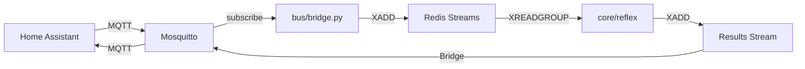
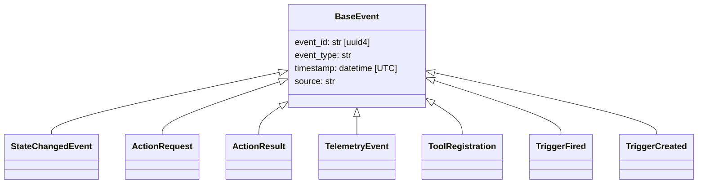
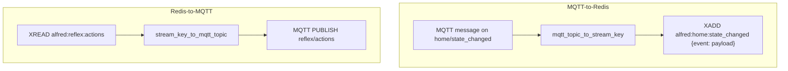
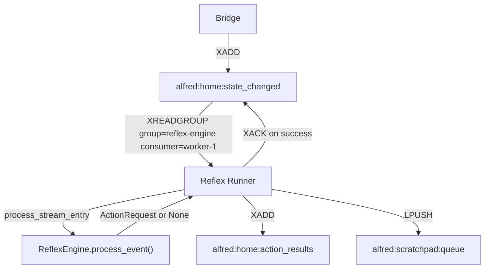

# Alfred Event Bus

## Overview

Alfred uses a dual-layer event bus:

- **MQTT** -- the edge layer. Home Assistant, IoT devices, and microservices publish and subscribe to MQTT topics. Mosquitto is the broker.
- **Redis Streams** -- the internal backbone. All Alfred core services (Reflex Engine, Trigger Engine, Librarian) consume events from Redis Streams using consumer groups.

The MQTT-Redis Bridge (`bus/bridge.py`) connects the two layers. It is a thin forwarder with zero business logic -- it translates topic names and relays payloads verbatim.



## Event Schemas

All event types live in `bus/schemas/events.py` -- the single source of truth. Every event is a Pydantic v2 `BaseModel` subclass. Events are immutable once published.



### BaseEvent

Base class for all events. Auto-generates `event_id` (UUID4) and `timestamp` (UTC now).

| Field        | Type       | Description                              |
|--------------|------------|------------------------------------------|
| `event_id`   | `str`      | UUID4, auto-generated                    |
| `event_type` | `str`      | Discriminator for deserialization        |
| `timestamp`  | `datetime` | UTC, auto-generated at creation time     |
| `source`     | `str`      | Service or component that produced this  |

### StateChangedEvent

Published by microservices when a device or entity changes state. This is the primary input to the Reflex Engine.

| Field        | Type              | Description                                      |
|--------------|-------------------|--------------------------------------------------|
| `event_type` | `"state_changed"` | Fixed                                            |
| `domain`     | `str`             | Domain name: `home`, `media`, `finance`, etc.    |
| `entity_id`  | `str`             | Unique entity ID, e.g. `light.living_room`       |
| `old_state`  | `str \| None`     | Previous state value (null on first report)      |
| `new_state`  | `str`             | Current state value                              |
| `attributes` | `dict[str, Any]`  | Freeform attributes (brightness, color, etc.)    |

### ActionRequest

A request to execute an MCP tool on a target microservice. Produced by the Reflex Engine or Trigger Engine.

| Field            | Type                 | Description                                       |
|------------------|----------------------|---------------------------------------------------|
| `event_type`     | `"action_request"`   | Fixed                                             |
| `request_id`     | `str`                | UUID4, auto-generated; correlates with result     |
| `target_service` | `str`                | Which microservice handles this                   |
| `tool_name`      | `str`                | MCP tool name, e.g. `smart_home.dim_lights`       |
| `parameters`     | `dict[str, Any]`     | Tool-specific parameters                          |

### ActionResult

The result of an MCP tool execution. Published by the agent that executed the action.

| Field        | Type                         | Description                             |
|--------------|------------------------------|-----------------------------------------|
| `event_type` | `"action_result"`            | Fixed                                   |
| `request_id` | `str`                        | Matches the originating `ActionRequest` |
| `tool_name`  | `str`                        | Which tool was called                   |
| `status`     | `"success" \| "error"`       | Outcome                                 |
| `result`     | `dict[str, Any] \| None`    | Return value on success                 |
| `error`      | `str \| None`                | Error message on failure                |

### TelemetryEvent

Observability metric for research and monitoring.

| Field         | Type              | Description                                          |
|---------------|-------------------|------------------------------------------------------|
| `event_type`  | `"telemetry"`     | Fixed                                                |
| `metric_type` | `str`             | `latency`, `tokens`, `event_throughput`              |
| `category`    | `str`             | `reflex`, `bus`, `inference`, etc.                   |
| `value`       | `float`           | The measured value                                   |
| `unit`        | `str`             | `ms`, `tokens`, `bytes`, `count`                     |
| `metadata`    | `dict[str, Any]`  | Extra context (model name, entity_id, etc.)          |

### ToolRegistration

Published by microservices at startup to register their MCP tool capabilities.

| Field              | Type                 | Description                              |
|--------------------|----------------------|------------------------------------------|
| `event_type`       | `"tool_registration"`| Fixed                                    |
| `service_name`     | `str`                | Name of the registering microservice     |
| `service_endpoint` | `str`                | HTTP endpoint for MCP calls              |
| `tools`            | `list[dict]`         | List of tool manifests (name, params)    |

### TriggerFired

Published by the Trigger Engine when a trigger's conditions are met but the trigger has no direct `action` set. The Reflex Engine receives this on `alfred:events` and decides what to do.

| Field          | Type                | Description                                         |
|----------------|---------------------|-----------------------------------------------------|
| `event_type`   | `"trigger_fired"`   | Fixed                                               |
| `source`       | `"trigger-engine"`  | Fixed                                               |
| `trigger_id`   | `str`               | Which trigger fired                                 |
| `trigger_name` | `str`               | Human-readable trigger name                         |
| `trigger_type` | `str`               | Registered type: `time`, `sensor`, `composite`      |
| `context`      | `dict[str, Any]`    | Evaluation context (type, entity, state, timestamp) |

### TriggerCreated

Published by the Trigger Engine when a new trigger is dynamically created via CRUD tools.

| Field          | Type                  | Description                                        |
|----------------|-----------------------|----------------------------------------------------|
| `event_type`   | `"trigger_created"`   | Fixed                                              |
| `source`       | `"trigger-engine"`    | Fixed                                              |
| `trigger_id`   | `str`                 | UUID4, auto-generated                              |
| `trigger_type` | `str`                 | Registered type: `time`, `sensor`, `composite`     |
| `name`         | `str`                 | Human-readable trigger name                        |
| `created_by`   | `str`                 | Origin (e.g. `"tool-call"`)                        |
| `conditions`   | `dict[str, Any]`      | Trigger-type-specific conditions                   |
| `action`       | `dict[str, Any]\|None`| Action payload, if set                             |
| `one_shot`     | `bool`                | Whether the trigger deletes itself after firing    |

## MQTT-Redis Bridge

**Source:** `bus/bridge.py` | **Entry point:** `uv run python -m bus` (`bus/__main__.py`)

The bridge runs two concurrent async loops:

1. **MQTT-to-Redis** (`_mqtt_to_redis_loop`) -- subscribes to MQTT topics, forwards each message payload to the corresponding Redis Stream via `XADD`.
2. **Redis-to-MQTT** (`_redis_to_mqtt_loop`) -- reads from configured Redis Streams via `XREAD`, publishes each entry to the corresponding MQTT topic.



### Default Subscriptions

Configured in `run_bridge()`:

| Direction      | Default values                                |
|----------------|-----------------------------------------------|
| MQTT topics    | `home/#`, `media/#` (wildcard subscriptions)  |
| Redis streams  | `alfred:reflex:actions`                       |

Configuration comes from `AlfredConfig.from_env()` (`shared/config.py`), which reads `REDIS_HOST`, `REDIS_PORT`, `MQTT_HOST`, `MQTT_PORT` from environment variables (with `.env` fallback).

### Message Format on the Wire

The bridge stores a single field per Redis Stream entry:

```
XADD alfred:home:state_changed * event '{"event_type":"state_changed","domain":"home",...}'
```

The `event` field contains the full JSON-serialized Pydantic model. Consumers call `StateChangedEvent.model_validate_json(raw)` to deserialize.

## Topic and Stream Naming Convention

The bridge translates between MQTT topic separators (`/`) and Redis key separators (`:`) with the `alfred` prefix.

| MQTT Topic             | Redis Stream Key                |
|------------------------|---------------------------------|
| `home/state_changed`   | `alfred:home:state_changed`     |
| `media/state_changed`  | `alfred:media:state_changed`    |
| `home/action_results`  | `alfred:home:action_results`    |
| `reflex/actions`       | `alfred:reflex:actions`         |

Conversion functions in `bus/bridge.py`:
- `mqtt_topic_to_stream_key("home/state_changed")` returns `"alfred:home:state_changed"`
- `stream_key_to_mqtt_topic("alfred:home:state_changed")` returns `"home/state_changed"`

The `STREAM_PREFIX` constant is `"alfred"`.

## Stream Processing

**Source:** `core/reflex/runner.py` and `core/reflex/__main__.py`

The Reflex Runner is the primary consumer. It reads from `alfred:home:state_changed` using Redis consumer groups.



### Consumer Group Setup

At startup (`core/reflex/__main__.py`), the runner calls `ensure_consumer_group()`:

```python
await ensure_consumer_group(redis, "alfred:home:state_changed", "reflex-engine")
```

This issues `XGROUP CREATE` with `mkstream=True`. If the group already exists (`BUSYGROUP` error), it is silently ignored.

### Constants

Defined in `core/reflex/__main__.py`:

| Constant           | Value                           | Purpose                        |
|--------------------|---------------------------------|--------------------------------|
| `STREAM`           | `alfred:home:state_changed`     | Input stream                   |
| `GROUP`            | `reflex-engine`                 | Consumer group name            |
| `CONSUMER`         | `worker-1`                      | Consumer name within group     |
| `RESULT_STREAM`    | `alfred:home:action_results`    | Output stream for results      |
| `SCRATCHPAD_QUEUE` | `alfred:scratchpad:queue`       | Redis List for observations    |

### Read Loop

The runner calls `XREADGROUP` in a loop:

```python
await r.xreadgroup(GROUP, CONSUMER, {STREAM: ">"}, count=10, block=5000)
```

- `">"` -- read only new (undelivered) messages.
- `count=10` -- process up to 10 entries per batch.
- `block=5000` -- block for 5 seconds if no messages are available.

The loop exits cleanly on `SIGTERM` or `SIGINT` via an `asyncio.Event`.

### ACK Semantics and Retry

The ACK strategy is explicit and intentional:

1. **Success path:** After `process_stream_entry()` returns without raising, the entry is acknowledged via `XACK`. The message is removed from the consumer's pending entries list.
2. **Retriable failure:** If `process_stream_entry()` raises an exception (e.g., Ollama is down, `httpx.ConnectError`), the entry is NOT acknowledged. Redis will redeliver it on the next `XREADGROUP` cycle.
3. **Non-retriable failure:** Malformed events (JSON parse errors, missing fields) return `False` from `process_stream_entry()` without raising. These are still ACKed to prevent infinite redelivery of garbage data.

This design means transient infrastructure failures (Ollama restart, network blip) are automatically retried, while permanently bad messages are discarded with a log.

### Output Streams

On successful action execution, the runner writes to two places:

- **`alfred:home:action_results`** -- `XADD` with the serialized `ActionResult` for downstream consumers or bridge-to-MQTT relay.
- **`alfred:scratchpad:queue`** -- `LPUSH` with a formatted observation string for the `ScratchpadWriter` to drain to disk. Format: `{timestamp} [reflex] {tool_name}({parameters}) -> {status}`.

## Running the Services

```bash
# Start the MQTT-Redis bridge
uv run python -m bus

# Start the Reflex Runner (requires tools registered in Redis first)
uv run python -m core.reflex
```

Both services load configuration from `shared/config.py` via `AlfredConfig.from_env()`. Required infrastructure: Redis and Mosquitto (use Homebrew services on macOS dev, Docker Compose in production).
