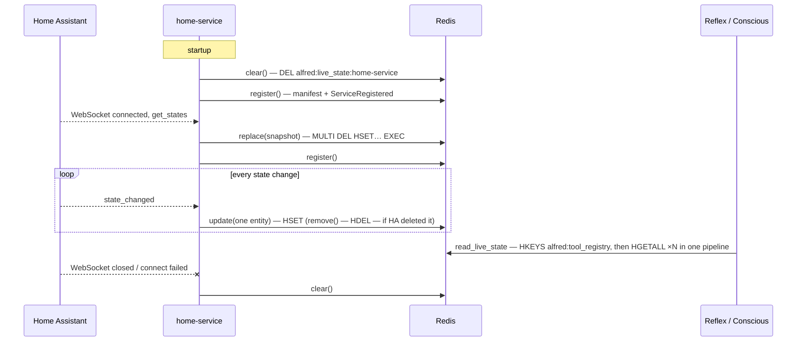

# Live State

What the devices in the house are doing right now, as Alfred sees it. A service publishes
its live state as events arrive; Alfred reads it fresh whenever a prompt needs it. Nothing
on either side runs on a timer, and Alfred core never names a service.

Issue: [#281](https://github.com/anirudhlath/alfred/issues/281) · Design:
`docs/superpowers/specs/2026-10-05-live-home-state-design.md`

## Data flow



## The contract — `sdk/alfred_sdk/live_state.py`

Alfred owns the key and the format; they ship in alfred-sdk, the one dependency a plugin
takes.

| Item | Value |
|---|---|
| Key | `alfred:live_state:{service_name}` — a Redis hash, one per service |
| Field | entity ID |
| Value | JSON of `LiveStateEntry` |

```python
class LiveStateEntry(BaseModel):
    model_config = ConfigDict(extra="forbid")

    domain: str                                   # "light", "sensor", …
    kind: Literal["controllable", "sensor"]
    state: str
    attributes: dict[str, Any] = {}
```

## Writing — `LiveStateWriter(redis_url, service_name)`

| Method | Redis | When a service calls it |
|---|---|---|
| `replace(snapshot)` | `MULTI` · `DEL` · `HSET` all · `EXEC` | On connecting to its source of truth |
| `update(domain, kind, entry)` | `HSET` one field | On each state change |
| `remove(entity_id)` | `HDEL` one field | When the source deletes an entity |
| `clear()` | `DEL` | On disconnect, at startup, at shutdown |
| `aclose()` | closes the client once the writes queued ahead of it have landed | At shutdown |

- `replace` and `update` validate every entry through `LiveStateEntry` before writing; an
  entry that cannot be stored raises and writes nothing (for `replace`, nothing of the
  snapshot).
- One client per process with a 5 s socket and connect timeout
  (`WRITE_TIMEOUT_SECONDS`): writers run inline in a service's event loop, so a Redis
  outage costs a bounded wait, never a hang. The bound is per Redis command, not per
  call: calls queue behind the write lock, so the N-th queued call can wait about N × 5 s.
- Writes pass one FIFO `asyncio.Lock`, so they reach Redis in request order. A service
  applies an event to its own state before requesting the write and builds a `replace`
  snapshot from that same state with no await in between, so a snapshot never overwrites
  a newer update.
- `replace` is one transaction: a reader sees the old house or the new one, never half.
- `aclose()` takes the same lock, so a write in flight is never cut off. Every write
  requested after it is a no-op.

## Reading

- `read_live_state(redis) -> ContextSnapshot | None` merges every registered service's
  hash. `None` means *no live state* — no registered service has a valid entry — a
  different answer from an empty snapshot.
- `read_live_state_by_service(redis) -> dict[str, ContextSnapshot]` is the same read
  without the merge: one snapshot per service that has at least one valid entry, in
  service-name order. `python -m evals capture-context` writes it out as a fixture.
- Services are found through `HKEYS alfred:tool_registry`, never a keyspace scan, so only
  a registered service's hash is read. All hashes come back in one pipelined round trip.
- Malformed items are skipped: a value that is not a valid `LiveStateEntry`, an entity ID
  that is not UTF-8, and a registry key that is not UTF-8 (whose hash is then never
  fetched). One warning per read counts them and names the services they came from.
- `ContextReader` (`core/reflex/context_reader.py`) reads on every call — no cache — and
  renders the Markdown the Reflex prompts put under `## Home State`. Without live state it
  says `Live home state unavailable.`
- Conscious's `memory_get_live_state` (`core/conscious/memory_tools.py`) returns
  `{"available": true, "entities": [...]}`, or `{"available": false, "entities": []}`
  when there is no live state. Its entities come from both buckets, so a domain that is
  both controllable and a sensor keeps every entity.

## Home-service lifecycle

Home-service (the `alfred-home-service` repo) is the writer's one caller today.

| Moment | Live state | Registration |
|---|---|---|
| Startup | `clear()` (a crashed run may have left its hash) | `register()` |
| HA connected | `replace()` from the fetched states | `register()` |
| State change | `update()`, or `remove()` when HA deleted the entity | — |
| HA registry change | — | `register()` |
| HA disconnected, connect failed, token rejected | `clear()` | — |
| Shutdown | `clear()`, then the writer closes | `unregister()` |

A failed registration retries with backoff (1 s, doubling to 60 s) until one lands, then
nothing stays scheduled.

## Failure modes

- A failed `update()` is logged; the entity is stale until its next change or the next
  connect. It never breaks the state forwarding that shares the listener chain.
- A failed `replace()` leaves the previous hash whole (the transaction is all or nothing).
- A failed `clear()` on disconnect leaves the last known state until home-service
  reconnects or restarts.
- Redis unreachable on read propagates to the caller; nothing reads a failure as
  "unavailable".

## Files

| File | Role |
|---|---|
| `sdk/alfred_sdk/live_state.py` | Key, `LiveStateEntry`, `LiveStateWriter`, `read_live_state()`, `read_live_state_by_service()` |
| `sdk/alfred_sdk/context.py` | `ContextSnapshot`, `ContextEntry` — the shape readers return |
| `core/reflex/context_reader.py` | `ContextReader` + `render_snapshot()` |
| `core/conscious/memory_tools.py` | `memory_get_live_state` |
| `evals/__main__.py` | `capture-context` |
| `alfred-home-service`: `app/server.py`, `app/live_state.py` | The writer's one caller today |

## Redis keys

| Key | Type | TTL | Purpose |
|---|---|---|---|
| `alfred:live_state:{service_name}` | Hash | none — cleared on disconnect | A service's live state, one field per entity |

## Deferred work

- Pub/sub invalidation of the Reflex engine's 5-minute tool-registry cache — slice 2 of
  [#281](https://github.com/anirudhlath/alfred/issues/281).
- One shared library for the contracts core and the SDK duplicate —
  [#282](https://github.com/anirudhlath/alfred/issues/282).
- Entities the models should know about that are not tools (automations, scripts,
  input booleans) — [#113](https://github.com/anirudhlath/alfred/issues/113).
