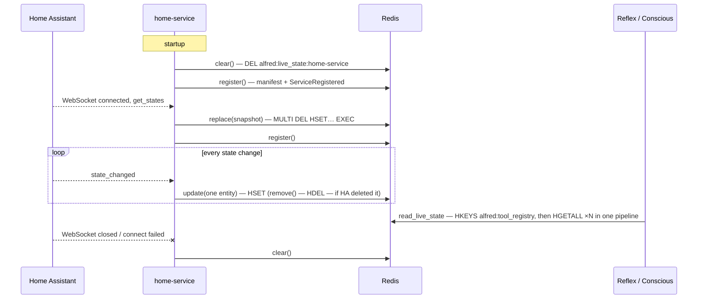

# Live State

What the devices in the house are doing right now, as Alfred sees it. A service publishes
its live state as events arrive; Alfred reads it fresh whenever a prompt needs it. Nothing
on either side runs on a schedule; only failed attempts are retried, with backoff. Alfred
core never names a service.

Issue: [#281](https://github.com/anirudhlath/alfred/issues/281) · Design:
`docs/superpowers/specs/2026-10-05-live-home-state-design.md`

## Data flow



## The contract — `sdk/alfred_sdk/live_state.py`

Alfred owns the key and the format; they ship in alfred-sdk, the one dependency a plugin
takes.

| Item | Value |
|---|---|
| Key | `alfred:live_state:{service_name}` — a Redis hash, one per service |
| Field | entity ID |
| Value | JSON of `LiveStateEntry` |

```python
class LiveStateEntry(BaseModel):
    model_config = ConfigDict(extra="forbid")

    domain: str                                   # "light", "sensor", …
    kind: Literal["controllable", "sensor"]
    state: str
    attributes: dict[str, Any] = {}
```

## Well-known attributes

`attributes` is where a service puts its own details, and the SDK never inspects it.
Alfred does understand a few keys when a service provides them. All are optional: without
them Alfred falls back to the entity ID.

| Key | Meaning | Alfred uses it for |
|---|---|---|
| `friendly_name` | The display name | Every prompt line that names the entity |
| `area` | Where the entity is, as a room or area name | Grouping Reflex's House section by room ([#285](https://github.com/anirudhlath/alfred/issues/285)); a room name is also a tool target wherever the service's tools accept one |
| `unit_of_measurement` | The unit of `state` | Rendering numbers |
| `device_class` | What kind of sensor or device it is | Attention seeding |

**How to help Alfred understand your entities.** Set `friendly_name` to what a person
would call the thing, and `area` to where it is, in the same words your tools accept as a
target. Keep everything else in `attributes` few and small: the Conscious engine renders
every attribute it is given.

## Writing — `LiveStateWriter(redis_url, service_name)`

| Method | Redis | When a service calls it |
|---|---|---|
| `replace(snapshot)` | `MULTI` · `DEL` · `HSET` all · `EXEC` | On connecting to its source of truth |
| `update(domain, kind, entry)` | `HSET` one field | On each state change |
| `remove(entity_id)` | `HDEL` one field | When the source deletes an entity |
| `clear()` | `DEL` | On disconnect, at startup, at shutdown |
| `aclose()` | closes the client once the writes queued ahead of it have landed | At shutdown |

- `replace` and `update` validate every entry through `LiveStateEntry` before writing; an
  entry that cannot be stored raises and writes nothing (for `replace`, nothing of the
  snapshot).
- Each writer holds one Redis client for its lifetime, so create one writer per process.
  The client has a 5 s socket and connect timeout (`WRITE_TIMEOUT_SECONDS`): writers run
  inline in a service's event loop, so a Redis
  outage costs a bounded wait, never a hang. The bound is per Redis command, not per
  call: calls queue behind the write lock, so the N-th queued call can wait about N × 5 s.
- Writes pass one FIFO `asyncio.Lock`, so they reach Redis in request order. A service
  applies an event to its own state before requesting the write and builds a `replace`
  snapshot from that same state with no await in between, so a snapshot never overwrites
  a newer update.
- `replace` is one transaction: a reader sees the old house or the new one, never half.
- `aclose()` takes the same lock, so a write in flight is never cut off. Every write
  requested after it is a no-op.

## Reading

- `read_live_state(redis) -> ContextSnapshot | None` merges every registered service's
  hash. `None` means *no live state* — no registered service has a valid entry — a
  different answer from an empty snapshot.
- `read_live_state_by_service(redis) -> dict[str, ContextSnapshot]` is the same read
  without the merge: one snapshot per service that has at least one valid entry, in
  service-name order. `python -m evals capture-context` writes it out as a fixture.
- Services are found through `HKEYS alfred:tool_registry`, never a keyspace scan, so only
  a registered service's hash is read. All hashes come back in one pipelined round trip.
- Malformed items are skipped: a value that is not a valid `LiveStateEntry`, an entity ID
  that is not UTF-8, a registry key that is not UTF-8 (whose hash is then never
  fetched), and a service whose key is not a hash (written around the writer, so its
  `HGETALL` replies `WRONGTYPE`; the other services still read). One warning per read
  counts them and names the services they came from.
- `ContextReader` (`core/reflex/context_reader.py`) reads on every call — no cache — and
  renders the Markdown the Reflex prompts put under `## Home State`. Without live state it
  says `Live home state unavailable.`
- Conscious's `memory_get_live_state` (`core/conscious/memory_tools.py`) returns
  `{"available": true, "entities": [...]}`, or `{"available": false, "entities": []}`
  when there is no live state. Its entities come from both buckets, so a domain that is
  both controllable and a sensor keeps every entity.

## Home-service lifecycle

Home-service (the `alfred-home-service` repo) is the writer's one caller today. Its
`LiveStatePublisher` (`app/live_state.py`) makes every live-state write, and
`app/server.py` wires it to the HA connection and to registration.

| Moment | Live state | Registration |
|---|---|---|
| Startup | `clear()` (a crashed run may have left its hash) | `register()` |
| HA connected | rebuild the entity index, then `replace()` from the fetched states — published even if the rebuild fails | then generate capabilities (first connect only), then `register()` |
| State change | `update()`, or `remove()` when HA deleted the entity; while the hash is dirty and HA is connected, a full `replace()` follows once that write lands (see below) | — |
| HA registry change | — (the index is rebuilt, live state is not written) | `register()` |
| HA disconnected, each failed connect attempt, token rejected | `clear()`, once the connect setup (and any write it was making) has ended | — |
| A registration lands (any of the above) | heals a dirty hash: `replace()` if HA is connected, `clear()` if not | — |
| Shutdown | `clear()`, then `aclose()` last | `unregister()`, between the two |

Shutdown runs in this order: cancel the env-credentials task, stop the state forwarder,
stop the HA connection (so no HA listener can write live state or schedule a
registration after the clear), cancel a pending registration retry, `clear()`,
`unregister()`, then `aclose()`. Each step runs even if shutdown is cancelled part-way;
the cancellation is raised after the last.

A failed registration retries with backoff (1 s, doubling to 60 s) until one lands, then
nothing stays scheduled. Registrations are serialised: one attempt at a time, in the
order asked for.

### Healing after a failed write

A failed write leaves Alfred's copy wrong in a way the next `update()` cannot fix: an
entity that changed during a Redis outage stays stale until it changes again, and a hash
a failed `clear()` left behind survives underneath fresh updates. So home-service heals
it, with nothing on a schedule:

- Any failed live-state write — `update`, `remove`, `replace`, the startup `clear()` or
  the disconnect `clear()` — marks the hash dirty and logs one WARNING. Later failures
  while it is dirty retry quietly.
- An HA state event always makes its own per-entity write first. While the hash is
  dirty, that write is the probe: one that fails keeps the hash dirty without building a
  snapshot, and one that lands proves Redis is back, so a full `replace()` from the
  connection's states follows (only while HA is connected).
- While HA is unreachable, every failed reconnect attempt (the backoff doubles from 1 s to
  60 s, so at least once a minute) calls `clear()` again. A failed reconnect attempt's
  `clear()` that lands heals the hash.
- A registration that lands while the hash is dirty proves Redis reachable, so it heals
  too: `replace()` if HA is connected, `clear()` if not.
- Any `replace()` or `clear()` that lands marks the hash clean again and logs one INFO.

So an Alfred deploy that restarts Redis heals on the next state change of any entity,
not only the entity that changed. A hash that a crashed run left behind, with Redis down
at the next startup, heals on whichever lands first: the connect's `replace()`, a failed
reconnect attempt's `clear()`, the `replace()` that follows a state event's landed write
while the hash is dirty, or the startup's registration.

## Failure modes

The writer does not swallow errors: every method raises on a Redis error, after at most
about 5 s per command. Catching them is the caller's job. Home-service's publisher
catches every one, logs it and marks the hash dirty, so a failed write never breaks the
state forwarding that shares the listener chain.

- When an `update()` or `remove()` fails, the next state event while HA is connected, or
  the next registration that lands, heals the hash.
- When a `replace()` fails, the previous hash stays whole (the transaction is all or
  nothing) until the next state event or registration heals it.
- When the startup `clear()` fails, whichever lands first heals it: the connect's
  `replace()`, a failed reconnect attempt's `clear()`, or the registration.
- When the disconnect's `clear()` fails: while HA is unreachable, every reconnect attempt
  (at least once a minute) clears again, so a failed disconnect clear heals within one
  backoff of Redis returning. The one double fault that persists is a token HA rejected
  while Redis was down. There are no further attempts then, so the hash keeps the last
  known state until new credentials connect, home-service restarts, or a registration
  retry that was already pending lands.
- Redis unreachable on read propagates to the caller; nothing reads a failure as
  "unavailable".

## Files

| File | Role |
|---|---|
| `sdk/alfred_sdk/live_state.py` | Key, `LiveStateEntry`, `LiveStateWriter`, `read_live_state()`, `read_live_state_by_service()` |
| `sdk/alfred_sdk/context.py` | `ContextSnapshot`, `ContextEntry` — the shape readers return |
| `core/reflex/context_reader.py` | `ContextReader` + `render_snapshot()` |
| `core/conscious/memory_tools.py` | `memory_get_live_state` |
| `evals/__main__.py` | `capture-context` |
| `alfred-home-service`: `app/live_state.py`, `app/server.py` | The writer's one caller today: `LiveStatePublisher` (writes and heals) and the lifecycle wiring |

## Redis keys

| Key | Type | TTL | Purpose |
|---|---|---|---|
| `alfred:live_state:{service_name}` | Hash | none — cleared on disconnect | A service's live state, one field per entity |

## Deferred work

- Pub/sub invalidation of the Reflex engine's 5-minute tool-registry cache — slice 2 of
  [#281](https://github.com/anirudhlath/alfred/issues/281).
- One shared library for the contracts core and the SDK duplicate —
  [#282](https://github.com/anirudhlath/alfred/issues/282).
- Entities the models should know about that are not tools (automations, scripts,
  input booleans) — [#113](https://github.com/anirudhlath/alfred/issues/113).
