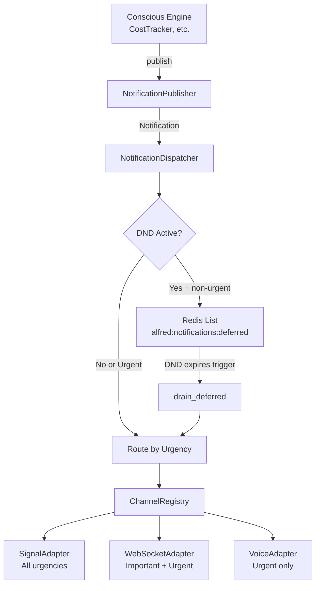

# Notification System

## Overview

The proactive notification system delivers alerts, updates, and information to the user through
multiple channels with DND awareness and priority routing. No LLM is involved in routing —
the dispatcher uses deterministic rules based on urgency and channel capabilities.

## Architecture

## Data Models

### Urgency (StrEnum)

| Level | Value | Channels |
|-------|-------|----------|
| INFORMATIONAL | `"informational"` | Signal only |
| IMPORTANT | `"important"` | Signal + WebSocket |
| URGENT | `"urgent"` | Signal + WebSocket + Voice (bypasses DND) |

### Notification (Pydantic BaseModel)

| Field | Type | Default |
|-------|------|---------|
| notification_id | str | auto UUID |
| title | str | required |
| body | str | required |
| urgency | Urgency | required |
| source | str | required |
| timestamp | datetime | auto now(UTC) |

### DNDStatus (Pydantic BaseModel)

| Field | Type | Default |
|-------|------|---------|
| active | bool | required |
| reason | str \| None | None |
| source | str \| None | None ("manual" \| "calendar") |
| until | datetime \| None | None |

## Components

### NotificationPublisher

Public API for sending notifications. Creates `Notification` objects and routes through
the dispatcher. Used by CostTracker, Conscious Engine, and any component that needs
to notify the user.

### NotificationDispatcher

Core routing engine. Checks DND state, defers non-urgent notifications during DND,
and delivers to matching channel adapters in parallel via `asyncio.gather`.

### DNDChecker

Checks Do-Not-Disturb state from two sources (first match wins):
1. **Manual DND** — Redis key `alfred:memory:dnd` (JSON with active, until, reason, source)
2. **Calendar DND** — queries calendar integration for active meetings

Expired manual DND is auto-cleaned from Redis.

### ChannelRegistry

Auto-discovery registry using `@ChannelRegistry.register()` decorator. Adapters register
at import time and are initialized via `set_instance()` during startup.

## Channel Adapters

| Adapter | Urgencies | Delivery |
|---------|-----------|----------|
| SignalChannelAdapter | All | Formats `"Title: body"` → SignalBridge.send_notification() |
| WebSocketChannelAdapter | Important, Urgent | JSON payload to all connected WS sessions |
| VoiceChannelAdapter | Urgent only | TTS synthesis → base64 audio via WebSocket |

### Adding a New Channel Adapter

1. Create `core/notifications/adapters/myservice.py`
2. Subclass `ChannelAdapter`, set `name` and `supported_urgencies` ClassVars
3. Implement `async def deliver(self, notification: Notification) -> None`
4. Decorate with `@ChannelRegistry.register()`
5. Import the module in the appropriate entry point to trigger registration
6. Call `ChannelRegistry.set_instance("name", MyAdapter(...))` during startup

## DND Behavior

- **Manual DND with expiry**: Notifications deferred to Redis list. One-shot time trigger
  created at expiry time to drain deferred notifications.
- **Manual DND without expiry**: Stays active until manually cleared. Deferred notifications
  remain queued — they drain only when a subsequent DND-with-expiry triggers a drain, or the
  system restarts and DND is no longer active. Future improvement: Redis keyspace notification
  on DND key deletion to trigger immediate drain.
- **Calendar DND**: Active during meetings. Drain trigger created at meeting end time.
- **URGENT notifications**: Always delivered immediately, regardless of DND.

## Redis Keys

| Key | Type | Purpose |
|-----|------|---------|
| `alfred:memory:dnd` | String (JSON) | Manual DND state |
| `alfred:notifications:deferred` | List | Deferred notification queue |

## Drain Trigger

When DND defers a notification and knows when DND expires, the dispatcher creates
an idempotent one-shot `TimeTrigger` with ID `drain-deferred-{timestamp}`. When
the trigger fires, it invokes `handle_drain_deferred()` which calls
`dispatcher.drain_deferred()` to re-dispatch all queued notifications.
