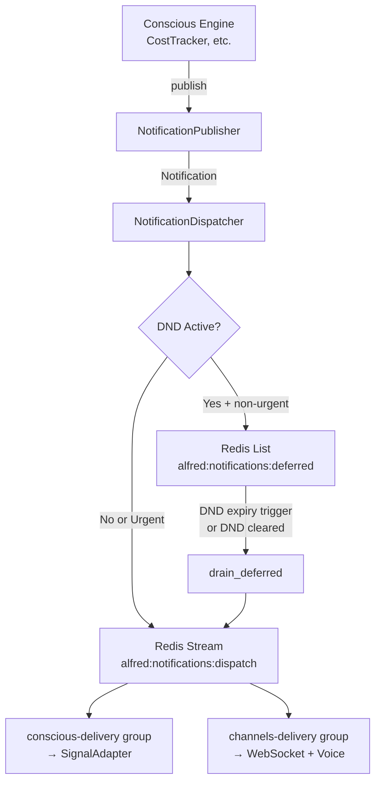

# Notification System

## Overview

The proactive notification system delivers alerts, updates, and information to the user through
multiple channels with DND awareness and priority routing. No LLM is involved in routing —
the dispatcher uses deterministic rules based on urgency and channel capabilities.

## Architecture

```mermaid
graph TD
    CE[Conscious Engine<br/>CostTracker, etc.] -->|publish| NP[NotificationPublisher]
    NP -->|Notification| ND[NotificationDispatcher]
    ND --> DND{DND Active?}
    DND -->|Yes + non-urgent| DEFER[Redis List<br/>alfred:notifications:deferred]
    DND -->|No or Urgent| STREAM[Redis Stream<br/>alfred:notifications:dispatch]
    STREAM --> CG1[conscious-delivery group<br/>→ SignalAdapter]
    STREAM --> CG2[channels-delivery group<br/>→ WebSocket + Voice]
    DEFER -->|DND expiry trigger<br/>or DND cleared| DRAIN[drain_deferred]
    DRAIN --> STREAM
```

## Data Models

### Urgency (StrEnum)

| Level | Value | Channels |
|-------|-------|----------|
| INFORMATIONAL | `"informational"` | Signal only |
| IMPORTANT | `"important"` | Signal + WebSocket |
| URGENT | `"urgent"` | Signal + WebSocket + Voice (bypasses DND) |

### Notification (Pydantic BaseModel)

| Field | Type | Default |
|-------|------|---------|
| notification_id | str | auto UUID |
| title | str | required |
| body | str | required |
| urgency | Urgency | required |
| source | str | required |
| timestamp | datetime | auto now(UTC) |

### DNDStatus (Pydantic BaseModel)

| Field | Type | Default |
|-------|------|---------|
| active | bool | required |
| reason | str \| None | None |
| source | str \| None | None ("manual" \| "calendar") |
| until | datetime \| None | None |

## Components

### NotificationPublisher

Public API for sending notifications. Creates `Notification` objects and routes through
the dispatcher. Used by CostTracker, Conscious Engine, and any component that needs
to notify the user.

### NotificationDispatcher

Core routing engine. Checks DND state, defers non-urgent notifications during DND,
and delivers to matching channel adapters in parallel via `asyncio.gather`.

### DNDChecker

Checks Do-Not-Disturb state from two sources (first match wins):
1. **Manual DND** — Redis key `alfred:memory:dnd` (JSON with active, until, reason, source)
2. **Calendar DND** — queries calendar integration for active meetings

Expired manual DND is auto-cleaned from Redis.

### ChannelRegistry

Auto-discovery registry using `@ChannelRegistry.register()` decorator. Adapters register
at import time and are initialized via `set_instance()` during startup.

## Channel Adapters

| Adapter | Urgencies | Delivery |
|---------|-----------|----------|
| SignalChannelAdapter | All | Formats `"Title: body"` → SignalBridge.send_notification() |
| WebSocketChannelAdapter | Important, Urgent | JSON payload to all connected WS sessions |
| VoiceChannelAdapter | Urgent only | TTS synthesis → base64 audio via WebSocket |

### Device Registration (APNs)

Native clients register their APNs token with `POST /api/devices/register` (and `DELETE`
to unregister); tokens live in the `alfred:push:devices` Redis hash. Both routes are
double-gated — `require_trusted_network` **and** `require_authenticated` — so a client
must be on the LAN/tailnet *and* send a valid `alfred_auth` passkey session cookie. A
native client that presents only a device token gets 403 (untrusted network) or 401 (no
session), never a registration.

### Adding a New Channel Adapter

1. Create `core/notifications/adapters/myservice.py`
2. Subclass `ChannelAdapter`, set `name` and `supported_urgencies` ClassVars
3. Implement `async def deliver(self, notification: Notification) -> None`
4. Decorate with `@ChannelRegistry.register()`
5. Import the module in the appropriate entry point to trigger registration
6. Call `ChannelRegistry.set_instance("name", MyAdapter(...))` during startup

## DND Behavior

- **Manual DND with expiry**: Notifications deferred to Redis list. One-shot time trigger
  created at expiry time to drain deferred notifications.
- **Manual DND without expiry**: Stays active until manually cleared, and nothing drains the
  queue while it is on (short of an explicit `POST /api/admin/notifications/drain`).
- **Clearing manual DND** (`POST /api/admin/dnd` with `active: false`, timed or not): drains
  the queue straight away — see [Drain on clear](#drain-on-clear).
- **Calendar DND**: Active during meetings. Drain trigger created at meeting end time.
- **URGENT notifications**: Always delivered immediately, regardless of DND.

## Redis Keys

| Key | Type | Purpose |
|-----|------|---------|
| `alfred:memory:dnd` | String (JSON) | Manual DND state |
| `alfred:notifications:deferred` | List | Deferred notification queue |
| `alfred:notifications:dispatch` | Stream | Cross-process notification delivery |

## Drain Trigger

When DND defers a notification and knows when DND expires, the dispatcher creates
an idempotent one-shot `TimeTrigger` with ID `drain-deferred-{timestamp}`. When
the trigger fires, it posts an `ActionRequest(tool_name="drain_deferred_notifications",
target_service="conscious-engine")` to `ACTIONS_STREAM`. The conscious engine's
internal action consumer picks this up and calls `dispatcher.drain_deferred()`,
which publishes every queued notification to the dispatch stream. It does not re-check DND:
whatever asks for a drain is saying the queue is due.

## Drain on clear

Clearing manual DND from the web app (`POST /api/admin/dnd` with `active: false`) deletes
`alfred:memory:dnd` and, when that delete removed a live key, publishes the same
`drain_deferred_notifications` action to `ACTIONS_STREAM`. The drain therefore runs where it
always does — in the conscious process, through its internal action consumer — never in the
channels process that served the request. A clear that found no key (DND was already off)
requests no drain.

This is what makes an indefinite DND recoverable: before, deleting the key left the queue to
wait for some later expiry-based drain, which an indefinite DND never schedules. No Redis
keyspace notification is involved — the one code path that clears DND on request asks for
the drain itself. The lazy clean-up `DNDChecker` does when it finds an expired `until` does
not ask: an expiring DND is drained by the one-shot trigger above, at the moment it names. A
key deleted out of band (`redis-cli DEL`) bypasses this, so use the drain endpoint afterwards.
