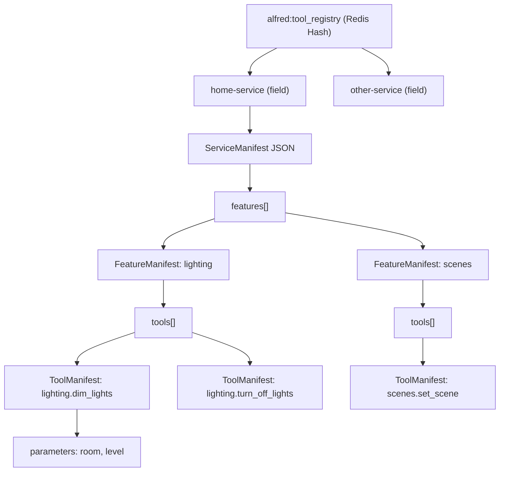
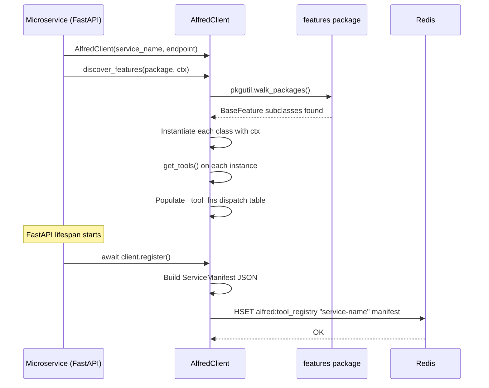
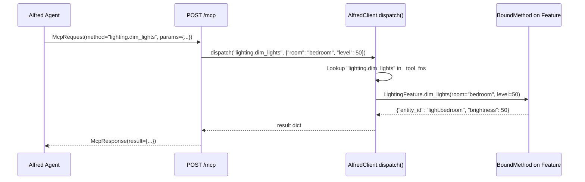
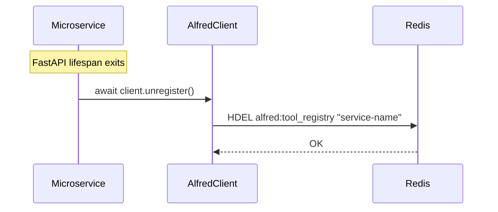

# alfred-sdk

Developer documentation for `alfred-sdk` -- the only coupling between Alfred and external microservices.

## Overview

`alfred-sdk` is a standalone Python package that microservices install to register their capabilities with Alfred's tool registry. It provides three things:

1. **`BaseFeature` + `@tool`** -- a decorator-driven pattern for declaring tools from plain Python methods.
2. **`AlfredClient`** -- the entry point that discovers features, builds a manifest, and registers/unregisters with Redis.
3. **Dispatch** -- a runtime lookup table that routes incoming MCP tool calls to bound methods on feature instances.

External apps remain sovereign. They work independently without Alfred. The SDK is an optional dependency that, when present, advertises the app's capabilities so Alfred's agents can call them.

```
uv pip install -e path/to/alfred/sdk   # not on PyPI -- installed from source in container builds
```

Minimum dependencies: `pydantic>=2.0`, `redis>=5.0`, Python 3.13+.

---

## BaseFeature and @tool

A **feature** is a group of related tools. Define one by subclassing `BaseFeature`, setting `feature_name`, and decorating methods with `@tool`.

### Minimal example

```python
from alfred_sdk import BaseFeature, tool


class ClimateFeature(BaseFeature):
    """HVAC and thermostat controls."""

    feature_name = "climate"

    @tool
    async def set_temperature(self, zone: str, degrees: float) -> dict:
        """Set the target temperature for a zone.

        Args:
            zone: The HVAC zone name (e.g. "living_room").
            degrees: Target temperature in Fahrenheit.
        """
        # ... call your backend ...
        return {"zone": zone, "target": degrees}
```

### What @tool extracts automatically

The decorator marks the method for discovery. At registration time, `BaseFeature.get_tools()` extracts:

| Source | Extracted as |
|---|---|
| `feature_name` + method name | Qualified tool name (`climate.set_temperature`) |
| First line of the docstring | Tool description |
| Google-style `Args:` section | Per-parameter descriptions |
| Type hints on parameters | Parameter types (`str`, `float`, `int`, etc.) |
| Default values on parameters | Parameter defaults |

No schema files, no YAML, no manual registration. The Python code is the source of truth.

### @tool with overrides

You can override the auto-extracted name or description:

```python
@tool(name="custom.tool_name", description="Explicit description.")
async def my_method(self, x: int) -> dict:
    ...
```

### Docstring format

The SDK parses Google-style docstrings. Only the `Args:` section is used for parameter descriptions:

```python
@tool
async def dim_lights(self, room: str, level: int) -> dict:
    """Dim the lights in a room.

    Args:
        room: The room to dim.
        level: Brightness level 0-100.
    """
```

This produces two parameters: `room` (type `str`, description "The room to dim.") and `level` (type `int`, description "Brightness level 0-100.").

### Accepting shared context

Features often need shared dependencies (database connections, API clients). Pass a context object at discovery time -- the SDK calls `__init__(ctx)` on each feature class:

```python
class LightingFeature(BaseFeature):
    feature_name = "lighting"

    def __init__(self, ctx: Any) -> None:
        super().__init__()
        self.ha = ctx.ha  # Home Assistant client from shared context
```

---

## AlfredClient

`AlfredClient` is the single entry point for registration, discovery, and dispatch.

### Construction

```python
from alfred_sdk import AlfredClient

client = AlfredClient(
    service_name="home-service",
    service_endpoint="http://localhost:8000/mcp",
    redis_url="redis://localhost:6379",
)
```

All constructor arguments fall back to environment variables:

| Parameter | Env var | Default |
|---|---|---|
| `service_name` | `ALFRED_SERVICE_NAME` | `"unknown"` |
| `service_endpoint` | `ALFRED_SERVICE_ENDPOINT` | `""` |
| `redis_url` | `REDIS_URL` | `"redis://localhost:6379"` |
| `mqtt_host` | `MQTT_HOST` | `"localhost"` |
| `mqtt_port` | (none) | `1883` |

### Discovering features

Two approaches:

**Package scan** -- scans all modules in a package for `BaseFeature` subclasses:

```python
import my_app.features as features_pkg

client.discover_features(package=features_pkg, ctx=my_context)
```

**Explicit class list** -- pass classes directly:

```python
from my_app.features.climate import ClimateFeature
from my_app.features.security import SecurityFeature

client.discover_features_from_classes(
    [ClimateFeature, SecurityFeature],
    ctx=my_context,
)
```

Both methods instantiate the classes, call `get_tools()` on each instance, and populate the internal dispatch table (`_tool_fns`).

### Registration and unregistration

```python
await client.register()    # writes manifest to Redis hash alfred:tool_registry
await client.unregister()  # removes this service's entry from the hash
```

Registration writes to the Redis hash key `alfred:tool_registry` using `HSET`. The field is the service name, the value is the JSON-serialized manifest. Unregistration calls `HDEL` and is idempotent.

---

## Dispatch

When Alfred's agent sends an MCP tool call to your service's HTTP endpoint, your server calls `client.dispatch()` to route it:

```python
result = await client.dispatch("lighting.dim_lights", {"room": "bedroom", "level": 50})
```

Dispatch resolves the qualified tool name (e.g. `lighting.dim_lights`) to the bound method on the `LightingFeature` instance and calls it with the provided parameters as keyword arguments. Both sync and async methods are supported -- if the method returns a coroutine, it is awaited automatically.

`dispatch_sync()` is also available for testing without an event loop.

Raises `KeyError` if the tool name is not found in the dispatch table.

---

## Manifest Format

When `client.register()` is called, it writes a JSON manifest to Redis. The structure:

```
HSET alfred:tool_registry "home-service" '<JSON below>'
```

```json
{
  "service_name": "home-service",
  "service_endpoint": "http://home-service:8000/mcp",
  "features": [
    {
      "name": "lighting",
      "description": "Smart home lighting controls.",
      "tools": [
        {
          "name": "lighting.dim_lights",
          "description": "Dim the lights in a room.",
          "parameters": {
            "room": {
              "type": "str",
              "description": "The room to dim.",
              "default": null
            },
            "level": {
              "type": "int",
              "description": "Brightness level 0-100.",
              "default": null
            }
          }
        },
        {
          "name": "lighting.turn_off_lights",
          "description": "Turn off all lights in a room.",
          "parameters": {
            "room": {
              "type": "str",
              "description": "The room to turn off.",
              "default": null
            }
          }
        }
      ]
    },
    {
      "name": "scenes",
      "description": "Smart home scene management.",
      "tools": [
        {
          "name": "scenes.set_scene",
          "description": "Activate a Home Assistant scene.",
          "parameters": {
            "scene_name": {
              "type": "str",
              "description": "The scene to activate.",
              "default": null
            }
          }
        }
      ]
    }
  ]
}
```



The Pydantic models behind this are defined in `sdk/alfred_sdk/feature.py`: `ServiceManifest`, `FeatureManifest`, `ToolManifest`, `ToolParameter`.

---

## Real-World Example: home-service

The `home-service` is Alfred's Home Assistant wrapper. It demonstrates the full SDK integration pattern.

### Feature definition (`alfred_ext/features/lighting.py`)

```python
from alfred_sdk import BaseFeature, tool
from typing import Any


class LightingFeature(BaseFeature):
    """Smart home lighting controls."""

    feature_name = "lighting"

    def __init__(self, ctx: Any) -> None:
        super().__init__()
        self.ha = ctx.ha

    @tool
    async def dim_lights(self, room: str, level: int) -> dict:
        """Dim the lights in a room.

        Args:
            room: The room to dim.
            level: Brightness level 0-100.
        """
        entity_id = f"light.{room}"
        brightness = int(level * 2.55)
        await self.ha.call_service(
            "light", "turn_on", {"entity_id": entity_id, "brightness": brightness}
        )
        return {"entity_id": entity_id, "brightness": level}

    @tool
    async def turn_off_lights(self, room: str) -> dict:
        """Turn off all lights in a room.

        Args:
            room: The room to turn off.
        """
        entity_id = f"light.{room}"
        await self.ha.call_service("light", "turn_off", {"entity_id": entity_id})
        return {"entity_id": entity_id, "state": "off"}
```

### Client setup and discovery (`alfred_ext/register.py`)

```python
from alfred_sdk import AlfredClient
from app.ha_client import HomeAssistantClient
import alfred_ext.features as features_pkg

ha = HomeAssistantClient(host="http://homeassistant.local:8123", token="...")

client = AlfredClient(
    service_name="home-service",
    service_endpoint="http://localhost:8000/mcp",
)


class HomeServiceContext:
    """Shared dependencies for all home-service features."""
    def __init__(self, ha: HomeAssistantClient) -> None:
        self.ha = ha


client.discover_features(package=features_pkg, ctx=HomeServiceContext(ha=ha))
```

### Server with lifespan registration (`app/server.py`)

```python
from contextlib import asynccontextmanager
from fastapi import FastAPI
from pydantic import BaseModel
from typing import Any


class McpRequest(BaseModel):
    method: str
    params: dict[str, Any] = {}
    id: str


class McpResponse(BaseModel):
    id: str
    result: dict[str, Any] | None = None
    error: str | None = None


@asynccontextmanager
async def lifespan(app: FastAPI):
    from alfred_ext.register import client
    await client.register()       # announce tools to Alfred
    yield
    await client.unregister()     # clean up on shutdown


app = FastAPI(title="home-service", lifespan=lifespan)


@app.post("/mcp")
async def mcp_endpoint(request: McpRequest) -> McpResponse:
    from alfred_ext.register import client
    try:
        result = await client.dispatch(request.method, request.params)
        return McpResponse(id=request.id, result=result if isinstance(result, dict) else {"data": result})
    except KeyError as e:
        return McpResponse(id=request.id, error=str(e))
```

---

## Lifecycle

### Registration flow (app startup)



### Dispatch flow (runtime)



### Shutdown



---

## Quick Reference

| What | Import |
|---|---|
| Define a feature | `from alfred_sdk import BaseFeature` |
| Mark a method as a tool | `from alfred_sdk import tool` |
| Create the client | `from alfred_sdk import AlfredClient` |
| Telemetry decorators | `from alfred_sdk import track_event, track_latency, track_tokens` |

| Redis key | Type | Purpose |
|---|---|---|
| `alfred:tool_registry` | Hash | Maps service name to JSON manifest |

| Env var | Used by |
|---|---|
| `ALFRED_SERVICE_NAME` | `AlfredClient` default service name |
| `ALFRED_SERVICE_ENDPOINT` | `AlfredClient` default endpoint |
| `REDIS_URL` | `AlfredClient` Redis connection |
| `MQTT_HOST` | `AlfredClient` MQTT broker |
