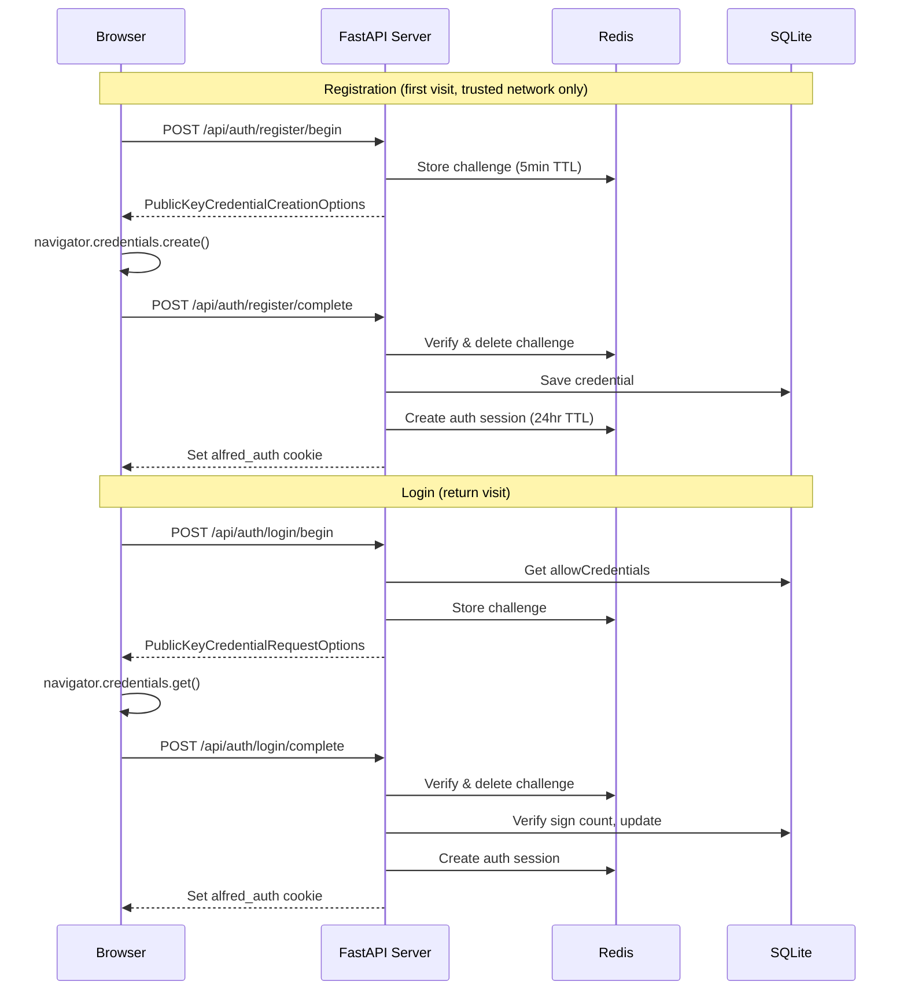

# D1: WebAuthn Registration & Login — Implementation Plan

> **For agentic workers:** REQUIRED SUB-SKILL: Use superpowers:subagent-driven-development (recommended) or superpowers:executing-plans to implement this plan task-by-task. Steps use checkbox (`- [ ]`) syntax for tracking.

**Goal:** Add passkey-based authentication to Alfred's web PWA so only the registered owner can access the chat interface.

**Architecture:** py_webauthn handles WebAuthn ceremonies server-side. SQLite stores credentials, Redis stores auth sessions and challenges. An HTTP cookie carries auth state to WebSocket upgrades. The frontend uses Conditional UI for passkey autofill on return visits. A hard gate blocks all unauthenticated access.

**Tech Stack:** py_webauthn, aiosqlite, FastAPI, Redis async, vanilla JS (navigator.credentials API)

---

## File Structure

### New Files
| File | Responsibility |
|------|---------------|
| `core/identity/credentials.py` | `CredentialStore` — async SQLite CRUD for WebAuthn credentials |
| `core/identity/auth_routes.py` | FastAPI APIRouter with 6 auth endpoints |
| `core/identity/auth_middleware.py` | Cookie validation middleware injecting `request.state.authenticated` |
| `web/auth.js` | Client-side WebAuthn ceremonies, Conditional UI, auth flow control |
| `tests/core/identity/test_credentials.py` | CredentialStore unit tests |
| `tests/core/identity/test_auth_routes.py` | Auth endpoint tests |
| `tests/core/identity/test_auth_middleware.py` | Middleware tests |
| `tests/integration/test_webauthn_flow.py` | End-to-end registration → login → WS auth flow |

### Modified Files
| File | Changes |
|------|---------|
| `shared/streams.py` | Add `AUTH_SESSION_PREFIX`, `WEBAUTHN_CHALLENGE_PREFIX` constants |
| `pyproject.toml` | Add `py_webauthn` to base deps, move `aiosqlite` from `[memory]` to base |
| `core/channels/web_server.py` | Mount auth router, add middleware, wire `authenticated` into WS handler |
| `web/index.html` | Add `auth.js` script tag, add login screen HTML, update onboarding step 1 |
| `web/app.js` | Remove hardcoded `identity: 'sir'`, gate on auth status before connect |
| `web/style.css` | Add login screen and registration step styles |
| `conftest.py` | Add shared fixtures for fake credential data |

---

### Task 1: Add Dependencies and Stream Constants

**Files:**
- Modify: `pyproject.toml:13-20` (dependencies)
- Modify: `shared/streams.py:1-42` (stream constants)

- [ ] **Step 1: Add py_webauthn and move aiosqlite to base deps**

In `pyproject.toml`, add `py_webauthn` to the base dependencies array and move `aiosqlite` from the `[memory]` extra to base:

```toml
# In [project] dependencies, add after the PyJWT line:
    "py-webauthn>=2.0",
    "aiosqlite>=0.20",
```

Remove `"aiosqlite>=0.20"` from the `[project.optional-dependencies]` `memory` list (it will still be available since it's now a base dep).

- [ ] **Step 2: Add stream constants**

In `shared/streams.py`, add these constants after the existing ones:

```python
# Auth (WebAuthn)
AUTH_SESSION_PREFIX: str = "alfred:auth:"
WEBAUTHN_CHALLENGE_PREFIX: str = "alfred:webauthn:challenge:"
```

- [ ] **Step 3: Install updated deps**

Run:
```bash
uv pip install -e ".[dev,memory,voice,integrations]"
```
Expected: successful install with py_webauthn and aiosqlite now in base deps.

- [ ] **Step 4: Verify imports work**

Run:
```bash
python -c "import webauthn; print(webauthn.__version__)"
python -c "import aiosqlite; print(aiosqlite.__version__)"
```
Expected: version numbers printed, no errors.

- [ ] **Step 5: Commit**

```bash
git add pyproject.toml shared/streams.py
git commit -m "feat(d1): add py_webauthn dep and auth stream constants"
```

---

### Task 2: CredentialStore — SQLite CRUD

**Files:**
- Create: `core/identity/__init__.py`
- Create: `core/identity/credentials.py`
- Create: `tests/core/identity/__init__.py`
- Create: `tests/core/identity/test_credentials.py`

- [ ] **Step 1: Create package init files**

Create empty `core/identity/__init__.py` and `tests/core/identity/__init__.py`.

- [ ] **Step 2: Write the failing tests**

Create `tests/core/identity/test_credentials.py`:

```python
"""Tests for WebAuthn credential store."""

from __future__ import annotations

import pytest

from core.identity.credentials import CredentialStore, StoredCredential


@pytest.fixture
async def store(tmp_path: object) -> CredentialStore:  # noqa: ANN001
    """Create a CredentialStore backed by a temp SQLite DB."""
    import pathlib

    db_path = pathlib.Path(str(tmp_path)) / "credentials.db"
    s = CredentialStore(db_path)
    await s.initialize()
    return s


FAKE_CRED_ID = "dGVzdC1jcmVkLWlk"
FAKE_PUBLIC_KEY = b"\x01\x02\x03\x04"
FAKE_DEVICE_NAME = "MacBook Pro"
FAKE_TRANSPORTS = ["internal", "hybrid"]


class TestCredentialStore:
    @pytest.mark.asyncio
    async def test_has_any_credential_empty(self, store: CredentialStore) -> None:
        assert await store.has_any_credential() is False

    @pytest.mark.asyncio
    async def test_save_and_get(self, store: CredentialStore) -> None:
        await store.save_credential(
            credential_id=FAKE_CRED_ID,
            public_key=FAKE_PUBLIC_KEY,
            sign_count=0,
            device_name=FAKE_DEVICE_NAME,
            transports=FAKE_TRANSPORTS,
        )
        cred = await store.get_credential(FAKE_CRED_ID)
        assert cred is not None
        assert cred.credential_id == FAKE_CRED_ID
        assert cred.public_key == FAKE_PUBLIC_KEY
        assert cred.sign_count == 0
        assert cred.device_name == FAKE_DEVICE_NAME
        assert cred.transports == ["internal", "hybrid"]
        assert cred.created_at is not None
        assert cred.last_used_at is not None

    @pytest.mark.asyncio
    async def test_has_any_credential_after_save(self, store: CredentialStore) -> None:
        await store.save_credential(
            credential_id=FAKE_CRED_ID,
            public_key=FAKE_PUBLIC_KEY,
            sign_count=0,
            device_name=FAKE_DEVICE_NAME,
            transports=FAKE_TRANSPORTS,
        )
        assert await store.has_any_credential() is True

    @pytest.mark.asyncio
    async def test_list_credentials(self, store: CredentialStore) -> None:
        await store.save_credential(
            credential_id="cred-1",
            public_key=b"\x01",
            sign_count=0,
            device_name="Device A",
            transports=["internal"],
        )
        await store.save_credential(
            credential_id="cred-2",
            public_key=b"\x02",
            sign_count=0,
            device_name="Device B",
            transports=["hybrid"],
        )
        creds = await store.list_credentials()
        assert len(creds) == 2
        ids = {c.credential_id for c in creds}
        assert ids == {"cred-1", "cred-2"}

    @pytest.mark.asyncio
    async def test_update_sign_count(self, store: CredentialStore) -> None:
        await store.save_credential(
            credential_id=FAKE_CRED_ID,
            public_key=FAKE_PUBLIC_KEY,
            sign_count=0,
            device_name=FAKE_DEVICE_NAME,
            transports=FAKE_TRANSPORTS,
        )
        await store.update_sign_count(FAKE_CRED_ID, 5)
        cred = await store.get_credential(FAKE_CRED_ID)
        assert cred is not None
        assert cred.sign_count == 5

    @pytest.mark.asyncio
    async def test_delete_credential(self, store: CredentialStore) -> None:
        await store.save_credential(
            credential_id=FAKE_CRED_ID,
            public_key=FAKE_PUBLIC_KEY,
            sign_count=0,
            device_name=FAKE_DEVICE_NAME,
            transports=FAKE_TRANSPORTS,
        )
        await store.delete_credential(FAKE_CRED_ID)
        cred = await store.get_credential(FAKE_CRED_ID)
        assert cred is None
        assert await store.has_any_credential() is False

    @pytest.mark.asyncio
    async def test_get_nonexistent(self, store: CredentialStore) -> None:
        cred = await store.get_credential("does-not-exist")
        assert cred is None

    @pytest.mark.asyncio
    async def test_get_or_create_user_id(self, store: CredentialStore) -> None:
        uid1 = await store.get_or_create_user_id()
        uid2 = await store.get_or_create_user_id()
        assert uid1 == uid2
        assert len(uid1) == 64  # 32 bytes as hex
```

- [ ] **Step 3: Run tests to verify they fail**

Run: `pytest tests/core/identity/test_credentials.py -v`
Expected: FAIL — `ModuleNotFoundError: No module named 'core.identity.credentials'`

- [ ] **Step 4: Implement CredentialStore**

Create `core/identity/credentials.py`:

```python
"""WebAuthn credential store backed by SQLite."""

from __future__ import annotations

import json
import os
import pathlib
from datetime import datetime, timezone
from dataclasses import dataclass

import aiosqlite


@dataclass(frozen=True)
class StoredCredential:
    """A stored WebAuthn credential."""

    credential_id: str
    public_key: bytes
    sign_count: int
    device_name: str
    transports: list[str]
    created_at: str
    last_used_at: str


_SCHEMA_SQL = """
CREATE TABLE IF NOT EXISTS webauthn_credentials (
    id          TEXT PRIMARY KEY,
    public_key  BLOB NOT NULL,
    sign_count  INTEGER NOT NULL,
    device_name TEXT NOT NULL,
    transports  TEXT NOT NULL,
    created_at  TEXT NOT NULL,
    last_used_at TEXT NOT NULL
);

CREATE TABLE IF NOT EXISTS webauthn_user (
    key   TEXT PRIMARY KEY,
    value TEXT NOT NULL
);
"""


class CredentialStore:
    """Async SQLite store for WebAuthn credentials."""

    def __init__(self, db_path: pathlib.Path | None = None) -> None:
        if db_path is None:
            data_dir = pathlib.Path(
                os.getenv("ALFRED_DATA_DIR", "data")
            )
            data_dir.mkdir(parents=True, exist_ok=True)
            db_path = data_dir / "credentials.db"
        self._db_path = db_path
        self._db: aiosqlite.Connection | None = None

    async def initialize(self) -> None:
        """Open DB connection and ensure schema exists."""
        self._db_path.parent.mkdir(parents=True, exist_ok=True)
        self._db = await aiosqlite.connect(str(self._db_path))
        self._db.row_factory = aiosqlite.Row
        await self._db.executescript(_SCHEMA_SQL)
        await self._db.commit()

    async def close(self) -> None:
        """Close the DB connection."""
        if self._db:
            await self._db.close()
            self._db = None

    def _conn(self) -> aiosqlite.Connection:
        if self._db is None:
            msg = "CredentialStore not initialized — call initialize() first"
            raise RuntimeError(msg)
        return self._db

    async def save_credential(
        self,
        *,
        credential_id: str,
        public_key: bytes,
        sign_count: int,
        device_name: str,
        transports: list[str],
    ) -> None:
        """Save a new WebAuthn credential."""
        now = datetime.now(timezone.utc).isoformat()
        await self._conn().execute(
            "INSERT INTO webauthn_credentials "
            "(id, public_key, sign_count, device_name, transports, created_at, last_used_at) "
            "VALUES (?, ?, ?, ?, ?, ?, ?)",
            (credential_id, public_key, sign_count, device_name,
             json.dumps(transports), now, now),
        )
        await self._conn().commit()

    async def get_credential(self, credential_id: str) -> StoredCredential | None:
        """Get a credential by ID, or None if not found."""
        cursor = await self._conn().execute(
            "SELECT * FROM webauthn_credentials WHERE id = ?",
            (credential_id,),
        )
        row = await cursor.fetchone()
        if row is None:
            return None
        return self._row_to_credential(row)

    async def list_credentials(self) -> list[StoredCredential]:
        """List all stored credentials."""
        cursor = await self._conn().execute(
            "SELECT * FROM webauthn_credentials ORDER BY created_at"
        )
        rows = await cursor.fetchall()
        return [self._row_to_credential(row) for row in rows]

    async def update_sign_count(
        self, credential_id: str, new_count: int
    ) -> None:
        """Update the sign count and last_used_at timestamp."""
        now = datetime.now(timezone.utc).isoformat()
        await self._conn().execute(
            "UPDATE webauthn_credentials SET sign_count = ?, last_used_at = ? WHERE id = ?",
            (new_count, now, credential_id),
        )
        await self._conn().commit()

    async def delete_credential(self, credential_id: str) -> None:
        """Delete a credential by ID."""
        await self._conn().execute(
            "DELETE FROM webauthn_credentials WHERE id = ?",
            (credential_id,),
        )
        await self._conn().commit()

    async def has_any_credential(self) -> bool:
        """Check if any credential is registered."""
        cursor = await self._conn().execute(
            "SELECT COUNT(*) FROM webauthn_credentials"
        )
        row = await cursor.fetchone()
        return bool(row and row[0] > 0)

    async def get_or_create_user_id(self) -> str:
        """Get or create the single WebAuthn user ID (hex string)."""
        cursor = await self._conn().execute(
            "SELECT value FROM webauthn_user WHERE key = 'user_id'"
        )
        row = await cursor.fetchone()
        if row:
            return str(row[0])
        user_id = os.urandom(32).hex()
        await self._conn().execute(
            "INSERT INTO webauthn_user (key, value) VALUES ('user_id', ?)",
            (user_id,),
        )
        await self._conn().commit()
        return user_id

    @staticmethod
    def _row_to_credential(row: aiosqlite.Row) -> StoredCredential:
        return StoredCredential(
            credential_id=row["id"],
            public_key=bytes(row["public_key"]),
            sign_count=row["sign_count"],
            device_name=row["device_name"],
            transports=json.loads(row["transports"]),
            created_at=row["created_at"],
            last_used_at=row["last_used_at"],
        )
```

- [ ] **Step 5: Run tests to verify they pass**

Run: `pytest tests/core/identity/test_credentials.py -v`
Expected: all 9 tests PASS

- [ ] **Step 6: Run linting and type checks**

Run:
```bash
ruff check core/identity/ tests/core/identity/ --fix && ruff format core/identity/ tests/core/identity/
mypy --strict core/identity/credentials.py
```
Expected: clean

- [ ] **Step 7: Commit**

```bash
git add core/identity/ tests/core/identity/
git commit -m "feat(d1): add CredentialStore with SQLite backend"
```

---

### Task 3: Auth Middleware — Cookie Validation

**Files:**
- Create: `core/identity/auth_middleware.py`
- Create: `tests/core/identity/test_auth_middleware.py`

- [ ] **Step 1: Write the failing tests**

Create `tests/core/identity/test_auth_middleware.py`:

```python
"""Tests for auth cookie middleware."""

from __future__ import annotations

import pytest
from unittest.mock import AsyncMock, patch
from starlette.testclient import TestClient
from fastapi import FastAPI, Request
from starlette.responses import JSONResponse

from core.identity.auth_middleware import AuthCookieMiddleware
from shared.streams import AUTH_SESSION_PREFIX


def _make_app(redis_mock: AsyncMock) -> FastAPI:
    """Build a minimal FastAPI app with auth middleware."""
    app = FastAPI()

    @app.get("/test")
    async def test_endpoint(request: Request) -> JSONResponse:
        return JSONResponse({
            "authenticated": getattr(request.state, "authenticated", False),
            "credential_id": getattr(request.state, "credential_id", None),
        })

    app.add_middleware(AuthCookieMiddleware, redis=redis_mock)
    return app


class TestAuthCookieMiddleware:
    def test_no_cookie_unauthenticated(self) -> None:
        redis_mock = AsyncMock()
        app = _make_app(redis_mock)
        client = TestClient(app)
        resp = client.get("/test")
        assert resp.status_code == 200
        assert resp.json()["authenticated"] is False

    def test_valid_cookie_authenticated(self) -> None:
        redis_mock = AsyncMock()
        redis_mock.hgetall.return_value = {
            b"authenticated": b"1",
            b"credential_id": b"test-cred-id",
            b"created_at": b"2026-04-16T00:00:00+00:00",
        }
        app = _make_app(redis_mock)
        client = TestClient(app)
        client.cookies.set("alfred_auth", "valid-session-id")
        resp = client.get("/test")
        assert resp.status_code == 200
        assert resp.json()["authenticated"] is True
        assert resp.json()["credential_id"] == "test-cred-id"
        redis_mock.hgetall.assert_called_once_with(
            f"{AUTH_SESSION_PREFIX}valid-session-id"
        )

    def test_expired_cookie_unauthenticated(self) -> None:
        redis_mock = AsyncMock()
        redis_mock.hgetall.return_value = {}  # expired/missing session
        app = _make_app(redis_mock)
        client = TestClient(app)
        client.cookies.set("alfred_auth", "expired-session")
        resp = client.get("/test")
        assert resp.status_code == 200
        assert resp.json()["authenticated"] is False

    def test_redis_error_unauthenticated(self) -> None:
        redis_mock = AsyncMock()
        redis_mock.hgetall.side_effect = Exception("Redis down")
        app = _make_app(redis_mock)
        client = TestClient(app)
        client.cookies.set("alfred_auth", "some-session")
        resp = client.get("/test")
        assert resp.status_code == 200
        assert resp.json()["authenticated"] is False
```

- [ ] **Step 2: Run tests to verify they fail**

Run: `pytest tests/core/identity/test_auth_middleware.py -v`
Expected: FAIL — `ModuleNotFoundError: No module named 'core.identity.auth_middleware'`

- [ ] **Step 3: Implement AuthCookieMiddleware**

Create `core/identity/auth_middleware.py`:

```python
"""Cookie-based auth middleware for FastAPI."""

from __future__ import annotations

from typing import Any

from loguru import logger
from starlette.middleware.base import BaseHTTPMiddleware, RequestResponseEndpoint
from starlette.requests import Request
from starlette.responses import Response

from shared.streams import AUTH_SESSION_PREFIX

COOKIE_NAME = "alfred_auth"


class AuthCookieMiddleware(BaseHTTPMiddleware):
    """Read alfred_auth cookie and inject authenticated state into request."""

    def __init__(self, app: Any, redis: Any) -> None:  # noqa: ANN401
        super().__init__(app)
        self._redis = redis

    async def dispatch(
        self, request: Request, call_next: RequestResponseEndpoint
    ) -> Response:
        request.state.authenticated = False
        request.state.credential_id = None

        session_id = request.cookies.get(COOKIE_NAME)
        if session_id:
            try:
                data: dict[bytes, bytes] = await self._redis.hgetall(
                    f"{AUTH_SESSION_PREFIX}{session_id}"
                )
                if data and data.get(b"authenticated") == b"1":
                    request.state.authenticated = True
                    raw_cred = data.get(b"credential_id", b"")
                    request.state.credential_id = raw_cred.decode()
            except Exception:
                logger.warning("Auth session lookup failed — treating as unauthenticated")

        return await call_next(request)
```

- [ ] **Step 4: Run tests to verify they pass**

Run: `pytest tests/core/identity/test_auth_middleware.py -v`
Expected: all 4 tests PASS

- [ ] **Step 5: Lint and type check**

Run:
```bash
ruff check core/identity/auth_middleware.py tests/core/identity/test_auth_middleware.py --fix
ruff format core/identity/auth_middleware.py tests/core/identity/test_auth_middleware.py
mypy --strict core/identity/auth_middleware.py
```

- [ ] **Step 6: Commit**

```bash
git add core/identity/auth_middleware.py tests/core/identity/test_auth_middleware.py
git commit -m "feat(d1): add AuthCookieMiddleware for session validation"
```

---

### Task 4: Auth Routes — Registration & Login Endpoints

**Files:**
- Create: `core/identity/auth_routes.py`
- Create: `tests/core/identity/test_auth_routes.py`

- [ ] **Step 1: Write the failing tests**

Create `tests/core/identity/test_auth_routes.py`:

```python
"""Tests for WebAuthn auth routes."""

from __future__ import annotations

import json
from unittest.mock import AsyncMock, MagicMock, patch

import pytest
from fastapi import FastAPI
from fastapi.testclient import TestClient

from core.identity.auth_routes import create_auth_router
from core.identity.credentials import CredentialStore
from shared.streams import AUTH_SESSION_PREFIX, WEBAUTHN_CHALLENGE_PREFIX


@pytest.fixture
async def store(tmp_path: object) -> CredentialStore:
    import pathlib

    db_path = pathlib.Path(str(tmp_path)) / "credentials.db"
    s = CredentialStore(db_path)
    await s.initialize()
    return s


@pytest.fixture
def redis_mock() -> AsyncMock:
    mock = AsyncMock()
    mock.set = AsyncMock()
    mock.get = AsyncMock(return_value=None)
    mock.delete = AsyncMock()
    mock.hset = AsyncMock()
    mock.expire = AsyncMock()
    mock.hgetall = AsyncMock(return_value={})
    return mock


@pytest.fixture
def app(store: CredentialStore, redis_mock: AsyncMock) -> FastAPI:
    app = FastAPI()
    router = create_auth_router(store=store, redis=redis_mock)
    app.include_router(router)
    return app


@pytest.fixture
def client(app: FastAPI) -> TestClient:
    return TestClient(app)


class TestAuthStatus:
    def test_no_credentials_registered(self, client: TestClient) -> None:
        resp = client.get("/api/auth/status")
        assert resp.status_code == 200
        data = resp.json()
        assert data["registered"] is False
        assert data["authenticated"] is False

    @pytest.mark.asyncio
    async def test_credential_registered_not_authenticated(
        self, store: CredentialStore, client: TestClient
    ) -> None:
        await store.save_credential(
            credential_id="test-cred",
            public_key=b"\x01",
            sign_count=0,
            device_name="Test",
            transports=["internal"],
        )
        resp = client.get("/api/auth/status")
        assert resp.status_code == 200
        data = resp.json()
        assert data["registered"] is True
        assert data["authenticated"] is False


class TestRegistrationBegin:
    def test_returns_options(
        self, client: TestClient, redis_mock: AsyncMock
    ) -> None:
        with patch("core.identity.auth_routes.generate_registration_options") as mock_gen, \
             patch("core.identity.auth_routes.options_to_json") as mock_json:
            mock_options = MagicMock()
            mock_options.challenge = b"\x01\x02\x03"
            mock_gen.return_value = mock_options
            mock_json.return_value = '{"test": "options"}'

            resp = client.post(
                "/api/auth/register/begin",
                json={"device_name": "MacBook Pro"},
                headers={"X-Forwarded-For": "127.0.0.1"},
            )
            assert resp.status_code == 200
            assert resp.json() == {"test": "options"}
            mock_gen.assert_called_once()

    def test_rejects_untrusted_network(self, app: FastAPI) -> None:
        client = TestClient(app)
        resp = client.post(
            "/api/auth/register/begin",
            json={"device_name": "Test"},
            headers={"X-Forwarded-For": "203.0.113.1"},
        )
        assert resp.status_code == 403


class TestRegistrationComplete:
    def test_rejects_untrusted_network(self, client: TestClient) -> None:
        resp = client.post(
            "/api/auth/register/complete",
            json={"credential": "{}"},
            headers={"X-Forwarded-For": "203.0.113.1"},
        )
        assert resp.status_code == 403


class TestLoginBegin:
    @pytest.mark.asyncio
    async def test_returns_options_with_credentials(
        self, store: CredentialStore, client: TestClient, redis_mock: AsyncMock
    ) -> None:
        await store.save_credential(
            credential_id="test-cred",
            public_key=b"\x01",
            sign_count=0,
            device_name="Test",
            transports=["internal"],
        )
        with patch("core.identity.auth_routes.generate_authentication_options") as mock_gen, \
             patch("core.identity.auth_routes.options_to_json") as mock_json:
            mock_options = MagicMock()
            mock_options.challenge = b"\x04\x05\x06"
            mock_gen.return_value = mock_options
            mock_json.return_value = '{"test": "auth_options"}'

            resp = client.post("/api/auth/login/begin")
            assert resp.status_code == 200
            assert resp.json() == {"test": "auth_options"}

    def test_returns_404_no_credentials(self, client: TestClient) -> None:
        resp = client.post("/api/auth/login/begin")
        assert resp.status_code == 404


class TestLogout:
    def test_clears_session_and_cookie(
        self, client: TestClient, redis_mock: AsyncMock
    ) -> None:
        redis_mock.hgetall.return_value = {
            b"authenticated": b"1",
            b"credential_id": b"test",
            b"created_at": b"2026-04-16T00:00:00",
        }
        client.cookies.set("alfred_auth", "session-123")
        resp = client.post("/api/auth/logout")
        assert resp.status_code == 200
        redis_mock.delete.assert_called_once_with(
            f"{AUTH_SESSION_PREFIX}session-123"
        )
```

- [ ] **Step 2: Run tests to verify they fail**

Run: `pytest tests/core/identity/test_auth_routes.py -v`
Expected: FAIL — `ModuleNotFoundError: No module named 'core.identity.auth_routes'`

- [ ] **Step 3: Implement auth routes**

Create `core/identity/auth_routes.py`:

```python
"""WebAuthn registration and authentication endpoints."""

from __future__ import annotations

import json
import uuid
from datetime import datetime, timezone
from typing import Any

from fastapi import APIRouter, Cookie, Depends, HTTPException, Request
from fastapi.responses import JSONResponse
from loguru import logger
from pydantic import BaseModel
from webauthn import (
    generate_authentication_options,
    generate_registration_options,
    options_to_json,
    verify_authentication_response,
    verify_registration_response,
)
from webauthn.helpers import bytes_to_base64url
from webauthn.helpers.structs import (
    AuthenticatorSelectionCriteria,
    PublicKeyCredentialDescriptor,
    ResidentKeyRequirement,
    UserVerificationRequirement,
)

from core.identity.credentials import CredentialStore
from shared.streams import AUTH_SESSION_PREFIX, WEBAUTHN_CHALLENGE_PREFIX

_AUTH_SESSION_TTL = 86400  # 24 hours
_CHALLENGE_TTL = 300  # 5 minutes


class RegisterBeginRequest(BaseModel):
    device_name: str


def _get_rp_id(request: Request) -> str:
    """Derive rp_id from the request host."""
    host = request.headers.get("host", "localhost")
    return host.split(":")[0]


def _get_origin(request: Request) -> str:
    """Derive origin from the request."""
    scheme = request.headers.get("x-forwarded-proto", request.url.scheme)
    host = request.headers.get("host", "localhost")
    return f"{scheme}://{host}"


def create_auth_router(
    *,
    store: CredentialStore,
    redis: Any,  # noqa: ANN401
) -> APIRouter:
    """Build the auth APIRouter with all WebAuthn endpoints."""

    from core.channels.web_server import require_trusted_network

    router = APIRouter(prefix="/api/auth", tags=["auth"])

    @router.get("/status")
    async def auth_status(request: Request) -> JSONResponse:
        registered = await store.has_any_credential()
        authenticated = getattr(request.state, "authenticated", False)
        return JSONResponse({"registered": registered, "authenticated": authenticated})

    @router.post("/register/begin")
    async def register_begin(
        body: RegisterBeginRequest,
        request: Request,
        _: None = Depends(require_trusted_network),
    ) -> JSONResponse:
        user_id_hex = await store.get_or_create_user_id()
        user_id_bytes = bytes.fromhex(user_id_hex)

        existing = await store.list_credentials()
        exclude = [
            PublicKeyCredentialDescriptor(
                id=bytes_to_base64url(c.credential_id.encode()),
                transports=c.transports,  # type: ignore[arg-type]
            )
            for c in existing
        ]

        rp_id = _get_rp_id(request)
        options = generate_registration_options(
            rp_id=rp_id,
            rp_name="Alfred",
            user_name="sir",
            user_id=user_id_bytes,
            user_display_name="Sir",
            authenticator_selection=AuthenticatorSelectionCriteria(
                resident_key=ResidentKeyRequirement.PREFERRED,
                user_verification=UserVerificationRequirement.PREFERRED,
            ),
            exclude_credentials=exclude,
        )

        challenge_id = str(uuid.uuid4())
        await redis.set(
            f"{WEBAUTHN_CHALLENGE_PREFIX}{challenge_id}",
            bytes_to_base64url(options.challenge),
            ex=_CHALLENGE_TTL,
        )

        options_json = json.loads(options_to_json(options))
        options_json["_challenge_id"] = challenge_id
        options_json["_device_name"] = body.device_name
        return JSONResponse(options_json)

    @router.post("/register/complete")
    async def register_complete(
        request: Request,
        _: None = Depends(require_trusted_network),
    ) -> JSONResponse:
        body = await request.json()
        challenge_id = body.get("_challenge_id", "")
        device_name = body.get("_device_name", "Unknown Device")

        stored_challenge_b64 = await redis.get(
            f"{WEBAUTHN_CHALLENGE_PREFIX}{challenge_id}"
        )
        if not stored_challenge_b64:
            raise HTTPException(status_code=400, detail="Challenge expired or invalid")

        await redis.delete(f"{WEBAUTHN_CHALLENGE_PREFIX}{challenge_id}")

        from webauthn.helpers import base64url_to_bytes

        expected_challenge = base64url_to_bytes(stored_challenge_b64)
        rp_id = _get_rp_id(request)
        origin = _get_origin(request)

        try:
            verification = verify_registration_response(
                credential=body,
                expected_challenge=expected_challenge,
                expected_rp_id=rp_id,
                expected_origin=origin,
            )
        except Exception as e:
            logger.warning(f"Registration verification failed: {e}")
            raise HTTPException(status_code=401, detail="Authentication failed") from e

        credential_id = bytes_to_base64url(verification.credential_id)
        await store.save_credential(
            credential_id=credential_id,
            public_key=verification.credential_public_key,
            sign_count=verification.sign_count,
            device_name=device_name,
            transports=body.get("response", {}).get("transports", []),
        )

        session_id = str(uuid.uuid4())
        now = datetime.now(timezone.utc).isoformat()
        await redis.hset(
            f"{AUTH_SESSION_PREFIX}{session_id}",
            mapping={
                "authenticated": "1",
                "credential_id": credential_id,
                "created_at": now,
            },
        )
        await redis.expire(
            f"{AUTH_SESSION_PREFIX}{session_id}", _AUTH_SESSION_TTL
        )

        response = JSONResponse({"status": "ok", "credential_id": credential_id})
        response.set_cookie(
            key="alfred_auth",
            value=session_id,
            max_age=_AUTH_SESSION_TTL,
            httponly=True,
            samesite="strict",
            secure=request.url.scheme == "https",
        )
        return response

    @router.post("/login/begin")
    async def login_begin(request: Request) -> JSONResponse:
        credentials = await store.list_credentials()
        if not credentials:
            raise HTTPException(status_code=404, detail="No credentials registered")

        allow_credentials = [
            PublicKeyCredentialDescriptor(
                id=c.credential_id.encode(),
                transports=c.transports,  # type: ignore[arg-type]
            )
            for c in credentials
        ]

        rp_id = _get_rp_id(request)
        options = generate_authentication_options(
            rp_id=rp_id,
            allow_credentials=allow_credentials,
            user_verification=UserVerificationRequirement.PREFERRED,
        )

        challenge_id = str(uuid.uuid4())
        await redis.set(
            f"{WEBAUTHN_CHALLENGE_PREFIX}{challenge_id}",
            bytes_to_base64url(options.challenge),
            ex=_CHALLENGE_TTL,
        )

        options_json = json.loads(options_to_json(options))
        options_json["_challenge_id"] = challenge_id
        return JSONResponse(options_json)

    @router.post("/login/complete")
    async def login_complete(request: Request) -> JSONResponse:
        body = await request.json()
        challenge_id = body.get("_challenge_id", "")

        stored_challenge_b64 = await redis.get(
            f"{WEBAUTHN_CHALLENGE_PREFIX}{challenge_id}"
        )
        if not stored_challenge_b64:
            raise HTTPException(status_code=400, detail="Challenge expired or invalid")

        await redis.delete(f"{WEBAUTHN_CHALLENGE_PREFIX}{challenge_id}")

        credential_id_from_body = body.get("id", "")
        cred = await store.get_credential(credential_id_from_body)
        if not cred:
            raise HTTPException(status_code=401, detail="Authentication failed")

        from webauthn.helpers import base64url_to_bytes

        expected_challenge = base64url_to_bytes(stored_challenge_b64)
        rp_id = _get_rp_id(request)
        origin = _get_origin(request)

        try:
            verification = verify_authentication_response(
                credential=body,
                expected_challenge=expected_challenge,
                expected_rp_id=rp_id,
                expected_origin=origin,
                credential_public_key=cred.public_key,
                credential_current_sign_count=cred.sign_count,
            )
        except Exception as e:
            logger.warning(f"Authentication verification failed: {e}")
            raise HTTPException(status_code=401, detail="Authentication failed") from e

        await store.update_sign_count(
            cred.credential_id, verification.new_sign_count
        )

        session_id = str(uuid.uuid4())
        now = datetime.now(timezone.utc).isoformat()
        await redis.hset(
            f"{AUTH_SESSION_PREFIX}{session_id}",
            mapping={
                "authenticated": "1",
                "credential_id": cred.credential_id,
                "created_at": now,
            },
        )
        await redis.expire(
            f"{AUTH_SESSION_PREFIX}{session_id}", _AUTH_SESSION_TTL
        )

        response = JSONResponse({"status": "ok"})
        response.set_cookie(
            key="alfred_auth",
            value=session_id,
            max_age=_AUTH_SESSION_TTL,
            httponly=True,
            samesite="strict",
            secure=request.url.scheme == "https",
        )
        return response

    @router.post("/logout")
    async def logout(
        request: Request,
        alfred_auth: str | None = Cookie(default=None),
    ) -> JSONResponse:
        if alfred_auth:
            await redis.delete(f"{AUTH_SESSION_PREFIX}{alfred_auth}")

        response = JSONResponse({"status": "ok"})
        response.delete_cookie(key="alfred_auth")
        return response

    return router
```

- [ ] **Step 4: Run tests to verify they pass**

Run: `pytest tests/core/identity/test_auth_routes.py -v`
Expected: all tests PASS

- [ ] **Step 5: Lint and type check**

Run:
```bash
ruff check core/identity/auth_routes.py tests/core/identity/test_auth_routes.py --fix
ruff format core/identity/auth_routes.py tests/core/identity/test_auth_routes.py
mypy --strict core/identity/auth_routes.py
```

- [ ] **Step 6: Commit**

```bash
git add core/identity/auth_routes.py tests/core/identity/test_auth_routes.py
git commit -m "feat(d1): add WebAuthn registration and login endpoints"
```

---

### Task 5: Wire Middleware and Auth Router into Web Server

**Files:**
- Modify: `core/channels/web_server.py`

- [ ] **Step 1: Add imports to web_server.py**

At the top of `core/channels/web_server.py`, add these imports alongside existing ones:

```python
from core.identity.auth_middleware import AuthCookieMiddleware
from core.identity.auth_routes import create_auth_router
from core.identity.credentials import CredentialStore
```

- [ ] **Step 2: Initialize CredentialStore in lifespan**

In the `_lifespan()` async context manager (around line 203), add CredentialStore initialization after Redis pool creation:

```python
# After: redis_pool = redis.asyncio.Redis(...)
credential_store = CredentialStore()
await credential_store.initialize()
app.state.credential_store = credential_store
```

And add cleanup before the yield returns:

```python
# Before the finally/cleanup
await credential_store.close()
```

- [ ] **Step 3: Mount auth router in create_app()**

In `create_app()`, after the lifespan sets up Redis but before the route definitions, mount the auth router. Add this inside `create_app()` after the `app = FastAPI(lifespan=_lifespan)` line:

```python
# This needs to happen after lifespan runs, so we defer router creation.
# Instead, mount it in lifespan after Redis and CredentialStore are ready:
```

Actually, since the router needs both `redis` and `credential_store` which are created in lifespan, mount the router inside lifespan after both are available:

```python
auth_router = create_auth_router(store=credential_store, redis=redis_pool)
app.include_router(auth_router)
```

- [ ] **Step 4: Add AuthCookieMiddleware**

In `create_app()`, after the `NoCacheStaticMiddleware` is added (around line 548), add the auth middleware. It must be added **before** the static middleware so it runs on all requests:

```python
app.add_middleware(AuthCookieMiddleware, redis=app.state.redis)
```

Note: Since middleware is added in reverse order in Starlette, add it after `NoCacheStaticMiddleware` — it will execute first.

- [ ] **Step 5: Wire authenticated flag into WebSocket handler**

In the WebSocket handler `/ws` route (around line 253), after the WebSocket is accepted, read auth state from the upgrade request:

```python
# After: await websocket.accept()
authenticated = getattr(websocket.state, "authenticated", False)
```

Note: Starlette copies `request.state` to `websocket.state` through middleware. If this doesn't work with the BaseHTTPMiddleware for WS, use the cookie directly:

```python
from core.identity.auth_middleware import COOKIE_NAME
from shared.streams import AUTH_SESSION_PREFIX

# Read cookie from WS headers
cookie_header = websocket.headers.get("cookie", "")
auth_session_id: str | None = None
for part in cookie_header.split(";"):
    part = part.strip()
    if part.startswith(f"{COOKIE_NAME}="):
        auth_session_id = part[len(f"{COOKIE_NAME}="):]
        break

authenticated = False
if auth_session_id:
    session_data = await redis_pool.hgetall(f"{AUTH_SESSION_PREFIX}{auth_session_id}")
    if session_data and session_data.get(b"authenticated") == b"1":
        authenticated = True

# Reject unauthenticated WS connections
if not authenticated:
    await websocket.close(code=4001, reason="Authentication required")
    return
```

- [ ] **Step 6: Set authenticated on UserRequest**

In the WS handler where `UserRequest` is constructed (around line 331-338), replace the `authenticated` field:

Change:
```python
authenticated=False,  # WebAuthn will set this
```

To:
```python
authenticated=authenticated,
```

- [ ] **Step 7: Remove identity_claim from client data dependency**

In the WS handler where `identity_claim` is read from the client message, change:

```python
identity_claim=data.get("identity", "guest"),
```

To:
```python
identity_claim="sir" if authenticated else "guest",
```

The server now determines identity from auth state, not from what the client claims.

- [ ] **Step 8: Add require_auth to onboarding endpoint**

In `create_app()`, find the `POST /api/onboarding` endpoint (around line 460). Add auth cookie validation so only authenticated users can save preferences. Read the cookie and check Redis inline (same pattern as the WS handler):

```python
@app.post("/api/onboarding")
async def save_onboarding(payload: OnboardingPayload, request: Request) -> JSONResponse:
    if not getattr(request.state, "authenticated", False):
        raise HTTPException(status_code=401, detail="Authentication required")
    # ... rest of existing handler unchanged
```

This works because `AuthCookieMiddleware` already injects `request.state.authenticated` on every request.

- [ ] **Step 9: Run full test suite**

Run: `pytest -x -q`
Expected: all existing tests pass (some may need minor adjustments if they connect to WS without auth — see Task 7 for test fixture updates)

- [ ] **Step 10: Lint and type check**

Run:
```bash
ruff check core/channels/web_server.py --fix && ruff format core/channels/web_server.py
mypy --strict core/channels/web_server.py
```

- [ ] **Step 11: Commit**

```bash
git add core/channels/web_server.py
git commit -m "feat(d1): wire auth middleware, router, and WS auth gate into web server"
```

---

### Task 6: Frontend — Auth JS and Login Screen

**Files:**
- Create: `web/auth.js`
- Modify: `web/index.html`
- Modify: `web/app.js`
- Modify: `web/style.css`

- [ ] **Step 1: Create web/auth.js**

```javascript
/**
 * WebAuthn authentication for Alfred PWA.
 * Handles registration, login (with Conditional UI), and auth status.
 */

const Auth = {
  /**
   * Check current auth status from server.
   * @returns {Promise<{registered: boolean, authenticated: boolean}>}
   */
  async getStatus() {
    const resp = await fetch('/api/auth/status');
    return resp.json();
  },

  /**
   * Start and complete WebAuthn registration.
   * @param {string} deviceName
   * @returns {Promise<boolean>} true if registration succeeded
   */
  async register(deviceName) {
    // Begin
    const beginResp = await fetch('/api/auth/register/begin', {
      method: 'POST',
      headers: { 'Content-Type': 'application/json' },
      body: JSON.stringify({ device_name: deviceName }),
    });
    if (!beginResp.ok) {
      const err = await beginResp.json();
      throw new Error(err.detail || 'Registration failed');
    }
    const options = await beginResp.json();
    const challengeId = options._challenge_id;
    const savedDeviceName = options._device_name;

    // Convert base64url fields for browser API
    options.challenge = base64urlToBuffer(options.challenge);
    options.user.id = base64urlToBuffer(options.user.id);
    if (options.excludeCredentials) {
      options.excludeCredentials = options.excludeCredentials.map(c => ({
        ...c,
        id: base64urlToBuffer(c.id),
      }));
    }
    delete options._challenge_id;
    delete options._device_name;

    // Browser credential creation
    const credential = await navigator.credentials.create({ publicKey: options });
    if (!credential) throw new Error('Credential creation cancelled');

    // Complete
    const attestation = {
      id: credential.id,
      rawId: bufferToBase64url(credential.rawId),
      type: credential.type,
      response: {
        attestationObject: bufferToBase64url(credential.response.attestationObject),
        clientDataJSON: bufferToBase64url(credential.response.clientDataJSON),
        transports: credential.response.getTransports ? credential.response.getTransports() : [],
      },
      _challenge_id: challengeId,
      _device_name: savedDeviceName,
    };

    const completeResp = await fetch('/api/auth/register/complete', {
      method: 'POST',
      headers: { 'Content-Type': 'application/json' },
      body: JSON.stringify(attestation),
    });
    if (!completeResp.ok) {
      const err = await completeResp.json();
      throw new Error(err.detail || 'Registration verification failed');
    }
    return true;
  },

  /**
   * Start and complete WebAuthn login.
   * @param {AbortSignal} [signal] - Optional abort signal for Conditional UI
   * @returns {Promise<boolean>} true if login succeeded
   */
  async login(signal) {
    const beginResp = await fetch('/api/auth/login/begin', { method: 'POST' });
    if (!beginResp.ok) {
      const err = await beginResp.json();
      throw new Error(err.detail || 'Login failed');
    }
    const options = await beginResp.json();
    const challengeId = options._challenge_id;

    options.challenge = base64urlToBuffer(options.challenge);
    if (options.allowCredentials) {
      options.allowCredentials = options.allowCredentials.map(c => ({
        ...c,
        id: base64urlToBuffer(c.id),
      }));
    }
    delete options._challenge_id;

    const getOptions = { publicKey: options };
    if (signal) getOptions.signal = signal;

    const assertion = await navigator.credentials.get(getOptions);
    if (!assertion) throw new Error('Login cancelled');

    const body = {
      id: assertion.id,
      rawId: bufferToBase64url(assertion.rawId),
      type: assertion.type,
      response: {
        authenticatorData: bufferToBase64url(assertion.response.authenticatorData),
        clientDataJSON: bufferToBase64url(assertion.response.clientDataJSON),
        signature: bufferToBase64url(assertion.response.signature),
        userHandle: assertion.response.userHandle
          ? bufferToBase64url(assertion.response.userHandle)
          : null,
      },
      _challenge_id: challengeId,
    };

    const completeResp = await fetch('/api/auth/login/complete', {
      method: 'POST',
      headers: { 'Content-Type': 'application/json' },
      body: JSON.stringify(body),
    });
    if (!completeResp.ok) {
      const err = await completeResp.json();
      throw new Error(err.detail || 'Login verification failed');
    }
    return true;
  },

  /**
   * Try Conditional UI (passkey autofill). Non-blocking — sets up the
   * mediation: "conditional" request that resolves when user taps the
   * passkey suggestion.
   * @param {AbortController} abortController
   * @returns {Promise<boolean>}
   */
  async loginConditional(abortController) {
    const beginResp = await fetch('/api/auth/login/begin', { method: 'POST' });
    if (!beginResp.ok) return false;
    const options = await beginResp.json();
    const challengeId = options._challenge_id;

    options.challenge = base64urlToBuffer(options.challenge);
    if (options.allowCredentials) {
      options.allowCredentials = options.allowCredentials.map(c => ({
        ...c,
        id: base64urlToBuffer(c.id),
      }));
    }
    delete options._challenge_id;

    try {
      const assertion = await navigator.credentials.get({
        publicKey: options,
        mediation: 'conditional',
        signal: abortController.signal,
      });
      if (!assertion) return false;

      const body = {
        id: assertion.id,
        rawId: bufferToBase64url(assertion.rawId),
        type: assertion.type,
        response: {
          authenticatorData: bufferToBase64url(assertion.response.authenticatorData),
          clientDataJSON: bufferToBase64url(assertion.response.clientDataJSON),
          signature: bufferToBase64url(assertion.response.signature),
          userHandle: assertion.response.userHandle
            ? bufferToBase64url(assertion.response.userHandle)
            : null,
        },
        _challenge_id: challengeId,
      };

      const completeResp = await fetch('/api/auth/login/complete', {
        method: 'POST',
        headers: { 'Content-Type': 'application/json' },
        body: JSON.stringify(body),
      });
      return completeResp.ok;
    } catch (e) {
      if (e.name === 'AbortError') return false;
      throw e;
    }
  },

  /** Logout — clear server session and cookie. */
  async logout() {
    await fetch('/api/auth/logout', { method: 'POST' });
    window.location.reload();
  },
};

// --- Base64url helpers ---

function base64urlToBuffer(base64url) {
  const base64 = base64url.replace(/-/g, '+').replace(/_/g, '/');
  const pad = base64.length % 4 === 0 ? '' : '='.repeat(4 - (base64.length % 4));
  const binary = atob(base64 + pad);
  const bytes = new Uint8Array(binary.length);
  for (let i = 0; i < binary.length; i++) bytes[i] = binary.charCodeAt(i);
  return bytes.buffer;
}

function bufferToBase64url(buffer) {
  const bytes = new Uint8Array(buffer);
  let binary = '';
  for (let i = 0; i < bytes.length; i++) binary += String.fromCharCode(bytes[i]);
  return btoa(binary).replace(/\+/g, '-').replace(/\//g, '_').replace(/=+$/, '');
}
```

- [ ] **Step 2: Update web/index.html — add login screen and update onboarding**

Add the `auth.js` script tag before `app.js`:

```html
<script src="auth.js"></script>
```

Add a login screen overlay (after the onboarding overlay, before `<div class="container">`):

```html
<!-- Login Screen -->
<div id="login-overlay" class="login-overlay" style="display: none;">
  <div class="login-card">
    <div class="login-header">
      <h1>Alfred</h1>
      <p class="subtitle">Your Personal Assistant</p>
    </div>
    <div id="login-webauthn-supported">
      <input type="text" id="login-passkey-input"
             autocomplete="webauthn"
             placeholder="Passkey will appear here..."
             readonly
             class="login-input" />
      <button id="login-btn" class="onboarding-btn" onclick="handleLogin()">
        Sign in with Passkey
      </button>
    </div>
    <div id="login-unsupported" style="display: none;">
      <p class="login-error">Your browser doesn't support passkeys. Please use Safari, Chrome, or Edge.</p>
    </div>
    <p id="login-error" class="login-error" style="display: none;"></p>
  </div>
</div>
```

Replace onboarding step 0 content (the identity placeholder around line 29) with:

```html
<div class="onboarding-step active" data-step="0">
  <h2>Register Your Device</h2>
  <p>Secure your Alfred instance with a passkey. This uses your device's biometric authentication (Touch ID, Face ID, or Windows Hello).</p>
  <div class="register-form">
    <label for="device-name">Device Name</label>
    <input type="text" id="device-name" class="login-input"
           placeholder="e.g., MacBook Pro" value="" />
    <button class="onboarding-btn" onclick="handleRegister()">
      Register Passkey
    </button>
    <p id="register-error" class="login-error" style="display: none;"></p>
  </div>
</div>
```

- [ ] **Step 3: Update web/app.js — gate on auth, remove identity claim**

Replace the init block at the bottom of `app.js` (lines ~406-409):

```javascript
// --- Auth-gated init ---
async function init() {
  if (!window.PublicKeyCredential) {
    document.getElementById('login-unsupported').style.display = 'block';
    document.getElementById('login-webauthn-supported').style.display = 'none';
  }

  const status = await Auth.getStatus();

  if (!status.registered) {
    // First visit — show onboarding (step 0 = registration)
    initOnboarding();
    return;
  }

  if (!status.authenticated) {
    // Return visit — show login
    showLoginScreen();
    return;
  }

  // Authenticated — go to chat
  connect();
}

function showLoginScreen() {
  document.getElementById('login-overlay').style.display = 'flex';
  // Try Conditional UI
  if (window.PublicKeyCredential &&
      PublicKeyCredential.isConditionalMediationAvailable) {
    PublicKeyCredential.isConditionalMediationAvailable().then(available => {
      if (available) {
        window._conditionalAbort = new AbortController();
        Auth.loginConditional(window._conditionalAbort).then(ok => {
          if (ok) window.location.reload();
        });
      }
    });
  }
}

async function handleLogin() {
  const errorEl = document.getElementById('login-error');
  errorEl.style.display = 'none';
  try {
    if (window._conditionalAbort) window._conditionalAbort.abort();
    await Auth.login();
    window.location.reload();
  } catch (e) {
    errorEl.textContent = e.message || 'Login failed. Please try again.';
    errorEl.style.display = 'block';
  }
}

async function handleRegister() {
  const errorEl = document.getElementById('register-error');
  errorEl.style.display = 'none';
  const deviceName = document.getElementById('device-name').value.trim()
    || navigator.platform || 'Unknown Device';
  try {
    await Auth.register(deviceName);
    // Registration succeeded — move to next onboarding step
    nextStep();
  } catch (e) {
    errorEl.textContent = e.message || 'Registration failed. Please try again.';
    errorEl.style.display = 'block';
  }
}

init();
```

Remove the hardcoded `identity: 'sir'` from WebSocket message sends (lines ~190 and ~253). Remove the `identity` field entirely from the JSON payloads — the server handles identity now.

Change line ~190 from:
```javascript
ws.send(JSON.stringify({ type: 'text', content: text, identity: 'sir' }));
```
To:
```javascript
ws.send(JSON.stringify({ type: 'text', content: text }));
```

Change line ~253 from:
```javascript
ws.send(JSON.stringify({ type: 'audio', content: base64, format: audioFormat, identity: 'sir' }));
```
To:
```javascript
ws.send(JSON.stringify({ type: 'audio', content: base64, format: audioFormat }));
```

- [ ] **Step 4: Add login and registration styles to web/style.css**

Append to `web/style.css`:

```css
/* --- Login Screen --- */

.login-overlay {
    position: fixed;
    top: 0;
    left: 0;
    width: 100%;
    height: 100%;
    background: var(--bg-primary);
    display: flex;
    align-items: center;
    justify-content: center;
    z-index: 1000;
}

.login-card {
    background: var(--bg-secondary);
    border: 1px solid var(--border);
    border-radius: 4px;
    padding: 3rem;
    max-width: 400px;
    width: 90%;
    text-align: center;
}

.login-header h1 {
    font-family: 'Cormorant Garamond', serif;
    font-size: 2.5rem;
    color: var(--brass);
    margin-bottom: 0.5rem;
}

.login-header .subtitle {
    color: var(--text-secondary);
    font-style: italic;
    margin-bottom: 2rem;
}

.login-input {
    width: 100%;
    padding: 0.75rem 1rem;
    background: var(--bg-primary);
    border: 1px solid var(--border);
    border-radius: 3px;
    color: var(--text-primary);
    font-family: 'EB Garamond', serif;
    font-size: 1rem;
    margin-bottom: 1rem;
    box-sizing: border-box;
}

.login-input:focus {
    outline: none;
    border-color: var(--brass);
}

.login-input::placeholder {
    color: var(--text-secondary);
    opacity: 0.6;
}

.login-error {
    color: #c0392b;
    font-size: 0.9rem;
    margin-top: 0.5rem;
}

.register-form {
    text-align: left;
    margin-top: 1.5rem;
}

.register-form label {
    display: block;
    color: var(--text-secondary);
    font-size: 0.85rem;
    text-transform: uppercase;
    letter-spacing: 0.05em;
    margin-bottom: 0.5rem;
}
```

- [ ] **Step 5: Add logout button to settings.html**

In `web/settings.html`, add a logout section at the bottom of the settings container (before the closing `</div>` of the main container):

```html
<div class="settings-section" style="margin-top: 2rem; border-top: 1px solid var(--border); padding-top: 1.5rem;">
  <h2>Session</h2>
  <button class="onboarding-btn" onclick="Auth.logout()" style="background: #c0392b;">
    Sign Out
  </button>
</div>
<script src="auth.js"></script>
```

- [ ] **Step 6: Commit**

```bash
git add web/auth.js web/index.html web/app.js web/style.css web/settings.html
git commit -m "feat(d1): add frontend WebAuthn registration, login, and Conditional UI"
```

---

### Task 7: Update Existing Tests for Auth Gate

**Files:**
- Modify: `conftest.py`
- Modify: existing test files that test WS or HTTP endpoints

- [ ] **Step 1: Add auth bypass fixture to conftest.py**

Existing tests that connect via WebSocket will be rejected by the auth gate. Add a helper fixture:

```python
from shared.streams import AUTH_SESSION_PREFIX

@pytest.fixture
def auth_cookie_header() -> dict[str, str]:
    """Return a cookie header for an authenticated test session."""
    return {"cookie": "alfred_auth=test-auth-session"}


@pytest.fixture
def _mock_auth_session(monkeypatch: pytest.MonkeyPatch) -> None:
    """Ensure the test auth session exists in Redis."""
    # This is used by tests that need WS auth.
    # The actual Redis mock should have this session pre-populated.
    pass
```

- [ ] **Step 2: Update WebSocket test fixtures**

Search for all tests that create a `TestClient` and connect via `/ws`. These need the auth cookie. The typical pattern is:

In test files that use `TestClient(app).websocket_connect("/ws")`, change to:

```python
with client.websocket_connect("/ws", cookies={"alfred_auth": "test-session"}) as ws:
```

And ensure the Redis mock used by those tests has the auth session:

```python
redis_mock.hgetall.return_value = {
    b"authenticated": b"1",
    b"credential_id": b"test-cred",
    b"created_at": b"2026-04-16T00:00:00",
}
```

- [ ] **Step 3: Run full test suite**

Run: `pytest -x -q`
Expected: all tests pass

- [ ] **Step 4: Lint everything**

Run:
```bash
ruff check . --fix && ruff format .
mypy --strict bus/ core/ domains/ evals/ runner/ sdk/ shared/ telemetry/
```
Expected: clean

- [ ] **Step 5: Commit**

```bash
git add conftest.py tests/
git commit -m "test(d1): update existing tests for WebAuthn auth gate"
```

---

### Task 8: Integration Test — Full WebAuthn Flow

**Files:**
- Create: `tests/integration/test_webauthn_flow.py`

- [ ] **Step 1: Write integration test**

Create `tests/integration/test_webauthn_flow.py`:

```python
"""Integration test for full WebAuthn registration → login → WS auth flow."""

from __future__ import annotations

from unittest.mock import AsyncMock, MagicMock, patch

import pytest
from fastapi.testclient import TestClient

from core.identity.auth_routes import create_auth_router
from core.identity.auth_middleware import AuthCookieMiddleware
from core.identity.credentials import CredentialStore
from shared.streams import AUTH_SESSION_PREFIX


@pytest.fixture
async def store(tmp_path: object) -> CredentialStore:
    import pathlib

    db_path = pathlib.Path(str(tmp_path)) / "credentials.db"
    s = CredentialStore(db_path)
    await s.initialize()
    return s


@pytest.fixture
def redis_mock() -> AsyncMock:
    """Redis mock that stores auth sessions in a dict."""
    store: dict[str, dict[bytes, bytes] | bytes] = {}
    mock = AsyncMock()

    async def fake_set(key: str, value: str, ex: int = 0) -> None:
        store[key] = value.encode() if isinstance(value, str) else value

    async def fake_get(key: str) -> bytes | None:
        val = store.get(key)
        if isinstance(val, bytes):
            return val
        return None

    async def fake_delete(key: str) -> None:
        store.pop(key, None)

    async def fake_hset(key: str, mapping: dict[str, str]) -> None:
        store[key] = {k.encode(): v.encode() for k, v in mapping.items()}

    async def fake_hgetall(key: str) -> dict[bytes, bytes]:
        val = store.get(key, {})
        return val if isinstance(val, dict) else {}

    async def fake_expire(key: str, ttl: int) -> None:
        pass

    mock.set = AsyncMock(side_effect=fake_set)
    mock.get = AsyncMock(side_effect=fake_get)
    mock.delete = AsyncMock(side_effect=fake_delete)
    mock.hset = AsyncMock(side_effect=fake_hset)
    mock.hgetall = AsyncMock(side_effect=fake_hgetall)
    mock.expire = AsyncMock(side_effect=fake_expire)
    return mock


class TestWebAuthnIntegrationFlow:
    """Test the full registration → status → login → status cycle."""

    @pytest.mark.asyncio
    async def test_status_before_registration(
        self, store: CredentialStore, redis_mock: AsyncMock
    ) -> None:
        from fastapi import FastAPI

        app = FastAPI()
        app.add_middleware(AuthCookieMiddleware, redis=redis_mock)
        router = create_auth_router(store=store, redis=redis_mock)
        app.include_router(router)
        client = TestClient(app)

        resp = client.get("/api/auth/status")
        assert resp.json() == {"registered": False, "authenticated": False}

    @pytest.mark.asyncio
    async def test_register_begin_creates_challenge(
        self, store: CredentialStore, redis_mock: AsyncMock
    ) -> None:
        from fastapi import FastAPI

        app = FastAPI()
        router = create_auth_router(store=store, redis=redis_mock)
        app.include_router(router)
        client = TestClient(app)

        with patch("core.identity.auth_routes.generate_registration_options") as mock_gen, \
             patch("core.identity.auth_routes.options_to_json") as mock_json:
            mock_options = MagicMock()
            mock_options.challenge = b"\x01\x02\x03"
            mock_gen.return_value = mock_options
            mock_json.return_value = '{"rp": "alfred"}'

            resp = client.post(
                "/api/auth/register/begin",
                json={"device_name": "Test Device"},
                headers={"X-Forwarded-For": "127.0.0.1"},
            )
            assert resp.status_code == 200
            data = resp.json()
            assert "_challenge_id" in data
            # Verify challenge was stored in Redis
            redis_mock.set.assert_called_once()

    @pytest.mark.asyncio
    async def test_logout_clears_session(
        self, store: CredentialStore, redis_mock: AsyncMock
    ) -> None:
        from fastapi import FastAPI

        app = FastAPI()
        app.add_middleware(AuthCookieMiddleware, redis=redis_mock)
        router = create_auth_router(store=store, redis=redis_mock)
        app.include_router(router)
        client = TestClient(app)

        client.cookies.set("alfred_auth", "session-to-clear")
        resp = client.post("/api/auth/logout")
        assert resp.status_code == 200
        redis_mock.delete.assert_called_with(f"{AUTH_SESSION_PREFIX}session-to-clear")
```

- [ ] **Step 2: Run the integration tests**

Run: `pytest tests/integration/test_webauthn_flow.py -v`
Expected: all tests PASS

- [ ] **Step 3: Commit**

```bash
git add tests/integration/test_webauthn_flow.py
git commit -m "test(d1): add WebAuthn integration tests"
```

---

### Task 9: Documentation

**Files:**
- Create: `docs/webauthn.md`
- Modify: `docs/architecture.md` (add WebAuthn to system diagram)

- [ ] **Step 1: Create docs/webauthn.md**

```markdown
# WebAuthn Authentication

Passkey-based authentication for Alfred's web PWA.

## Architecture



## Key Components

| Component | File | Purpose |
|-----------|------|---------|
| CredentialStore | `core/identity/credentials.py` | SQLite CRUD for WebAuthn credentials |
| Auth Routes | `core/identity/auth_routes.py` | 6 REST endpoints for registration/login/logout |
| Auth Middleware | `core/identity/auth_middleware.py` | Cookie validation on every request |
| Frontend Auth | `web/auth.js` | Client-side WebAuthn ceremonies + Conditional UI |

## Data Stores

- **Credentials:** SQLite at `data/credentials.db` — credential ID, public key, sign count, device name
- **Auth Sessions:** Redis at `alfred:auth:{session_id}` — 24hr TTL
- **Challenges:** Redis at `alfred:webauthn:challenge:{id}` — 5min TTL, one-time use

## Security Properties

- Registration requires Tailscale trusted network
- Cookies: HttpOnly, SameSite=Strict, Secure (HTTPS)
- Challenges: one-time use, 5min expiry
- Sign count verification on each login (clone detection)
- Hard gate: unauthenticated WebSocket connections are rejected (code 4001)

## Frontend Flow

1. Page load → `GET /api/auth/status`
2. Not registered → onboarding (step 1 = WebAuthn registration)
3. Registered but not authenticated → login screen with Conditional UI
4. Authenticated → chat interface
```

- [ ] **Step 2: Update docs/architecture.md**

Add WebAuthn to the system architecture diagram. In the mermaid graph, add:

```mermaid
WebAuthn[WebAuthn<br/>Passkey Auth] --> WebChannel
```

And add a brief section:

```markdown
### Authentication (WebAuthn)

The web PWA uses passkey-based authentication via the WebAuthn standard. Registration is gated to the Tailscale trusted network. Auth sessions are stored in Redis and carried via HttpOnly cookies. The WebSocket handler validates the cookie on connection and rejects unauthenticated clients. See `docs/webauthn.md` for details.
```

- [ ] **Step 3: Commit**

```bash
git add docs/webauthn.md docs/architecture.md
git commit -m "docs(d1): add WebAuthn architecture documentation"
```

---

### Task 10: Final Validation and Cleanup

**Files:**
- All modified files

- [ ] **Step 1: Run full lint + format**

```bash
ruff check . --fix && ruff format .
```
Expected: clean

- [ ] **Step 2: Run mypy strict**

```bash
mypy --strict bus/ core/ domains/ evals/ runner/ sdk/ shared/ telemetry/
```
Expected: clean (or known existing ignores only)

- [ ] **Step 3: Run full test suite**

```bash
pytest -x -q
```
Expected: all tests pass, total count should be ~790+ (780 existing + ~20 new)

- [ ] **Step 4: Remove D1 from highest backlog**

Delete `docs/backlog/highest/d1-webauthn-registration-login.md` — it's now implemented.

- [ ] **Step 5: Final commit**

```bash
git add -A
git commit -m "feat(d1): complete WebAuthn registration and login implementation"
```

---

### Task 11: Code Architect Review

Run the `@feature-dev:code-architect` review agent against all changes in this branch. Fix every issue that comes up.

---

### Task 12: Simplify

Run the `/simplify` skill to review changed code for reuse, quality, and efficiency. Fix every issue that comes up.

---

### Task 13: Update CLAUDE.md

Run the `/claude-md-management:claude-md-improver` skill to audit and update CLAUDE.md files with any new gotchas, paths, or patterns introduced by D1.

---

### Task 14: QA Backlog

Run a sub-agent to generate QA backlog items in `docs/qa-backlog/` for manual testing of WebAuthn flows (registration on trusted network, login with Conditional UI, login fallback button, logout, WS rejection when unauthenticated, cookie expiry behavior).

---

### Task 15: Create PR

Create a pull request for the D1 WebAuthn implementation with all changes from this branch.
