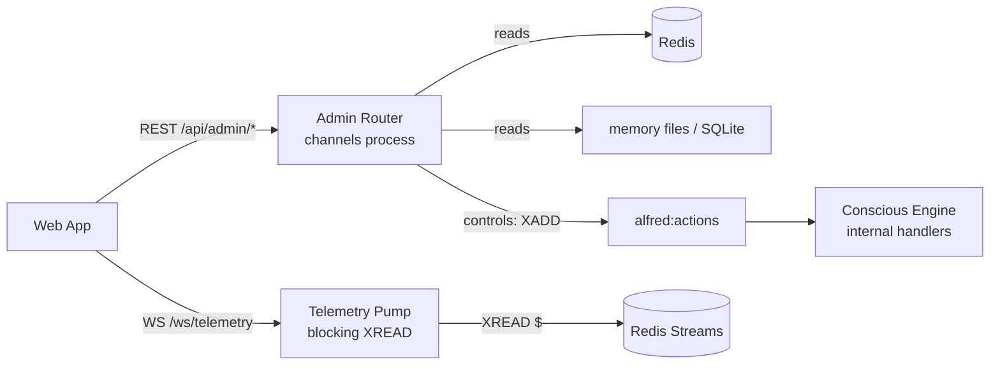

# Web App Rebuild — Step 1: Admin API + Telemetry WebSocket Implementation Plan

> **For agentic workers:** REQUIRED SUB-SKILL: Use superpowers:subagent-driven-development (recommended) or superpowers:executing-plans to implement this plan task-by-task. Steps use checkbox (`- [ ]`) syntax for tracking.

**Goal:** Give the web channel an observability surface — `/api/admin/*` REST (reads + curated controls) and `/ws/telemetry` (live Redis stream fan-out) — per the approved spec `docs/superpowers/specs/2026-06-10-web-app-rebuild-design.md`.

**Architecture:** Three new modules in the channels process (`stream_catalog.py`, `admin_api.py`, `telemetry_ws.py`) plus a shared WS cookie-auth helper (`core/identity/ws_auth.py`). All state is read from Redis/SQLite/files the system already maintains. Controls either write shared Redis state directly (DND, trigger enable, session delete) or publish `ActionRequest` to `ACTIONS_STREAM` (drain, librarian run); manual trigger fire mirrors `TriggerEngine.fire()` semantics exactly.

**Tech Stack:** FastAPI, redis.asyncio, aiosqlite, Pydantic v2, pytest with `AsyncMock` (existing patterns in `tests/core/channels/`).

**Conventions that apply to every task** (from CLAUDE.md — do not deviate):
- Stream/key constants come from `shared.streams` — never string literals.
- `AioRedis` type alias from `shared.types` — never redefine.
- Redis awaits may need `# type: ignore[misc]` (see `core/reflex/runner.py:86` precedent).
- `mypy --strict` must pass; ruff line-length 100.
- Loguru for logging in new channels code: `from loguru import logger`.
- Run commands with the venv: `.venv/bin/python -m pytest`, or `uv run pytest`.

**Verification commands (used in every task):**
```bash
uv run ruff check . --fix && uv run ruff format .
uv run mypy --strict bus/ core/ domains/ evals/ runner/ sdk/ shared/ telemetry/
uv run python -m pytest tests/core/channels/ -q
```

---

### Task 1: Stream catalog + entry decoding

The single source of truth mapping friendly stream names ↔ Redis keys, plus defensive entry decoding shared by REST and WS.

**Files:**
- Create: `core/channels/stream_catalog.py`
- Test: `tests/core/channels/test_stream_catalog.py`

- [ ] **Step 1: Write the failing tests**

```python
"""Tests for the stream catalog and entry decoding."""

from typing import Any
from unittest.mock import AsyncMock

from core.channels.stream_catalog import (
    STREAM_CATALOG,
    decode_entry,
    stream_summaries,
)
from shared.streams import EVENTS_STREAM, REFLEX_OBSERVATIONS_STREAM


def test_catalog_maps_friendly_names_to_keys() -> None:
    assert STREAM_CATALOG["events"] == EVENTS_STREAM
    assert STREAM_CATALOG["reflex_observations"] == REFLEX_OBSERVATIONS_STREAM
    assert len(STREAM_CATALOG) == 8


def test_decode_entry_parses_event_json() -> None:
    entry: dict[bytes | str, bytes | str] = {b"event": b'{"event_type": "state_changed", "x": 1}'}
    assert decode_entry(entry) == {"event_type": "state_changed", "x": 1}


def test_decode_entry_falls_back_to_raw_fields() -> None:
    entry: dict[bytes | str, bytes | str] = {b"event": b"not json", b"other": b"v"}
    assert decode_entry(entry) == {"event": "not json", "other": "v"}


async def test_stream_summaries_defensive_on_missing_stream() -> None:
    redis = AsyncMock()
    redis.xinfo_stream = AsyncMock(side_effect=Exception("no such key"))
    out: dict[str, dict[str, Any]] = await stream_summaries(redis)
    assert out["events"] == {"length": 0, "last_id": None, "last_ts": None}


async def test_stream_summaries_extracts_length_and_ts() -> None:
    redis = AsyncMock()
    redis.xinfo_stream = AsyncMock(
        return_value={"length": 42, "last-entry": (b"1718000000123-0", {b"event": b"{}"})}
    )
    out = await stream_summaries(redis)
    assert out["events"]["length"] == 42
    assert out["events"]["last_id"] == "1718000000123-0"
    assert out["events"]["last_ts"] == 1718000000.123
```

- [ ] **Step 2: Run tests to verify they fail**

Run: `uv run python -m pytest tests/core/channels/test_stream_catalog.py -v`
Expected: FAIL with `ModuleNotFoundError: No module named 'core.channels.stream_catalog'`

- [ ] **Step 3: Write the implementation**

```python
"""Stream catalog — single source of truth for admin-visible Redis streams.

Maps friendly names (used in API paths and WS subscribe messages) to the
canonical Redis stream keys from shared.streams, and provides defensive
decoding of stream entries for display.
"""

from __future__ import annotations

import json
from typing import Any

from shared.streams import (
    ACTIONS_STREAM,
    EVENTS_STREAM,
    HOME_ACTION_RESULTS_STREAM,
    HOME_STATE_STREAM,
    NOTIFICATION_DISPATCH_STREAM,
    REFLEX_OBSERVATIONS_STREAM,
    USER_REQUESTS_STREAM,
    USER_RESPONSES_STREAM,
)
from shared.types import AioRedis  # noqa: TC001

STREAM_CATALOG: dict[str, str] = {
    "events": EVENTS_STREAM,
    "actions": ACTIONS_STREAM,
    "user_requests": USER_REQUESTS_STREAM,
    "user_responses": USER_RESPONSES_STREAM,
    "reflex_observations": REFLEX_OBSERVATIONS_STREAM,
    "notifications": NOTIFICATION_DISPATCH_STREAM,
    "home_state": HOME_STATE_STREAM,
    "home_action_results": HOME_ACTION_RESULTS_STREAM,
}

KEY_TO_NAME: dict[str, str] = {v: k for k, v in STREAM_CATALOG.items()}


def _to_str(value: bytes | str) -> str:
    return value.decode() if isinstance(value, bytes) else value


def decode_entry(entry: dict[bytes | str, bytes | str]) -> dict[str, Any]:
    """Decode a stream entry. Entries carry {"event": "<json>"} — return the
    parsed event payload; fall back to raw decoded fields for anything else."""
    decoded: dict[str, Any] = {}
    for k, v in entry.items():
        key = _to_str(k)
        val = _to_str(v)
        if key == "event":
            try:
                parsed: dict[str, Any] = dict(json.loads(val))
            except (json.JSONDecodeError, TypeError, ValueError):
                decoded[key] = val
            else:
                return parsed
        else:
            decoded[key] = val
    return decoded


def _id_to_ts(entry_id: str) -> float | None:
    """Stream IDs are '<ms>-<seq>' — extract seconds since epoch."""
    try:
        return int(entry_id.split("-")[0]) / 1000.0
    except (ValueError, IndexError):
        return None


async def stream_summaries(redis: AioRedis) -> dict[str, dict[str, Any]]:
    """Length + last-entry recency for every catalog stream. Missing streams
    report zero — never raise."""
    out: dict[str, dict[str, Any]] = {}
    for name, key in STREAM_CATALOG.items():
        try:
            info: dict[str, Any] = await redis.xinfo_stream(key)  # type: ignore[misc]
            last = info.get("last-entry") or info.get(b"last-entry")
            last_id = _to_str(last[0]) if last else None
            out[name] = {
                "length": int(info.get("length") or info.get(b"length") or 0),
                "last_id": last_id,
                "last_ts": _id_to_ts(last_id) if last_id else None,
            }
        except Exception:
            out[name] = {"length": 0, "last_id": None, "last_ts": None}
    return out
```

- [ ] **Step 4: Run tests to verify they pass**

Run: `uv run python -m pytest tests/core/channels/test_stream_catalog.py -v`
Expected: 5 PASS

- [ ] **Step 5: Lint, type-check, commit**

```bash
uv run ruff check . --fix && uv run ruff format .
uv run mypy --strict bus/ core/ domains/ evals/ runner/ sdk/ shared/ telemetry/
git add core/channels/stream_catalog.py tests/core/channels/test_stream_catalog.py
git commit -m "feat(admin): stream catalog + defensive entry decoding"
```

---

### Task 2: Shared WebSocket cookie-auth helper

Extract the inline cookie gate from `/ws` so `/ws/telemetry` can reuse it (DRY).

**Files:**
- Create: `core/identity/ws_auth.py`
- Modify: `core/channels/web_server.py:283-301` (the manual cookie-parse block in the `/ws` handler)
- Test: `tests/core/identity/test_ws_auth.py`

- [ ] **Step 1: Write the failing tests**

```python
"""Tests for the shared WebSocket cookie-auth helper."""

from unittest.mock import AsyncMock, MagicMock

from core.identity.ws_auth import authenticate_ws_cookie
from shared.streams import AUTH_SESSION_PREFIX


def _ws_with_cookie(cookie_header: str) -> MagicMock:
    ws = MagicMock()
    ws.headers = {"cookie": cookie_header}
    return ws


async def test_valid_session_authenticates() -> None:
    redis = AsyncMock()
    redis.hgetall = AsyncMock(return_value={b"authenticated": b"1"})
    ws = _ws_with_cookie("alfred_auth=abc123; other=x")
    assert await authenticate_ws_cookie(ws, redis) is True
    redis.hgetall.assert_awaited_once_with(f"{AUTH_SESSION_PREFIX}abc123")


async def test_missing_cookie_rejected() -> None:
    redis = AsyncMock()
    ws = _ws_with_cookie("other=x")
    assert await authenticate_ws_cookie(ws, redis) is False
    redis.hgetall.assert_not_awaited()


async def test_unauthenticated_session_rejected() -> None:
    redis = AsyncMock()
    redis.hgetall = AsyncMock(return_value={})
    ws = _ws_with_cookie("alfred_auth=abc123")
    assert await authenticate_ws_cookie(ws, redis) is False
```

- [ ] **Step 2: Run tests to verify they fail**

Run: `uv run python -m pytest tests/core/identity/test_ws_auth.py -v`
Expected: FAIL with `ModuleNotFoundError`

- [ ] **Step 3: Write the helper**

```python
"""Shared WebSocket cookie authentication.

BaseHTTPMiddleware does not run for WebSocket upgrades, so WS endpoints
parse the auth cookie manually. This is the single implementation used by
/ws and /ws/telemetry.
"""

from __future__ import annotations

from typing import TYPE_CHECKING

from core.identity.auth_middleware import COOKIE_NAME
from shared.streams import AUTH_SESSION_PREFIX

if TYPE_CHECKING:
    from fastapi import WebSocket

    from shared.types import AioRedis


async def authenticate_ws_cookie(websocket: WebSocket, redis: AioRedis) -> bool:
    """True if the WS carries a valid, authenticated alfred_auth session cookie."""
    cookie_header: str = websocket.headers.get("cookie", "")
    session_id: str | None = None
    for raw_part in cookie_header.split(";"):
        part = raw_part.strip()
        if part.startswith(f"{COOKIE_NAME}="):
            session_id = part[len(f"{COOKIE_NAME}=") :]
            break
    if not session_id:
        return False
    data: dict[bytes, bytes] = await redis.hgetall(  # type: ignore[misc]
        f"{AUTH_SESSION_PREFIX}{session_id}"
    )
    return bool(data) and data.get(b"authenticated") == b"1"
```

- [ ] **Step 4: Refactor `/ws` in `web_server.py` to use it**

Replace the manual cookie-parse + hgetall block (lines 283-301) with:

```python
        if not await authenticate_ws_cookie(websocket, r):
            await websocket.close(code=4001, reason="Authentication required")
            return
```

Add to imports at top of `web_server.py`:

```python
from core.identity.ws_auth import authenticate_ws_cookie
```

Keep everything after the gate (accept, session assignment) unchanged.

- [ ] **Step 5: Run the full channels + identity test suites**

Run: `uv run python -m pytest tests/core/identity/ tests/core/channels/ -q`
Expected: all PASS (existing `/ws` auth-gate tests must still pass against the refactor)

- [ ] **Step 6: Lint, type-check, commit**

```bash
uv run ruff check . --fix && uv run ruff format .
uv run mypy --strict bus/ core/ domains/ evals/ runner/ sdk/ shared/ telemetry/
git add core/identity/ws_auth.py core/channels/web_server.py tests/core/identity/test_ws_auth.py
git commit -m "refactor(identity): extract shared WS cookie-auth helper"
```

---

### Task 3: Admin router scaffold, auth gating, overview endpoint

**Files:**
- Create: `core/channels/admin_api.py`
- Modify: `core/channels/web_server.py` (include router inside `create_app`, after the auth router include)
- Test: `tests/core/channels/test_admin_api.py`

**Auth model:** the router carries two dependencies — the `trusted_network_dep` passed in by `create_app` (same `require_trusted_network` used for credentials endpoints; note it allows host `"testclient"` so TestClient passes by default) and a new `require_authenticated` that reads `request.state.authenticated` set by `AuthCookieMiddleware`. The existing `web_client` fixture in `tests/core/channels/conftest.py` already provides an authenticated cookie + mocked session lookup.

- [ ] **Step 1: Write the failing tests**

```python
"""Tests for the admin API router: auth gating + overview."""

import json
from collections.abc import AsyncIterator
from typing import Any
from unittest.mock import AsyncMock, MagicMock

from fastapi import HTTPException
from fastapi.testclient import TestClient

from core.channels.web_server import create_app, require_trusted_network
from shared.streams import AUTH_SESSION_PREFIX

_SESSION = "admin-test-session"


def _aiter(items: list[Any]) -> AsyncIterator[Any]:
    async def gen() -> AsyncIterator[Any]:
        for item in items:
            yield item

    return gen()


def make_admin_client(mock_redis: AsyncMock, *, authed: bool = True) -> TestClient:
    """App with mocked redis; cookie optional to exercise the 401 path."""

    async def _fake_hgetall(key: str) -> dict[bytes, bytes]:
        if key == f"{AUTH_SESSION_PREFIX}{_SESSION}":
            return {b"authenticated": b"1"}
        return {}

    if mock_redis.hgetall._mock_side_effect is None:  # noqa: SLF001
        mock_redis.hgetall = AsyncMock(side_effect=_fake_hgetall)
    app = create_app(redis_url="redis://localhost:6379")
    app.state.redis = mock_redis
    client = TestClient(app)
    if authed:
        client.cookies.set("alfred_auth", _SESSION)
    return client


def _overview_redis() -> AsyncMock:
    r = AsyncMock()
    r.ping = AsyncMock(return_value=True)
    r.get = AsyncMock(return_value=None)
    r.hlen = AsyncMock(return_value=0)
    r.llen = AsyncMock(return_value=0)
    r.scan_iter = MagicMock(return_value=_aiter([]))
    r.xinfo_stream = AsyncMock(side_effect=Exception("missing"))
    return r


def test_admin_requires_auth_cookie() -> None:
    client = make_admin_client(_overview_redis(), authed=False)
    resp = client.get("/api/admin/overview")
    assert resp.status_code == 401


def test_admin_requires_trusted_network() -> None:
    client = make_admin_client(_overview_redis())

    def _reject() -> None:
        raise HTTPException(status_code=403, detail="untrusted")

    client.app.dependency_overrides[require_trusted_network] = _reject  # type: ignore[attr-defined]
    resp = client.get("/api/admin/overview")
    assert resp.status_code == 403


def test_overview_shape() -> None:
    r = _overview_redis()
    r.get = AsyncMock(
        side_effect=lambda key: (
            json.dumps({"date": "2026-06-10", "spend_usd": 1.24, "cap_usd": 5.0}).encode()
            if key == "alfred:cost:daily"
            else None
        )
    )
    client = make_admin_client(r)
    # No httpx client on app.state → inference checks report False, not errors.
    resp = client.get("/api/admin/overview")
    assert resp.status_code == 200
    data = resp.json()
    assert data["redis"]["connected"] is True
    assert data["cost"]["spend_usd"] == 1.24
    assert data["dnd"] == {"active": False}
    assert data["counts"] == {"sessions": 0, "devices": 0, "deferred": 0, "triggers": 0}
    assert data["streams"]["events"]["length"] == 0
    assert data["inference"] == {"ollama": False, "lmstudio": False}


def test_overview_reports_redis_down() -> None:
    r = _overview_redis()
    r.ping = AsyncMock(side_effect=ConnectionError("down"))
    client = make_admin_client(r)
    resp = client.get("/api/admin/overview")
    assert resp.status_code == 200
    assert resp.json()["redis"]["connected"] is False
```

- [ ] **Step 2: Run tests to verify they fail**

Run: `uv run python -m pytest tests/core/channels/test_admin_api.py -v`
Expected: FAIL — `/api/admin/overview` returns 404 (router doesn't exist)

- [ ] **Step 3: Write `admin_api.py` scaffold + overview**

```python
"""Admin API — read-only observability + curated controls for the web app.

All endpoints require BOTH an authenticated session cookie and a trusted
network (localhost/Tailscale), mirroring the credentials endpoints.

Reads are defensive: missing keys/streams/files yield empty results, never 500s.
Controls map to operations the system already performs — direct Redis writes
for shared state, ACTIONS_STREAM publishes for process-owned behavior.
"""

from __future__ import annotations

import json
import os
from typing import Any, Callable

import httpx
from fastapi import APIRouter, Depends, HTTPException, Request
from loguru import logger

from core.channels.stream_catalog import STREAM_CATALOG, decode_entry, stream_summaries
from shared.streams import (
    COST_DAILY_KEY,
    DEFERRED_NOTIFICATIONS_KEY,
    DEVICE_TOKENS_KEY,
    DND_STATE_KEY,
    SESSIONS_KEY_PREFIX,
    TRIGGERS_KEY,
)
from shared.types import AioRedis

_OLLAMA_DEFAULT = "http://localhost:11434"
_LMSTUDIO_DEFAULT = "http://localhost:1234"


async def require_authenticated(request: Request) -> None:
    """401 unless AuthCookieMiddleware marked this request authenticated."""
    if not getattr(request.state, "authenticated", False):
        raise HTTPException(status_code=401, detail="Authentication required")


def _redis(request: Request) -> AioRedis:
    r: AioRedis = request.app.state.redis
    return r


async def _check_http(request: Request, url: str) -> bool:
    """Probe a local inference server via the lifespan-owned httpx client.

    No lazy creation: when the client is absent (tests don't run the lifespan),
    report False deterministically — never open real connections from a test.
    """
    client: httpx.AsyncClient | None = getattr(request.app.state, "http", None)
    if client is None:
        return False
    try:
        resp = await client.get(url)
        return bool(resp.status_code < 500)
    except Exception:
        return False


def create_admin_router(trusted_network_dep: Callable[..., Any]) -> APIRouter:
    router = APIRouter(
        prefix="/api/admin",
        dependencies=[Depends(trusted_network_dep), Depends(require_authenticated)],
    )

    @router.get("/overview")
    async def overview(request: Request) -> dict[str, Any]:
        r = _redis(request)
        out: dict[str, Any] = {"redis": {"connected": True}}
        try:
            await r.ping()  # type: ignore[misc]
        except Exception:
            out["redis"]["connected"] = False
            return out

        raw_cost = await r.get(COST_DAILY_KEY)
        out["cost"] = json.loads(raw_cost) if raw_cost else None
        raw_dnd = await r.get(DND_STATE_KEY)
        out["dnd"] = json.loads(raw_dnd) if raw_dnd else {"active": False}

        session_count = 0
        async for _ in r.scan_iter(match=f"{SESSIONS_KEY_PREFIX}*"):
            session_count += 1
        out["counts"] = {
            "sessions": session_count,
            "devices": int(await r.hlen(DEVICE_TOKENS_KEY)),  # type: ignore[misc]
            "deferred": int(await r.llen(DEFERRED_NOTIFICATIONS_KEY)),  # type: ignore[misc]
            "triggers": int(await r.hlen(TRIGGERS_KEY)),  # type: ignore[misc]
        }
        out["streams"] = await stream_summaries(r)
        out["inference"] = {
            "ollama": await _check_http(
                request, os.getenv("OLLAMA_HOST", _OLLAMA_DEFAULT) + "/api/tags"
            ),
            "lmstudio": await _check_http(
                request, os.getenv("LMSTUDIO_HOST", _LMSTUDIO_DEFAULT) + "/v1/models"
            ),
        }
        return out

    return router
```

(Note: `decode_entry` import is used by Task 4 endpoints in this same module; if ruff flags it as unused at this step, add it in Task 4 instead.)

- [ ] **Step 4: Wire into `create_app` and `_lifespan`**

In `core/channels/web_server.py`, include the router in the app factory body (it has no lifespan deps), BEFORE the static mount:

```python
from core.channels.admin_api import create_admin_router

# inside create_app():
app.include_router(create_admin_router(require_trusted_network))
```

(The static `app.mount("/", ...)` must remain LAST — it is a catch-all.)

In `_lifespan`, create/close the long-lived httpx client the inference probes use (per CLAUDE.md: `httpx.AsyncClient` must be long-lived, never per-request):

```python
# startup (next to the redis pool creation):
app.state.http = httpx.AsyncClient(timeout=2.0)

# shutdown (in the teardown section):
await app.state.http.aclose()
```

- [ ] **Step 5: Run tests to verify they pass**

Run: `uv run python -m pytest tests/core/channels/test_admin_api.py -v`
Expected: 4 PASS

- [ ] **Step 6: Lint, type-check, full channels suite, commit**

```bash
uv run ruff check . --fix && uv run ruff format .
uv run mypy --strict bus/ core/ domains/ evals/ runner/ sdk/ shared/ telemetry/
uv run python -m pytest tests/core/channels/ -q
git add core/channels/admin_api.py core/channels/web_server.py tests/core/channels/test_admin_api.py
git commit -m "feat(admin): admin router with auth gating + system overview"
```

---

### Task 4: Stream history endpoints

**Files:**
- Modify: `core/channels/admin_api.py` (add endpoints inside `create_admin_router`)
- Test: `tests/core/channels/test_admin_api.py` (append)

- [ ] **Step 1: Write the failing tests** (append to test file)

```python
def test_streams_list() -> None:
    client = make_admin_client(_overview_redis())
    resp = client.get("/api/admin/streams")
    assert resp.status_code == 200
    assert "events" in resp.json()


def test_stream_history_unknown_name_404() -> None:
    client = make_admin_client(_overview_redis())
    assert client.get("/api/admin/streams/nope").status_code == 404


def test_stream_history_paginates() -> None:
    r = _overview_redis()
    r.xrevrange = AsyncMock(
        return_value=[
            (b"2-0", {b"event": b'{"event_type": "state_changed"}'}),
            (b"1-0", {b"event": b'{"event_type": "trigger_fired"}'}),
        ]
    )
    client = make_admin_client(r)
    resp = client.get("/api/admin/streams/events?count=2")
    assert resp.status_code == 200
    body = resp.json()
    assert body["entries"][0] == {"id": "2-0", "event": {"event_type": "state_changed"}}
    assert body["next_before"] == "1-0"
    r.xrevrange.assert_awaited_once_with("alfred:events", max="+", min="-", count=2)


def test_stream_history_before_is_exclusive() -> None:
    r = _overview_redis()
    r.xrevrange = AsyncMock(return_value=[])
    client = make_admin_client(r)
    resp = client.get("/api/admin/streams/events?count=5&before=2-0")
    assert resp.status_code == 200
    assert resp.json() == {"entries": [], "next_before": None}
    r.xrevrange.assert_awaited_once_with("alfred:events", max="(2-0", min="-", count=5)
```

- [ ] **Step 2: Run to verify failure**

Run: `uv run python -m pytest tests/core/channels/test_admin_api.py -v -k stream`
Expected: 404s where routes are missing → FAIL

- [ ] **Step 3: Implement** (inside `create_admin_router`, after `overview`)

```python
    @router.get("/streams")
    async def streams(request: Request) -> dict[str, Any]:
        return await stream_summaries(_redis(request))

    @router.get("/streams/{name}")
    async def stream_history(
        request: Request, name: str, count: int = 50, before: str | None = None
    ) -> dict[str, Any]:
        key = STREAM_CATALOG.get(name)
        if key is None:
            raise HTTPException(status_code=404, detail=f"Unknown stream '{name}'")
        count = max(1, min(count, 200))
        max_id = f"({before}" if before else "+"
        raw: list[tuple[bytes | str, dict[bytes | str, bytes | str]]] = await _redis(
            request
        ).xrevrange(key, max=max_id, min="-", count=count)  # type: ignore[misc]
        entries = [
            {"id": eid.decode() if isinstance(eid, bytes) else eid, "event": decode_entry(data)}
            for eid, data in raw
        ]
        next_before = entries[-1]["id"] if len(entries) == count else None
        return {"entries": entries, "next_before": next_before}
```

- [ ] **Step 4: Run tests**

Run: `uv run python -m pytest tests/core/channels/test_admin_api.py -q`
Expected: all PASS

- [ ] **Step 5: Lint, type-check, commit**

```bash
uv run ruff check . --fix && uv run ruff format .
uv run mypy --strict bus/ core/ domains/ evals/ runner/ sdk/ shared/ telemetry/
git add core/channels/admin_api.py tests/core/channels/test_admin_api.py
git commit -m "feat(admin): paginated stream history endpoints"
```

---

### Task 5: Memory read endpoints

Episodic (recent listing via direct reads; semantic search via lazily-built `EpisodicMemory`), semantic Markdown, routines, scratchpad.

**Files:**
- Modify: `core/channels/admin_api.py`
- Test: `tests/core/channels/test_admin_api.py` (append)

**Key facts:**
- Hot entries are Redis hashes `ctx:<id>` with fields `content, semantic_key, type, source, entities, timestamp, significance, retrieval_count, last_retrieved, compressed` plus binary `embedding_content`/`embedding_semantic` (must be excluded).
- Cold entries: SQLite `core/memory/episodic_cold.db`, table `episodic_entries` (columns `id, timestamp, source, summary, entities, valence, significance, semantic_key, compressed_into`).
- Memory dir from this module: `Path(__file__).resolve().parent.parent / "memory"` (i.e. `core/memory/`).
- The embedder (`SentenceTransformerProvider`) blocks on first load — lazy module-level singleton with `_FAILED` sentinel, mirroring `web_server.py`'s lazy STT/TTS pattern. Vector search only happens when `q` is provided.
- `RoutineStore(routines_dir=...)` + `.list_all()` returns `RoutineSpec` models.
- Preference/profile dirs may contain a `.example/` subdir — skip names starting with `.`.

- [ ] **Step 1: Write the failing tests** (append)

```python
def test_memory_episodic_recent_lists_hot_and_cold(tmp_path: Any, monkeypatch: Any) -> None:
    r = _overview_redis()
    r.scan_iter = MagicMock(return_value=_aiter([b"ctx:abc"]))

    # hgetall serves BOTH the auth middleware (session key) and the ctx hash —
    # route by key, otherwise the request 401s before reaching the endpoint.
    async def _hgetall(key: Any) -> dict[bytes, bytes]:
        key_str = key.decode() if isinstance(key, bytes) else key
        if key_str == f"{AUTH_SESSION_PREFIX}{_SESSION}":
            return {b"authenticated": b"1"}
        return {
            b"content": b"User asked about lights",
            b"type": b"episodic",
            b"source": b"conversation",
            b"timestamp": b"1718000000.0",
            b"significance": b"0.72",
            b"embedding_content": b"\x00\x01",
        }

    r.hgetall = AsyncMock(side_effect=_hgetall)
    import core.channels.admin_api as admin_api

    monkeypatch.setattr(admin_api, "_MEMORY_DIR", tmp_path)  # no cold DB present
    client = make_admin_client(r)
    resp = client.get("/api/admin/memory/episodic")
    assert resp.status_code == 200
    items = resp.json()["entries"]
    assert items[0]["store"] == "hot"
    assert items[0]["content"] == "User asked about lights"
    assert "embedding_content" not in items[0]


def test_memory_semantic_lists_markdown(tmp_path: Any, monkeypatch: Any) -> None:
    import core.channels.admin_api as admin_api

    prefs = tmp_path / "preferences"
    prefs.mkdir()
    (prefs / "lighting.md").write_text("# Lighting\n- warm")
    (tmp_path / "profile").mkdir()
    monkeypatch.setattr(admin_api, "_MEMORY_DIR", tmp_path)
    client = make_admin_client(_overview_redis())
    resp = client.get("/api/admin/memory/semantic")
    assert resp.status_code == 200
    files = resp.json()["files"]
    assert files == [
        {"name": "lighting.md", "dir": "preferences", "content": "# Lighting\n- warm",
         "modified": files[0]["modified"]},
    ]


def test_memory_scratchpad(tmp_path: Any, monkeypatch: Any) -> None:
    import core.channels.admin_api as admin_api

    (tmp_path / "scratchpad.md").write_text("obs 1\n")
    monkeypatch.setattr(admin_api, "_MEMORY_DIR", tmp_path)
    r = _overview_redis()
    r.llen = AsyncMock(return_value=3)
    client = make_admin_client(r)
    resp = client.get("/api/admin/memory/scratchpad")
    assert resp.json() == {"content": "obs 1\n", "pending_queue": 3}


def test_memory_routines_empty_dir(tmp_path: Any, monkeypatch: Any) -> None:
    import core.channels.admin_api as admin_api

    monkeypatch.setattr(admin_api, "_MEMORY_DIR", tmp_path)
    client = make_admin_client(_overview_redis())
    resp = client.get("/api/admin/memory/routines")
    assert resp.status_code == 200
    assert resp.json() == {"routines": []}
```

- [ ] **Step 2: Run to verify failure**

Run: `uv run python -m pytest tests/core/channels/test_admin_api.py -v -k memory`
Expected: FAIL (404)

- [ ] **Step 3: Implement** — module-level additions in `admin_api.py`:

```python
from datetime import UTC, datetime
from pathlib import Path

import aiosqlite

_MEMORY_DIR = Path(__file__).resolve().parent.parent / "memory"
_FAILED = object()
_episodic_memory: Any = None


def _get_episodic_lazy(redis: AioRedis) -> Any | None:
    """Build EpisodicMemory once; heavy embedder loads on first search."""
    global _episodic_memory
    if _episodic_memory is _FAILED:
        return None
    if _episodic_memory is None:
        try:
            from core.memory.embedding_provider import SentenceTransformerProvider
            from core.memory.episodic.memory import EpisodicMemory
            from core.memory.redis_vector_store import RedisVectorStore
            from core.memory.sqlite_vec_store import SqliteVecStore
            from shared.config import AlfredConfig

            config = AlfredConfig.from_env()
            _episodic_memory = EpisodicMemory(
                hot=RedisVectorStore(redis=redis, dim=config.embedding_dim),
                cold=SqliteVecStore(
                    db_path=str(_MEMORY_DIR / "episodic_cold.db"), dim=config.embedding_dim
                ),
                embedder=SentenceTransformerProvider(config.embedding_model),
            )
        except Exception as exc:
            logger.error("EpisodicMemory unavailable for admin search: {}", exc)
            _episodic_memory = _FAILED
            return None
    return _episodic_memory


def _decode_hash(fields: dict[bytes | str, Any]) -> dict[str, Any]:
    """Decode a Redis hash, dropping binary embedding fields."""
    out: dict[str, Any] = {}
    for k, v in fields.items():
        key = k.decode() if isinstance(k, bytes) else k
        if key.startswith("embedding"):
            continue
        out[key] = v.decode(errors="replace") if isinstance(v, bytes) else v
    return out
```

Endpoints (inside `create_admin_router`):

```python
    @router.get("/memory/episodic")
    async def memory_episodic(
        request: Request, q: str | None = None, limit: int = 30
    ) -> dict[str, Any]:
        r = _redis(request)
        limit = max(1, min(limit, 100))

        if q:
            memory = _get_episodic_lazy(r)
            if memory is None:
                raise HTTPException(status_code=503, detail="Vector search unavailable")
            results = await memory.recall(query=q, limit=limit)
            return {
                "entries": [
                    {"store": res.source_store, "score": res.score,
                     **res.entry.model_dump(mode="json")}
                    for res in results
                ]
            }

        from shared.streams import CONTEXT_PREFIX

        hot: list[dict[str, Any]] = []
        async for key in r.scan_iter(match=f"{CONTEXT_PREFIX}*", count=500):
            fields = await r.hgetall(key)  # type: ignore[misc]
            entry = _decode_hash(fields)
            entry["store"] = "hot"
            hot.append(entry)
        hot.sort(key=lambda e: float(e.get("timestamp", 0) or 0), reverse=True)

        cold: list[dict[str, Any]] = []
        db_path = _MEMORY_DIR / "episodic_cold.db"
        if db_path.exists():
            try:
                async with aiosqlite.connect(db_path) as conn:
                    conn.row_factory = aiosqlite.Row
                    async with conn.execute(
                        "SELECT id, timestamp, source, summary, entities, valence,"
                        " significance, semantic_key FROM episodic_entries"
                        " ORDER BY timestamp DESC LIMIT ?",
                        (limit,),
                    ) as cur:
                        cold = [dict(row) | {"store": "cold"} for row in await cur.fetchall()]
            except Exception as exc:
                logger.warning("Cold store read failed: {}", exc)

        return {"entries": hot[:limit] + cold}

    @router.get("/memory/semantic")
    async def memory_semantic() -> dict[str, Any]:
        files: list[dict[str, Any]] = []
        for dirname in ("preferences", "profile"):
            directory = _MEMORY_DIR / dirname
            if not directory.is_dir():
                continue
            for path in sorted(directory.glob("*.md")):
                if path.name.startswith("."):
                    continue
                files.append(
                    {
                        "name": path.name,
                        "dir": dirname,
                        "content": path.read_text(),
                        "modified": datetime.fromtimestamp(
                            path.stat().st_mtime, tz=UTC
                        ).isoformat(),
                    }
                )
        return {"files": files}

    @router.get("/memory/routines")
    async def memory_routines() -> dict[str, Any]:
        from core.memory.routines.store import RoutineStore

        store = RoutineStore(routines_dir=str(_MEMORY_DIR / "routines"))
        return {"routines": [r.model_dump(mode="json") for r in store.list_all()]}

    @router.get("/memory/scratchpad")
    async def memory_scratchpad(request: Request) -> dict[str, Any]:
        from shared.streams import SCRATCHPAD_QUEUE

        path = _MEMORY_DIR / "scratchpad.md"
        content = path.read_text() if path.exists() else ""
        pending = int(await _redis(request).llen(SCRATCHPAD_QUEUE))  # type: ignore[misc]
        return {"content": content, "pending_queue": pending}
```

- [ ] **Step 4: Run tests**

Run: `uv run python -m pytest tests/core/channels/test_admin_api.py -q`
Expected: all PASS

- [ ] **Step 5: Lint, type-check, commit**

```bash
uv run ruff check . --fix && uv run ruff format .
uv run mypy --strict bus/ core/ domains/ evals/ runner/ sdk/ shared/ telemetry/
git add core/channels/admin_api.py tests/core/channels/test_admin_api.py
git commit -m "feat(admin): memory read endpoints (episodic, semantic, routines, scratchpad)"
```

---

### Task 6: Triggers, notifications, sessions, devices read endpoints

**Files:**
- Modify: `core/channels/admin_api.py`
- Test: `tests/core/channels/test_admin_api.py` (append)

**Key facts:** triggers live in Redis hash `alfred:triggers` as `{trigger_id: BaseTrigger JSON}` — parse as plain dicts (no TriggerRegistry import; the admin view must not depend on type registration). Deferred notifications: Redis list of `Notification` JSON. Sessions: hashes `alfred:sessions:<id>` with `channel`, `history` (JSON array), `created_at`; TTL = remaining lifetime. Devices: hash `alfred:push:devices` `{token: {"platform","identity","registered_at"} JSON}`.

- [ ] **Step 1: Write the failing tests** (append)

```python
def test_triggers_list() -> None:
    r = _overview_redis()
    r.hgetall = AsyncMock(
        return_value={
            b"t1": json.dumps(
                {"trigger_id": "t1", "name": "sunset", "trigger_type": "time",
                 "enabled": True, "created_at": "2026-06-01T00:00:00+00:00"}
            ).encode()
        }
    )
    client = make_admin_client(r)
    # NOTE: hgetall is also used by auth middleware — route it by key.
    resp = client.get("/api/admin/triggers")
    assert resp.status_code == 200
    assert resp.json()["triggers"][0]["name"] == "sunset"


def test_deferred_notifications() -> None:
    r = _overview_redis()
    r.lrange = AsyncMock(
        return_value=[json.dumps({"notification_id": "n1", "title": "Hi"}).encode()]
    )
    client = make_admin_client(r)
    resp = client.get("/api/admin/notifications/deferred")
    assert resp.json()["notifications"][0]["title"] == "Hi"


def test_sessions_list() -> None:
    r = _overview_redis()
    r.scan_iter = MagicMock(return_value=_aiter([b"alfred:sessions:s1"]))
    r.ttl = AsyncMock(return_value=1200)
    client = make_admin_client(r)
    resp = client.get("/api/admin/sessions")
    body = resp.json()["sessions"]
    assert body[0]["session_id"] == "s1"
    assert body[0]["ttl_seconds"] == 1200


def test_devices_list() -> None:
    r = _overview_redis()
    r.hgetall = AsyncMock(
        return_value={
            b"tok1": json.dumps({"platform": "ios", "identity": "sir"}).encode()
        }
    )
    client = make_admin_client(r)
    resp = client.get("/api/admin/devices")
    assert resp.json()["devices"][0]["platform"] == "ios"
```

**Important test detail:** `make_admin_client` installs an auth-session `hgetall` side effect. For tests that mock `hgetall` for data, set the mock BEFORE calling `make_admin_client` with a side effect that answers BOTH the auth key and the data key:

```python
# Replace the bare AsyncMock(return_value=...) in the triggers/devices tests with:
async def _hgetall(key: str) -> dict[bytes, bytes]:
    if key == f"{AUTH_SESSION_PREFIX}{_SESSION}":
        return {b"authenticated": b"1"}
    return {b"t1": json.dumps({...}).encode()}  # the test's data

r.hgetall = AsyncMock(side_effect=_hgetall)
```

(`make_admin_client` already skips reinstalling when a side effect is present.)

- [ ] **Step 2: Run to verify failure**

Run: `uv run python -m pytest tests/core/channels/test_admin_api.py -v -k "triggers or deferred or sessions or devices"`
Expected: FAIL (404)

- [ ] **Step 3: Implement** (inside `create_admin_router`)

```python
    @router.get("/triggers")
    async def triggers(request: Request) -> dict[str, Any]:
        raw: dict[bytes | str, bytes | str] = await _redis(request).hgetall(  # type: ignore[misc]
            TRIGGERS_KEY
        )
        items: list[dict[str, Any]] = []
        for _tid, value in raw.items():
            val = value.decode() if isinstance(value, bytes) else value
            try:
                items.append(dict(json.loads(val)))
            except (json.JSONDecodeError, ValueError):
                continue
        items.sort(key=lambda t: str(t.get("created_at", "")), reverse=True)
        return {"triggers": items}

    @router.get("/notifications/deferred")
    async def deferred_notifications(request: Request) -> dict[str, Any]:
        raw_list: list[bytes | str] = await _redis(request).lrange(  # type: ignore[misc]
            DEFERRED_NOTIFICATIONS_KEY, 0, -1
        )
        out: list[dict[str, Any]] = []
        for item in raw_list:
            val = item.decode() if isinstance(item, bytes) else item
            try:
                out.append(dict(json.loads(val)))
            except (json.JSONDecodeError, ValueError):
                continue
        return {"notifications": out}

    @router.get("/sessions")
    async def sessions(request: Request) -> dict[str, Any]:
        r = _redis(request)
        out: list[dict[str, Any]] = []
        async for key in r.scan_iter(match=f"{SESSIONS_KEY_PREFIX}*"):
            key_str = key.decode() if isinstance(key, bytes) else key
            data = _decode_hash(await r.hgetall(key_str))  # type: ignore[misc]
            history = data.get("history") or "[]"
            try:
                turns = len(json.loads(history))
            except (json.JSONDecodeError, ValueError):
                turns = 0
            out.append(
                {
                    "session_id": key_str.removeprefix(SESSIONS_KEY_PREFIX),
                    "channel": data.get("channel", "unknown"),
                    "created_at": data.get("created_at"),
                    "turns": turns,
                    "ttl_seconds": int(await r.ttl(key_str)),  # type: ignore[misc]
                }
            )
        return {"sessions": out}

    @router.get("/devices")
    async def devices(request: Request) -> dict[str, Any]:
        raw_devices: dict[bytes | str, bytes | str] = await _redis(request).hgetall(  # type: ignore[misc]
            DEVICE_TOKENS_KEY
        )
        out: list[dict[str, Any]] = []
        for token, value in raw_devices.items():
            tok = token.decode() if isinstance(token, bytes) else token
            val = value.decode() if isinstance(value, bytes) else value
            try:
                out.append({"device_token": tok, **json.loads(val)})
            except (json.JSONDecodeError, ValueError):
                out.append({"device_token": tok})
        return {"devices": out}
```

- [ ] **Step 4: Run tests, lint, type-check, commit**

```bash
uv run python -m pytest tests/core/channels/test_admin_api.py -q
uv run ruff check . --fix && uv run ruff format .
uv run mypy --strict bus/ core/ domains/ evals/ runner/ sdk/ shared/ telemetry/
git add core/channels/admin_api.py tests/core/channels/test_admin_api.py
git commit -m "feat(admin): triggers/notifications/sessions/devices read endpoints"
```

---

### Task 7: Controls

DND set/clear, drain deferred, run Librarian (new internal action), trigger fire/enable, session delete.

**Files:**
- Modify: `core/channels/admin_api.py`
- Modify: `core/conscious/__main__.py` (register `run_librarian` handler)
- Test: `tests/core/channels/test_admin_api.py` (append), `tests/core/conscious/test_internal_actions.py` (or create if absent)

**Semantics locked during design:**
- DND active → `SET alfred:memory:dnd` with exactly `{"active": true, "until": <iso|null>, "reason": <str|null>, "source": "manual"}` (the shape `DNDChecker._check_manual` reads, `core/notifications/dnd.py:50-79`). DND off → `DELETE` the key.
- Drain + Librarian → `ActionRequest(source="admin-api", target_service="conscious-engine", tool_name=...)` published as `{"event": <json>}` to `ACTIONS_STREAM` — the consumer in `core/conscious/__main__.py:67-122` dispatches by `tool_name`.
- Trigger enable/disable → rewrite the JSON value in the `alfred:triggers` hash. The triggers process serves `list_all()` from an in-memory cache refreshed from Redis by a 60s background loop (`TriggerStore.refresh()` docstring, `core/triggers/store.py:80-89`) — takes effect within a minute. Return `"effective_within_seconds": 60` so the UI can say so.
- Manual fire → mirror `TriggerEngine.fire()` (`core/triggers/engine.py:28-63`): action set → `ActionRequest` to `ACTIONS_STREAM`; no action → `TriggerFired` to `EVENTS_STREAM`; scratchpad observation; one-shot → `HDEL`, else update `last_fired` in the hash.

- [ ] **Step 1: Write the failing tests** (append; reuse `_hgetall` routing pattern from Task 6)

```python
def test_dnd_set_and_clear() -> None:
    r = _overview_redis()
    r.set = AsyncMock()
    r.delete = AsyncMock()
    client = make_admin_client(r)

    resp = client.post("/api/admin/dnd", json={"active": True, "reason": "focus"})
    assert resp.status_code == 200
    key, payload = r.set.await_args.args
    assert key == "alfred:memory:dnd"
    assert json.loads(payload) == {
        "active": True, "until": None, "reason": "focus", "source": "manual",
    }

    resp = client.post("/api/admin/dnd", json={"active": False})
    assert resp.json() == {"active": False}
    r.delete.assert_awaited_once_with("alfred:memory:dnd")


def test_drain_and_librarian_publish_actions() -> None:
    r = _overview_redis()
    r.xadd = AsyncMock()
    client = make_admin_client(r)

    assert client.post("/api/admin/notifications/drain").json() == {"status": "queued"}
    assert client.post("/api/admin/librarian/run").json() == {"status": "queued"}

    calls = r.xadd.await_args_list
    assert calls[0].args[0] == "alfred:actions"
    drained = json.loads(calls[0].args[1]["event"])
    assert drained["tool_name"] == "drain_deferred_notifications"
    assert drained["target_service"] == "conscious-engine"
    librarian = json.loads(calls[1].args[1]["event"])
    assert librarian["tool_name"] == "run_librarian"


def test_trigger_enable_writes_hash() -> None:
    trigger = {"trigger_id": "t1", "name": "sunset", "trigger_type": "time", "enabled": True}
    r = _overview_redis()
    r.hget = AsyncMock(return_value=json.dumps(trigger).encode())
    r.hset = AsyncMock()
    client = make_admin_client(r)
    resp = client.post("/api/admin/triggers/t1/enabled", json={"enabled": False})
    assert resp.status_code == 200
    assert resp.json()["effective_within_seconds"] == 60
    _, _tid, payload = r.hset.await_args.args
    assert json.loads(payload)["enabled"] is False


def test_trigger_fire_with_action_publishes_action_request() -> None:
    trigger = {
        "trigger_id": "t1", "name": "sunset", "trigger_type": "time", "enabled": True,
        "one_shot": False,
        "action": {"tool_name": "dim_lights", "target_service": "home-service",
                   "parameters": {"level": 30}},
    }
    r = _overview_redis()
    r.hget = AsyncMock(return_value=json.dumps(trigger).encode())
    r.hset = AsyncMock()
    r.xadd = AsyncMock()
    r.lpush = AsyncMock()
    client = make_admin_client(r)
    resp = client.post("/api/admin/triggers/t1/fire")
    assert resp.json()["fired"] is True
    stream, payload = r.xadd.await_args.args
    assert stream == "alfred:actions"
    action = json.loads(payload["event"])
    assert action["tool_name"] == "dim_lights"
    assert action["parameters"] == {"level": 30}
    # last_fired persisted (not one-shot)
    assert "last_fired" in json.loads(r.hset.await_args.args[2])


def test_trigger_fire_unknown_404() -> None:
    r = _overview_redis()
    r.hget = AsyncMock(return_value=None)
    client = make_admin_client(r)
    assert client.post("/api/admin/triggers/nope/fire").status_code == 404


def test_session_delete() -> None:
    r = _overview_redis()
    r.delete = AsyncMock(return_value=1)
    client = make_admin_client(r)
    resp = client.delete("/api/admin/sessions/s1")
    assert resp.json() == {"deleted": True}
    r.delete.assert_awaited_once_with("alfred:sessions:s1")
```

- [ ] **Step 2: Run to verify failure**

Run: `uv run python -m pytest tests/core/channels/test_admin_api.py -v -k "dnd or drain or trigger_enable or trigger_fire or session_delete"`
Expected: FAIL (404/405)

- [ ] **Step 3: Implement controls** (in `admin_api.py`)

Module-level additions:

```python
from pydantic import BaseModel

from bus.schemas.events import ActionRequest, TriggerFired
from shared.streams import ACTIONS_STREAM, EVENTS_STREAM, SCRATCHPAD_QUEUE


class DndRequest(BaseModel):
    active: bool
    until: datetime | None = None
    reason: str | None = None


class TriggerEnabledRequest(BaseModel):
    enabled: bool


async def _publish_internal_action(redis: AioRedis, tool_name: str) -> None:
    action = ActionRequest(
        source="admin-api", target_service="conscious-engine", tool_name=tool_name
    )
    await redis.xadd(ACTIONS_STREAM, {"event": action.model_dump_json()})  # type: ignore[misc]
```

Endpoints (inside `create_admin_router`):

```python
    @router.post("/dnd")
    async def set_dnd(request: Request, body: DndRequest) -> dict[str, Any]:
        r = _redis(request)
        if not body.active:
            await r.delete(DND_STATE_KEY)
            return {"active": False}
        state = {
            "active": True,
            "until": body.until.isoformat() if body.until else None,
            "reason": body.reason,
            "source": "manual",
        }
        await r.set(DND_STATE_KEY, json.dumps(state))
        return state

    @router.post("/notifications/drain")
    async def drain_notifications(request: Request) -> dict[str, str]:
        await _publish_internal_action(_redis(request), "drain_deferred_notifications")
        return {"status": "queued"}

    @router.post("/librarian/run")
    async def run_librarian(request: Request) -> dict[str, str]:
        await _publish_internal_action(_redis(request), "run_librarian")
        return {"status": "queued"}

    @router.post("/triggers/{trigger_id}/enabled")
    async def set_trigger_enabled(
        request: Request, trigger_id: str, body: TriggerEnabledRequest
    ) -> dict[str, Any]:
        r = _redis(request)
        raw = await r.hget(TRIGGERS_KEY, trigger_id)  # type: ignore[misc]
        if raw is None:
            raise HTTPException(status_code=404, detail=f"Unknown trigger '{trigger_id}'")
        data = dict(json.loads(raw.decode() if isinstance(raw, bytes) else raw))
        data["enabled"] = body.enabled
        await r.hset(TRIGGERS_KEY, trigger_id, json.dumps(data))  # type: ignore[misc]
        # Triggers process re-syncs its cache from Redis every 60s.
        return {"trigger_id": trigger_id, "enabled": body.enabled,
                "effective_within_seconds": 60}

    @router.post("/triggers/{trigger_id}/fire")
    async def fire_trigger(request: Request, trigger_id: str) -> dict[str, Any]:
        r = _redis(request)
        raw = await r.hget(TRIGGERS_KEY, trigger_id)  # type: ignore[misc]
        if raw is None:
            raise HTTPException(status_code=404, detail=f"Unknown trigger '{trigger_id}'")
        data = dict(json.loads(raw.decode() if isinstance(raw, bytes) else raw))
        now = datetime.now(UTC)

        # Mirrors TriggerEngine.fire() — core/triggers/engine.py:28-63.
        action_payload = data.get("action")
        if action_payload:
            action = ActionRequest(
                source="admin-api",
                target_service=action_payload["target_service"],
                tool_name=action_payload["tool_name"],
                parameters=action_payload.get("parameters", {}),
            )
            await r.xadd(ACTIONS_STREAM, {"event": action.model_dump_json()})  # type: ignore[misc]
        else:
            fired = TriggerFired(
                trigger_id=trigger_id,
                trigger_name=str(data.get("name", "")),
                trigger_type=str(data.get("trigger_type", "")),
                context={"manual_fire": True, "evaluated_at": now.isoformat()},
                urgency=data.get("urgency", "informational"),
            )
            await r.xadd(EVENTS_STREAM, {"event": fired.model_dump_json()})  # type: ignore[misc]

        observation = (
            f"{now.strftime('%Y-%m-%dT%H:%M:%SZ')} "
            f"[admin] trigger {data.get('name', trigger_id)} fired manually"
        )
        await r.lpush(SCRATCHPAD_QUEUE, observation)  # type: ignore[misc]

        if data.get("one_shot"):
            await r.hdel(TRIGGERS_KEY, trigger_id)  # type: ignore[misc]
        else:
            data["last_fired"] = now.isoformat()
            await r.hset(TRIGGERS_KEY, trigger_id, json.dumps(data))  # type: ignore[misc]
        return {"fired": True, "trigger_id": trigger_id}

    @router.delete("/sessions/{session_id}")
    async def delete_session(request: Request, session_id: str) -> dict[str, bool]:
        deleted = await _redis(request).delete(f"{SESSIONS_KEY_PREFIX}{session_id}")
        return {"deleted": bool(deleted)}
```

- [ ] **Step 4: Register the `run_librarian` handler in the conscious process**

In `core/conscious/__main__.py`, inside the `if episodic_memory is not None:` block, AFTER `librarian_task = asyncio.create_task(librarian_scheduler.run())` (line ~286), add:

```python
            async def _run_librarian_now() -> None:
                summary = await librarian.consolidate()
                log.info("Manual Librarian run complete: {}", summary)

            _INTERNAL_HANDLERS["run_librarian"] = _run_librarian_now
```

(A manual run can overlap a scheduled run; the scratchpad drain uses an atomic RENAME so the overlap is safe — second run sees an empty scratchpad.)

- [ ] **Step 5: Test the handler registration**

Create or extend `tests/core/conscious/test_internal_actions.py` — verify dispatch:

```python
"""run_librarian internal action dispatch."""

from unittest.mock import AsyncMock

from core.conscious.__main__ import _INTERNAL_HANDLERS


async def test_run_librarian_handler_calls_consolidate() -> None:
    librarian = AsyncMock()
    librarian.consolidate = AsyncMock(return_value={"entries_processed": 0})

    async def _run() -> None:
        await librarian.consolidate()

    _INTERNAL_HANDLERS["run_librarian"] = _run
    try:
        await _INTERNAL_HANDLERS["run_librarian"]()
        librarian.consolidate.assert_awaited_once()
    finally:
        _INTERNAL_HANDLERS.pop("run_librarian", None)
```

(If a test file for the consumer already exists, follow its conventions instead — the consumer dispatch path is already covered by the existing drain tests.)

- [ ] **Step 6: Run tests, lint, type-check, commit**

```bash
uv run python -m pytest tests/core/channels/test_admin_api.py tests/core/conscious/ -q
uv run ruff check . --fix && uv run ruff format .
uv run mypy --strict bus/ core/ domains/ evals/ runner/ sdk/ shared/ telemetry/
git add core/channels/admin_api.py core/conscious/__main__.py tests/
git commit -m "feat(admin): controls — DND, drain, librarian run, trigger fire/enable, session delete"
```

---

### Task 8: Telemetry WebSocket

**Files:**
- Create: `core/channels/telemetry_ws.py`
- Modify: `core/channels/web_server.py` (register endpoint in `create_app`, before static mount)
- Test: `tests/core/channels/test_telemetry_ws.py`

**Protocol (from spec):**
- Client → `{"type": "subscribe", "streams": ["events", ...]}` / `{"type": "unsubscribe", "streams": [...]}` — names validated against `STREAM_CATALOG`.
- Server → `{"type": "subscribed", "streams": [<current valid subscriptions>]}` ack; `{"type": "entry", "stream": <name>, "id": <id>, "event": {...}}` per new entry; `{"type": "status", "detail": "redis_error"}` on Redis trouble.
- Unauthenticated → close 4001 (same gate as `/ws`).
- Server reads with blocking `XREAD` from `$` (new entries only) — event-driven, no polling. Subscription changes picked up on the next read cycle (≤2s, the XREAD block interval).

- [ ] **Step 1: Write the failing tests**

```python
"""Telemetry WebSocket: auth gate, subscribe ack, entry fan-out."""

import asyncio
import json
from typing import Any
from unittest.mock import AsyncMock

import pytest
from fastapi.testclient import TestClient
from starlette.websockets import WebSocketDisconnect

from core.channels.web_server import create_app
from shared.streams import AUTH_SESSION_PREFIX

_SESSION = "telemetry-test-session"


def _make_client(mock_redis: AsyncMock, *, authed: bool = True) -> TestClient:
    async def _fake_hgetall(key: str) -> dict[bytes, bytes]:
        if key == f"{AUTH_SESSION_PREFIX}{_SESSION}":
            return {b"authenticated": b"1"}
        return {}

    mock_redis.hgetall = AsyncMock(side_effect=_fake_hgetall)
    app = create_app(redis_url="redis://localhost:6379")
    app.state.redis = mock_redis
    client = TestClient(app)
    if authed:
        client.cookies.set("alfred_auth", _SESSION)
    return client


def test_telemetry_ws_rejects_unauthenticated() -> None:
    client = _make_client(AsyncMock(), authed=False)
    with pytest.raises(WebSocketDisconnect) as exc, client.websocket_connect("/ws/telemetry"):
        pass
    assert exc.value.code == 4001


def test_telemetry_ws_subscribe_and_receive_entry() -> None:
    mock_redis = AsyncMock()
    batches: list[Any] = [
        [(b"alfred:events", [(b"1-0", {b"event": b'{"event_type": "state_changed"}'})])],
    ]

    async def _xread(*args: Any, **kwargs: Any) -> Any:
        if batches:
            return batches.pop(0)
        await asyncio.Event().wait()  # block forever after first batch

    mock_redis.xread = AsyncMock(side_effect=_xread)
    client = _make_client(mock_redis)
    with client.websocket_connect("/ws/telemetry") as ws:
        ws.send_text(json.dumps({"type": "subscribe", "streams": ["events", "bogus"]}))
        ack = ws.receive_json()
        assert ack == {"type": "subscribed", "streams": ["events"]}
        entry = ws.receive_json()
        assert entry == {
            "type": "entry",
            "stream": "events",
            "id": "1-0",
            "event": {"event_type": "state_changed"},
        }
```

- [ ] **Step 2: Run to verify failure**

Run: `uv run python -m pytest tests/core/channels/test_telemetry_ws.py -v`
Expected: FAIL (404 — endpoint missing → handshake error)

- [ ] **Step 3: Implement `telemetry_ws.py`**

```python
"""Telemetry WebSocket — live fan-out of Redis streams to the web app.

Per-connection model: a receive loop handles subscribe/unsubscribe messages
while a pump task runs blocking XREADs over the subscribed streams and pushes
each new entry as it lands. No polling: XREAD blocks server-side; an empty
subscription set parks the pump on an asyncio.Event.
"""

from __future__ import annotations

import asyncio
import json
from typing import TYPE_CHECKING, Any

from fastapi import FastAPI, WebSocket, WebSocketDisconnect
from loguru import logger

from core.channels.stream_catalog import KEY_TO_NAME, STREAM_CATALOG, decode_entry
from core.identity.ws_auth import authenticate_ws_cookie

if TYPE_CHECKING:
    from shared.types import AioRedis

_XREAD_BLOCK_MS = 2000


def register_telemetry_ws(app: FastAPI) -> None:
    @app.websocket("/ws/telemetry")
    async def telemetry_ws(websocket: WebSocket) -> None:
        r: AioRedis = websocket.app.state.redis

        if not await authenticate_ws_cookie(websocket, r):
            await websocket.close(code=4001, reason="Authentication required")
            return

        await websocket.accept()

        subs: dict[str, str] = {}  # redis key -> last seen entry id
        has_subs = asyncio.Event()

        async def pump() -> None:
            while True:
                if not subs:
                    has_subs.clear()
                    await has_subs.wait()
                try:
                    entries: list[
                        tuple[bytes | str, list[tuple[bytes | str, dict[Any, Any]]]]
                    ] = await r.xread(dict(subs), count=100, block=_XREAD_BLOCK_MS)  # type: ignore[misc]
                except asyncio.CancelledError:
                    raise
                except Exception as exc:
                    logger.warning("telemetry xread failed: {}", exc)
                    await websocket.send_json({"type": "status", "detail": "redis_error"})
                    await asyncio.sleep(1)
                    continue
                for stream_key, items in entries or []:
                    key = stream_key.decode() if isinstance(stream_key, bytes) else stream_key
                    if key not in subs:
                        continue  # unsubscribed mid-read
                    for entry_id, data in items:
                        eid = entry_id.decode() if isinstance(entry_id, bytes) else entry_id
                        subs[key] = eid
                        await websocket.send_json(
                            {
                                "type": "entry",
                                "stream": KEY_TO_NAME.get(key, key),
                                "id": eid,
                                "event": decode_entry(data),
                            }
                        )

        pump_task = asyncio.create_task(pump())
        try:
            while True:
                raw = await websocket.receive_text()
                try:
                    msg = json.loads(raw)
                except json.JSONDecodeError:
                    await websocket.send_json({"type": "error", "message": "invalid JSON"})
                    continue
                names = [n for n in msg.get("streams", []) if n in STREAM_CATALOG]
                if msg.get("type") == "subscribe":
                    for name in names:
                        subs.setdefault(STREAM_CATALOG[name], "$")
                    has_subs.set()
                elif msg.get("type") == "unsubscribe":
                    for name in names:
                        subs.pop(STREAM_CATALOG[name], None)
                await websocket.send_json(
                    {
                        "type": "subscribed",
                        "streams": sorted(KEY_TO_NAME[k] for k in subs),
                    }
                )
        except WebSocketDisconnect:
            pass
        finally:
            pump_task.cancel()
```

- [ ] **Step 4: Register in `create_app`** (in `web_server.py`, next to the admin router include, before the static mount)

```python
from core.channels.telemetry_ws import register_telemetry_ws

register_telemetry_ws(app)
```

- [ ] **Step 5: Run tests**

Run: `uv run python -m pytest tests/core/channels/test_telemetry_ws.py -v`
Expected: 2 PASS. If the entry test flakes on ordering (ack vs entry race), the ack is always sent from the receive loop before the pump's first XREAD resolves — `receive_json()` order is deterministic.

- [ ] **Step 6: Lint, type-check, full suite, commit**

```bash
uv run ruff check . --fix && uv run ruff format .
uv run mypy --strict bus/ core/ domains/ evals/ runner/ sdk/ shared/ telemetry/
uv run python -m pytest -q
git add core/channels/telemetry_ws.py core/channels/web_server.py tests/core/channels/test_telemetry_ws.py
git commit -m "feat(admin): /ws/telemetry live stream fan-out"
```

---

### Task 9: Documentation + quality gate

**Files:**
- Create: `docs/admin-api.md`
- Modify: `docs/architecture.md` (add Admin API + telemetry WS to the system diagram)

- [ ] **Step 1: Write `docs/admin-api.md`** — follow the level of detail in `docs/sdk.md`/`docs/event-bus.md`: overview, auth model (cookie + trusted network, WS 4001), endpoint table (every route from Tasks 3-7 with method/path/purpose), telemetry WS protocol (subscribe/unsubscribe/entry/status message shapes), controls execution model (direct Redis write vs ACTIONS_STREAM publish, the 60s trigger-cache caveat, manual-fire mirroring `TriggerEngine.fire()`), and a mermaid diagram:



- [ ] **Step 2: Update `docs/architecture.md`** — add the Admin API + telemetry WS to the web channel node in the system-level mermaid diagram.

- [ ] **Step 3: Full quality gate**

```bash
uv run ruff check . --fix && uv run ruff format .
uv run mypy --strict bus/ core/ domains/ evals/ runner/ sdk/ shared/ telemetry/
uv run python -m pytest -q
```
Expected: 0 lint errors, 0 mypy errors, all tests pass (~830+).

- [ ] **Step 4: Commit**

```bash
git add docs/admin-api.md docs/architecture.md
git commit -m "docs: admin API + telemetry WebSocket documentation"
```

---

## Self-review checklist (run after all tasks)

1. Every spec read surface has an endpoint: overview ✓ streams ✓ episodic/semantic/routines/scratchpad ✓ triggers ✓ deferred ✓ sessions ✓ devices ✓.
2. Every spec control exists: DND ✓ drain ✓ fire ✓ enable/disable ✓ librarian ✓ end-session ✓.
3. All admin routes carry both auth dependencies; `/ws/telemetry` closes 4001 unauthenticated.
4. No string-literal Redis keys — everything imports from `shared.streams`.
5. `decode_entry`, `STREAM_CATALOG` names match between `admin_api.py`, `telemetry_ws.py`, and tests.
