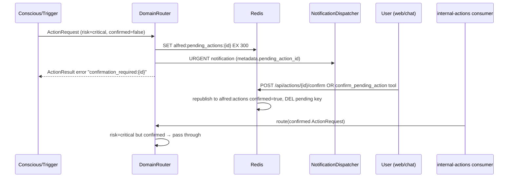

# Attention Set, Tiered Autonomy & Confirmation Flow Implementation Plan

> **For agentic workers:** REQUIRED SUB-SKILL: Use superpowers:subagent-driven-development (recommended) or superpowers:executing-plans to implement this plan task-by-task. Steps use checkbox (`- [ ]`) syntax for tracking.

**Goal:** Gate the Reflex SLM behind a lazily-seeded, runtime-adjustable attention set, enforce tiered autonomy at the dispatch layer (Reflex → benign only; critical → user confirmation), and wire the confirmation flow end-to-end (Redis pending store → URGENT notification → web Confirm button / Conscious `confirm_pending_action` tool → confirmed re-dispatch).

**Architecture:** This is Plan 3 of 3 for the Real-Home HA Integration spec (`docs/superpowers/specs/2026-07-15-real-home-ha-integration-design.md`, Section 3 + resilience bits of Section 4). Plan 1 (SDK/bus credential flow, adds `audience`/`risk` to tool manifests) merges first; this plan rebases on it. All work is in the `alfred` monorepo. Enforcement happens twice: (1) the Reflex prompt is built only from `audience == "reflex"` tools; (2) `DomainRouter.route()` checks tool risk from the Redis registry before dispatch — rejecting over-tier Reflex actions and intercepting unconfirmed critical actions into `alfred:pending_actions:{id}` (TTL 300s) with an URGENT notification. Confirmation republishes the ActionRequest to `alfred:actions` with `confirmed=True`; the conscious process's existing internal-actions consumer executes confirmed domain actions via the DomainRouter (which passes them through without re-interception).

**Tech Stack:** Python 3.13, Pydantic v2, redis.asyncio, FastAPI, loguru, PyYAML, pytest + pytest-asyncio; React 19 + Vite + vitest + sonner (web SPA).

**Interface contracts:** This plan implements contracts C3, C7, C8, C10, and the bridge-maxlen line of C11 from the fixed contracts document. Names, types, and shapes below are FIXED — do not rename.

## Global Constraints

- Python 3.13+ syntax (match/case, `X | None` unions); async-first for all I/O.
- Pydantic v2 for all data models.
- `loguru` in new code (`from loguru import logger`); existing modules that use stdlib `logging` keep their style when only lightly edited.
- `ruff check .` and `ruff format .` clean, line-length 100.
- `mypy --strict` must pass on `bus/ core/ domains/ evals/ runner/ sdk/ shared/ telemetry/`.
- `redis.asyncio` methods return `Awaitable[T] | T` — put `# type: ignore[misc]` on await calls where mypy complains (precedent: `core/reflex/runner.py:86`, `core/reflex/tool_registry.py:48`). If mypy reports an ignore as unused, remove that ignore.
- Import ALL stream/key constants from `shared.streams` — never hardcode `"alfred:..."` strings.
- Import `AioRedis` from `shared.types`; import `ensure_consumer_group` / `publish_observation` from `core.reflex.runner` — never reimplement.
- Redis stream wire format everywhere: `await r.xadd(STREAM, {"event": event.model_dump_json()})`.
- SDK (`sdk/alfred_sdk/`) is standalone — it must NEVER import `bus/` or `core/`. Its `events.py` is a wire-compatible mirror verified by `sdk/tests/test_schema_compatibility.py`.
- Tests live under `tests/` mirroring package layout (root `conftest.py` provides `_mock_keyring`, `_clear_telemetry`, `tv_on_event`); package-local test dirs (`bus/tests/`, `core/reflex/tests/`) also exist — follow whichever directory already tests the file you touch. NEVER add a `conftest.py` inside `tests/`.
- Run tests with `.venv/bin/python -m pytest` (worktrees may default to system Python 3.14 — create the venv with `uv venv --python 3.13` first).
- Every commit message ends with the trailer: `Co-Authored-By: Claude Fable 5 <noreply@anthropic.com>`.
- Frontend: `web/` uses vitest + Testing Library; TS `erasableSyntaxOnly` is on (no parameter properties); `eslint-plugin-react-hooks` v7 purity rules apply.

**Execution context:** Work in a worktree inside the `alfred/` repo (per `superpowers:using-git-worktrees`). Plan 1 has already merged, so `sdk/alfred_sdk/feature.py` `ToolManifest` already carries `audience: Literal["reflex", "conscious"] = "conscious"` and `risk: Literal["benign", "elevated", "critical"] = "benign"`, and registered manifests in `alfred:tool_registry` include those fields per tool. `bus/schemas/events.py` and `sdk/alfred_sdk/events.py` already contain Plan 1's `ServiceRegistered` event — leave it alone.

---

### Task 1: Redis key constants + `ActionRequest.confirmed` (bus + SDK mirror)

**Files:**
- Modify: `shared/streams.py`
- Modify: `bus/schemas/events.py:38-45` (ActionRequest)
- Modify: `sdk/alfred_sdk/events.py:39-46` (ActionRequest mirror)
- Test: `tests/bus/test_action_confirmed.py` (new)

**Interfaces:**
- Consumes: nothing (foundation task).
- Produces (contract C7): `shared.streams.ATTENTION_PREFIX: str = "alfred:attention:"` and `shared.streams.PENDING_ACTIONS_PREFIX: str = "alfred:pending_actions:"`.
- Produces (contract C3): `ActionRequest.confirmed: bool = False` on both the bus schema and the SDK mirror. Later tasks read `action.confirmed` and republish with `model_copy(update={"confirmed": True})`.

- [ ] **Step 1: Write the failing test**

Create `tests/bus/test_action_confirmed.py`:

```python
"""ActionRequest confirmation marker (contract C3) — bus schema + SDK mirror."""

from __future__ import annotations


def test_action_request_confirmed_defaults_false() -> None:
    from bus.schemas.events import ActionRequest

    action = ActionRequest(
        source="conscious-engine",
        target_service="home-service",
        tool_name="home.unlock_door",
    )
    assert action.confirmed is False


def test_confirmed_roundtrip_bus_to_sdk() -> None:
    """A confirmed bus ActionRequest deserializes as a confirmed SDK ActionRequest."""
    from bus.schemas.events import ActionRequest as BusAction
    from sdk.alfred_sdk.events import ActionRequest as SdkAction

    bus_action = BusAction(
        source="domain-router",
        target_service="home-service",
        tool_name="home.unlock_door",
        parameters={"entity_id": "lock.front_door"},
        confirmed=True,
    )
    sdk_action = SdkAction.model_validate_json(bus_action.model_dump_json())
    assert sdk_action.confirmed is True
    assert sdk_action.request_id == bus_action.request_id


def test_confirmed_roundtrip_sdk_to_bus() -> None:
    from bus.schemas.events import ActionRequest as BusAction
    from sdk.alfred_sdk.events import ActionRequest as SdkAction

    sdk_action = SdkAction(
        source="reflex-engine",
        target_service="home-service",
        tool_name="lighting.dim_lights",
    )
    bus_action = BusAction.model_validate_json(sdk_action.model_dump_json())
    assert bus_action.confirmed is False


def test_pending_and_attention_prefixes_exist() -> None:
    from shared.streams import ATTENTION_PREFIX, PENDING_ACTIONS_PREFIX

    assert ATTENTION_PREFIX == "alfred:attention:"
    assert PENDING_ACTIONS_PREFIX == "alfred:pending_actions:"
```

- [ ] **Step 2: Run test to verify it fails**

Run: `.venv/bin/python -m pytest tests/bus/test_action_confirmed.py -v`
Expected: FAIL — `test_action_request_confirmed_defaults_false` with `AttributeError: 'ActionRequest' object has no attribute 'confirmed'` (or `pydantic` unexpected-kwarg error on `confirmed=True`), and `test_pending_and_attention_prefixes_exist` with `ImportError: cannot import name 'ATTENTION_PREFIX'`.

- [ ] **Step 3: Add the constants to `shared/streams.py`**

Append after the `INTEGRATION_REGISTRY_KEY` block (keep existing sections untouched):

```python
# Attention set + pending critical actions (Real-Home HA Integration, Plan 3)
ATTENTION_PREFIX = "alfred:attention:"  # + domain → Redis SET of entity_ids
PENDING_ACTIONS_PREFIX = "alfred:pending_actions:"  # + request_id → ActionRequest JSON, TTL 300s
```

- [ ] **Step 4: Add `confirmed` to both ActionRequest models**

In `bus/schemas/events.py`, change `ActionRequest` to:

```python
class ActionRequest(BaseEvent):
    """A request to execute an MCP tool on a microservice."""

    event_type: str = "action_request"
    request_id: str = Field(default_factory=lambda: str(uuid4()))
    target_service: str = Field(description="Which microservice should handle this")
    tool_name: str = Field(description="MCP tool name, e.g. smart_home.dim_lights")
    parameters: dict[str, Any] = Field(default_factory=dict)
    confirmed: bool = False  # set True only by the confirmation flow (contract C3)
```

In `sdk/alfred_sdk/events.py`, make the identical change to its `ActionRequest` (same five lines plus the new `confirmed: bool = False` line — the SDK mirror must stay field-for-field identical).

- [ ] **Step 5: Run tests to verify they pass (including the schema-compat suite)**

Run: `.venv/bin/python -m pytest tests/bus/test_action_confirmed.py sdk/tests/test_schema_compatibility.py -v`
Expected: PASS (all). `test_shared_schemas_have_same_fields` passes because both mirrors gained the field.

- [ ] **Step 6: Commit**

```bash
git add shared/streams.py bus/schemas/events.py sdk/alfred_sdk/events.py tests/bus/test_action_confirmed.py
git commit -m "feat(bus): add ActionRequest.confirmed marker + attention/pending key prefixes

Contracts C3 + C7 of the real-home HA integration design.

Co-Authored-By: Claude Fable 5 <noreply@anthropic.com>"
```

---

### Task 2: Notification metadata plumbing (schema → publisher → WebSocket adapter)

**Files:**
- Modify: `core/notifications/schema.py:24-33` (Notification model)
- Modify: `core/notifications/publisher.py`
- Modify: `core/notifications/adapters/websocket.py:43-49`
- Test: `tests/core/notifications/test_metadata.py` (new)

**Interfaces:**
- Consumes: nothing.
- Produces: `Notification.metadata: dict[str, Any]` (default `{}`); `NotificationPublisher.publish(title, body, source, urgency=Urgency.INFORMATIONAL, metadata: dict[str, Any] | None = None)`; WebSocket notification frames gain a `"metadata"` key. Task 8 publishes confirmation notifications with `metadata={"pending_action_id": ..., "tool_name": ..., "parameters": ...}`; Task 13 reads `metadata.pending_action_id` in the SPA.
- Why this is needed: contract C10 requires the URGENT confirmation notification to carry `pending_action_id` in metadata, but `Notification` currently has no metadata field. Metadata flows automatically through the dispatch stream because the dispatcher serializes the whole model (`notification.model_dump_json()` in `core/notifications/dispatcher.py:114-117`).

- [ ] **Step 1: Write the failing test**

Create `tests/core/notifications/test_metadata.py`:

```python
"""Notification metadata flows from publisher through the WebSocket adapter."""

from __future__ import annotations

from unittest.mock import AsyncMock

import pytest

from core.notifications.schema import Notification, Urgency


def test_notification_metadata_defaults_empty() -> None:
    notif = Notification(title="T", body="B", urgency=Urgency.URGENT, source="test")
    assert notif.metadata == {}


def test_notification_metadata_json_roundtrip() -> None:
    notif = Notification(
        title="Confirmation required",
        body="Alfred wants to run 'home.unlock_door' — confirm?",
        urgency=Urgency.URGENT,
        source="domain-router",
        metadata={"pending_action_id": "req-1", "tool_name": "home.unlock_door"},
    )
    restored = Notification.model_validate_json(notif.model_dump_json())
    assert restored.metadata["pending_action_id"] == "req-1"


@pytest.mark.asyncio
async def test_publisher_passes_metadata_to_dispatcher() -> None:
    from core.notifications.publisher import NotificationPublisher

    dispatcher = AsyncMock()
    publisher = NotificationPublisher(dispatcher)
    await publisher.publish(
        title="T",
        body="B",
        source="domain-router",
        urgency=Urgency.URGENT,
        metadata={"pending_action_id": "req-2"},
    )
    dispatcher.dispatch.assert_awaited_once()
    notif = dispatcher.dispatch.call_args[0][0]
    assert notif.metadata == {"pending_action_id": "req-2"}


@pytest.mark.asyncio
async def test_websocket_payload_includes_metadata() -> None:
    from core.notifications.adapters.websocket import WebSocketChannelAdapter

    mock_ws = AsyncMock()
    adapter = WebSocketChannelAdapter(get_sessions=lambda: [mock_ws])
    notif = Notification(
        title="T",
        body="B",
        urgency=Urgency.IMPORTANT,
        source="domain-router",
        metadata={"pending_action_id": "req-3"},
    )
    await adapter.deliver(notif)
    payload = mock_ws.send_json.call_args[0][0]
    assert payload["metadata"] == {"pending_action_id": "req-3"}
```

- [ ] **Step 2: Run test to verify it fails**

Run: `.venv/bin/python -m pytest tests/core/notifications/test_metadata.py -v`
Expected: FAIL — pydantic `ValidationError` / unexpected keyword `metadata` on the first test.

- [ ] **Step 3: Implement**

In `core/notifications/schema.py`, add the import and field. Change the imports block to include `Any`:

```python
from datetime import UTC, datetime
from enum import StrEnum
from typing import Any
from uuid import uuid4

from pydantic import BaseModel, Field
```

Change `Notification` to:

```python
class Notification(BaseModel):
    """A notification to be dispatched to one or more channels."""

    notification_id: str = Field(default_factory=lambda: str(uuid4()))
    title: str
    body: str
    urgency: Urgency
    source: str
    timestamp: datetime = Field(default_factory=lambda: datetime.now(UTC))
    metadata: dict[str, Any] = Field(default_factory=dict)
```

In `core/notifications/publisher.py`, replace `publish()` (add `Any` to imports via `from typing import TYPE_CHECKING, Any`):

```python
    async def publish(
        self,
        title: str,
        body: str,
        source: str,
        urgency: Urgency = Urgency.INFORMATIONAL,
        metadata: dict[str, Any] | None = None,
    ) -> None:
        """Create a Notification and route it through the dispatcher."""
        notification = Notification(
            title=title,
            body=body,
            urgency=urgency,
            source=source,
            metadata=metadata or {},
        )
        await self._dispatcher.dispatch(notification)
```

In `core/notifications/adapters/websocket.py`, extend the payload dict in `deliver()`:

```python
        payload: dict[str, Any] = {
            "type": "notification",
            "title": notification.title,
            "body": notification.body,
            "urgency": notification.urgency.value,
            "notification_id": notification.notification_id,
            "metadata": notification.metadata,
        }
```

- [ ] **Step 4: Run the new tests plus the existing notification suite**

Run: `.venv/bin/python -m pytest tests/core/notifications/ -v`
Expected: PASS (all — existing tests assert individual payload keys, so the added key is non-breaking).

- [ ] **Step 5: Commit**

```bash
git add core/notifications/schema.py core/notifications/publisher.py core/notifications/adapters/websocket.py tests/core/notifications/test_metadata.py
git commit -m "feat(notifications): metadata field on Notification, threaded through publisher + WS adapter

Carries pending_action_id for the critical-action confirmation flow (contract C10).

Co-Authored-By: Claude Fable 5 <noreply@anthropic.com>"
```

---

### Task 3: AttentionSet — lazy seeding, cooldown, transition-only gating

**Files:**
- Create: `core/reflex/attention.py`
- Create: `core/reflex/attention_seed.yaml`
- Test: `tests/core/reflex/test_attention.py` (new)

**Interfaces:**
- Consumes: `ATTENTION_PREFIX` from Task 1; `StateChangedEvent` from `bus.schemas.events`.
- Produces (contract C8):
  - `class AttentionSet` with `__init__(self, redis: AioRedis, seed_path: Path | None = None, cooldown_seconds: float = 5.0)` and `async def should_fire(self, event: StateChangedEvent) -> bool` (Task 4 calls this before `ReflexEngine.process_event`).
  - Module helpers used by Task 11's conscious tools: `async def attention_add(redis: AioRedis, domain: str, entity_id: str) -> None`, `async def attention_remove(redis: AioRedis, domain: str, entity_id: str) -> None`, `async def attention_list(redis: AioRedis, domain: str) -> list[str]`, plus `def attention_key(domain: str) -> str` and `def attention_seen_key(domain: str) -> str`.
- Semantics: membership SET at `alfred:attention:{event.domain}` (e.g. `alfred:attention:home`). A companion `alfred:attention:{domain}:seen` SET records every entity ever evaluated, so a runtime `attention_remove` is sticky (the seed rule never re-adds a demoted entity). Both keys live under `ATTENTION_PREFIX` per contract C7. Entity joins on first sight iff its entity_id domain prefix (text before the first `.`) is in the YAML `domains` list OR `attributes.device_class` is in `device_classes`. `should_fire` returns True only for members, only when `new_state != old_state`, and at most once per entity per cooldown window (in-process, `time.monotonic()`).

- [ ] **Step 1: Write the failing tests**

Create `tests/core/reflex/test_attention.py`:

```python
"""AttentionSet — lazy seeding, sticky removal, cooldown, transition-only gating."""

from __future__ import annotations

from typing import Any

import pytest

from bus.schemas.events import StateChangedEvent


class FakeSetRedis:
    """Minimal in-memory Redis supporting the SET commands AttentionSet uses."""

    def __init__(self) -> None:
        self.sets: dict[str, set[str]] = {}

    async def sadd(self, key: str, member: str) -> int:
        self.sets.setdefault(key, set()).add(member)
        return 1

    async def srem(self, key: str, member: str) -> int:
        self.sets.get(key, set()).discard(member)
        return 1

    async def sismember(self, key: str, member: str) -> bool:
        return member in self.sets.get(key, set())

    async def smembers(self, key: str) -> set[str]:
        return set(self.sets.get(key, set()))


def _event(
    entity_id: str,
    old: str | None = "off",
    new: str = "on",
    attributes: dict[str, Any] | None = None,
) -> StateChangedEvent:
    return StateChangedEvent(
        source="home-service",
        domain="home",
        entity_id=entity_id,
        old_state=old,
        new_state=new,
        attributes=attributes or {},
    )


def _attention(redis: FakeSetRedis, cooldown: float = 0.0) -> Any:
    from core.reflex.attention import AttentionSet

    return AttentionSet(redis=redis, cooldown_seconds=cooldown)  # type: ignore[arg-type]


@pytest.mark.asyncio
async def test_seeds_by_domain_prefix() -> None:
    """light.* is in the seed domains — first sight joins and fires."""
    redis = FakeSetRedis()
    attention = _attention(redis)
    assert await attention.should_fire(_event("light.kitchen")) is True
    assert "light.kitchen" in redis.sets["alfred:attention:home"]
    assert "light.kitchen" in redis.sets["alfred:attention:home:seen"]


@pytest.mark.asyncio
async def test_seeds_by_device_class() -> None:
    """binary_sensor is not a seed domain, but device_class=motion is."""
    redis = FakeSetRedis()
    attention = _attention(redis)
    event = _event("binary_sensor.hallway_motion", attributes={"device_class": "motion"})
    assert await attention.should_fire(event) is True
    assert "binary_sensor.hallway_motion" in redis.sets["alfred:attention:home"]


@pytest.mark.asyncio
async def test_non_matching_entity_is_gated_and_marked_seen() -> None:
    redis = FakeSetRedis()
    attention = _attention(redis)
    event = _event("sensor.dryer_power", old="100", new="150")
    assert await attention.should_fire(event) is False
    assert "sensor.dryer_power" not in redis.sets.get("alfred:attention:home", set())
    assert "sensor.dryer_power" in redis.sets["alfred:attention:home:seen"]


@pytest.mark.asyncio
async def test_removal_is_sticky_against_reseeding() -> None:
    """attention_remove marks the entity seen — the seed rule never re-adds it."""
    from core.reflex.attention import attention_remove

    redis = FakeSetRedis()
    attention = _attention(redis)
    assert await attention.should_fire(_event("light.bedroom")) is True
    await attention_remove(redis, "home", "light.bedroom")  # type: ignore[arg-type]
    assert await attention.should_fire(_event("light.bedroom", old="on", new="off")) is False


@pytest.mark.asyncio
async def test_add_and_list_helpers() -> None:
    from core.reflex.attention import attention_add, attention_list

    redis = FakeSetRedis()
    await attention_add(redis, "home", "sensor.dryer_power")  # type: ignore[arg-type]
    assert await attention_list(redis, "home") == ["sensor.dryer_power"]  # type: ignore[arg-type]
    # Manually added entities fire even though the seed rule would reject them
    attention = _attention(redis)
    assert await attention.should_fire(_event("sensor.dryer_power", old="0", new="900")) is True


@pytest.mark.asyncio
async def test_attribute_only_update_is_gated() -> None:
    """new_state == old_state (attribute-only forward per contract C11) never fires."""
    redis = FakeSetRedis()
    attention = _attention(redis)
    assert await attention.should_fire(_event("light.kitchen", old="on", new="on")) is False


@pytest.mark.asyncio
async def test_cooldown_collapses_bursts() -> None:
    redis = FakeSetRedis()
    attention = _attention(redis, cooldown=1000.0)
    assert await attention.should_fire(_event("light.kitchen")) is True
    assert await attention.should_fire(_event("light.kitchen", old="on", new="off")) is False


@pytest.mark.asyncio
async def test_cooldown_is_per_entity() -> None:
    redis = FakeSetRedis()
    attention = _attention(redis, cooldown=1000.0)
    assert await attention.should_fire(_event("light.kitchen")) is True
    assert await attention.should_fire(_event("light.bedroom")) is True


def test_seed_yaml_matches_contract() -> None:
    """The shipped seed file carries exactly the contract-C8 rules."""
    from core.reflex.attention import DEFAULT_SEED_PATH, AttentionSeedRules
    import yaml

    data = yaml.safe_load(DEFAULT_SEED_PATH.read_text())
    rules = AttentionSeedRules.model_validate(data)
    assert rules.domains == ["light", "switch", "media_player", "scene", "climate", "lock", "person"]
    assert rules.device_classes == [
        "door", "motion", "occupancy", "presence", "window", "garage_door",
    ]
```

- [ ] **Step 2: Run tests to verify they fail**

Run: `.venv/bin/python -m pytest tests/core/reflex/test_attention.py -v`
Expected: FAIL — `ModuleNotFoundError: No module named 'core.reflex.attention'`.

- [ ] **Step 3: Create the seed YAML**

Create `core/reflex/attention_seed.yaml` (exact content, contract C8):

```yaml
# Attention-set seed rules — decides membership the first time Reflex sees an entity.
# Runtime adjustments (attention_add / attention_remove) override these rules.
domains: [light, switch, media_player, scene, climate, lock, person]
device_classes: [door, motion, occupancy, presence, window, garage_door]
```

- [ ] **Step 4: Implement `core/reflex/attention.py`**

```python
"""Attention set — gates which entities may fire the Reflex SLM.

Membership is lazily seeded from YAML rules (``attention_seed.yaml``) the
first time an entity is seen, then persisted in Redis sets under
``alfred:attention:{domain}``. A companion ``...:seen`` set records every
evaluated entity so runtime removals are sticky (a demoted entity is never
re-seeded). Triggers and context IGNORE the attention set — full visibility
is preserved; this gate applies only to the Reflex SLM path.
"""

from __future__ import annotations

import time
from pathlib import Path
from typing import TYPE_CHECKING

import yaml
from loguru import logger
from pydantic import BaseModel, Field

from shared.streams import ATTENTION_PREFIX, decode_stream_value

if TYPE_CHECKING:
    from bus.schemas.events import StateChangedEvent
    from shared.types import AioRedis

DEFAULT_SEED_PATH = Path(__file__).resolve().parent / "attention_seed.yaml"
COOLDOWN_SECONDS = 5.0


class AttentionSeedRules(BaseModel):
    """Data-driven seed rules — domains + device classes that auto-join."""

    domains: list[str] = Field(default_factory=list)
    device_classes: list[str] = Field(default_factory=list)


def attention_key(domain: str) -> str:
    """Redis SET of attention-set members for a domain."""
    return f"{ATTENTION_PREFIX}{domain}"


def attention_seen_key(domain: str) -> str:
    """Redis SET of every entity ever evaluated (makes removals sticky)."""
    return f"{ATTENTION_PREFIX}{domain}:seen"


async def attention_add(redis: AioRedis, domain: str, entity_id: str) -> None:
    """Add an entity to the attention set (runtime primitive)."""
    await redis.sadd(attention_key(domain), entity_id)  # type: ignore[misc]
    await redis.sadd(attention_seen_key(domain), entity_id)  # type: ignore[misc]


async def attention_remove(redis: AioRedis, domain: str, entity_id: str) -> None:
    """Remove an entity — sticky: the seed rule will not re-add it."""
    await redis.srem(attention_key(domain), entity_id)  # type: ignore[misc]
    await redis.sadd(attention_seen_key(domain), entity_id)  # type: ignore[misc]


async def attention_list(redis: AioRedis, domain: str) -> list[str]:
    """Return sorted attention-set members for a domain."""
    members: set[bytes | str] = await redis.smembers(attention_key(domain))  # type: ignore[misc]
    return sorted(decode_stream_value(m) for m in members)


class AttentionSet:
    """Decides whether a StateChangedEvent should reach the Reflex SLM."""

    def __init__(
        self,
        redis: AioRedis,
        seed_path: Path | None = None,
        cooldown_seconds: float = COOLDOWN_SECONDS,
    ) -> None:
        self._redis = redis
        self._seed_path = seed_path or DEFAULT_SEED_PATH
        self._cooldown = cooldown_seconds
        self._last_fired: dict[str, float] = {}
        self._rules: AttentionSeedRules | None = None

    def _load_rules(self) -> AttentionSeedRules:
        """Load seed rules; a missing/invalid file means nothing auto-joins."""
        try:
            data = yaml.safe_load(self._seed_path.read_text()) or {}
            return AttentionSeedRules.model_validate(data)
        except (OSError, ValueError) as exc:
            logger.warning("Attention seed rules unavailable ({}): {}", self._seed_path, exc)
            return AttentionSeedRules()

    def _seed_rules(self) -> AttentionSeedRules:
        if self._rules is None:
            self._rules = self._load_rules()
        return self._rules

    def _matches_seed(self, event: StateChangedEvent) -> bool:
        rules = self._seed_rules()
        entity_domain = event.entity_id.split(".", 1)[0]
        if entity_domain in rules.domains:
            return True
        device_class = event.attributes.get("device_class")
        return isinstance(device_class, str) and device_class in rules.device_classes

    async def _is_member(self, event: StateChangedEvent) -> bool:
        """Membership check with lazy first-sight seeding."""
        key = attention_key(event.domain)
        if await self._redis.sismember(key, event.entity_id):  # type: ignore[misc]
            return True
        if await self._redis.sismember(  # type: ignore[misc]
            attention_seen_key(event.domain), event.entity_id
        ):
            return False  # evaluated before — respects runtime removals
        joins = self._matches_seed(event)
        await self._redis.sadd(attention_seen_key(event.domain), event.entity_id)  # type: ignore[misc]
        if joins:
            await self._redis.sadd(key, event.entity_id)  # type: ignore[misc]
            logger.info("Attention set: seeded {} into {}", event.entity_id, key)
        return joins

    async def should_fire(self, event: StateChangedEvent) -> bool:
        """True iff the Reflex SLM should process this event."""
        if event.new_state == event.old_state:
            return False  # attribute-only update — not a real transition
        if not await self._is_member(event):
            return False
        now = time.monotonic()
        last = self._last_fired.get(event.entity_id)
        if last is not None and (now - last) < self._cooldown:
            logger.debug("Attention cooldown: {} suppressed", event.entity_id)
            return False
        self._last_fired[event.entity_id] = now
        return True
```

- [ ] **Step 5: Run tests to verify they pass**

Run: `.venv/bin/python -m pytest tests/core/reflex/test_attention.py -v`
Expected: PASS (all 10).

- [ ] **Step 6: Commit**

```bash
git add core/reflex/attention.py core/reflex/attention_seed.yaml tests/core/reflex/test_attention.py
git commit -m "feat(reflex): AttentionSet with lazy YAML seeding, sticky removal, 5s cooldown

Contract C8 — SLM gating only; triggers and context keep full visibility.

Co-Authored-By: Claude Fable 5 <noreply@anthropic.com>"
```

---

### Task 4: Gate the Reflex state-event loop with the AttentionSet

**Files:**
- Modify: `core/reflex/runner.py:66-108` (`process_stream_entry`)
- Modify: `core/reflex/__main__.py` (construct `AttentionSet`, pass it into the loop)
- Test: `tests/core/reflex/test_runner_attention.py` (new)

**Interfaces:**
- Consumes: `AttentionSet.should_fire(event) -> bool` from Task 3.
- Produces: `process_stream_entry(..., attention: AttentionSet | None = None)` — keyword param with default `None` so existing callers/tests are unaffected. Gated events return `False` WITHOUT raising, so the caller in `core/reflex/__main__.py` still `xack`s them (the gating point is after event parsing, before `engine.process_event`). Skipped events remain visible to context via home-service context snapshots — do NOT add any context writes here.

- [ ] **Step 1: Write the failing tests**

Create `tests/core/reflex/test_runner_attention.py`:

```python
"""Attention gating inside the Reflex runner's state-event processing."""

from __future__ import annotations

from unittest.mock import AsyncMock

import pytest

from bus.schemas.events import StateChangedEvent


def _entry(event: StateChangedEvent) -> dict[bytes, bytes]:
    return {b"event": event.model_dump_json().encode()}


@pytest.mark.asyncio
async def test_gated_event_skips_slm_and_returns_false(
    tv_on_event: StateChangedEvent,
) -> None:
    from core.reflex.runner import process_stream_entry

    engine = AsyncMock()
    agent = AsyncMock()
    redis = AsyncMock()
    attention = AsyncMock()
    attention.should_fire = AsyncMock(return_value=False)

    took_action = await process_stream_entry(
        entry_data=_entry(tv_on_event),
        engine=engine,
        agent=agent,
        redis=redis,
        result_stream="alfred:home:action_results",
        observation_stream="alfred:reflex:observations",
        attention=attention,
    )

    assert took_action is False
    engine.process_event.assert_not_awaited()
    agent.execute_action.assert_not_awaited()


@pytest.mark.asyncio
async def test_attended_event_reaches_engine(tv_on_event: StateChangedEvent) -> None:
    from core.reflex.runner import process_stream_entry

    engine = AsyncMock()
    engine.process_event = AsyncMock(return_value=None)  # SLM decides "no action"
    attention = AsyncMock()
    attention.should_fire = AsyncMock(return_value=True)

    took_action = await process_stream_entry(
        entry_data=_entry(tv_on_event),
        engine=engine,
        agent=AsyncMock(),
        redis=AsyncMock(),
        result_stream="alfred:home:action_results",
        observation_stream="alfred:reflex:observations",
        attention=attention,
    )

    assert took_action is False
    engine.process_event.assert_awaited_once()


@pytest.mark.asyncio
async def test_no_attention_set_means_no_gating(tv_on_event: StateChangedEvent) -> None:
    """attention=None (default) preserves pre-existing behavior."""
    from core.reflex.runner import process_stream_entry

    engine = AsyncMock()
    engine.process_event = AsyncMock(return_value=None)

    await process_stream_entry(
        entry_data=_entry(tv_on_event),
        engine=engine,
        agent=AsyncMock(),
        redis=AsyncMock(),
        result_stream="alfred:home:action_results",
        observation_stream="alfred:reflex:observations",
    )
    engine.process_event.assert_awaited_once()
```

- [ ] **Step 2: Run tests to verify they fail**

Run: `.venv/bin/python -m pytest tests/core/reflex/test_runner_attention.py -v`
Expected: FAIL — `TypeError: process_stream_entry() got an unexpected keyword argument 'attention'`.

- [ ] **Step 3: Implement the gate in `core/reflex/runner.py`**

Add to the `TYPE_CHECKING` block:

```python
    from core.reflex.attention import AttentionSet
```

Change `process_stream_entry`'s signature and insert the gate between event parsing and `engine.process_event`:

```python
async def process_stream_entry(
    entry_data: Mapping[str | bytes, str | bytes],
    engine: ReflexEngine,
    agent: DomainAgent,
    redis: AioRedis,
    result_stream: str,
    observation_stream: str,
    attention: AttentionSet | None = None,
) -> bool:
    """Process a single Redis Stream entry. Returns True if an action was taken.

    Raises on retriable errors (e.g., Ollama down) so the caller can
    choose not to ACK the message. Returns False for skip-worthy errors
    (malformed event, no action needed) AND for attention-gated events —
    gated events are still ACKed by the caller.
    """
    raw_event = entry_data.get("event") or entry_data.get(b"event")
    if raw_event is None:
        logger.warning("Stream entry missing 'event' field: %s", entry_data)
        return False

    event_str = decode_stream_value(raw_event)

    try:
        event = StateChangedEvent.model_validate_json(event_str)
    except Exception as e:
        logger.error("Failed to parse event: %s — %s", e, event_str[:200])
        return False

    # Attention gate — only attention-set members on real transitions reach
    # the SLM. Gated events stay fully visible to triggers and context
    # (they consume the stream independently / via home-service snapshots).
    if attention is not None and not await attention.should_fire(event):
        logger.debug("Attention-gated: %s (%s → %s)", event.entity_id, event.old_state, event.new_state)
        return False

    # NOTE: engine.process_event() calls Ollama. If Ollama is down, this
    # raises (httpx.ConnectError, etc.). We intentionally let it propagate
    # so the caller does NOT ACK the message — Redis will redeliver it.
    action = await engine.process_event(event)
    if action is None:
        logger.debug("No action for event %s", event.entity_id)
        return False

    result = await agent.execute_action(action)

    await redis.xadd(result_stream, {"event": result.model_dump_json()})

    await publish_observation(redis, observation_stream, "state_change", event, action, result)

    logger.info("Action: %s → %s (status=%s)", event.entity_id, action.tool_name, result.status)
    return True
```

- [ ] **Step 4: Wire it into `core/reflex/__main__.py`**

Add the import (alphabetical, with the other `core.reflex` imports):

```python
from core.reflex.attention import AttentionSet
```

In `run()`, immediately after `engine = ReflexEngine(...)` is constructed, add:

```python
    attention = AttentionSet(redis=r)
```

In the main `while not _shutdown.is_set():` loop, pass it to `process_stream_entry`:

```python
                        await process_stream_entry(
                            entry_data=entry_data,
                            engine=engine,
                            agent=router,
                            redis=r,
                            result_stream=RESULT_STREAM,
                            observation_stream=REFLEX_OBSERVATIONS_STREAM,
                            attention=attention,
                        )
```

(The TriggerFired consumer loop is NOT gated — triggers already passed their own conditions.)

- [ ] **Step 5: Run the reflex test suites**

Run: `.venv/bin/python -m pytest tests/core/reflex/ core/reflex/tests/ tests/integration/test_reflex_end_to_end.py -v`
Expected: PASS (all — `attention=None` default keeps existing tests green).

- [ ] **Step 6: Commit**

```bash
git add core/reflex/runner.py core/reflex/__main__.py tests/core/reflex/test_runner_attention.py
git commit -m "feat(reflex): gate state-event loop behind AttentionSet; gated events still ACKed

Co-Authored-By: Claude Fable 5 <noreply@anthropic.com>"
```

---

### Task 5: Audience-filtered Reflex tool prompt (`audience == "reflex"` only)

**Files:**
- Modify: `core/reflex/tool_registry.py:22-32` (ToolInfo) and `:66-79` (manifest parsing)
- Modify: `core/reflex/engine.py:140-148` (`_get_tools_and_prompt`)
- Modify: `core/reflex/tests/test_engine.py:19-43` (tag fixture tools `audience="reflex"`)
- Modify: `tests/integration/test_reflex_end_to_end.py:20-32` (same)
- Test: `tests/core/reflex/test_audience_filter.py` (new)

**Interfaces:**
- Consumes: manifest JSON in `alfred:tool_registry` where each tool dict may carry `"audience"` and `"risk"` (written by Plan 1's SDK `ToolManifest`; absent on legacy manifests).
- Produces: `ToolInfo` gains `audience: str = "conscious"` and `risk: str = "benign"` (frozen dataclass — new fields appended with defaults, so positional construction is unaffected). `ToolRegistry.get_tools()` still returns ALL tools (the Conscious Engine must see everything); only `ReflexEngine._get_tools_and_prompt()` filters to `audience == "reflex"`. This also shrinks `valid_services` to reflex-tier services, so the SLM parser rejects out-of-tier `target_service` values — first enforcement layer of the spec's "enforced twice".

- [ ] **Step 1: Write the failing tests**

Create `tests/core/reflex/test_audience_filter.py`:

```python
"""Audience tagging: registry parsing + Reflex prompt filtering."""

from __future__ import annotations

import json
from unittest.mock import AsyncMock, patch

import pytest

from bus.schemas.events import StateChangedEvent
from core.reflex.tool_registry import ToolInfo, ToolRegistry

_MANIFEST = json.dumps(
    {
        "service_name": "home-service",
        "service_endpoint": "http://localhost:8000",
        "features": [
            {
                "name": "home",
                "description": "Home control",
                "tools": [
                    {
                        "name": "home.turn_on_lights",
                        "description": "Turn on lights",
                        "parameters": {},
                        "audience": "reflex",
                        "risk": "benign",
                    },
                    {
                        "name": "home.unlock_door",
                        "description": "Unlock a door",
                        "parameters": {},
                        "audience": "conscious",
                        "risk": "critical",
                    },
                    {
                        "name": "home.legacy_tool",
                        "description": "Registered before audience tagging",
                        "parameters": {},
                    },
                ],
            }
        ],
    }
)


@pytest.mark.asyncio
async def test_registry_parses_audience_and_risk_with_defaults() -> None:
    redis = AsyncMock()
    redis.hgetall = AsyncMock(return_value={b"home-service": _MANIFEST.encode()})
    tools = await ToolRegistry(redis).get_tools()

    by_name = {t.name: t for t in tools}
    assert len(tools) == 3  # get_tools returns ALL tools — Conscious sees everything
    assert by_name["home.turn_on_lights"].audience == "reflex"
    assert by_name["home.turn_on_lights"].risk == "benign"
    assert by_name["home.unlock_door"].audience == "conscious"
    assert by_name["home.unlock_door"].risk == "critical"
    assert by_name["home.legacy_tool"].audience == "conscious"  # default
    assert by_name["home.legacy_tool"].risk == "benign"  # default


@pytest.mark.asyncio
async def test_reflex_prompt_contains_only_reflex_audience_tools(
    tv_on_event: StateChangedEvent,
) -> None:
    from core.reflex.engine import ReflexEngine

    redis = AsyncMock()
    redis.hgetall = AsyncMock(return_value={b"home-service": _MANIFEST.encode()})

    captured: dict[str, str] = {}

    async def _capture(prompt: str) -> dict[str, object]:
        captured["prompt"] = prompt
        return {"response": json.dumps({"action": "none"})}

    with patch("core.reflex.ollama_client.infer", new=AsyncMock(side_effect=_capture)):
        engine = ReflexEngine(preferences_dir="/fake", tool_registry=ToolRegistry(redis))
        engine._cached_preferences = "- no preferences"
        await engine.process_event(tv_on_event)

    assert "home.turn_on_lights" in captured["prompt"]
    assert "home.unlock_door" not in captured["prompt"]
    assert "home.legacy_tool" not in captured["prompt"]


def test_toolinfo_defaults() -> None:
    tool = ToolInfo(
        name="x.y",
        description="",
        parameters={},
        feature_name="x",
        feature_description="",
        target_service="svc",
    )
    assert tool.audience == "conscious"
    assert tool.risk == "benign"
```

- [ ] **Step 2: Run tests to verify they fail**

Run: `.venv/bin/python -m pytest tests/core/reflex/test_audience_filter.py -v`
Expected: FAIL — `TypeError`/`AttributeError`: `ToolInfo` has no field `audience`.

- [ ] **Step 3: Implement**

In `core/reflex/tool_registry.py`, extend the dataclass (append after `target_service` so positional callers keep working):

```python
@dataclass(frozen=True)
class ToolInfo:
    """A single tool discovered from the registry."""

    name: str
    description: str
    parameters: dict[str, dict[str, Any]]
    feature_name: str
    feature_description: str
    target_service: str
    audience: str = "conscious"
    risk: str = "benign"
```

In `get_tools()`, extend the `ToolInfo(...)` construction inside the feature/tools loop:

```python
                for t in feature.get("tools", []):
                    tools.append(
                        ToolInfo(
                            name=t["name"],
                            description=t.get("description", ""),
                            parameters=t.get("parameters", {}),
                            feature_name=feature_name,
                            feature_description=feature_desc,
                            target_service=service_name,
                            audience=t.get("audience", "conscious"),
                            risk=t.get("risk", "benign"),
                        )
                    )
```

In `core/reflex/engine.py`, change `_get_tools_and_prompt` to filter (the ONLY place the audience filter lives — Conscious keeps full visibility):

```python
    async def _get_tools_and_prompt(self) -> tuple[list[ToolInfo], str]:
        """Return cached reflex-audience tools and system prompt (TTL-refreshed).

        Only tools tagged ``audience == "reflex"`` reach the SLM prompt —
        the first layer of tiered autonomy. Untagged (legacy) tools default
        to "conscious" and are therefore excluded.
        """
        now = time.monotonic()
        if self._cached_tools is None or (now - self._cache_time) > self.TOOL_CACHE_TTL:
            all_tools = await self._registry.get_tools()
            self._cached_tools = [t for t in all_tools if t.audience == "reflex"]
            self._cached_system_prompt = self._build_system_prompt(self._cached_tools)
            self._cache_time = now
        assert self._cached_system_prompt is not None  # narrowing for mypy
        return self._cached_tools, self._cached_system_prompt
```

- [ ] **Step 4: Update existing fixtures that route through `process_event`**

In `core/reflex/tests/test_engine.py`, `_make_tools()` — add `audience="reflex"` to BOTH `ToolInfo(...)` constructions:

```python
def _make_tools() -> list[ToolInfo]:
    """Build a standard test tool list."""
    return [
        ToolInfo(
            name="lighting.dim_lights",
            description="Dim the lights in a room.",
            parameters={
                "room": {"type": "str", "description": "The room to dim."},
                "level": {"type": "int", "description": "Brightness level 0-100."},
            },
            feature_name="lighting",
            feature_description="Smart home lighting controls.",
            target_service="home-service",
            audience="reflex",
        ),
        ToolInfo(
            name="lighting.turn_off_lights",
            description="Turn off all lights in a room.",
            parameters={
                "room": {"type": "str", "description": "The room to turn off."},
            },
            feature_name="lighting",
            feature_description="Smart home lighting controls.",
            target_service="home-service",
            audience="reflex",
        ),
    ]
```

In `tests/integration/test_reflex_end_to_end.py`, `_make_mock_registry()` — add `audience="reflex",` after `target_service="home-service",` in its single `ToolInfo(...)` construction.

(`tests/core/reflex/test_engine_public_api.py` and `tests/evals/test_pipeline.py` call `build_prompt()` directly with explicit tool lists — the filter does not apply there; leave them unchanged.)

- [ ] **Step 5: Run the affected suites**

Run: `.venv/bin/python -m pytest tests/core/reflex/ core/reflex/tests/ tests/integration/ tests/evals/ tests/core/conscious/test_engine.py -v`
Expected: PASS (all).

- [ ] **Step 6: Commit**

```bash
git add core/reflex/tool_registry.py core/reflex/engine.py core/reflex/tests/test_engine.py tests/integration/test_reflex_end_to_end.py tests/core/reflex/test_audience_filter.py
git commit -m "feat(reflex): build SLM tool prompt only from audience=reflex registry tools

ToolInfo carries audience/risk (defaults conscious/benign for legacy manifests).
Conscious Engine keeps full tool visibility — filter lives in ReflexEngine only.

Co-Authored-By: Claude Fable 5 <noreply@anthropic.com>"
```

---

### Task 6: `tool_risk()` lookup helper (`core/routing/risk.py`)

**Files:**
- Create: `core/routing/risk.py`
- Test: `tests/core/routing/test_risk.py` (new)

**Interfaces:**
- Consumes: `TOOL_REGISTRY_KEY` from `shared.streams`; manifest JSON shape `{"features": [{"tools": [{"name", "risk", ...}]}]}` in the `alfred:tool_registry` hash.
- Produces (contract C10): `async def tool_risk(redis: AioRedis, target_service: str, tool_name: str) -> str` — returns the tool's declared risk, `"benign"` when the service, tool, or field is absent or the JSON is invalid. Task 8's DomainRouter calls this before every dispatch.

- [ ] **Step 1: Write the failing tests**

Create `tests/core/routing/test_risk.py`:

```python
"""tool_risk() — registry-backed risk lookup with benign default."""

from __future__ import annotations

import json
from unittest.mock import AsyncMock

import pytest

_MANIFEST = json.dumps(
    {
        "service_name": "home-service",
        "features": [
            {
                "name": "home",
                "tools": [
                    {"name": "home.turn_on_lights", "risk": "benign"},
                    {"name": "home.set_climate", "risk": "elevated"},
                    {"name": "home.unlock_door", "risk": "critical"},
                    {"name": "home.legacy_tool"},
                ],
            }
        ],
    }
)


def _redis(manifest: bytes | None) -> AsyncMock:
    redis = AsyncMock()
    redis.hget = AsyncMock(return_value=manifest)
    return redis


@pytest.mark.asyncio
async def test_returns_declared_risk() -> None:
    from core.routing.risk import tool_risk

    redis = _redis(_MANIFEST.encode())
    assert await tool_risk(redis, "home-service", "home.unlock_door") == "critical"
    assert await tool_risk(redis, "home-service", "home.set_climate") == "elevated"
    assert await tool_risk(redis, "home-service", "home.turn_on_lights") == "benign"
    redis.hget.assert_called_with("alfred:tool_registry", "home-service")


@pytest.mark.asyncio
async def test_defaults_to_benign_when_absent() -> None:
    from core.routing.risk import tool_risk

    assert await tool_risk(_redis(None), "ghost-service", "x.y") == "benign"
    assert await tool_risk(_redis(_MANIFEST.encode()), "home-service", "home.ghost") == "benign"
    assert await tool_risk(_redis(_MANIFEST.encode()), "home-service", "home.legacy_tool") == "benign"
    assert await tool_risk(_redis(b"{not json"), "home-service", "home.unlock_door") == "benign"
```

- [ ] **Step 2: Run tests to verify they fail**

Run: `.venv/bin/python -m pytest tests/core/routing/test_risk.py -v`
Expected: FAIL — `ModuleNotFoundError: No module named 'core.routing.risk'`.

- [ ] **Step 3: Implement `core/routing/risk.py`**

```python
"""Tool risk lookup — reads risk tags from the Redis tool registry.

Risk tiers ("benign" | "elevated" | "critical") are declared per tool in the
service manifests written to ``alfred:tool_registry`` by the SDK. Absent
service, tool, or field defaults to "benign" (legacy manifests predate
risk tagging).
"""

from __future__ import annotations

import json
from typing import TYPE_CHECKING, Any

from loguru import logger

from shared.streams import TOOL_REGISTRY_KEY, decode_stream_value

if TYPE_CHECKING:
    from shared.types import AioRedis

DEFAULT_RISK = "benign"


async def tool_risk(redis: AioRedis, target_service: str, tool_name: str) -> str:
    """Return the declared risk for a tool, defaulting to "benign"."""
    raw: bytes | str | None = await redis.hget(TOOL_REGISTRY_KEY, target_service)  # type: ignore[misc]
    if raw is None:
        return DEFAULT_RISK
    try:
        manifest: dict[str, Any] = json.loads(decode_stream_value(raw))
    except json.JSONDecodeError:
        logger.warning("Invalid manifest JSON for service '{}' — assuming benign", target_service)
        return DEFAULT_RISK
    for feature in manifest.get("features", []):
        for tool in feature.get("tools", []):
            if tool.get("name") == tool_name:
                return str(tool.get("risk", DEFAULT_RISK))
    return DEFAULT_RISK
```

- [ ] **Step 4: Run tests to verify they pass**

Run: `.venv/bin/python -m pytest tests/core/routing/test_risk.py -v`
Expected: PASS (both).

- [ ] **Step 5: Commit**

```bash
git add core/routing/risk.py tests/core/routing/test_risk.py
git commit -m "feat(routing): tool_risk() registry lookup with benign default

Co-Authored-By: Claude Fable 5 <noreply@anthropic.com>"
```

---

### Task 7: Pending-action store + confirmation republish (`core/routing/pending.py`)

**Files:**
- Create: `core/routing/pending.py`
- Test: `tests/core/routing/test_pending.py` (new)

**Interfaces:**
- Consumes: `PENDING_ACTIONS_PREFIX`, `ACTIONS_STREAM`, `decode_stream_value` from `shared.streams`; `ActionRequest` (with `confirmed`) from Task 1.
- Produces (single source of truth for the pending lifecycle, used by Tasks 8, 10, 11):
  - `PENDING_TTL_SECONDS: int = 300`
  - `def pending_key(request_id: str) -> str` → `"alfred:pending_actions:{request_id}"`
  - `async def store_pending_action(redis: AioRedis, action: ActionRequest) -> None` — `SET key <json> EX 300`.
  - `async def confirm_pending_action(redis: AioRedis, request_id: str) -> ActionRequest | None` — GET; `None` when missing/expired; otherwise republish a `confirmed=True` copy to `ACTIONS_STREAM` (`{"event": json}` wire format), DEL the key, return the confirmed request.

- [ ] **Step 1: Write the failing tests**

Create `tests/core/routing/test_pending.py`:

```python
"""Pending critical-action storage and confirmation republish."""

from __future__ import annotations

from unittest.mock import AsyncMock

import pytest

from bus.schemas.events import ActionRequest


def _action() -> ActionRequest:
    return ActionRequest(
        source="conscious-engine",
        target_service="home-service",
        tool_name="home.unlock_door",
        parameters={"entity_id": "lock.front_door"},
    )


@pytest.mark.asyncio
async def test_store_pending_sets_with_ttl() -> None:
    from core.routing.pending import store_pending_action

    redis = AsyncMock()
    action = _action()
    await store_pending_action(redis, action)

    redis.set.assert_awaited_once()
    args, kwargs = redis.set.call_args
    assert args[0] == f"alfred:pending_actions:{action.request_id}"
    assert kwargs["ex"] == 300
    assert ActionRequest.model_validate_json(args[1]).tool_name == "home.unlock_door"


@pytest.mark.asyncio
async def test_confirm_republishes_with_marker_and_deletes() -> None:
    from core.routing.pending import confirm_pending_action

    action = _action()
    redis = AsyncMock()
    redis.get = AsyncMock(return_value=action.model_dump_json().encode())

    confirmed = await confirm_pending_action(redis, action.request_id)

    assert confirmed is not None
    assert confirmed.confirmed is True
    stream, fields = redis.xadd.call_args[0]
    assert stream == "alfred:actions"
    republished = ActionRequest.model_validate_json(fields["event"])
    assert republished.confirmed is True
    assert republished.request_id == action.request_id
    redis.delete.assert_awaited_once_with(f"alfred:pending_actions:{action.request_id}")


@pytest.mark.asyncio
async def test_confirm_missing_returns_none() -> None:
    from core.routing.pending import confirm_pending_action

    redis = AsyncMock()
    redis.get = AsyncMock(return_value=None)
    assert await confirm_pending_action(redis, "ghost") is None
    redis.xadd.assert_not_called()
    redis.delete.assert_not_called()
```

- [ ] **Step 2: Run tests to verify they fail**

Run: `.venv/bin/python -m pytest tests/core/routing/test_pending.py -v`
Expected: FAIL — `ModuleNotFoundError: No module named 'core.routing.pending'`.

- [ ] **Step 3: Implement `core/routing/pending.py`**

```python
"""Pending critical-action storage + confirmation republish.

Critical actions intercepted by the DomainRouter are parked here (TTL 5 min).
Confirmation — from the web endpoint or the Conscious `confirm_pending_action`
tool — republishes the request to ``alfred:actions`` with ``confirmed=True``;
the dispatch path executes marked requests without re-interception. Expiry is
silent (Redis TTL) — a confirm after expiry simply finds nothing.
"""

from __future__ import annotations

from typing import TYPE_CHECKING

from loguru import logger

from bus.schemas.events import ActionRequest
from shared.streams import ACTIONS_STREAM, PENDING_ACTIONS_PREFIX, decode_stream_value

if TYPE_CHECKING:
    from shared.types import AioRedis

PENDING_TTL_SECONDS = 300


def pending_key(request_id: str) -> str:
    """Redis key holding a pending ActionRequest's JSON."""
    return f"{PENDING_ACTIONS_PREFIX}{request_id}"


async def store_pending_action(redis: AioRedis, action: ActionRequest) -> None:
    """Park an unconfirmed critical action with a 5-minute TTL."""
    await redis.set(  # type: ignore[misc]
        pending_key(action.request_id),
        action.model_dump_json(),
        ex=PENDING_TTL_SECONDS,
    )


async def confirm_pending_action(redis: AioRedis, request_id: str) -> ActionRequest | None:
    """Confirm a pending action: republish with the marker set, delete the key.

    Returns the confirmed ActionRequest, or None when the pending entry is
    missing or expired.
    """
    raw: bytes | str | None = await redis.get(pending_key(request_id))  # type: ignore[misc]
    if raw is None:
        return None
    action = ActionRequest.model_validate_json(decode_stream_value(raw))
    confirmed = action.model_copy(update={"confirmed": True})
    await redis.xadd(ACTIONS_STREAM, {"event": confirmed.model_dump_json()})
    await redis.delete(pending_key(request_id))  # type: ignore[misc]
    logger.info("Pending action {} confirmed → republished '{}'", request_id, confirmed.tool_name)
    return confirmed
```

- [ ] **Step 4: Run tests to verify they pass**

Run: `.venv/bin/python -m pytest tests/core/routing/test_pending.py -v`
Expected: PASS (all 3).

- [ ] **Step 5: Commit**

```bash
git add core/routing/pending.py tests/core/routing/test_pending.py
git commit -m "feat(routing): pending-action store + confirmation republish helpers

Co-Authored-By: Claude Fable 5 <noreply@anthropic.com>"
```

---

### Task 8: DomainRouter dispatch-layer enforcement (contract C10) + call-site wiring

**Files:**
- Modify: `core/routing/domain_router.py` (full rewrite shown below)
- Modify: `core/reflex/__main__.py` (construct router AFTER the publisher, pass deps)
- Modify: `core/conscious/__main__.py:144-146` and `:238` (move router construction after notifier)
- Test: `tests/core/routing/test_router_enforcement.py` (new)

**Interfaces:**
- Consumes: `tool_risk()` (Task 6), `store_pending_action()` (Task 7), `NotificationPublisher.publish(..., metadata=...)` (Task 2), `publish_observation` from `core.reflex.runner`, `REFLEX_OBSERVATIONS_STREAM`, `Urgency`.
- Produces: `DomainRouter.__init__(self, redis: AioRedis | None = None, notifier: NotificationPublisher | None = None)`. With `redis=None` (backward compat: existing tests, offline contexts) enforcement is skipped entirely. Enforcement order in `route()`: unknown-agent error (unchanged) → (a) `source.startswith("reflex")` and risk above benign → reject with `ActionResult(status="error", error="autonomy_violation: ...")`, loguru warning, ReflexObservation published → (b) risk `"critical"` and `not action.confirmed` → store pending + URGENT notification (metadata: `pending_action_id`, `tool_name`, `parameters`) + `ActionResult(status="error", error="confirmation_required:<request_id>")` → otherwise dispatch. Confirmed requests (`confirmed=True`) pass rule (b) without re-interception. Tasks 9-11 rely on exactly these error strings.

- [ ] **Step 1: Write the failing tests**

Create `tests/core/routing/test_router_enforcement.py`:

```python
"""DomainRouter tiered-autonomy enforcement (contract C10)."""

from __future__ import annotations

import json
from unittest.mock import AsyncMock

import pytest

from bus.schemas.events import ActionRequest, ActionResult
from core.notifications.schema import Urgency

_MANIFEST = json.dumps(
    {
        "service_name": "home-service",
        "features": [
            {
                "name": "home",
                "tools": [
                    {"name": "home.turn_on_lights", "risk": "benign", "audience": "reflex"},
                    {"name": "home.set_climate", "risk": "elevated", "audience": "conscious"},
                    {"name": "home.unlock_door", "risk": "critical", "audience": "conscious"},
                ],
            }
        ],
    }
)


class StubAgent:
    def __init__(self) -> None:
        self.calls: list[ActionRequest] = []

    async def execute_action(self, action: ActionRequest) -> ActionResult:
        self.calls.append(action)
        return ActionResult(
            source="stub-agent",
            request_id=action.request_id,
            tool_name=action.tool_name,
            status="success",
            result={},
        )


def _router() -> tuple[object, StubAgent, AsyncMock, AsyncMock]:
    from core.routing.domain_router import DomainRouter

    redis = AsyncMock()
    redis.hget = AsyncMock(return_value=_MANIFEST.encode())
    notifier = AsyncMock()
    router = DomainRouter(redis=redis, notifier=notifier)
    agent = StubAgent()
    router.register("home-service", agent)
    return router, agent, redis, notifier


def _action(source: str, tool: str, confirmed: bool = False) -> ActionRequest:
    return ActionRequest(
        source=source,
        target_service="home-service",
        tool_name=tool,
        parameters={"room": "living_room"},
        confirmed=confirmed,
    )


@pytest.mark.asyncio
async def test_reflex_benign_dispatches() -> None:
    router, agent, _, _ = _router()
    result = await router.route(_action("reflex-engine", "home.turn_on_lights"))
    assert result.status == "success"
    assert len(agent.calls) == 1


@pytest.mark.asyncio
async def test_reflex_elevated_rejected_with_observation() -> None:
    router, agent, redis, _ = _router()
    result = await router.route(_action("reflex-engine", "home.set_climate"))

    assert result.status == "error"
    assert result.error is not None and result.error.startswith("autonomy_violation")
    assert agent.calls == []
    # A ReflexObservation was published to the observations stream
    streams = [call.args[0] for call in redis.xadd.await_args_list]
    assert "alfred:reflex:observations" in streams


@pytest.mark.asyncio
async def test_reflex_critical_rejected_not_intercepted() -> None:
    """Rule (a) wins for reflex sources — no pending entry, no notification."""
    router, agent, redis, notifier = _router()
    result = await router.route(_action("reflex-engine", "home.unlock_door"))

    assert result.status == "error"
    assert result.error is not None and result.error.startswith("autonomy_violation")
    redis.set.assert_not_called()
    notifier.publish.assert_not_awaited()


@pytest.mark.asyncio
async def test_critical_unconfirmed_intercepted() -> None:
    router, agent, redis, notifier = _router()
    action = _action("conscious-engine", "home.unlock_door")
    result = await router.route(action)

    assert result.status == "error"
    assert result.error == f"confirmation_required:{action.request_id}"
    assert agent.calls == []
    # Pending entry stored with TTL 300
    args, kwargs = redis.set.call_args
    assert args[0] == f"alfred:pending_actions:{action.request_id}"
    assert kwargs["ex"] == 300
    # URGENT notification with pending metadata
    notifier.publish.assert_awaited_once()
    pub_kwargs = notifier.publish.call_args.kwargs
    assert pub_kwargs["urgency"] == Urgency.URGENT
    assert pub_kwargs["metadata"]["pending_action_id"] == action.request_id
    assert pub_kwargs["metadata"]["tool_name"] == "home.unlock_door"
    assert pub_kwargs["metadata"]["parameters"] == {"room": "living_room"}


@pytest.mark.asyncio
async def test_critical_confirmed_dispatches_without_reinterception() -> None:
    router, agent, redis, notifier = _router()
    result = await router.route(_action("conscious-engine", "home.unlock_door", confirmed=True))

    assert result.status == "success"
    assert len(agent.calls) == 1
    redis.set.assert_not_called()
    notifier.publish.assert_not_awaited()


@pytest.mark.asyncio
async def test_no_redis_skips_enforcement() -> None:
    """DomainRouter() with no deps behaves exactly as before (backward compat)."""
    from core.routing.domain_router import DomainRouter

    router = DomainRouter()
    agent = StubAgent()
    router.register("home-service", agent)
    result = await router.route(_action("reflex-engine", "home.unlock_door"))
    assert result.status == "success"
```

- [ ] **Step 2: Run tests to verify they fail**

Run: `.venv/bin/python -m pytest tests/core/routing/test_router_enforcement.py -v`
Expected: FAIL — `TypeError: DomainRouter.__init__() got an unexpected keyword argument 'redis'`.

- [ ] **Step 3: Rewrite `core/routing/domain_router.py`**

Replace the file's full contents with:

```python
"""Generic domain routing — dispatches ActionRequests to the correct domain agent.

Also the dispatch-layer enforcement point for tiered autonomy (defense in
depth — the Reflex prompt filter is the first layer):

1. ActionRequests from Reflex (``source`` starts with "reflex") targeting a
   tool with risk above "benign" are rejected and recorded as a
   ReflexObservation — a hallucinated tool name cannot actuate a lock.
2. Unconfirmed requests targeting a ``risk == "critical"`` tool are parked in
   ``alfred:pending_actions:{request_id}`` (TTL 5 min) and an URGENT
   notification asks the user to confirm. Confirmed requests
   (``confirmed=True``) pass through without re-interception.

Enforcement requires a Redis handle; ``DomainRouter()`` without one routes
unconditionally (offline/eval contexts and legacy tests).
"""

from __future__ import annotations

from typing import TYPE_CHECKING, Protocol, runtime_checkable

from loguru import logger

from bus.schemas.events import ActionRequest, ActionResult
from core.notifications.schema import Urgency
from core.reflex.runner import publish_observation
from core.routing.pending import store_pending_action
from core.routing.risk import tool_risk
from shared.streams import REFLEX_OBSERVATIONS_STREAM

if TYPE_CHECKING:
    from core.notifications.publisher import NotificationPublisher
    from shared.types import AioRedis


@runtime_checkable
class DomainAgent(Protocol):
    """Protocol for domain agents that execute actions."""

    async def execute_action(self, action: ActionRequest) -> ActionResult: ...


class DomainRouter:
    """Routes ActionRequests to the appropriate domain agent by target_service.

    Agents register at startup. The router reads action.target_service
    and dispatches. Unknown services return an error result.
    Adding a new domain = adding a new agent + registering it.
    """

    def __init__(
        self,
        redis: AioRedis | None = None,
        notifier: NotificationPublisher | None = None,
    ) -> None:
        self._agents: dict[str, DomainAgent] = {}
        self._redis = redis
        self._notifier = notifier

    def register(self, service_name: str, agent: DomainAgent) -> None:
        """Register a domain agent for a service name."""
        self._agents[service_name] = agent
        logger.info("Registered domain agent for '{}'", service_name)

    @property
    def registered_services(self) -> set[str]:
        """Return set of registered service names."""
        return set(self._agents)

    def _error_result(self, action: ActionRequest, error: str) -> ActionResult:
        return ActionResult(
            source="domain-router",
            request_id=action.request_id,
            tool_name=action.tool_name,
            status="error",
            error=error,
        )

    async def _reject_reflex_action(
        self, redis: AioRedis, action: ActionRequest, risk: str
    ) -> ActionResult:
        """Reflex may only execute benign tools — reject, log, observe."""
        result = self._error_result(
            action,
            f"autonomy_violation: reflex may not execute '{action.tool_name}' (risk={risk})",
        )
        logger.warning(
            "Rejected Reflex ActionRequest '{}' targeting '{}' — risk '{}' exceeds benign",
            action.tool_name,
            action.target_service,
            risk,
        )
        # Record for System 2 awareness. publish_observation's trigger_event
        # slot carries the rejected request itself (the router has no
        # originating state event in scope).
        await publish_observation(
            redis, REFLEX_OBSERVATIONS_STREAM, "state_change", action, action, result
        )
        return result

    async def _intercept_critical(self, redis: AioRedis, action: ActionRequest) -> ActionResult:
        """Park an unconfirmed critical action and ask the user to confirm."""
        await store_pending_action(redis, action)
        if self._notifier is not None:
            await self._notifier.publish(
                title="Confirmation required",
                body=(
                    f"Alfred wants to run '{action.tool_name}' on "
                    f"{action.target_service} — confirm?"
                ),
                source="domain-router",
                urgency=Urgency.URGENT,
                metadata={
                    "pending_action_id": action.request_id,
                    "tool_name": action.tool_name,
                    "parameters": action.parameters,
                },
            )
        else:
            logger.warning(
                "No notifier configured — pending action {} stored silently",
                action.request_id,
            )
        logger.info(
            "Critical action '{}' intercepted — pending confirmation {}",
            action.tool_name,
            action.request_id,
        )
        return self._error_result(action, f"confirmation_required:{action.request_id}")

    async def route(self, action: ActionRequest) -> ActionResult:
        """Route an ActionRequest to the appropriate domain agent."""
        agent = self._agents.get(action.target_service)
        if agent is None:
            logger.warning("No domain agent registered for service '{}'", action.target_service)
            return self._error_result(
                action,
                f"No domain agent registered for service '{action.target_service}'",
            )

        if self._redis is not None:
            risk = await tool_risk(self._redis, action.target_service, action.tool_name)
            if action.source.startswith("reflex") and risk != "benign":
                return await self._reject_reflex_action(self._redis, action, risk)
            if risk == "critical" and not action.confirmed:
                return await self._intercept_critical(self._redis, action)

        return await agent.execute_action(action)

    async def execute_action(self, action: ActionRequest) -> ActionResult:
        """Alias for route() — satisfies DomainAgent protocol."""
        return await self.route(action)
```

Note: the original file logged with `%s` placeholders through loguru — the rewrite uses loguru's `{}` style consistently.

- [ ] **Step 4: Run the enforcement tests + existing router tests**

Run: `.venv/bin/python -m pytest tests/core/routing/ -v`
Expected: PASS (all — `tests/core/routing/test_domain_router.py` constructs `DomainRouter()` with no args and keeps working via the `redis=None` skip path).

- [ ] **Step 5: Thread dependencies at both call sites**

In `core/reflex/__main__.py` `run()`, the current order is router-then-notifications:

```python
    router = DomainRouter()
    router.register("home-service", HomeAgent(redis=r))

    # Notification wiring for TriggerFired
    dnd_checker = DNDChecker(redis=r, calendar_adapter=None)
    dispatcher = NotificationDispatcher(redis=r, dnd_checker=dnd_checker)
    publisher = NotificationPublisher(dispatcher)
```

Replace that block with (publisher first, then router with deps):

```python
    # Notification wiring for TriggerFired + critical-action confirmations
    dnd_checker = DNDChecker(redis=r, calendar_adapter=None)
    dispatcher = NotificationDispatcher(redis=r, dnd_checker=dnd_checker)
    publisher = NotificationPublisher(dispatcher)

    router = DomainRouter(redis=r, notifier=publisher)
    router.register("home-service", HomeAgent(redis=r))
```

In `core/conscious/__main__.py` `run()`, delete these lines near the top of component setup:

```python
    # Setup components
    router = DomainRouter()
    router.register("home-service", HomeAgent(redis=r))
```

(keep the `# Setup components` comment above the memory block) and add the router construction immediately AFTER `notifier = NotificationPublisher(dispatcher=dispatcher)`:

```python
    notifier = NotificationPublisher(dispatcher=dispatcher)

    router = DomainRouter(redis=r, notifier=notifier)
    router.register("home-service", HomeAgent(redis=r))
```

(`router` is first used further down in `ConsciousEngine(deps=...)`, so moving the construction later is safe.)

- [ ] **Step 6: Run the full backend suite to catch wiring regressions**

Run: `.venv/bin/python -m pytest -x -q`
Expected: PASS (all).

- [ ] **Step 7: Commit**

```bash
git add core/routing/domain_router.py core/reflex/__main__.py core/conscious/__main__.py tests/core/routing/test_router_enforcement.py
git commit -m "feat(routing): dispatch-layer autonomy enforcement in DomainRouter

Reflex sources rejected above benign risk (+ ReflexObservation); unconfirmed
critical actions parked in alfred:pending_actions with URGENT notification;
confirmed requests pass without re-interception. Contract C10.

Co-Authored-By: Claude Fable 5 <noreply@anthropic.com>"
```

---

### Task 9: Execute confirmed actions from ACTIONS_STREAM (conscious process)

**Files:**
- Modify: `core/conscious/__main__.py:68-122` (`_consume_internal_actions`) and the task creation at `internal_actions_task = ...`
- Test: `tests/core/conscious/test_internal_actions.py` (extend)

**Interfaces:**
- Consumes: `DomainRouter.route()` (Task 8 — passes `confirmed=True` requests through), `ActionRequest.confirmed` (Task 1).
- Produces: `_consume_internal_actions(redis: AioRedis, log: Any, router: DomainRouter | None = None)`. The consumer (group `conscious-engine` on `ACTIONS_STREAM`) gains one branch: entries with `action.confirmed` and `action.target_service in router.registered_services` are executed via `router.route(action)`. Unconfirmed domain-targeted entries keep the existing ack-and-skip behavior. This is the "dispatch path executes marked requests" leg of spec Section 3 — without it, the confirm endpoint/tool would republish into the void.

- [ ] **Step 1: Write the failing tests**

Append to `tests/core/conscious/test_internal_actions.py` (and extend `_drive_once` with an optional router param):

Replace the existing `_drive_once` helper with:

```python
async def _drive_once(
    action: ActionRequest, router: object | None = None
) -> tuple[AsyncMock, list[object]]:
    """Run one dispatch cycle of the real consumer with `run_librarian` registered."""
    from core.conscious import __main__ as cmain

    called = AsyncMock()
    cmain._INTERNAL_HANDLERS["run_librarian"] = called

    acked: list[object] = []
    call_count = 0

    async def _xreadgroup(*_a: object, **_k: object) -> list[object]:
        nonlocal call_count
        call_count += 1
        if call_count == 1:
            return _entry(action)
        cmain._shutdown.set()
        return []

    redis = AsyncMock()
    redis.xreadgroup = AsyncMock(side_effect=_xreadgroup)
    redis.xack = AsyncMock(side_effect=lambda *a: acked.append(a[-1]))
    redis.xgroup_create = AsyncMock()

    cmain._shutdown.clear()
    try:
        await cmain._consume_internal_actions(redis, MagicMock(), router)
    finally:
        cmain._shutdown.clear()
        cmain._INTERNAL_HANDLERS.pop("run_librarian", None)
    return called, acked
```

Then append these tests at the end of the file:

```python
@pytest.mark.asyncio
async def test_confirmed_domain_action_routes_through_router() -> None:
    """A confirmed=True entry for a registered domain service is executed."""
    from bus.schemas.events import ActionResult

    router = AsyncMock()
    router.registered_services = {"home-service"}
    router.route = AsyncMock(
        return_value=ActionResult(
            source="stub", request_id="r", tool_name="home.unlock_door", status="success"
        )
    )
    action = ActionRequest(
        source="domain-router",
        target_service="home-service",
        tool_name="home.unlock_door",
        confirmed=True,
    )
    _, acked = await _drive_once(action, router=router)
    router.route.assert_awaited_once()
    assert router.route.call_args[0][0].confirmed is True
    assert b"1-0" in acked


@pytest.mark.asyncio
async def test_unconfirmed_domain_action_is_skipped() -> None:
    """Unmarked domain entries keep the pre-existing ack-and-skip behavior."""
    router = AsyncMock()
    router.registered_services = {"home-service"}
    action = ActionRequest(
        source="trigger-engine", target_service="home-service", tool_name="home.turn_on_lights"
    )
    _, acked = await _drive_once(action, router=router)
    router.route.assert_not_awaited()
    assert b"1-0" in acked
```

- [ ] **Step 2: Run tests to verify they fail**

Run: `.venv/bin/python -m pytest tests/core/conscious/test_internal_actions.py -v`
Expected: FAIL — `TypeError: _consume_internal_actions() takes 2 positional arguments but 3 were given`.

- [ ] **Step 3: Implement in `core/conscious/__main__.py`**

Change the signature and the skip branch of `_consume_internal_actions`:

```python
async def _consume_internal_actions(
    redis: AioRedis,
    log: Any,
    router: DomainRouter | None = None,
) -> None:
    """Background consumer for ACTIONS_STREAM.

    Dispatches conscious-engine internal actions (e.g.
    drain_deferred_notifications) to registered handlers, and executes
    CONFIRMED domain actions (republished by the confirmation flow) via the
    DomainRouter — which passes confirmed requests through without
    re-interception. All other target_services are acked and skipped.
    """
```

and replace the `if action.target_service != "conscious-engine":` block inside the loop with:

```python
                    if action.target_service != "conscious-engine":
                        if (
                            router is not None
                            and action.confirmed
                            and action.target_service in router.registered_services
                        ):
                            try:
                                result = await router.route(action)
                                log.info(
                                    "Confirmed action '{}' executed (status={})",
                                    action.tool_name,
                                    result.status,
                                )
                            except Exception as e:
                                log.error(
                                    "Confirmed action '{}' failed: {}", action.tool_name, e
                                )
                        # Ack either way — not-ours or handled above
                        await redis.xack(stream, group, entry_id)
                        continue
```

In `run()`, update the task creation to pass the router:

```python
    internal_actions_task = asyncio.create_task(_consume_internal_actions(r, log, router))
```

(`DomainRouter` is already imported at the top of the module; no new imports needed.)

- [ ] **Step 4: Run the tests**

Run: `.venv/bin/python -m pytest tests/core/conscious/test_internal_actions.py -v`
Expected: PASS (all 4 — the two pre-existing tests pass `router=None` implicitly).

- [ ] **Step 5: Commit**

```bash
git add core/conscious/__main__.py tests/core/conscious/test_internal_actions.py
git commit -m "feat(conscious): execute confirmed domain actions from ACTIONS_STREAM via DomainRouter

Co-Authored-By: Claude Fable 5 <noreply@anthropic.com>"
```

---

### Task 10: `POST /api/actions/{request_id}/confirm` endpoint (web channel)

**Files:**
- Modify: `core/channels/web_server.py` (new endpoint inside `create_app()`, after `save_onboarding`)
- Test: `tests/core/channels/test_actions_confirm.py` (new)

**Interfaces:**
- Consumes: `confirm_pending_action(redis, request_id)` from Task 7; auth state set by `AuthCookieMiddleware` (`request.state.authenticated` — same gate as `save_onboarding` at `core/channels/web_server.py:568`); `app.state.redis`.
- Produces (contract C10): `POST /api/actions/{request_id}/confirm` → `401` without an auth cookie session, `404` `{"detail": "Pending action not found or expired"}` when missing/expired, `200` `{"status": "confirmed"}` on success (republish + DEL happen inside the Task 7 helper). Task 13's SPA Confirm button calls this.

- [ ] **Step 1: Write the failing tests**

Create `tests/core/channels/test_actions_confirm.py`:

```python
"""POST /api/actions/{request_id}/confirm — auth-gated confirmation endpoint."""

from __future__ import annotations

from unittest.mock import AsyncMock

from fastapi.testclient import TestClient

from bus.schemas.events import ActionRequest
from core.channels.web_server import create_app
from shared.streams import ACTIONS_STREAM


def _pending_action() -> ActionRequest:
    return ActionRequest(
        source="conscious-engine",
        target_service="home-service",
        tool_name="home.unlock_door",
        parameters={"entity_id": "lock.front_door"},
    )


def test_confirm_happy_path(web_client: TestClient) -> None:
    action = _pending_action()
    redis: AsyncMock = web_client.app.state.redis  # type: ignore[attr-defined]
    redis.get = AsyncMock(return_value=action.model_dump_json().encode())

    resp = web_client.post(f"/api/actions/{action.request_id}/confirm")

    assert resp.status_code == 200
    assert resp.json() == {"status": "confirmed"}
    stream, fields = redis.xadd.call_args[0]
    assert stream == ACTIONS_STREAM
    republished = ActionRequest.model_validate_json(fields["event"])
    assert republished.confirmed is True
    assert republished.request_id == action.request_id
    redis.delete.assert_awaited_once_with(f"alfred:pending_actions:{action.request_id}")


def test_confirm_missing_or_expired_returns_404(web_client: TestClient) -> None:
    redis: AsyncMock = web_client.app.state.redis  # type: ignore[attr-defined]
    redis.get = AsyncMock(return_value=None)

    resp = web_client.post("/api/actions/ghost-id/confirm")

    assert resp.status_code == 404
    redis.xadd.assert_not_called()


def test_confirm_requires_auth() -> None:
    app = create_app(redis_url="redis://localhost:6379")
    app.state.redis = AsyncMock()
    client = TestClient(app)  # no auth cookie

    resp = client.post("/api/actions/any-id/confirm")

    assert resp.status_code == 401
```

- [ ] **Step 2: Run tests to verify they fail**

Run: `.venv/bin/python -m pytest tests/core/channels/test_actions_confirm.py -v`
Expected: FAIL — `assert 404 == 200` style failures (FastAPI returns 404 `Not Found` for the unregistered route; the auth test may also see 404 instead of 401).

- [ ] **Step 3: Implement the endpoint**

In `core/channels/web_server.py`, add to the top-level imports (with the other project imports):

```python
from core.routing.pending import confirm_pending_action
```

Inside `create_app()`, directly after the `save_onboarding` endpoint, add:

```python
    @app.post("/api/actions/{request_id}/confirm")
    async def confirm_action(request_id: str, request: Request) -> dict[str, str]:
        """Confirm a pending critical action — republishes it with confirmed=True.

        The pending entry was stored by the DomainRouter's critical-action
        interception (TTL 5 min). Expired or unknown IDs return 404.
        """
        if not getattr(request.state, "authenticated", False):
            raise HTTPException(status_code=401, detail="Authentication required")
        r: aioredis.Redis[Any] = app.state.redis  # type: ignore[type-arg]
        confirmed = await confirm_pending_action(r, request_id)
        if confirmed is None:
            raise HTTPException(status_code=404, detail="Pending action not found or expired")
        logger.info("Pending action {} confirmed via web (tool={})", request_id, confirmed.tool_name)
        return {"status": "confirmed"}
```

- [ ] **Step 4: Run the channels suite**

Run: `.venv/bin/python -m pytest tests/core/channels/ -v`
Expected: PASS (all).

- [ ] **Step 5: Commit**

```bash
git add core/channels/web_server.py tests/core/channels/test_actions_confirm.py
git commit -m "feat(channels): POST /api/actions/{id}/confirm — auth-gated critical-action confirmation

Co-Authored-By: Claude Fable 5 <noreply@anthropic.com>"
```

---

### Task 11: Conscious internal tools — `confirm_pending_action` + attention primitives

**Files:**
- Create: `core/conscious/action_tools.py`
- Modify: `core/conscious/engine.py` (imports; `_dispatch_tool_call`; sir-only manifest extension in `process_request`)
- Test: `tests/core/conscious/test_action_tools.py` (new)

**Interfaces:**
- Consumes: `confirm_pending_action` from Task 7 (aliased on import to avoid shadowing the tool name); `attention_add`/`attention_remove`/`attention_list` from Task 3; `ConsciousEngine._redis`.
- Produces: in-process tools dispatched exactly like memory tools (`core/conscious/memory_tools.py` pattern — NOT registered in the Redis ToolRegistry):
  - `ACTION_TOOL_NAMES: frozenset[str]` = `{"confirm_pending_action", "attention_add", "attention_remove", "attention_list"}`
  - `ACTION_TOOLS_MANIFEST: list[dict[str, Any]]` (OpenAI function-calling format)
  - `async def dispatch_action_tool(tool_name: str, params: dict[str, Any], redis: AioRedis) -> str` (returns JSON string)
  - Engine: `_dispatch_tool_call` gains a branch for `name in ACTION_TOOL_NAMES`; `process_request` extends `openai_tools` with `ACTION_TOOLS_MANIFEST` for `identity.identity == "sir"` only (a guest must not confirm a lock actuation — this preserves the v1 rule that only the verified user confirms; "yes, go ahead" works over Signal/iOS/web chat because those channels resolve to sir).

- [ ] **Step 1: Write the failing tests**

Create `tests/core/conscious/test_action_tools.py`:

```python
"""Conscious internal action tools — confirmation + attention primitives."""

from __future__ import annotations

import json
from unittest.mock import AsyncMock, MagicMock

import pytest

from bus.schemas.events import ActionRequest


@pytest.mark.asyncio
async def test_confirm_pending_action_tool_republishes() -> None:
    from core.conscious.action_tools import dispatch_action_tool

    action = ActionRequest(
        source="conscious-engine",
        target_service="home-service",
        tool_name="home.unlock_door",
    )
    redis = AsyncMock()
    redis.get = AsyncMock(return_value=action.model_dump_json().encode())

    result = json.loads(
        await dispatch_action_tool(
            "confirm_pending_action", {"request_id": action.request_id}, redis
        )
    )

    assert result["status"] == "confirmed"
    assert result["tool_name"] == "home.unlock_door"
    stream, fields = redis.xadd.call_args[0]
    assert stream == "alfred:actions"
    assert ActionRequest.model_validate_json(fields["event"]).confirmed is True


@pytest.mark.asyncio
async def test_confirm_pending_action_tool_expired() -> None:
    from core.conscious.action_tools import dispatch_action_tool

    redis = AsyncMock()
    redis.get = AsyncMock(return_value=None)
    result = json.loads(await dispatch_action_tool("confirm_pending_action", {"request_id": "x"}, redis))
    assert "error" in result


@pytest.mark.asyncio
async def test_attention_tools_roundtrip() -> None:
    from core.conscious.action_tools import dispatch_action_tool

    redis = AsyncMock()
    redis.smembers = AsyncMock(return_value={b"sensor.dryer_power"})

    added = json.loads(
        await dispatch_action_tool(
            "attention_add", {"domain": "home", "entity_id": "sensor.dryer_power"}, redis
        )
    )
    assert added["status"] == "added"
    redis.sadd.assert_any_call("alfred:attention:home", "sensor.dryer_power")

    listed = json.loads(await dispatch_action_tool("attention_list", {"domain": "home"}, redis))
    assert listed["entities"] == ["sensor.dryer_power"]

    removed = json.loads(
        await dispatch_action_tool(
            "attention_remove", {"domain": "home", "entity_id": "sensor.dryer_power"}, redis
        )
    )
    assert removed["status"] == "removed"
    redis.srem.assert_called_once_with("alfred:attention:home", "sensor.dryer_power")


@pytest.mark.asyncio
async def test_unknown_action_tool_returns_error() -> None:
    from core.conscious.action_tools import dispatch_action_tool

    result = json.loads(await dispatch_action_tool("attention_explode", {}, AsyncMock()))
    assert "error" in result


@pytest.mark.asyncio
async def test_engine_dispatches_action_tool() -> None:
    """The engine routes ACTION_TOOL_NAMES through dispatch_action_tool in-process."""
    from core.conscious.engine import ConsciousEngine

    redis = AsyncMock()
    redis.smembers = AsyncMock(return_value=set())
    engine = ConsciousEngine(
        redis=redis,
        identity_gate=MagicMock(),
        session_mgr=AsyncMock(),
        cost_tracker=AsyncMock(),
        context_assembler=MagicMock(),
        domain_router=AsyncMock(),
        tool_registry=AsyncMock(),
        context_reader=AsyncMock(),
    )

    result = await engine._dispatch_tool_call(
        {"id": "t1", "name": "attention_list", "input": {"domain": "home"}}, tools=[]
    )

    assert result["tool_use_id"] == "t1"
    assert json.loads(result["content"])["entities"] == []
```

- [ ] **Step 2: Run tests to verify they fail**

Run: `.venv/bin/python -m pytest tests/core/conscious/test_action_tools.py -v`
Expected: FAIL — `ModuleNotFoundError: No module named 'core.conscious.action_tools'` (the engine test fails with a registry-miss tool result: `Error: tool 'attention_list' not found in registry`).

- [ ] **Step 3: Implement `core/conscious/action_tools.py`**

```python
"""Internal action tools — pending-action confirmation + attention primitives.

Dispatched in-process by the Conscious Engine, following the same pattern as
memory tools (core/conscious/memory_tools.py). NOT registered in the Redis
ToolRegistry. Exposed to "sir" only — guests must not confirm critical
actions or reshape Reflex attention.
"""

from __future__ import annotations

import json
from typing import TYPE_CHECKING, Any

from core.reflex.attention import attention_add, attention_list, attention_remove
from core.routing.pending import confirm_pending_action as _confirm_pending

if TYPE_CHECKING:
    from shared.types import AioRedis

ACTION_TOOL_NAMES: frozenset[str] = frozenset(
    {"confirm_pending_action", "attention_add", "attention_remove", "attention_list"}
)

ACTION_TOOLS_MANIFEST: list[dict[str, Any]] = [
    {
        "type": "function",
        "function": {
            "name": "confirm_pending_action",
            "description": (
                "Confirm a pending critical action (e.g. unlocking a door) that is "
                "awaiting user approval. Only call this when the user has explicitly "
                "agreed in this conversation."
            ),
            "parameters": {
                "type": "object",
                "properties": {
                    "request_id": {
                        "type": "string",
                        "description": "The pending action id from the confirmation notification",
                    },
                },
                "required": ["request_id"],
            },
        },
    },
    {
        "type": "function",
        "function": {
            "name": "attention_add",
            "description": (
                "Add an entity to the Reflex attention set so ambient state changes "
                "for it are processed by the fast reflex engine"
            ),
            "parameters": {
                "type": "object",
                "properties": {
                    "domain": {"type": "string", "description": "Alfred domain, e.g. 'home'"},
                    "entity_id": {"type": "string", "description": "e.g. 'sensor.dryer_power'"},
                },
                "required": ["domain", "entity_id"],
            },
        },
    },
    {
        "type": "function",
        "function": {
            "name": "attention_remove",
            "description": (
                "Remove an entity from the Reflex attention set (it stays visible to "
                "triggers and context — only ambient SLM reactions stop)"
            ),
            "parameters": {
                "type": "object",
                "properties": {
                    "domain": {"type": "string", "description": "Alfred domain, e.g. 'home'"},
                    "entity_id": {"type": "string", "description": "e.g. 'light.bedroom'"},
                },
                "required": ["domain", "entity_id"],
            },
        },
    },
    {
        "type": "function",
        "function": {
            "name": "attention_list",
            "description": "List the entities currently in the Reflex attention set for a domain",
            "parameters": {
                "type": "object",
                "properties": {
                    "domain": {"type": "string", "description": "Alfred domain, e.g. 'home'"},
                },
                "required": ["domain"],
            },
        },
    },
]


async def dispatch_action_tool(tool_name: str, params: dict[str, Any], redis: AioRedis) -> str:
    """Dispatch an internal action tool call. Returns a JSON string result."""
    match tool_name:
        case "confirm_pending_action":
            request_id = str(params.get("request_id", ""))
            confirmed = await _confirm_pending(redis, request_id)
            if confirmed is None:
                return json.dumps(
                    {"error": f"No pending action '{request_id}' — it may have expired"}
                )
            return json.dumps(
                {
                    "status": "confirmed",
                    "request_id": request_id,
                    "tool_name": confirmed.tool_name,
                }
            )
        case "attention_add":
            await attention_add(redis, str(params["domain"]), str(params["entity_id"]))
            return json.dumps({"status": "added", "entity_id": params["entity_id"]})
        case "attention_remove":
            await attention_remove(redis, str(params["domain"]), str(params["entity_id"]))
            return json.dumps({"status": "removed", "entity_id": params["entity_id"]})
        case "attention_list":
            entities = await attention_list(redis, str(params.get("domain", "home")))
            return json.dumps({"entities": entities, "count": len(entities)})
        case _:
            return json.dumps({"error": f"Unknown action tool: {tool_name}"})
```

- [ ] **Step 4: Wire into the engine**

In `core/conscious/engine.py`, add the import next to the memory-tools import:

```python
from core.conscious.action_tools import (
    ACTION_TOOL_NAMES,
    ACTION_TOOLS_MANIFEST,
    dispatch_action_tool,
)
```

In `_dispatch_tool_call`, insert a new category between "3. Memory tools" and "4. Domain tools":

```python
        # 3b. Action tools (confirmation + attention) — direct in-process call
        if name in ACTION_TOOL_NAMES:
            try:
                content = await dispatch_action_tool(name, params, self._redis)
            except Exception as e:
                content = f"Error executing action tool: {e}"
            return self._make_tool_result(tc["id"], content)
```

In `process_request`, right after the memory-tools extension (`if identity.identity == "sir" and self._context_index: openai_tools.extend(MEMORY_TOOLS_MANIFEST)`), add:

```python
        # Add confirmation + attention tools (sir only)
        if identity.identity == "sir":
            openai_tools.extend(ACTION_TOOLS_MANIFEST)
```

- [ ] **Step 5: Run the conscious suite**

Run: `.venv/bin/python -m pytest tests/core/conscious/ -v`
Expected: PASS (all).

- [ ] **Step 6: Commit**

```bash
git add core/conscious/action_tools.py core/conscious/engine.py tests/core/conscious/test_action_tools.py
git commit -m "feat(conscious): internal confirm_pending_action + attention_{add,remove,list} tools

Sir-only, dispatched in-process like memory tools — 'yes, go ahead' works
over any chat channel.

Co-Authored-By: Claude Fable 5 <noreply@anthropic.com>"
```

---

### Task 12: Bridge XADD maxlen cap (contract C11, last line)

**Files:**
- Modify: `bus/bridge.py:38-46` (`forward_mqtt_to_redis`)
- Test: `bus/tests/test_bridge.py` (extend `test_forward_mqtt_to_redis`)

**Interfaces:**
- Consumes: nothing new.
- Produces: every MQTT→Redis forward is capped with `maxlen=10000, approximate=True`. The bridge stays a thin, uniform forwarder (no per-stream business logic); this satisfies C11's requirement that `alfred:home:state_changed` — the only high-volume MQTT-fed stream — cannot grow Redis unboundedly under a chatty apartment.

- [ ] **Step 1: Extend the existing test to assert the cap (failing first)**

In `bus/tests/test_bridge.py`, replace `test_forward_mqtt_to_redis` with:

```python
@pytest.mark.asyncio
async def test_forward_mqtt_to_redis(sample_state_event: StateChangedEvent) -> None:
    from bus.bridge import forward_mqtt_to_redis

    mock_redis = AsyncMock()
    payload = sample_state_event.model_dump_json().encode()

    await forward_mqtt_to_redis(
        redis=mock_redis,
        mqtt_topic="home/state_changed",
        payload=payload,
    )

    mock_redis.xadd.assert_called_once()
    call_args = mock_redis.xadd.call_args
    assert call_args[0][0] == "alfred:home:state_changed"
    # Chatty-apartment guard: bounded stream (contract C11)
    assert call_args.kwargs["maxlen"] == 10000
    assert call_args.kwargs["approximate"] is True
```

- [ ] **Step 2: Run test to verify it fails**

Run: `.venv/bin/python -m pytest bus/tests/test_bridge.py::test_forward_mqtt_to_redis -v`
Expected: FAIL — `KeyError: 'maxlen'`.

- [ ] **Step 3: Implement in `bus/bridge.py`**

Add a module constant under `STREAM_PREFIX`:

```python
STREAM_PREFIX = "alfred"

# Cap MQTT-fed streams so a chatty apartment cannot grow Redis unboundedly.
FORWARD_MAXLEN = 10_000
```

Change `forward_mqtt_to_redis`:

```python
async def forward_mqtt_to_redis(
    redis: AioRedis,
    mqtt_topic: str,
    payload: bytes,
) -> None:
    """Forward an MQTT message to the corresponding Redis Stream (bounded)."""
    stream_key = mqtt_topic_to_stream_key(mqtt_topic)
    await redis.xadd(
        stream_key,
        {"event": payload.decode()},
        maxlen=FORWARD_MAXLEN,
        approximate=True,
    )
    logger.debug("MQTT → Redis: %s → %s", mqtt_topic, stream_key)
```

- [ ] **Step 4: Run the bus suite**

Run: `.venv/bin/python -m pytest bus/ tests/bus/ -v`
Expected: PASS (all).

- [ ] **Step 5: Commit**

```bash
git add bus/bridge.py bus/tests/test_bridge.py
git commit -m "feat(bus): cap MQTT→Redis forwards at maxlen=10000 approximate

Contract C11 — bounds alfred:home:state_changed under a chatty apartment.

Co-Authored-By: Claude Fable 5 <noreply@anthropic.com>"
```

---

### Task 13: Web SPA — Confirm button on confirmation notifications

**Files:**
- Modify: `web/src/lib/types.ts:61-62` (notification message variant)
- Create: `web/src/lib/notifications.ts`
- Modify: `web/src/shell/AlfredProvider.tsx:60-65` (use the new helper)
- Test: `web/src/lib/notifications.test.ts` (new)

**Interfaces:**
- Consumes: WS notification frames now carrying `metadata` (Task 2); `POST /api/actions/{id}/confirm` (Task 10); existing `post<T>()` helper in `web/src/lib/api.ts`.
- Produces: `showNotificationToast(msg)` — renders the sonner toast for every notification frame; when `msg.metadata.pending_action_id` is a string it adds a `Confirm` action button that POSTs the confirm endpoint and reports success/failure via `toast.success`/`toast.error`. `AlfredProvider` delegates toast rendering to it (audio playback for URGENT stays in the provider). Notifications render as toasts app-wide (there is no separate notifications page) — this IS the SPA's notification rendering path.

- [ ] **Step 1: Write the failing tests**

Create `web/src/lib/notifications.test.ts`:

```typescript
import { beforeEach, describe, expect, it, vi } from "vitest";

vi.mock("sonner", () => ({
  toast: Object.assign(vi.fn(), { success: vi.fn(), error: vi.fn() }),
}));
vi.mock("@/lib/api", () => ({ post: vi.fn() }));

import { toast } from "sonner";
import { post } from "@/lib/api";
import type { ChatServerMessage } from "./types";
import { showNotificationToast } from "./notifications";

type NotificationMessage = Extract<ChatServerMessage, { type: "notification" }>;

function notif(overrides: Partial<NotificationMessage> = {}): NotificationMessage {
  return {
    type: "notification",
    title: "Confirmation required",
    body: "Alfred wants to run 'home.unlock_door' — confirm?",
    urgency: "urgent",
    notification_id: "n-1",
    ...overrides,
  };
}

type ToastOptions = {
  description?: string;
  duration?: number;
  action?: { label: string; onClick: () => void };
};

function lastToastOptions(): ToastOptions {
  const calls = vi.mocked(toast).mock.calls;
  return (calls[calls.length - 1]?.[1] ?? {}) as ToastOptions;
}

describe("showNotificationToast", () => {
  beforeEach(() => vi.clearAllMocks());

  it("renders a plain toast without a Confirm action when no metadata", () => {
    showNotificationToast(notif({ urgency: "important" }));
    expect(toast).toHaveBeenCalledWith("Confirmation required", expect.any(Object));
    expect(lastToastOptions().action).toBeUndefined();
  });

  it("keeps the 10s duration for urgent notifications", () => {
    showNotificationToast(notif());
    expect(lastToastOptions().duration).toBe(10000);
  });

  it("adds a Confirm action when metadata.pending_action_id is present", () => {
    showNotificationToast(notif({ metadata: { pending_action_id: "req-42" } }));
    expect(lastToastOptions().action?.label).toBe("Confirm");
  });

  it("Confirm click POSTs the confirm endpoint and reports success", async () => {
    vi.mocked(post).mockResolvedValue({ status: "confirmed" });
    showNotificationToast(notif({ metadata: { pending_action_id: "req-42" } }));

    lastToastOptions().action?.onClick();
    await vi.waitFor(() => expect(toast.success).toHaveBeenCalled());
    expect(post).toHaveBeenCalledWith("/api/actions/req-42/confirm");
  });

  it("Confirm click reports an error when the action expired", async () => {
    vi.mocked(post).mockRejectedValue(new Error("Pending action not found or expired"));
    showNotificationToast(notif({ metadata: { pending_action_id: "req-43" } }));

    lastToastOptions().action?.onClick();
    await vi.waitFor(() => expect(toast.error).toHaveBeenCalled());
  });
});
```

- [ ] **Step 2: Run test to verify it fails**

Run: `cd web && npm run test -- notifications`
Expected: FAIL — `Cannot find module './notifications'` (or equivalent resolve error).

- [ ] **Step 3: Extend the notification message type**

In `web/src/lib/types.ts`, change the notification variant of `ChatServerMessage` to:

```typescript
  | { type: "notification"; title: string; body: string; urgency: string;
      notification_id: string; audio?: string; metadata?: Record<string, unknown> }
```

- [ ] **Step 4: Implement `web/src/lib/notifications.ts`**

```typescript
import { toast } from "sonner";
import { post } from "@/lib/api";
import type { ChatServerMessage } from "@/lib/types";

type NotificationMessage = Extract<ChatServerMessage, { type: "notification" }>;

/** Extract a pending-action id from notification metadata, if present. */
export function pendingActionId(msg: NotificationMessage): string | undefined {
  const id = msg.metadata?.["pending_action_id"];
  return typeof id === "string" ? id : undefined;
}

/** POST the critical-action confirmation endpoint. */
export async function confirmPendingAction(id: string): Promise<void> {
  await post(`/api/actions/${encodeURIComponent(id)}/confirm`);
}

/**
 * Render a notification as a sonner toast. Confirmation-flow notifications
 * (metadata.pending_action_id present) gain a Confirm action button.
 */
export function showNotificationToast(msg: NotificationMessage): void {
  const urgent = msg.urgency === "urgent";
  const id = pendingActionId(msg);
  toast(msg.title, {
    description: msg.body,
    ...(urgent ? { duration: 10000 } : {}),
    ...(id
      ? {
          action: {
            label: "Confirm",
            onClick: () => {
              void confirmPendingAction(id)
                .then(() => toast.success("Action confirmed"))
                .catch((err: unknown) =>
                  toast.error(err instanceof Error ? err.message : "Confirmation failed"),
                );
            },
          },
        }
      : {}),
  });
}
```

- [ ] **Step 5: Use the helper in `AlfredProvider.tsx`**

Replace the import of `toast` and the chat listener block. Remove `import { toast } from "sonner";` and add:

```typescript
import { showNotificationToast } from "@/lib/notifications";
```

Replace the `unlistenChat` block with:

```typescript
    const unlistenChat = chat.listen((msg) => {
      if (msg.type !== "notification") return;
      showNotificationToast(msg);
      if (msg.urgency === "urgent" && msg.audio) playWavBase64(msg.audio);
    });
```

- [ ] **Step 6: Run the frontend gates**

Run: `cd web && npm run lint && npm run test && npm run build`
Expected: lint clean, all vitest suites PASS, build emits `web/dist/`.

- [ ] **Step 7: Commit**

```bash
git add web/src/lib/types.ts web/src/lib/notifications.ts web/src/lib/notifications.test.ts web/src/shell/AlfredProvider.tsx
git commit -m "feat(web): Confirm button on confirmation-flow notification toasts

Reads metadata.pending_action_id, POSTs /api/actions/{id}/confirm.

Co-Authored-By: Claude Fable 5 <noreply@anthropic.com>"
```

---

### Task 14: Documentation + QA backlog items

**Files:**
- Create: `docs/autonomy.md`
- Modify: `CLAUDE.md` (Key Paths + Gotchas — three bullet additions)
- Create: `docs/qa-backlog/critical-action-confirmation-flow.md`
- Create: `docs/qa-backlog/attention-set-reflex-gating.md`

**Interfaces:**
- Consumes: everything above (documentation of shipped behavior only).
- Produces: repo-convention docs (`docs/<feature>.md` with mermaid diagram) and manual QA tickets per the QA Backlog convention.

- [ ] **Step 1: Create `docs/autonomy.md`**

```markdown
# Tiered Autonomy — Attention Set, Risk Enforcement, Confirmation Flow

Alfred observes everything but reacts selectively, and its two engines have
different action rights. Spec: `docs/superpowers/specs/2026-07-15-real-home-ha-integration-design.md` (Section 3).

## Attention Set (Reflex SLM gating)

Tier 1: every `state_changed` event reaches triggers and context (full
visibility). Tier 2: only attention-set members fire the Reflex SLM.

- Membership: Redis SET `alfred:attention:{domain}` (`ATTENTION_PREFIX`).
- Lazy seeding: on first sight of an entity, YAML rules
  (`core/reflex/attention_seed.yaml`: domains + device classes) decide
  membership; the result is persisted via SADD. A companion
  `alfred:attention:{domain}:seen` SET makes runtime removals sticky.
- Runtime primitives (Conscious internal tools, sir-only):
  `attention_add(domain, entity_id)`, `attention_remove(domain, entity_id)`,
  `attention_list(domain)`. The Librarian may promote/demote entities during
  consolidation using the same helpers (`core/reflex/attention.py`).
- Firing rules: real transitions only (`new_state != old_state` — attribute-only
  updates are forwarded with equal states and gated here) + per-entity 5s
  in-process cooldown.
- Gate location: `core/reflex/runner.py` `process_stream_entry()` — gated
  events are still XACKed.

## Tiered autonomy — enforced twice

1. **Prompt layer:** `ReflexEngine._get_tools_and_prompt()` builds the SLM
   prompt only from registry tools tagged `audience: "reflex"` (untagged
   tools default to `"conscious"`).
2. **Dispatch layer:** `DomainRouter.route()` looks up the tool's risk
   (`core/routing/risk.py: tool_risk()`, default `"benign"`). An
   ActionRequest whose `source` starts with `"reflex"` targeting risk above
   benign is rejected (`autonomy_violation:`), logged, and recorded as a
   `ReflexObservation`.

## Confirmation flow for critical actions



- Pending store helpers: `core/routing/pending.py` (`PENDING_TTL_SECONDS=300`).
- Web confirm: `POST /api/actions/{request_id}/confirm` (auth cookie
  required; 404 when expired). The SPA renders a Confirm button on the
  notification toast (`web/src/lib/notifications.ts`).
- Chat confirm: Conscious internal tool `confirm_pending_action(request_id)`
  (`core/conscious/action_tools.py`) — works over Signal/iOS/web chat.
- Execution: the conscious process's `_consume_internal_actions` consumer
  (group `conscious-engine` on `alfred:actions`) routes `confirmed=True`
  domain actions through the DomainRouter.
- Expiry: silent (Redis TTL); confirming an expired action returns 404 /
  a tool error.
- **v1 rule:** critical actions require confirmation even when directly
  user-initiated — the LLM never self-certifies.

## Resilience

- `bus/bridge.py` caps MQTT→Redis forwards with `maxlen=10000,
  approximate=True` so a chatty apartment cannot grow
  `alfred:home:state_changed` unboundedly.
```

- [ ] **Step 2: Add CLAUDE.md entries**

In `CLAUDE.md` **Key Paths**, append:

```markdown
- `core/reflex/attention.py` — `AttentionSet` (SLM gating) + `attention_add/remove/list` helpers; seed rules in `core/reflex/attention_seed.yaml`
- `core/routing/risk.py` + `core/routing/pending.py` — tool risk lookup + pending critical-action store/confirm (see `docs/autonomy.md`)
- `core/conscious/action_tools.py` — internal `confirm_pending_action` + attention tools (sir-only, in-process like memory tools)
```

In `CLAUDE.md` **Gotchas**, append:

```markdown
- The attention set gates ONLY the Reflex SLM — triggers and context consume `alfred:home:state_changed` with full visibility. `attention_remove` is sticky (seen-set) — the YAML seed never re-adds a demoted entity.
- Confirmed critical actions execute via the conscious process's ACTIONS_STREAM consumer (`_consume_internal_actions` routes `confirmed=True` domain actions through DomainRouter) — DomainRouter needs `redis=` (+ `notifier=`) at construction or enforcement is skipped.
```

- [ ] **Step 3: Create the QA backlog tickets**

Create `docs/qa-backlog/critical-action-confirmation-flow.md`:

```markdown
# Critical Action Confirmation Flow (end-to-end)

**Feature:** Tiered autonomy — confirmation flow
**Priority:** critical
**Type:** e2e

## Prerequisites
- Full stack running (`python -m runner`), home-service registered with a `risk: critical` tool (e.g. a lock; Plan 2 risk map)
- Logged into the web SPA with a passkey

## Test Steps
1. In web chat, ask Alfred to actuate a critical entity (e.g. "unlock the front door")
2. Observe the URGENT notification toast with a Confirm button
3. Click Confirm
4. Repeat step 1, wait >5 minutes, then click Confirm on the stale toast
5. Repeat step 1, then confirm over chat instead: "yes, go ahead"

## Expected Result
- Step 1: no actuation; toast appears with Confirm; conscious reply mentions confirmation is required
- Step 3: action executes within ~1s; "Action confirmed" success toast
- Step 4: error toast "Pending action not found or expired" (404); no actuation
- Step 5: Conscious calls `confirm_pending_action`; action executes

## Notes
- v1 rule: confirmation is required even for direct user commands
```

Create `docs/qa-backlog/attention-set-reflex-gating.md`:

```markdown
# Attention Set Gating of Reflex SLM

**Feature:** Attention set (Tier 2 observation)
**Priority:** high
**Type:** functional

## Prerequisites
- Full stack running with live HA state flowing on `alfred:home:state_changed`
- Ollama up (Reflex SLM active)

## Test Steps
1. Toggle a seeded entity (e.g. a light) in HA; watch reflex logs
2. Cause a state change on a non-seeded entity (e.g. a power sensor)
3. In chat: "add sensor.<that_sensor> to your attention for home", then change its state again
4. Toggle the same light twice within 5 seconds
5. `redis-cli SMEMBERS alfred:attention:home` — verify membership matches

## Expected Result
- Step 1: reflex processes the event (SLM inference log)
- Step 2: log shows "Attention-gated: ..." at DEBUG; no SLM call; trigger engine still sees the event
- Step 3: entity now fires the SLM
- Step 4: second toggle suppressed by cooldown
- Step 5: membership set contains the light + the manually added sensor
```

- [ ] **Step 4: Commit**

```bash
git add docs/autonomy.md CLAUDE.md docs/qa-backlog/critical-action-confirmation-flow.md docs/qa-backlog/attention-set-reflex-gating.md
git commit -m "docs: autonomy/attention/confirmation architecture doc + QA backlog items

Co-Authored-By: Claude Fable 5 <noreply@anthropic.com>"
```

---

### Task 15: Final gate — lint, format, types, full test suites, web build

**Files:**
- Modify: only whatever the gates flag (fix-ups).

**Interfaces:**
- Consumes: all previous tasks.
- Produces: a green branch ready for review/PR.

- [ ] **Step 1: Ruff lint + format**

Run: `ruff check . --fix && ruff format .`
Expected: `All checks passed!` and `N files left unchanged` (commit any auto-fixes with the fix-up commit in Step 5).

- [ ] **Step 2: mypy strict on all covered packages**

Run: `mypy --strict bus/ core/ domains/ evals/ runner/ sdk/ shared/ telemetry/`
Expected: `Success: no issues found`. If a `# type: ignore[misc]` is reported unused, delete that specific ignore; if a redis await call errors, add `# type: ignore[misc]` (see Global Constraints).

- [ ] **Step 3: Full backend test suite**

Run: `.venv/bin/python -m pytest -x -q`
Expected: all tests pass, 0 failures (baseline before this plan was green; this plan adds ~35 tests).

- [ ] **Step 4: Frontend gates**

Run: `cd web && npm run lint && npm run test && npm run build`
Expected: ESLint clean; all vitest suites pass; `vite build` completes emitting `web/dist/`.

- [ ] **Step 5: Commit any gate fix-ups**

```bash
git add -A
git commit -m "chore: lint/format/type fix-ups from final gate

Co-Authored-By: Claude Fable 5 <noreply@anthropic.com>"
```

(Skip the commit if the working tree is clean.)

---

## Self-review notes (spec Section 3 coverage)

- **Attention set** (Redis key, lazy YAML seeding, runtime tools, transition-only + ~5s cooldown, triggers/context unaffected): Tasks 3, 4, 11. Sticky-removal `:seen` set is an implementation detail under `ATTENTION_PREFIX` required to make `attention_remove` durable against re-seeding; membership key shape `alfred:attention:{domain}` is exactly contract C7/C8.
- **Sensor triggers**: dependency only (PR #22 merged) — no trigger-engine changes anywhere in this plan; live verification is in the QA backlog (Task 14).
- **Tiered autonomy, prompt layer**: Task 5. **Dispatch layer**: Task 8 (reject + log + ReflexObservation).
- **Confirmation flow** (pending store TTL 300, URGENT notification with metadata, web confirm button, `confirm_pending_action` chat tool, republish with marker, no re-interception, silent expiry with log, v1 always-confirm rule): Tasks 1, 2, 7, 8, 9, 10, 11, 13. The confirmed-execution consumer (Task 9) is required by "the dispatch path executes marked requests" — no existing process consumed domain-targeted `ACTIONS_STREAM` entries.
- **Section 4 resilience bits in scope**: bridge maxlen cap (Task 12). home-service resilience items belong to Plan 2.
- **Contract deviations**: none. All C3/C7/C8/C10/C11-maxlen names, key shapes, TTLs, error strings, and endpoint paths match the contracts document verbatim.
