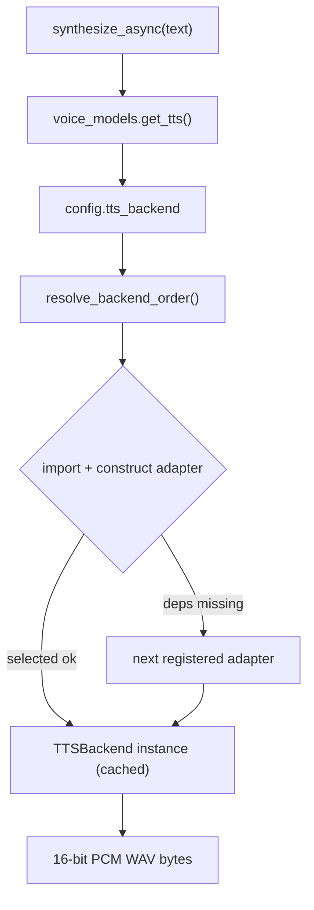

# Kokoro TTS Backend Implementation Plan

> **For agentic workers:** REQUIRED SUB-SKILL: Use superpowers:subagent-driven-development (recommended) or superpowers:executing-plans to implement this plan task-by-task. Steps use checkbox (`- [ ]`) syntax for tracking.

**Goal:** Replace Piper with neural **Kokoro-82M** as Alfred's default TTS, behind a clean **ABC-based adapter** architecture (config-selected registry) that keeps Piper as a fallback and is ready for a future Apple-Silicon MLX adapter.

**Architecture:** A `TTSBackend` **ABC port** (`tts_backend.py`) defines the `synthesize(text) -> bytes` contract. Concrete adapters — `KokoroTTS` and the refactored `PiperTTS` — subclass it. A registry (`tts_registry.py`) maps a config name → adapter; `voice_models.get_tts()` selects the configured adapter and falls back if its optional deps are missing. Both adapters download their models from the **Hugging Face Hub** (pinned revisions) via a shared `hf_models.ensure_model()` helper. `KokoroTTS` wraps `kokoro-onnx` (one ONNX graph: CPU EP on macOS, CUDA EP on the RTX 4090) and returns 16-bit PCM WAV bytes — the exact contract Piper already returns, so satellite/web/iOS voice paths are untouched.

**Tech Stack:** Python 3.13, `kokoro-onnx` (StyleTTS2/ISTFTNet ONNX), `phonemizer-fork` + `espeakng_loader` (g2p — no misaki/spaCy/torch), `onnxruntime` (CPU) / `onnxruntime-gpu` (CUDA), `huggingface_hub`, `numpy`, stdlib `wave`/`abc`. uv, ruff, mypy --strict, pytest.

## Global Constraints

- **Python 3.13+ only**; `uv` for packages (never pip); `ruff` format + check (line-length 100); `mypy --strict` clean on `bus/ core/ domains/ evals/ runner/ sdk/ shared/ telemetry/`; `pytest` green.
- **Adapter architecture (ABC port):** every backend subclasses `core.voice.tts_backend.TTSBackend` (`@abstractmethod synthesize(self, text: str) -> bytes`). The channels process depends on the ABC/registry, never a concrete engine. Adding a backend = one adapter class + one registry entry, no caller edits.
- **Default backend `kokoro`, default voice `am_michael`**; Piper selectable via `ALFRED_TTS_BACKEND=piper`.
- **Output contract unchanged:** `synthesize` returns 16-bit PCM mono WAV bytes (starts `b"RIFF"`).
- **Model download via Hugging Face Hub** (`hf_hub_download`, pinned revision) for **both** backends, through the shared `hf_models.ensure_model()`:
  - Kokoro → `fastrtc/kokoro-onnx` @ `8d07950c9b6c87ce6809e9bba7bd494336217c2a` (`kokoro-v1.0.onnx`, `voices-v1.0.bin`).
  - Piper → `rhasspy/piper-voices` @ `5b44ec7bab7c5822cfec48fbd5aa99db71a823d6` (`en/en_GB/alan/medium/en_GB-alan-medium.onnx` + `.onnx.json`).
- **No `misaki`/`soundfile`:** kokoro-onnx phonemizes via `phonemizer-fork` directly; WAV wrapping uses stdlib `wave`.
- **espeak wiring deterministic:** explicit `EspeakConfig(lib_path=espeakng_loader.get_library_path(), data_path=espeakng_loader.get_data_path())`; no ambient espeak env vars.
- **Provider explicit:** `KokoroTTS` sets the `ONNX_PROVIDER` env var kokoro-onnx honours. `auto` → CUDA when `onnxruntime.get_available_providers()` exposes it, else CPU. `onnxruntime`/`onnxruntime-gpu` are mutually exclusive (CPU in the extra; 4090 swaps).
- **Branch** `feat/kokoro-tts-backend` (this worktree); PR-only; conventional-commit PR title; squash-only; never `[skip ci]`.
- **Docs are part of the change:** `docs/voice.md` (new), `docs/architecture.md`, `docs/PRD.md`, root + `core/CLAUDE.md` gotchas, satellite docstring.

**Verified reference values (M4 Max, Python 3.13, macOS 26):**
- `kokoro-onnx==0.5.0` deps: `espeakng-loader`, `numpy`, `onnxruntime`, `phonemizer-fork` (no misaki). `Kokoro(model_path, voices_path, espeak_config=None)`; `Kokoro.create(text, voice, speed=1.0, lang="en-us") -> (float32 ndarray, 24000)`; `EspeakConfig(lib_path=None, data_path=None)`; provider via env `ONNX_PROVIDER`.
- End-to-end proof: explicit `EspeakConfig` + `create("Good evening, sir. …", voice="am_michael")` → 0.63 s / 3.37 s audio (RTF 0.188), valid float32 WAV.
- HF assets verified HTTP 200; Kokoro `kokoro-v1.0.onnx` ~325 MB + `voices-v1.0.bin` ~28 MB; Piper `.onnx.json` path present.

---

## Setup (once, before Task 1)

- [ ] **Create the venv + install current extras**

```bash
cd /Users/anirudhlath/code/private/alfred/alfred/.worktrees/kokoro-tts
uv venv --python 3.13
uv pip install -e ".[dev,memory,voice,integrations]"
```

Expected: venv at `.venv/`, install succeeds. (Kokoro deps land in Task 2 — re-run install then.)

- [ ] **Baseline suite green**

Run: `.venv/bin/python -m pytest tests/core/voice/test_tts.py -q`
Expected: PASS.

---

## Task 1: Config settings for TTS backend selection

**Files:** Modify `shared/config.py`; Test `tests/shared/test_config_tts.py`.

**Interfaces:** Produces `AlfredConfig.tts_backend` (`"kokoro"`), `.kokoro_voice` (`"am_michael"`), `.kokoro_speed` (`1.0`), `.kokoro_onnx_provider` (`"auto"`), env-overridable.

- [ ] **Step 1: Write the failing test** — create `tests/shared/test_config_tts.py`:

```python
"""Tests for TTS backend config fields."""

from __future__ import annotations

from shared.config import AlfredConfig


def test_tts_defaults() -> None:
    cfg = AlfredConfig()
    assert cfg.tts_backend == "kokoro"
    assert cfg.kokoro_voice == "am_michael"
    assert cfg.kokoro_speed == 1.0
    assert cfg.kokoro_onnx_provider == "auto"


def test_tts_from_env(monkeypatch) -> None:  # type: ignore[no-untyped-def]
    monkeypatch.setenv("ALFRED_TTS_BACKEND", "piper")
    monkeypatch.setenv("KOKORO_VOICE", "bm_george")
    monkeypatch.setenv("KOKORO_SPEED", "1.2")
    monkeypatch.setenv("KOKORO_ONNX_PROVIDER", "cpu")
    cfg = AlfredConfig.from_env()
    assert cfg.tts_backend == "piper"
    assert cfg.kokoro_voice == "bm_george"
    assert cfg.kokoro_speed == 1.2
    assert cfg.kokoro_onnx_provider == "cpu"
```

- [ ] **Step 2: Run — verify fail**

Run: `.venv/bin/python -m pytest tests/shared/test_config_tts.py -q` → FAIL (`AttributeError: tts_backend`).

- [ ] **Step 3: Add the fields** — in `shared/config.py`, after `voice_confidence_threshold: float = 0.85`:

```python
    # Phase 3: Voice — TTS backend (see docs/voice.md)
    tts_backend: str = "kokoro"  # kokoro | piper
    kokoro_voice: str = "am_michael"
    kokoro_speed: float = 1.0
    kokoro_onnx_provider: str = "auto"  # auto | cpu | cuda | coreml
```

In `from_env`, after the `voice_confidence_threshold=...` line:

```python
            tts_backend=os.getenv("ALFRED_TTS_BACKEND", "kokoro"),
            kokoro_voice=os.getenv("KOKORO_VOICE", "am_michael"),
            kokoro_speed=float(os.getenv("KOKORO_SPEED", "1.0")),
            kokoro_onnx_provider=os.getenv("KOKORO_ONNX_PROVIDER", "auto"),
```

- [ ] **Step 4: Run — verify pass** → `.venv/bin/python -m pytest tests/shared/test_config_tts.py -q` → PASS.

- [ ] **Step 5: Commit**

```bash
git add shared/config.py tests/shared/test_config_tts.py
git commit -m "feat(voice): add TTS backend + Kokoro config settings"
```

---

## Task 2: Voice extra dependencies (add Kokoro + HF Hub, drop misaki)

**Files:** Modify `pyproject.toml`, `.env.example`.

**Interfaces:** Produces `kokoro_onnx`, `espeakng_loader`, `phonemizer` (via phonemizer-fork), `onnxruntime`, `huggingface_hub`, `numpy` importable in the `voice` extra.

- [ ] **Step 1: Edit the `voice` extra** — replace the `voice = [...]` group:

```toml
voice = [
    "faster-whisper>=1.0",
    "piper-tts>=1.2",
    "kokoro-onnx>=0.5,<0.6",
    "espeakng_loader>=0.2.4,<0.3",
    "phonemizer-fork>=3.3,<3.4",
    "onnxruntime>=1.27",
    "huggingface_hub>=0.24",
    "pysilero-vad>=3.4",
    "speechbrain>=1.1",
    "numpy>=1.26",  # speaker_id.py + tts_kokoro.py import it directly
]
```

(GPU note — not an installed extra: on the 4090, `uv pip uninstall onnxruntime && uv pip install onnxruntime-gpu`. `onnxruntime`/`onnxruntime-gpu` cannot coexist. Documented in `docs/voice.md`. Do NOT add `misaki`/`soundfile`.)

- [ ] **Step 2: `.env.example`** — after `VOICE_CONFIDENCE_THRESHOLD=0.85`:

```bash
# TTS backend selection (kokoro | piper). Kokoro-82M is the default neural voice.
ALFRED_TTS_BACKEND=kokoro
# Kokoro voice id (catalogue in docs/voice.md)
KOKORO_VOICE=am_michael
# Kokoro speech rate (1.0 = natural)
KOKORO_SPEED=1.0
# ONNX execution provider: auto | cpu | cuda | coreml (auto → CUDA on the 4090, else CPU)
KOKORO_ONNX_PROVIDER=auto
```

- [ ] **Step 3: Install + verify imports**

```bash
uv pip install -e ".[dev,memory,voice,integrations]"
.venv/bin/python -c "import kokoro_onnx, espeakng_loader, onnxruntime, huggingface_hub, numpy; print('ok', kokoro_onnx.SAMPLE_RATE)"
```
Expected: `ok 24000`.

- [ ] **Step 4: Commit**

```bash
git add pyproject.toml .env.example uv.lock
git commit -m "build(voice): add Kokoro + huggingface_hub deps, drop misaki"
```

---

## Task 3: TTSBackend ABC port

**Files:** Create `core/voice/tts_backend.py`; Test `tests/core/voice/test_tts_backend.py`.

**Interfaces:** Produces `TTSBackend(ABC)` with `@abstractmethod synthesize(self, text: str) -> bytes`.

- [ ] **Step 1: Write the failing test** — create `tests/core/voice/test_tts_backend.py`:

```python
"""Tests for the TTSBackend ABC port."""

from __future__ import annotations

import pytest

from core.voice.tts_backend import TTSBackend


def test_cannot_instantiate_abstract() -> None:
    with pytest.raises(TypeError):
        TTSBackend()  # type: ignore[abstract]


def test_subclass_missing_method_is_abstract() -> None:
    class Bad(TTSBackend):
        pass

    with pytest.raises(TypeError):
        Bad()  # type: ignore[abstract]


def test_concrete_subclass_works() -> None:
    class Dummy(TTSBackend):
        def synthesize(self, text: str) -> bytes:
            return b"RIFF" + text.encode()

    d = Dummy()
    assert isinstance(d, TTSBackend)
    assert d.synthesize("hi") == b"RIFFhi"
```

- [ ] **Step 2: Run — verify fail** → FAIL (`ModuleNotFoundError: core.voice.tts_backend`).

- [ ] **Step 3: Create the port** — `core/voice/tts_backend.py`:

```python
"""TTSBackend — the abstract port every TTS adapter implements.

The channels process depends only on this abstraction, never on a concrete
engine. New backends (Kokoro, Piper, a future Apple-Silicon MLX adapter) subclass
this and register in ``core.voice.tts_registry`` with no caller changes.
"""

from __future__ import annotations

from abc import ABC, abstractmethod


class TTSBackend(ABC):
    """Adapter port for local text-to-speech."""

    @abstractmethod
    def synthesize(self, text: str) -> bytes:
        """Synthesize ``text`` to 16-bit PCM mono WAV bytes."""
        raise NotImplementedError
```

- [ ] **Step 4: Run — verify pass** → PASS.

- [ ] **Step 5: Commit**

```bash
git add core/voice/tts_backend.py tests/core/voice/test_tts_backend.py
git commit -m "feat(voice): add TTSBackend ABC port"
```

---

## Task 4: Shared Hugging Face model downloader

**Files:** Create `core/voice/hf_models.py`; Test `tests/core/voice/test_hf_models.py`.

**Interfaces:** Produces `ensure_model(repo_id: str, filename: str, revision: str) -> Path` (wraps `hf_hub_download`, returns local cached path).

- [ ] **Step 1: Write the failing test** — create `tests/core/voice/test_hf_models.py`:

```python
"""Tests for the shared HF Hub model downloader."""

from __future__ import annotations

from pathlib import Path

import core.voice.hf_models as hf


def test_ensure_model_delegates_to_hf(monkeypatch, tmp_path: Path) -> None:  # type: ignore[no-untyped-def]
    calls: dict[str, str] = {}

    def fake_download(repo_id: str, filename: str, revision: str) -> str:
        calls.update(repo_id=repo_id, filename=filename, revision=revision)
        dest = tmp_path / filename.replace("/", "_")
        dest.write_bytes(b"x")
        return str(dest)

    monkeypatch.setattr("huggingface_hub.hf_hub_download", fake_download)
    out = hf.ensure_model("some/repo", "a/b.onnx", "deadbeef")
    assert out == tmp_path / "a_b.onnx"
    assert calls == {"repo_id": "some/repo", "filename": "a/b.onnx", "revision": "deadbeef"}
```

- [ ] **Step 2: Run — verify fail** → FAIL (`ModuleNotFoundError`).

- [ ] **Step 3: Create the helper** — `core/voice/hf_models.py`:

```python
"""Shared Hugging Face Hub model downloader for the voice backends."""

from __future__ import annotations

from pathlib import Path


def ensure_model(repo_id: str, filename: str, revision: str) -> Path:
    """Download (cached) a model file from the HF Hub, pinned to ``revision``.

    Wraps ``huggingface_hub.hf_hub_download`` — the local cache
    (``~/.cache/huggingface/hub``), resume, and integrity are handled for us.
    Returns the local path to the file.
    """
    from huggingface_hub import hf_hub_download

    return Path(hf_hub_download(repo_id=repo_id, filename=filename, revision=revision))
```

- [ ] **Step 4: Run — verify pass** → PASS.

- [ ] **Step 5: Commit**

```bash
git add core/voice/hf_models.py tests/core/voice/test_hf_models.py
git commit -m "feat(voice): add shared HF Hub model downloader"
```

---

## Task 5: TTS backend registry

**Files:** Create `core/voice/tts_registry.py`; Test `tests/core/voice/test_tts_registry.py`.

**Interfaces:** Consumes `TTSBackend`. Produces `TTS_BACKENDS: dict[str, tuple[str, str, str]]`, `DEFAULT_TTS_BACKEND = "kokoro"`, `resolve_backend_order(selected: str) -> list[str]`.

- [ ] **Step 1: Write the failing test** — create `tests/core/voice/test_tts_registry.py`:

```python
"""Tests for the TTS backend registry."""

from __future__ import annotations

from core.voice.tts_registry import (
    DEFAULT_TTS_BACKEND,
    TTS_BACKENDS,
    resolve_backend_order,
)


def test_registry_entries() -> None:
    assert set(TTS_BACKENDS) == {"kokoro", "piper"}
    assert TTS_BACKENDS["kokoro"] == (
        "core.voice.tts_kokoro",
        "KokoroTTS",
        "kokoro-onnx not installed",
    )
    assert TTS_BACKENDS["piper"] == ("core.voice.tts", "PiperTTS", "piper-tts not installed")
    assert DEFAULT_TTS_BACKEND == "kokoro"


def test_resolve_order_selected_first() -> None:
    assert resolve_backend_order("kokoro") == ["kokoro", "piper"]
    assert resolve_backend_order("piper") == ["piper", "kokoro"]


def test_resolve_order_unknown_uses_default() -> None:
    order = resolve_backend_order("bogus")
    assert order[0] == DEFAULT_TTS_BACKEND
    assert set(order) == {"kokoro", "piper"}
```

- [ ] **Step 2: Run — verify fail** → FAIL (`ModuleNotFoundError`).

- [ ] **Step 3: Create the registry** — `core/voice/tts_registry.py`:

```python
"""TTS backend registry — the single source of truth for selectable adapters.

Adding a backend is one entry here (module + class as strings, so importing this
module pulls in no heavy optional deps) plus a ``TTSBackend`` subclass. Selection
is config-driven via ``AlfredConfig.tts_backend`` (see ``core.channels.voice_models``).
"""

from __future__ import annotations

from loguru import logger

# name -> (module, class_name, missing_dep_msg)
TTS_BACKENDS: dict[str, tuple[str, str, str]] = {
    "kokoro": ("core.voice.tts_kokoro", "KokoroTTS", "kokoro-onnx not installed"),
    "piper": ("core.voice.tts", "PiperTTS", "piper-tts not installed"),
}

DEFAULT_TTS_BACKEND = "kokoro"


def resolve_backend_order(selected: str) -> list[str]:
    """Return backend names to try: ``selected`` first, then the rest as fallbacks.

    An unknown name logs a warning and falls back to ``DEFAULT_TTS_BACKEND`` first.
    """
    if selected not in TTS_BACKENDS:
        logger.warning(
            "Unknown TTS backend {!r} — falling back to {!r}", selected, DEFAULT_TTS_BACKEND
        )
        selected = DEFAULT_TTS_BACKEND
    rest = [name for name in TTS_BACKENDS if name != selected]
    return [selected, *rest]
```

- [ ] **Step 4: Run — verify pass** → PASS.

- [ ] **Step 5: Commit**

```bash
git add core/voice/tts_registry.py tests/core/voice/test_tts_registry.py
git commit -m "feat(voice): add TTS backend registry"
```

---

## Task 6: KokoroTTS adapter

**Files:** Create `core/voice/tts_kokoro.py`; Test `tests/core/voice/test_tts_kokoro.py`.

**Interfaces:** Consumes `TTSBackend`, `hf_models.ensure_model`, `AlfredConfig`, `kokoro_onnx`, `espeakng_loader`, `onnxruntime`. Produces `KokoroTTS(TTSBackend)`; helpers `_build_espeak_config()`, `_resolve_provider(setting)`; constants `_KOKORO_REPO`, `_KOKORO_REVISION`, `_MODEL_FILE`, `_VOICES_FILE`.

- [ ] **Step 1: Write the failing test** — create `tests/core/voice/test_tts_kokoro.py`:

```python
"""Tests for the Kokoro TTS adapter."""

from __future__ import annotations

from unittest.mock import MagicMock, patch

import numpy as np
import pytest

from core.voice.tts_backend import TTSBackend
from core.voice.tts_kokoro import (
    _KOKORO_REPO,
    _MODEL_FILE,
    _VOICES_FILE,
    KokoroTTS,
    _resolve_provider,
)


def test_is_ttsbackend_subclass() -> None:
    assert issubclass(KokoroTTS, TTSBackend)


def test_resolve_provider_explicit() -> None:
    assert _resolve_provider("cpu") == "CPUExecutionProvider"
    assert _resolve_provider("cuda") == "CUDAExecutionProvider"
    assert _resolve_provider("coreml") == "CoreMLExecutionProvider"


def test_resolve_provider_auto_prefers_cuda() -> None:
    with patch(
        "onnxruntime.get_available_providers",
        return_value=["CUDAExecutionProvider", "CPUExecutionProvider"],
    ):
        assert _resolve_provider("auto") == "CUDAExecutionProvider"


def test_resolve_provider_auto_falls_back_to_cpu() -> None:
    with patch("onnxruntime.get_available_providers", return_value=["CPUExecutionProvider"]):
        assert _resolve_provider("auto") == "CPUExecutionProvider"


def test_repo_constant() -> None:
    assert _KOKORO_REPO == "fastrtc/kokoro-onnx"
    assert _MODEL_FILE == "kokoro-v1.0.onnx"
    assert _VOICES_FILE == "voices-v1.0.bin"


def test_synthesize_wraps_wav() -> None:
    tts = KokoroTTS.__new__(KokoroTTS)  # bypass model load
    tts._voice = "am_michael"
    tts._speed = 1.0
    mock_k = MagicMock()
    mock_k.create.return_value = (np.array([0.0, 0.5, -0.5, 1.0], dtype=np.float32), 24000)
    tts._kokoro = mock_k

    result = tts.synthesize("Hello sir")

    assert isinstance(result, bytes)
    assert result[:4] == b"RIFF"
    mock_k.create.assert_called_once_with("Hello sir", voice="am_michael", speed=1.0, lang="en-us")


def test_real_synthesis_end_to_end() -> None:
    pytest.importorskip("kokoro_onnx", reason="voice extra not installed")
    if "CI" in __import__("os").environ:
        pytest.skip("skips 353 MB model download in CI")
    wav = KokoroTTS().synthesize("Good evening, sir.")
    assert wav[:4] == b"RIFF"
    assert len(wav) > 44
```

- [ ] **Step 2: Run — verify fail** → FAIL (`ModuleNotFoundError: core.voice.tts_kokoro`).

- [ ] **Step 3: Create the adapter** — `core/voice/tts_kokoro.py`:

```python
"""KokoroTTS — neural text-to-speech via Kokoro-82M (kokoro-onnx, local ONNX)."""

from __future__ import annotations

import io
import os
import wave
from typing import TYPE_CHECKING

import numpy as np
from loguru import logger

from core.voice.hf_models import ensure_model
from core.voice.tts_backend import TTSBackend
from shared.config import AlfredConfig
from shared.traced import traced

if TYPE_CHECKING:
    from kokoro_onnx import EspeakConfig, Kokoro

# Pinned HF source (fastrtc/kokoro-onnx: kokoro-v1.0.onnx + voices-v1.0.bin, MIT).
_KOKORO_REPO = "fastrtc/kokoro-onnx"
_KOKORO_REVISION = "8d07950c9b6c87ce6809e9bba7bd494336217c2a"
_MODEL_FILE = "kokoro-v1.0.onnx"
_VOICES_FILE = "voices-v1.0.bin"

_PROVIDER_BY_SETTING = {
    "cpu": "CPUExecutionProvider",
    "cuda": "CUDAExecutionProvider",
    "coreml": "CoreMLExecutionProvider",
}


def _build_espeak_config() -> EspeakConfig:
    """Explicit espeak lib/data paths from espeakng_loader.

    Makes phonemization deterministic and immune to ambient PHONEMIZER_ESPEAK_* /
    ESPEAK_DATA_PATH env vars — the root cause of the 'phontab: No such file or
    directory' failure seen during the spike.
    """
    import espeakng_loader
    from kokoro_onnx import EspeakConfig as _EspeakConfig

    return _EspeakConfig(
        lib_path=espeakng_loader.get_library_path(),
        data_path=espeakng_loader.get_data_path(),
    )


def _resolve_provider(setting: str) -> str:
    """Map a provider setting to a concrete ONNX execution provider.

    'auto' picks CUDA when onnxruntime exposes it (the RTX 4090 deployment), else
    CPU. kokoro-onnx's own gpu auto-detect is unreliable, so we pin the provider
    via the ONNX_PROVIDER env var it honours.
    """
    if setting in _PROVIDER_BY_SETTING:
        return _PROVIDER_BY_SETTING[setting]
    import onnxruntime as ort

    if "CUDAExecutionProvider" in ort.get_available_providers():
        return "CUDAExecutionProvider"
    return "CPUExecutionProvider"


class KokoroTTS(TTSBackend):
    """Neural TTS using Kokoro-82M via kokoro-onnx.

    One ONNX graph on macOS (CPU EP) and the RTX 4090 (CUDA EP). Auto-downloads the
    model from the HF Hub on first use. Output is 16-bit PCM mono WAV bytes.
    """

    def __init__(
        self,
        voice: str | None = None,
        speed: float | None = None,
        provider: str | None = None,
    ) -> None:
        from kokoro_onnx import Kokoro as _Kokoro

        config = AlfredConfig.from_env()
        self._voice: str = voice if voice is not None else config.kokoro_voice
        self._speed: float = speed if speed is not None else config.kokoro_speed
        provider_setting = provider if provider is not None else config.kokoro_onnx_provider

        model_path = ensure_model(_KOKORO_REPO, _MODEL_FILE, _KOKORO_REVISION)
        voices_path = ensure_model(_KOKORO_REPO, _VOICES_FILE, _KOKORO_REVISION)
        os.environ["ONNX_PROVIDER"] = _resolve_provider(provider_setting)

        self._kokoro: Kokoro = _Kokoro(
            str(model_path), str(voices_path), espeak_config=_build_espeak_config()
        )
        logger.info(
            "Loaded Kokoro TTS (voice={}, speed={}, provider={})",
            self._voice,
            self._speed,
            os.environ["ONNX_PROVIDER"],
        )

    @traced(name="voice.tts.synthesize")
    def synthesize(self, text: str) -> bytes:
        """Synthesize ``text`` to 16-bit PCM mono WAV bytes."""
        samples, sample_rate = self._kokoro.create(
            text, voice=self._voice, speed=self._speed, lang="en-us"
        )
        pcm = (np.clip(samples, -1.0, 1.0) * 32767.0).astype("<i2").tobytes()

        buf = io.BytesIO()
        with wave.open(buf, "wb") as wf:
            wf.setnchannels(1)
            wf.setsampwidth(2)  # 16-bit
            wf.setframerate(sample_rate)
            wf.writeframes(pcm)
        return buf.getvalue()
```

- [ ] **Step 4: Run — verify pass** → `.venv/bin/python -m pytest tests/core/voice/test_tts_kokoro.py -q` → PASS (real-synth test skips without model / in CI).

- [ ] **Step 5: Prove the real path once (downloads ~353 MB from HF)**

```bash
.venv/bin/python -c "from core.voice.tts_kokoro import KokoroTTS; w=KokoroTTS().synthesize('Good evening, sir.'); print('WAV', len(w), w[:4])"
```
Expected: `WAV <n> b'RIFF'`.

- [ ] **Step 6: Commit**

```bash
git add core/voice/tts_kokoro.py tests/core/voice/test_tts_kokoro.py
git commit -m "feat(voice): add KokoroTTS adapter (kokoro-onnx, HF Hub)"
```

---

## Task 7: Refactor PiperTTS onto the ABC + HF Hub

**Files:** Modify `core/voice/tts.py`; Modify `tests/core/voice/test_tts.py`.

**Interfaces:** Consumes `TTSBackend`, `hf_models.ensure_model`. Produces `PiperTTS(TTSBackend)`; helper `_voice_path(voice) -> str`; `_download_model(voice) -> Path`; constants `_PIPER_REPO`, `_PIPER_REVISION`. Removes `_voice_url`, `DEFAULT_MODEL_DIR`, `urllib` download.

- [ ] **Step 1: Update the tests** — replace the `_voice_url`/`DEFAULT_MODEL_DIR`/download tests in `tests/core/voice/test_tts.py`. Replace `test_default_model_dir`, `test_voice_url_builder`, and `test_constructor_auto_downloads_missing_model` with:

```python
def test_is_ttsbackend_subclass() -> None:
    from core.voice.tts_backend import TTSBackend

    assert issubclass(PiperTTS, TTSBackend)


def test_voice_path_builder() -> None:
    from core.voice.tts import _voice_path

    assert _voice_path("en_GB-alan-medium") == "en/en_GB/alan/medium/en_GB-alan-medium"


def test_download_model_uses_hf(monkeypatch) -> None:  # type: ignore[no-untyped-def]
    from pathlib import Path

    from core.voice import tts as tts_mod

    calls: list[str] = []

    def fake_ensure(repo_id: str, filename: str, revision: str) -> Path:
        calls.append(filename)
        return Path("/tmp") / filename

    monkeypatch.setattr(tts_mod, "ensure_model", fake_ensure)
    out = tts_mod._download_model("en_GB-alan-medium")
    assert out == Path("/tmp/en/en_GB/alan/medium/en_GB-alan-medium.onnx")
    assert calls == [
        "en/en_GB/alan/medium/en_GB-alan-medium.onnx.json",
        "en/en_GB/alan/medium/en_GB-alan-medium.onnx",
    ]
```

Also change the top import `from core.voice.tts import PiperTTS, _voice_url` → `from core.voice.tts import PiperTTS`.

- [ ] **Step 2: Run — verify fail** → FAIL (`_voice_path` / `ensure_model` not present; `_voice_url` import gone).

- [ ] **Step 3: Refactor `core/voice/tts.py`** — apply these changes:

Replace the module docstring line and the imports block top (remove `urllib.request`, `wave` stays, add `Path` + `ensure_model` + `TTSBackend`):

```python
"""PiperTTS — text-to-speech using Piper (local ONNX inference), HF-Hub model."""

from __future__ import annotations

import io
import wave
from pathlib import Path
from typing import TYPE_CHECKING

from loguru import logger

from core.voice.hf_models import ensure_model
from core.voice.tts_backend import TTSBackend
from shared.traced import traced

if TYPE_CHECKING:
    from piper import PiperVoice
    from piper.config import SynthesisConfig

# Silence between sentences (samples at 22050 Hz, 16-bit mono)
_SENTENCE_PAUSE_MS = 250

# Pinned HF source for Piper voices.
_PIPER_REPO = "rhasspy/piper-voices"
_PIPER_REVISION = "5b44ec7bab7c5822cfec48fbd5aa99db71a823d6"
```

Replace `_voice_url` + `_download_model` with:

```python
def _voice_path(voice: str) -> str:
    """Map a Piper voice name to its repo-relative path (no extension).

    e.g. en_GB-alan-medium → en/en_GB/alan/medium/en_GB-alan-medium
    """
    parts = voice.split("-")
    lang_region = parts[0]  # en_GB
    lang = lang_region.split("_")[0]  # en
    speaker = parts[1]  # alan
    quality = parts[2] if len(parts) > 2 else "medium"
    return f"{lang}/{lang_region}/{speaker}/{quality}/{voice}"


def _download_model(voice: str) -> Path:
    """Fetch the Piper ONNX model + config from the HF Hub; return the .onnx path.

    Both files land in the same HF snapshot dir, so PiperVoice.load finds the
    config alongside the model.
    """
    base = _voice_path(voice)
    ensure_model(_PIPER_REPO, f"{base}.onnx.json", _PIPER_REVISION)  # config alongside
    return ensure_model(_PIPER_REPO, f"{base}.onnx", _PIPER_REVISION)
```

Change the class declaration and `__init__` model resolution:

```python
class PiperTTS(TTSBackend):
    """Text-to-speech using Piper (local, no cloud dependency).

    Fallback backend behind the TTSBackend seam. Auto-downloads voice models from
    the HF Hub on first use.
    """

    DEFAULT_VOICE = "en_GB-alan-medium"

    def __init__(
        self,
        voice: str = DEFAULT_VOICE,
        length_scale: float = 0.75,
        noise_scale: float = 0.667,
        noise_w: float = 0.3,
    ) -> None:
        from piper import PiperVoice as _PiperVoice
        from piper.config import SynthesisConfig as _SynthesisConfig

        model_path = _download_model(voice)
        self._voice: PiperVoice = _PiperVoice.load(str(model_path))
        self._sample_rate: int = 22050
        self._syn_config: SynthesisConfig = _SynthesisConfig(
            length_scale=length_scale,
            noise_scale=noise_scale,
            noise_w_scale=noise_w,
        )
        logger.info("Loaded Piper TTS voice: {}", voice)
```

(Leave the existing `synthesize` method unchanged — it already returns WAV bytes.)

- [ ] **Step 4: Run — verify pass** → `.venv/bin/python -m pytest tests/core/voice/test_tts.py -q` → PASS.

- [ ] **Step 5: Commit**

```bash
git add core/voice/tts.py tests/core/voice/test_tts.py
git commit -m "refactor(voice): PiperTTS subclasses TTSBackend + HF-Hub download"
```

---

## Task 8: Wire the registry into `voice_models.get_tts()`

**Files:** Modify `core/channels/voice_models.py`; Test `tests/core/channels/test_voice_models_tts.py`.

**Interfaces:** Consumes `AlfredConfig.tts_backend`, `tts_registry`. Produces `get_tts()` returning the configured adapter (or first available fallback, or `None`), cached under `"tts"`. `aget_tts()`/`synthesize_async()` signatures unchanged.

- [ ] **Step 1: Write the failing test** — create `tests/core/channels/test_voice_models_tts.py`:

```python
"""Tests for TTS backend selection + fallback in voice_models.get_tts()."""

from __future__ import annotations

from unittest.mock import MagicMock, patch

import core.channels.voice_models as vm


def _reset() -> None:
    vm._lazy_cache.clear()


def test_get_tts_selects_configured_backend(monkeypatch) -> None:  # type: ignore[no-untyped-def]
    _reset()
    monkeypatch.setenv("ALFRED_TTS_BACKEND", "piper")
    sentinel = object()

    def fake_import(name: str):  # type: ignore[no-untyped-def]
        mod = MagicMock()
        if name == "core.voice.tts":
            mod.PiperTTS = MagicMock(return_value=sentinel)
        return mod

    with patch("importlib.import_module", side_effect=fake_import):
        assert vm.get_tts() is sentinel
    _reset()


def test_get_tts_falls_back_when_selected_missing(monkeypatch) -> None:  # type: ignore[no-untyped-def]
    _reset()
    monkeypatch.setenv("ALFRED_TTS_BACKEND", "kokoro")
    piper = object()

    def fake_import(name: str):  # type: ignore[no-untyped-def]
        if name == "core.voice.tts_kokoro":
            raise ImportError("no kokoro")
        mod = MagicMock()
        mod.PiperTTS = MagicMock(return_value=piper)
        return mod

    with patch("importlib.import_module", side_effect=fake_import):
        assert vm.get_tts() is piper
    _reset()


def test_get_tts_all_fail_returns_none(monkeypatch) -> None:  # type: ignore[no-untyped-def]
    _reset()
    monkeypatch.setenv("ALFRED_TTS_BACKEND", "kokoro")
    with patch("importlib.import_module", side_effect=ImportError("nope")):
        assert vm.get_tts() is None
    assert vm._lazy_cache["tts"] is vm._FAILED
    _reset()
```

- [ ] **Step 2: Run — verify fail** → FAIL (current `get_tts()` hardcodes Piper, ignores env, no fallback).

- [ ] **Step 3: Rewrite `get_tts()`** — in `core/channels/voice_models.py`, replace the current `get_tts()` one-liner with:

```python
def get_tts() -> Any:
    """Lazy-load the configured TTS backend (Kokoro default; Piper fallback).

    Reads ``config.tts_backend``, tries that adapter first, then falls back to any
    other registered backend whose optional deps are installed. Returns a
    ``TTSBackend`` instance (typed Any for parity with get_stt), cached under "tts".
    """
    cached = _lazy_cache.get("tts")
    if cached is _FAILED:
        return None
    if cached is not None:
        return cached

    from shared.config import AlfredConfig

    from core.voice.tts_registry import TTS_BACKENDS, resolve_backend_order

    selected = AlfredConfig.from_env().tts_backend
    for name in resolve_backend_order(selected):
        module, cls_name, missing_msg = TTS_BACKENDS[name]
        instance = _construct_backend(module, cls_name, missing_msg)
        if instance is not None:
            _lazy_cache["tts"] = instance
            return instance
    _lazy_cache["tts"] = _FAILED
    return None


def _construct_backend(module: str, cls_name: str, missing_msg: str) -> Any:
    """Import + instantiate a TTS backend adapter; return None (logged) on failure."""
    try:
        import importlib

        mod = importlib.import_module(module)
        return getattr(mod, cls_name)()
    except ImportError:
        logger.warning("{} — {} unavailable", missing_msg, cls_name)
    except Exception as exc:
        logger.error("Failed to initialise {}: {}", cls_name, exc)
    return None
```

Update two docstrings: `aget_tts` → `"""Configured TTS backend instance (or None), constructed off the event loop."""`; `synthesize_async` → `"""Run blocking TTS synthesis in a worker thread."""`.

- [ ] **Step 4: Run — verify pass** → `.venv/bin/python -m pytest tests/core/channels/test_voice_models_tts.py tests/core/voice/ -q` → PASS.

- [ ] **Step 5: Commit**

```bash
git add core/channels/voice_models.py tests/core/channels/test_voice_models_tts.py
git commit -m "feat(voice): select TTS backend from config with fallback"
```

---

## Task 9: Cross-platform espeak smoke test + CI

**Files:** Create `tests/core/voice/test_espeak_smoke.py`, `.github/workflows/voice-smoke.yml`.

**Interfaces:** Consumes `core.voice.tts_kokoro._build_espeak_config`, `kokoro_onnx.tokenizer.Tokenizer`.

- [ ] **Step 1: Write the smoke test** — create `tests/core/voice/test_espeak_smoke.py`:

```python
"""Cross-platform espeak phonemization smoke test.

Exercises the espeak wiring KokoroTTS uses (explicit EspeakConfig from
espeakng_loader). Guards the 'phontab: No such file or directory' regression on
macOS + Linux. Does NOT download the 325 MB ONNX model.
"""

from __future__ import annotations

import pytest


def test_espeak_phonemization() -> None:
    pytest.importorskip("kokoro_onnx", reason="voice extra not installed")
    from kokoro_onnx.tokenizer import Tokenizer

    from core.voice.tts_kokoro import _build_espeak_config

    phonemes = Tokenizer(_build_espeak_config()).phonemize("Hello world, sir.", "en-us")
    assert phonemes.strip(), "espeak produced no phonemes"
```

- [ ] **Step 2: Run locally** → `.venv/bin/python -m pytest tests/core/voice/test_espeak_smoke.py -q` → PASS (e.g. `həlˈoʊ wˈɜːld …`).

- [ ] **Step 3: Add the non-gating cross-OS workflow** — create `.github/workflows/voice-smoke.yml`:

```yaml
name: voice-smoke

on:
  pull_request:
    paths:
      - "core/voice/**"
      - "core/channels/voice_models.py"
      - "pyproject.toml"
      - ".github/workflows/voice-smoke.yml"

permissions:
  contents: read

jobs:
  espeak-smoke:
    strategy:
      fail-fast: false
      matrix:
        os: [ubuntu-latest, macos-latest]
    runs-on: ${{ matrix.os }}
    timeout-minutes: 15
    steps:
      - uses: actions/checkout@34e114876b0b11c390a56381ad16ebd13914f8d5 # v4
      - uses: astral-sh/setup-uv@d4b2f3b6ecc6e67c4457f6d3e41ec42d3d0fcb86 # v5
        with:
          python-version: "3.13"
          enable-cache: true
      - run: uv sync --extra voice
      - run: uv run pytest tests/core/voice/test_espeak_smoke.py -q
```

- [ ] **Step 4: Lint the YAML** → `.venv/bin/python -c "import yaml; yaml.safe_load(open('.github/workflows/voice-smoke.yml')); print('yaml ok')"` → `yaml ok`.

- [ ] **Step 5: Commit**

```bash
git add tests/core/voice/test_espeak_smoke.py .github/workflows/voice-smoke.yml
git commit -m "test(voice): cross-platform espeak phonemization smoke + CI"
```

---

## Task 10: Documentation

**Files:** Create `docs/voice.md`; Modify `docs/architecture.md`, `docs/PRD.md`, `CLAUDE.md`, `core/CLAUDE.md`, `core/notifications/adapters/satellite.py`.

- [ ] **Step 1: Create `docs/voice.md`**

````markdown
# Voice Subsystem

Alfred's voice I/O runs **in-process in the channels process**. STT and TTS load
once, off the event loop, and are shared by every voice surface: the browser/app
WebSocket, the iOS client, and the physical Wyoming satellites. The Wyoming
protocol is only a transport for satellites — the STT/TTS engines are identical.

## Components

- **STT — `WhisperSTT`** (`core/voice/stt.py`): `faster-whisper`, `large-v3-turbo`.
  `transcribe(audio_bytes, audio_format="wav") -> str`.
- **TTS — pluggable adapter** (`core/voice/`): an **ABC port** + registry.
  Contract: `synthesize(text: str) -> bytes` (16-bit PCM mono WAV).
  - **`KokoroTTS`** (`tts_kokoro.py`) — **default**, neural Kokoro-82M via
    `kokoro-onnx`, voice `am_michael`. Apache-2.0 weights + MIT wrapper.
  - **`PiperTTS`** (`tts.py`) — fallback, `piper-tts`, `en_GB-alan-medium`.
- **Speaker ID — `SpeakerID`** (`core/voice/speaker_id.py`): ECAPA-TDNN voiceprints.

## Adapter architecture

`tts_backend.py` defines the `TTSBackend` ABC (`@abstractmethod synthesize`). The
channels process depends only on this port. Adapters subclass it; the registry
(`tts_registry.py`) maps a config name → adapter. Adding a backend is one adapter
class + one registry entry — no caller changes (a future Apple-Silicon MLX adapter
drops in the same way — see the backlog).



`get_tts()` reads `config.tts_backend`, tries that adapter first, and falls back
to any other registered adapter whose optional deps are installed.

## Configuration

| Setting | Env | Default | Purpose |
|---|---|---|---|
| `tts_backend` | `ALFRED_TTS_BACKEND` | `kokoro` | Backend (`kokoro` \| `piper`) |
| `kokoro_voice` | `KOKORO_VOICE` | `am_michael` | Kokoro voice id |
| `kokoro_speed` | `KOKORO_SPEED` | `1.0` | Speech rate |
| `kokoro_onnx_provider` | `KOKORO_ONNX_PROVIDER` | `auto` | `auto`\|`cpu`\|`cuda`\|`coreml` |

Popular voices: `am_michael`, `am_adam` (US male), `af_heart` (US female),
`bm_george` (UK male), `bf_emma` (UK female).

## Model download (Hugging Face Hub)

Both backends auto-download on first use via `hf_models.ensure_model()`
(`huggingface_hub.hf_hub_download`, cached in `~/.cache/huggingface/hub`, pinned
revision):

- **Kokoro** — `fastrtc/kokoro-onnx`: `kokoro-v1.0.onnx` (~325 MB) + `voices-v1.0.bin` (~28 MB).
- **Piper** — `rhasspy/piper-voices`: `…/en_GB-alan-medium.onnx` + `.onnx.json`.

## Execution provider (one engine, two hosts)

Kokoro is a single ONNX graph. `KokoroTTS._resolve_provider()` sets the
`ONNX_PROVIDER` env var kokoro-onnx honours:

- **macOS (M4 Max):** CPU EP. ~0.4 s per short reply (RTF ~0.11–0.19). CoreML EP is
  opt-in (`KOKORO_ONNX_PROVIDER=coreml`) — it silently FP16-converts / falls back.
- **Linux (RTX 4090):** CUDA EP. Install `onnxruntime-gpu` **instead of**
  `onnxruntime` (mutually exclusive):

  ```bash
  uv pip uninstall onnxruntime && uv pip install onnxruntime-gpu
  ```

  With `KOKORO_ONNX_PROVIDER=auto`, CUDA is chosen automatically when present.

## espeak-ng phonemization

Kokoro's g2p is `phonemizer-fork → espeak-ng` (no misaki/spaCy/torch).
`espeakng_loader` bundles espeak + data. `KokoroTTS` passes an **explicit**
`EspeakConfig(lib_path=…, data_path=…)` from `espeakng_loader`, which makes
phonemization deterministic and immune to ambient `PHONEMIZER_ESPEAK_*` /
`ESPEAK_DATA_PATH` env vars (the root cause of the spike's `phontab` error).
`tests/core/voice/test_espeak_smoke.py` guards this on macOS + Linux.

## Switching back to Piper

```bash
ALFRED_TTS_BACKEND=piper
```

No other change — satellite, web, and iOS voice go through the same seam.
````

- [ ] **Step 2: `docs/architecture.md`** —
  - Replace `        PiperTTS[PiperTTS]` with `        TTS["TTS Backend<br/>Kokoro (default) / Piper"]`.
  - Replace `    VoicePipeline --> PiperTTS` with `    VoicePipeline --> TTS`.
  - Replace the bullet `- \`PiperTTS\` (\`tts.py\`) -- wraps \`piper-tts\` for local text-to-speech. Synthesizes text to WAV audio.` with:
    ```
    - **TTS backend** (`tts_backend.py` ABC + `tts_registry.py`) -- config-selected
      neural TTS. `KokoroTTS` (`tts_kokoro.py`, Kokoro-82M via `kokoro-onnx`) is the
      default; `PiperTTS` (`tts.py`) the fallback. Both return 16-bit PCM WAV and
      auto-download from the HF Hub. See [docs/voice.md](voice.md).
    ```
  - In the satellite paragraph, change `same Whisper/Piper instances` → `same Whisper/TTS instances`.

- [ ] **Step 3: `docs/PRD.md`** — replace the voice row with:
  ```
  | Voice in the browser/app (speech-to-text, neural spoken replies) | Shipped | `docs/voice.md` |
  ```
  Bump `Capability statuses current as of **2026-07-17**.` → `**2026-07-20**.`

- [ ] **Step 4: CLAUDE.md gotchas** —
  - In `CLAUDE.md`, replace the `Piper TTS auto-downloads voice models from HuggingFace…` gotcha with:
    `- TTS is a pluggable ABC-adapter (registry \`core/voice/tts_registry.py\`, port \`tts_backend.py\`): Kokoro-82M default (\`ALFRED_TTS_BACKEND\`, voice \`am_michael\`), Piper fallback. Both auto-download from the HF Hub. See \`docs/voice.md\`.`
  - In `CLAUDE.md`, change `Voice models (Whisper/Piper) load and run via \`asyncio.to_thread\`…` → `Whisper/TTS`.
  - In `core/CLAUDE.md`, under Voice (`voice/`), replace the `tts.py` bullet with:
    ```
    - `tts_backend.py` — `TTSBackend` ABC port; `tts_registry.py` — backend registry (Kokoro default, Piper fallback)
    - `tts_kokoro.py` — KokoroTTS (neural Kokoro-82M via kokoro-onnx, `am_michael`, HF-Hub download; CPU EP mac / CUDA EP 4090)
    - `tts.py` — PiperTTS fallback (ONNX local, `en_GB-alan-medium`, HF-Hub download)
    - `hf_models.py` — shared `ensure_model()` HF-Hub downloader
    ```
  - In `core/CLAUDE.md` Gotchas, replace `Piper TTS auto-downloads voice models from HuggingFace on first use` → `TTS backends (Kokoro default, Piper fallback) auto-download from the HF Hub — see docs/voice.md`; change `voice_models.py — shared lazy Whisper/Piper/SpeakerID loaders` → `Whisper/TTS/SpeakerID`.

- [ ] **Step 5: satellite docstring** — in `core/notifications/adapters/satellite.py`, change `"""Piper-synthesized speech pushed over the satellite bridge connections."""` → `"""TTS-synthesized speech pushed over the satellite bridge connections."""`

- [ ] **Step 6: Verify** → `.venv/bin/python -c "import pathlib; [print(p,'ok') for p in ['docs/voice.md','docs/architecture.md','docs/PRD.md'] if pathlib.Path(p).exists()]"` → all `ok`; eyeball mermaid fences.

- [ ] **Step 7: Commit**

```bash
git add docs/voice.md docs/architecture.md docs/PRD.md CLAUDE.md core/CLAUDE.md core/notifications/adapters/satellite.py
git commit -m "docs(voice): document ABC TTS backend + Kokoro default"
```

---

## Task 11: MLX Mac-adapter fast-follow backlog ticket

**Files:** Create `docs/backlog/medium/kokoro-mlx-mac-adapter.md`.

- [ ] **Step 1: Write the ticket**

```markdown
# Kokoro-MLX Apple-Silicon TTS adapter (fast-follow)

**Priority:** medium
**Epic:** voice

## Summary
Add a Mac-only `KokoroMLXTTS(TTSBackend)` adapter using MLX for GPU-accelerated
Kokoro synthesis on Apple Silicon, auto-selected on macOS, ONNX+CUDA on Linux.

## Motivation / evidence
Benchmarked on the M4 Max (am_michael, warm): MLX ≈ **5–8× faster** than ONNX CPU
— short reply **0.076 s / RTF 0.019** vs 0.4 s / RTF 0.15 — with native 48 kHz
output. Both are within the sub-500 ms budget, so this is headroom, not a fix.

## Why deferred (not in the initial Kokoro change)
- `kokoro-mlx` sets `requires-python <3.13`; Alfred is 3.13+ → must **vendor** its
  MIT pure-Python inference (config/generate/istftnet/kokoro/model/modules/
  phonemize/voices ≈ 8 files; deps mlx/numpy/safetensors).
- It drags `torch` + spaCy + `en_core_web_sm` via `misaki[en]` — needs trimming.
- Its espeak init resists the standard fix (misaki re-points to a broken bundled
  dylib) — needs an `espeakng_loader` redirect to a working espeak.
- Alpha (v0.1.2, 13★, single maintainer).

## Acceptance criteria
- [ ] Vendor the MIT MLX inference under `core/voice/` (or a pinned fork) running on 3.13.
- [ ] `KokoroMLXTTS(TTSBackend)` adapter; registry entry `mlx`.
- [ ] Auto-select MLX on Apple Silicon (platform + mlx availability), ONNX on Linux.
- [ ] Resolve espeak + spaCy wiring cleanly (no monkeypatch at runtime).
- [ ] Model source `mlx-community/Kokoro-82M-bf16` via `hf_models.ensure_model`.
- [ ] Benchmark parity check + audio-quality QA vs ONNX.
```

- [ ] **Step 2: Commit**

```bash
git add docs/backlog/medium/kokoro-mlx-mac-adapter.md
git commit -m "docs(backlog): file Kokoro-MLX Mac adapter fast-follow"
```

---

## Task 12: Full local gate (ruff + mypy --strict + pytest)

- [ ] **Step 1: Format + lint** → `.venv/bin/ruff format . && .venv/bin/ruff check . --fix` → clean.
- [ ] **Step 2: Type-check** → `.venv/bin/mypy --strict bus/ core/ domains/ evals/ runner/ shared/ telemetry/ sdk/` → `Success`. Fix any gaps (`create()` unpack: `samples: NDArray[np.float32]`; `ensure_model` returns `Path`).
- [ ] **Step 3: Full suite** → `.venv/bin/python -m pytest -q` → green (heavy real-synth test skips).
- [ ] **Step 4: Commit fixes**

```bash
git add -A && git commit -m "chore(voice): satisfy ruff + mypy --strict"
```

---

## Task 13: Code-architect review

- [ ] **Step 1:** Dispatch the `feature-dev:code-architect` agent to review the branch diff against the spec — focus: ABC port cleanliness/decoupling, registry + fallback caching, `ONNX_PROVIDER` global-env side effect, HF-download determinism (pinned revisions), espeak determinism, Five Pillars + no-hardcoding.
- [ ] **Step 2:** Fix every finding; re-run Task 12's gate.
- [ ] **Step 3:** Commit → `git commit -am "refactor(voice): address code-architect review"`

---

## Task 14: Simplify pass

- [ ] **Step 1:** Run `/simplify` over the changed voice files (`tts_backend.py`, `tts_kokoro.py`, `tts.py`, `tts_registry.py`, `hf_models.py`, `voice_models.py`).
- [ ] **Step 2:** Apply every simplification; re-run Task 12's gate.
- [ ] **Step 3:** Commit → `git commit -am "refactor(voice): simplify per /simplify"`

---

## Task 15: CLAUDE.md audit

- [ ] **Step 1:** Run `/claude-md-management:claude-md-improver` to audit for stale/missing content (new modules `tts_backend.py`/`tts_kokoro.py`/`tts_registry.py`/`hf_models.py`, backend-selection + `ONNX_PROVIDER`/espeak/HF gotchas).
- [ ] **Step 2:** Apply fixes (one-line gotchas; no duplication of `docs/voice.md`).
- [ ] **Step 3:** Commit if changed → `git commit -am "docs: refresh CLAUDE.md for Kokoro TTS backend"`

---

## Task 16: QA backlog generation

- [ ] **Step 1:** Dispatch a `general-purpose` subagent to review the branch diff and create QA-backlog tickets (`docs/qa-backlog/`) per the global template for what tests can't verify — real Kokoro audio quality on Mac CPU EP, real synth on the 4090 CUDA EP, satellite/web/iOS spoken-reply parity, HF first-run auto-download, Piper-fallback (`ALFRED_TTS_BACKEND=piper`).
- [ ] **Step 2:** Verify → `ls docs/qa-backlog/ | grep -iE "kokoro|tts|voice"` → tickets present.
- [ ] **Step 3:** Commit → `git add docs/qa-backlog/ && git commit -m "docs(qa): add Kokoro TTS manual QA tickets"`

---

## Task 17: Push + open the PR

- [ ] **Step 1:** `git push -u origin feat/kokoro-tts-backend`
- [ ] **Step 2:** Open the PR (conventional-commit title → squash commit):

```bash
gh pr create \
  --title "feat(voice): neural Kokoro-82M TTS backend (ABC adapter, Piper fallback)" \
  --body "$(cat <<'EOF'
## Summary
- Neural Kokoro-82M (`am_michael`) as the default TTS, behind a `TTSBackend` ABC adapter + registry (clean, decoupled). Piper kept as a selectable fallback (`ALFRED_TTS_BACKEND=piper`), refactored onto the same ABC.
- One ONNX engine on both prod targets: CPU EP (macOS) / CUDA EP (RTX 4090), auto-selected.
- Both backends auto-download from the Hugging Face Hub (pinned revisions) via a shared helper.
- Unchanged `synthesize(text) -> bytes` seam (satellite/web/iOS untouched).
- Deterministic espeak wiring (explicit EspeakConfig) + cross-OS phonemization smoke.
- MLX Apple-Silicon adapter benchmarked (5–8× faster on Mac) and filed as a fast-follow backlog ticket.

Spec: `docs/superpowers/specs/2026-07-19-kokoro-tts-backend-design.md`
Plan: `docs/superpowers/plans/2026-07-19-kokoro-tts-backend.md`
Shelved Apple STT/TTS: #154

## Test
- `ruff` + `mypy --strict` clean; full `pytest` green.
- espeak smoke on macOS + Linux (`voice-smoke.yml`).
- Real synth verified on M4 Max (RTF ~0.19).

🤖 Generated with [Claude Code](https://claude.com/claude-code)
EOF
)"
```

- [ ] **Step 3:** Confirm CI green (`ci-ok` + `voice-smoke`); report the PR URL.

---

## Self-Review (planner)

**Spec coverage:** §4.1 ABC port + registry → Tasks 3, 5, 8. §4.2 KokoroTTS → Task 6. §4.3 HF download (both) → Task 4 (helper) + Task 6 (Kokoro) + Task 7 (Piper). §4.4 provider → Task 6. §4.5 espeak → Task 6 + Task 9. §5 files → all. §6 config → Task 1. §7 deps → Task 2. §8/§12 MLX → Task 11. §9 testing → Tasks 3–9. §10 risks → Tasks 2/4/6/9. §11 rollout → Task 1 + Task 10.

**Placeholder scan:** none — every code/doc step has literal content.

**Type consistency:** `synthesize(self, text: str) -> bytes` matches across the ABC, both adapters, and tests. `ensure_model(repo_id, filename, revision) -> Path` identical in `hf_models.py`, `tts_kokoro.py`, `tts.py`, and their tests. `_KOKORO_REPO`/`_MODEL_FILE`/`_VOICES_FILE`/`_resolve_provider`/`_build_espeak_config` consistent in `tts_kokoro.py` and its test. `_voice_path`/`_download_model`/`_PIPER_REPO` consistent in `tts.py` and its test. `TTS_BACKENDS`/`resolve_backend_order`/`DEFAULT_TTS_BACKEND` consistent across `tts_registry.py`, its test, and `voice_models.get_tts()`. `KokoroTTS`/`PiperTTS` both `issubclass(TTSBackend)`.
```
