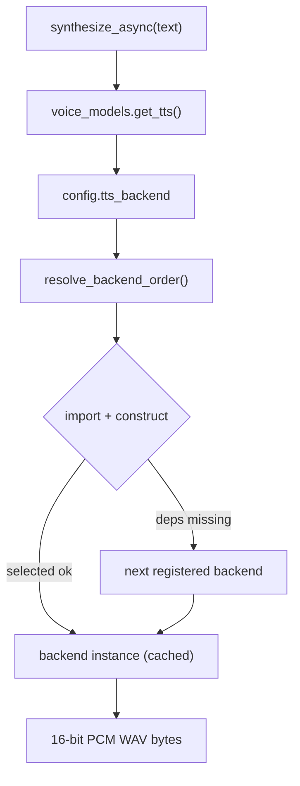

# Kokoro TTS Backend Implementation Plan

> **For agentic workers:** REQUIRED SUB-SKILL: Use superpowers:subagent-driven-development (recommended) or superpowers:executing-plans to implement this plan task-by-task. Steps use checkbox (`- [ ]`) syntax for tracking.

**Goal:** Replace Piper with neural **Kokoro-82M** as Alfred's default TTS, behind a config-selected pluggable backend registry that keeps Piper as a fallback.

**Architecture:** A `TTS_BACKENDS` registry maps a backend name → lazy import spec. `voice_models.get_tts()` reads `config.tts_backend`, constructs the selected backend, and falls back to any other registered backend whose optional deps are installed. `KokoroTTS` wraps `kokoro-onnx` (single ONNX graph: CPU EP on macOS, CUDA EP on the RTX 4090), auto-downloads the model, and returns 16-bit PCM WAV bytes — the exact contract `PiperTTS` already returns, so the satellite/web/iOS voice paths are untouched.

**Tech Stack:** Python 3.13, `kokoro-onnx` (StyleTTS2/ISTFTNet ONNX), `misaki[en]` + `espeakng_loader` + `phonemizer-fork` (g2p), `onnxruntime` (CPU) / `onnxruntime-gpu` (CUDA), `numpy`, stdlib `wave`. uv, ruff, mypy --strict, pytest.

## Global Constraints

- **Python 3.13+ only**; `uv` for packages (never pip); `ruff` format + check (line-length 100); `mypy --strict` clean on `bus/ core/ domains/ evals/ runner/ sdk/ shared/ telemetry/`; `pytest` green.
- **Default backend `kokoro`, default voice `am_michael`**; Piper selectable via `ALFRED_TTS_BACKEND=piper`.
- **Output contract is unchanged**: every backend's `synthesize(self, text: str) -> bytes` returns 16-bit PCM mono WAV bytes (starts `b"RIFF"`).
- **No hardcoding / registries over enums**: adding a backend must be one entry in `TTS_BACKENDS`, no edits to callers.
- **espeak wiring is deterministic**: pass an explicit `EspeakConfig(lib_path=espeakng_loader.get_library_path(), data_path=espeakng_loader.get_data_path())` to `Kokoro(...)`; never rely on ambient `PHONEMIZER_ESPEAK_*` / `ESPEAK_DATA_PATH` env vars (verified root cause of the spike's `phontab: No such file or directory`).
- **`onnxruntime` and `onnxruntime-gpu` are mutually exclusive**: the `voice` extra ships `onnxruntime` (CPU, Mac/dev default); the 4090 deployment swaps in `onnxruntime-gpu` (documented, not an installed extra).
- **Provider selection is explicit**: `KokoroTTS` sets the `ONNX_PROVIDER` env var kokoro-onnx honours (kokoro's own gpu auto-detect is unreliable). `auto` → CUDA when `onnxruntime.get_available_providers()` exposes it, else CPU.
- **Branch** `feat/kokoro-tts-backend` (this worktree); PR-only; PR title is a conventional-commit line; squash-only; never `[skip ci]`.
- **Docs are part of the change** (per project rules): `docs/voice.md` (new), `docs/architecture.md`, `docs/PRD.md`, root + `core/CLAUDE.md` gotchas, `core/notifications/adapters/satellite.py` docstring.

**Reference values verified live on the M4 Max (Python 3.13, macOS 26):**
- `kokoro-onnx==0.5.0`, `misaki==0.9.4`, `espeakng_loader==0.2.4`, `phonemizer-fork==3.3.2`, `onnxruntime==1.27.0`.
- `Kokoro(model_path: str, voices_path: str, espeak_config: EspeakConfig | None = None)`.
- `Kokoro.create(text, voice, speed=1.0, lang="en-us", is_phonemes=False, trim=True) -> tuple[NDArray[float32], int]` (sample rate 24000).
- `EspeakConfig(lib_path: str | None = None, data_path: str | None = None)`.
- `Tokenizer(espeak_config).phonemize(text, lang="en-us", norm=True) -> str`.
- Model assets (both HTTP 200): `https://github.com/thewh1teagle/kokoro-onnx/releases/download/model-files-v1.0/kokoro-v1.0.onnx` (~325 MB) and `.../voices-v1.0.bin` (~28 MB).
- End-to-end proof: `KokoroTTS`-equivalent construct + `create("Good evening, sir. …", voice="am_michael")` → 0.63 s synth / 3.37 s audio (RTF 0.188), finite float32, peak 0.50.

---

## Setup (once, before Task 1)

The worktree defaults to system Python — create the 3.13 venv and install the current voice extra so tests run.

- [ ] **Create the venv and install deps**

```bash
cd /Users/anirudhlath/code/private/alfred/alfred/.worktrees/kokoro-tts
uv venv --python 3.13
uv pip install -e ".[dev,memory,voice,integrations]"
```

Expected: venv at `.venv/`, install succeeds. (The Kokoro deps are added in Task 2; re-run install then.)

- [ ] **Confirm the baseline suite is green**

Run: `.venv/bin/python -m pytest tests/core/voice/test_tts.py -q`
Expected: PASS (existing Piper tests).

---

## Task 1: Config settings for TTS backend selection

**Files:**
- Modify: `shared/config.py` (add 4 fields to `AlfredConfig` + wire in `from_env`)
- Test: `tests/shared/test_config_tts.py`

**Interfaces:**
- Produces: `AlfredConfig.tts_backend: str` (default `"kokoro"`), `.kokoro_voice: str` (default `"am_michael"`), `.kokoro_speed: float` (default `1.0`), `.kokoro_onnx_provider: str` (default `"auto"`), each overridable by env `ALFRED_TTS_BACKEND` / `KOKORO_VOICE` / `KOKORO_SPEED` / `KOKORO_ONNX_PROVIDER`.

- [ ] **Step 1: Write the failing test**

Create `tests/shared/test_config_tts.py`:

```python
"""Tests for TTS backend config fields."""

from __future__ import annotations

from shared.config import AlfredConfig


def test_tts_defaults() -> None:
    cfg = AlfredConfig()
    assert cfg.tts_backend == "kokoro"
    assert cfg.kokoro_voice == "am_michael"
    assert cfg.kokoro_speed == 1.0
    assert cfg.kokoro_onnx_provider == "auto"


def test_tts_from_env(monkeypatch) -> None:  # type: ignore[no-untyped-def]
    monkeypatch.setenv("ALFRED_TTS_BACKEND", "piper")
    monkeypatch.setenv("KOKORO_VOICE", "bm_george")
    monkeypatch.setenv("KOKORO_SPEED", "1.2")
    monkeypatch.setenv("KOKORO_ONNX_PROVIDER", "cpu")
    cfg = AlfredConfig.from_env()
    assert cfg.tts_backend == "piper"
    assert cfg.kokoro_voice == "bm_george"
    assert cfg.kokoro_speed == 1.2
    assert cfg.kokoro_onnx_provider == "cpu"
```

- [ ] **Step 2: Run test to verify it fails**

Run: `.venv/bin/python -m pytest tests/shared/test_config_tts.py -q`
Expected: FAIL (`AttributeError: 'AlfredConfig' object has no attribute 'tts_backend'`).

- [ ] **Step 3: Add the fields**

In `shared/config.py`, after the `# Phase 3: Voice` block (immediately after `voice_confidence_threshold: float = 0.85`), add:

```python
    # Phase 3: Voice — TTS backend (see docs/voice.md)
    tts_backend: str = "kokoro"  # kokoro | piper
    kokoro_voice: str = "am_michael"
    kokoro_speed: float = 1.0
    kokoro_onnx_provider: str = "auto"  # auto | cpu | cuda | coreml
```

In `from_env`, after the `voice_confidence_threshold=...` line, add:

```python
            tts_backend=os.getenv("ALFRED_TTS_BACKEND", "kokoro"),
            kokoro_voice=os.getenv("KOKORO_VOICE", "am_michael"),
            kokoro_speed=float(os.getenv("KOKORO_SPEED", "1.0")),
            kokoro_onnx_provider=os.getenv("KOKORO_ONNX_PROVIDER", "auto"),
```

- [ ] **Step 4: Run test to verify it passes**

Run: `.venv/bin/python -m pytest tests/shared/test_config_tts.py -q`
Expected: PASS.

- [ ] **Step 5: Commit**

```bash
git add shared/config.py tests/shared/test_config_tts.py
git commit -m "feat(voice): add TTS backend + Kokoro config settings"
```

---

## Task 2: Add Kokoro dependencies to the voice extra

**Files:**
- Modify: `pyproject.toml` (the `voice` optional-dependency group)
- Modify: `.env.example`

**Interfaces:**
- Produces: `kokoro_onnx`, `misaki`, `espeakng_loader`, `phonemizer` (via phonemizer-fork), `onnxruntime`, `numpy` importable in the `voice` extra.

- [ ] **Step 1: Edit the `voice` extra**

In `pyproject.toml`, replace the `voice = [...]` group with:

```toml
voice = [
    "faster-whisper>=1.0",
    "piper-tts>=1.2",
    "kokoro-onnx>=0.5,<0.6",
    "misaki[en]>=0.9,<1.0",
    "espeakng_loader>=0.2.4,<0.3",
    "phonemizer-fork>=3.3,<3.4",
    "onnxruntime>=1.27",
    "pysilero-vad>=3.4",
    "speechbrain>=1.1",
    "numpy>=1.26",  # core/voice/speaker_id.py + tts_kokoro.py import it directly
]
```

(GPU note — do NOT add as an installed extra: on the RTX 4090 host, swap CPU onnxruntime for CUDA with `uv pip uninstall onnxruntime && uv pip install onnxruntime-gpu`. Documented in `docs/voice.md`. `onnxruntime` and `onnxruntime-gpu` cannot coexist.)

- [ ] **Step 2: Add env vars to `.env.example`**

In `.env.example`, immediately after the `VOICE_CONFIDENCE_THRESHOLD=0.85` line, add:

```bash
# TTS backend selection (kokoro | piper). Kokoro-82M is the default neural voice.
ALFRED_TTS_BACKEND=kokoro
# Kokoro voice id (catalogue in docs/voice.md)
KOKORO_VOICE=am_michael
# Kokoro speech rate (1.0 = natural)
KOKORO_SPEED=1.0
# ONNX execution provider: auto | cpu | cuda | coreml (auto → CUDA on the 4090, else CPU)
KOKORO_ONNX_PROVIDER=auto
```

- [ ] **Step 3: Install and verify imports**

```bash
uv pip install -e ".[dev,memory,voice,integrations]"
.venv/bin/python -c "import kokoro_onnx, espeakng_loader, misaki, onnxruntime, numpy; print('ok', kokoro_onnx.SAMPLE_RATE)"
```

Expected: `ok 24000`.

- [ ] **Step 4: Commit**

```bash
git add pyproject.toml .env.example uv.lock
git commit -m "build(voice): add Kokoro TTS dependencies to the voice extra"
```

---

## Task 3: TTS backend registry

**Files:**
- Create: `core/voice/tts_registry.py`
- Test: `tests/core/voice/test_tts_registry.py`

**Interfaces:**
- Consumes: nothing (registration imports no heavy deps — modules/classes are strings).
- Produces:
  - `TTS_BACKENDS: dict[str, tuple[str, str, str]]` — `name -> (module, class_name, missing_dep_msg)`.
  - `DEFAULT_TTS_BACKEND: str = "kokoro"`.
  - `TTSBackend` — a `@runtime_checkable` `Protocol` with `synthesize(self, text: str) -> bytes`.
  - `resolve_backend_order(selected: str) -> list[str]` — selected first, then the rest; unknown name warns and uses the default order.

- [ ] **Step 1: Write the failing test**

Create `tests/core/voice/test_tts_registry.py`:

```python
"""Tests for the TTS backend registry."""

from __future__ import annotations

from core.voice.tts_registry import (
    DEFAULT_TTS_BACKEND,
    TTS_BACKENDS,
    TTSBackend,
    resolve_backend_order,
)


def test_registry_entries() -> None:
    assert set(TTS_BACKENDS) == {"kokoro", "piper"}
    assert TTS_BACKENDS["kokoro"] == (
        "core.voice.tts_kokoro",
        "KokoroTTS",
        "kokoro-onnx not installed",
    )
    assert TTS_BACKENDS["piper"] == (
        "core.voice.tts",
        "PiperTTS",
        "piper-tts not installed",
    )
    assert DEFAULT_TTS_BACKEND == "kokoro"


def test_resolve_order_selected_first() -> None:
    assert resolve_backend_order("kokoro") == ["kokoro", "piper"]
    assert resolve_backend_order("piper") == ["piper", "kokoro"]


def test_resolve_order_unknown_uses_default() -> None:
    order = resolve_backend_order("bogus")
    assert order[0] == DEFAULT_TTS_BACKEND
    assert set(order) == {"kokoro", "piper"}


def test_piper_satisfies_protocol() -> None:
    from core.voice.tts import PiperTTS

    piper = PiperTTS.__new__(PiperTTS)  # no model load
    assert isinstance(piper, TTSBackend)
```

- [ ] **Step 2: Run test to verify it fails**

Run: `.venv/bin/python -m pytest tests/core/voice/test_tts_registry.py -q`
Expected: FAIL (`ModuleNotFoundError: core.voice.tts_registry`).

- [ ] **Step 3: Create the registry**

Create `core/voice/tts_registry.py`:

```python
"""TTS backend registry — the single source of truth for selectable TTS engines.

Adding a backend is one entry in ``TTS_BACKENDS`` (module + class as strings, so
importing this module pulls in no heavy optional deps). Backend selection is
config-driven via ``AlfredConfig.tts_backend``; see ``core.channels.voice_models``.
"""

from __future__ import annotations

from typing import Protocol, runtime_checkable

from loguru import logger

# name -> (module, class_name, missing_dep_msg)
TTS_BACKENDS: dict[str, tuple[str, str, str]] = {
    "kokoro": ("core.voice.tts_kokoro", "KokoroTTS", "kokoro-onnx not installed"),
    "piper": ("core.voice.tts", "PiperTTS", "piper-tts not installed"),
}

DEFAULT_TTS_BACKEND = "kokoro"


@runtime_checkable
class TTSBackend(Protocol):
    """Structural contract every TTS backend satisfies."""

    def synthesize(self, text: str) -> bytes:
        """Synthesize ``text`` to 16-bit PCM mono WAV bytes."""
        ...


def resolve_backend_order(selected: str) -> list[str]:
    """Return backend names to try: ``selected`` first, then the rest as fallbacks.

    An unknown name logs a warning and falls back to ``DEFAULT_TTS_BACKEND`` first.
    """
    if selected not in TTS_BACKENDS:
        logger.warning(
            "Unknown TTS backend {!r} — falling back to {!r}",
            selected,
            DEFAULT_TTS_BACKEND,
        )
        selected = DEFAULT_TTS_BACKEND
    rest = [name for name in TTS_BACKENDS if name != selected]
    return [selected, *rest]
```

- [ ] **Step 4: Run test to verify it passes**

Run: `.venv/bin/python -m pytest tests/core/voice/test_tts_registry.py -q`
Expected: PASS.

- [ ] **Step 5: Commit**

```bash
git add core/voice/tts_registry.py tests/core/voice/test_tts_registry.py
git commit -m "feat(voice): add pluggable TTS backend registry"
```

---

## Task 4: KokoroTTS component

**Files:**
- Create: `core/voice/tts_kokoro.py`
- Test: `tests/core/voice/test_tts_kokoro.py`

**Interfaces:**
- Consumes: `AlfredConfig` (voice/speed/provider defaults); `kokoro_onnx.Kokoro`, `kokoro_onnx.EspeakConfig`; `espeakng_loader`; `onnxruntime`.
- Produces:
  - `KokoroTTS` with `DEFAULT_MODEL_DIR = core/voice/models/kokoro/`, `__init__(voice=None, speed=None, provider=None, model_dir=DEFAULT_MODEL_DIR)`, and `synthesize(self, text: str) -> bytes` (16-bit PCM WAV) — satisfies `TTSBackend`.
  - Module helpers `_download_models(model_dir: Path) -> None`, `_build_espeak_config() -> EspeakConfig`, `_resolve_provider(setting: str) -> str`, plus constants `_MODEL_FILE`, `_VOICES_FILE`.

- [ ] **Step 1: Write the failing test**

Create `tests/core/voice/test_tts_kokoro.py`:

```python
"""Tests for the Kokoro TTS backend."""

from __future__ import annotations

from pathlib import Path
from unittest.mock import MagicMock, patch

import numpy as np
import pytest

from core.voice.tts_kokoro import (
    _MODEL_FILE,
    _VOICES_FILE,
    KokoroTTS,
    _download_models,
    _resolve_provider,
)


def test_default_model_dir() -> None:
    assert KokoroTTS.DEFAULT_MODEL_DIR.name == "kokoro"
    assert KokoroTTS.DEFAULT_MODEL_DIR.parent.name == "models"
    assert KokoroTTS.DEFAULT_MODEL_DIR.parent.parent.name == "voice"


def test_resolve_provider_explicit() -> None:
    assert _resolve_provider("cpu") == "CPUExecutionProvider"
    assert _resolve_provider("cuda") == "CUDAExecutionProvider"
    assert _resolve_provider("coreml") == "CoreMLExecutionProvider"


def test_resolve_provider_auto_prefers_cuda() -> None:
    with patch(
        "onnxruntime.get_available_providers",
        return_value=["CUDAExecutionProvider", "CPUExecutionProvider"],
    ):
        assert _resolve_provider("auto") == "CUDAExecutionProvider"


def test_resolve_provider_auto_falls_back_to_cpu() -> None:
    with patch("onnxruntime.get_available_providers", return_value=["CPUExecutionProvider"]):
        assert _resolve_provider("auto") == "CPUExecutionProvider"


def test_download_skips_existing(tmp_path: Path) -> None:
    (tmp_path / _MODEL_FILE).write_bytes(b"x")
    (tmp_path / _VOICES_FILE).write_bytes(b"x")
    with patch("urllib.request.urlretrieve") as mock_dl:
        _download_models(tmp_path)
        mock_dl.assert_not_called()


def test_download_fetches_missing(tmp_path: Path) -> None:
    def fake(url: str, dest: str) -> None:
        Path(dest).write_bytes(b"x")

    with patch("urllib.request.urlretrieve", side_effect=fake) as mock_dl:
        _download_models(tmp_path)
        assert mock_dl.call_count == 2


def test_synthesize_wraps_wav() -> None:
    tts = KokoroTTS.__new__(KokoroTTS)  # bypass model load
    tts._voice = "am_michael"
    tts._speed = 1.0
    mock_k = MagicMock()
    mock_k.create.return_value = (
        np.array([0.0, 0.5, -0.5, 1.0], dtype=np.float32),
        24000,
    )
    tts._kokoro = mock_k

    result = tts.synthesize("Hello sir")

    assert isinstance(result, bytes)
    assert result[:4] == b"RIFF"
    mock_k.create.assert_called_once_with(
        "Hello sir", voice="am_michael", speed=1.0, lang="en-us"
    )


def test_real_synthesis_end_to_end() -> None:
    pytest.importorskip("kokoro_onnx", reason="voice extra not installed")
    model_dir = KokoroTTS.DEFAULT_MODEL_DIR
    if not (model_dir / _MODEL_FILE).exists():
        pytest.skip("Kokoro model not downloaded (heavy — run locally)")
    wav = KokoroTTS().synthesize("Good evening, sir.")
    assert wav[:4] == b"RIFF"
    assert len(wav) > 44
```

- [ ] **Step 2: Run test to verify it fails**

Run: `.venv/bin/python -m pytest tests/core/voice/test_tts_kokoro.py -q`
Expected: FAIL (`ModuleNotFoundError: core.voice.tts_kokoro`).

- [ ] **Step 3: Create the KokoroTTS module**

Create `core/voice/tts_kokoro.py`:

```python
"""KokoroTTS — neural text-to-speech via Kokoro-82M (kokoro-onnx, local ONNX inference)."""

from __future__ import annotations

import io
import os
import urllib.request
import wave
from pathlib import Path
from typing import TYPE_CHECKING

import numpy as np
from loguru import logger

from shared.config import AlfredConfig
from shared.traced import traced

if TYPE_CHECKING:
    from kokoro_onnx import EspeakConfig, Kokoro

# Kokoro model release assets (thewh1teagle/kokoro-onnx, tag model-files-v1.0).
_MODEL_BASE = "https://github.com/thewh1teagle/kokoro-onnx/releases/download/model-files-v1.0"
_MODEL_FILE = "kokoro-v1.0.onnx"
_VOICES_FILE = "voices-v1.0.bin"

_PROVIDER_BY_SETTING = {
    "cpu": "CPUExecutionProvider",
    "cuda": "CUDAExecutionProvider",
    "coreml": "CoreMLExecutionProvider",
}


def _download_models(model_dir: Path) -> None:
    """Download the Kokoro ONNX model + voices pack on first use (idempotent)."""
    model_dir.mkdir(parents=True, exist_ok=True)
    for name in (_MODEL_FILE, _VOICES_FILE):
        dest = model_dir / name
        if dest.exists():
            continue
        url = f"{_MODEL_BASE}/{name}"
        logger.info("Downloading Kokoro model asset: {} → {}", url, dest)
        urllib.request.urlretrieve(url, str(dest))  # noqa: S310 (trusted release URL)
        logger.info("Downloaded {} ({:.1f} MB)", dest.name, dest.stat().st_size / 1e6)


def _build_espeak_config() -> EspeakConfig:
    """Explicit espeak lib/data paths from espeakng_loader.

    Passing these explicitly makes phonemization deterministic and immune to
    ambient PHONEMIZER_ESPEAK_* / ESPEAK_DATA_PATH env vars — the root cause of
    the 'phontab: No such file or directory' failure seen during the spike.
    """
    import espeakng_loader
    from kokoro_onnx import EspeakConfig as _EspeakConfig

    return _EspeakConfig(
        lib_path=espeakng_loader.get_library_path(),
        data_path=espeakng_loader.get_data_path(),
    )


def _resolve_provider(setting: str) -> str:
    """Map a provider setting to a concrete ONNX execution provider.

    'auto' picks CUDA when onnxruntime exposes it (the RTX 4090 deployment), else
    CPU. kokoro-onnx's own gpu auto-detect is unreliable (it looks up the
    hyphenated 'onnxruntime-gpu' import spec, which never resolves), so we pin the
    provider explicitly via the ONNX_PROVIDER env var it honours.
    """
    if setting in _PROVIDER_BY_SETTING:
        return _PROVIDER_BY_SETTING[setting]
    import onnxruntime as ort

    if "CUDAExecutionProvider" in ort.get_available_providers():
        return "CUDAExecutionProvider"
    return "CPUExecutionProvider"


class KokoroTTS:
    """Neural text-to-speech using Kokoro-82M via kokoro-onnx.

    A single ONNX graph runs on macOS (CPU EP) and the RTX 4090 (CUDA EP).
    Auto-downloads the model on first use. Output is 16-bit PCM mono WAV bytes —
    the same contract PiperTTS returns, so downstream playback is unchanged.
    """

    DEFAULT_MODEL_DIR = Path(__file__).resolve().parent / "models" / "kokoro"

    def __init__(
        self,
        voice: str | None = None,
        speed: float | None = None,
        provider: str | None = None,
        model_dir: Path = DEFAULT_MODEL_DIR,
    ) -> None:
        from kokoro_onnx import Kokoro as _Kokoro

        config = AlfredConfig.from_env()
        self._voice: str = voice if voice is not None else config.kokoro_voice
        self._speed: float = speed if speed is not None else config.kokoro_speed
        provider_setting = provider if provider is not None else config.kokoro_onnx_provider

        _download_models(model_dir)
        os.environ["ONNX_PROVIDER"] = _resolve_provider(provider_setting)

        self._kokoro: Kokoro = _Kokoro(
            str(model_dir / _MODEL_FILE),
            str(model_dir / _VOICES_FILE),
            espeak_config=_build_espeak_config(),
        )
        logger.info(
            "Loaded Kokoro TTS (voice={}, speed={}, provider={})",
            self._voice,
            self._speed,
            os.environ["ONNX_PROVIDER"],
        )

    @traced(name="voice.tts.synthesize")
    def synthesize(self, text: str) -> bytes:
        """Synthesize ``text`` to 16-bit PCM mono WAV bytes."""
        samples, sample_rate = self._kokoro.create(
            text, voice=self._voice, speed=self._speed, lang="en-us"
        )
        pcm = (np.clip(samples, -1.0, 1.0) * 32767.0).astype("<i2").tobytes()

        buf = io.BytesIO()
        with wave.open(buf, "wb") as wf:
            wf.setnchannels(1)
            wf.setsampwidth(2)  # 16-bit
            wf.setframerate(sample_rate)
            wf.writeframes(pcm)
        return buf.getvalue()
```

- [ ] **Step 4: Run tests to verify they pass**

Run: `.venv/bin/python -m pytest tests/core/voice/test_tts_kokoro.py -q`
Expected: PASS (the `test_real_synthesis_end_to_end` case skips unless the model is present).

- [ ] **Step 5: Prove the real path once (optional but recommended — downloads ~353 MB)**

```bash
.venv/bin/python -c "from core.voice.tts_kokoro import KokoroTTS; w=KokoroTTS().synthesize('Good evening, sir.'); print('WAV bytes:', len(w), w[:4])"
```

Expected: `WAV bytes: <n> b'RIFF'`. (First run downloads the model into `core/voice/models/kokoro/`, which is gitignored.)

- [ ] **Step 6: Commit**

```bash
git add core/voice/tts_kokoro.py tests/core/voice/test_tts_kokoro.py
git commit -m "feat(voice): add KokoroTTS neural backend (kokoro-onnx)"
```

---

## Task 5: Wire the registry into `voice_models.get_tts()`

**Files:**
- Modify: `core/channels/voice_models.py` (rewrite `get_tts()`, add `_construct_backend()`, update `aget_tts`/`synthesize_async` docstrings)
- Test: `tests/core/channels/test_voice_models_tts.py`

**Interfaces:**
- Consumes: `AlfredConfig.tts_backend`; `core.voice.tts_registry.TTS_BACKENDS`, `resolve_backend_order`.
- Produces: `get_tts()` returns the configured backend instance (or the first available fallback, or `None`), cached under the `"tts"` key. `aget_tts()` and `synthesize_async()` signatures unchanged.

- [ ] **Step 1: Write the failing test**

Create `tests/core/channels/test_voice_models_tts.py`:

```python
"""Tests for TTS backend selection + fallback in voice_models.get_tts()."""

from __future__ import annotations

from unittest.mock import MagicMock, patch

import core.channels.voice_models as vm


def _reset() -> None:
    vm._lazy_cache.clear()


def test_get_tts_selects_configured_backend(monkeypatch) -> None:  # type: ignore[no-untyped-def]
    _reset()
    monkeypatch.setenv("ALFRED_TTS_BACKEND", "piper")
    sentinel = object()

    def fake_import(name: str):  # type: ignore[no-untyped-def]
        mod = MagicMock()
        if name == "core.voice.tts":
            mod.PiperTTS = MagicMock(return_value=sentinel)
        return mod

    with patch("importlib.import_module", side_effect=fake_import):
        assert vm.get_tts() is sentinel


def test_get_tts_falls_back_when_selected_missing(monkeypatch) -> None:  # type: ignore[no-untyped-def]
    _reset()
    monkeypatch.setenv("ALFRED_TTS_BACKEND", "kokoro")
    piper = object()

    def fake_import(name: str):  # type: ignore[no-untyped-def]
        if name == "core.voice.tts_kokoro":
            raise ImportError("no kokoro")
        mod = MagicMock()
        mod.PiperTTS = MagicMock(return_value=piper)
        return mod

    with patch("importlib.import_module", side_effect=fake_import):
        assert vm.get_tts() is piper


def test_get_tts_all_fail_returns_none(monkeypatch) -> None:  # type: ignore[no-untyped-def]
    _reset()
    monkeypatch.setenv("ALFRED_TTS_BACKEND", "kokoro")
    with patch("importlib.import_module", side_effect=ImportError("nope")):
        assert vm.get_tts() is None
    assert vm._lazy_cache["tts"] is vm._FAILED
    _reset()
```

- [ ] **Step 2: Run test to verify it fails**

Run: `.venv/bin/python -m pytest tests/core/channels/test_voice_models_tts.py -q`
Expected: FAIL (current `get_tts()` hardcodes Piper and ignores `ALFRED_TTS_BACKEND`; the fallback test fails).

- [ ] **Step 3: Rewrite `get_tts()`**

In `core/channels/voice_models.py`, replace the current `get_tts()` (the `_lazy_load("tts", ...)` one-liner) with:

```python
def get_tts() -> Any:
    """Lazy-load the configured TTS backend (Kokoro default; Piper fallback).

    Reads ``config.tts_backend``, tries that backend first, then falls back to any
    other registered backend whose optional deps are installed. Caches the
    resolved instance under the shared ``"tts"`` key.
    """
    cached = _lazy_cache.get("tts")
    if cached is _FAILED:
        return None
    if cached is not None:
        return cached

    from shared.config import AlfredConfig

    from core.voice.tts_registry import TTS_BACKENDS, resolve_backend_order

    selected = AlfredConfig.from_env().tts_backend
    for name in resolve_backend_order(selected):
        module, cls_name, missing_msg = TTS_BACKENDS[name]
        instance = _construct_backend(module, cls_name, missing_msg)
        if instance is not None:
            _lazy_cache["tts"] = instance
            return instance
    _lazy_cache["tts"] = _FAILED
    return None


def _construct_backend(module: str, cls_name: str, missing_msg: str) -> Any:
    """Import + instantiate a TTS backend; return None (logged) on failure."""
    try:
        import importlib

        mod = importlib.import_module(module)
        return getattr(mod, cls_name)()
    except ImportError:
        logger.warning("{} — {} unavailable", missing_msg, cls_name)
    except Exception as exc:
        logger.error("Failed to initialise {}: {}", cls_name, exc)
    return None
```

Then update two docstrings for accuracy (behaviour unchanged):
- `aget_tts`: change `"""PiperTTS instance (or None), constructed off the event loop."""` → `"""Configured TTS backend instance (or None), constructed off the event loop."""`
- `synthesize_async`: change `"""Run blocking Piper synthesis in a worker thread."""` → `"""Run blocking TTS synthesis in a worker thread."""`

- [ ] **Step 4: Run tests to verify they pass**

Run: `.venv/bin/python -m pytest tests/core/channels/test_voice_models_tts.py -q`
Expected: PASS.

- [ ] **Step 5: Guard against regressions in the wider voice suite**

Run: `.venv/bin/python -m pytest tests/core/voice/ tests/core/channels/test_voice_models_tts.py -q`
Expected: PASS.

- [ ] **Step 6: Commit**

```bash
git add core/channels/voice_models.py tests/core/channels/test_voice_models_tts.py
git commit -m "feat(voice): select TTS backend from config with fallback"
```

---

## Task 6: Cross-platform espeak phonemization smoke test + CI

**Files:**
- Create: `tests/core/voice/test_espeak_smoke.py`
- Create: `.github/workflows/voice-smoke.yml`

**Interfaces:**
- Consumes: `core.voice.tts_kokoro._build_espeak_config`; `kokoro_onnx.tokenizer.Tokenizer`.
- Produces: a phonemization smoke test that runs in the normal suite (Linux `python` CI job, `--all-extras`) and in a dedicated **non-gating** macOS+Linux workflow.

- [ ] **Step 1: Write the smoke test**

Create `tests/core/voice/test_espeak_smoke.py`:

```python
"""Cross-platform espeak phonemization smoke test.

Exercises exactly the espeak wiring KokoroTTS uses (explicit EspeakConfig from
espeakng_loader). Guards against the 'phontab: No such file or directory'
regression on macOS and Linux. Does NOT download the 325 MB ONNX model.
"""

from __future__ import annotations

import pytest


def test_espeak_phonemization() -> None:
    pytest.importorskip("kokoro_onnx", reason="voice extra not installed")
    from kokoro_onnx.tokenizer import Tokenizer

    from core.voice.tts_kokoro import _build_espeak_config

    phonemes = Tokenizer(_build_espeak_config()).phonemize("Hello world, sir.", "en-us")
    assert phonemes.strip(), "espeak produced no phonemes"
```

- [ ] **Step 2: Run it locally**

Run: `.venv/bin/python -m pytest tests/core/voice/test_espeak_smoke.py -q`
Expected: PASS (produces e.g. `həlˈoʊ wˈɜːld …`).

- [ ] **Step 3: Add the non-gating cross-OS workflow**

Create `.github/workflows/voice-smoke.yml` (uses the same pinned action SHAs as `ci.yml`; NOT wired into the `ci-ok` gate — informational cross-OS espeak coverage without a 325 MB download):

```yaml
name: voice-smoke

on:
  pull_request:
    paths:
      - "core/voice/**"
      - "core/channels/voice_models.py"
      - "pyproject.toml"
      - ".github/workflows/voice-smoke.yml"

permissions:
  contents: read

jobs:
  espeak-smoke:
    strategy:
      fail-fast: false
      matrix:
        os: [ubuntu-latest, macos-latest]
    runs-on: ${{ matrix.os }}
    timeout-minutes: 15
    steps:
      - uses: actions/checkout@34e114876b0b11c390a56381ad16ebd13914f8d5 # v4
      - uses: astral-sh/setup-uv@d4b2f3b6ecc6e67c4457f6d3e41ec42d3d0fcb86 # v5
        with:
          python-version: "3.13"
          enable-cache: true
      - run: uv sync --extra voice
      - run: uv run pytest tests/core/voice/test_espeak_smoke.py -q
```

- [ ] **Step 4: Lint the workflow YAML**

Run: `.venv/bin/python -c "import yaml; yaml.safe_load(open('.github/workflows/voice-smoke.yml')); print('yaml ok')"`
Expected: `yaml ok`.

- [ ] **Step 5: Commit**

```bash
git add tests/core/voice/test_espeak_smoke.py .github/workflows/voice-smoke.yml
git commit -m "test(voice): add cross-platform espeak phonemization smoke + CI"
```

---

## Task 7: Documentation

**Files:**
- Create: `docs/voice.md`
- Modify: `docs/architecture.md` (mermaid node + prose bullet)
- Modify: `docs/PRD.md` (voice capability row + "statuses current as of" date)
- Modify: `CLAUDE.md` and `core/CLAUDE.md` (Piper gotchas → backend registry reality)
- Modify: `core/notifications/adapters/satellite.py` (docstring)

**Interfaces:** none (docs only). No test — verified by review + a link/lint check.

- [ ] **Step 1: Create `docs/voice.md`**

Create `docs/voice.md`:

````markdown
# Voice Subsystem

Alfred's voice I/O runs **in-process in the channels process**. Speech-to-text
(STT) and text-to-speech (TTS) load once, off the event loop, and are shared by
every voice surface: the browser/app WebSocket, the iOS client, and the physical
Wyoming satellites. The Wyoming protocol is only a transport for satellites — the
STT/TTS engines are the same in all cases.

## Components

- **STT — `WhisperSTT`** (`core/voice/stt.py`): `faster-whisper` (CTranslate2),
  model `large-v3-turbo`. Contract: `transcribe(audio_bytes, audio_format="wav") -> str`.
- **TTS — pluggable backend** (`core/voice/`): selected at runtime from a registry.
  Contract: `synthesize(text: str) -> bytes` (16-bit PCM mono WAV).
  - **`KokoroTTS`** (`tts_kokoro.py`) — **default**. Neural Kokoro-82M via
    `kokoro-onnx`, default voice `am_michael`. Apache-2.0 weights + MIT wrapper.
  - **`PiperTTS`** (`tts.py`) — fallback. `piper-tts`, voice `en_GB-alan-medium`.
- **Speaker ID — `SpeakerID`** (`core/voice/speaker_id.py`): ECAPA-TDNN voiceprints.

## TTS backend selection

The registry (`core/voice/tts_registry.py`) maps a backend name to a lazy import
spec. Adding a backend is one entry — no caller changes (registries-over-enums).



`get_tts()` reads `config.tts_backend`, tries that backend first, and falls back
to any other registered backend whose optional deps are installed — so a
Kokoro-less install still gets Piper, and vice-versa.

## Configuration

| Setting (`shared/config.py`) | Env | Default | Purpose |
|---|---|---|---|
| `tts_backend` | `ALFRED_TTS_BACKEND` | `kokoro` | Backend (`kokoro` \| `piper`) |
| `kokoro_voice` | `KOKORO_VOICE` | `am_michael` | Kokoro voice id |
| `kokoro_speed` | `KOKORO_SPEED` | `1.0` | Speech rate |
| `kokoro_onnx_provider` | `KOKORO_ONNX_PROVIDER` | `auto` | `auto` \| `cpu` \| `cuda` \| `coreml` |

Popular Kokoro voices: `am_michael`, `am_adam` (US male), `af_heart`, `af_bella`
(US female), `bm_george` (UK male), `bf_emma` (UK female). Full list ships in the
voices pack.

## Model download

`KokoroTTS` auto-downloads on first use into `core/voice/models/kokoro/`
(gitignored), mirroring Piper:

- `kokoro-v1.0.onnx` (~325 MB, fp32)
- `voices-v1.0.bin` (~28 MB)

Source: `thewh1teagle/kokoro-onnx` GitHub release `model-files-v1.0`. For the
satellite Pis, an int8 model (~80 MB) is documented as future work.

## Execution provider (one engine, two hosts)

Kokoro is a single ONNX graph; only the execution provider differs per host.
`KokoroTTS._resolve_provider()` sets the `ONNX_PROVIDER` env var kokoro-onnx
honours (kokoro's own gpu auto-detect is unreliable):

- **macOS (M4 Max):** CPU EP (`onnxruntime`). ~0.4 s per short reply (RTF ~0.11–0.19).
  CoreML EP is opt-in only (`KOKORO_ONNX_PROVIDER=coreml`) — it silently converts to
  FP16 / falls back on unsupported ops, so it is off by default.
- **Linux (RTX 4090):** CUDA EP. Install `onnxruntime-gpu` **instead of**
  `onnxruntime` (they are mutually exclusive):

  ```bash
  uv pip uninstall onnxruntime
  uv pip install onnxruntime-gpu
  ```

  With `KOKORO_ONNX_PROVIDER=auto`, CUDA is chosen automatically when present.

## espeak-ng phonemization

Kokoro's g2p is `misaki → phonemizer-fork → espeak-ng`. `espeakng_loader` bundles
espeak plus complete cross-platform data — no system `espeak-ng` install needed.
`KokoroTTS` passes an **explicit** `EspeakConfig(lib_path=…, data_path=…)` from
`espeakng_loader`, which makes phonemization deterministic and immune to ambient
`PHONEMIZER_ESPEAK_*` / `ESPEAK_DATA_PATH` env vars (the root cause of the spike's
`phontab: No such file or directory`). `tests/core/voice/test_espeak_smoke.py`
guards this on macOS + Linux (`.github/workflows/voice-smoke.yml`).

## Switching back to Piper

```bash
ALFRED_TTS_BACKEND=piper
```

No other change — the satellite, web, and iOS voice paths go through the same
`synthesize()` seam.
````

- [ ] **Step 2: Update `docs/architecture.md`**

Edit the voice-pipeline mermaid node — replace line `        PiperTTS[PiperTTS]` with:

```
        TTS["TTS Backend<br/>Kokoro (default) / Piper"]
```

Replace the edge `    VoicePipeline --> PiperTTS` with:

```
    VoicePipeline --> TTS
```

Replace the prose bullet `- \`PiperTTS\` (\`tts.py\`) -- wraps \`piper-tts\` for local text-to-speech. Synthesizes text to WAV audio.` with:

```
- **TTS backend** (`tts_registry.py`) -- config-selected neural text-to-speech.
  `KokoroTTS` (`tts_kokoro.py`, Kokoro-82M via `kokoro-onnx`) is the default;
  `PiperTTS` (`tts.py`) is the fallback. Both synthesize text to 16-bit PCM WAV.
  See [docs/voice.md](voice.md).
```

In the "same Whisper/Piper instances used by the web channel" satellite paragraph, change `Whisper/Piper` to `Whisper/TTS`.

- [ ] **Step 3: Update `docs/PRD.md`**

Replace the row `| Voice in the browser/app (speech-to-text, spoken replies) | Shipped | \`docs/architecture.md\` |` with:

```
| Voice in the browser/app (speech-to-text, neural spoken replies) | Shipped | `docs/voice.md` |
```

Bump the header date: change `Capability statuses current as of **2026-07-17**.` → `Capability statuses current as of **2026-07-19**.`

- [ ] **Step 4: Update the CLAUDE.md gotchas**

In `CLAUDE.md`, replace:
`- Piper TTS auto-downloads voice models from HuggingFace on first use — no manual model download needed`
with:
`- TTS is a pluggable backend (registry in \`core/voice/tts_registry.py\`): Kokoro-82M default (\`ALFRED_TTS_BACKEND\`, voice \`am_michael\`), Piper fallback. Both auto-download models on first use — no manual download. See \`docs/voice.md\`.`

And replace `- Voice models (Whisper/Piper) load and run via \`asyncio.to_thread\` in channels …` → change `Whisper/Piper` to `Whisper/TTS`.

In `core/CLAUDE.md`, replace both:
- `- \`tts.py\` — PiperTTS (ONNX local, \`en_GB-alan-medium\` voice, auto-downloads from HuggingFace)` → add a `tts_kokoro.py` + `tts_registry.py` line and mark Piper as fallback:
  ```
  - `tts_registry.py` — TTS backend registry (`TTS_BACKENDS` + `TTSBackend` Protocol); Kokoro default, Piper fallback
  - `tts_kokoro.py` — KokoroTTS (neural Kokoro-82M via kokoro-onnx, `am_michael`, auto-downloads; CPU EP mac / CUDA EP 4090)
  - `tts.py` — PiperTTS fallback (ONNX local, `en_GB-alan-medium`, auto-downloads)
  ```
- The Gotcha `- Piper TTS auto-downloads voice models from HuggingFace on first use` → `- TTS backends (Kokoro default, Piper fallback) auto-download models on first use — see docs/voice.md`
- The Voice section `voice_models.py — shared lazy Whisper/Piper/SpeakerID loaders` → `Whisper/TTS/SpeakerID`.

- [ ] **Step 5: Update the satellite adapter docstring**

In `core/notifications/adapters/satellite.py`, change the class docstring
`"""Piper-synthesized speech pushed over the satellite bridge connections."""`
→ `"""TTS-synthesized speech pushed over the satellite bridge connections."""`

- [ ] **Step 6: Verify docs render + links**

Run: `.venv/bin/python -c "import pathlib; [print(p, 'ok') for p in ['docs/voice.md','docs/architecture.md','docs/PRD.md'] if pathlib.Path(p).exists()]"`
Expected: all three print `ok`. Eyeball the mermaid blocks for balanced fences.

- [ ] **Step 7: Commit**

```bash
git add docs/voice.md docs/architecture.md docs/PRD.md CLAUDE.md core/CLAUDE.md core/notifications/adapters/satellite.py
git commit -m "docs(voice): document pluggable TTS backend + Kokoro default"
```

---

## Task 8: Full local gate (ruff + mypy --strict + pytest)

**Files:** none (verification only).

- [ ] **Step 1: Format + lint**

```bash
.venv/bin/ruff format .
.venv/bin/ruff check . --fix
```
Expected: no remaining errors.

- [ ] **Step 2: Type-check (strict)**

```bash
.venv/bin/mypy --strict bus/ core/ domains/ evals/ runner/ shared/ telemetry/ sdk/
```
Expected: `Success: no issues found`. Fix any typing gaps in `tts_kokoro.py` / `tts_registry.py` / `voice_models.py` (e.g. the `create()` return unpacking — `samples` is `NDArray[np.float32]`; `np.clip(...).astype("<i2")` keeps it typed).

- [ ] **Step 3: Full test suite**

```bash
.venv/bin/python -m pytest -q
```
Expected: all green (the heavy real-synth test skips without the model).

- [ ] **Step 4: Commit any fixes**

```bash
git add -A
git commit -m "chore(voice): satisfy ruff + mypy --strict for Kokoro backend"
```

---

## Task 9: Code-architect review

**Files:** none (review + fixes).

- [ ] **Step 1: Dispatch the architect**

Use the `feature-dev:code-architect` agent to review the full diff of this branch against the spec (`docs/superpowers/specs/2026-07-19-kokoro-tts-backend-design.md`). Focus: registry seam correctness, fallback caching semantics, the `ONNX_PROVIDER` global-env side effect, espeak determinism, and adherence to the Five Pillars + no-hardcoding rules.

- [ ] **Step 2: Fix every issue raised**

Address each finding (do not defer). Re-run Task 8's gate after fixes.

- [ ] **Step 3: Commit**

```bash
git add -A
git commit -m "refactor(voice): address code-architect review"
```

---

## Task 10: Simplify pass

**Files:** none (review + fixes).

- [ ] **Step 1: Run the `/simplify` skill** over the branch's changed files (`core/voice/tts_kokoro.py`, `core/voice/tts_registry.py`, `core/channels/voice_models.py`).

- [ ] **Step 2: Apply every simplification** it recommends, then re-run Task 8's gate.

- [ ] **Step 3: Commit**

```bash
git add -A
git commit -m "refactor(voice): simplify Kokoro backend per /simplify"
```

---

## Task 11: CLAUDE.md audit

**Files:** possibly `CLAUDE.md`, `core/CLAUDE.md`, `shared/CLAUDE.md`.

- [ ] **Step 1: Run `/claude-md-management:claude-md-improver`** to audit for stale or missing content introduced by this change (new modules `tts_kokoro.py` / `tts_registry.py`, the backend-selection gotcha, the `ONNX_PROVIDER`/espeak notes).

- [ ] **Step 2: Apply fixes** it identifies (keep additions to one-line gotchas; don't duplicate `docs/voice.md`).

- [ ] **Step 3: Commit (if changed)**

```bash
git add -A
git commit -m "docs: refresh CLAUDE.md for Kokoro TTS backend"
```

---

## Task 12: QA backlog generation

**Files:** new files under `docs/qa-backlog/`.

- [ ] **Step 1: Dispatch a general-purpose subagent** to review the branch diff and create QA-backlog tickets for anything automated tests can't fully verify — e.g. real Kokoro audio quality on macOS CPU EP, real synth on the RTX 4090 CUDA EP, satellite/web/iOS spoken-reply parity, and first-run model auto-download. Follow the QA Backlog template in the global CLAUDE.md.

- [ ] **Step 2: Sanity-check** the generated tickets exist and are well-formed.

Run: `ls docs/qa-backlog/ | grep -i "kokoro\|tts\|voice"`
Expected: at least a `kokoro-tts-*` ticket per surface listed above.

- [ ] **Step 3: Commit**

```bash
git add docs/qa-backlog/
git commit -m "docs(qa): add Kokoro TTS manual QA tickets"
```

---

## Task 13: Push + open the PR

**Files:** none.

- [ ] **Step 1: Push the branch**

```bash
git push -u origin feat/kokoro-tts-backend
```

- [ ] **Step 2: Open the PR** with a conventional-commit title (becomes the squash commit):

```bash
gh pr create \
  --title "feat(voice): neural Kokoro-82M TTS backend (pluggable, Piper fallback)" \
  --body "$(cat <<'EOF'
## Summary
- Replaces Piper with neural Kokoro-82M (`am_michael`) as the default TTS.
- Adds a config-selected pluggable TTS backend registry; Piper stays as a fallback (`ALFRED_TTS_BACKEND=piper`).
- One ONNX engine on both prod targets: CPU EP (macOS) / CUDA EP (RTX 4090), auto-selected.
- Auto-downloads the model on first use; unchanged `synthesize(text) -> bytes` seam (satellite/web/iOS untouched).
- Deterministic espeak wiring (explicit EspeakConfig) + cross-OS phonemization smoke test.

Spec: `docs/superpowers/specs/2026-07-19-kokoro-tts-backend-design.md`
Plan: `docs/superpowers/plans/2026-07-19-kokoro-tts-backend.md`
Shelved Apple STT/TTS investigation: #154

## Test
- `ruff` + `mypy --strict` clean; full `pytest` green.
- espeak smoke on macOS + Linux (`voice-smoke.yml`).
- Real synth verified on M4 Max (RTF ~0.19).

🤖 Generated with [Claude Code](https://claude.com/claude-code)
EOF
)"
```

- [ ] **Step 3: Confirm CI is green** (`ci-ok` aggregate + `voice-smoke`), and report the PR URL.

---

## Self-Review (planner)

**Spec coverage:**
- §4.1 backend registry → Tasks 3, 5. §4.2 KokoroTTS → Task 4. §4.3 auto-download → Task 4 (`_download_models`). §4.4 platform EP → Task 4 (`_resolve_provider`, `ONNX_PROVIDER`). §4.5 espeak wiring → Task 4 (`_build_espeak_config`) + Task 6 (smoke + CI). §5 files → Tasks 3–7. §6 config → Task 1. §7 deps → Task 2 (soundfile dropped: stdlib `wave` + numpy used instead — simpler, one fewer dep). §9 testing → Tasks 3–6. §10 risks → mitigated in Tasks 2/4/6. §11 rollout → default flip in Task 1 + docs Task 7.
- Deviation from spec §4.3 wording ("huggingface_hub"): the plan uses `urllib.request.urlretrieve` to match the **actual** `PiperTTS._download_model` pattern (DRY, no new dep). GitHub release assets, both verified HTTP 200.
- Deviation from spec §4.5 point 3 ("macOS + Linux CI jobs"): implemented as a dedicated **non-gating** `voice-smoke.yml` matrix (fast, no 325 MB download) plus the same test in the gating Linux suite — avoids putting a slow/expensive macOS runner on the required `ci-ok` path while still giving cross-OS espeak coverage. The manual macOS audio-quality check is a QA ticket (Task 12).

**Placeholder scan:** none — every code/doc step has literal content.

**Type consistency:** `synthesize(self, text: str) -> bytes` and the `create(text, voice=…, speed=…, lang="en-us")` call match across `tts_kokoro.py`, the tests, and the `TTSBackend` Protocol. `_MODEL_FILE`/`_VOICES_FILE`/`_download_models`/`_resolve_provider` names are identical in the module and its tests. `resolve_backend_order` / `TTS_BACKENDS` / `DEFAULT_TTS_BACKEND` match between `tts_registry.py`, its tests, and `voice_models.get_tts()`.
