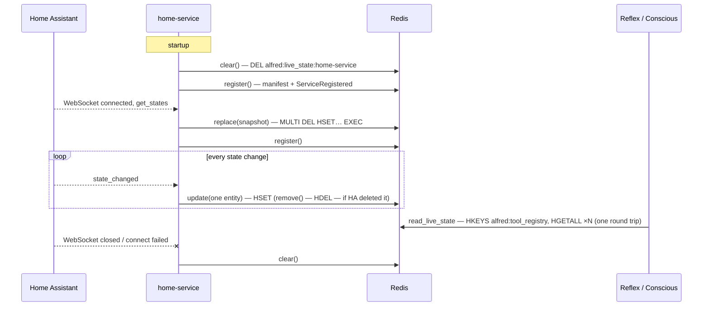

# Live Home State Implementation Plan

> **For agentic workers:** REQUIRED SUB-SKILL: Use superpowers:subagent-driven-development (recommended) or superpowers:executing-plans to implement this plan task-by-task. Steps use checkbox (`- [ ]`) syntax for tracking.

**Goal:** Home-service publishes live state through an SDK writer as Home Assistant reports
changes. Alfred reads that state fresh on every call. Registration happens only when a
service joins, and `alfred:events` gets a length cap.

**Architecture:**
- The new SDK module `sdk/alfred_sdk/live_state.py` owns the key `alfred:live_state:{service}`,
  the entry model, the writer and the reader. It is Alfred's whole contract, and neither
  side names the other.
- Core's `ContextReader` drops its cache and reads through the SDK reader.
- Home-service replaces its 2 s refresher and its 300 s loop with listener calls on the
  writer. A failed registration is retried with backoff until it lands.
- The alfred PR lands first. The home-service PR follows, with its SDK pin moved to
  alfred's merge commit.

**Tech Stack:** Python 3.13, Pydantic v2, redis-py 8 asyncio (`MULTI`/`EXEC` pipelines),
FastAPI, pytest + pytest-asyncio (`asyncio_mode = "auto"` in both repos), uv, ruff,
mypy --strict.

**Spec:** `docs/superpowers/specs/2026-10-05-live-home-state-design.md` (issue
[#281](https://github.com/anirudhlath/alfred/issues/281)). Read it before Task 1. Every
task below argues from it.

## Global Constraints

- **Key and format.**
  - Key: `alfred:live_state:{service_name}`, one hash per service, one field per entity ID.
  - Value: JSON of `LiveStateEntry {domain: str, kind: Literal["controllable", "sensor"],
    state: str, attributes: dict[str, Any] = {}}` with `extra="forbid"`.
- **Writer.** `LiveStateWriter(redis_url, service_name)` with `replace`, `update`,
  `remove`, `clear` and `aclose`.
  - One client per process, created with `socket_timeout=5.0` and
    `socket_connect_timeout=5.0`.
  - One FIFO `asyncio.Lock` around every write.
  - `replace` is a single `MULTI`/`EXEC`.
- **Reader.** `read_live_state(redis) -> ContextSnapshot | None` and
  `read_live_state_by_service(redis) -> dict[str, ContextSnapshot]`.
  - They find services through `HKEYS alfred:tool_registry`, never by scanning the
    keyspace.
  - All services' hashes come back in one pipelined round trip.
  - Malformed values are skipped, with one warning per read.
- **Reader output.**
  - No live state renders as exactly `Live home state unavailable.`
  - `memory_get_live_state` returns `{"available": false, "entities": []}` when there is
    no live state, and `{"available": true, "entities": [...]}` when there is.
- **Events cap.** Every `XADD` to `alfred:events` passes `maxlen=EVENTS_MAXLEN,
  approximate=True`, with `EVENTS_MAXLEN = 10_000`. Core's copy lives in
  `shared/streams.py`, and the SDK's copy is `AlfredClient.EVENTS_MAXLEN`.
- **Registration.**
  - `register()` writes the manifest and appends `ServiceRegistered`, nothing else.
  - Home-service registers only at startup, on HA connect and on an HA registry change.
  - A failed registration retries with backoff (1 s, doubling to 60 s) until one succeeds.
- **SDK isolation.** The SDK imports nothing from `core`, `shared`, `bus` or `domains`.
  Home-service imports nothing from alfred except `alfred_sdk`.
- **Redis clients.** Core builds Redis clients with `shared.redis_streams.create_redis()`.
  The SDK uses `redis.asyncio.from_url()`, the documented exception.
- **Constants.** Import stream constants from `shared.streams` in core, and never write
  `"alfred:events"` as a literal there.
- **Tooling.** Python 3.13 (`uv venv --python 3.13` in every new worktree), ruff with
  line length 100, and `mypy --strict`.
- **Alfred gate.** Run it once per task, before the commit, from the alfred worktree:
  `.venv/bin/ruff check . && .venv/bin/ruff format --check . && .venv/bin/mypy --strict alfredctl/ bus/ core/ domains/ evals/ runner/ sdk/ shared/ telemetry/ && .venv/bin/python -m pytest -x -q -p no:randomly`.
  While iterating, run only the test file named in the step.
- **Home-service gate:** `uv run ruff check . && uv run ruff format --check . && uv run mypy app/ alfred_ext/ && uv run pytest -q`.
- **Public repos.**
  - No personal names, IP addresses or domains in code, commits, PRs or issue comments.
  - Before the first push of each branch, run the secret-hygiene checks in
    `~/code/alfred-deploy/PWA-EXPOSURE-RUNBOOK.md` §Secret hygiene. Never quote those
    commands in a committed file.
- **Commits and PRs.**
  - No model identifiers in commits, PRs or code comments, and never `[skip ci]`.
  - Commit messages and PR titles are conventional-commit lines.
  - PR bodies end with `🤖 Generated with [Claude Code](https://claude.com/claude-code)`.
- **Merging deploys.**
  - Open a PR only on the owner's go.
  - Merge only on the owner's go.
  - Never touch prod Redis beyond the read-only checks in Task 13.

## Review Focus

These five conditions are what most likely bites a person using this, and the spec's
happy path does not exercise them. Each one has a pinning test in the task named.

1. **Redis is down when home-service starts, or when it registers.** The service must
   still register once Redis returns, because credentials are pushed only in answer to
   `ServiceRegistered`. After that success nothing stays scheduled. Pinned by Task 11's
   registrar tests.
2. **HA deletes an entity.** Its field must leave live state at once, not linger until
   the next reconnect. Pinned by Task 1 (`remove`) and Task 11 (the listener calls it).
3. **A live-state write fails mid-stream.** MQTT state forwarding and the rest of the
   listener chain must be unaffected. Pinned by Task 11.
4. **HA rejects the token, or is unreachable, on a connect attempt.** Live state must
   end up empty, whatever an earlier run left behind. Pinned by Task 9's disconnect
   listener tests and Task 11's startup-clear test.
5. **A state change arrives while the connect snapshot is being published.** The older
   snapshot must never overwrite it. Pinned by Task 1's FIFO-order test and Task 3's
   real-Redis test.

---

## Part A — alfred (`anirudhlath/alfred`)

Work in a new worktree branched from the spec branch, so the spec and this plan ride in
the feature PR:

```bash
cd ~/code/alfred-deploy/alfred   # any alfred checkout works for `git worktree add`
git fetch origin docs/live-home-state-design master
git worktree add -b feat/live-home-state ~/code/.worktrees/alfred/live-home-state origin/docs/live-home-state-design
cd ~/code/.worktrees/alfred/live-home-state
uv venv --python 3.13 && uv sync --all-extras
```

Before the first push, check that `git log origin/master..HEAD` shows only the spec/plan
commits and this branch's own work. Rebase onto `origin/master` if master has moved.

### Task 1: SDK live-state contract and writer

**Files:**
- Create: `sdk/alfred_sdk/live_state.py`
- Create: `sdk/tests/fake_live_redis.py` (test helper module, **not** a conftest)
- Create: `sdk/tests/test_live_state_writer.py`

**Interfaces:**
- Consumes: `sdk.alfred_sdk.context.ContextEntry`, `ContextSnapshot` (unchanged);
  `AlfredClient.REGISTRY_KEY`.
- Produces (later tasks rely on these exact names):
  - `LIVE_STATE_KEY_PREFIX = "alfred:live_state:"`
  - `WRITE_TIMEOUT_SECONDS = 5.0`
  - `LiveStateKind = Literal["controllable", "sensor"]`
  - `class LiveStateEntry(BaseModel)`
  - `def live_state_key(service_name: str) -> str`
  - `class LiveStateWriter` with:
    - `__init__(redis_url: str, service_name: str)`
    - `async replace(snapshot: ContextSnapshot) -> None`
    - `async update(domain: str, kind: LiveStateKind, entry: ContextEntry) -> None`
    - `async remove(entity_id: str) -> None`
    - `async clear() -> None`
    - `async aclose() -> None`

- [ ] **Step 1: Write the fake Redis helper**

`sdk/tests/fake_live_redis.py`:

```python
"""In-memory stand-in for the Redis commands live_state uses (a helper, not a conftest).

Values come back as bytes, as from a real client without decode_responses, so the
reader's decoding is exercised.
"""

from __future__ import annotations

import asyncio
from typing import Any


class FakePipeline:
    def __init__(self, redis: FakeLiveRedis, transaction: bool) -> None:
        self._redis = redis
        self.transaction = transaction
        self._ops: list[tuple[str, tuple[Any, ...], dict[str, Any]]] = []

    async def __aenter__(self) -> FakePipeline:
        return self

    async def __aexit__(self, *exc: object) -> None:
        return None

    def delete(self, *keys: str) -> FakePipeline:
        self._ops.append(("delete", keys, {}))
        return self

    def hset(self, key: str, mapping: dict[str, str]) -> FakePipeline:
        self._ops.append(("hset", (key,), {"mapping": mapping}))
        return self

    def hgetall(self, key: str) -> FakePipeline:
        self._ops.append(("hgetall", (key,), {}))
        return self

    async def execute(self) -> list[Any]:
        self._redis.executes.append((self.transaction, [op for op, _, _ in self._ops]))
        return [await getattr(self._redis, op)(*args, **kw) for op, args, kw in self._ops]


class FakeLiveRedis:
    def __init__(self) -> None:
        self.hashes: dict[str, dict[bytes, bytes]] = {}
        # (transaction?, [command names]) per pipeline execute
        self.executes: list[tuple[bool, list[str]]] = []
        # When set, the next HSET sleeps this long first (write-order tests).
        self.slow_next_hset = 0.0
        self.closed = False

    async def hset(
        self,
        key: str,
        field: str | None = None,
        value: str | None = None,
        mapping: dict[str, str] | None = None,
    ) -> int:
        if self.slow_next_hset:
            delay, self.slow_next_hset = self.slow_next_hset, 0.0
            await asyncio.sleep(delay)
        items = dict(mapping or {})
        if field is not None:
            items[field] = str(value)
        target = self.hashes.setdefault(key, {})
        for f, v in items.items():
            target[f.encode()] = str(v).encode()
        return len(items)

    async def hdel(self, key: str, *fields: str) -> int:
        target = self.hashes.get(key, {})
        removed = sum(target.pop(f.encode(), None) is not None for f in fields)
        if key in self.hashes and not target:
            del self.hashes[key]
        return removed

    async def delete(self, *keys: str) -> int:
        return sum(self.hashes.pop(k, None) is not None for k in keys)

    async def hgetall(self, key: str) -> dict[bytes, bytes]:
        return dict(self.hashes.get(key, {}))

    async def hkeys(self, key: str) -> list[bytes]:
        return list(self.hashes.get(key, {}))

    def pipeline(self, transaction: bool = True) -> FakePipeline:
        return FakePipeline(self, transaction)

    async def aclose(self) -> None:
        self.closed = True
```

- [ ] **Step 2: Write the failing writer tests**

`sdk/tests/test_live_state_writer.py`:

```python
"""LiveStateWriter: the format it writes and the order it writes in."""

from __future__ import annotations

import asyncio
from unittest.mock import patch

import pytest
from pydantic import ValidationError
from pydantic_core import PydanticSerializationError

from sdk.alfred_sdk.context import ContextEntry, ContextSnapshot
from sdk.alfred_sdk.live_state import (
    WRITE_TIMEOUT_SECONDS,
    LiveStateEntry,
    LiveStateWriter,
    live_state_key,
)
from sdk.tests.fake_live_redis import FakeLiveRedis

KEY = live_state_key("home-service")

SNAPSHOT = ContextSnapshot(
    controllable={
        "light": [ContextEntry(entity_id="light.lamp", state="on", attributes={"brightness": 128})]
    },
    sensors={"sensor": [ContextEntry(entity_id="sensor.temp", state="21.5")]},
)


def _writer(fake: FakeLiveRedis) -> LiveStateWriter:
    with patch("redis.asyncio.from_url", return_value=fake):
        return LiveStateWriter("redis://unused", "home-service")


def _stored(fake: FakeLiveRedis) -> dict[str, LiveStateEntry]:
    return {
        field.decode(): LiveStateEntry.model_validate_json(value)
        for field, value in fake.hashes.get(KEY, {}).items()
    }


def test_the_key_is_owned_by_the_sdk() -> None:
    assert KEY == "alfred:live_state:home-service"


async def test_replace_writes_one_field_per_entity_with_its_kind() -> None:
    fake = FakeLiveRedis()
    await _writer(fake).replace(SNAPSHOT)
    assert _stored(fake) == {
        "light.lamp": LiveStateEntry(
            domain="light", kind="controllable", state="on", attributes={"brightness": 128}
        ),
        "sensor.temp": LiveStateEntry(domain="sensor", kind="sensor", state="21.5"),
    }


async def test_replace_drops_entities_the_snapshot_no_longer_has() -> None:
    fake = FakeLiveRedis()
    writer = _writer(fake)
    await writer.update("light", "controllable", ContextEntry(entity_id="light.gone", state="on"))
    await writer.replace(SNAPSHOT)
    assert "light.gone" not in _stored(fake)


async def test_replace_is_one_transaction() -> None:
    fake = FakeLiveRedis()
    await _writer(fake).replace(SNAPSHOT)
    assert fake.executes == [(True, ["delete", "hset"])]


async def test_replace_with_an_empty_snapshot_leaves_no_hash() -> None:
    fake = FakeLiveRedis()
    writer = _writer(fake)
    await writer.replace(SNAPSHOT)
    await writer.replace(ContextSnapshot())
    assert KEY not in fake.hashes
    assert fake.executes[-1] == (True, ["delete"])


async def test_an_entry_that_cannot_be_stored_writes_nothing() -> None:
    fake = FakeLiveRedis()
    writer = _writer(fake)
    await writer.replace(SNAPSHOT)
    bad = ContextSnapshot(
        controllable={
            "light": [ContextEntry(entity_id="light.x", state="on", attributes={"x": object()})]
        }
    )
    with pytest.raises(PydanticSerializationError):
        await writer.replace(bad)
    assert set(_stored(fake)) == {"light.lamp", "sensor.temp"}


async def test_update_writes_one_field() -> None:
    fake = FakeLiveRedis()
    await _writer(fake).update(
        "light", "controllable", ContextEntry(entity_id="light.lamp", state="off")
    )
    assert _stored(fake) == {
        "light.lamp": LiveStateEntry(domain="light", kind="controllable", state="off")
    }


async def test_update_rejects_an_unknown_kind() -> None:
    fake = FakeLiveRedis()
    with pytest.raises(ValidationError):
        await _writer(fake).update(
            "light", "gadget", ContextEntry(entity_id="light.lamp", state="on")
        )
    assert fake.hashes == {}


async def test_remove_deletes_one_field() -> None:
    fake = FakeLiveRedis()
    writer = _writer(fake)
    await writer.replace(SNAPSHOT)
    await writer.remove("light.lamp")
    assert set(_stored(fake)) == {"sensor.temp"}


async def test_clear_deletes_the_hash() -> None:
    fake = FakeLiveRedis()
    writer = _writer(fake)
    await writer.replace(SNAPSHOT)
    await writer.clear()
    assert KEY not in fake.hashes


async def test_writes_land_in_the_order_they_were_requested() -> None:
    fake = FakeLiveRedis()
    writer = _writer(fake)
    fake.slow_next_hset = 0.05
    first = asyncio.create_task(
        writer.update("light", "controllable", ContextEntry(entity_id="light.lamp", state="on"))
    )
    await asyncio.sleep(0)  # `first` is now inside its slow HSET
    second = asyncio.create_task(
        writer.update("light", "controllable", ContextEntry(entity_id="light.lamp", state="off"))
    )
    await asyncio.gather(first, second)
    assert _stored(fake)["light.lamp"].state == "off"


def test_the_client_has_bounded_timeouts() -> None:
    with patch("redis.asyncio.from_url", return_value=FakeLiveRedis()) as from_url:
        LiveStateWriter("redis://h:6379/0", "svc")
    from_url.assert_called_once_with(
        "redis://h:6379/0",
        socket_timeout=WRITE_TIMEOUT_SECONDS,
        socket_connect_timeout=WRITE_TIMEOUT_SECONDS,
    )
    assert WRITE_TIMEOUT_SECONDS == 5.0


async def test_aclose_closes_the_client() -> None:
    fake = FakeLiveRedis()
    await _writer(fake).aclose()
    assert fake.closed
```

- [ ] **Step 3: Run the tests to verify they fail**

Run: `.venv/bin/python -m pytest sdk/tests/test_live_state_writer.py -q`
Expected: collection ERROR, `ModuleNotFoundError: No module named 'sdk.alfred_sdk.live_state'`.

- [ ] **Step 4: Implement the contract and the writer**

`sdk/alfred_sdk/live_state.py` (the reader functions are added in Task 2):

```python
"""Live state — Alfred's contract for what a service's devices are doing right now.

A service publishes its live state through ``LiveStateWriter`` and Alfred reads it with
``read_live_state()``. Both sides take the key and the entry format from this module, so
neither names the other.

Storage: one Redis hash per service at ``alfred:live_state:{service_name}``. Each field is
an entity ID and each value the JSON of a ``LiveStateEntry``.
"""

from __future__ import annotations

import asyncio
import logging
from typing import Any, Literal

import redis.asyncio as aioredis
from pydantic import BaseModel, ConfigDict
from redis.typing import EncodableT, FieldT

from .context import ContextEntry, ContextSnapshot

logger = logging.getLogger(__name__)

LIVE_STATE_KEY_PREFIX = "alfred:live_state:"
# Writers are called inline from a service's event loop: a Redis outage must cost a
# bounded wait per write, never a hang.
WRITE_TIMEOUT_SECONDS = 5.0

LiveStateKind = Literal["controllable", "sensor"]


class LiveStateEntry(BaseModel):
    """One entity's live state, as stored in its service's hash."""

    model_config = ConfigDict(extra="forbid")

    domain: str
    kind: LiveStateKind
    state: str
    attributes: dict[str, Any] = {}


def live_state_key(service_name: str) -> str:
    """The hash a service's live state lives in."""
    return f"{LIVE_STATE_KEY_PREFIX}{service_name}"


def _entry_json(domain: str, kind: LiveStateKind, entry: ContextEntry) -> str:
    return LiveStateEntry(
        domain=domain, kind=kind, state=entry.state, attributes=entry.attributes
    ).model_dump_json()


class LiveStateWriter:
    """The only way a service writes its live state.

    Holds one Redis client for the process's lifetime. Every write goes through one FIFO
    lock, so writes reach Redis in the order they were requested. A service applies an
    event to its own state before requesting the write and builds a ``replace`` snapshot
    from that same state with no await in between, so a snapshot never overwrites a newer
    update.
    """

    def __init__(self, redis_url: str, service_name: str) -> None:
        self._key = live_state_key(service_name)
        self._redis: aioredis.Redis = aioredis.from_url(
            redis_url,
            socket_timeout=WRITE_TIMEOUT_SECONDS,
            socket_connect_timeout=WRITE_TIMEOUT_SECONDS,
        )
        self._lock = asyncio.Lock()

    async def replace(self, snapshot: ContextSnapshot) -> None:
        """Swap the whole hash for ``snapshot`` atomically (on connecting to the source)."""
        fields: dict[FieldT, EncodableT] = {}
        buckets: tuple[tuple[LiveStateKind, dict[str, list[ContextEntry]]], ...] = (
            ("controllable", snapshot.controllable),
            ("sensor", snapshot.sensors),
        )
        for kind, groups in buckets:
            for domain, entries in groups.items():
                for entry in entries:
                    fields[entry.entity_id] = _entry_json(domain, kind, entry)
        async with self._lock, self._redis.pipeline(transaction=True) as pipe:
            pipe.delete(self._key)
            if fields:
                pipe.hset(self._key, mapping=fields)
            await pipe.execute()

    async def update(self, domain: str, kind: LiveStateKind, entry: ContextEntry) -> None:
        """Write one entity's state (on each state change)."""
        value = _entry_json(domain, kind, entry)
        async with self._lock:
            await self._redis.hset(self._key, entry.entity_id, value)

    async def remove(self, entity_id: str) -> None:
        """Drop one entity (the source deleted it)."""
        async with self._lock:
            await self._redis.hdel(self._key, entity_id)

    async def clear(self) -> None:
        """Drop the whole hash (on disconnect, at startup, at shutdown)."""
        async with self._lock:
            await self._redis.delete(self._key)

    async def aclose(self) -> None:
        await self._redis.aclose()
```

If mypy rejects the combined `async with self._lock, self._redis.pipeline(...)`, nest
the two `async with` blocks instead. Behaviour is the same.

- [ ] **Step 5: Run the tests to verify they pass**

Run: `.venv/bin/python -m pytest sdk/tests/test_live_state_writer.py -q`
Expected: 13 passed.

- [ ] **Step 6: Gate and commit**

Run the alfred gate (Global Constraints), then:

```bash
git add sdk/alfred_sdk/live_state.py sdk/tests/fake_live_redis.py sdk/tests/test_live_state_writer.py
git commit -m "feat(sdk): live-state contract and writer"
```

### Task 2: SDK live-state reader

**Files:**
- Modify: `sdk/alfred_sdk/live_state.py`
- Modify: `sdk/alfred_sdk/__init__.py`
- Create: `sdk/tests/test_live_state_reader.py`

**Interfaces:**
- Consumes: Task 1's `LiveStateEntry`, `live_state_key`; `AlfredClient.REGISTRY_KEY`.
- Produces:
  - `async def read_live_state_by_service(redis: aioredis.Redis) -> dict[str, ContextSnapshot]`
    — services in sorted order, entities sorted within each; only services with at least
    one valid entry.
  - `async def read_live_state(redis: aioredis.Redis) -> ContextSnapshot | None` — the merge
    of the above, or `None` when it is empty.
  - `alfred_sdk` exports `LiveStateWriter`, `read_live_state`.

- [ ] **Step 1: Write the failing reader tests**

`sdk/tests/test_live_state_reader.py`:

```python
"""read_live_state: what Alfred sees of every registered service's live state."""

from __future__ import annotations

import logging

import pytest

from sdk.alfred_sdk.context import ContextEntry
from sdk.alfred_sdk.live_state import (
    LiveStateEntry,
    live_state_key,
    read_live_state,
    read_live_state_by_service,
)
from sdk.tests.fake_live_redis import FakeLiveRedis

REGISTRY = "alfred:tool_registry"


def _entry(domain: str, kind: str, state: str, **attributes: object) -> str:
    return LiveStateEntry(
        domain=domain, kind=kind, state=state, attributes=attributes
    ).model_dump_json()


def _seed(fake: FakeLiveRedis, service: str, entries: dict[str, str]) -> None:
    fake.hashes.setdefault(REGISTRY, {})[service.encode()] = b"{}"
    if entries:
        fake.hashes[live_state_key(service)] = {
            field.encode(): value.encode() for field, value in entries.items()
        }


async def test_no_registered_service_reads_as_unavailable() -> None:
    assert await read_live_state(FakeLiveRedis()) is None


async def test_registered_services_without_state_read_as_unavailable() -> None:
    fake = FakeLiveRedis()
    _seed(fake, "home-service", {})
    assert await read_live_state(fake) is None


async def test_services_merge_into_one_snapshot() -> None:
    fake = FakeLiveRedis()
    _seed(
        fake,
        "home-service",
        {
            "light.b": _entry("light", "controllable", "off"),
            "light.a": _entry("light", "controllable", "on", brightness=10),
            "sensor.t": _entry("sensor", "sensor", "21"),
        },
    )
    _seed(fake, "garden-service", {"light.c": _entry("light", "controllable", "on")})

    snapshot = await read_live_state(fake)

    assert snapshot is not None
    assert [e.entity_id for e in snapshot.controllable["light"]] == ["light.c", "light.a", "light.b"]
    assert snapshot.controllable["light"][1].attributes == {"brightness": 10}
    assert snapshot.sensors == {"sensor": [ContextEntry(entity_id="sensor.t", state="21")]}


async def test_by_service_keeps_services_apart() -> None:
    fake = FakeLiveRedis()
    _seed(fake, "home-service", {"sensor.t": _entry("sensor", "sensor", "21")})
    _seed(fake, "garden-service", {"light.c": _entry("light", "controllable", "on")})
    _seed(fake, "idle-service", {})

    by_service = await read_live_state_by_service(fake)

    assert list(by_service) == ["garden-service", "home-service"]
    assert by_service["garden-service"].sensors == {}


async def test_state_of_an_unregistered_service_is_not_read() -> None:
    fake = FakeLiveRedis()
    fake.hashes[live_state_key("ghost")] = {
        b"light.x": _entry("light", "controllable", "on").encode()
    }
    assert await read_live_state(fake) is None


async def test_malformed_values_are_skipped_with_one_warning(
    caplog: pytest.LogCaptureFixture,
) -> None:
    fake = FakeLiveRedis()
    _seed(
        fake,
        "home-service",
        {
            "light.good": _entry("light", "controllable", "on"),
            "light.not_json": "{",
            "light.bad_kind": '{"domain": "light", "kind": "gadget", "state": "on"}',
            "light.extra": '{"domain": "light", "kind": "sensor", "state": "on", "x": 1}',
        },
    )
    caplog.set_level(logging.WARNING)

    snapshot = await read_live_state(fake)

    assert snapshot is not None
    assert [e.entity_id for e in snapshot.controllable["light"]] == ["light.good"]
    warnings = [r for r in caplog.records if r.levelno == logging.WARNING]
    assert len(warnings) == 1
    assert "3" in warnings[0].getMessage()


async def test_every_service_is_read_in_one_round_trip() -> None:
    fake = FakeLiveRedis()
    _seed(fake, "home-service", {"sensor.t": _entry("sensor", "sensor", "21")})
    _seed(fake, "garden-service", {"light.c": _entry("light", "controllable", "on")})

    await read_live_state(fake)

    assert fake.executes == [(False, ["hgetall", "hgetall"])]


def test_the_package_exports_the_writer_and_the_reader() -> None:
    import sdk.alfred_sdk as alfred_sdk

    assert alfred_sdk.LiveStateWriter.__name__ == "LiveStateWriter"
    assert alfred_sdk.read_live_state is read_live_state
```

- [ ] **Step 2: Run the tests to verify they fail**

Run: `.venv/bin/python -m pytest sdk/tests/test_live_state_reader.py -q`
Expected: collection ERROR, `ImportError: cannot import name 'read_live_state'`.

- [ ] **Step 3: Implement the reader**

Append to `sdk/alfred_sdk/live_state.py`. Add `from pydantic import ValidationError` to
the pydantic import, and `from .client import AlfredClient` beside `.context`:

```python
def _text(value: bytes | str) -> str:
    return value.decode() if isinstance(value, bytes) else value


async def read_live_state_by_service(redis: aioredis.Redis) -> dict[str, ContextSnapshot]:
    """Each registered service's live state, for the services that have any.

    Services are found through the tool registry, never by scanning the keyspace, and
    every service's hash comes back in one pipelined round trip. A value that is not a
    valid ``LiveStateEntry`` is skipped, with one warning per read for all of them.
    """
    names = sorted(_text(name) for name in await redis.hkeys(AlfredClient.REGISTRY_KEY))
    if not names:
        return {}
    async with redis.pipeline(transaction=False) as pipe:
        for name in names:
            pipe.hgetall(live_state_key(name))
        hashes: list[dict[bytes | str, bytes | str]] = await pipe.execute()

    by_service: dict[str, ContextSnapshot] = {}
    malformed = 0
    for name, raw in zip(names, hashes, strict=True):
        controllable: dict[str, list[ContextEntry]] = {}
        sensors: dict[str, list[ContextEntry]] = {}
        values = {_text(field): value for field, value in raw.items()}
        for entity_id in sorted(values):
            try:
                parsed = LiveStateEntry.model_validate_json(values[entity_id])
            except ValidationError:
                malformed += 1
                continue
            bucket = controllable if parsed.kind == "controllable" else sensors
            bucket.setdefault(parsed.domain, []).append(
                ContextEntry(entity_id=entity_id, state=parsed.state, attributes=parsed.attributes)
            )
        if controllable or sensors:
            by_service[name] = ContextSnapshot(controllable=controllable, sensors=sensors)
    if malformed:
        logger.warning("Skipped %d malformed live-state entries", malformed)
    return by_service


async def read_live_state(redis: aioredis.Redis) -> ContextSnapshot | None:
    """Every registered service's live state merged, or None when none has any.

    None means no live state, which is a different answer from a snapshot with nothing
    in it.
    """
    by_service = await read_live_state_by_service(redis)
    if not by_service:
        return None
    merged = ContextSnapshot()
    for snapshot in by_service.values():
        for domain, entries in snapshot.controllable.items():
            merged.controllable.setdefault(domain, []).extend(entries)
        for domain, entries in snapshot.sensors.items():
            merged.sensors.setdefault(domain, []).extend(entries)
    return merged
```

`sdk/alfred_sdk/__init__.py`:

```python
"""alfred-sdk — the only coupling between Alfred and external applications."""

from .client import AlfredClient
from .feature import BaseFeature, CredentialField, CredentialSchema, tool
from .live_state import LiveStateWriter, read_live_state
from .telemetry import track_event, track_latency, track_tokens

__all__ = [
    "AlfredClient",
    "BaseFeature",
    "CredentialField",
    "CredentialSchema",
    "LiveStateWriter",
    "read_live_state",
    "tool",
    "track_event",
    "track_latency",
    "track_tokens",
]
```

- [ ] **Step 4: Run the tests to verify they pass**

Run: `.venv/bin/python -m pytest sdk/tests/test_live_state_reader.py sdk/tests/test_live_state_writer.py -q`
Expected: 21 passed.

- [ ] **Step 5: Gate and commit**

```bash
git add sdk/alfred_sdk/live_state.py sdk/alfred_sdk/__init__.py sdk/tests/test_live_state_reader.py
git commit -m "feat(sdk): read live state from every registered service"
```

### Task 3: Live-state properties against a real Redis

**Files:**
- Create: `tests/integration/test_live_state_redis.py`

**Interfaces:**
- Consumes: Tasks 1–2; `evals.memory.sandbox.RedisSandbox` (a throwaway Redis container,
  opt-in through `ALFRED_MEMORY_EVAL_DOCKER=1`, the same gate as
  `tests/core/memory/test_redis_vector_store_live.py`).
- Produces: nothing new. These tests pin atomicity and write order, which no fake can
  show.

- [ ] **Step 1: Write the tests**

```python
"""Live state against a real Redis, in a throwaway container.

Opt-in (``ALFRED_MEMORY_EVAL_DOCKER=1``): atomicity and write order are properties of the
server and the client together, which a fake cannot show.
"""

from __future__ import annotations

import asyncio
import os
import shutil
from typing import TYPE_CHECKING

import pytest

from evals.memory.sandbox import RedisSandbox
from sdk.alfred_sdk.context import ContextEntry, ContextSnapshot
from sdk.alfred_sdk.live_state import (
    LiveStateEntry,
    LiveStateWriter,
    live_state_key,
    read_live_state,
)

if TYPE_CHECKING:
    from collections.abc import AsyncIterator

    from shared.types import AioRedis

pytestmark = pytest.mark.skipif(
    os.getenv("ALFRED_MEMORY_EVAL_DOCKER") != "1" or shutil.which("docker") is None,
    reason="set ALFRED_MEMORY_EVAL_DOCKER=1 to run against a throwaway Redis container",
)

KEY = live_state_key("home-service")


def _url(redis: AioRedis) -> str:
    kwargs = redis.connection_pool.connection_kwargs
    return f"redis://{kwargs['host']}:{kwargs['port']}/{kwargs.get('db', 0)}"


def _house(prefix: str, state: str, n: int = 200) -> ContextSnapshot:
    return ContextSnapshot(
        controllable={
            "light": [ContextEntry(entity_id=f"light.{prefix}_{i}", state=state) for i in range(n)]
        }
    )


def _ids(prefix: str, n: int = 200) -> set[str]:
    return {f"light.{prefix}_{i}" for i in range(n)}


@pytest.fixture
async def redis() -> AsyncIterator[AioRedis]:
    async with RedisSandbox() as client:
        yield client


@pytest.fixture
async def writer(redis: AioRedis) -> AsyncIterator[LiveStateWriter]:
    live = LiveStateWriter(_url(redis), "home-service")
    yield live
    await live.aclose()


async def test_a_reader_never_sees_half_a_replace(
    redis: AioRedis, writer: LiveStateWriter
) -> None:
    old, new = _house("old", "on"), _house("new", "off")
    await writer.replace(old)
    seen: list[set[str]] = []
    done = asyncio.Event()

    async def watch() -> None:
        while not done.is_set():
            fields = await redis.hkeys(KEY)
            seen.append({f.decode() if isinstance(f, bytes) else f for f in fields})

    watcher = asyncio.create_task(watch())
    for house in (new, old, new, old, new):
        await writer.replace(house)
    done.set()
    await watcher

    assert seen, "the watcher never read"
    assert all(ids in (_ids("old"), _ids("new")) for ids in seen)


async def test_an_update_requested_before_a_replace_never_lands_after_it(
    redis: AioRedis, writer: LiveStateWriter
) -> None:
    update = asyncio.create_task(
        writer.update("light", "controllable", ContextEntry(entity_id="light.lamp", state="on"))
    )
    replace = asyncio.create_task(
        writer.replace(
            ContextSnapshot(controllable={"light": [ContextEntry(entity_id="light.lamp", state="off")]})
        )
    )
    await asyncio.gather(update, replace)

    raw = await redis.hget(KEY, "light.lamp")
    assert raw is not None
    assert LiveStateEntry.model_validate_json(raw).state == "off"


async def test_clear_removes_the_hash(redis: AioRedis, writer: LiveStateWriter) -> None:
    await writer.replace(_house("x", "on", n=3))
    await writer.clear()
    assert await redis.exists(KEY) == 0


async def test_the_reader_sees_what_the_writer_wrote(
    redis: AioRedis, writer: LiveStateWriter
) -> None:
    await redis.hset("alfred:tool_registry", "home-service", "{}")
    await writer.replace(_house("x", "on", n=2))
    await writer.update("light", "controllable", ContextEntry(entity_id="light.x_1", state="off"))
    await writer.remove("light.x_0")

    snapshot = await read_live_state(redis)

    assert snapshot is not None
    assert snapshot.controllable == {
        "light": [ContextEntry(entity_id="light.x_1", state="off")]
    }
```

- [ ] **Step 2: Run them against a throwaway Redis**

Run: `ALFRED_MEMORY_EVAL_DOCKER=1 .venv/bin/python -m pytest tests/integration/test_live_state_redis.py -q`
Expected: 4 passed. Without the env var: 4 skipped.

To prove the atomicity test can fail, temporarily change `transaction=True` to
`transaction=False` in `replace`. Expected: `test_a_reader_never_sees_half_a_replace`
fails, or at least sees an empty set on some runs. Revert the change before going on.

- [ ] **Step 3: Gate and commit**

```bash
git add tests/integration/test_live_state_redis.py
git commit -m "test(sdk): live-state atomicity and write order on a real Redis"
```

### Task 4: `register()` stops writing context; the SDK caps `alfred:events`

**Files:**
- Modify: `sdk/alfred_sdk/client.py` (drop line 11's import, lines 141–158 and lines
  201–204; add the cap)
- Modify: `sdk/alfred_sdk/feature.py` (drop line 13's import and lines 254–256)
- Modify: `sdk/alfred_sdk/context.py` (drop `ContextProvider`)
- Delete: `sdk/tests/test_client_context.py`
- Modify: `sdk/tests/test_context.py` (drop the two `get_context`/protocol tests)
- Modify: `sdk/tests/test_client_register.py`

**Interfaces:**
- Consumes: nothing new.
- Produces: `AlfredClient.EVENTS_MAXLEN = 10_000`. `register()` writes `HSET
  alfred:tool_registry`, then `XADD alfred:events` with `maxlen=EVENTS_MAXLEN,
  approximate=True`, and nothing else. `BaseFeature.get_context`,
  `AlfredClient._collect_context`, `AlfredClient.CONTEXT_KEY_PREFIX` and
  `context.ContextProvider` no longer exist.

- [ ] **Step 1: Write the failing tests**

Add to `sdk/tests/test_client_register.py`. Its imports also gain
`from sdk.alfred_sdk.context import ContextSnapshot` and
`from sdk.alfred_sdk.feature import BaseFeature`.

```python
class _PreLiveStateFeature(BaseFeature):
    """A feature written for the old contract, still overriding get_context()."""

    feature_name = "legacy"

    async def get_context(self) -> ContextSnapshot:
        raise AssertionError("register() must not collect context")


@pytest.mark.asyncio
async def test_register_writes_only_the_manifest_and_the_event() -> None:
    mock_redis = _mock_redis()
    client = AlfredClient(service_name="home-service")
    client.discover_features_from_classes([_PreLiveStateFeature])

    with patch("redis.asyncio.from_url", return_value=mock_redis):
        await client.register()

    mock_redis.hset.assert_awaited_once()
    mock_redis.xadd.assert_awaited_once()
    mock_redis.set.assert_not_called()


@pytest.mark.asyncio
async def test_register_caps_the_events_stream() -> None:
    mock_redis = _mock_redis()
    with patch("redis.asyncio.from_url", return_value=mock_redis):
        await AlfredClient(service_name="plain-service").register()

    assert mock_redis.xadd.call_args.kwargs == {"maxlen": 10_000, "approximate": True}
    assert AlfredClient.EVENTS_MAXLEN == 10_000


def test_features_no_longer_carry_context() -> None:
    from sdk.alfred_sdk import context, feature

    assert not hasattr(feature.BaseFeature, "get_context")
    assert not hasattr(context, "ContextProvider")
    assert not hasattr(AlfredClient, "CONTEXT_KEY_PREFIX")
    assert not hasattr(AlfredClient, "_collect_context")
```

- [ ] **Step 2: Run the tests to verify they fail**

Run: `.venv/bin/python -m pytest sdk/tests/test_client_register.py -q`
Expected: the three new tests FAIL (AssertionError from `get_context`, a missing
`maxlen` kwarg, `hasattr` true).

- [ ] **Step 3: Implement**

`sdk/alfred_sdk/client.py`:
- Delete `from .context import ContextSnapshot` (line 11).
- Under `EVENTS_STREAM` add:

```python
    # Duplicated from shared.streams.EVENTS_MAXLEN — SDK must be standalone. An approximate
    # cap (XADD MAXLEN ~) every producer passes; sdk/tests/test_schema_compatibility.py
    # checks the two copies agree.
    EVENTS_MAXLEN = 10_000
```

- Delete the whole `# ── Context Collection ──` section (the `CONTEXT_KEY_PREFIX`
  constant and `_collect_context`).
- Replace `register()` with:

```python
    async def register(self) -> None:
        """Register this service's tools with Alfred's registry on Redis.

        Publishes a ServiceRegistered event to alfred:events AFTER the registry
        hset — consumers read the manifest from the registry when handling the
        event, so ordering matters. Live state is not part of registration: a
        service publishes it through ``LiveStateWriter``.
        """
        import json

        import redis.asyncio as aioredis

        from .events import ServiceRegistered

        r: aioredis.Redis = aioredis.from_url(self.redis_url)
        try:
            manifest = self.get_registration_manifest()
            await r.hset(self.REGISTRY_KEY, self.service_name, json.dumps(manifest))

            event = ServiceRegistered(
                source=self.service_name,
                service_name=self.service_name,
                credentials_endpoint=self.credentials_endpoint,
                has_credentials_schema=self.credentials_schema is not None,
            )
            await r.xadd(
                self.EVENTS_STREAM,
                {"event": event.model_dump_json()},
                maxlen=self.EVENTS_MAXLEN,
                approximate=True,
            )
        finally:
            await r.aclose()
```

`sdk/alfred_sdk/feature.py`: delete `from .context import ContextSnapshot` and the
`get_context` method at the end of `BaseFeature`.

`sdk/alfred_sdk/context.py`:

```python
"""Context data models — the shape live state is read in (see live_state.py)."""

from __future__ import annotations

from typing import Any

from pydantic import BaseModel


class ContextEntry(BaseModel):
    """A single entity's state snapshot."""

    entity_id: str
    state: str
    attributes: dict[str, Any] = {}


class ContextSnapshot(BaseModel):
    """Structured context from a service, grouped by domain."""

    controllable: dict[str, list[ContextEntry]] = {}
    sensors: dict[str, list[ContextEntry]] = {}
```

Tests:
- `git rm sdk/tests/test_client_context.py`. It tested the context write that is now
  gone, and Task 1 covers the writer.
- In `sdk/tests/test_context.py`, delete `StubFeature`,
  `test_base_feature_default_get_context` and
  `test_base_feature_satisfies_context_provider_protocol`.
- Change that file's imports to `from sdk.alfred_sdk.context import ContextEntry,
  ContextSnapshot`, and drop `import pytest` and the `BaseFeature` import, which are
  now unused.
- Change its docstring to `"""Tests for the context data models."""`.

- [ ] **Step 4: Run the tests to verify they pass**

Run: `.venv/bin/python -m pytest sdk/ -q`
Expected: all pass. Then run
`grep -rn "get_context\|ContextProvider\|_collect_context\|CONTEXT_KEY_PREFIX" sdk/`.
Expected: no hits outside `test_client_register.py`.

- [ ] **Step 5: Gate and commit**

```bash
git add -A sdk/
git commit -m "feat(sdk)!: register() no longer publishes context; cap alfred:events"
```

The commit body says live state is published through `LiveStateWriter` now, and
`BaseFeature.get_context()` and `ContextProvider` are removed (#281).

### Task 5: Core caps `alfred:events`

**Files:**
- Modify: `shared/streams.py:3`
- Modify: `core/triggers/engine.py:12,78`
- Modify: `core/triggers/feature.py:14,146`
- Modify: `core/triggers/tests/conftest.py:53-82` (`FakeRedis.xadd` accepts and records
  the cap)
- Modify: `core/triggers/tests/test_engine.py`, `core/triggers/tests/test_feature.py`
- Modify: `sdk/tests/test_schema_compatibility.py`

**Interfaces:**
- Consumes: `AlfredClient.EVENTS_MAXLEN` (Task 4).
- Produces: `shared.streams.EVENTS_MAXLEN = 10_000`.

- [ ] **Step 1: Write the failing tests**

`core/triggers/tests/conftest.py`: in `FakeRedis.__init__` add
`self.xadd_options: list[dict[str, Any]] = []`, and replace `xadd` with:

```python
    async def xadd(
        self,
        stream: str,
        fields: dict[str, str],
        *,
        maxlen: int | None = None,
        approximate: bool = True,
    ) -> None:
        self.streams.setdefault(stream, []).append(fields)
        self.xadd_options.append({"stream": stream, "maxlen": maxlen, "approximate": approximate})
```

`core/triggers/tests/test_engine.py`: extend the `shared.streams` import with
`EVENTS_MAXLEN`, and add:

```python
@pytest.mark.asyncio
async def test_trigger_fired_caps_the_events_stream(
    mock_store: AsyncMock, mock_redis: AsyncMock
) -> None:
    from core.triggers.engine import TriggerEngine

    cls = TriggerRegistry.get("time")
    trigger = cls(
        trigger_id="t-1",
        trigger_type="time",
        name="test",
        created_by="test",
        created_at=datetime.now(UTC),
        conditions={"cron": "0 7 * * *"},
    )

    await TriggerEngine(store=mock_store, redis=mock_redis).fire(
        trigger, TriggerContext(now=datetime.now(UTC))
    )

    assert mock_redis.xadd.call_args.args[0] == EVENTS_STREAM
    assert mock_redis.xadd.call_args.kwargs == {"maxlen": EVENTS_MAXLEN, "approximate": True}
```

`core/triggers/tests/test_feature.py`: extend the `shared.streams` import with
`EVENTS_MAXLEN`, and add:

```python
@pytest.mark.asyncio
async def test_trigger_created_caps_the_events_stream(
    fake_redis: Any, snapshot_dir: Path
) -> None:
    from core.triggers.feature import TriggerFeature, TriggerFeatureContext

    store = TriggerStore(redis=fake_redis, snapshot_dir=snapshot_dir)
    feature = TriggerFeature(TriggerFeatureContext(store=store, redis=fake_redis))

    result = await feature.create_trigger(
        name="tea", trigger_type="time", conditions={"run_in_seconds": 5}, one_shot=True
    )

    assert "error" not in result
    assert [o for o in fake_redis.xadd_options if o["stream"] == EVENTS_STREAM] == [
        {"stream": EVENTS_STREAM, "maxlen": EVENTS_MAXLEN, "approximate": True}
    ]
```

`sdk/tests/test_schema_compatibility.py`, add:

```python
def test_sdk_copies_of_core_redis_names_match() -> None:
    from sdk.alfred_sdk.client import AlfredClient
    from shared.streams import EVENTS_MAXLEN, EVENTS_STREAM, TOOL_REGISTRY_KEY

    assert AlfredClient.EVENTS_STREAM == EVENTS_STREAM
    assert AlfredClient.EVENTS_MAXLEN == EVENTS_MAXLEN
    assert AlfredClient.REGISTRY_KEY == TOOL_REGISTRY_KEY
```

- [ ] **Step 2: Run the tests to verify they fail**

Run: `.venv/bin/python -m pytest core/triggers/tests/test_engine.py core/triggers/tests/test_feature.py sdk/tests/test_schema_compatibility.py -q`
Expected: ImportError on `EVENTS_MAXLEN`.

- [ ] **Step 3: Implement**

`shared/streams.py`, after `EVENTS_STREAM`:

```python
# Approximate cap on EVENTS_STREAM (XADD MAXLEN ~), passed by every producer — the same
# value and style as bus/bridge.py's FORWARD_MAXLEN. alfred-sdk keeps a copy
# (AlfredClient.EVENTS_MAXLEN); sdk/tests/test_schema_compatibility.py checks they agree.
EVENTS_MAXLEN = 10_000
```

`core/triggers/engine.py`:
- Change the import to
  `from shared.streams import ACTIONS_STREAM, EVENTS_MAXLEN, EVENTS_STREAM, SCRATCHPAD_QUEUE`.
- Replace line 78 with:

```python
            await self._redis.xadd(
                EVENTS_STREAM,
                {"event": event.model_dump_json()},
                maxlen=EVENTS_MAXLEN,
                approximate=True,
            )
```

`core/triggers/feature.py`:
- Change the import to `from shared.streams import EVENTS_MAXLEN, EVENTS_STREAM`.
- Make the same four-line `xadd(..., maxlen=EVENTS_MAXLEN, approximate=True)` change at
  line 146.

- [ ] **Step 4: Run the tests to verify they pass**

Run the same command as in Step 2. Expected: all pass. Then run
`grep -rn "xadd(" --include='*.py' core sdk bus | grep -i "EVENTS_STREAM"`. Expected: each
hit is followed by a `maxlen=` argument, three producers in all.

- [ ] **Step 5: Gate and commit**

```bash
git add shared/streams.py core/triggers/ sdk/tests/test_schema_compatibility.py
git commit -m "feat(core): cap alfred:events at ~10,000 entries"
```

### Task 6: Core readers read live state fresh

**Files:**
- Modify: `core/reflex/context_reader.py` (whole file)
- Modify: `core/conscious/memory_tools.py:48-64,118-125`
- Rewrite: `core/reflex/tests/test_context_reader.py`
- Delete: `tests/core/reflex/test_context_reader_multi.py`
- Modify: `tests/core/memory/test_bug_fixes.py` (delete "Test 8")
- Modify: `tests/core/conscious/test_memory_tools.py:126-143`

**Interfaces:**
- Consumes: `read_live_state` (Task 2).
- Produces:
  - `core.reflex.context_reader.LIVE_STATE_UNAVAILABLE = "Live home state unavailable."`
  - `ContextReader.get_rendered_context() -> str`, never cached.
  - `ContextReader.get_entity_states(patterns) -> list[dict[str, Any]] | None`, where
    `None` means no live state.

- [ ] **Step 1: Write the failing tests**

`core/reflex/tests/test_context_reader.py` (whole file; it is under `core/`, so it must
pass mypy --strict):

```python
"""Tests for the context reader — fresh reads of live state, and Markdown rendering."""

from __future__ import annotations

from unittest.mock import AsyncMock, patch

from core.reflex.context_reader import LIVE_STATE_UNAVAILABLE, ContextReader, render_snapshot
from sdk.alfred_sdk.context import ContextEntry, ContextSnapshot

_READ = "core.reflex.context_reader.read_live_state"


def _make_snapshot() -> ContextSnapshot:
    return ContextSnapshot(
        controllable={
            "light": [
                ContextEntry(
                    entity_id="light.living_room",
                    state="on",
                    attributes={"brightness": 255},
                ),
                ContextEntry(entity_id="light.bedroom", state="off"),
            ],
            "scene": [
                ContextEntry(entity_id="scene.movie_night", state="scening"),
            ],
        },
        sensors={
            "sensor": [
                ContextEntry(entity_id="sensor.temperature", state="22.5"),
            ],
        },
    )


def test_render_snapshot_produces_markdown() -> None:
    result = render_snapshot(_make_snapshot())

    assert "### Lights" in result
    assert "- light.living_room: on (brightness: 255)" in result
    assert "- light.bedroom: off" in result
    assert "### Scenes" in result
    assert "- scene.movie_night: scening" in result
    assert "### Sensors" in result
    assert "- sensor.temperature: 22.5" in result


def test_render_empty_snapshot() -> None:
    assert render_snapshot(ContextSnapshot()) == ""


async def test_rendered_context_reads_live_state() -> None:
    redis = AsyncMock()
    with patch(_READ, AsyncMock(return_value=_make_snapshot())) as read:
        rendered = await ContextReader(redis=redis).get_rendered_context()

    read.assert_awaited_once_with(redis)
    assert "- light.living_room: on (brightness: 255)" in rendered


async def test_a_change_between_reads_shows_on_the_next_read() -> None:
    before = ContextSnapshot(
        controllable={"light": [ContextEntry(entity_id="light.lamp", state="on")]}
    )
    after = ContextSnapshot(
        controllable={"light": [ContextEntry(entity_id="light.lamp", state="off")]}
    )
    reader = ContextReader(redis=AsyncMock())

    with patch(_READ, AsyncMock(side_effect=[before, after])):
        first = await reader.get_rendered_context()
        second = await reader.get_rendered_context()

    assert "- light.lamp: on" in first
    assert "- light.lamp: off" in second


async def test_no_live_state_is_said_not_implied() -> None:
    with patch(_READ, AsyncMock(return_value=None)):
        rendered = await ContextReader(redis=AsyncMock()).get_rendered_context()

    assert rendered == LIVE_STATE_UNAVAILABLE == "Live home state unavailable."


async def test_entity_states_filter_by_glob() -> None:
    with patch(_READ, AsyncMock(return_value=_make_snapshot())):
        states = await ContextReader(redis=AsyncMock()).get_entity_states(patterns=["light.*"])

    assert states == [
        {"entity_id": "light.living_room", "state": "on", "attributes": {"brightness": 255}},
        {"entity_id": "light.bedroom", "state": "off"},
    ]


async def test_entity_states_are_none_without_live_state() -> None:
    with patch(_READ, AsyncMock(return_value=None)):
        assert await ContextReader(redis=AsyncMock()).get_entity_states() is None
```

`tests/core/conscious/test_memory_tools.py`:
- In `test_get_live_state`, add `assert result["available"] is True` after the
  `json.loads`.
- Add below it:

```python
    @pytest.mark.asyncio
    async def test_get_live_state_says_when_there_is_none(self) -> None:
        context_reader = AsyncMock()
        context_reader.get_entity_states.return_value = None

        result_json = await dispatch_memory_tool(
            "memory_get_live_state",
            {},
            context_index=AsyncMock(),
            context_reader=context_reader,
        )

        assert json.loads(result_json) == {"available": False, "entities": []}
```

- [ ] **Step 2: Run the tests to verify they fail**

Run: `.venv/bin/python -m pytest core/reflex/tests/test_context_reader.py tests/core/conscious/test_memory_tools.py -q`
Expected: ImportError on `LIVE_STATE_UNAVAILABLE` and a KeyError on `available`.

- [ ] **Step 3: Implement**

`core/reflex/context_reader.py` (whole file):

```python
# core/reflex/context_reader.py
"""Context reader — renders every service's live state for the prompts.

Reads through the SDK's ``read_live_state()`` on every call. There is no cache: a
change a service has written shows on the very next read.
"""

from __future__ import annotations

import fnmatch
from typing import TYPE_CHECKING, Any

from sdk.alfred_sdk.live_state import read_live_state

if TYPE_CHECKING:
    from sdk.alfred_sdk.context import ContextSnapshot
    from shared.types import AioRedis

# Said in place of the state section when no service has live state (HA disconnected),
# so a model never reads an empty section as "nothing is on".
LIVE_STATE_UNAVAILABLE = "Live home state unavailable."


def render_snapshot(snapshot: ContextSnapshot) -> str:
    """Render a ContextSnapshot into Markdown for the LLM prompt."""
    lines: list[str] = []

    for domain, entries in sorted(snapshot.controllable.items()):
        title = domain.replace("_", " ").title() + "s"
        lines.append(f"### {title}")
        for e in entries:
            attrs = ""
            if e.attributes:
                attr_parts = [f"{k}: {v}" for k, v in e.attributes.items()]
                attrs = f" ({', '.join(attr_parts)})"
            lines.append(f"- {e.entity_id}: {e.state}{attrs}")
        lines.append("")

    for domain, entries in sorted(snapshot.sensors.items()):
        title = domain.replace("_", " ").title() + "s"
        lines.append(f"### {title}")
        for e in entries:
            lines.append(f"- {e.entity_id}: {e.state}")
        lines.append("")

    return "\n".join(lines).rstrip()


class ContextReader:
    """Reads every registered service's live state, fresh on every call."""

    def __init__(self, redis: AioRedis) -> None:
        self._redis = redis

    async def get_rendered_context(self) -> str:
        """Markdown of the live state, or LIVE_STATE_UNAVAILABLE when there is none."""
        snapshot = await read_live_state(self._redis)
        if snapshot is None:
            return LIVE_STATE_UNAVAILABLE
        return render_snapshot(snapshot)

    async def get_entity_states(
        self,
        patterns: list[str] | None = None,
    ) -> list[dict[str, Any]] | None:
        """Entity states, optionally filtered by glob patterns; None when there is no live state."""
        snapshot = await read_live_state(self._redis)
        if snapshot is None:
            return None

        all_entities: list[dict[str, Any]] = []
        for _domain, entries in {**snapshot.controllable, **snapshot.sensors}.items():
            for e in entries:
                entity_dict: dict[str, Any] = {"entity_id": e.entity_id, "state": e.state}
                if e.attributes:
                    entity_dict["attributes"] = e.attributes
                all_entities.append(entity_dict)

        if patterns:
            return [
                entity
                for entity in all_entities
                if any(fnmatch.fnmatch(entity["entity_id"], p) for p in patterns)
            ]
        return all_entities
```

`core/conscious/memory_tools.py`:
- The `memory_get_live_state` description becomes:

```python
            "description": (
                "Get current Home Assistant device state. `available` is false when "
                "Alfred has no live state (Home Assistant disconnected) — that is not "
                "the same as nothing being on"
            ),
```

- `_get_live_state` becomes:

```python
async def _get_live_state(
    params: dict[str, Any],
    context_reader: ContextReader,
) -> str:
    states = await context_reader.get_entity_states(
        patterns=params.get("entities"),
    )
    if states is None:
        return json.dumps({"available": False, "entities": []})
    return json.dumps({"available": True, "entities": states})
```

Old tests:
- `git rm tests/core/reflex/test_context_reader_multi.py`. Its multi-service merge now
  lives in `sdk/tests/test_live_state_reader.py`.
- In `tests/core/memory/test_bug_fixes.py`, delete the whole "Test 8" block (its banner
  comment and `test_context_reader_shares_cache_between_methods`), because the shared
  cache it pins is gone.
- Then run `grep -n AsyncIteratorMock tests/core/memory/test_bug_fixes.py`. If only its
  class definition is left, delete that class too.

- [ ] **Step 4: Run the tests to verify they pass**

Run: `.venv/bin/python -m pytest core/reflex tests/core/reflex tests/core/conscious tests/core/memory/test_bug_fixes.py -q`
Expected: all pass.

- [ ] **Step 5: Gate and commit**

```bash
git add -A core/reflex core/conscious tests/core
git commit -m "feat(core): read live state fresh and say when there is none"
```

### Task 7: `evals capture-context` reads live state; `CONTEXT_KEY_PREFIX` goes

**Files:**
- Modify: `evals/__main__.py:243-276`
- Modify: `shared/streams.py:14` (delete `CONTEXT_KEY_PREFIX`)
- Create: `tests/evals/test_capture_context.py`

**Interfaces:**
- Consumes: `read_live_state_by_service` (Task 2); `evals.context_fixtures.load_context_text`
  (unchanged; it reads `{service_name: ContextSnapshot}`).
- Produces: a fixture in the same shape as before, one snapshot per service.

- [ ] **Step 1: Write the failing test**

`tests/evals/test_capture_context.py`:

```python
"""capture-context writes one live-state snapshot per service — the shape fixtures load."""

from __future__ import annotations

import argparse
import json
from typing import TYPE_CHECKING
from unittest.mock import AsyncMock, patch

import pytest

from evals import __main__ as evals_main
from evals.context_fixtures import load_context_text
from sdk.alfred_sdk.context import ContextEntry, ContextSnapshot

if TYPE_CHECKING:
    from pathlib import Path

SNAPSHOT = ContextSnapshot(
    controllable={"light": [ContextEntry(entity_id="light.lamp", state="on")]}
)


async def test_capture_writes_one_snapshot_per_service(
    tmp_path: Path, monkeypatch: pytest.MonkeyPatch
) -> None:
    monkeypatch.setattr(evals_main, "_CONTEXTS_DIR", tmp_path)
    redis = AsyncMock()
    with (
        patch("shared.redis_streams.create_redis", return_value=redis),
        patch(
            "sdk.alfred_sdk.live_state.read_live_state_by_service",
            AsyncMock(return_value={"home-service": SNAPSHOT}),
        ),
    ):
        await evals_main._cmd_capture_context(argparse.Namespace(output="captured.json"))

    written = json.loads((tmp_path / "captured.json").read_text())
    assert written == {"home-service": SNAPSHOT.model_dump()}
    assert "- light.lamp: on" in load_context_text("captured.json", tmp_path)
    redis.aclose.assert_awaited_once()


async def test_capture_without_live_state_exits(
    tmp_path: Path, monkeypatch: pytest.MonkeyPatch
) -> None:
    monkeypatch.setattr(evals_main, "_CONTEXTS_DIR", tmp_path)
    with (
        patch("shared.redis_streams.create_redis", return_value=AsyncMock()),
        patch(
            "sdk.alfred_sdk.live_state.read_live_state_by_service",
            AsyncMock(return_value={}),
        ),
        pytest.raises(SystemExit),
    ):
        await evals_main._cmd_capture_context(argparse.Namespace(output="captured.json"))
    assert not (tmp_path / "captured.json").exists()
```

- [ ] **Step 2: Run the test to verify it fails**

Run: `.venv/bin/python -m pytest tests/evals/test_capture_context.py -q`
Expected: FAIL. The old code calls `r.keys(...)` on the mock and never calls the patched
reader.

- [ ] **Step 3: Implement**

Replace `_cmd_capture_context` in `evals/__main__.py`:

```python
async def _cmd_capture_context(args: argparse.Namespace) -> None:
    """Capture every service's live state into a fixture file (one snapshot per service)."""
    import json

    from sdk.alfred_sdk.live_state import read_live_state_by_service
    from shared.redis_streams import create_redis

    config = AlfredConfig.from_env()
    r = create_redis(config.redis_url)
    try:
        by_service = await read_live_state_by_service(r)
        if not by_service:
            print("No live state in Redis — is a service connected to its source?")
            sys.exit(1)

        envelope: dict[str, object] = {}
        for service_name, snapshot in sorted(by_service.items()):
            envelope[service_name] = snapshot.model_dump()
            print(f"  captured: {service_name}")

        _CONTEXTS_DIR.mkdir(parents=True, exist_ok=True)
        output_path = _CONTEXTS_DIR / args.output
        output_path.write_text(json.dumps(envelope, indent=2))
        print(f"\nFixture written: {output_path}")
    finally:
        await r.aclose()
```

Delete `CONTEXT_KEY_PREFIX = "alfred:context:"` from `shared/streams.py`.

- [ ] **Step 4: Run the test to verify it passes, and check the old key is gone**

Run: `.venv/bin/python -m pytest tests/evals/test_capture_context.py -q`
Expected: 2 passed.
Run: `grep -rn "CONTEXT_KEY_PREFIX\|alfred:context:" --include='*.py' .  | grep -v "^./.venv"`
Expected: no hits.

- [ ] **Step 5: Gate and commit**

```bash
git add evals/__main__.py shared/streams.py tests/evals/test_capture_context.py
git commit -m "feat(evals): capture-context reads live state"
```

### Task 8: Docs, PRD, final gate, push

**Files:**
- Rename and rewrite: `docs/context-provider.md` → `docs/live-state.md`
- Modify: `docs/architecture.md` (lines 138, 254, 362, 418, 421, 425, 427 and the
  Redis-key table at ~861)
- Modify: `docs/sdk.md` (the "Registration and unregistration" section, ~line 158)
- Modify: `docs/evals-runner.md:142-148`
- Modify: `docs/PRD.md:3,128`
- Modify: `CLAUDE.md` (Key Paths and Gotchas), `sdk/CLAUDE.md`, `core/CLAUDE.md`

**Interfaces:** documentation only, so nothing for later tasks to rely on.

- [ ] **Step 1: Write `docs/live-state.md`**

```bash
git mv docs/context-provider.md docs/live-state.md
```

Replace its whole content with:

````markdown
# Live State

What the devices in the house are doing right now, as Alfred sees it. A service publishes
its live state as events arrive; Alfred reads it fresh whenever a prompt needs it. Nothing
on either side runs on a timer, and Alfred core never names a service.

Issue: [#281](https://github.com/anirudhlath/alfred/issues/281) · Design:
`docs/superpowers/specs/2026-10-05-live-home-state-design.md`

## Data flow



## The contract — `sdk/alfred_sdk/live_state.py`

Alfred owns the key and the format; they ship in alfred-sdk, the one dependency a plugin
takes.

| Item | Value |
|---|---|
| Key | `alfred:live_state:{service_name}` — a Redis hash, one per service |
| Field | entity ID |
| Value | JSON of `LiveStateEntry` |

```python
class LiveStateEntry(BaseModel):
    model_config = ConfigDict(extra="forbid")

    domain: str                                   # "light", "sensor", …
    kind: Literal["controllable", "sensor"]
    state: str
    attributes: dict[str, Any] = {}
```

## Writing — `LiveStateWriter(redis_url, service_name)`

| Method | Redis | When a service calls it |
|---|---|---|
| `replace(snapshot)` | `MULTI` · `DEL` · `HSET` all · `EXEC` | On connecting to its source of truth |
| `update(domain, kind, entry)` | `HSET` one field | On each state change |
| `remove(entity_id)` | `HDEL` one field | When the source deletes an entity |
| `clear()` | `DEL` | On disconnect, at startup, at shutdown |
| `aclose()` | closes the client | At shutdown |

- Every write validates through `LiveStateEntry` first; an entry that cannot be stored
  writes nothing.
- One client per process with a 5 s socket and connect timeout: writers run inline in a
  service's event loop, so a Redis outage costs a bounded wait, never a hang.
- Writes pass one FIFO `asyncio.Lock`, so they reach Redis in request order. A service
  applies an event to its own state before requesting the write and builds a `replace`
  snapshot from that same state with no await in between, so a snapshot never overwrites
  a newer update.
- `replace` is one transaction: a reader sees the old house or the new one, never half.

## Reading

- `read_live_state(redis) -> ContextSnapshot | None` merges every registered service's
  hash. `None` means *no live state* — a different answer from an empty snapshot.
- `read_live_state_by_service(redis) -> dict[str, ContextSnapshot]` is the same read
  without the merge; `python -m evals capture-context` writes it out as a fixture.
- Services are found through `HKEYS alfred:tool_registry`, never a keyspace scan, and all
  hashes come back in one pipelined round trip. Malformed values are skipped with one
  warning per read.
- `ContextReader` (`core/reflex/context_reader.py`) reads on every call — no cache — and
  renders the Markdown both prompts use. Without live state it says
  `Live home state unavailable.`; `memory_get_live_state` returns
  `{"available": false, "entities": []}`.

## Home-service lifecycle

| Moment | Live state | Registration |
|---|---|---|
| Startup | `clear()` (a crashed run may have left its hash) | `register()` |
| HA connected | `replace()` from the fetched states | `register()` |
| State change | `update()`, or `remove()` when HA deleted the entity | — |
| HA registry change | — | `register()` |
| HA disconnected, connect failed, token rejected | `clear()` | — |
| Shutdown | `clear()`, then the writer closes | `unregister()` |

A failed registration retries with backoff (1 s, doubling to 60 s) until one lands, then
nothing stays scheduled.

## Failure modes

- A failed `update()` is logged; the entity is stale until its next change or the next
  connect. It never breaks the state forwarding that shares the listener chain.
- A failed `replace()` leaves the previous hash whole (the transaction is all or nothing).
- A failed `clear()` on disconnect leaves the last known state until home-service
  reconnects or restarts.
- Redis unreachable on read propagates to the caller; nothing reads a failure as
  "unavailable".

## Files

| File | Role |
|---|---|
| `sdk/alfred_sdk/live_state.py` | Key, `LiveStateEntry`, `LiveStateWriter`, `read_live_state()`, `read_live_state_by_service()` |
| `sdk/alfred_sdk/context.py` | `ContextSnapshot`, `ContextEntry` — the shape readers return |
| `core/reflex/context_reader.py` | `ContextReader` + `render_snapshot()` |
| `core/conscious/memory_tools.py` | `memory_get_live_state` |
| `evals/__main__.py` | `capture-context` |
| `alfred-home-service`: `app/server.py`, `app/live_state.py` | The writer's one caller today |

## Redis keys

| Key | Type | TTL | Purpose |
|---|---|---|---|
| `alfred:live_state:{service_name}` | Hash | none — cleared on disconnect | A service's live state, one field per entity |
````

- [ ] **Step 2: Update `docs/architecture.md`**

- Line 254: `CtxReader -->|GET alfred:context:*| Redis` becomes
  `CtxReader -->|HKEYS registry + HGETALL alfred:live_state:*| Redis`.
- Line 362, step 3, becomes: `Fetches live entity state from \`ContextReader\` (read fresh
  on every call through the SDK's \`read_live_state()\`, rendered as Markdown; says "Live
  home state unavailable." when no service has any).`
- Line 418, the `ContextProvider` bullet, becomes: `**\`LiveStateWriter\` /
  \`read_live_state()\`** -- Alfred's live-state contract (\`sdk/alfred_sdk/live_state.py\`).
  A service publishes what its devices are doing through the writer as events arrive;
  core reads it with \`read_live_state()\`.`
- Line 421, the `register()` sub-bullet, becomes: `\`register()\` -- writes the service
  manifest to Redis \`alfred:tool_registry\` via \`HSET\`, then appends a capped
  \`ServiceRegistered\` to \`alfred:events\`. It carries no device state.`
- Line 425 becomes: `**Registration flow:** microservice starts --> discovers features -->
  calls \`register()\` --> Alfred's \`ToolRegistry\` sees tools on next \`HGETALL\`. Live
  state flows separately, through \`LiveStateWriter\`, and is read fresh on every prompt.`
- Line 427 becomes: `See \`docs/live-state.md\` for the live-state contract and lifecycle.`
- In the Redis key table, replace the `alfred:context:{service}` row with these two rows:

```markdown
| `alfred:live_state:{service}` | Hash | A service's live state, one `LiveStateEntry` JSON per entity ID; written by `LiveStateWriter`, cleared on disconnect (`docs/live-state.md`) |
| `alfred:events` | Stream | Bus events (`TriggerFired`, `TriggerCreated`, `ServiceRegistered`); every producer passes `MAXLEN ~ 10000` (`EVENTS_MAXLEN`) |
```

- [ ] **Step 3: Update `docs/sdk.md`**

After the paragraph that starts "Registration writes to the Redis hash key", add:

````markdown
Registration then appends a `ServiceRegistered` event to `alfred:events` (capped at about
10,000 entries). It carries no device state — register when the service joins (startup,
reconnecting to its source, a change to what its tools describe), not on a timer.

### Publishing live state

A service that knows what its devices are doing publishes it through `LiveStateWriter`,
as events arrive. The key and the format are Alfred's; see `docs/live-state.md`.

```python
from alfred_sdk.live_state import LiveStateWriter
from alfred_sdk.context import ContextEntry, ContextSnapshot

live = LiveStateWriter(client.redis_url, client.service_name)

await live.clear()                                    # startup: drop a crashed run's state
await live.replace(snapshot)                          # connected: the whole house, atomically
await live.update("light", "controllable",            # each change: one entity
                  ContextEntry(entity_id="light.lamp", state="on"))
await live.remove("light.old_lamp")                   # the source deleted an entity
await live.clear()                                    # disconnected / shutting down
await live.aclose()
```
````

- [ ] **Step 4: Update `docs/evals-runner.md`, `docs/PRD.md` and the CLAUDE.md files**

- `docs/evals-runner.md`:
  - The comment becomes `# Requires home-service running and publishing live state`.
  - The sentence at line 148 becomes: `This reads every registered service's live state
    (\`read_live_state_by_service()\`, the \`alfred:live_state:{service}\` hashes) and saves
    one \`ContextSnapshot\` per service to \`evals/contexts/default.json\`.`
- `docs/PRD.md`:
  - The row `Live state streaming without HA-side setup (WebSocket ingest)` becomes
    `Shipped`. Its reference becomes `` `alfred-home-service` repo (WebSocket ingest);
    [#281](https://github.com/anirudhlath/alfred/issues/281) (live state written per
    event, read fresh) ``.
  - Bump line 3's "current as of" date to the day you commit.
- `CLAUDE.md`:
  - Under Key Paths, after the `sdk/` line, add:
    `- \`sdk/alfred_sdk/live_state.py\` — live-state contract: key \`alfred:live_state:{service}\`, \`LiveStateEntry\`, \`LiveStateWriter\`, \`read_live_state()\` (see \`docs/live-state.md\`)`.
  - Under Gotchas, add: `- Live state is written only through \`LiveStateWriter\` and read
    only through \`read_live_state()\`/\`read_live_state_by_service()\`
    (\`sdk/alfred_sdk/live_state.py\`) — never with raw Redis. \`register()\` carries no
    state; a service registers when it joins, not on a timer. Every \`XADD\` to
    \`alfred:events\` passes \`maxlen=EVENTS_MAXLEN, approximate=True\`.`
- `sdk/CLAUDE.md`:
  - The `context.py` file line becomes `` `alfred_sdk/context.py` — `ContextSnapshot`,
    `ContextEntry` (the shape live state is read in) ``.
  - After it, add `` `alfred_sdk/live_state.py` — live-state contract: key,
    `LiveStateEntry`, `LiveStateWriter` (5 s timeouts, FIFO lock, atomic replace),
    `read_live_state()` ``.
  - The Key Patterns line `client.register() → HSET alfred:tool_registry + context write
    with 10min TTL` becomes `` `client.register()` → `HSET alfred:tool_registry` + capped
    `XADD alfred:events` (`EVENTS_MAXLEN`, a copy of `shared.streams.EVENTS_MAXLEN`) — no
    state ``.
  - Delete the gotcha `Context key alfred:context:{service-name} expires in 600s…`.
  - In the `client.py`'s two `redis.asyncio.from_url()` gotcha, add: `` `live_state.py`'s
    writer sets `socket_timeout`/`socket_connect_timeout` to 5 s explicitly ``.
- `core/CLAUDE.md`: under Reflex, after the `tool_registry.py` line, add:
  `` - `context_reader.py` — `ContextReader`: reads live state fresh on every call through
  the SDK's `read_live_state()` (no cache) and renders it for the prompts; says `Live home
  state unavailable.` when no service has any ``.

- [ ] **Step 5: Check for stale references**

Run: `grep -rn "context-provider.md\|alfred:context:\|ContextProvider\|CONTEXT_KEY_PREFIX\|get_context()" docs/*.md CLAUDE.md sdk/CLAUDE.md core/CLAUDE.md README.md`
Expected: no hits. Leave `research/` and `docs/superpowers/` alone: those are historical
records.

- [ ] **Step 6: Full gate, then commit**

Run the alfred gate. Then run the live tests once:
`ALFRED_MEMORY_EVAL_DOCKER=1 .venv/bin/python -m pytest tests/integration/test_live_state_redis.py -q`.
Expected: everything passes.

```bash
git add -A docs CLAUDE.md sdk/CLAUDE.md core/CLAUDE.md
git commit -m "docs: live state — contract, lifecycle and the events cap"
```

- [ ] **Step 7: Hygiene, push, and wait for the go to open the PR**

1. Run the runbook's secret-hygiene checks over `git diff origin/master...HEAD`.
2. Push: `git push -u origin feat/live-home-state`.
3. Record the head SHA (`git rev-parse HEAD`). Task 12 pins home-service to it.
4. Ask the owner before opening the PR. The PR:
   - title: `feat: live home state written per event, read fresh (#281 slice 1)`
   - body: summary; `Closes` nothing (#281 has measurement still to come), so write
     `Part of #281`; the rollout order from the spec; test evidence; and the attribution
     line last.

---

## Part B — alfred-home-service (`anirudhlath/alfred-home-service`)

Work in a new worktree off `origin/main`. Develop against Part A's SDK through the
editable overlay that the repo's `CLAUDE.md` documents:

```bash
cd ~/code/alfred-deploy/home-service && git fetch origin main
git worktree add -b feat/live-state-writer ~/code/.worktrees/home-service/live-state-writer origin/main
cd ~/code/.worktrees/home-service/live-state-writer
uv venv --python 3.13 && uv sync --all-extras
uv pip install -e ~/code/.worktrees/alfred/live-home-state/sdk   # re-run after every `uv sync`
uv run python -c "import alfred_sdk.live_state as m; print(m.__file__)"  # must point into the alfred worktree
```

### Task 9: `HAConnection` tells listeners when HA goes away

**Files:**
- Modify: `app/ha_connection.py:91-104,113-128,158-193`
- Modify: `tests/test_ha_connection.py`

**Interfaces:**
- Produces: `HAConnection.add_disconnect_listener(cb: VoidListener) -> None`. The
  callback is awaited when an established WebSocket closes, when a connection attempt
  fails, and when HA rejects the token. It is never called when `stop()` cancels the
  connection.

- [ ] **Step 1: Write the failing tests**

Append to `tests/test_ha_connection.py`:

```python
def _counting(conn: HAConnection) -> list[int]:
    drops = [0]

    async def on_disconnect() -> None:
        drops[0] += 1

    conn.add_disconnect_listener(on_disconnect)
    return drops


async def test_disconnect_listener_quiet_while_connected(
    fake_ha: FakeHAServer, conn: HAConnection
) -> None:
    drops = _counting(conn)
    await conn.apply_credentials(fake_ha.url, fake_ha.token)
    assert drops[0] == 0


async def test_disconnect_listener_fires_when_the_connection_drops(
    fake_ha: FakeHAServer, conn: HAConnection
) -> None:
    drops = _counting(conn)
    await conn.apply_credentials(fake_ha.url, fake_ha.token)
    await fake_ha.drop_connections()
    await eventually(lambda: drops[0] == 1)


async def test_disconnect_listener_fires_when_the_token_is_rejected(
    fake_ha: FakeHAServer, conn: HAConnection
) -> None:
    drops = _counting(conn)
    assert await conn.apply_credentials(fake_ha.url, "wrong-token") == "auth_failed"
    assert drops[0] == 1


async def test_disconnect_listener_fires_when_ha_is_unreachable(conn: HAConnection) -> None:
    drops = _counting(conn)
    assert await conn.apply_credentials("http://127.0.0.1:1", "token") == "unreachable"
    assert drops[0] >= 1


async def test_a_failing_disconnect_listener_does_not_stop_reconnecting(
    fake_ha: FakeHAServer, conn: HAConnection
) -> None:
    async def broken() -> None:
        raise RuntimeError("boom")

    connects = [0]

    async def on_connect() -> None:
        connects[0] += 1

    conn.add_disconnect_listener(broken)
    conn.add_connect_listener(on_connect)
    await conn.apply_credentials(fake_ha.url, fake_ha.token)
    await fake_ha.drop_connections()
    await eventually(lambda: connects[0] == 2, timeout=3.0)
```

- [ ] **Step 2: Run them to verify they fail**

Run: `uv run pytest tests/test_ha_connection.py -q -k disconnect`
Expected: `AttributeError: 'HAConnection' object has no attribute 'add_disconnect_listener'`.

- [ ] **Step 3: Implement**

In `__init__`, after `_connect_listeners`:
`self._disconnect_listeners: list[VoidListener] = []`.

After `add_connect_listener`:

```python
    def add_disconnect_listener(self, cb: VoidListener) -> None:
        """Awaited when an established connection closes, or an attempt fails or is rejected.

        Not called when stop() cancels the connection.
        """
        self._disconnect_listeners.append(cb)

    async def _notify_disconnect(self) -> None:
        for cb in self._disconnect_listeners:
            try:
                await cb()
            except Exception:
                logger.exception("disconnect listener failed")
```

In `_run`, call it in all three places:

```python
                self.conn_state = "unreachable"
                logger.warning("HA WebSocket closed — reconnecting in {:.1f}s", backoff)
                await self._notify_disconnect()
            except HAAuthError as exc:
                self.conn_state = "auth_failed"
                logger.error("HA rejected token ({}) — waiting for new credentials", exc)
                await self._notify_disconnect()
                self._attempt_done.set()
                return
            except asyncio.CancelledError:
                raise
            except Exception as exc:
                self.conn_state = "unreachable"
                logger.warning(
                    "HA connection failed ({}: {}) — retrying in {:.1f}s",
                    type(exc).__name__,
                    exc,
                    backoff,
                )
                await self._notify_disconnect()
            self._attempt_done.set()
```

Edit the `apply_credentials` docstring to match. Its parenthetical becomes: `— this
happens on every on_connect re-register`, with the `AND every 300s refresh_loop
re-register` dropped, because that loop is deleted in Task 11. Make the same edit in the
docstring of `test_apply_credentials_idempotent_no_reconnect`.

- [ ] **Step 4: Run the tests to verify they pass**

Run: `uv run pytest tests/test_ha_connection.py -q`
Expected: all pass.

- [ ] **Step 5: Gate and commit**

```bash
git add app/ha_connection.py tests/test_ha_connection.py
git commit -m "feat: HAConnection disconnect listeners"
```

### Task 10: One entry builder for live state

**Files:**
- Create: `app/live_state.py`
- Create: `tests/test_live_state.py`
- Modify: `app/home_feature.py` (drop `CONTEXT_ATTR_ALLOWLIST`, `get_context` and the
  `alfred_sdk.context` import)
- Modify: `tests/test_home_feature.py` (move `test_get_context_buckets_and_filters_attributes`
  into the new test file as below; delete it here)

**Interfaces:**
- Consumes: `app.ha_connection.HAEntityState`; `alfred_sdk.context.ContextEntry`,
  `ContextSnapshot`.
- Produces:
  - `CONTEXT_ATTR_ALLOWLIST: frozenset[str]`, moved from `home_feature.py`.
  - `Kind = Literal["controllable", "sensor"]`
  - `def build_entry(state: HAEntityState, catalog_domains: Container[str]) -> tuple[str, Kind, ContextEntry]`,
    returning `(domain, kind, entry)`.
  - `def build_snapshot(states: Mapping[str, HAEntityState], catalog_domains: Container[str]) -> ContextSnapshot`.

- [ ] **Step 1: Write the failing tests**

`tests/test_live_state.py`:

```python
"""The one entry builder: replace() and update() classify every entity the same way."""

from __future__ import annotations

from alfred_sdk.context import ContextEntry

from app.ha_connection import HAEntityState
from app.live_state import build_entry, build_snapshot
from tests.fake_ha import DEFAULT_SERVICES

WEATHER = HAEntityState(
    entity_id="weather.home",
    state="sunny",
    attributes={"friendly_name": "Home", "forecast": [{"big": "blob"}]},
)


def test_entry_keeps_only_allowlisted_attributes() -> None:
    domain, kind, entry = build_entry(WEATHER, DEFAULT_SERVICES)
    assert (domain, kind) == ("weather", "sensor")  # no weather services in the catalog
    assert entry == ContextEntry(
        entity_id="weather.home", state="sunny", attributes={"friendly_name": "Home"}
    )


def test_a_domain_with_services_is_controllable() -> None:
    lamp = HAEntityState(
        entity_id="light.bedroom_lamp", state="on", attributes={"brightness": 128}
    )
    assert build_entry(lamp, DEFAULT_SERVICES)[:2] == ("light", "controllable")


def test_snapshot_and_entry_classify_alike(default_states_map: dict[str, HAEntityState]) -> None:
    states = {**default_states_map, WEATHER.entity_id: WEATHER}

    snapshot = build_snapshot(states, DEFAULT_SERVICES)

    for state in states.values():
        domain, kind, entry = build_entry(state, DEFAULT_SERVICES)
        bucket = snapshot.controllable if kind == "controllable" else snapshot.sensors
        assert entry in bucket[domain]
    assert "light" in snapshot.controllable
    assert "lock" in snapshot.controllable
    assert "sensor" in snapshot.sensors
    assert "binary_sensor" in snapshot.sensors
    assert "forecast" not in snapshot.sensors["weather"][0].attributes


def test_snapshot_entities_are_sorted(default_states_map: dict[str, HAEntityState]) -> None:
    snapshot = build_snapshot(default_states_map, DEFAULT_SERVICES)
    ids = [e.entity_id for e in snapshot.controllable["light"]]
    assert ids == sorted(ids)
```

- [ ] **Step 2: Run them to verify they fail**

Run: `uv run pytest tests/test_live_state.py -q`
Expected: `ModuleNotFoundError: No module named 'app.live_state'`.

- [ ] **Step 3: Implement**

`app/live_state.py`:

```python
"""The one entry builder for Alfred live state.

Maps an HA entity state to the (domain, kind, ContextEntry) Alfred's
LiveStateWriter takes. replace()'s snapshot and every update() both go through
build_entry, so the two can never classify an entity differently.
"""

from __future__ import annotations

from collections.abc import Container, Mapping
from typing import Literal

from alfred_sdk.context import ContextEntry, ContextSnapshot

from app.ha_connection import HAEntityState

# Mirrors alfred_sdk.live_state.LiveStateKind, which mypy cannot see (alfred-sdk has no
# py.typed); the writer validates the value at runtime either way.
Kind = Literal["controllable", "sensor"]

# Attributes kept in live state — everything else is dropped to keep the prompts
# small (HA attributes can be huge, e.g. weather forecasts).
CONTEXT_ATTR_ALLOWLIST = frozenset(
    {
        "friendly_name",
        "device_class",
        "brightness",
        "current_temperature",
        "temperature",
        "media_title",
        "battery_level",
        "unit_of_measurement",
    }
)


def build_entry(state: HAEntityState, catalog_domains: Container[str]) -> tuple[str, Kind, ContextEntry]:
    """(domain, kind, entry): a domain HA offers services for is controllable."""
    domain = state.entity_id.split(".", 1)[0]
    kind: Kind = "controllable" if domain in catalog_domains else "sensor"
    attributes = {k: v for k, v in state.attributes.items() if k in CONTEXT_ATTR_ALLOWLIST}
    return domain, kind, ContextEntry(entity_id=state.entity_id, state=state.state, attributes=attributes)


def build_snapshot(
    states: Mapping[str, HAEntityState], catalog_domains: Container[str]
) -> ContextSnapshot:
    """Every entity, grouped as Alfred's ContextSnapshot, in entity-ID order."""
    controllable: dict[str, list[ContextEntry]] = {}
    sensors: dict[str, list[ContextEntry]] = {}
    for entity_id in sorted(states):
        domain, kind, entry = build_entry(states[entity_id], catalog_domains)
        bucket = controllable if kind == "controllable" else sensors
        bucket.setdefault(domain, []).append(entry)
    return ContextSnapshot(controllable=controllable, sensors=sensors)
```

Wrap any line over 100 characters; `ruff format` will. In `app/home_feature.py`, delete
`CONTEXT_ATTR_ALLOWLIST`, the `get_context` method and the
`from alfred_sdk.context import ...` line. In `tests/test_home_feature.py`, delete
`test_get_context_buckets_and_filters_attributes`, and also any import it alone used.

- [ ] **Step 4: Run the tests to verify they pass**

Run: `uv run pytest tests/test_live_state.py tests/test_home_feature.py -q`
Expected: all pass.

- [ ] **Step 5: Gate and commit**

```bash
git add app/live_state.py app/home_feature.py tests/test_live_state.py tests/test_home_feature.py
git commit -m "refactor: one entry builder for live state"
```

### Task 11: Wire the writer; registration only when the service joins

**Files:**
- Modify: `app/server.py` (whole composition root, below)
- Modify: `tests/test_server.py` (fixture and new tests)

**Interfaces:**
- Consumes: `LiveStateWriter` (Part A, through the overlay), `add_disconnect_listener`
  (Task 9), `build_entry`/`build_snapshot` (Task 10).
- Produces:
  - `app.server.Registrar(client, *, initial_backoff=1.0, max_backoff=60.0)` with
    `async register() -> None` and `async stop() -> None`.
  - `app.state.live_state` (the writer) and `app.state.registrar`. The `refresher`
    attribute, `ContextRefresher`, `refresh_loop` and `ENTITY_REFRESH_INTERVAL` are
    deleted.

- [ ] **Step 1: Write the failing tests**

In `tests/test_server.py`:
- Add the imports `import asyncio`, `from typing import Any`,
  `from alfred_sdk.context import ContextEntry` and `from app.server import Registrar`.
- Replace the `app` fixture:

```python
@pytest.fixture
async def app() -> AsyncIterator[FastAPI]:
    application = create_app()
    # keep Redis out of tests — registration and live state are best-effort by design
    application.state.client.register = AsyncMock()
    application.state.client.unregister = AsyncMock()
    live = application.state.live_state
    for method in ("replace", "update", "remove", "clear", "aclose"):
        setattr(live, method, AsyncMock())
    yield application
    await application.state.registrar.stop()
    await application.state.ha.stop()
```

Append:

```python
async def test_connect_publishes_live_state_then_registers(
    app: FastAPI, fake_ha: FakeHAServer
) -> None:
    order: list[str] = []
    app.state.live_state.replace.side_effect = lambda snapshot: order.append("replace")
    app.state.client.register.side_effect = lambda: order.append("register")

    assert await app.state.ha.apply_credentials(fake_ha.url, fake_ha.token) == "connected"

    assert order == ["replace", "register"]
    snapshot = app.state.live_state.replace.await_args.args[0]
    lamps = {e.entity_id: e for e in snapshot.controllable["light"]}
    assert lamps["light.bedroom_lamp"].state == "on"


async def test_a_state_change_updates_one_entity(
    connected_app: FastAPI, fake_ha: FakeHAServer
) -> None:
    await fake_ha.push_state_changed(
        "light.bedroom_lamp", "on", "off", {"friendly_name": "Bedroom Lamp", "junk": 1}
    )
    live = connected_app.state.live_state
    await eventually(lambda: live.update.await_count == 1)
    assert live.update.await_args.args == (
        "light",
        "controllable",
        ContextEntry(
            entity_id="light.bedroom_lamp", state="off", attributes={"friendly_name": "Bedroom Lamp"}
        ),
    )


async def test_an_entity_ha_deleted_is_removed(
    connected_app: FastAPI, fake_ha: FakeHAServer
) -> None:
    await fake_ha.push_state_changed("light.bedroom_lamp", "on", None)
    live = connected_app.state.live_state
    await eventually(lambda: live.remove.await_count == 1)
    live.remove.assert_awaited_once_with("light.bedroom_lamp")
    live.update.assert_not_awaited()


async def test_a_hundred_state_changes_register_nothing(
    connected_app: FastAPI, fake_ha: FakeHAServer
) -> None:
    """Regression (#281): state churn re-registered every ~5 s in production."""
    registered = connected_app.state.client.register.await_count
    for i in range(100):
        await fake_ha.push_state_changed("sensor.outdoor_temp", str(20 + i % 2), str(21 - i % 2))
    live = connected_app.state.live_state
    await eventually(lambda: live.update.await_count == 100, timeout=5.0)
    await asyncio.sleep(2.5)  # longer than the old 2 s refresher window
    assert connected_app.state.client.register.await_count == registered


async def test_a_failed_live_state_write_does_not_stop_forwarding(
    connected_app: FastAPI, fake_ha: FakeHAServer
) -> None:
    live = connected_app.state.live_state
    live.update.side_effect = ConnectionError("redis down")
    await fake_ha.push_state_changed("light.bedroom_lamp", "on", "off")
    await fake_ha.push_state_changed("light.bedroom_lamp", "off", "on")
    # Both events still forwarded, both still offered to the writer: a failed write
    # costs that entity's freshness, never the listener chain.
    await eventually(lambda: connected_app.state.forwarder.pending_count() == 2)
    await eventually(lambda: live.update.await_count == 2)
    assert connected_app.state.ha.states["light.bedroom_lamp"].state == "on"


async def test_disconnect_clears_live_state_and_reconnect_republishes(
    connected_app: FastAPI, fake_ha: FakeHAServer
) -> None:
    live = connected_app.state.live_state
    await fake_ha.drop_connections()
    await eventually(lambda: live.clear.await_count >= 1)
    await eventually(lambda: live.replace.await_count == 2, timeout=3.0)


async def test_a_registry_change_registers_without_republishing(
    connected_app: FastAPI, fake_ha: FakeHAServer
) -> None:
    registered = connected_app.state.client.register.await_count
    await fake_ha.push_registry_updated("area", {"action": "create", "area_id": "office"})
    await eventually(
        lambda: connected_app.state.client.register.await_count == registered + 1
    )
    assert connected_app.state.live_state.replace.await_count == 1


async def test_lifespan_clears_around_registration(
    app: FastAPI, monkeypatch: pytest.MonkeyPatch
) -> None:
    monkeypatch.delenv("HA_HOST", raising=False)
    monkeypatch.delenv("HA_TOKEN", raising=False)
    app.state.forwarder.start = AsyncMock()
    app.state.forwarder.stop = AsyncMock()
    calls: list[str] = []
    for owner, name in (
        (app.state.live_state, "clear"),
        (app.state.live_state, "aclose"),
        (app.state.client, "register"),
        (app.state.client, "unregister"),
    ):
        getattr(owner, name).side_effect = lambda name=name: calls.append(name)

    async with app.router.lifespan_context(app):
        assert calls == ["clear", "register"]

    assert calls == ["clear", "register", "clear", "unregister", "aclose"]


async def test_a_failed_registration_retries_until_it_lands() -> None:
    client: Any = AsyncMock()
    client.register.side_effect = [ConnectionError("down"), ConnectionError("down"), None]
    registrar = Registrar(client, initial_backoff=0.01, max_backoff=0.02)

    await registrar.register()
    await eventually(lambda: client.register.await_count == 3)
    await asyncio.sleep(0.1)

    assert client.register.await_count == 3  # nothing scheduled after a success
    await registrar.stop()


async def test_a_successful_registration_cancels_the_pending_retry() -> None:
    client: Any = AsyncMock()
    client.register.side_effect = [ConnectionError("down"), None]
    registrar = Registrar(client, initial_backoff=10.0)

    await registrar.register()  # fails, schedules a retry in 10 s
    await registrar.register()  # succeeds now
    await asyncio.sleep(0)

    assert client.register.await_count == 2
    assert registrar._retry is None
```

- [ ] **Step 2: Run them to verify they fail**

Run: `uv run pytest tests/test_server.py -q`
Expected: the fixture errors with `AttributeError: ... 'live_state'`, and the
`Registrar` import fails.

- [ ] **Step 3: Implement `app/server.py`**

- Replace the module docstring:

```python
"""home-service FastAPI server — MCP dispatch, credentials, health.

Composition root: wires HAConnection → EntityIndex / CapabilityGenerator /
StateForwarder / LiveStateWriter, and registers the generated tool surface
with Alfred via the SDK.

Alfred hears from this service on events only. It registers at startup, on each
HA connect and when HA's registries change, and it writes live state as HA
reports changes (Alfred issue #281). Nothing here runs on a timer.

The /mcp JSON-RPC contract ({method, params, id} → {id, result, error}) is
unchanged from Alfred HomeAgent's perspective.
"""
```

- Imports: add `from alfred_sdk.live_state import LiveStateWriter` and
  `from app.live_state import build_entry, build_snapshot`.
- Delete `ENTITY_REFRESH_INTERVAL` and its comment, and the whole `ContextRefresher`
  class.
- Add this after `CredentialsBody`:

```python
class Registrar:
    """Registers with Alfred on demand; a failed attempt retries until one lands.

    Not a refresh loop: once a registration succeeds, nothing stays scheduled. A
    registration requested while a retry is pending runs at once, and its success
    cancels the retry. This keeps a service started while Redis is unreachable from
    staying unregistered — and Alfred pushes credentials only in answer to
    ServiceRegistered.
    """

    def __init__(
        self,
        client: AlfredClient,
        *,
        initial_backoff: float = 1.0,
        max_backoff: float = 60.0,
    ) -> None:
        self._client = client
        self._initial_backoff = initial_backoff
        self._max_backoff = max_backoff
        self._retry: asyncio.Task[None] | None = None

    async def register(self) -> None:
        if await self._attempt():
            await self.stop()
        elif self._retry is None or self._retry.done():
            self._retry = asyncio.create_task(self._retry_until_registered(), name="register-retry")

    async def _attempt(self) -> bool:
        try:
            await self._client.register()
        except Exception as exc:
            logger.warning("Could not register with Alfred: {}", exc)
            return False
        return True

    async def _retry_until_registered(self) -> None:
        delay = self._initial_backoff
        while True:
            await asyncio.sleep(delay)
            if await self._attempt():
                return
            delay = min(delay * 2, self._max_backoff)

    async def stop(self) -> None:
        if self._retry is not None and not self._retry.done():
            self._retry.cancel()
            with contextlib.suppress(BaseException):
                await self._retry
        self._retry = None
```

- Replace `create_app()` from its first line down to the line
  `conn.add_registry_listener(on_registries_updated)`. The three route handlers below it
  stay as they are.

```python
def create_app() -> FastAPI:
    conn = HAConnection()
    index = EntityIndex()
    forwarder = StateForwarder()
    client = build_client()
    live_state = LiveStateWriter(client.redis_url, client.service_name)
    registrar = Registrar(client)
    generator = CapabilityGenerator(
        RiskMap.load(CONFIG_DIR / "risk_map.yaml"),
        load_reflex_config(CONFIG_DIR / "reflex_tools.yaml"),
    )

    async def clear_live_state() -> None:
        try:
            await live_state.clear()
        except Exception as exc:
            logger.warning("Could not clear live state: {}", exc)

    async def on_state_changed(
        entity_id: str,
        old_state: str | None,
        new_state: str | None,
        attributes: dict[str, Any],
    ) -> None:
        # HAConnection applied the event to conn.states before calling us.
        try:
            state = conn.states.get(entity_id)
            if state is None:  # HA deleted the entity
                await live_state.remove(entity_id)
                return
            domain, kind, entry = build_entry(state, conn.services_catalog)
            await live_state.update(domain, kind, entry)
        except Exception as exc:
            logger.warning("Live state update failed for {}: {}", entity_id, exc)

    conn.add_state_listener(forwarder.on_state_changed)
    conn.add_state_listener(on_state_changed)
    conn.add_disconnect_listener(clear_live_state)

    async def rebuild_index() -> None:
        index.rebuild(
            entity_registry=conn.entity_registry,
            device_registry=conn.device_registry,
            area_registry=conn.area_registry,
            states=conn.states,
        )

    @asynccontextmanager
    async def lifespan(_app: FastAPI) -> AsyncIterator[None]:
        # A process killed before it could clear on disconnect left its hash behind.
        await clear_live_state()
        # Register even with zero features so the credentials card appears in the UI.
        await registrar.register()
        await forwarder.start()
        env_task = asyncio.create_task(apply_env_credentials(conn), name="env-credentials")
        yield
        env_task.cancel()
        with contextlib.suppress(BaseException):
            await env_task
        await registrar.stop()
        await forwarder.stop()
        await conn.stop()
        await clear_live_state()
        try:
            await client.unregister()
        except Exception as exc:
            logger.warning("Could not unregister from Alfred: {}", exc)
        await live_state.aclose()

    app = FastAPI(title="home-service", lifespan=lifespan)
    app.state.ha = conn
    app.state.index = index
    app.state.client = client
    app.state.forwarder = forwarder
    app.state.live_state = live_state
    app.state.registrar = registrar
    app.state.capabilities_ready = False

    async def on_connect() -> None:
        await rebuild_index()
        if not app.state.capabilities_ready:
            specs = generator.generate(conn.services_catalog, index)
            ctx = HomeCapabilitiesContext(conn=conn, index=index, generator=generator, specs=specs)
            client.discover_features_from_classes([HomeCapabilitiesFeature], ctx=ctx)
            app.state.capabilities_ready = True
            logger.info(
                "Generated {} tools across {} domains from the HA service catalog",
                len(specs),
                len({s.domain for s in specs if s.domain}),
            )
        else:
            logger.info(
                "Reconnected to HA — capability set is frozen for this process; "
                "restart if the HA instance or its service catalog changed"
            )
        # Built and handed over with no await between, so the writer's FIFO lock
        # orders it after every update requested before it.
        snapshot = build_snapshot(conn.states, conn.services_catalog)
        try:
            await live_state.replace(snapshot)
        except Exception as exc:
            logger.warning("Could not publish live state: {}", exc)
        await registrar.register()

    async def on_registries_updated() -> None:
        await rebuild_index()
        await registrar.register()

    conn.add_connect_listener(on_connect)
    conn.add_registry_listener(on_registries_updated)
```

- [ ] **Step 4: Run the tests to verify they pass**

Run: `uv run pytest tests/test_server.py -q`
Expected: all pass. Then run
`grep -rn "ContextRefresher\|refresh_loop\|ENTITY_REFRESH_INTERVAL\|refresher" app tests`.
Expected: no hits.

- [ ] **Step 5: Gate and commit**

Run the home-service gate.

```bash
git add app/server.py tests/test_server.py
git commit -m "feat!: publish live state per event; register only when joining (alfred#281)"
```

### Task 12: SDK pin, docs, push

**Files:**
- Modify: `pyproject.toml` (`[tool.uv.sources]` rev and its comment)
- Modify: `uv.lock` (through `uv lock`)
- Modify: `CLAUDE.md`, and `README.md` wherever it says registration is periodic

- [ ] **Step 1: Pin the SDK to the alfred PR's head commit**

In `pyproject.toml`, set `rev = "<head SHA recorded in Task 8 Step 7>"` and change the
comment above it to:

```toml
# alfred-sdk is not on PyPI. Pinned to the alfred commit that ships alfred_sdk.live_state
# (alfred#281); moved to alfred's merge commit once that PR lands. Switch to an alfred
# release tag once one carries it.
```

Then run `uv lock && uv sync --all-extras`. Do not re-apply the overlay: CI resolves the
pin, so run the gate against it now. Run the home-service gate.
Expected: all pass with `alfred_sdk` resolved from the pinned git rev. Check with
`uv run python -c "import alfred_sdk.live_state as m; print(m.__file__)"`, which must
print a path under `.venv`, not the alfred worktree.

- [ ] **Step 2: Docs**

`CLAUDE.md`:
- The sentence "tool registration with Alfred's registry just logs a warning and retries
  on its next refresh" becomes "registration with Alfred logs a warning and retries with
  backoff (1 s doubling to 60 s) until it lands".
- Add this section before `## Gotchas`:

```markdown
## Alfred lifecycle (alfred#281)

Nothing here runs on a timer. Alfred hears from this service on events:

| Moment | Live state (`LiveStateWriter`) | Registration |
|---|---|---|
| Startup | `clear()` | `register()` |
| HA connected | `replace()` from `conn.states` | `register()` |
| HA `state_changed` | `update()`, or `remove()` if HA deleted the entity | — |
| HA registry change | — | `register()` |
| HA closed / unreachable / token rejected | `clear()` | — |
| Shutdown | `clear()`, then `aclose()` | `unregister()` |

The key and the entry format belong to Alfred (`alfred_sdk.live_state`). This service
only builds entries, in `app/live_state.py`.
```

Then run `grep -n -i "refresh\|re-regist" README.md CLAUDE.md`, and reword any line that
still describes a periodic or debounced re-registration.

- [ ] **Step 3: Commit, hygiene, push**

```bash
git add pyproject.toml uv.lock CLAUDE.md README.md
git commit -m "build: pin alfred-sdk to the live-state commit; document the lifecycle"
```

1. Run the runbook's secret-hygiene checks over `git diff origin/main...HEAD`.
2. Push: `git push -u origin feat/live-state-writer`.
3. Ask the owner before opening the PR. The PR:
   - title: `feat: publish live state per event, register only when joining`
   - body: links alfred#281 and the alfred PR, and says it must merge **after** the
     alfred PR, with the pin moved to alfred's merge commit first. The attribution line
     comes last.

---

## Part C — Rollout and measurement

### Task 13: Merge in order, verify in production, measure

**Files:** none in either repo. Scripts go in the session scratchpad.

- [ ] **Step 1: The alfred PR merges, on the owner's go**

The merge deploys. Then run these read-only checks:

```bash
docker exec alfred redis-cli XLEN alfred:events          # ~10,000 within minutes (each capped XADD trims ≤ ~10,000; ~39 writes)
docker exec alfred redis-cli MEMORY USAGE alfred:events
docker exec alfred redis-cli EXISTS alfred:live_state:home-service   # 0 — old home-service still runs
```

The old home-service keeps registering every ~5 s until Step 2, and each of those writes
is now capped. Each capped write trims at most ~10,000 entries, so the backlog clears
after ~39 writes: an `XLEN` straight after the first one still reads ~387,000. Readers
say "Live home state unavailable." until Step 2 deploys, which the spec expects.

- [ ] **Step 2: The home-service pin moves to the merge commit, and it merges on the owner's go**

```bash
cd ~/code/.worktrees/home-service/live-state-writer
# set rev = "<alfred master merge SHA>" in pyproject.toml
uv lock && uv sync --all-extras   # then run the home-service gate
git commit -am "build: pin alfred-sdk to alfred's live-state merge commit" && git push
```

Wait for CI to pass, then the owner merges. The merge fires `repository_dispatch` and
alfred redeploys.

- [ ] **Step 3: Verify the new path (read-only)**

```bash
docker exec alfred redis-cli HLEN alfred:live_state:home-service      # > 0
docker exec alfred redis-cli TTL alfred:context:home-service          # -2 once the old key expired (≤ 600 s)
docker logs --since 10m alfred 2>&1 | grep -c "No stored credentials for 'home-service'"  # a few, not thousands
```

Ask Alfred "is the living room light on?" through the PWA. Confirm the answer matches HA.

- [ ] **Step 4: A day later, measure and post to #281**

Count registrations since the deploy, from inside the container. Replace `<deploy_ms>`
with the redeploy time in epoch milliseconds:

```bash
docker exec -i alfred python - <<'EOF'
import json, redis
r = redis.Redis()
n = sum(
    1
    for _id, f in r.xrange("alfred:events", min="<deploy_ms>", max="+")
    if json.loads(f[b"event"]).get("service_name") == "home-service"
)
print("home-service registrations since deploy:", n)
print("alfred:events length:", r.xlen("alfred:events"), "bytes:", r.memory_usage("alfred:events"))
EOF
```

Then measure staleness passively. Write this script to the scratchpad as
`live_state_lag.py` and run it with `docker exec -i alfred python - < live_state_lag.py`.
It touches no lights: it waits for the next 200 `state_changed` entries and times how
long each takes to show in the hash.

```python
import json, statistics, time
import redis

r = redis.Redis()
key, stream = "alfred:live_state:home-service", "alfred:home:state_changed"
last, lags, misses = "$", [], 0
while len(lags) + misses < 200:
    for _s, entries in r.xread({stream: last}, block=60_000, count=10) or []:
        for entry_id, fields in entries:
            last = entry_id
            ev = json.loads(fields[b"event"])
            seen, deadline = time.monotonic(), time.monotonic() + 5
            while time.monotonic() < deadline:
                raw = r.hget(key, ev["entity_id"])
                if raw and json.loads(raw)["state"] == ev["new_state"]:
                    lags.append(time.monotonic() - seen)
                    break
                time.sleep(0.01)
            else:
                misses += 1
lags.sort()
print(f"n={len(lags)} misses={misses} p50={statistics.median(lags)*1000:.0f}ms "
      f"p95={lags[int(len(lags)*0.95)]*1000:.0f}ms max={lags[-1]*1000:.0f}ms")
```

Post the raw outputs of both scripts as a comment on #281, plus the Step 1 and Step 3
readings: registrations per day, `alfred:events` length and memory before and after, and
staleness p50/p95/max/misses. Then tick #281's slice-1 criteria. Delete the worktrees once
both PRs have merged.
