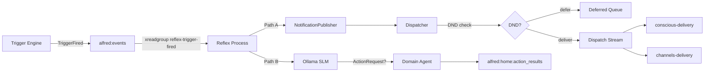

# D22: TriggerFired Notification Bridge + Reflex Reasoning

**Date:** 2026-03-23
**Status:** Draft
**Backlog ID:** D22

---

## 1. Problem

When a trigger fires without an `action` (e.g., reminders, sensor alerts), the Trigger Engine publishes a `TriggerFired` event to `alfred:events`. No consumer handles this event:

- The Reflex Engine reads from `alfred:home:state_changed`, not `alfred:events`
- The Trigger Engine's own event loop parses only `StateChangedEvent`, silently ACKing and discarding `TriggerFired`
- The Conscious Engine does not read from `alfred:events`

Result: the user never sees reminders or actionless trigger alerts.

---

## 2. Design Decisions

| Decision | Choice | Rationale |
|----------|--------|-----------|
| Notification timing | Parallel with Reflex reasoning | Notification is guaranteed even if SLM fails or is slow |
| Reflex input | Second `xreadgroup` on `alfred:events` in Reflex process | Keeps Reflex's `HOME_STATE_STREAM` contract clean; proven pattern from conscious process |
| Urgency source | Set by trigger creator on `BaseTrigger` model | LLM creating the trigger knows the intent best |
| Reflex capabilities | Full tool access on `TriggerFired` | The point of routing to Reflex — compose primitives (Pillar 5) |
| DND handling | Through `NotificationDispatcher` | Respects DND; URGENT bypasses, others defer. Reuses existing DND + drain infrastructure |
| DND calendar in Reflex | `DNDChecker` initialized without calendar adapter | Avoids adding CalDAV network I/O to the fast path. Manual Redis DND key check only. Calendar-based DND is checked by the conscious process's dispatcher |
| Notification content | Deterministic builder | Simple, no LLM cost. P6 (backlog) explores SLM-crafted notification text |
| Notification delivery | Reflex publishes to dispatch stream only | Reflex has no local channel adapters. Existing `conscious-delivery` and `channels-delivery` consumer groups handle actual delivery |

**Deferred to P6 (backlog):** Let the Reflex SLM decide whether/what/how to notify (urgency, wording, suppression) instead of immediate deterministic notification.

---

## 3. Schema Changes

### 3.1 BaseTrigger — New `urgency` Field

```python
# core/triggers/models.py

from core.notifications.schema import Urgency

class BaseTrigger(ABC, BaseModel):
    ...
    action: ActionPayload | None = None
    urgency: Urgency = Urgency.INFORMATIONAL  # NEW
```

Default `INFORMATIONAL`. The LLM sets this at trigger creation time (e.g., "remind me urgently" -> `IMPORTANT`).

**Backward compatibility:** Existing YAML snapshots in `core/memory/triggers/` won't have this field. Pydantic applies the default `INFORMATIONAL` during deserialization, so `TriggerStore.rehydrate_from_disk()` works without migration.

### 3.2 TriggerFired — New `urgency` Field

```python
# bus/schemas/events.py

class TriggerFired(BaseEvent):
    """A trigger's conditions were met. Emitted when trigger has no direct action."""

    event_type: str = "trigger_fired"
    source: str = "trigger-engine"
    trigger_id: str
    trigger_name: str
    trigger_type: str
    context: dict[str, Any] = Field(default_factory=dict)
    urgency: str = "informational"  # NEW — from trigger's urgency field
```

Uses `str` (not `Urgency` enum) to keep bus schemas decoupled from `core.notifications`. The default value ensures backward compatibility — existing serialized `TriggerFired` events without this field deserialize correctly.

### 3.3 TriggerEngine.fire() — Propagate Urgency

```python
# core/triggers/engine.py — in fire() method, else branch

event = TriggerFired(
    trigger_id=trigger.trigger_id,
    trigger_name=trigger.name,
    trigger_type=trigger.trigger_type,
    context=self._build_fire_context(trigger, context),
    urgency=trigger.urgency.value,  # NEW
)
```

---

## 4. TriggerFeature CRUD Updates

### 4.1 create_trigger

```python
@tool
async def create_trigger(
    self,
    name: str,
    trigger_type: str,
    conditions: dict[str, Any],
    action: dict[str, Any] | None = None,
    one_shot: bool = False,
    urgency: str = "informational",  # NEW
) -> dict[str, Any]:
```

### 4.2 update_trigger

```python
@tool
async def update_trigger(
    self,
    trigger_id: str,
    conditions: dict[str, Any] | None = None,
    action: dict[str, Any] | None = None,
    name: str | None = None,
    urgency: str | None = None,  # NEW
) -> dict[str, Any]:
```

Urgency validation in `update_trigger`:

```python
if urgency is not None:
    try:
        updates["urgency"] = Urgency(urgency)
    except ValueError:
        return {"error": f"Invalid urgency: {urgency}. Must be: informational, important, urgent"}
```

Same validation applies in `create_trigger` when converting the `urgency` string to the `Urgency` enum before storing on `BaseTrigger`.

### 4.3 Dynamic Tool Description

Appended as a new section after `action_docs` in `TriggerFeature.get_tools()`:

```python
urgency_docs = (
    "\n\nurgency (optional): \"informational\" | \"important\" | \"urgent\"\n"
    "Sets notification urgency when trigger fires without an action. Default: informational."
)
```

---

## 5. Reflex Engine — TriggerFired Processing

### 5.1 New Method: process_trigger_fired

```python
# core/reflex/engine.py

_TRIGGER_FIRED_PROMPT_TEMPLATE = """\
You are Alfred's Reflex Engine — a fast-acting steward for a smart home.

A trigger has fired. The user set up this trigger for a reason. Given the trigger details,
current home state, and user preferences, decide if any additional action is needed beyond
the notification already being sent to the user.

Rules:
- The user is ALREADY being notified about this trigger. You do NOT need to send a notification.
- Only act if an additional home automation action would be helpful given the context.
- If no additional action is needed, respond with: {{"action": "none"}}
- If an action IS needed, respond with:
  {{"tool_name": "<tool name>", "target_service": "<service>", "parameters": }}

{tool_section}

Respond ONLY with valid JSON. No explanation."""


@traced(name="reflex.process_trigger_fired")
@track_latency(category="reflex")
async def process_trigger_fired(self, event: TriggerFired) -> ActionRequest | None:
    """Process a TriggerFired event and optionally produce an action."""
    preferences = self._get_preferences()
    tools, _ = await self._get_tools_and_prompt()
    valid_services = ToolRegistry.get_registered_services(tools)

    tool_section = _build_tool_section(tools)
    system_prompt = _TRIGGER_FIRED_PROMPT_TEMPLATE.format(tool_section=tool_section)

    context = ""
    if self._context_reader is not None:
        context = await self._context_reader.get_rendered_context()

    context_section = f"## Home State\n{context}\n\n" if context else ""
    prompt = (
        f"{system_prompt}\n\n"
        f"{context_section}"
        f"## User Preferences\n{preferences}\n\n"
        f"## Trigger Fired\n"
        f"Name: {event.trigger_name}\n"
        f"Type: {event.trigger_type}\n"
        f"Context: {json.dumps(event.context)}\n\n"
        f"## Your Decision (JSON only):"
    )

    response = await ollama_client.infer(prompt)
    return self.parse_trigger_response(response, event, valid_services)
```

### 5.2 parse_trigger_response

Extract shared parsing logic into a private helper `_parse_slm_json`:

```python
def _parse_slm_json(
    self,
    response: dict[str, object],
    valid_services: set[str],
    log_label: str,
) -> ActionRequest | None:
    """Shared SLM JSON response parser. Used by both StateChangedEvent and TriggerFired paths."""
    try:
        raw = response.get("response", "")
        parsed = json.loads(str(raw))
        if parsed.get("action") == "none":
            logger.debug("No action for %s", log_label)
            return None
        tool_name = parsed.get("tool_name")
        if not tool_name:
            logger.warning("SLM response missing tool_name: %s", raw)
            return None
        target_service = str(parsed.get("target_service", ""))
        if target_service not in valid_services:
            logger.warning("SLM returned unregistered target_service: %s", target_service)
            return None
        return ActionRequest(
            source="reflex-engine",
            target_service=target_service,
            tool_name=str(tool_name),
            parameters=dict(parsed.get("parameters", {})),
        )
    except (json.JSONDecodeError, KeyError) as e:
        logger.error("Failed to parse SLM response: %s — %s", e, response)
        return None
```

Then `parse_response` and `parse_trigger_response` both delegate to `_parse_slm_json` with different `log_label` values:

```python
def parse_response(self, response, event: StateChangedEvent, valid_services) -> ActionRequest | None:
    return self._parse_slm_json(response, valid_services, log_label=event.entity_id)

def parse_trigger_response(self, response, event: TriggerFired, valid_services) -> ActionRequest | None:
    return self._parse_slm_json(response, valid_services, log_label=event.trigger_name)
```

---

## 6. Reflex Runner — Second Event Loop

New imports required in `core/reflex/__main__.py`:

```python
from bus.schemas.events import TriggerFired
from core.notifications.dnd import DNDChecker
from core.notifications.dispatcher import NotificationDispatcher
from core.notifications.publisher import NotificationPublisher
from core.notifications.schema import Urgency
from shared.streams import EVENTS_STREAM  # added to existing import
```

### 6.1 Consumer on alfred:events

```python
# core/reflex/__main__.py

EVENTS_GROUP = "reflex-trigger-fired"
EVENTS_CONSUMER = "worker-1"

async def _consume_trigger_fired(
    redis: AioRedis,
    engine: ReflexEngine,
    agent: DomainRouter,
    publisher: NotificationPublisher,
) -> None:
    """Second event loop — TriggerFired events from alfred:events."""
    await ensure_consumer_group(redis, EVENTS_STREAM, EVENTS_GROUP)

    while not _shutdown.is_set():
        entries = await redis.xreadgroup(
            EVENTS_GROUP, EVENTS_CONSUMER,
            {EVENTS_STREAM: ">"}, count=10, block=5000,
        )
        for _stream_key, stream_entries in entries:
            for entry_id, entry_data in stream_entries:
                try:
                    await _handle_trigger_fired(
                        entry_data, engine, agent, redis, publisher,
                    )
                    await redis.xack(EVENTS_STREAM, EVENTS_GROUP, entry_id)
                except Exception as e:
                    logger.error(
                        "Error processing trigger_fired %s: %s — will retry",
                        entry_id, e,
                    )
```

### 6.2 Entry Handler

```python
async def _handle_trigger_fired(
    entry_data: Mapping[str | bytes, str | bytes],
    engine: ReflexEngine,
    agent: DomainRouter,
    redis: AioRedis,
    publisher: NotificationPublisher,
) -> None:
    raw_event = entry_data.get("event") or entry_data.get(b"event")
    if raw_event is None:
        return

    event_str = decode_stream_value(raw_event)
    parsed = json.loads(event_str)

    if parsed.get("event_type") != "trigger_fired":
        return  # ACK and skip non-trigger_fired events

    trigger_event = TriggerFired.model_validate(parsed)

    # Path A: Immediate notification (DND-aware via dispatcher)
    urgency = Urgency(trigger_event.urgency)
    title = (
        f"Reminder: {trigger_event.trigger_name}"
        if trigger_event.trigger_type == "time"
        else f"Alert: {trigger_event.trigger_name}"
    )
    await publisher.publish(
        title=title,
        body=_build_notification_body(trigger_event),
        source="trigger-engine",
        urgency=urgency,
    )

    # Path B: Reflex SLM reasoning (concurrent additional actions)
    # Isolated from Path A — SLM failures must not prevent ACK,
    # since the notification was already sent above.
    try:
        action = await engine.process_trigger_fired(trigger_event)
        if action is not None:
            result = await agent.execute_action(action)
            await redis.xadd(
                HOME_ACTION_RESULTS_STREAM, {"event": result.model_dump_json()}
            )

            timestamp = datetime.now(UTC).strftime("%Y-%m-%dT%H:%M:%SZ")
            observation = (
                f"{timestamp} [reflex:trigger] "
                f"{action.tool_name}({action.parameters}) -> {result.status}"
            )
            await redis.lpush(SCRATCHPAD_QUEUE, observation)
    except Exception as e:
        logger.error("SLM reasoning failed for trigger '%s': %s", trigger_event.trigger_name, e)
```

### 6.3 Notification Body Builder

Lives in `core/reflex/engine.py` (not `__main__.py`) for testability — the entry-point module is hard to import in tests without triggering bootstrap side effects.

```python
def _build_notification_body(event: TriggerFired) -> str:
    """Build a human-readable notification body from TriggerFired context."""
    parts: list[str] = []
    if event.context.get("event_entity"):
        entity = event.context["event_entity"]
        state = event.context.get("event_state")
        parts.append(f"{entity}: {state}" if state else str(entity))
    if event.context.get("evaluated_at"):
        parts.append(f"Fired at {event.context['evaluated_at']}")
    return " | ".join(parts) if parts else f"Trigger '{event.trigger_name}' fired"
```

### 6.4 Wiring in run()

```python
async def run(config: AlfredConfig) -> None:
    ...
    # Notification wiring (minimal — no trigger store, no calendar adapter)
    # calendar_adapter=None: avoids CalDAV network I/O on the fast path;
    #   only the manual Redis DND key is checked here.
    # trigger_store=None: drain triggers for deferred notifications are NOT
    #   created here. This is intentional — the conscious process's dispatcher
    #   owns drain trigger creation. If a notification is deferred here and
    #   DND has a known expiry, the conscious process's next dispatch cycle
    #   will create the drain trigger.
    dnd_checker = DNDChecker(redis=r, calendar_adapter=None)
    dispatcher = NotificationDispatcher(redis=r, dnd_checker=dnd_checker)
    publisher = NotificationPublisher(dispatcher)

    # Background tasks
    scratchpad_task = asyncio.create_task(writer.run())
    telemetry_task = asyncio.create_task(flush_telemetry_periodically(config))
    trigger_fired_task = asyncio.create_task(          # NEW
        _consume_trigger_fired(r, engine, router, publisher)
    )

    ...
    finally:
        ...
        trigger_fired_task.cancel()                    # NEW
        ...
```

---

## 7. Data Flow



---

## 8. Testing

### 8.1 Unit Tests

| # | Test | Module |
|---|------|--------|
| 1 | `BaseTrigger.urgency` defaults to `INFORMATIONAL`, accepts all values | `core/triggers/tests/` |
| 2 | `TriggerFired.urgency` serialization round-trip | `bus/schemas/tests/` |
| 3 | `TriggerEngine.fire()` propagates urgency to `TriggerFired` | `core/triggers/tests/` |
| 4 | `ReflexEngine.process_trigger_fired()` builds correct prompt | `core/reflex/tests/` |
| 5 | `ReflexEngine.process_trigger_fired()` parses SLM response | `core/reflex/tests/` |
| 6 | `_build_notification_body()` — time, sensor, empty context | `core/reflex/tests/` |
| 7 | `TriggerFeature.create_trigger()` stores urgency on model | `core/triggers/tests/` |
| 8 | `TriggerFeature.update_trigger()` updates urgency | `core/triggers/tests/` |

### 8.2 Integration Tests

| # | Test | Scope |
|---|------|-------|
| 9 | `TriggerFired` on `EVENTS_STREAM` -> notification on `NOTIFICATION_DISPATCH_STREAM` + SLM called | Full pipeline (mocked Ollama + fakeredis) |
| 10 | DND active + urgency `INFORMATIONAL` -> notification deferred | Dispatcher integration |
| 11 | DND active + urgency `URGENT` -> notification delivered | Dispatcher integration |
| 12 | Non-`trigger_fired` events ACKed and skipped | Consumer filtering |

---

## 9. Files Changed

| File | Change |
|------|--------|
| `bus/schemas/events.py` | Add `urgency: str` field to `TriggerFired` |
| `core/triggers/models.py` | Add `urgency: Urgency` field to `BaseTrigger` |
| `core/triggers/engine.py` | Pass `trigger.urgency.value` into `TriggerFired` |
| `core/triggers/feature.py` | Add `urgency` param to `create_trigger` + `update_trigger`, update dynamic description |
| `core/reflex/engine.py` | Add `process_trigger_fired()` method + prompt template |
| `core/reflex/__main__.py` | Second event loop, notification wiring, `_build_notification_body()` |
| `bus/schemas/tests/test_events.py` | `TriggerFired.urgency` test |
| `core/triggers/tests/` | Urgency propagation tests |
| `core/reflex/tests/` | `process_trigger_fired` + notification body tests |
| `docs/backlog/remaining-work.md` | Mark D22 as done, P6 already added |

---

## 10. Non-Goals

- **SLM-crafted notification text** — deferred to P6
- **Reflex-controlled notification suppression** — deferred to P6
- **New trigger types** — no new types needed
- **Changes to conscious engine** — conscious doesn't participate in this flow
- **Changes to notification delivery workers** — existing `conscious-delivery` and `channels-delivery` consumer groups handle dispatch stream unchanged
