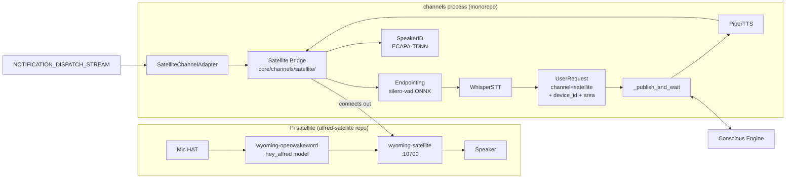

# Voice Satellites — Physical "Alfred on Demand" Devices

**Date:** 2026-07-15
**Status:** Approved
**Scope:** v1 — core voice loop, room-aware context, proactive announcements, speaker identification

## 1. Overview

Alexa-like physical devices placed in rooms of the home. Each satellite wakes on a custom
"Hey Alfred" wake word, streams the utterance to Alfred, and plays back the spoken reply.
Satellites also act as output devices for proactive URGENT notifications and identify who is
speaking via voiceprint.

This fills the "wake word support" future-work item from the expanded vision spec
(`2026-03-19-alfred-expanded-vision-design.md`).

## 2. Decisions

| Decision | Choice | Rationale |
|---|---|---|
| Hardware | Raspberry Pi Zero 2 W + ReSpeaker 2-Mic HAT + small speaker (~$45/device) | Linux/Python, no firmware work, runs the proven Wyoming stack standalone |
| Protocol | Wyoming (satellite side is stock `wyoming-satellite`) + a new Alfred-side bridge | Zero custom firmware; wake/VAD/audio plumbing are solved problems; any Wyoming device can join later; no Home Assistant in the loop |
| Wake word | Custom "Hey Alfred" openWakeWord model, detection **on-device** | Audio never leaves the device until the wake word fires; training pipeline is one-time work on the 4090 |
| v1 features | Voice Q&A, room-aware context, proactive announcements, speaker ID | Timers, music, presence targeting, barge-in, multi-turn follow-up deferred (see §9) |

## 3. Architecture

Two halves, split by the Decoupled Domains pillar:

1. **Pi side — new repo `alfred-satellite`** (workspace sibling of `home-service`,
   `signal-bridge`). Stock third-party software (`wyoming-satellite` + `wyoming-openwakeword`
   as systemd services) plus our custom `hey_alfred` wake word model. Zero firmware. The
   device speaks standard Wyoming and would work with plain Home Assistant — genuinely
   sovereign.
2. **Alfred side — Satellite Bridge** in the monorepo at `core/channels/satellite/`, running
   as asyncio tasks inside the existing **channels process**. Whisper and Piper are already
   loaded there (no duplicate model copies), and the `channels-delivery` notification worker
   already runs there.

**Connection model:** Wyoming inverts the usual direction — each satellite listens on
port 10700 and the *server connects to it*. The bridge reads `config/satellites.yaml`
(path overridable via `SATELLITES_CONFIG` env var) and maintains one persistent connection
per satellite with reconnect + exponential backoff. Event-driven end to end; no polling.
The bridge is a TCP *client*, so no new listening ports open on the Alfred server, and
satellites never need credentials to reach Alfred. Wyoming itself is unauthenticated —
satellites must live on the trusted network (LAN/Tailscale), consistent with
`require_trusted_network` elsewhere.

## 4. Components

### 4.1 `alfred-satellite` repo (new, Pi side)

- **Provisioning script** — one-shot setup on a fresh Pi OS Lite image: installs
  `wyoming-satellite` + `wyoming-openwakeword`, drops systemd units, writes device config
  (satellite name, audio devices, wake word model), enables services.
- **Wake word training pipeline** — openWakeWord synthetic-speech training for
  "Hey Alfred" (script + docs; runs on the CachyOS 4090). Output artifact
  `hey_alfred.tflite` is versioned in the repo.
- **Config templates + systemd units** — mic/speaker device names for the ReSpeaker HAT,
  LED/button hooks, feedback earcons (wake-acknowledge, error) via wyoming-satellite's
  built-in sound options.
- **Docs** — parts list, assembly, flashing, troubleshooting.

### 4.2 Satellite Bridge — `core/channels/satellite/` (monorepo)

- `config.py` — Pydantic model + loader for `config/satellites.yaml`: per-satellite
  `name`, `host`, `port`, `area` (must match HA area names).
- `bridge.py` — connection manager: one task per configured satellite, Wyoming event
  handling (`wyoming` PyPI package), reconnect with exponential backoff, exposes
  `play_audio(device_id, wav_bytes)` for announcements.
- `pipeline.py` — per-utterance flow: endpointing (streaming silero-vad ONNX;
  onnxruntime is already a dependency via Piper) → `WhisperSTT.transcribe` and
  `SpeakerID.identify` (both via `asyncio.to_thread`, per channels convention) →
  `UserRequest` → `_publish_and_wait()` (extracted from `web_server.py` into a shared
  channels helper so web and satellite use one implementation, 60s timeout) →
  `PiperTTS.synthesize` → stream audio back to the satellite.
- Started from the channels process lifespan, next to the delivery worker.

### 4.3 Schema changes — `bus/schemas/events.py`

- `UserRequest.channel` literal gains `"satellite"`.
- Three new **optional** fields (backward-compatible; schema-reviewer agent on the diff):
  `device_id: str | None`, `area: str | None`, and `identity_confidence: float | None` —
  the transport for speaker-ID confidence into the IdentityGate (absent → the gate keeps
  its current per-channel local-claim behavior).

### 4.4 Room-aware context

The `area` field flows two ways:
- **Context Assembler** injects "speaking from the <area> satellite" into Conscious Engine
  context, so "turn off the lights" resolves to that room's lights.
- Available to HomeAgent/home-service for HA area targeting.
Nothing hardcoded — areas come from `satellites.yaml`.

### 4.5 Speaker ID — `core/voice/speaker_id.py` (stub → real)

- ECAPA-TDNN voiceprint embeddings (SpeechBrain; torch already present via the `memory`
  extra — SpeechBrain goes in the `voice` extra).
- Storage: Redis hash `alfred:identity:voiceprint` (as the stub docstring already planned).
- `identify()`: cosine similarity vs enrolled prints; ≥ threshold (~0.7, tunable) →
  the match's identity and confidence go on the `UserRequest` (`identity_claim` +
  `identity_confidence`, see §4.3) for the existing IdentityGate; below → `unknown`,
  request falls back to local-claim trust (0.7) like web/iOS.
- **Enrollment:** "Voice enrollment" card on the web Settings page records 3 mic samples →
  `POST /api/voice/enroll` (trusted-network + cookie gated, like other sensitive routes).

### 4.6 Announcements — `core/notifications/adapters/satellite.py`

- `SatelliteChannelAdapter(ChannelAdapter)` registered via `@ChannelRegistry.register()`,
  loaded in the channels process — the existing `channels-delivery` consumer group picks it
  up with **zero dispatcher changes**.
- `deliver()`: URGENT notifications only (mirrors the WebSocket adapter policy) →
  Piper TTS → `bridge.play_audio()` on **all online satellites**. Offline satellites are
  skipped with a WARNING log.

## 5. Voice loop (end to end)

1. Pi detects "Hey Alfred" locally. Pre-wake audio never leaves the device.
2. `wyoming-satellite` signals pipeline start and streams mic audio over the persistent
   connection; on-device earcon acknowledges the wake.
3. Bridge endpointing (silero-vad) detects end of utterance.
4. Whisper transcribes; SpeakerID identifies (parallel).
5. `UserRequest(channel="satellite", device_id=…, area=…, identity from speaker ID or
   local-claim fallback)` → `_publish_and_wait()` → Conscious Engine.
6. Piper synthesizes the reply; bridge streams it back; satellite plays it and returns to
   idle.

Latency target: wake → first reply audio under ~4s typical (cloud LLM is the long pole).

## 6. Error handling

- **Satellite offline** → reconnect with exponential backoff (WARNING log, runner
  conventions). Announcements skip offline satellites. No crash, no retry storm.
- **Pipeline stage failure** (STT error, Conscious timeout, TTS error) → satellite plays
  its error earcon and returns to idle; 60s timeout reused from the web channel.
- **Pi Zero 2 W too slow for on-device wake word** (known risk — openWakeWord is near the
  Zero 2 W's limits) → documented fallback: point `wyoming-satellite` at a server-side
  `wyoming-openwakeword` instance. Privacy tradeoff, chosen per-device.
- **Redis down** → bridge keeps satellite connections alive, answers with the error earcon;
  broader recovery is the existing Redis-down backlog item.

## 7. Testing

- **Unit:** fake in-process Wyoming satellite (asyncio server emitting protocol events)
  drives the bridge with canned WAV fixtures — connection lifecycle, endpointing, pipeline
  flow, reconnect, announcement push. SpeakerID enroll/identify tests with recorded
  fixtures. Schema backward-compat tests.
- **Live dev (no hardware):** `wyoming-satellite` runs on the MacBook with its built-in
  mic against the local runner — full loop before any Pi is ordered.
- **Manual QA:** `docs/qa-backlog/` items for real-Pi validation (wake word accuracy
  across the room, latency, announcement audibility).
- `mypy --strict`, `ruff`, plus `pillar-reviewer` and `schema-reviewer` agents on the diff.

## 8. New dependencies (monorepo)

- `wyoming` (protocol events) — base deps.
- `silero-vad` ONNX model (runs on existing onnxruntime) — base deps, model
  auto-downloaded on first use (matching the Piper pattern).
- `speechbrain` — `voice` extra.

## 9. Out of scope for v1 (tracked in `docs/backlog/`)

- Timers/alarms with local satellite state (`medium/satellite-timers-alarms.md`)
- Multi-turn hands-free follow-up (`medium/satellite-multi-turn-followup.md`)
- Presence-aware announcement targeting — must compose from primitives (HA motion +
  last-interaction), not be hardcoded (`medium/satellite-presence-aware-announcements.md`)
- mDNS auto-discovery of satellites (`low/satellite-mdns-discovery.md`)
- Barge-in / interrupting Alfred mid-reply (`low/satellite-barge-in.md`)
- Music/media playback (`low/satellite-music-playback.md`)
- Voice-driven enrollment ("Alfred, learn my voice") (`low/voice-enrollment-by-voice.md`)
