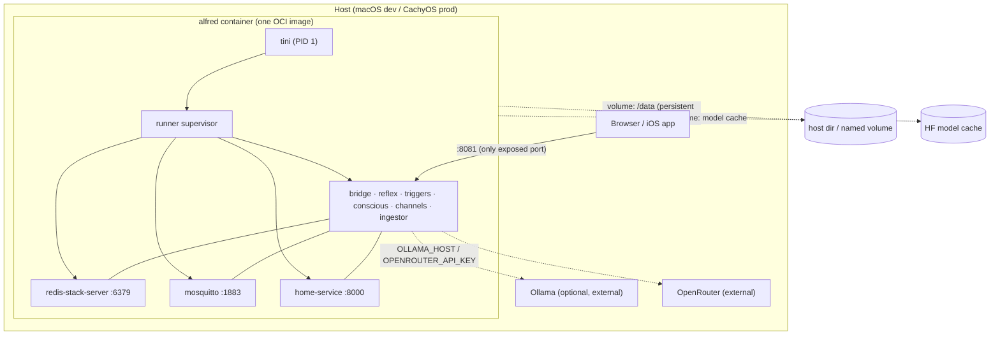

# Alfred Containerization Design

**Status:** Approved design (brainstorming complete)
**Date:** 2026-07-19
**Author:** Anirudh Lath (with Claude)
**Scope:** Repackage Alfred as a single, OCI-compliant "fat" container that a first-time
user can run with one command, that a developer can spin up per-worktree/branch with zero
port fuss, and that runs identically on Docker and Apple `container`.

---

## 1. Goals & Non-Goals

### Goals

1. **One command, full system.** A newcomer runs a single command and gets a working
   Alfred — web UI reachable, chat working — with no Homebrew, no multi-repo checkout, no
   manual infra.
2. **Platform-agnostic, both runtimes first-class.** The same image and the same launch
   UX work on **Docker** and **Apple `container`** (Podman as a bonus). No dependency on
   host OS services for Redis/MQTT.
3. **Ergonomic dev/worktree testing.** A developer can bring up an isolated stack for any
   worktree/branch and "kill it, start fresh" elsewhere without port collisions or shared
   state.
4. **Prod-ready persistence.** The same image runs in production with durable external
   data; dev runs ephemeral or seeded with disposable dummy data.
5. **Inference is external.** No model runtime is bundled. The container talks to an
   external OpenRouter endpoint (via LiteLLM) and/or a host/remote Ollama.

### Non-Goals

- **Not** bundling Ollama / GPU inference in the image.
- **Not** a Kubernetes / multi-node orchestration design (single-host is the target).
- **Not** publishing prebuilt images to a registry in this iteration (build-from-source;
  registry publishing is a later backlog item).
- **Not** rewriting home-service (tracked separately as HA Plan 2).

---

## 2. Approach: Single "Fat" Container

Alfred at runtime is Redis Stack + Mosquitto + six core services + home-service. Rather
than orchestrate four+ containers (which Apple `container` cannot do — it has no compose
and no `-p` port mapping; every container is its own VM with its own IP), we bake the
**entire runtime into one OCI image** supervised by an in-container init.

### Why fat (accepted trade-offs)

| Benefit | Cost we accept |
|---|---|
| One `run` command, identical on Docker & Apple `container` | We own packaging of Redis Stack + Mosquitto (versions, patches) |
| No compose, no translation shim, no port namespacing | Larger image; multi-process container needs a correct init |
| Worktree isolation = kill & restart one container | Not a cloud-native per-service scaling topology |
| Expose only the web port; everything else internal | dev ≠ prod at the process-isolation level (mitigated: same image both) |

The classic objection to fat containers — *don't weld a stateful database to a
fast-moving app* — is handled by **externalizing all state** (Section 4) and by using a
**correct init** (Section 3), not by splitting the container.

### Runtime topology



Only `:8081` (web UI / PWA / iOS) is published. Redis, MQTT, and home-service stay
internal. `:1883` (real HA edge broker) and `:8000` (home-service debug) are opt-in.

---

## 3. Process Model Inside the Container

**`tini` as PID 1** handles zombie reaping and signal forwarding — the one genuine
fat-container footgun. `tini` execs the **extended `runner` supervisor**, which becomes
the single orchestrator for *all* in-container processes.

### Extend `ServiceSpec` to run native binaries

Today `runner/supervisor.py` supervises Python modules (`ServiceSpec(module=...)`). We
generalize it so a spec can also launch a native command:

```python
@dataclass
class ServiceSpec:
    name: str
    module: str | None = None          # python -m <module>   (existing)
    command: list[str] | None = None   # native argv           (new)
    delay: float = 0.0
    watch_dirs: list[str] | None = None
    ready_check: Callable[[], Awaitable[bool]] | None = None  # new: gate dependents
```

The container's service list becomes (ordered, with readiness gating):

```
redis-stack-server  (command, ready_check: PING + MODULE LIST has search)
mosquitto           (command, ready_check: publish test topic)
bridge              (module=bus)
reflex              (module=core.reflex,  delay=1.0)
triggers            (module=core.triggers)
conscious           (module=core.conscious, delay=2.0)
channels            (module=core.channels,  delay=2.0)
memory-ingestor     (module=core.memory.ingestor_main, delay=1.5)
home-service        (command=uvicorn app.server:app --port 8000)
```

The runner already provides staggered start delays, crash backoff, and auto-restart —
we reuse all of it. **Hot-reload stays a dev-only concern** (`--no-reload` is the
container default; `alfredctl up --dev` can enable it with a bind-mounted source tree).

**Alternative considered:** `s6-overlay` (battle-tested for multi-process images). Rejected
to avoid a non-Python runtime dependency and to reuse the supervisor we already maintain.
`tini` covers the only thing the runner lacks (correct PID-1 semantics).

### Component contract — extended runner

- **Does:** starts, health-gates, and supervises every process in the container as one
  ordered dependency graph; restarts crashed services with backoff.
- **Used via:** `python -m runner` (entrypoint) — no arguments needed in container mode.
- **Depends on:** `ServiceSpec` definitions, `shared.config`, the native binaries present
  in the image.

---

## 4. State Consolidation (Prerequisite Refactor)

**Problem found during design:** Alfred writes runtime-mutable state *inside the Python
package tree*, not a single data root. In a container the app is installed to
site-packages, so these writes land in the installed package — lost on rebuild, impossible
to bind-mount cleanly.

| State | Written today | Should live under |
|---|---|---|
| Scratchpad | `core/memory/scratchpad.md` | `$ALFRED_DATA_DIR/scratchpad.md` |
| Episodic cold store (SQLite) | `core/memory/episodic_cold.db` | `$ALFRED_DATA_DIR/episodic_cold.db` |
| Procedural memory (routines) | `core/memory/routines/*.yaml` | `$ALFRED_DATA_DIR/routines/` |
| Learned prefs (Librarian writes) | `core/memory/preferences/learned.md` | `$ALFRED_DATA_DIR/preferences/` |
| WebAuthn creds | `data/credentials.db` (already `ALFRED_DATA_DIR`) | ✅ already correct |
| Research vault | `./research` (`RESEARCH_VAULT_PATH`) | `$ALFRED_DATA_DIR/research` (default) |
| Redis persistence | (n/a in-package) | `$ALFRED_DATA_DIR/redis/` |
| Secrets store | OS keyring | `$ALFRED_DATA_DIR/secrets/` (container backend) |

### Design

Introduce a single resolver in `shared/config.py`:

```python
ALFRED_DATA_DIR = Path(os.getenv("ALFRED_DATA_DIR", "data")).resolve()
def data_path(*parts: str) -> Path: ...   # ensures dir exists, returns child
```

Every module that writes state derives its path from `data_path(...)` instead of
`Path(__file__).parent`. **Read-only seed content** (the shipped default preference
`.md` files, routine templates) stays in the package; on first boot the app copies any
missing writable files from package defaults into `$ALFRED_DATA_DIR`. This preserves the
"core preference files are never edited at runtime" pillar — the package copies are
read-only templates; the writable copies live in the data dir.

**Modules touched:** `shared/config.py`, `core/memory/scratchpad_writer.py`,
`core/memory/ingestor_main.py`, `core/memory/routines/store.py`,
`core/memory/reader.py` + `core/librarian/consolidator.py` (preferences dir),
`core/memory/sqlite_vec_store.py` callers. `core/identity/credentials.py` is already
compliant and becomes the pattern.

### Data modes — one env var

`ALFRED_DATA_MODE` selects behavior; `alfredctl` sets it for you:

| Mode | `ALFRED_DATA_DIR` | Redis persistence | Boot behavior | Use |
|---|---|---|---|---|
| `persistent` | bind-mount / named volume | AOF on | reuse existing data | **prod** |
| `ephemeral` | in-container throwaway dir | RDB off | empty every start | worktree / CI |
| `seed` | in-container throwaway dir | RDB off | copy bundled `fixtures/` on boot | **dev demo** |

`fixtures/` ships a dummy HA snapshot, a sample authenticated user, and a handful of
memories/routines so a fresh worktree comes up with realistic *disposable* state — the
"dummy external data for dev" requirement.

---

## 5. Image Build — Fat Containerfile

Multi-stage, produces one image. **Build context = workspace root** (needs `alfred/`,
`home-service/`, and `alfred/sdk/`).

```
Stage 1  webbuild   node:22-slim → npm ci → npm run build → /web/dist
Stage 2  runtime    python:3.13-slim (bookworm)
  - install redis-stack-server + mosquitto from their official Debian sources
  - install tini
  - uv pip install --system .[voice,memory,integrations]
  - install alfred-sdk (from sdk/) + home-service (app/ + alfred_ext/)
  - COPY --from=webbuild /web/dist → /app/web/dist
  - copy fixtures/, package default preferences/routines templates
  - ENTRYPOINT ["tini","--","python","-m","runner"]
```

### Key decisions

- **Extras baked in:** `voice`, `memory`, `integrations` (today's Containerfile installs
  none — a current bug that silently disables voice + vector memory).
- **Redis Stack, not `redis:7-alpine`:** RediSearch is required for vector memory. The
  current prod `docker-compose.yml` uses `redis:7-alpine`, which silently breaks memory —
  fixed here.
- **Models are NOT baked** (decision: cached volume). See Section 6.
- **arm64/x86 parity (validation task):** dev is Apple Silicon (arm64), prod is x86_64.
  Verify `redis-stack-server` is installable for both arches via the Debian source; if an
  arch is missing, fall back to a multi-stage `COPY --from=redis/redis-stack-server`
  (Debian-based, glibc-compatible with the slim base). Mosquitto ships Debian arm64 +
  amd64 packages. **This is the single riskiest build assumption — validate first.**
- **Co-packaging home-service:** the image contains home-service source. This is a
  *packaging* convenience only; home-service remains sovereign at the code/protocol level
  (it still talks to Alfred solely via alfred-sdk / Redis, never imports monorepo code).
  home-service keeps its own standalone Containerfile for independent deployment.

### `.dockerignore` / `.containerignore`

Keep excluding `.venv`, caches, `.git`, `.worktrees`, `research/`, `data/`, `.env`,
`secrets/`, `web/node_modules`, `web/dist` (rebuilt in-image).

---

## 6. Models — Cached Volume

Models (`faster-whisper`, Piper, ECAPA speaker-id, `embeddinggemma-300m`) download to a
**dedicated cache volume mounted in every mode** (`HF_HOME` → volume). Because it is a
*cache*, not app data, it is mounted even in `ephemeral`/`seed` — so worktrees share one
cache and never re-download gigabytes on teardown.

- `HF_HOME=/models` (or similar) → volume `alfred_models`.
- **`embeddinggemma-300m` is HF-license-gated.** First-run download requires an `HF_TOKEN`
  (and one-time license acceptance on huggingface.co). `alfredctl` passes `HF_TOKEN`
  through if set and prints a clear message if the gated download fails.
- **Backlog:** evaluate a non-gated default embedding model (or ship the embedding weights
  via a redistributable mirror) to remove the HF-token friction from first-run.
  See `docs/backlog/`.
- `HF_HUB_OFFLINE` is **not** forced (models must download on first boot); after warm
  cache, startup is offline-capable.

---

## 7. Networking, Exposure & External Inference

### Port exposure

- **Exposed by default:** `:8081` only (web UI / PWA / iOS client).
- **Opt-in:** `:1883` (`--expose-ha`, for a real Home Assistant publishing to the edge
  broker), `:8000` (`--expose-home`, home-service debugging).
- **Never exposed:** `:6379` (Redis).

Docker/Podman: `-p 8081:8081`. Apple `container`: no `-p`; the service is reached at
`<container-ip>:8081`. `alfredctl` resolves and **prints the reachable URL(s)** after `up`.

### External inference

Config via env only (no bundled runtime):

- `OPENROUTER_API_KEY` + model (via LiteLLM) — **first-run default; no GPU required**;
  both System 1 (reflex) and System 2 (conscious) route through LiteLLM.
- `OLLAMA_HOST` — point at a host/remote Ollama for local System 1. `alfredctl` injects
  the correct host-gateway per runtime: `host.docker.internal` (Docker),
  `host.containers.internal` (Podman), the vmnet gateway (Apple `container`).

**Documented caveat:** the reflex sub-500ms target does not hold over a cloud endpoint;
local Ollama is the path for that. Cloud is fine for first-run/demo.

### Trusted-network auth gate (finding)

`require_trusted_network` (localhost + Tailscale `100.64.0.0/10`) guards WebAuthn
registration and the admin API. Requests arriving through a container network appear to
come from the **bridge/vmnet gateway** (e.g. Docker `172.16.0.0/12`, Apple `container`
`192.168.64.0/24`), *not* localhost — which would **block first-run passkey registration**.

**Fix:** make trusted ranges configurable via `ALFRED_TRUSTED_NETWORKS` (comma-separated
CIDRs) and have `alfredctl` add the active runtime's container subnet automatically. Ship
sane defaults for both runtimes. Tracked as part of this spec's implementation.

---

## 8. Launcher — `alfredctl`

A small in-repo `typer` + `rich` CLI (matches project conventions). It **replaces
`scripts/dev-up.sh`, `dev-down.sh`, `dev-logs.sh`** (deleted) and the Homebrew infra path
entirely. Under the hood it issues plain `run` commands — **no compose, no shim**.

### Commands

| Command | Behavior |
|---|---|
| `alfredctl up [--mode persistent\|ephemeral\|seed] [--persist PATH] [--dev] [--expose-ha] [--expose-home] [--runtime docker\|container\|podman]` | build if needed, run one container, wire env/volumes/ports, print URL(s) |
| `alfredctl down` | stop & remove this worktree's container |
| `alfredctl logs [-f]` | stream container logs |
| `alfredctl shell` | exec into the container |
| `alfredctl urls` | print reachable URL(s) for the running container |
| `alfredctl smoke` | run the containerized smoke test |
| `alfredctl build` | build the image for the detected runtime |

### Runtime autodetection

Prefer Apple `container` on macOS when present → else Docker → else Podman. `--runtime`
overrides. Detection also determines the host-gateway value and the URL-resolution method
(published port vs container IP).

### Worktree isolation

Container name derives from the current branch: `alfred-<sanitized-branch>`. Therefore:

- "Kill and start fresh" in another worktree = `alfredctl down && alfredctl up` there.
- **Apple `container`:** each stack gets its own IP → **run many worktrees in parallel,
  zero port juggling** (a direct payoff of the platform-agnostic choice).
- **Docker:** when multiple run at once, the launcher auto-selects a free host port for
  `:8081` and prints it (single-worktree default just uses `8081`).

### Component contract — `alfredctl`

- **Does:** the entire "bring Alfred up/down" UX across runtimes and data modes, including
  per-worktree naming, gateway injection, and URL resolution.
- **Used via:** `uv run alfredctl <cmd>` (also exposed as a `project.scripts` entry point).
- **Depends on:** a container runtime on PATH, the built image, `shared.config` for
  defaults. Pure orchestration — no import of core runtime code.

---

## 9. Production Deployment

Prod on the CachyOS/4090 box uses a **minimal `compose.yaml` that runs the same single fat
image** with the external data volume and `restart: unless-stopped` (so it survives
reboots) — a "compose of one," not the old multi-service file.

```yaml
services:
  alfred:
    image: alfred:latest        # built locally (registry publishing = later backlog)
    env_file: .env
    environment:
      ALFRED_DATA_MODE: persistent
      ALFRED_DATA_DIR: /data
    volumes:
      - alfred_data:/data
      - alfred_models:/models
    ports:
      - "8081:8081"             # + 1883 when a real HA integration is added
    restart: unless-stopped
volumes:
  alfred_data:
  alfred_models:
```

The old multi-service `docker-compose.yml` (partial + wrong Redis image) and the
`.devcontainer` `redis:7-alpine` are reconciled to this single-image model. The
`.devcontainer` is updated to build/run the fat image so cloud dev matches local.

---

## 10. Secrets in Containers

`shared/secrets.py` currently uses the OS keyring — **no Secret Service exists in a Linux
container**, so it fails. Select the backend by environment:

- **macOS native dev:** real Keychain (default, unchanged).
- **Container:** an **encrypted-file backend** storing under `$ALFRED_DATA_DIR/secrets`,
  unlocked by `ALFRED_SECRETS_PASSPHRASE`. In `persistent` mode credentials (and the APNs
  `.p8`) survive on the mounted data dir; in `ephemeral`/`seed` they are dummy or entered
  fresh.

The keyring public API in `shared/secrets.py` is unchanged for all callers — only the
backend selection is added. Integration adapters, `CredentialStore`, and the credential
push worker are unaffected.

---

## 11. What Gets Deleted / Reconciled

| Item | Action |
|---|---|
| `scripts/dev-up.sh`, `dev-down.sh`, `dev-logs.sh` | **Delete** — replaced by `alfredctl` |
| `docker-compose.yml` (multi-service, `redis:7-alpine`) | **Replace** with compose-of-one (Section 9) |
| `.devcontainer/docker-compose.yml` (`redis:7-alpine`) | **Reconcile** to fat image |
| `Containerfile` (installs no extras, reflex-only CMD) | **Rewrite** as fat image (Section 5) |
| `home-service/Containerfile`, `signal-bridge/Containerfile` | **Keep** — sovereign standalone deploys |
| `README.md` "Setup/Run" section | **Rewrite** around `alfredctl` |

---

## 12. Testing Strategy

1. **Unit:** `data_path()` resolution + first-boot template copy; `ServiceSpec` native
   command + `ready_check` gating; secrets backend selection by env.
2. **Container build (CI):** build the fat image on amd64 **and** arm64; assert
   redis-stack + mosquitto present and RediSearch loads (`MODULE LIST`).
3. **Boot smoke (containerized `alfredctl smoke`):** `up --mode seed` → wait for
   readiness → assert `:8081/health` 200, Redis PING, RediSearch present, a chat round-trip
   via WebSocket, first-run WebAuthn registration reachable through the container gateway.
4. **Data-mode tests:** `persistent` retains data across `down`/`up`; `ephemeral` starts
   empty; `seed` loads fixtures.
5. **Both runtimes:** the boot smoke runs under Docker and Apple `container` in local dev
   (CI runs Docker; Apple `container` is a manual QA ticket — no macOS CI runner).

Existing `pytest` suite (1107 backend) must stay green after the state-consolidation
refactor. `mypy --strict` clean.

---

## 13. Risks & Open Questions

| Risk | Mitigation |
|---|---|
| `redis-stack-server` arm64 Debian availability | Validate first; fall back to `COPY --from=redis/redis-stack-server` |
| Image size (voice deps: torch/speechbrain) | Accepted; models are a separate cache volume, not in-image |
| Gated `embeddinggemma-300m` first-run friction | `HF_TOKEN` documented; backlog: non-gated default |
| Trusted-network gate blocks passkey reg via container net | `ALFRED_TRUSTED_NETWORKS` + auto-add runtime subnet (Section 7) |
| Apple `container` vmnet gateway address for host Ollama | Determine empirically; `alfredctl` resolves it |
| Multi-process container obscures per-service failures | runner logs per-service prefixes; `alfredctl logs` + `shell` |
| `home-service` co-packaging couples repos at build | Build-context copy (like current home-service Containerfile); code stays sovereign |

### Open questions for implementation planning

1. Exact `redis-stack-server` install mechanism per arch (apt source vs multi-stage COPY).
2. Encrypted-file keyring backend: `keyrings.alt` vs a small first-party
   `EncryptedFileKeyring` — pick during planning.
3. Whether `--dev` (bind-mount source + hot-reload) is in scope for v1 or a follow-up.

---

## 14. Implementation Phases (for the plan)

1. **State consolidation** — `data_path()` + route all writers + first-boot template copy
   + tests. (Foundational; unblocks everything.)
2. **Runner generalization** — native-command `ServiceSpec` + `ready_check` gating + tests.
3. **Secrets backend selector** — env-driven backend + tests.
4. **Trusted-network config** — `ALFRED_TRUSTED_NETWORKS` + defaults.
5. **Fat Containerfile** — build (validate arm64 first), CI build job.
6. **`alfredctl`** — runtime detection, data modes, worktree naming, URL resolution, smoke.
7. **Prod compose-of-one + `.devcontainer` reconcile + delete legacy scripts.**
8. **Docs** — README rewrite, `docs/containerization.md`, backlog items, QA tickets for
   Apple `container` manual verification.

---

## Appendix A — Decisions Log

| Question | Decision |
|---|---|
| Stack scope | Full runnable Alfred (core + home-service + redis + mqtt), HA/Ollama external |
| Inference | External only (OpenRouter via LiteLLM default; host Ollama optional) |
| Runtimes | Apple `container` + Docker first-class; Podman bonus; **no Homebrew infra** |
| Container shape | Single fat image (redis + mqtt + core + home-service) |
| Data | External for prod; ephemeral/dummy for dev; one `ALFRED_DATA_MODE` switch |
| Init | `tini` PID 1 + extended `runner` supervisor (not s6) |
| Models | Cached volume (not baked); `HF_TOKEN` for gated embedding |
| Launcher | `typer` `alfredctl` CLI (replaces `dev-up.sh`) |
| Worktree isolation | Kill & restart one branch-named container; parallel on Apple `container` |
