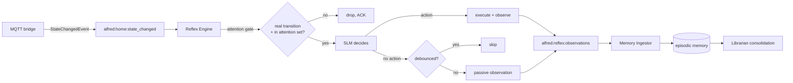

# Passive Observation — Recording What Alfred Sees But Doesn't Act On

**Status:** proposed
**Date:** 2026-09-03

## Problem

Alfred has consumed 404,000 `state_changed` events and remembers none of them.

Episodic memory is written only by the Memory Ingestor, which consumes
`alfred:reflex:observations`. A `ReflexObservation` is published in exactly one
place — `core/reflex/runner.py: process_stream_entry()`, *after* an action has
been executed:

```python
action = await engine.process_event(event)
if action is None:
    logger.debug("No action for event %s", event.entity_id)
    return False          # nothing recorded, event gone

result = await agent.execute_action(action)
await redis.xadd(result_stream, {"event": result.model_dump_json()})
await publish_observation(...)   # only reached when it acted
```

So Alfred remembers only what it *did*, never what it *saw*. The Librarian's
pattern detection runs over episodic entries, so it can never notice "the TV
goes on around 21:00 most nights" — that fact was never written down.

This is not a deliberate design decision. `ReflexObservation` requires both
`action: ActionRequest` and `result: ActionResult`; "I saw this and chose not to
act" is unrepresentable, so the early return is the only thing that code could
do.

The gap compounds with a second one: the Reflex SLM is prompted to act only when
an event "clearly matches a user preference", and `/data/preferences/` is empty
(the fabricated seed preferences were removed in #187). No preferences → no
actions → no observations → no episodic entries → no patterns. A closed loop
with nothing entering it.

## Non-goals

- **Insight summaries (D33).** Deferred deliberately. Interpreted conclusions
  ("you work from home on Mondays") are a second LLM pass over data that does not
  yet exist. Revisit once there is a week of real observations to look at — see
  "Review point".
- **Making routines execute.** Nothing sets `state="active"` and nothing runs
  `routine.steps`. Out of scope; passive observation cannot make Alfred act.
- **A new service.** An earlier draft proposed a dedicated `observer` consumer.
  Rejected: it duplicated reflex's front half (consume, decode, attention-gate)
  and the ingestor's back half (build entry, score, write) to contribute one new
  idea. The justification offered — decoupling from SLM availability — does not
  survive scrutiny, because a failed SLM call leaves the entry pending and the
  PEL reclaim (#187) retries it inside the replay window.

## Design

Three changes. No new service, no new stream, no new consumer group.

### 1. Let an observation describe a non-action

`bus/schemas/events.py`: make `action` and `result` optional on
`ReflexObservation`.

```python
action: ActionRequest | None = None
result: ActionResult | None = None
```

An observation with `action is None` means: this event was seen, considered, and
no action was taken. The schema change is backward compatible — every existing
producer sets both fields.

### 2. Publish on the no-action path, debounced

`core/reflex/runner.py: process_stream_entry()`. After the attention gate passes
and the SLM returns no action, record the event instead of dropping it:

```python
action = await engine.process_event(event)
if action is None:
    await observe_passively(redis, observation_stream, event)
    return False
```

`observe_passively` applies a **per-entity debounce** before publishing: a Redis
key `alfred:observer:seen:{entity_id}` set with `NX` and a TTL
(`OBSERVATION_DEBOUNCE_SECONDS`, default 300). If the key already exists, skip.

The debounce is the load-bearing part. Measured over a 29.5-hour window on the
live instance:

| | |
|---|---|
| All events | 339/hour |
| Real transitions (`old_state != new_state`) | 165/hour |
| Attention-set ∩ real transition (what reflex sees) | 25/hour ≈ 600/day |
| Distinct entities firing | 37 of 87 in the attention set |

One entity, `media_player.macbook_pro`, accounted for **472 of 741** qualifying
events — 64% of the total, a laptop media player flapping. A five-minute
per-entity window collapses that to at most 12/hour for any single entity while
leaving genuinely distinct entities untouched, so cross-entity ordering (TV on,
then lights down) stays visible. Expected steady state: ~200–300 entries/day.

The debounce is deliberately per-entity rather than global, and it is separate
from the attention gate's existing 5-second cooldown. Two windows in the same
file is mildly awkward; they answer different questions ("is this SLM call worth
making" vs "is this worth remembering") and the values differ by two orders of
magnitude.

### 3. Ingest as a distinct source

`core/memory/ingestor.py`: when `obs.action is None`, build the entry with
`source="observation"` and a summary describing the transition rather than a tool
call:

```
[observation] media_player.living_room_apple_tv: paused → playing (Harry Potter)
```

Salient attributes (`media_title`, `brightness`, `temperature`, `friendly_name`)
are folded into the summary so the consolidation LLM has something to correlate
on. Entities come from `trigger_event.entity_id`.

> **As-built note (2026-09-03).** The example above is left as it was approved.
> What shipped renders salient attributes as `key=value`, not as bare values —
> `[observation] media_player.living_room_apple_tv: paused → playing
> (media_title=Harry Potter)`. A lone `178` or `0` is uninterpretable to the
> consolidation LLM, which sees only `- {summary}`, and is close to noise in the
> embedding. See `_build_observation_summary` in `core/memory/ingestor.py` and
> architecture.md §3.7.1 for the shipped format.

`EpisodicEntry.source` is a plain `str`, not a `Literal`, so no schema change is
needed to introduce a new source value.

### The novelty trap

`SignificanceScorer._score_novelty` calls `ZINCRBY` on `alfred:entity:freq`
every time it scores, and derives novelty as `1/count`. Feeding it ~250
observations a day would drive every entity's count high enough that novelty
collapses to ~0 for *everything*, including genuinely novel reflex actions.

Passive scoring therefore uses a separate frequency key
(`alfred:entity:freq:observed`), keeping the two populations from contaminating
each other. `SignificanceScorer` takes the key as a constructor argument rather
than reading the module constant directly.

`_score_personal` returns 0.3 for unrecognised sources, which is right for
passive observations — they should age out faster than conversation. No change
needed there.

## Data flow



## Visibility

No new surface is needed. The admin API already exposes:

- `GET /api/admin/memory/episodic` — browse, or `?q=` for vector search
- `GET /api/admin/memory/routines` — detected patterns with confidence and provenance
- `GET /api/admin/memory/semantic`
- `POST /api/admin/librarian/run` — force a consolidation cycle

and `web/src/pages/MemoryPage.tsx` renders all four. Passive observations appear
in the episodic tab as they land. Note that this page has never shown anything
useful: episodic search went through `EpisodicMemory.recall()`, broken by the
RESP3 parsing bug until #188, and there was nothing recorded to list regardless.

## Testing

- Debounce: first event records; a second for the same entity inside the window
  is skipped; a third after TTL expiry records; a different entity inside the
  window is unaffected.
- Attention gating still applies — a non-attention entity produces no observation.
- Passive scoring does not touch `alfred:entity:freq`.
- `ReflexObservation` round-trips with `action=None`.
- Ingestor sets `source="observation"` and builds a transition summary.
- Existing action-path observations are unchanged (regression).

## Review point

After ~7 days of real data, open the Memory page and judge:

1. Is the episodic tab full of meaningful state changes, or 200 lines a day of
   one noisy device? If the latter, tune `OBSERVATION_DEBOUNCE_SECONDS` or prune
   the attention set before building anything on top.
2. Does the routines tab contain plausible candidates with real `learned_from`
   provenance?
3. Are the conclusions you want obvious from the raw entries, or do they need an
   interpretive pass? That answer — not a guess made in advance — decides whether
   D33 gets built, and what categories it should use.
4. **Is the novelty dimension still discriminating anything?** `_score_novelty`
   returns `round(1.0 / count, 3)`, so once an entity has been seen ~1000 times it
   is pinned at `0.001` and past ~2000 it rounds to a flat `0.0` — at which point
   novelty's 0.25 weight contributes nothing and significance is decided by the
   other three dimensions alone. At 200–300 observations a day across ~37 firing
   entities, the noisiest few reach that in weeks. Neither `alfred:entity:freq` nor
   `alfred:entity:freq:observed` has any decay or windowing, so the counts only ever
   go up. Dump both sorted sets (`ZREVRANGE … WITHSCORES`) at the review point and
   check the spread of scored `novelty` values before concluding the split worked;
   separating the populations prevents *cross*-contamination, not saturation.

## Risks

- **Volume growth.** ~250/day, ~7,500/month. Existing decay and cold-migration
  handle it; `source="observation"` scores low on the personal dimension, so
  these age out ahead of conversation. Worth re-measuring at the review point.

  > **As-built note (2026-09-03).** The first clause did not survive review. In
  > `Librarian._apply_decay` the migration pressure is bounded above by `1.0` while
  > `decay_migration_threshold` defaults to exactly `1.0`, so `pressure > threshold`
  > is never true and cold migration cannot fire at all. Nothing ages out of hot
  > storage today. Tracked in
  > `docs/backlog/high/librarian-decay-threshold-unreachable.md`; that ticket must
  > close before this risk can be called mitigated.
- **Attention set drift.** 87 entities today, seeded lazily from
  `attention_seed.yaml`. It grows on first sight of any entity in a seeded domain,
  so observation volume grows with it. `attention_remove` is sticky and available.
- **Debounce hides bursts.** A genuine rapid sequence on one entity records only
  its first event. Accepted: the patterns in scope are behavioural rhythms over
  days, not sub-minute sequences.
