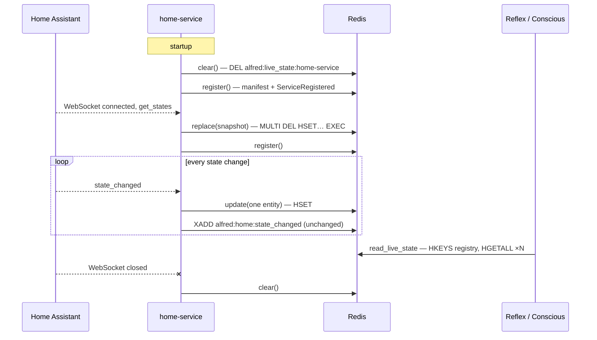

# Live Home State — Event-Driven, Owned by Alfred

**Status:** Approved
**Date:** 2026-10-05
**Issue:** [#281](https://github.com/anirudhlath/alfred/issues/281) (slice 1). The wider
contract library is [#282](https://github.com/anirudhlath/alfred/issues/282).

## Problem

Alfred's picture of what is on in the house right now is polled at both ends, and the
producer's refresh doubles as a registration.

- **Producer.** Home-service calls `AlfredClient.register()` about every 5 seconds:
  - its `ContextRefresher` fires 2 s after any Home Assistant state change, and the
    house's churn keeps it firing;
  - its `refresh_loop` fires every 300 s, mainly to keep the snapshot's TTL alive.
- **What each call writes:**
  - a 46 KB tool manifest, whose descriptions change only when HA's registries do;
  - a 71 KB `ContextSnapshot` of every entity at `alfred:context:home-service`, with a
    600 s TTL;
  - a `ServiceRegistered` event on `alfred:events`, appended with no length cap.
- **Readers.** `ContextReader` caches the merged snapshot for 5 minutes. It feeds the
  Reflex prompt and Conscious's `memory_get_live_state`, so "is the light on?" can be
  answered from 5-minute-old state.
- **Cost, measured in production on 2026-10-05:**
  - about 10,000 registrations a day since 2026-07-24, a median of 5.2 s apart;
  - 397,000 entries in `alfred:events`, using 131 MB of Redis;
  - an INFO log line from the web channel's credential worker, twice per registration.

Every HA state change is already an event: home-service forwards it to
`alfred:home:state_changed`, which triggers and Reflex consume as it arrives. The
snapshot is a second, polled copy of the same information.

## Goal

The live state Alfred reads is current to within seconds. It is written as events arrive
and read fresh, with no timed loop or TTL cache at either end. `ServiceRegistered`
means a service (re)joined. The format of live state is Alfred's, defined in the SDK.
Any service can publish live state, and Alfred core never names one.

## Decisions taken with the owner

- **Alfred owns the format.** The key name and the entry format are defined by Alfred and
  shipped in alfred-sdk, the one dependency a plugin may take. A service can write only
  what the SDK's models accept. Core never imports or names a service.
- **The service maintains its own state.** Home-service writes its live state through the
  SDK. Core does not rebuild it from the event stream.
- **No live state while HA is disconnected.** The hash is deleted on disconnect, rather
  than kept and marked stale or left to expire. A brief HA blip therefore blanks live
  state until reconnect.
- **History is untouched.** The `state_changed` stream, observations, episodic memory and
  the Librarian do not read or write live state. A rewrite on reconnect publishes no
  events.
- **Slice 2, not this slice:** pub/sub invalidation of the Reflex engine's 5-minute
  tool-registry cache.
- **Later, in #282:** one shared library for everything else core and the SDK duplicate
  today.

## Non-goals

- The Reflex tool-registry cache (slice 2).
- Consolidating the other contracts that core and the SDK duplicate (#282).
- Trigger-engine's registration, which happens 57 times in the stream's lifetime and
  writes no context.
- Any change to how state changes reach `alfred:home:state_changed`.

## Design

### 1. The contract: `sdk/alfred_sdk/live_state.py`

One module in the SDK owns the format, the writer and the reader.

**Storage.** One Redis hash per service at `alfred:live_state:{service_name}`. Each
field is an entity ID. Each value is the JSON of a `LiveStateEntry`:

```python
class LiveStateEntry(BaseModel):
    model_config = ConfigDict(extra="forbid")

    domain: str                                   # "light", "sensor", …
    kind: Literal["controllable", "sensor"]
    state: str
    attributes: dict[str, Any] = {}
```

That is everything today's `ContextSnapshot` carries, so readers rebuild exactly the
`ContextSnapshot` (`controllable`/`sensors` → domain → `ContextEntry`) they use now.

The key prefix is new. Reusing `alfred:context:` would make a reader or writer that is
still on the old code hit a type error against the other type during rollout. The old
string key simply expires within 600 s of the last write to it.

**Writer.** `LiveStateWriter(redis_url, service_name)` is the only way a service writes:

| Method | Redis | Called by the service |
|---|---|---|
| `replace(snapshot: ContextSnapshot)` | `MULTI` · `DEL` · `HSET` all fields · `EXEC` | On connecting to its source of truth |
| `update(domain, kind, entry: ContextEntry)` | `HSET` one field | On each state change |
| `remove(entity_id)` | `HDEL` one field | When the source deletes an entity |
| `clear()` | `DEL` | On disconnect, at startup, at shutdown |
| `aclose()` | closes the connection | At shutdown |

- **Validation.** Every method validates through `LiveStateEntry` before writing.
- **One connection.** The writer holds one Redis connection for the process's lifetime.
  `register()` opens a client per call, which would be one per state change here.
- **Commands are short.** The client has a 5 s socket timeout. A writer called inline
  from an event loop must not hang it on a Redis outage.
- **Writes are ordered.** Every write goes through one FIFO `asyncio.Lock`, so writes
  reach Redis in the order they were requested. A service applies an event to its own
  state before requesting the write, and builds a snapshot from that same state. So
  an update requested before a snapshot was built never lands after it, and one
  requested after carries a newer value.
- **Atomic replace.** `replace` is a single `MULTI`/`EXEC`, so a reader sees the old
  house or the new house, never half of each.

**Reader.** `read_live_state(redis) -> ContextSnapshot | None`:

1. It reads the registered service names (`HKEYS alfred:tool_registry`). It does not
   scan the keyspace, because the hot store alone holds thousands of `ctx:*` keys.
2. It fetches each service's hash with one pipelined `HGETALL` per service, in one round
   trip.
3. It validates each value as a `LiveStateEntry` and merges the entries into one
   `ContextSnapshot`. Malformed values are skipped and counted, with one warning per
   read.
4. It returns `None` when no registered service has any live state. That is a different
   answer from "a snapshot with nothing in it".

`read_live_state_by_service(redis) -> dict[str, ContextSnapshot]` does steps 1–3 without
the merge. `read_live_state()` merges its result, and `evals capture-context` writes it
out as is, so fixtures stay one snapshot per service.

**`register()` stops writing context.** It writes the manifest and appends
`ServiceRegistered`, and nothing else. Live state is published only through the writer,
so these go:

- `AlfredClient._collect_context()` and `CONTEXT_KEY_PREFIX`;
- `BaseFeature.get_context()` and the `ContextProvider` protocol.

Home-service's `HomeCapabilitiesFeature` is the only feature that overrides
`get_context()`. `ContextSnapshot` and `ContextEntry` stay, as the shape readers return.

### 2. Home-service (alfred-home-service repo)

Home-service uses the writer. It takes no other dependency on Alfred.



- **Startup.** `clear()`, then `register()`, so the credentials card still appears with
  zero tools. Clearing here covers a crash: a process killed before it could clear on
  disconnect leaves its hash behind, and Redis persists it to disk.
- **HA connect** (the existing connect listener). Rebuild the index and generate the
  capabilities once, as today. Then `replace()` from `conn.states`, then `register()`.
- **State change** (a new state listener, replacing `ContextRefresher`). `update()` for
  that one entity, or `remove()` when HA deleted it. `_handle_state_changed` already
  applies the event to `conn.states` before it awaits the listeners, which is the
  ordering the writer relies on.
- **Registry change** (the existing registry listener). Rebuild the index and
  `register()`, because the manifest's area and entity lists changed. Live state is
  unaffected.
- **Disconnect** (new). `HAConnection` gains `add_disconnect_listener()`. It fires when an
  established WebSocket closes and when a connection attempt fails or is rejected. The
  listener calls `clear()`. Clearing a hash that is already gone is harmless, so it
  does not need to know which case it is.
- **Shutdown.** Clear, then unregister, then close the writer.
- **One entry builder.** One function maps an HA state to `(domain, kind, ContextEntry)`,
  using today's attribute allowlist and the rule that a domain in the service catalog
  is controllable. `replace()`'s snapshot and every `update()` both go through it, so
  they cannot classify an entity differently. It takes over from
  `HomeCapabilitiesFeature.get_context()`, which is removed.
- **Deleted:** `ContextRefresher`, `refresh_loop` and `ENTITY_REFRESH_INTERVAL`.
- **SDK pin.** `[tool.uv.sources]` moves to the alfred commit that ships `live_state`.

### 3. Core readers

- **`ContextReader`** (`core/reflex/context_reader.py`). Reads through `read_live_state()`
  on every call. `CACHE_TTL`, the cached snapshot and the cached rendering go. One read
  is about 70 KB and a few milliseconds of validation. Reflex already reads context once
  per event, next to an inference that takes hundreds of milliseconds.
- **No live state is said, not implied.**
  - `get_rendered_context()` returns the line `Live home state unavailable.` instead of
    an empty section.
  - `memory_get_live_state` returns `{"available": false, "entities": []}`, so Conscious
    does not read an empty list as "nothing is on". With state, it returns
    `{"available": true, "entities": [...]}`.
- **`evals capture-context`** (`evals/__main__.py`). Reads through `read_live_state()`,
  so fixtures keep their shape.
- `shared/streams.py` drops `CONTEXT_KEY_PREFIX`. Core takes the live-state key from the
  SDK, as it already takes `ContextSnapshot`.

### 4. Bounding `alfred:events`

- **Cap.** Every write to `alfred:events` passes `maxlen=EVENTS_MAXLEN, approximate=True`,
  with `EVENTS_MAXLEN = 10_000`, the same value and style as `bus/bridge.py`'s
  `FORWARD_MAXLEN`.
  - There are three producers: the SDK's `register()`, `core/triggers/engine.py` and
    `core/triggers/feature.py`.
  - The constant lives in `shared/streams.py`. The SDK keeps a copy next to its existing
    `EVENTS_STREAM` copy until #282.
- **Backlog.** Each capped write trims at most about 10,000 entries (an approximate trim
  with no `LIMIT` stops at 100 × `stream-node-max-entries`), so the 397,000-entry backlog
  clears after about 39 writes, within minutes of the deploy at the old service's
  cadence. There is no manual step. On 2026-10-05 both consumer groups,
  `channels-credentials` and `reflex-trigger-fired`, had zero pending and zero lag, so
  trimming drops nothing unread.
- **Headroom.** Once home-service registers only when it joins, the stream gets tens of
  entries a day, so 10,000 is months of history.

## Error handling

- **A failed `update()`** is logged and swallowed. The entity is stale until its next
  change, or until the next connect rewrites the hash. It must not break the state
  forwarding that shares the listener chain.
- **A failed `replace()`** is logged. The hash keeps its previous contents (the
  transaction is all or nothing) until the next state changes and the next connect.
- **A failed `clear()` on disconnect** is logged. The hash then shows the last known
  state until home-service reconnects or restarts. This is the case the owner's
  delete-on-disconnect choice cannot cover without a timer, and it needs Redis
  unreachable from inside the same container while home-service keeps running.
- **A failed `register()`** is retried with exponential backoff (1 s, doubling to 60 s)
  until one succeeds, and then nothing more is scheduled. A registration requested in
  the meantime runs at once, and its success cancels the retry. This keeps the guarantee
  the 300 s loop gave as a side effect: a service started while Redis is unreachable
  still registers, and so still gets its credentials pushed.
- **Malformed entries on read** are skipped and counted in one warning per read. Readers
  never fail a request because one service wrote something odd.
- **Redis unreachable on read** propagates as it does today. Neither caller treats a
  failed read as "unavailable".

## Rollout

The image builds home-service against alfred's own `sdk/`, so the alfred side must land
first.

1. **Alfred PR:** the SDK `live_state` module, the `register()` change, the core readers
   and the events cap. Merging deploys it with the current home-service. From then until
   step 2 deploys, nothing writes live state, and readers report it unavailable.
2. **Home-service PR**, prepared and green beforehand against the alfred PR's head
   commit. After step 1 merges, its SDK pin moves to alfred's merge commit and it merges.
   Its merge fires `repository_dispatch`, which redeploys alfred with it.
3. **Expected gap:** about 15 minutes of "live home state unavailable". Avoiding it
   would take temporary fallback code in the readers, which the owner chose not to
   carry.

## Testing

- **SDK, against a real Redis** (the opt-in Docker sandbox, as the hot store's live
  tests do):
  - `replace` is atomic: a concurrent reader never sees a mix of the old and new hash;
  - an `update` requested before a `replace` never lands after it;
  - `clear` removes the hash.
- **SDK, default suite:**
  - the writer rejects an entry that fails `LiveStateEntry`;
  - the reader skips malformed values with one warning per read;
  - the reader returns `None` when no registered service has state, and merges several
    services into one `ContextSnapshot`;
  - `register()` writes no context.
- **Core:**
  - a write between two `ContextReader` reads shows on the second, which pins that the
    cache is gone;
  - the unavailable line and `available: false`;
  - all three `alfred:events` producers pass the cap.
- **Home-service:**
  - connect replaces, a state change updates, and disconnect, startup and shutdown
    clear;
  - registration happens only at startup, on connect and on registry change;
  - **regression:** 100 state events produce zero `register()` calls;
  - the entry builder gives `replace` and `update` the same classification.

## Measurement

Posted on #281 a day after the rollout:

- **Registrations per day.** Expected: startups plus HA reconnects plus registry changes.
- **`alfred:events`.** Length and memory, down from 397,000 entries and 131 MB.
- **Staleness, measured passively.** For a sample of `state_changed` entries, the time
  until the entity's field in `alfred:live_state:home-service` shows the new state. No
  lights are touched for this.

## Docs touched by the implementation

- `docs/context-provider.md` becomes `docs/live-state.md`, rewritten for the new path.
- `docs/sdk.md`: publishing live state. `register()` no longer carries context.
- `docs/evals-runner.md`: what `capture-context` reads.
- `docs/PRD.md`: the live-state capability row.
- `sdk/CLAUDE.md`: the module list, and the context-TTL gotcha goes.
- `docs/architecture.md`: the live-state path, the Redis key table and the
  `alfred:events` cap.
- `core/CLAUDE.md`: the `context_reader.py` entry.
- `CLAUDE.md`: a gotcha. Live state is written through `LiveStateWriter` and read
  through `read_live_state()`, never with raw Redis.
- Home-service's own docs: its startup, connect and disconnect lifecycle.
