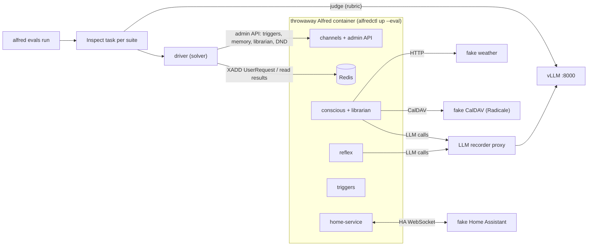

# PRD Eval Suite — Utterance-Level Evals for Every LLM Requirement

**Status:** Draft — awaiting owner review
**Date:** 2026-10-06
**Replaces:** the evals runner (`docs/evals-runner.md`, spec
`2026-03-10-evals-runner-design.md`). The memory-decay simulation (`docs/evals-memory.md`)
is kept unchanged.

## Problem

Alfred was built ambitiously and never had a harness that checks whether its features
solve the problem they were built for. Features ship, tests pass, and then the feature
does not work well in the house. The eval code that exists does not close that gap:

- **System 1** (`python -m evals run`) has three scenarios. It needs tools already
  registered in Redis, and every scenario names a context fixture that is not checked in.
- **System 2** (`python -m evals conscious`) is a dry run. It returns `passed=True` for
  every scenario without calling the engine, and the scenarios' `mock_integrations` are
  parsed and never used.
- **`regression`** reads a `responses.yaml` that does not exist.
- **The Librarian** has never been evaluated with an LLM in the loop.
- **The metrics** are regex heuristics, plus three LLM judges that only unit tests call.
  `deepeval` is an optional dependency that nothing imports.

Bugs have reached production that an end-to-end check would have caught: recall that
returned nothing ([#188](https://github.com/anirudhlath/alfred/pull/188)), seed memory
shipping as real preferences ([#187](https://github.com/anirudhlath/alfred/pull/187)),
reclaimed stream entries that were logged and never processed
([#189](https://github.com/anirudhlath/alfred/pull/189)).

## Goal

Every requirement in `docs/PRD.md` that an LLM or another applied-AI component decides
is asserted by utterance-level evals against the real assembled stack, run locally with
the vLLM-hosted model in every LLM role. Deterministic requirements are mapped to the
tests that already cover them. A pytest check keeps that map complete as the PRD changes.

**Success looks like:**

- `alfred evals run <suite>` boots a throwaway Alfred, plays each golden, and prints a
  scorecard by PRD row: pass rate, pass^k, change against the baseline.
- Any failure opens in `inspect view` with the whole story: the utterances, every LLM
  call, every Home Assistant call, the triggers, notifications and judge rationales.
- Every PRD capability row is mapped to goldens, to tests, or to a stated `not_llm`
  reason. Rows that are not built yet run as `pending`.
- A PR labelled `evals` gets the scorecard as a comment.

## Decisions

| Decision | Choice | Why |
|---|---|---|
| Model for every role | vLLM (`gemma-4-26b-a4b`) for System 1, System 2, the Librarian and the judge | No per-run cost. Production's System 2 runs Sonnet through OpenRouter, so System 2 scores describe gemma; the harness is model-agnostic and a Sonnet run is one flag. |
| System under test | The real container, driven over its own bus | Integration and wiring bugs are the ones that have hurt. In-process fakes hide them. |
| Library | [Inspect AI](https://inspect.aisi.org.uk) | Epochs and reducers handle model noise, the log viewer is local, suites map to tasks and tags, model-graded scoring takes any OpenAI-compatible model, and there is no SaaS. deepeval's results UI is a cloud service and its telemetry is on by default. |
| Scope | Every LLM-related PRD row, built or not | Unbuilt rows run as `pending` and become each feature's acceptance test. |
| Goldens | Hand-written public goldens in the repo, plus an optional private overlay mined from production traffic | The repo is public. Real utterances are the best test, but they stay off-repo. |
| Run cadence | On demand first, then a non-blocking PR job on the self-hosted runner, required once baselines settle | Gemma's noise makes a day-one gate expensive to live with. |

## Architecture



Every fake, the proxy and the driver run on the host, in the harness process. The
container reaches them through `host.docker.internal`.

### Components

| Component | Purpose |
|---|---|
| `evals/harness/stack.py` | Boots and tears down the `--eval` container. Builds the temp data dir from the scenario's world (keyring, preferences, memory seed). Waits for a real System 2 round trip before declaring the stack ready. Detects a dead container and reports `error`. |
| `evals/harness/proxy.py` | An OpenAI-compatible pass-through to vLLM. Records each request and response with its role (System 1, System 2, Librarian, told apart by request shape and system-prompt fingerprint), tool calls with arguments, token counts and latency. Caps concurrent upstream requests at 4. |
| `evals/harness/fake_ha.py` | A Home Assistant WebSocket server speaking the subset home-service uses: auth, `get_states`, `get_services`, the three registry lists, `subscribe_events`, `call_service`. It serves the world's entities, records every `call_service` with a timestamp, applies the state change and pushes `state_changed`, and lets the driver inject events. |
| `evals/harness/worlds/` | World fixtures. `apartment.yaml` covers areas, devices and entities (lights, media players, a lock, an alarm panel, a garage cover, door, motion and temperature sensors), calendar events, weather, and optional semantic and episodic memory seeds. |
| `evals/harness/driver.py` | The Inspect solver. Plays a scenario's steps and collects an `Evidence` record into the task state. |
| `evals/harness/evidence.py` | `Evidence`: replies per turn, HA calls, LLM calls, triggers created and fired, notifications sent and deferred, memory reads after the run, the attention set, and per-step timings. |
| `evals/harness/checks/` | One module per check family. Each check is a pure function of `Evidence` that returns pass/fail plus a reason. |
| `evals/harness/judge.py` | The rubric judge and the calibration runner. |
| `evals/harness/scenario.py` | The scenario schema (Pydantic) and the loader, including the private overlay. |
| `evals/harness/tasks.py` | One Inspect task per suite, built from the scenario files. |
| `evals/harness/report.py`, `baseline.py` | The scorecard (terminal, `report.md`, `report.json`), baselines and comparison. |
| `evals/cli.py`, `alfred_cli/main.py` | The CLI: `alfred evals <command>`, a Typer group on the `alfred` console script. `python -m evals memory` keeps working. |

### Product changes the harness needs

1. **`alfredctl up --eval`.** Boots persistent mode into a fresh temp dir prepared by the
   harness, with a fixed secrets passphrase. Binds Redis on the container's interface
   as well as 127.0.0.1, and publishes it on a random `127.0.0.1` host port. Today Redis
   is bound to 127.0.0.1 inside the container (`runner/__main__.py`) and is not
   published at all. Eval mode also sets `DAILY_COST_CAP_USD` high: unknown models are
   priced at $3/$15 per million tokens, and the default $5 cap would trip mid-run.
2. **Weather location and endpoint.** The adapter is constructed with latitude and
   longitude 0,0 and a hardcoded Open-Meteo URL (`core/integrations/weather.py`), so
   production weather reports a point in the Gulf of Guinea. Fix: a configured location
   (credential fields, so the Workshop renders them) and a base-URL override. It ships
   as its own PR with its goldens.
3. **The home-service version.** The image bundles whatever sibling `home-service`
   checkout is present. Eval builds pin it to the commit production runs, and the
   baseline records that commit.

No other product changes. Apple Health has no bridge endpoint and always answers "not
configured", so its goldens fail visibly. Robinhood has no fixture seam, so its goldens
are `pending`.

### Data flow for one scenario

1. The stack is booted for the suite, or freshly for an `isolated` scenario.
2. For each step:
   - **`user`:** `XADD` a `UserRequest` (channel, identity claim, authenticated flag,
     timezone, a session id unique to the scenario and epoch). Wait for the
     `AlfredResponse` with that session id, up to 120 s, then wait a 2 s settle window
     for side effects.
   - **`ha_event`:** the fake HA pushes `state_changed`. Wait for a `call_service`, or
     for a 5 s window when the scenario expects nothing.
3. Collect `Evidence`: the proxy's calls and the fake HA's calls in the scenario's time
   window, `GET /triggers`, `alfred:notifications:dispatch` and
   `/notifications/deferred`, and the memory reads the scenario's checks name.
4. Score every check, then the judge rubrics.

Conscious handles one request at a time and responses carry no correlation id, so
scenarios within a container run one after another. The session id plus the time window
attributes evidence to a scenario.

**Resetting state.** Never `FLUSHALL`: it deletes the consumer groups, `read_group` does
not recover from `NOGROUP`, and services crash toward the supervisor's restart cap. A
fresh container is the reset. Slice 1 measures boot time. If a boot takes more than
60 s, slice 1's plan adds a faster reset that restarts the services against a clean
Redis and a re-seeded data dir.

**Epochs in a shared container.** Repeating a non-isolated scenario in the same container
means later epochs see earlier epochs' memory. That is accepted: a real home has
history. Any scenario whose result depends on clean memory is marked `isolated`.

## Scenarios

A scenario file is one golden.

```yaml
id: triggers.relative_reminder.minutes
prd: [4.2.relative-reminders]
status: shipped            # shipped | pending
tags: [reminders]
world: apartment
isolated: false
as: {who: sir, channel: web_pwa, tz: America/Denver}
steps:
  - user: "Remind me to take the laundry out in 20 minutes"
    variants:
      - "In twenty minutes, remind me about the laundry"
      - "Ping me in 20 min to move the laundry"
expect:
  - trigger_created: {type: time, run_in_seconds: {approx: 1200, tol: 60}}
  - llm_tool_args_absent: {role: system2, tool: create_trigger, key: run_at}
  - judge:
      category: faithfulness
      rubric: "Confirms a reminder about the laundry in about twenty minutes"
      reference: "Very good. I shall remind you about the laundry in twenty minutes."
```

**Step types:**

| Step | Purpose |
|---|---|
| `user: <text>` | An utterance. It can override `as` per step, which is how continuity across channels is tested. |
| `ha_event: {entity_id, state, attributes}` | Pushes a state change through the fake HA. |
| `audio: <path>` | Sends audio over `/ws`. Used by the voice suite. |
| `advance_trigger: {match}` | Pulls a trigger's `run_at` to now and publishes `alfred:triggers:changed`. Reminder tests run in seconds this way, not minutes. |
| `librarian_run: {}` | `POST /api/admin/librarian/run`, then waits for `last_run_at` to move. |
| `dnd: on\|off` | Sets do-not-disturb through the admin API. |
| `wait: <seconds>` | Lets time pass, for example before a fire-latency check. |

**Variants.** Each variant runs as its own sample with the same checks. The scorecard
groups variants under their golden, so a feature that works only for one phrasing shows
up as one.

**Status.** `pending` scenarios run only with `--include-pending` or in full runs. They
are reported apart from the rest and are never regressions. When the feature lands, the
same PR flips them to `shipped`.

**Suites** live in `evals/suites/<suite>/`. They are selected by name (`alfred evals run
triggers memory`) or by tag (`--tag guest`).

## Checks

| Check | Evidence | Passes when |
|---|---|---|
| `ha_called` | fake HA log | A `call_service` matches domain, service, target and the given data. Numbers match within a tolerance. |
| `ha_not_called` | fake HA log | No call matches. With no arguments, no call happened at all. |
| `ha_state` | fake HA state | An entity's state and attributes at the end of the scenario match. Numbers match within a tolerance. |
| `tool_called`, `tool_not_called` | proxy | The role's response contains or lacks a call to the tool. |
| `llm_tool_args`, `llm_tool_args_absent` | proxy | The tool's arguments match or lack a key or value. |
| `prompt_not_contains` | proxy | No recorded prompt for the role contains the literal or pattern (credentials, raw sensor dumps). |
| `trigger_created`, `trigger_not_created` | `GET /triggers` | A trigger of the type with matching fields exists, or none does. |
| `trigger_fired` | `alfred:actions`, `alfred:events` | The trigger fired, within the given seconds when a bound is given. |
| `notification` | dispatch stream, deferred list | A notification with the urgency and channel was sent, or was deferred. |
| `memory_semantic`, `memory_routine`, `memory_recall` | admin memory endpoints | A semantic doc contains the text, a routine is in the state, or a recall query returns the memory. |
| `reply_contains`, `reply_not_contains` | replies | Case-insensitive substring or regex. |
| `latency` | step timings | `reflex_ms`, `reply_ms` or `reminder_fire_ms` is under the bound. |
| `judge` | replies, optional reference | The judge answers yes to the rubric. |

A scenario passes when all its counted checks pass. The scorecard also lists every
check's result, so partial correctness stays visible.

## Judge

- **Use.** Only what deterministic checks cannot decide: tone, relevance, faithfulness
  to the facts provided, whether private data was disclosed, whether the question was
  answered.
- **Form.** Each `judge:` check is one yes/no rubric question with a `category`. The
  judge answers with a short rationale and then `yes` or `no`, at temperature 0, through
  the harness's own Inspect model provider for vLLM (`alfred-vllm`); Inspect's
  `openai-api` provider needs an `openai` release that litellm does not allow. A `reference` reply, when given,
  is shown to the judge as what a good answer looks like.
- **Calibration.** `evals/judge_calibration/<category>.yaml` holds hand-labelled
  (reply, rubric, reference, label) items, about 15 in slice 1 and 40 or more by
  slice 7, with deliberately bad replies among them. The owner confirms each label once.
  `alfred evals calibrate` reports each category's agreement with the labels, and the
  result is stored with the baseline. A category under 85% agreement is **untrusted**:
  its checks are reported but do not count toward the scenario's verdict or toward
  regressions.

## Scoring, noise and errors

- **Epochs.** Each sample runs three times by default (`--epochs`). Each sample reports
  its pass rate and pass^k, which is whether all k epochs passed.
- **Flaky.** A sample is flaky when its pass rate is strictly between 0 and 1. The
  scorecard flags it.
- **Errors.** A container that failed to boot or died, a vLLM timeout, or a response
  timeout scores `error`. The sample is retried once. Errors never count as Alfred
  failing, and the scorecard reports them separately.

## Goldens

- **Minimum per PRD row: three goldens.**
  - a happy path
  - an edge or ambiguous case
  - a negative case

  The guest boundary, critical actions and triggers get more.
- **Variants** are hand-written. `alfred evals expand <scenario>` drafts more variants
  with the vLLM model into a review file. Nothing generated enters a suite until the owner
  accepts it.
- **Sources, in order:**
  1. The PRD rows, their specs and the user stories quoted in the PRD.
  2. A regression golden for every bug found in real use. It lands in the PR that fixes
     the bug.
  3. A private overlay mined from production traffic (slice 7). It lives in
     `~/.local/share/alfred-evals/goldens-private/<suite>/`, outside the repo, and the
     loader merges it in when present. `alfred evals mine` drafts goldens from what
     production retains, for the owner to edit and accept. Slice 7's plan picks the exact
     source after measuring how long production keeps conversation history.
- **Review.** The owner approves each suite's goldens before its first baseline is saved.
  Changing a golden's checks resets that sample's baseline, so the change cannot read as
  a regression or as a fix.

## Suites and PRD coverage

PRD rows are named `<section>.<slug>`. `evals/coverage.yaml` lists every row with the
leading text of its capability cell, and maps it to `suites`, to `tests`, or to
`not_llm: <reason>`. It also lists the numbered principles (§3), the cross-domain promise
(§6) and the success criteria (§7).

| Suite | PRD rows | Pending until built |
|---|---|---|
| `conversation` | 4.1.sessions, 4.1.signal, 4.7.warmup, butler persona | — |
| `home_control` | 4.4.lights-scenes, 4.4.live-state, principle 3 (generated tools) | 4.4.device-discovery, 4.4.control-surface |
| `reflex` | 4.4.lights-scenes (System 1), 4.3.s2-observes-s1, success criterion reflex latency | 4.4.tiered-autonomy |
| `triggers` | 4.2.dynamic-triggers, 4.2.sensor-triggers, 4.2.fast-reminders, 4.2.client-timezone, 4.2.relative-reminders, success criterion reminder latency, principle 5 | — |
| `notifications` | 4.2.proactive-notifications, 4.2.notification-delivery, principle 1 | — |
| `attention` | 4.2.attention-set | — |
| `memory` | 4.3.episodic, 4.3.semantic, 4.3.procedural, 4.3.librarian, 4.3.decay (with `python -m evals memory`), 4.3.two-stage-recall, 4.3.significance, success criteria memory quality and proactivity quality | 4.3.passive-observation |
| `integrations` | 4.5.adapters, 4.5.calendar-management | Robinhood |
| `guest_boundary` | 4.6.identity-confidence, 4.6.guest-choices | 4.6.guest-enforcement |
| `critical_actions` | 4.4.critical-confirmation | — |
| `privacy` | principle 2, 4.5.secure-credentials | — |
| `cross_domain` | §6 composition | goldens that need health data |
| `voice` | 4.1.voice-browser | 4.1.satellites, 4.1.speaker-id |

`not_llm` rows point at their existing tests: the PWA and Workshop rows, the iOS app,
HA onboarding, service credentials, passkeys, trusted networks, session management, the
cost cap, the runner, the admin API, service health, `alfredctl`, and principles 4 and
6. The eval harness row (4.7) points at this suite.

`critical_actions` is built against the code that already exists (`core/routing/risk.py`,
`core/routing/pending.py`), even though the PRD lists the row as Planned. Its goldens
settle which of the two is right.

### Gaps the suites will expose on day one

These goldens are `shipped`, because the PRD calls the rows shipped. They are expected to
fail until the product is fixed:

- Weather answers for latitude and longitude 0,0.
- Apple Health always answers "not configured".
- Guests are offered every registry tool, including home and trigger tools. The guest
  boundary is a prompt instruction (`core/conscious/context_assembler.py`).
- Signal inbound is not wired into the runner: `forward_inbound` is called only from
  tests. Signal goldens drive the conscious side over the bus, and the scorecard notes
  that the bridge is untested.
- The web socket always claims `sir` and never sets `authenticated`.

Each confirmed gap becomes a GitHub issue that cites its failing goldens.

## Coverage enforcement

`tests/evals/test_prd_coverage.py` runs in normal CI. It parses the capability tables in
§4 and the table in §7 of `docs/PRD.md`, plus the numbered list in §3. It fails if:

- a PRD row matches no `coverage.yaml` entry, or more than one;
- an entry matches no PRD row;
- an entry names a suite, scenario id or test path that does not exist;
- a suite has fewer than three goldens for a `shipped` row it covers.

Rewording or adding a PRD row therefore requires updating `coverage.yaml` and its goldens
or tests in the same PR, which extends the PRD's maintenance rule.

## Reports and baselines

- **Scorecard.** Printed at the end of a run, and written as `report.md` and
  `report.json` next to the Inspect logs in `evals/logs/<run>/` (gitignored). It has one
  section per suite with a row per PRD capability: goldens, pass rate, pass^k, the change
  against the baseline, flaky and error counts. Pending rows are listed separately as not
  yet working. It ends with the run's LLM usage by role (calls, tokens, p50 and p95
  latency).
- **Baselines.** `alfred evals baseline save [--name master]` writes per-sample results
  to `~/.local/share/alfred-evals/baselines/<name>.json`, outside the repo. Each baseline
  records the model, the vLLM arguments, the Alfred commit, the home-service commit and
  the judge calibration.
- **Regression.** A sample's pass rate dropping by at least one third, or a check going
  from passing in every epoch to failing in every epoch. If the model or vLLM arguments
  differ from the baseline's, the comparison is labelled "model changed" and reports no
  regressions.

## CI

- **Workflow.** `.github/workflows/evals.yml` runs on PRs labelled `evals`, on a new
  self-hosted runner label `alfred-evals` on the deploy box, so evals never queue behind
  deploys.
  - It runs the suites mapped from the PR's changed paths, or every suite with the label
    `evals:full`.
  - It posts the scorecard as one PR comment and updates it in place.
  - It runs with `--no-private`, so the private overlay never reaches a PR.
- **Nightly.** A scheduled run on `master` saves the `master` baseline.
- **Gate.** The job is not a required check. Making it required is a ruleset change for
  the owner to make once baselines are stable.

## Code removed

- The CLI subcommands `run`, `list`, `compare`, `runs`, `regression`, `conscious`,
  `demo` and `capture-context`.
- The modules `evals/models.py`, `pipeline.py`, `inference.py`, `scorer.py`, `loader.py`,
  `store.py`, `compare.py`, `report.py`, `context_fixtures.py` and the directories
  `evals/scenarios/`, `evals/contexts/`, `evals/conscious/`, `evals/regression/`,
  `evals/e2e/`, with their tests.
- The `deepeval` optional dependency and its pytest-plugin setting.
- `docs/evals-runner.md`, replaced by `docs/evals.md`.

**Kept:** `evals/memory/` and `python -m evals memory`, untouched. EXP-006 to EXP-009 and
the production decay settings cite them.

**Added:** an `evals` optional extra (`uv sync --extra evals`) holding `inspect-ai`,
`aiohttp` (the proxy) and `websockets` (the fake HA). Radicale joins it in slice 5.

## Documentation

- `docs/evals.md`: architecture, the scenario format, checks, the judge and calibration,
  running locally, reading `inspect view`, baselines, CI.
- `docs/architecture.md`: the eval harness in the system diagram.
- `docs/PRD.md` §4.7: the eval harness row points at `docs/evals.md`.
- `research/experiments/EXP-010-prd-eval-baseline.md`: the first full baseline. It
  records the hypothesis, method, results and analysis, as the research protocol requires.

## Slices

The spec covers everything. Each slice gets its own plan, written after the previous
slice's real numbers are in.

1. **Walking skeleton.**
   - `alfredctl up --eval` with the vLLM wiring.
   - The fake HA and the `apartment` world.
   - The proxy and the driver.
   - The checks `ha_called`, `ha_not_called`, `ha_state`, `tool_called`,
     `llm_tool_args*`, `reply_*` and `latency`.
   - The judge and about 15 calibration items.
   - The scorecard.
   - The `home_control` and `conversation` suites.
   - `coverage.yaml` with every row mapped (unbuilt suites' rows marked pending) and the
     coverage test, without the three-goldens rule until slice 7.
   - The old harness removed.

   Ends with a real run whose output is posted to the PR.
2. `reflex` (end-to-end latency), `triggers` (`advance_trigger`, fire latency) and
   `notifications` (DND).
3. `guest_boundary`, `critical_actions` and `privacy` (`prompt_not_contains`).
4. `memory` (seeds, `librarian_run`, memory checks) and `attention`.
5. `integrations` (Radicale, the weather fix) and `cross_domain`.
6. `voice` (audio over `/ws`, word error rate and the TTS→STT round trip).
7. Baselines and comparison, the CI workflow and runner label, `expand`, `mine` and the
   private overlay, the full calibration set, the three-goldens rule, and EXP-010.

## Constraints

- **Shared vLLM.** Production Alfred uses the same vLLM server. The proxy caps eval
  traffic at 4 concurrent upstream requests, and only one eval container runs at a time.
- **No real devices.** Eval containers never receive the real `HA_HOST` or a real token.
  The harness refuses to start if `HA_HOST` resolves to anything other than its fake HA.
- **No secrets in logs.** Inspect logs, reports and goldens never contain production
  credentials. Eval credentials are fixed fakes.
- **Private overlay.** Mined goldens, and reports from runs that include them, stay under
  `~/.local/share/alfred-evals/`. They are never committed or posted to a PR.
