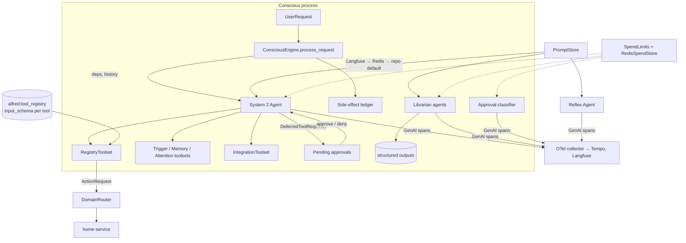

# Pydantic AI Adoption: System 2, the Librarian, Reflex, Prompts and Tools

**Status:** Draft, for review
**Date:** 2026-10-08
**Tracking issue:** [#317](https://github.com/anirudhlath/alfred/issues/317)
**Closes:** [#299](https://github.com/anirudhlath/alfred/issues/299),
[#300](https://github.com/anirudhlath/alfred/issues/300),
[#301](https://github.com/anirudhlath/alfred/issues/301),
[#302](https://github.com/anirudhlath/alfred/issues/302),
[#303](https://github.com/anirudhlath/alfred/issues/303),
[#304](https://github.com/anirudhlath/alfred/issues/304),
[#305](https://github.com/anirudhlath/alfred/issues/305),
[#306](https://github.com/anirudhlath/alfred/issues/306),
[#307](https://github.com/anirudhlath/alfred/issues/307),
[#308](https://github.com/anirudhlath/alfred/issues/308),
[#309](https://github.com/anirudhlath/alfred/issues/309),
[#310](https://github.com/anirudhlath/alfred/issues/310),
[#314](https://github.com/anirudhlath/alfred/issues/314)
**Related:** [#292](https://github.com/anirudhlath/alfred/issues/292),
[#297](https://github.com/anirudhlath/alfred/issues/297) (the spike),
[#285](https://github.com/anirudhlath/alfred/issues/285) (Reflex shadow week),
[#318](https://github.com/anirudhlath/alfred/issues/318) (StepPersistence investigation)

## Problem

Alfred does agent-framework work by hand, and much of that code is broken or missing.

- **System 2's tool loop** (`core/conscious/engine.py`) is a hand-rolled `for` loop over
  `litellm.acompletion`:
  - it has no model timeout (#305);
  - malformed tool arguments are dispatched as `{}` (#302);
  - domain results reach the model as a Python `repr` (#303);
  - a failed turn is redelivered whole and re-runs tools that already ran (#304).
- **Tool names are rendered three ways.** The prompt lists `home.light_turn_on`, the API
  offers `home_light_turn_on`, and dispatch accepts both, which hides the mismatch: 46 of
  269 calls on master used the never-offered name (#299). The eval checks keep a fourth
  copy of the rewrite rule.
- **Tool schemas are lossy.** The SDK stores each parameter's type as a string, so arrays
  lose `items`, enums and dates become plain strings, and nested models cannot be
  expressed (#301). Every SDK parameter is optional, because the manifest always carries
  `"default": null` (#300).
- **Confirmations end the conversation.** A confirmed critical action runs, but its
  result is only logged (#306). A channel that gives up after 60 s drops the late reply
  (#307).
- **Sessions keep text only.** Tool calls and results are lost between turns.
- **The Librarian** parses five free-text replies with `json.loads`, discards any reply
  containing "NONE" (#310), and its spend is never counted (#309).
- **Three mocking seams** (`_call_llm`, `litellm.acompletion`, Reflex `infer`) and no
  fake model.
- **Tracing** has one span per turn: no model-call or tool-call spans.

Spike #297 ported System 2's loop to Pydantic AI and matched master on all 19 goldens
over 5 epochs once tool names were fixed. litellm (which pins `openai<3`) and Pydantic AI
2.32+ (which needs `openai>=3`) cannot be installed together, so adopting Pydantic AI
means removing litellm from every call site at once.

## Goals

1. System 2, the Librarian and Reflex run on Pydantic AI agents, and litellm leaves the
   codebase.
2. One source of truth for each tool: its name, JSON Schema, dispatch and risk, read by
   the API, dispatch and the eval checks alike.
3. Real JSON Schemas from the SDK, with correct `required`.
4. Critical actions pause as deferred approvals; approving resumes the same run, and the
   result reaches the user and the session.
5. A reply is never silently lost: late replies arrive as follow-ups, and a failed turn
   answers once without re-running side effects.
6. Full message history in sessions, with compaction.
7. Prompts are managed in self-hosted Langfuse, with repo defaults as the fallback.
8. Every model call and tool call is traced into the existing OTel export (Tempo and
   self-hosted Langfuse).
9. Tests run on `FunctionModel`/`TestModel`; no test reaches a real model.

## Non-goals

- Streaming replies or TTS (#107 needs a delta protocol on the bus and the web socket
  first; the eval proxy also refuses `stream: true`).
- `pydantic_ai.Embedder` for embeddings: `core/memory/openai_embedding_provider.py` works.
- Realtime speech-to-speech, durable execution engines, MCP, AG-UI/Vercel adapters,
  `pydantic_evals` (Inspect stays), and harness capabilities other than those named
  below (`AskUser`, Guardrails, `Skills` and so on).
- `StepPersistence`: investigated separately in #318.
- Finer per-clearance tool gating beyond guest/verified-user scoping (see "Identity
  scoping").

## Decisions (owner, 2026-10-08)

| Topic | Decision |
|---|---|
| Scope | Full adoption, not the handoff's thin slices: System 2, Librarian, Reflex, eval harness, harness capabilities |
| Delivery | A series of PRs managed with `gh stack`, each green on the evals before it merges |
| Models | No model factory: per-role Pydantic AI model strings in config; `CLAUDE_MODEL` still accepted and translated |
| Production System 2 model | Changed in the deploy environment (not in the repo) when PR 2 deploys |
| Ollama | Dropped; Reflex runs on an OpenAI-compatible server (vLLM) only |
| Prompt list | System 2's "Available Tools" section is removed, with no fallback; regressions are fixed forward |
| Schemas | One JSON Schema per tool (`input_schema`), not per parameter |
| home-service | Ships its own PR marking required parameters, after the SDK change merges |
| Prompts | Managed in self-hosted Langfuse; Langfuse is production's source of truth, the repo keeps defaults |
| Spoken approvals | A small classifier call decides whether a reply approves, denies or is unrelated |
| Late replies | Delivered as follow-ups on the same session; the timeout message says Alfred will reply when ready |
| #304 | Record side-effecting tool calls per request; once one has run, answer once and ACK instead of retrying |
| Guests | Toolsets are scoped by identity |
| Session idle limit | Stays at 30 minutes; full history applies within a session |

## Architecture

Every agent is built once per process and run per request with typed dependencies. Models
come from config as Pydantic AI model strings (`vllm:<served-name>`,
`openrouter:<vendor>/<model>`).

## Components

### 1. SDK manifest: `input_schema` (#300, #301, #314)

The SDK carries one JSON Schema object per tool.

- **`ToolManifest.input_schema: dict[str, Any]`** is the tool's argument schema and the
  only schema core reads.
- **`@tool` methods** get it from Pydantic. `_extract_tool_meta` builds a model with
  `pydantic.create_model` from the signature (types, defaults) and the docstring's `Args:`
  descriptions, then takes `model_json_schema()` and strips `title` keys. This gives:
  - `required` for every parameter without a default;
  - `items` for `list[X]`;
  - `enum` for `Literal` and `Enum`;
  - `format: date-time` for `datetime`;
  - nested models as root-level `$defs` with `$ref`.

  `self`/`cls` are skipped. A tool with `*args` or `**kwargs` raises at discovery.
- **Hand-built tools** (home-service's generated tools, the trigger feature's enriched
  `create_trigger`):
  - `ToolParameter` gains `required: bool = False` and `json_schema: dict | None = None`.
  - When `json_schema` is unset, it is derived from the legacy `type` string through
    today's map.
  - `ToolMeta` gains `input_schema: dict | None = None`, assembled from its parameters
    when not given. Existing `ToolParameter(type="str", description=…)` calls keep
    working unchanged.
- **The legacy `parameters` map stays on the wire,** with `required` filled in, so Reflex
  (which renders parameter names) is untouched during its shadow week. A follow-up ticket
  removes it from the wire once Reflex reads `input_schema`.
- **`TriggerFeature.get_tools`** rebuilds `create_trigger` with `dataclasses.replace`,
  keeping `input_schema`, `audience` and `risk` (#314).
- **Core reads tolerantly:** `ToolRegistry` builds `input_schema` from legacy `parameters`
  when a manifest predates the SDK change. Registry entries written by an old SDK
  disappear at the next registration, but the reader must not fail on them.
- **home-service PR** (after the alfred PR merges): bump the SDK pin to the merge commit;
  set `required=True` on `target` for targeted tools and on every Home Assistant field the
  service catalog marks required; drop the " (required)" suffix it appends to
  descriptions.

### 2. Model configuration

Pydantic AI resolves model strings itself (`vllm:` reads `VLLM_BASE_URL`, `openrouter:`
reads `OPENROUTER_API_KEY`), so there is no model factory.

| Setting | Meaning | Default |
|---|---|---|
| `SYSTEM2_MODEL` | System 2's model string | translated `CLAUDE_MODEL` |
| `LIBRARIAN_MODEL` | Librarian's model string | `SYSTEM2_MODEL` |
| `APPROVAL_MODEL` | spoken-approval classifier | `SYSTEM2_MODEL` |
| `REFLEX_MODEL` | Reflex's model string (PR 8) | `vllm:` + `OPENAI_COMPAT_MODEL` |
| `VLLM_BASE_URL` | the OpenAI-compatible server, `…/v1` | `OPENAI_COMPAT_HOST` + `/v1` |
| `SYSTEM2_MAX_TOKENS` | System 2 reply cap | `CLAUDE_MAX_TOKENS` (2048) |
| `SYSTEM2_TIMEOUT_S` | per model request | 60 |

- **Legacy translation** happens in one function in `shared/config.py`:
  `openrouter/<vendor>/<model>` → `openrouter:<vendor>/<model>`, and `openai/<model>`
  with `OPENAI_BASE_URL` set → `vllm:<model>` with that base URL. A translated value logs
  one warning at startup.
- **`VLLM_BASE_URL` and `LANGFUSE_HOST` join `GATEWAY_REWRITE_KEYS`** (`shared/gateway.py`)
  so the in-container localhost rewrite covers them.
- **`alfredctl doctor`** reads the new settings through the same `shared.config` helpers.
- **vLLM served names.** `VLLMProvider` picks its profile from the served name's family
  prefix (`gemma`, `qwen`, …). A custom `--served-model-name` defeats that; the doctor
  warns when the name matches no known family.
- **Ollama is removed** in PR 8: `REFLEX_BACKEND`, `OLLAMA_*`, `core/reflex/ollama_client.py`
  and the admin API's Ollama probe. A fresh install needs an OpenAI-compatible server for
  Reflex.

### 3. Tools

All tools reach the model through toolsets attached to the System 2 agent. No
hand-written OpenAI tool dicts remain.

#### The one name mapping (#299)

- `core/conscious/tools/names.py` holds `wire_name(identity: str) -> str`: every character
  outside `[A-Za-z0-9_-]` becomes `_`, and a result over 64 characters is refused. A tool's
  identity is its registry name (`home.light_turn_on`) or its in-process name.
- Every toolset names its tools through `wire_name`, and nothing else rewrites tool names.
  Two identities mapping to one wire name: the second is dropped with an ERROR log.
- The eval checks import `wire_name` (`evals/harness/checks/llm.py` loses
  `normalize_tool`).
- Dispatch knows only what the toolsets offered for that run. An unknown name is answered
  by Pydantic AI's retry prompt listing the available tools; there is no dotted-name
  fallback.
- System 2's "Available Tools" prompt section is deleted. Prompt text that pointed at a
  tool by name moves into that tool's description: the `create_trigger` timing guidance
  in `personality.md` moves into its description, and the integration hint is rendered
  only when the integration toolset offers tools in that run.

#### `RegistryToolset` (`core/conscious/tools/registry.py`)

An `AbstractToolset` over `alfred:tool_registry`.

- `get_tools(ctx)` reads `ToolRegistry.get_tools()` (one `HGETALL`, cached for the run)
  and returns one `ToolsetTool` per tool:
  - `ToolDefinition(name=wire_name(t.name), description=t.description,
    parameters_json_schema=t.input_schema, metadata={registry_name, target_service,
    risk})`;
  - critical tools get the injected optional `reason` property, as today;
  - services that have an in-process toolset (the trigger feature) are skipped here.
- **Validation (#302).** Core has no JSON Schema validator, so the toolset validates with
  `jsonschema` (new dependency, Draft 2020-12). A failure becomes a `ModelRetry` whose
  message names the failing fields. `RepairToolArguments` (harness) repairs malformed JSON
  before validation.
- **Dispatch.** `call_tool` builds an `ActionRequest` (with `reason` popped for critical
  tools, as today, and `confirmed=ctx.tool_call_approved`) and routes it through
  `DomainRouter`.
- **Results (#303).** Success returns the result object, which Pydantic AI serialises as
  JSON. A domain error raises `ToolFailed(error)`: the model sees the failure without a
  retry being spent.
- **Approval gate.** The tool's `args_validator_func` raises `ApprovalRequired` for a
  critical tool unless `ctx.tool_call_approved` (see "Confirmations"). It must check
  `ctx.tool_call_approved`, because the validator re-runs on resume.

#### In-process toolsets

Typed `FunctionToolset`s; schemas come from the function signatures.

| Toolset | Tools (wire names unchanged) | Offered to |
|---|---|---|
| Triggers | the trigger feature's `@tool` methods (`triggers_create_trigger`, …), descriptions as enriched today | everyone |
| Memory | `memory_recall_memories(query, types, since_days_ago, limit)`, `memory_get_live_state(entities)` | verified user |
| Attention | `attention_add`, `attention_remove`, `attention_list` | verified user |
| Integrations | a dynamic toolset over `IntegrationRegistry` capabilities, named `integration_{name}_{capability}`, results through `sanitizer.py` as today | verified user |

- `confirm_pending_action` is removed: approvals no longer go through the model.
- Bracket access on arguments (#254 item 7) disappears with typed signatures.
- Tool retries: 2 per tool by default (Pydantic AI's 1 is low for local models), set per
  toolset.

#### Identity scoping

- A tool is offered only when the resolved identity may use it, and the check repeats at
  call time.
- A **verified user** (`identity == "sir"`) gets every toolset. Critical tools still need
  approval.
- A **guest** gets registry and trigger tools whose `risk` is `benign`, and none of the
  in-process user toolsets. Memory, integration and attention tools are already sir-only
  today (`process_request`); the change is that guests stop being offered `elevated` and
  `critical` registry tools.
- The rule lives in one function, `allowed(tool_risk, identity) -> bool`, so finer
  gating by `risk_clearance` can replace it later without touching the toolsets.

### 4. The System 2 agent (#302, #303, #305, #308)

`core/conscious/agent.py` builds one `Agent[TurnDeps, str | DeferredToolRequests]` named
`system2` at startup.

- **Dependencies.** `TurnDeps` carries the identity, session id, channel, request id,
  timezone and `now`, the satellite area, the content type, recall results, the routine
  hint, and the service handles (Redis, router, context index, live-state reader, trigger
  feature).
- **Instructions** are functions of `TurnDeps`, in today's order so the cacheable prefix
  stays stable: personality (plus voice delivery for audio), identity, location, current
  time, integrations hint, relevant context, proactivity, routine hint. In PR 2 the prose
  still comes from the repo's prompt files; PR 3 moves it behind the `PromptStore`
  (component 9).
- **Model settings.** `max_tokens=SYSTEM2_MAX_TOKENS`, `timeout=SYSTEM2_TIMEOUT_S`
  (#305), and `extra_headers={"X-Alfred-Role": "system2"}` for the eval proxy.
- **Limits.** `UsageLimits(request_limit=10)` replaces `MAX_ITERATIONS`; exceeding it
  returns today's "deliberating too long" reply.
- **Capabilities.** `RepairToolArguments` and instrumentation (component 10) in PR 2;
  compaction (component 5), the side-effect ledger (component 6) and `SpendLimits`
  (component 7) are added by their own PRs.
- **`ConsciousEngine.process_request`** keeps its pre-steps (timezone, identity, budget
  message, session, involuntary recall, routine hint). It then runs the agent with the
  session's message history and handles the output:
  - text → `AlfredResponse`;
  - `DeferredToolRequests` → park the run (component 8).

  `actions_taken` lists the registry names of the tools that ran.
- **Removed:** `_call_llm`, `_tools_to_openai_format`, `_integrations_to_openai_format`,
  the name sanitisers, `_dispatch_tool_call`, `shared/type_map.py`'s schema use, the
  litellm logging guard (PR #238, `LITELLM_LOG`) and
  `tests/core/conscious/test_litellm_logging.py`, the
  ~65 lines of legacy constructor kwargs (`ConsciousDeps` only), and
  `@track_latency(category="conscious")` on `process_request`. That buffer is never
  flushed (#308), and the run span measures the same latency.

### 5. Sessions: full history and compaction

- `SessionManager` stores the run's messages (`ModelMessagesTypeAdapter` JSON) in the
  existing hash `alfred:sessions:{id}`, field `messages`, with today's 30-minute idle TTL.
  A legacy `history` field (text turns) is converted on read and not written again.
- `append_run(session_id, messages)` replaces the two `append_turn` calls with one write.
- **Identity change resets history.** A satellite session (`sat-{name}`) is shared by
  everyone in the room. Full history now holds tool results (calendar, health), so when a
  turn's identity differs from the identity that wrote the history, the run starts from
  an empty history and the session is reset.
- **Compaction** (harness):
  - `SlidingWindowCompaction(max_messages=…, keep_messages=…)` (no model call);
  - `ToolOutputLimits` with a `Truncate` band. It must not use the default `Spill`
    action, which needs a workspace.

  Thresholds are set in the plan from measured session sizes.
- The admin API's session list (`core/channels/admin_api.py`) counts turns from
  `messages`.

### 6. A failed turn answers once (#304)

- A capability's `before_tool_execute` hook records each **side-effecting** call before
  it runs, in `alfred:conscious:effects:{request_id}` (a Redis list; its TTL outlives the
  replay window). The result is recorded after the call.
  - Side-effecting: every registry tool, trigger create/update/delete/toggle,
    `attention_add`/`attention_remove`, carried as tool metadata.
  - Reads are never recorded: memory recall, live state, listings, integrations.
- `core/conscious/runner.py` `process_request_entry`:
  - **Before running:** if the request's ledger already exists, this is a redelivery
    after a crash. Answer from the ledger and ACK; do not run the turn.
  - **On an exception:** if the ledger holds calls, answer from it and ACK. If it is
    empty, nothing changed, so the entry stays un-ACKed and the reclaim pass retries it,
    as today.
- The answer is a fixed template over the ledger, not a model call ("I turned on the
  porch light, then ran into a problem before I could finish, sir."). It is appended to
  the session.

### 7. Spend (#309)

`SpendLimits` (harness) replaces `core/conscious/cost.py`.

- One `RedisSpendStore` on the shared Redis and one `Budget(usd=<daily cap>,
  window="day", warn_at=0.8)`, shared by System 2, the Librarian and the approval
  classifier. Reflex runs locally and stays outside the budget.
- `clock` returns the user's local time (`get_user_timezone`), so the day rolls over at
  local midnight, not UTC midnight.
- `price` returns 0 for `vllm` responses. `on_unpriced="zero"` counts any other unpriced
  model at $0, and tokens still count.
- `SpendLimitExceeded` is raised before a request. System 2 answers with today's budget
  message; the Librarian logs it and skips the pass.
- The 80% alert stays a `NotificationPublisher` message, sent once per day.
- The admin API reads `SpendLimits.status()`. `COST_DAILY_KEY` is retired.
- PR 2 records Librarian spend through the existing `CostTracker` until this lands.

### 8. Confirmations and follow-up delivery (#306, #307)

#### Parking

- A critical registry tool raises `ApprovalRequired`, and the run ends with
  `DeferredToolRequests`. The engine parks it:
  - **Pending record** `alfred:pending:{approval_id}` (TTL 300 s, as today), with
    `kind="parked_run"`. It holds the session, channel, identity, tool call id, registry
    tool name, target service, arguments, `reason`, and the run's serialized messages.
  - **Session marker:** the session hash gets `pending_approval`.
  - **Notification:** the URGENT "Confirmation required" notification, with today's
    metadata keys, so the PWA's pending list and Confirm button keep working.
  - **Reply:** a fixed template using the model's `reason` ("…Shall I, sir?").
- `DomainRouter._intercept_critical` stays for critical actions from other sources. Those
  records get `kind="action"` in the same store. `GET /api/actions/pending` lists both
  with today's payload shape.

#### Resolution

| Source | Path |
|---|---|
| PWA Confirm / Deny | `POST /api/actions/{id}/confirm` (exists) and a new `POST /api/actions/{id}/deny`, both `Depends(require_authenticated)` (#254 item 2). A `parked_run` publishes an `ApprovalDecision` event (new bus schema) to `APPROVALS_STREAM`; an `action` keeps today's republish path. |
| A spoken or typed reply | The verified user's next turn in a session with `pending_approval` first runs the **approval classifier**: an agent with `output_type=Literal["approve", "deny", "other"]`, given the pending action's description and the reply. A guest's reply never resolves an approval. |
| Expiry | The record's TTL lapses. The session's dangling tool call is repaired automatically by Pydantic AI on the next run. |

The conscious process consumes `APPROVALS_STREAM` and the classifier's decision the same
way, by resuming the parked run:

- **approve** → `deferred_tool_results` with `ToolApproved`. The tool runs, with
  `confirmed=True` so the router does not intercept it again, and the model writes the
  reply.
- **deny** → `ToolDenied("The user declined.")`, and the model acknowledges.
- **other** → `ToolDenied("Not confirmed; the user moved on.")`, and the user's new
  message is answered in the same resumed run.

The user's reply is part of the resumed run's history. The plan verifies whether
`user_prompt` and `deferred_tool_results` combine in one run, and otherwise appends the
reply as a separate request.

The resumed run's messages become the session history. Its reply is published as an
`AlfredResponse` with `followup=True` (#306).

#### Follow-up delivery (#307)

- `AlfredResponse` gains `in_reply_to: str | None` (the request's `event_id`) and
  `followup: bool = False`.
- When `publish_and_wait` times out, it registers the request id as wanting late delivery
  (`alfred:followup:{request_id}`, TTL 10 min). Its fallback text becomes "This is taking
  a little longer, sir — I'll reply as soon as it's ready."
- The channels process runs one consumer on `USER_RESPONSES_STREAM` that delivers a
  response when `followup` is set or its `in_reply_to` is registered:
  - **Web:** to the session's web socket if connected, otherwise through the notification
    dispatcher.
  - **Satellite:** spoken on the satellite named in the session id.
  - **Signal:** already sends every Signal response.
- A turn is never cancelled because a channel stopped waiting.
- Documented in `docs/autonomy.md` (approvals) and `docs/notifications.md` (follow-ups).

### 9. Prompts in Langfuse

Prompt prose lives in self-hosted Langfuse in production, versioned, with the
`production` label served. The repo keeps defaults.

- **`PromptStore`** (`shared/prompts/`):
  - `get(name, **variables) -> RenderedPrompt(text, name, version, source)`.
  - Sources, in order:
    1. Langfuse (`GET /api/public/v2/prompts/{name}?label=<ALFRED_PROMPT_LABEL>`, basic
       auth with the project keys);
    2. the last fetched copy in Redis (`alfred:prompts:{name}:{label}`);
    3. the repo default `prompts/<name>.md`.
  - Refresh is lazy: a read older than `PROMPT_CACHE_TTL_S` (60 s) serves the cached copy
    and refreshes it in a background task. There is no periodic loop.
  - With no `LANGFUSE_HOST`, the store serves repo defaults only (fresh clones, CI).
- **Prompts:**
  - System 2's personality, voice delivery and section prose;
  - the five Librarian prompts;
  - the approval classifier;
  - Reflex's intro and rules (moved in PR 8).

  Variables use Langfuse's `{{name}}` syntax. Code renders the data (live state, recall,
  tools); the store renders only the prose around it.
- **CLI** `alfred prompts push | diff | pull`:
  - `push` uploads repo defaults as new versions where the text differs (label
    `production` only with `--promote`);
  - `diff` shows drift;
  - `pull` writes Langfuse's versions back to the repo defaults.
- **Traces link to prompts:** each model-call span carries
  `langfuse.observation.prompt.name` and `.version`. The plan verifies how to attach them
  to Pydantic AI's `chat` spans.
- **Evals** serve repo defaults unless `alfred evals run --prompt-label <label>` points
  the stack at Langfuse, which tests a candidate version before it is promoted.
- **Config:** `LANGFUSE_HOST`, `LANGFUSE_PUBLIC_KEY`, `LANGFUSE_SECRET_KEY`,
  `ALFRED_PROMPT_LABEL` (default `production`).
- Reaching Langfuse from Alfred's container is a deployment change, outside the repo.

### 10. Observability

- Every agent gets `Instrumentation(InstrumentationSettings(tracer_provider=<the provider
  init_tracing set>, include_content=True))`. Agents are named `system2`,
  `librarian-<task>`, `approval-classifier` and `reflex`.
- **Pin `pydantic-ai-slim` at 2.54 or later.** 2.44 fixed OTel redaction gaps and 2.53 a
  concurrency-limiter deadlock. `pydantic-ai-harness` is pinned lock-step.
- **Langfuse trace attributes on the run span:** `langfuse.session.id` (session),
  `langfuse.user.id` (identity), `langfuse.trace.tags` (channel). They are propagated to
  child spans as Langfuse's OTel guide asks.
- **Check one real turn in Langfuse** before PR 2 is called done: each `chat` span shows
  as a generation with model, usage, input and output. If the default format-5 message
  attributes do not render, try another `version=`.
- Spans go only to the existing collector. Nothing points at a hosted backend. If the full
  `logfire` package is ever added, set `send_to_logfire=False`.

### 11. The Librarian (#310)

Each of the five calls becomes a small agent with a Pydantic output type:

| Call | Output type | Replaces |
|---|---|---|
| analyse batch | `list[ObservationAnalysis]`; an output validator raises `ModelRetry` when the length differs from the batch | `json.loads`, padding |
| resolve conflicts | `list[ConflictItem]` (existing model) | `json.loads` + `model_validate` |
| semantic update | `list[PreferenceUpdate(domain, observation)]`; empty means none | `PREFERENCE:` lines and the `"NONE"` substring check |
| compress | `CompressionSummary(summary, semantic_key)` | `json.loads` |
| detect patterns | `list[RoutineCandidate]`, with today's field checks as validators | field-by-field checks |

- **Output mode follows the model profile.** The production model cannot force a tool
  call, so the Librarian uses `NativeOutput` (JSON-schema response format) where the
  profile supports it, and the default tool output elsewhere. The plan verifies both
  with one real call each.
- Today's degraded fallbacks stay, now logged on a span.
- The runtime `import litellm` calls, the JSON examples embedded in the prompts and the
  inline prompt strings go. The prompts move to the `PromptStore`.

### 12. Reflex (PR 8, after shadow week)

- `core/reflex/agent.py`: an agent with no instructions. The whole prompt (built by
  `core/reflex/prompt.py`) is the single user message, as today.
- `output_type=TextOutput(…)` calls `parse_decision`, so an unparseable reply is still an
  `invalid` proposal with the raw text, not a retry.
- **Request parity with today's client:** `temperature=0`, `max_tokens=150`, JSON-object
  response format, and the `X-Alfred-Role: system1` header. The plan verifies the
  response-format setting against the request on the wire.
- `@track_latency` and `@track_tokens` stay on the inference call
  (`.claude/rules/core/reflex-engine.md`), fed from `result.usage`.
- Ollama goes (component 2), and `core/reflex/inference.py` collapses to the agent call.
- Reflex's intro and rules move to the `PromptStore`, rendered byte-identical to today's
  text.
- **Verification:** replay a sample of recorded shadow-week events through the old and
  new paths over several epochs and compare decision counts (counts only: the data names
  people). This PR merges only after shadow week ends, on the owner's go.

### 13. Eval harness

- **PR 2:**
  - `container_env` sets `SYSTEM2_MODEL=vllm:<model>`, `LIBRARIAN_MODEL` likewise, and
    `VLLM_BASE_URL=<proxy>/v1`.
  - The proxy attributes roles by the `X-Alfred-Role` header, so a prompt edited in
    Langfuse cannot break attribution. Reflex's existing client sends the header from
    PR 2 on. `ROLE_FINGERPRINTS` and its test are replaced.
  - `checks/llm.py` uses `wire_name`.
  - A new check runs on every scenario: each System 2 tool call names a tool offered in
    that request (`LlmCall.tools_offered`).
- **PR 7:** the judge uses Inspect's own OpenAI-compatible provider, and
  `evals/harness/vllm_model.py` is deleted.
- The proxy's other constraints are unchanged: OpenAI-compatible HTTP to a base URL, and
  no streaming. Pydantic AI's `run()` does not stream.

### 14. Testing

- The root `conftest.py` sets `pydantic_ai.models.ALLOW_MODEL_REQUESTS = False`.
- **System 2 tests** use `agent.override(model=FunctionModel(...))` to script the model's
  behaviour:
  - Gemma-style failures: malformed JSON, dotted names, unknown tools;
  - approvals, denials and the classifier paths;
  - limits;
  - the ledger answer after a mid-turn failure (#304's acceptance test).
- **SDK tests** run a real `BaseFeature` through `register()` → `ToolRegistry` →
  `RegistryToolset` and assert the schema the model receives (#300, #301).
- **Librarian tests** (`test_consolidator*.py`) move from `litellm.acompletion` mocks to
  `FunctionModel` outputs.
- **Reflex tests** move from the `infer` patch to `FunctionModel`.
- **Follow-up delivery** has a test for a reply that lands after the channel timeout
  (#307's acceptance test).

### 15. Documentation

- **New `docs/llm.md`:** agents, model strings, toolsets and the name mapping, identity
  scoping, approvals, prompts, tracing, spend and testing, with mermaid diagrams.
- **Updated:**
  - `docs/sdk.md` (`input_schema`);
  - `docs/architecture.md`;
  - `docs/autonomy.md`;
  - `docs/notifications.md`;
  - `docs/evals.md`;
  - `docs/deployment.md` (new settings, Langfuse keys, the model change);
  - `core/CLAUDE.md`, `sdk/CLAUDE.md` and the root `CLAUDE.md` (litellm gone, model
    strings, gotchas);
  - `docs/PRD.md` Capability Catalog rows for confirmation results and follow-up replies.

## Delivery: the PR stack

Branches are stacked with `gh stack`, bottom to top. Each PR gets its own implementation
plan in `docs/superpowers/plans/`, written when that PR starts, so each plan builds on
what the PRs below it learned. Each PR:
- passes the full gate;
- runs `alfred evals run home_control conversation --epochs 5` against master when it
  touches System 2;
- merges only on the owner's go, because merging deploys.

| # | Branch | Scope | Closes | Verified by |
|---|---|---|---|---|
| 0 | `docs/pydantic-ai-adoption` | this spec | — | review |
| 1 | `feat/sdk-input-schema` | component 1 | #300, #301, #314 | SDK and registry tests |
| 1b | home-service `feat/required-tool-params` | required flags, SDK pin | — | its CI; evals |
| 2 | `feat/pydantic-ai-system2` | litellm out; components 2–4, 10, 11, 13 (PR 2 part); Librarian spend via `CostTracker` | #299, #302, #303, #305, #308, #310 | evals; one real turn in Langfuse |
| 3 | `feat/langfuse-prompts` | component 9 (System 2, Librarian) | — | evals with repo defaults and with a Langfuse label |
| 4 | `feat/session-history` | component 5 | — | evals; multi-turn tests |
| 5 | `feat/deferred-approvals` | component 8 | #306, #307 | evals (lock goldens); approval tests |
| 6 | `feat/turn-ledger-and-spend` | components 6, 7 | #304, #309 | failure-injection tests; evals |
| 7 | `chore/evals-inspect-provider` | component 13 (PR 7 part) | — | `alfred evals calibrate` agreement unchanged |
| 8 | `feat/reflex-pydantic-ai` | component 12, Ollama removal | — | shadow replay comparison; after shadow week |

PR 2 cannot be split further: litellm and Pydantic AI cannot share an environment, so
System 2 and the Librarian leave litellm in the same change.

## Risks and open questions

- **Harness API churn.** `pydantic-ai-harness` is 0.x. Pin exact versions in lock-step
  with `pydantic-ai-slim`, and upgrade both together.
- **Local-model tool calling.** Gemma's retry budget and `RepairToolArguments` are tuned
  against the evals in PR 2.
- **Guest scope is a behaviour change.** Guests lose `elevated` and `critical` registry
  tools; today they are offered every one.
- **Langfuse rendering** of Pydantic AI's GenAI attributes and the prompt link are
  unverified until PR 2 and PR 3 check real turns.
- **Combining a new message with a resumed run** (`user_prompt` with
  `deferred_tool_results`) is verified in PR 5's plan, with a two-request fallback.
- **History growth.** Full history raises prompt size; compaction thresholds come from
  measured sessions.
- **Removing the "Available Tools" section** may move goldens. The owner's direction is to
  fix forward, not restore the section.

## Rollback

Each PR deploys on merge and rolls back like any deploy: the previous image, via the
deploy job's automatic rollback or a revert. Settings that a PR adds have defaults that
keep a missing value harmless, and legacy `CLAUDE_MODEL` keeps working. PR 4 changes the
session format and converts the old format on read, so rolling it back loses at most 30
minutes of session history.
