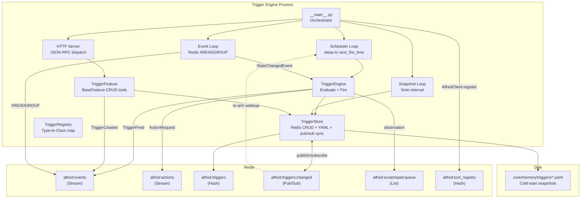
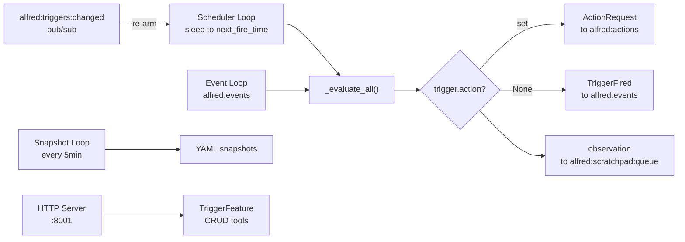
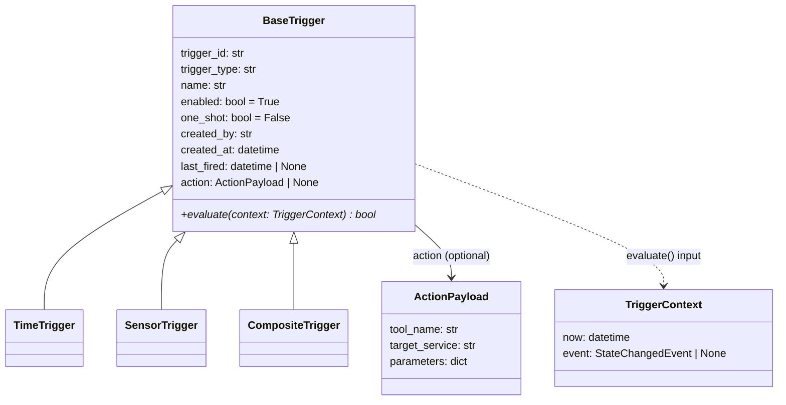
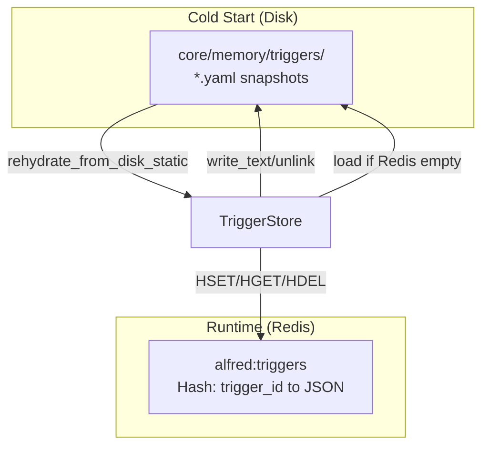
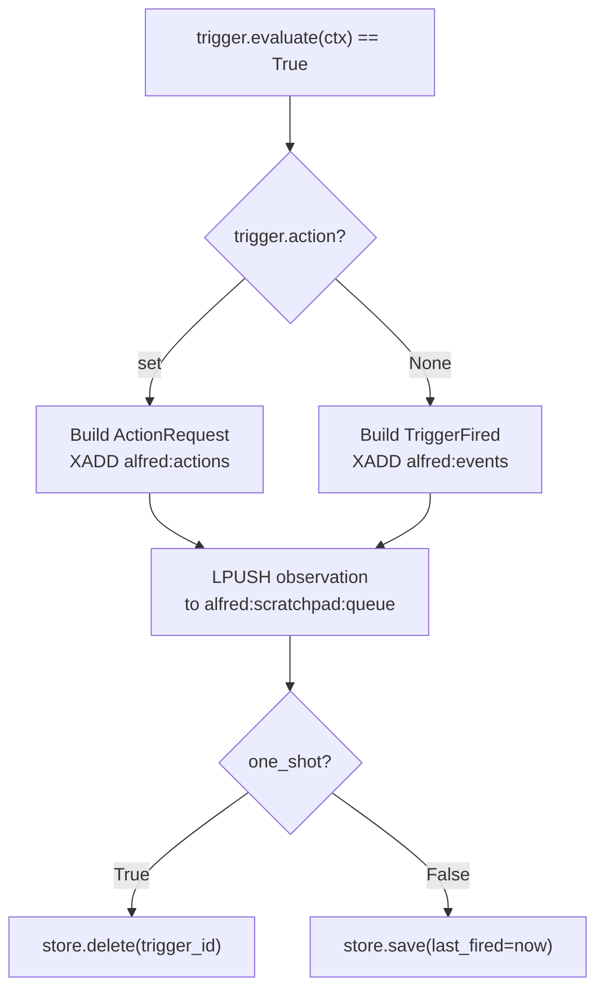

# Trigger Engine

Developer documentation for the Trigger Engine -- Alfred's proactive automation subsystem.

## Overview

The Trigger Engine enables Alfred to take autonomous actions based on time schedules, sensor events, and composite conditions. Unlike the Reflex Engine (which reacts to every incoming state change via SLM inference), the Trigger Engine evaluates pre-defined triggers deterministically -- no LLM call required.

Triggers are created dynamically by the Reflex Engine's SLM (via the `triggers.create_trigger` tool), never hardcoded. This is a core architectural pillar: Alfred learns to be proactive by observing patterns and creating triggers at runtime.

```
uv run python -m core.triggers  # starts the Trigger Engine
```

Minimum dependencies: `pydantic>=2.0`, `redis>=5.0`, `croniter>=1.0`, `pyyaml>=6.0`, Python 3.13+.

---

## Architecture



---

## Data Flow

The Trigger Engine runs four concurrent async tasks:



1. **Scheduler loop** -- calls `engine.evaluate_tick(now)`, then sleeps until `engine.next_wakeup(now)` (the earliest enabled trigger's `next_fire_time()`). No polling interval: a `TriggerStore` mutation wakes it instantly via `add_on_change` (see [Coherence](#coherence-pubsub) below), so a newly created or rescheduled trigger fires on time even if it's due sooner than any prior wakeup. This drives `TimeTrigger` evaluations (cron and run_at).
2. **Event loop** -- reads `StateChangedEvent` entries from `alfred:events` via `XREADGROUP` (consumer group `trigger-engine`, consumer `worker-1`). Each event is passed to `engine.evaluate_event(event)`, which drives `SensorTrigger` evaluations.
3. **Snapshot loop** (5min) -- calls `store.snapshot_all()` to dump all triggers from Redis to YAML files on disk. These serve as cold-start recovery only.
4. **HTTP server** (:8001) -- a minimal `asyncio.start_server` that handles JSON-RPC requests dispatched to `TriggerFeature` tools via `AlfredClient.dispatch()`.

---

## Data Models

### BaseTrigger (ABC)

**File:** `core/triggers/models.py`

The abstract base for all trigger types. Concrete subclasses define their own `Conditions` model and implement `evaluate()`.



| Field          | Type                 | Description                                                |
|----------------|----------------------|------------------------------------------------------------|
| `trigger_id`   | `str`                | UUID4, unique identifier                                   |
| `trigger_type` | `str`                | Registered type name (`time`, `sensor`, `composite`)       |
| `name`         | `str`                | Human-readable name (set by the SLM)                       |
| `enabled`      | `bool`               | Whether the trigger is active (default `True`)             |
| `one_shot`     | `bool`               | If `True`, deleted after first fire                        |
| `created_by`   | `str`                | Origin: `"tool-call"` when created via CRUD tools          |
| `created_at`   | `datetime`           | UTC creation timestamp                                     |
| `last_fired`   | `datetime \| None`   | UTC timestamp of last fire (for dedup and cron gating)     |
| `action`       | `ActionPayload\|None`| If set, publishes an `ActionRequest` on fire. If `None`, publishes a `TriggerFired` event for the Reflex Engine to handle. |

### ActionPayload

Describes the action to execute when a trigger fires. Converted to a full `ActionRequest` event by the engine.

| Field            | Type              | Description                                    |
|------------------|-------------------|------------------------------------------------|
| `tool_name`      | `str`             | MCP tool name, e.g. `lighting.dim_lights`      |
| `target_service` | `str`             | Which microservice handles this                |
| `parameters`     | `dict[str, Any]`  | Tool-specific parameters                       |

### TriggerContext

Read-only context passed to `evaluate()`. Contains the current time and optionally the incoming event.

| Field   | Type                        | Description                                |
|---------|-----------------------------|--------------------------------------------|
| `now`   | `datetime`                  | Current UTC time                           |
| `event` | `StateChangedEvent \| None` | The event that triggered evaluation, if any|

---

## Trigger Types

### TimeTrigger (`time`)

**File:** `core/triggers/types/time.py`

Fires on a cron schedule or at a specific datetime.

**Conditions:**

| Field    | Type              | Required | Description                                           |
|----------|-------------------|----------|-------------------------------------------------------|
| `cron`   | `str \| None`     | No       | Cron expression (e.g. `"0 22 * * *"` for 10pm daily) |
| `run_at` | `datetime \| None`| No       | Specific UTC datetime to fire at                      |

At least one of `cron` or `run_at` must be set. The evaluate logic:

- **Cron:** `next_fire_time()` computes the next boundary strictly after `last_fired or created_at` (anchored in the user's local timezone, see `TriggerContext.tz`) via `croniter`; `evaluate()` fires once `now` reaches that boundary. A late wakeup (e.g. after downtime) fires exactly once and then re-anchors on the new `last_fired` -- no missed or duplicate fires, and no fixed polling window.
- **run_at:** fires when `now >= run_at` and the trigger hasn't fired since `run_at`. Naive datetimes are treated as UTC.

**Example:**
```json
{
  "trigger_type": "time",
  "name": "evening_lights",
  "conditions": {"cron": "0 19 * * *"},
  "action": {
    "tool_name": "lighting.dim_lights",
    "target_service": "home-service",
    "parameters": {"room": "living_room", "level": 40}
  }
}
```

### SensorTrigger (`sensor`)

**File:** `core/triggers/types/sensor.py`

Fires when an incoming `StateChangedEvent` matches entity and state conditions.

**Conditions:**

| Field             | Type                   | Required | Description                                           |
|-------------------|------------------------|----------|-------------------------------------------------------|
| `entity_id`       | `str`                  | Yes      | Entity to watch (e.g. `light.living_room`)            |
| `state_match`     | `str \| None`          | No       | Required `new_state` value                            |
| `attribute_match` | `dict[str, Any]\|None` | No       | Key-value pairs that must match event attributes      |

The evaluate logic:

1. Returns `False` if no event in the context (tick-only evaluation).
2. Checks `entity_id` matches exactly.
3. If `state_match` is set, checks `event.new_state == state_match`.
4. If `attribute_match` is set, checks every key-value pair matches in `event.attributes`.

**Example:**
```json
{
  "trigger_type": "sensor",
  "name": "motion_lights_off",
  "conditions": {
    "entity_id": "binary_sensor.living_room_motion",
    "state_match": "off"
  },
  "action": {
    "tool_name": "lighting.turn_off_lights",
    "target_service": "home-service",
    "parameters": {"room": "living_room"}
  }
}
```

### CompositeTrigger (`composite`)

**File:** `core/triggers/types/composite.py`

Fires when at least `require` of `N` child conditions evaluate to `True`. Enables AND/OR logic over other trigger types.

**Conditions:**

| Field      | Type                    | Required | Description                                        |
|------------|-------------------------|----------|----------------------------------------------------|
| `children` | `list[dict[str, Any]]`  | Yes      | List of child specs, each with `trigger_type` and `conditions` |
| `require`  | `int`                   | Yes      | Minimum children that must evaluate True           |

Each child spec is a dict with `trigger_type` and `conditions` keys. The composite instantiates temporary `BaseTrigger` subclass instances for evaluation only -- children are not stored independently.

**Logic patterns:**
- AND: `require = len(children)`
- OR: `require = 1`
- N-of-M: `require = N`

**Example (AND: motion detected AND after sunset):**
```json
{
  "trigger_type": "composite",
  "name": "motion_after_dark",
  "conditions": {
    "require": 2,
    "children": [
      {"trigger_type": "sensor", "conditions": {"entity_id": "binary_sensor.motion", "state_match": "on"}},
      {"trigger_type": "sensor", "conditions": {"entity_id": "sun.sun", "state_match": "below_horizon"}}
    ]
  }
}
```

---

## TriggerRegistry

**File:** `core/triggers/registry.py`

A class-level registry that maps trigger type strings to `BaseTrigger` subclasses. Open for extension -- new types register via the `@TriggerRegistry.register_type()` decorator.

```python
@TriggerRegistry.register_type("time")
class TimeTrigger(BaseTrigger):
    ...
```

**Key methods:**

| Method                  | Returns                | Description                                          |
|-------------------------|------------------------|------------------------------------------------------|
| `get(trigger_type)`     | `type[BaseTrigger]`    | Lookup by type string. Raises `KeyError` if unknown. |
| `available_types()`     | `list[str]`            | All registered type names.                           |
| `build_conditions_docs()`| `str`                 | Introspects all types' `Conditions` schemas into a human-readable string for dynamic tool descriptions. |

**Registration constraint:** `core/triggers/types/__init__.py` must import all type modules so their decorators execute at import time. The `__main__.py` imports `core.triggers.types` before any evaluation occurs.

---

## TriggerStore

**File:** `core/triggers/store.py`

Redis CRUD with YAML cold-start recovery. Redis hash `alfred:triggers` is the runtime source of truth. YAML snapshots in `core/memory/triggers/` are for recovery only.



**Methods:**

| Method              | Description                                                    |
|---------------------|----------------------------------------------------------------|
| `load()`            | Load from Redis. If empty, rehydrate from YAML and backfill Redis. |
| `save(trigger)`     | `HSET` to Redis + snapshot single YAML file (in thread pool).  |
| `delete(trigger_id)`| `HDEL` from Redis + delete YAML file (in thread pool).         |
| `get(trigger_id)`   | O(1) `HGET` point lookup. Returns `None` if not found.        |
| `list_all()`        | `HGETALL` + parse all entries. Optional `enabled_only` filter. |
| `snapshot_all()`    | Dump all triggers to YAML (periodic task, runs in thread pool).|

**Async I/O safety:** All sync disk operations (`write_text`, `unlink`, `read_text`) are wrapped in `asyncio.get_running_loop().run_in_executor(None, ...)` to avoid blocking the event loop.

**Redis type handling:** redis-py stubs return `Awaitable[T] | T` unions. All Redis calls use `# type: ignore[misc]` on the await (following the precedent in `core/reflex/runner.py`).

### Coherence (Pub/Sub)

Every process holding a `TriggerStore` calls `start_sync()` to subscribe to `TRIGGERS_CHANGED_CHANNEL` (`alfred:triggers:changed`), keeping its in-memory cache coherent with every other process near-instantly instead of waiting for the periodic refresh. `save()`/`delete()` publish after writing to Redis; `shared/usertime.py` publishes on timezone change:

| `op` | Payload | Effect |
|---|---|---|
| `saved` | `{"op": "saved", "trigger_id": "..."}` | Re-fetches that one trigger and upserts it into the cache (a concurrent delete is handled by evicting instead). |
| `deleted` | `{"op": "deleted", "trigger_id": "..."}` | Evicts that trigger from the cache. |
| `tz-changed` | `{"op": "tz-changed"}` | No cache change -- just notifies `add_on_change` listeners so the scheduler re-arms cron alarms under the new zone. |

Pub/sub is best-effort. The existing 60-second `refresh()` (full `HGETALL`) remains as the reconciliation net, healing any state missed by a dropped subscriber connection.

---

## TriggerEngine

**File:** `core/triggers/engine.py`

The evaluation and fire logic. Stateless -- depends on `TriggerStore` for data and `AioRedis` for publishing.

### Evaluation

Both `evaluate_tick()` and `evaluate_event()` delegate to `_evaluate_all()`:

1. Fetch all enabled triggers from the store.
2. For each trigger, call `trigger.evaluate(context)`.
3. If `True`, call `fire(trigger, context)`.
4. Errors in individual triggers are logged and skipped (one bad trigger doesn't block others).

### Fire Logic



- **With action:** Constructs a full `ActionRequest` event (source=`trigger-engine`) and publishes to `alfred:actions`. Domain agents consume this identically to Reflex Engine outputs.
- **Without action:** Publishes a `TriggerFired` event to `alfred:events`. The Reflex Engine's SLM decides what to do.
- **Observation:** Every fire pushes a formatted string to the scratchpad queue for the ScratchpadWriter.
- **One-shot:** Trigger is deleted after firing. Otherwise, `last_fired` is updated to prevent re-firing within the same evaluation window.

---

## TriggerFeature (CRUD Tools)

**File:** `core/triggers/feature.py`

Exposes trigger management as `BaseFeature` tools, making them discoverable by the Reflex Engine's SLM. Registered via `AlfredClient` at startup.

### Tools

| Tool Name                  | Description                                          |
|----------------------------|------------------------------------------------------|
| `triggers.create_trigger`  | Create a new trigger with type, conditions, and optional action |
| `triggers.list_triggers`   | List all triggers (default: enabled only)            |
| `triggers.update_trigger`  | Update conditions, action, or name of a trigger      |
| `triggers.delete_trigger`  | Delete a trigger by ID                               |
| `triggers.toggle_trigger`  | Enable or disable a trigger                          |

### Dynamic Descriptions

`TriggerFeature.get_tools()` overrides the base method to inject dynamic descriptions into `create_trigger`. It calls `TriggerRegistry.build_conditions_docs()` to introspect all registered trigger types and their `Conditions` schemas, appending the result to the tool's description. This way the SLM always sees the current set of available trigger types and their condition fields -- nothing is hardcoded in docstrings.

### Validation

- `create_trigger`: validates `trigger_type` against the registry, validates `action` via `ActionPayload`, validates `conditions` by instantiating the trigger (Pydantic validation on the `Conditions` model).
- `update_trigger`: uses `store.get()` for O(1) point lookup, validates new conditions through the type's `Conditions` model, validates action through `ActionPayload`.
- On success, `create_trigger` publishes a `TriggerCreated` event to `alfred:events`.

---

## Event Schemas

Two events are specific to the Trigger Engine, defined in `bus/schemas/events.py`:

### TriggerFired

Published when a trigger fires but has no direct `action` set. The Reflex Engine receives this on `alfred:events` and decides what action (if any) to take.

| Field          | Type              | Description                                        |
|----------------|-------------------|----------------------------------------------------|
| `event_type`   | `"trigger_fired"` | Fixed                                              |
| `source`       | `"trigger-engine"`| Fixed                                              |
| `trigger_id`   | `str`             | Which trigger fired                                |
| `trigger_name` | `str`             | Human-readable trigger name                        |
| `trigger_type` | `str`             | `time`, `sensor`, or `composite`                   |
| `context`      | `dict[str, Any]`  | Evaluation context (type, entity, state, timestamp)|

### TriggerCreated

Published when a new trigger is created via the CRUD tools.

| Field          | Type                  | Description                                        |
|----------------|-----------------------|----------------------------------------------------|
| `event_type`   | `"trigger_created"`   | Fixed                                              |
| `source`       | `"trigger-engine"`    | Fixed                                              |
| `trigger_id`   | `str`                 | UUID4, auto-generated                              |
| `trigger_type` | `str`                 | Registered type (e.g. `time`, `sensor`, `composite`)|
| `name`         | `str`                 | Human-readable trigger name                        |
| `created_by`   | `str`                 | Origin (e.g. `"tool-call"`)                        |
| `conditions`   | `dict[str, Any]`      | Trigger-type-specific conditions                   |
| `action`       | `dict[str, Any]\|None`| Action payload, if set                             |
| `one_shot`     | `bool`                | Whether the trigger deletes itself after firing    |

---

## Redis Keys

All keys are defined in `shared/streams.py` -- the single source of truth.

| Key                        | Type   | Purpose                                       |
|----------------------------|--------|-----------------------------------------------|
| `alfred:triggers`          | Hash   | trigger_id → JSON (runtime source of truth)   |
| `alfred:triggers:changed`  | Pub/Sub| Cross-process `TriggerStore` cache coherence (`saved`/`deleted`/`tz-changed`) |
| `alfred:events`            | Stream | Input (StateChangedEvent) + output (TriggerFired, TriggerCreated) |
| `alfred:actions`           | Stream | Output (ActionRequest when trigger has action) |
| `alfred:scratchpad:queue`  | List   | Fire observations for ScratchpadWriter         |
| `alfred:tool_registry`     | Hash   | CRUD tools registered via AlfredClient         |

### Consumer Group

The event loop uses consumer group `trigger-engine` (consumer `worker-1`) on `alfred:events`. Created at startup via `ensure_consumer_group()` from `core.reflex.runner`.

---

## Storage Format

### Redis Hash (`alfred:triggers`)

Each field is a trigger_id, each value is JSON:

```json
{
  "trigger_id": "550e8400-e29b-41d4-a716-446655440000",
  "trigger_type": "time",
  "name": "evening_lights",
  "enabled": true,
  "one_shot": false,
  "created_by": "tool-call",
  "created_at": "2026-03-10T19:00:00Z",
  "last_fired": null,
  "action": {
    "tool_name": "lighting.dim_lights",
    "target_service": "home-service",
    "parameters": {"room": "living_room", "level": 40}
  },
  "conditions": {"cron": "0 19 * * *", "run_at": null}
}
```

### YAML Snapshot (`core/memory/triggers/<trigger_id>.yaml`)

Identical structure, serialized via `yaml.dump()`. Written in a thread pool to avoid blocking the event loop. Gitignored -- these are ephemeral recovery files.

---

## Adding a New Trigger Type

1. Create `core/triggers/types/<your_type>.py`.
2. Subclass `BaseTrigger`, define a nested `Conditions(BaseModel)` class, implement `evaluate()`.
3. Decorate with `@TriggerRegistry.register_type("<your_type>")`.
4. Import the module in `core/triggers/types/__init__.py`.

```python
from pydantic import BaseModel
from core.triggers.models import BaseTrigger, TriggerContext
from core.triggers.registry import TriggerRegistry


@TriggerRegistry.register_type("geofence")
class GeofenceTrigger(BaseTrigger):
    trigger_type: str = "geofence"

    class Conditions(BaseModel):
        latitude: float
        longitude: float
        radius_meters: float

    conditions: Conditions

    def evaluate(self, context: TriggerContext) -> bool:
        # ... geofence logic ...
        return False
```

The new type is automatically available in `TriggerFeature.create_trigger` tool descriptions and validated by the registry.

---

## Running

### Startup

```bash
# Prerequisites: Redis + Mosquitto running, home-service registered
uv run python -m core.triggers
```

The engine:
1. Connects to Redis.
2. Loads triggers from `alfred:triggers` (or rehydrates from YAML if empty).
3. Registers CRUD tools via `AlfredClient.register()` to `alfred:tool_registry`.
4. Starts the scheduler loop, event loop, snapshot loop, and HTTP server concurrently.

### Shutdown

Handles `SIGTERM` and `SIGINT` gracefully:
1. Sets shutdown flag to exit all loops.
2. Cancels all async tasks.
3. Calls `AlfredClient.unregister()` to remove tools from registry.
4. Closes the Redis connection.

### Startup Order

The Trigger Engine should start after the MQTT-Redis Bridge and Reflex Runner:

```
1. Infrastructure (Redis, Mosquitto, Ollama)
2. Microservices (home-service)
3. MQTT-Redis Bridge (python -m bus)
4. Reflex Runner (python -m core.reflex)
5. Trigger Engine (python -m core.triggers)
```

---

## Quick Reference

| What | Import / Path |
|---|---|
| Base trigger ABC | `from core.triggers.models import BaseTrigger` |
| Register a trigger type | `from core.triggers.registry import TriggerRegistry` |
| Action payload model | `from core.triggers.models import ActionPayload` |
| Evaluation context | `from core.triggers.models import TriggerContext` |
| Store (Redis + YAML) | `from core.triggers.store import TriggerStore` |
| Engine (evaluate + fire) | `from core.triggers.engine import TriggerEngine` |
| CRUD feature | `from core.triggers.feature import TriggerFeature` |
| Stream constants | `from shared.streams import TRIGGERS_KEY, EVENTS_STREAM, ACTIONS_STREAM` |
| Redis type alias | `from core.reflex.runner import AioRedis` |
| Consumer group helper | `from core.reflex.runner import ensure_consumer_group` |

| Redis key | Type | Constant |
|---|---|---|
| `alfred:triggers` | Hash | `shared.streams.TRIGGERS_KEY` |
| `alfred:triggers:changed` | Pub/Sub | `shared.streams.TRIGGERS_CHANGED_CHANNEL` |
| `alfred:events` | Stream | `shared.streams.EVENTS_STREAM` |
| `alfred:actions` | Stream | `shared.streams.ACTIONS_STREAM` |
| `alfred:scratchpad:queue` | List | `shared.streams.SCRATCHPAD_QUEUE` |
