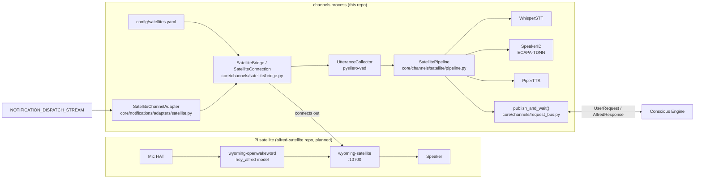
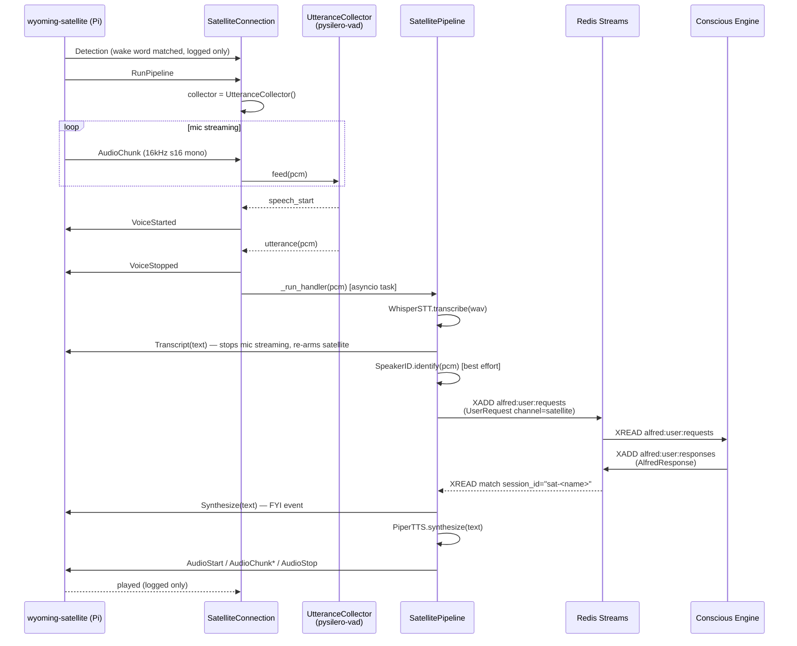

# Voice Satellites — Wyoming Bridge

## Overview

Voice satellites are physical, Alexa-like devices placed around the home. Each one wakes on
a custom "Hey Alfred" wake word, streams the utterance to Alfred, and plays back the spoken
reply. Satellites also serve as output devices for proactive URGENT notifications and
identify who is speaking via voiceprint.

The feature splits into two halves, per the Decoupled Domains pillar:

1. **Pi side — `alfred-satellite` repo** (planned workspace sibling of `home-service` /
   `signal-bridge`; see `docs/superpowers/plans/2026-07-16-alfred-satellite-repo-plan.md`).
   Stock third-party software only — `wyoming-satellite` + `wyoming-openwakeword` as systemd
   services, plus a custom `hey_alfred` wake word model. The device speaks standard Wyoming
   and works with plain Home Assistant too; it is not coupled to Alfred in any way.
2. **Alfred side — Satellite Bridge**, this repo, `core/channels/satellite/` — asyncio tasks
   running inside the **channels process** (`python -m core.channels`). Whisper and Piper are
   already loaded there, and the `channels-delivery` notification worker already runs there.

This document covers the Alfred-side bridge. Full design rationale and decisions live in
`docs/superpowers/specs/2026-07-15-voice-satellite-design.md`.

**Connection model:** Wyoming inverts the usual direction — each satellite listens on TCP
port 10700 and the *bridge connects out to it*. No new listening ports open on the Alfred
server, and satellites never need credentials to reach Alfred. Wyoming itself is
unauthenticated, so satellites must live on the trusted network (LAN/Tailscale).

## Architecture



The bridge owns one `SatelliteConnection` per entry in `config/satellites.yaml`, each running
its own reconnect-forever supervisor task. There is no shared state between satellites beyond
the Redis streams they both talk to.

## The Voice Loop



**No-speech path:** if the VAD never crosses `threshold` before `no_speech_timeout_ms`
(default 8s), the collector emits a `timeout` event instead of `utterance`. The connection
sends an empty `Transcript("")` directly — this still stops mic streaming and re-arms the
satellite, but skips STT/Conscious/TTS entirely.

**Failure path:** if the pipeline handler raises (STT error, Conscious timeout, TTS error),
`SatelliteConnection._run_handler` catches it and sends an `Error` event so the satellite can
play error feedback. `Transcript` is always sent *before* the slow Conscious round-trip
(`SatellitePipeline.__call__` sends it right after STT), so a downstream failure never leaves
the satellite stuck streaming.

## Wyoming Event Handling

Handled in `SatelliteConnection._handle_event()` (`core/channels/satellite/bridge.py`):

| Event (from satellite) | Bridge behavior |
|---|---|
| `AudioChunk` | Converted to 16kHz/16-bit/mono via `AudioChunkConverter`, fed to the active `UtteranceCollector`. Ignored if no collector is active (trailing audio after utterance end). |
| `RunPipeline` | Starts a new `UtteranceCollector` — arms the bridge to listen for speech. |
| `Ping` | Replies with `Pong` (satellite-initiated keepalive). |
| `detection`, `played`, `pong`, `voice-started`, `voice-stopped` | Logged at DEBUG only, no action. |
| anything else | Logged at DEBUG as "ignoring event". |

Sent by the bridge (`SatelliteConnection` public API):

| Method | Wyoming event(s) | When |
|---|---|---|
| `send_transcript(text)` | `Transcript` | End of an utterance (or empty on no-speech timeout). Stops the satellite's mic streaming and re-arms it. |
| `send_synthesize(text)` | `Synthesize` | FYI event sent just before the reply audio, so the satellite can show/log the text. |
| `send_error(text)` | `Error` | Pipeline failure — satellite plays error feedback. |
| `play_wav(wav_bytes)` | `AudioStart` → `AudioChunk`×N → `AudioStop` | Streaming reply audio *or* an announcement — same code path, no distinct "announce" event exists in the protocol usage here. |
| (ping loop) | `Ping` | Every 10s while connected — see Operational Notes. |

Handshake on every (re)connection: `Describe()` → wait for `Info` → `RunSatellite()`. On
clean shutdown the bridge best-effort sends `PauseSatellite()` before closing the socket.

## Configuration

### `config/satellites.yaml`

Gitignored; copy from `config/satellites.yaml.example`:

```yaml
satellites:
  - name: kitchen
    host: 192.168.1.40   # or kitchen-sat.local
    port: 10700          # wyoming-satellite default
    area: Kitchen
```

| Field | Type | Required | Notes |
|---|---|---|---|
| `name` | `str` | yes | Used in the session ID (`sat-<name>`), logs, and `device_id` on `UserRequest`. Must be unique across the fleet — `load_satellites()` raises `ValueError` on duplicates. |
| `host` | `str` | yes | Satellite's IP or mDNS hostname. |
| `port` | `int` | no (default `10700`) | Wyoming default satellite port. |
| `area` | `str \| None` | no | Must match a Home Assistant area name for room-aware commands (§ below). `None` disables room-aware context for that device. |

Path resolution in `load_satellites()` (`core/channels/satellite/config.py`): explicit
argument > `SATELLITES_CONFIG` env var > `config/satellites.yaml`. **A missing file is not an
error** — the fleet is empty and the satellite bridge is disabled entirely (no tasks started,
`app.state.satellite_bridge` stays `None`, the `satellite` channel adapter is never
registered). An invalid or malformed file (non-mapping root, bad entry, duplicate names)
raises `ValueError` from `load_satellites()`, which the channels lifespan catches: the error
is logged at ERROR level and **satellites are disabled for that run** — the channels process
itself (web, iOS, notifications) keeps serving. Fix the YAML and restart to re-enable.

### Environment Variables

| Variable | Default | Purpose |
|---|---|---|
| `SATELLITES_CONFIG` | `config/satellites.yaml` | Override the fleet config path. |
| `SPEAKER_ID_THRESHOLD` | `0.45` | Cosine similarity floor for a positive voiceprint match. See Speaker Identification below. |

## Data Models

**`SatelliteEntry`** (`core/channels/satellite/config.py`) — one physical device, described
above.

**`UserRequest`** satellite-specific fields (`bus/schemas/events.py`, all optional and `None`
for non-satellite channels):

| Field | Type | Set by |
|---|---|---|
| `channel` | `Literal[..., "satellite"]` | `SatellitePipeline` |
| `device_id` | `str \| None` | Satellite entry's `name` |
| `area` | `str \| None` | Satellite entry's `area` |
| `identity_confidence` | `float \| None` | `SpeakerMatch.confidence` when a voiceprint match succeeds |

**`CollectorEvent`** (`core/channels/satellite/endpointing.py`) — a frozen dataclass emitted
by `UtteranceCollector.feed()`: `kind: Literal["speech_start", "utterance", "timeout"]`,
`pcm: bytes | None` (populated only for `"utterance"`).

**`SpeakerMatch`** (`core/voice/speaker_id.py`) — `identity: str`, `confidence: float`,
`enrolled: bool`. A non-match returns the singleton `identity="unknown", confidence=0.0,
enrolled=False`.

## Speaker Identification

**Storage:** Redis hash `alfred:identity:voiceprint` (`shared.streams.VOICEPRINT_KEY`) — one
field per enrolled identity, value is a mean-normalized 192-dim ECAPA embedding as float32
bytes.

**Enrollment:** the web Settings page's Voice Enrollment card (`web/src/pages/
VoiceEnrollmentCard.tsx`) records 3 mic samples and reads them aloud against rotating prompts,
then `POST`s all three to `/api/voice/enroll` (trusted-network + authenticated-session gated,
`core/channels/web_server.py`). The handler decodes each sample to 16kHz PCM
(`core/voice/audio.decode_to_pcm16k`) and calls `SpeakerID.enroll(identity, samples)`, which
embeds each sample, averages them, L2-normalizes, and writes to the Redis hash.

**Identification:** `SatellitePipeline` calls `SpeakerID.identify(pcm)` on every utterance
(best-effort — a failure is logged and falls through to the default claim). It embeds the
utterance and takes the cosine-nearest enrolled print:

```python
confidence = min(0.95, 0.7 + (best_score - threshold) * 0.5)
```

If `best_score < threshold`, the match is `unknown` and `identity_claim` stays the pipeline's
hardcoded default (`"sir"`) with `identity_confidence=None` — `IdentityGate.resolve()` then
falls back to the same local-claim trust (confidence 0.7) used for web/iOS. If the match
clears the threshold, `identity_claim`/`identity_confidence` come from the voiceprint and
`IdentityGate` uses `method="voice_id"`.

**Threshold:** `SPEAKER_ID_THRESHOLD` defaults to **0.45**, not 0.7. ECAPA-TDNN cosine scores
for the *same* speaker typically run 0.4–0.7 (not near 1.0), so a 0.7 floor would reject
genuine matches; different speakers score roughly 0.0–0.25. This correction is also reflected
in the amended spec (§4.5).

**Model:** `speechbrain/spkrec-ecapa-voxceleb`, auto-downloaded to
`data/models/spkrec-ecapa-voxceleb` on first use (same auto-download convention as Piper).
Loaded off the event loop via `asyncio.to_thread` behind a lock so concurrent requests don't
trigger a duplicate load.

## Room-Aware Context

The `area` field flows from `satellites.yaml` → `UserRequest.area` →
`ConsciousEngine` → `ContextAssembler.assemble(area=...)`, which injects:

```
## Location
This request was spoken at the <area> satellite. When a device is referenced without
naming a room ("the lights"), assume the <area> area.
```

Nothing is hardcoded — any area name from the config flows straight into the prompt.

## Announcements

`SatelliteChannelAdapter` (`core/notifications/adapters/satellite.py`) is registered via
`@ChannelRegistry.register()` at import time, and its instance is injected in the channels
lifespan (`ChannelRegistry.set_instance("satellite", ...)`, `core/channels/web_server.py`)
only when at least one satellite is configured. `supported_urgencies = {Urgency.URGENT}` —
the existing `channels-delivery` consumer group and dispatcher require **zero changes** to
pick it up; `ChannelRegistry.get_adapters_for_urgency()` filters by urgency automatically.

`deliver()` synthesizes `"{title}: {body}"` with Piper, then calls
`SatelliteBridge.play_wav_all()`, which broadcasts to every currently-**connected** satellite
(`SatelliteBridge.connections()`, filtered on `SatelliteConnection.connected`). A
per-satellite delivery failure is caught and logged as a WARNING without aborting delivery to
the rest of the fleet; an offline satellite is silently skipped the same way (it's simply not
in `connections()`). There is no dedicated Wyoming "announce" event — an announcement is a
bare `AudioStart`/`AudioChunk`/`AudioStop` stream, identical to a spoken reply.

For single-device delivery (future presence-aware targeting, timers), the bridge also exposes
`get_connection(name)` and `play_wav_to(name, wav) -> bool` (False when the named satellite is
offline or unknown); v1's announcement adapter only uses the broadcast path.

## Operational Notes

**Reconnect backoff:** each `SatelliteConnection.run()` loop retries forever. Backoff starts
at 1s and doubles on each failed attempt, capped at `reconnect_max_s` (default 60s, set on
`SatelliteBridge`). It resets to 1s whenever the *previous* attempt reached a fully
established session (i.e., completed the `Describe`/`Info`/`RunSatellite` handshake) before
failing — so a device that drops mid-session gets fast retries, while a device that's fully
unreachable (connection refused) backs off up to a minute between attempts.

**Keepalive / liveness:** the bridge sends a `Ping` to each connected satellite every 10s
(`_PING_INTERVAL_S`). Every socket read (`client.read_event()`) is wrapped in a 30s timeout
(`_READ_TIMEOUT_S`) — if nothing arrives (a `Pong`, or any other event) within 30s, the read
raises and the connection is treated as dead, triggering the reconnect loop.

**Shutdown:** cancelling a connection's task sends a best-effort `PauseSatellite()` while the
socket is still open, then cancels any in-flight pipeline handler tasks
(`SatelliteConnection._tasks`) before disconnecting. This matters because a pipeline handler
can be mid-flight for up to the 60s request timeout (Conscious Engine round-trip); without
cancellation, a stale reply could land on a *new* session that has already re-armed after
reconnecting.

**Satellite offline for announcements:** `play_wav_all()` only targets satellites present in
`connections()` — there's no queueing or retry for a satellite that's offline when an URGENT
notification fires. It simply misses that announcement.

**Redis down:** satellite TCP connections stay up independent of Redis. `publish_and_wait()`
doesn't guard its `redis.xadd()`/`xread()` calls — if Redis is actually unreachable they
raise, which propagates out of `SatellitePipeline.__call__` into
`SatelliteConnection._run_handler`'s catch-all, which sends an `Error` event so the satellite
plays its error earcon. If Redis is up but nothing ever publishes a matching
`AlfredResponse` (e.g. the Conscious Engine is down), `publish_and_wait()`'s 60s timeout
returns a canned apology response instead, which is spoken normally via TTS like any other
reply. Broader Redis-down recovery is a separate backlog item, not satellite-specific.

**Dev-mode fake satellite (no hardware):** run `wyoming-satellite` directly on the MacBook
against its built-in mic, point `config/satellites.yaml` at `127.0.0.1`, and start the
runner — exercises the full loop before any Pi is ordered. See the macOS dev-mode section of
`docs/superpowers/plans/2026-07-16-alfred-satellite-repo-plan.md` for the exact `sox`-based
mic/speaker commands and `wyoming-openwakeword` setup.

## Dependencies

| Package | Where | Purpose |
|---|---|---|
| `wyoming>=1.10` | base deps | Protocol events (`AudioChunk`, `Transcript`, `RunSatellite`, etc.) and `AsyncTcpClient`. |
| `pysilero-vad>=3.4` | `voice` extra | Zero-dependency (rhasspy) Silero VAD wrapper — the frame-by-frame speech probability detector behind `UtteranceCollector`. |
| `speechbrain>=1.1` | `voice` extra | ECAPA-TDNN speaker embeddings for `SpeakerID`. |
| `faster-whisper>=1.0`, `piper-tts>=1.2` | `voice` extra | STT/TTS, already used by the web channel. |

`wyoming` is a base dependency (not gated behind `voice`) because `web_server.py` imports
`core.channels.satellite.bridge` unconditionally at module load time, and `bridge.py` imports
`wyoming.*` submodules directly at the top of the file (not lazily) — the process would fail
to import at all without `wyoming` installed, regardless of whether any satellites are
configured. The bridge itself is simply never *started* if `load_satellites()` returns an
empty fleet.

## Running

The satellite bridge is not a separate process — it starts inside the channels process
lifespan (`core/channels/web_server.py`, `_lifespan()`) whenever `load_satellites()` returns
at least one entry:

```bash
uv run python -m core.channels   # starts the satellite bridge too, if config/satellites.yaml exists
```

No satellites configured → the bridge, the `SatelliteConnection` tasks, and the
`satellite` channel adapter are simply never created. Everything else in the channels
process runs unaffected.
