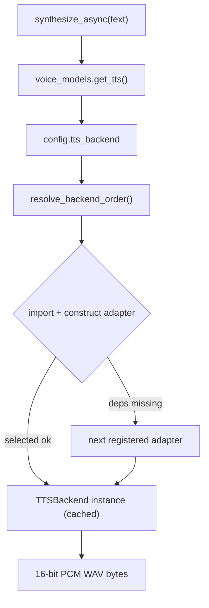

# Voice Subsystem

Alfred's voice I/O runs **in-process in the channels process**. STT and TTS load
once, off the event loop, and are shared by every voice surface: the browser/app
WebSocket, the iOS client, and the physical Wyoming satellites. The Wyoming
protocol is only a transport for satellites — the STT/TTS engines are identical.

## Components

- **STT — `WhisperSTT`** (`core/voice/stt.py`): `faster-whisper`, `large-v3-turbo`.
  `transcribe(audio_bytes, audio_format="wav") -> str`.
- **TTS — pluggable adapter** (`core/voice/`): an **ABC port** + registry.
  Contract: `synthesize(text: str) -> bytes` (16-bit PCM mono WAV).
  - **`KokoroTTS`** (`tts_kokoro.py`) — **default**, neural Kokoro-82M via
    `kokoro-onnx`, voice `am_michael`. Apache-2.0 weights + MIT wrapper.
  - **`PiperTTS`** (`tts.py`) — fallback, `piper-tts`, `en_GB-alan-medium`.
- **Speaker ID — `SpeakerID`** (`core/voice/speaker_id.py`): ECAPA-TDNN voiceprints.

## Adapter architecture

`tts_backend.py` defines the `TTSBackend` ABC (`@abstractmethod synthesize`). The
channels process depends only on this port. Adapters subclass it; the registry
(`tts_registry.py`) maps a config name → adapter. Adding a backend is one adapter
class + one registry entry — no caller changes (a future Apple-Silicon MLX adapter
drops in the same way — see the backlog).



`get_tts()` reads `config.tts_backend`, tries that adapter first, and falls back
to any other registered adapter whose optional deps are installed.

## Configuration

| Setting | Env | Default | Purpose |
|---|---|---|---|
| `tts_backend` | `ALFRED_TTS_BACKEND` | `kokoro` | Backend (`kokoro` \| `piper`) |
| `kokoro_voice` | `KOKORO_VOICE` | `am_michael` | Kokoro voice id |
| `kokoro_speed` | `KOKORO_SPEED` | `1.0` | Speech rate |
| `kokoro_onnx_provider` | `KOKORO_ONNX_PROVIDER` | `auto` | `auto`\|`cpu`\|`cuda`\|`coreml` |

Popular voices: `am_michael`, `am_adam` (US male), `af_heart` (US female),
`bm_george` (UK male), `bf_emma` (UK female).

## Model download (Hugging Face Hub)

Both backends auto-download on first use via `hf_models.ensure_model()`
(`huggingface_hub.hf_hub_download`, cached in `~/.cache/huggingface/hub`, pinned
revision):

- **Kokoro** — `fastrtc/kokoro-onnx`: `kokoro-v1.0.onnx` (~325 MB) + `voices-v1.0.bin` (~28 MB).
- **Piper** — `rhasspy/piper-voices`: `…/en_GB-alan-medium.onnx` + `.onnx.json`.

## Execution provider (one engine, two hosts)

Kokoro is a single ONNX graph. `KokoroTTS._resolve_provider()` sets the
`ONNX_PROVIDER` env var kokoro-onnx honours:

- **macOS (M4 Max):** CPU EP. ~0.4 s per short reply (RTF ~0.11–0.19). CoreML EP is
  opt-in (`KOKORO_ONNX_PROVIDER=coreml`) — it silently FP16-converts / falls back.
- **Linux (RTX 4090):** CUDA EP. Install `onnxruntime-gpu` **instead of**
  `onnxruntime` (mutually exclusive):

  ```bash
  uv pip uninstall onnxruntime && uv pip install onnxruntime-gpu
  ```

  With `KOKORO_ONNX_PROVIDER=auto`, CUDA is chosen automatically when present.

## espeak-ng phonemization

Kokoro's g2p is `phonemizer-fork → espeak-ng` (no misaki/spaCy/torch).
`espeakng_loader` bundles espeak + data. `KokoroTTS` passes an **explicit**
`EspeakConfig(lib_path=…, data_path=…)` from `espeakng_loader`, which makes
phonemization deterministic and immune to ambient `PHONEMIZER_ESPEAK_*` /
`ESPEAK_DATA_PATH` env vars (the root cause of the spike's `phontab` error).
`tests/core/voice/test_espeak_smoke.py` guards this on macOS + Linux.

## Switching back to Piper

```bash
ALFRED_TTS_BACKEND=piper
```

No other change — satellite, web, and iOS voice go through the same seam.
