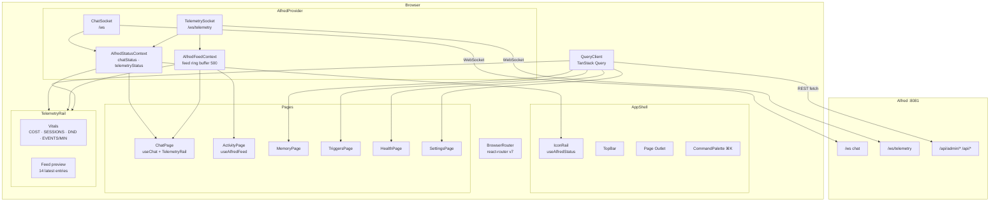

# Alfred Web Frontend

## Overview

The web frontend is a single-page application (SPA) that replaces the legacy vanilla
`index.html` / `settings.html` / `app.js` / `settings.js` files. It provides a Mission
Control-style interface for chat, live telemetry, memory inspection, trigger management,
health monitoring, and integration settings. The SPA is built and served by the Alfred
channels process on port 8081.

---

## Stack

| Concern | Tool | Version |
|---|---|---|
| Build | Vite | 8.x |
| Runtime | React | 19.x |
| Language | TypeScript | ~6.x |
| Styling | Tailwind CSS | v4.x (Vite plugin, `@theme inline`) |
| Components | shadcn/ui (Radix UI primitives) | radix-ui 1.x |
| Data fetching | TanStack Query | 5.x |
| Routing | react-router-dom | v7.x |
| Icons | lucide-react | latest |
| Toast | sonner | 2.x |
| Command palette | cmdk | 1.x |
| Markdown | react-markdown | 10.x |
| Testing | Vitest + Testing Library | 4.x |
| Fonts | Inter Variable (sans), JetBrains Mono (mono), Geist Variable |

---

## Directory Map

```
web/
  src/
    lib/           # Pure utilities and socket clients
      api.ts           # fetch wrapper with ApiError + 401→/login redirect
      chat-socket.ts   # ChatSocket wrapping ReconnectingSocket("/ws")
      telemetry-socket.ts  # TelemetrySocket wrapping ReconnectingSocket("/ws/telemetry")
      types.ts         # Shared TypeScript interfaces (ChatServerMessage, TelemetryMessage,
                       # Overview, Trigger, EpisodicEntry, SemanticFile, Routine, …)
      format.ts        # categorize(), summarize(), timeOf(), CATEGORY_CLASS, SourceCategory
      utils.ts         # cn() Tailwind class merger
      webauthn.ts      # registerPasskey(), login(), logout() WebAuthn browser API wrappers
      ws.ts            # ReconnectingSocket (reconnect + exponential backoff + code-4001 gate)
    shell/         # App-level chrome and socket context
      AlfredProvider.tsx   # Split contexts (AlfredStatusContext + AlfredFeedContext), sockets,
                           # module-level singleton instances, FEED_MAX=500 ring buffer
      AppShell.tsx         # Layout: IconRail | [TopBar / <Outlet>] | Toaster | CommandPalette
      CommandPalette.tsx   # ⌘K palette — navigation + curated controls
      IconRail.tsx         # Left nav: Chat, Activity, Memory, Triggers, Health, Settings
      TelemetryRail.tsx    # Right sidebar on Chat: live feed preview + vitals (collapsible)
      TopBar.tsx           # Page header
    chat/          # Chat feature
      ChatPage.tsx         # Message list + Composer + TelemetryRail
      Composer.tsx         # Text input + VoiceButton
      MessageItem.tsx      # Renders a chat message (user / alfred / notification)
      VoiceButton.tsx      # MediaRecorder + AudioContext level meter, emits base64 WebM
      use-chat.ts          # useChat() hook — subscribes to ChatSocket, queues messages
    pages/         # Full-page views
      ActivityPage.tsx     # Live event feed with pause/filter/inspect; merges live + backfill
      EventInspector.tsx   # Side panel: pretty-prints a selected FeedEntry as JSON
      HealthPage.tsx       # Connectivity, cost, integrations, streams, sessions, devices
      LoginPage.tsx        # WebAuthn conditional UI login
      MemoryPage.tsx       # Tabs: episodic (search) / semantic / routines / scratchpad
      OnboardingPage.tsx   # 6-step wizard: passkey → personal → proactivity → guest → integrations → done
      SettingsPage.tsx     # Session (sign-out) + IntegrationCards
      TriggersPage.tsx     # Trigger list + DND toggle + deferred queue + notification history
      IntegrationCard.tsx  # Reusable integration credential form card
    components/
      ui/                  # shadcn/ui component primitives (alert, badge, button, card,
                           # command, dialog, input, progress, scroll-area, select,
                           # separator, sheet, skeleton, sonner, switch, table, tabs,
                           # textarea, tooltip)
    test/
      setup.ts             # Vitest / Testing Library setup
    index.css      # Tailwind v4 @import + CSS custom properties + @theme registration
    main.tsx       # React entrypoint
    App.tsx        # Router, QueryClient, auth gate (Guarded), route tree
```

---

## Design Tokens — Mission Control Color Language

A single dark theme. No light mode by design. All colors are defined as CSS custom
properties in `web/src/index.css` and registered into Tailwind via `@theme inline`.

### Source Colors

These are the semantic paint language used throughout the UI. Each color encodes which
part of the Alfred system an element relates to:

| Token | CSS var | Hex | Meaning |
|---|---|---|---|
| `reflex` | `--reflex` | `#7dd3fc` | System 1 — Reflex Engine, fast-path events |
| `conscious` | `--conscious` | `#4ade80` | System 2 — Conscious Engine, LLM responses |
| `memory` | `--memory` | `#facc15` | Memory layer — significance, routines |
| `trigger` | `--trigger` | `#f472b6` | Trigger Engine, notifications |
| `home` | `--home` | `#38bdf8` | Home Assistant / IoT events |
| `user` | `--user` | `#94a3b8` | User requests |
| `ok` | `--ok` | `#4ade80` | Health: good |
| `warn` | `--warn` | `#facc15` | Health: approaching threshold |
| `bad` | `--bad` | `#f87171` | Health: degraded / error |

### @theme Registration Pattern

Tailwind v4 requires every CSS custom property to be explicitly mapped into the
`@theme inline` block so that utility classes like `text-reflex`, `bg-memory`, `border-ok`
are generated:

```css
@theme inline {
  --color-reflex:   var(--reflex);
  --color-conscious: var(--conscious);
  --color-memory:   var(--memory);
  --color-trigger:  var(--trigger);
  --color-home:     var(--home);
  --color-user:     var(--user);
  --color-ok:       var(--ok);
  --color-warn:     var(--warn);
  --color-bad:      var(--bad);
  --color-panel:    var(--panel);
  /* … shadcn tokens … */
}
```

Once registered, source colors are usable as standard Tailwind utilities anywhere:
`text-reflex`, `bg-trigger/20`, `border-memory`, etc.

### `SourceCategory` → Tailwind class mapping

`CATEGORY_CLASS` in `lib/format.ts` maps feed entries to their source color:

```ts
export const CATEGORY_CLASS: Record<SourceCategory, string> = {
  reflex:   "text-reflex",
  conscious: "text-conscious",
  memory:   "text-memory",
  trigger:  "text-trigger",
  user:     "text-user",
  home:     "text-home",
  system:   "text-muted-foreground",
};
```

`SourceCategory` is the union `"reflex" | "conscious" | "memory" | "trigger" | "user" | "home" | "system"`.
Note: `"memory"` is a reserved category — no stream produces it automatically; pages
assign it manually (e.g. the Memory page).

---

## WebSocket Protocols

### Chat (`/ws`)

Used by `ChatSocket` (`lib/chat-socket.ts`).

#### Client → Server

```json
{"type": "text",  "content": "<message>", "channel": "web_pwa", "session_id": "<id>"}
{"type": "audio", "content": "<base64-webm-data-url>", "channel": "web_pwa"}
```

`session_id` is sent only on the first message of a new connection and is read from
`localStorage` under key `alfred_session_id`. After the first send, `firstMessageSent`
is set and session_id is omitted from subsequent payloads.

#### Server → Client (`ChatServerMessage`)

```ts
| { type: "session";       session_id: string }
| { type: "transcription"; text: string; session_id: string }
| { type: "response";      text: string; audio?: string; session_id: string;
                            actions_taken?: string[]; mood?: string }
| { type: "notification";  title: string; body: string; urgency: string;
                            notification_id: string; audio?: string }
| { type: "error";         text: string; session_id?: string }
```

- `response.actions_taken` — optional list of tool names the Conscious Engine executed.
- `response.mood` — optional affective tone label from the Conscious Engine.
- `response.audio` — base64 WAV data URL for TTS playback (URGENT notifications only).
- `notification` messages are injected by the channels WebSocket deliver worker when a
  notification arrives for the active web session.

#### Reconnect / backoff / 4001

`ReconnectingSocket` (`lib/ws.ts`) handles reconnection automatically:

- Initial connect: emits `"connecting"` status.
- On successful open: resets attempt counter, emits `"online"`.
- On close with code **4001**: emits `"unauthorized"` and stops — no retry. The `api()`
  helper redirects to `/login` on HTTP 401; the WS gate handles WS 4001 separately.
- On other close: exponential backoff starting at 500ms, doubling per attempt, capped
  at 8 seconds. Emits `"reconnecting"` while retrying.
- `ChatSocket.onopen` resets `firstMessageSent` so session_id is re-sent on reconnect.

### Telemetry (`/ws/telemetry`)

Used by `TelemetrySocket` (`lib/telemetry-socket.ts`). Provides a live push of Redis
stream entries.

#### Client → Server

```json
{"type": "subscribe",   "streams": ["events", "actions", "user_requests"]}
{"type": "unsubscribe", "streams": ["home_state"]}
```

On reconnect, all current subscriptions are re-sent automatically (`onopen` replays
`this.subscriptions`). `TelemetrySocket.subscribe()` persists the set so reconnects
restore state without consumer involvement.

#### Server → Client (`TelemetryMessage`)

```ts
| { type: "subscribed"; streams: string[] }
| { type: "entry"; stream: string; id: string; event: Record<string, unknown> }
| { type: "status"; detail: string }
```

- `subscribed` — full current subscription set, sent after every subscribe/unsubscribe.
- `entry` — one per new Redis stream entry; `event` is the deserialized payload
  (not a raw JSON string).
- `status` — transient pump error; connection stays alive, pump retries after 1s backoff.

#### Context split: status feed vs. activity feed

`AlfredProvider` splits its state into two React contexts to avoid unnecessary re-renders:

- **`AlfredStatusContext`** — holds `chat`, `telemetry`, `chatStatus`, `telemetryStatus`.
  Re-creates only when socket statuses change (rare). Components subscribe via
  `useAlfredStatus()`.
- **`AlfredFeedContext`** — holds the `feed` ring buffer (capped at `FEED_MAX = 500`
  entries). Re-creates on every incoming telemetry entry (frequent). Components subscribe
  via `useAlfredFeed()`.
- `useAlfred()` merges both for backward compatibility.

`TelemetryRail` subscribes to both (uses `useAlfred()`). `ActivityPage` uses
`useAlfredFeed()` only. `IconRail` uses `useAlfredStatus()` only.

#### TelemetryRail — event-driven overview refetch

`TelemetryRail` watches the feed head and refetches `GET /api/admin/overview` only when:
1. The newest entry belongs to a `VITAL_CATEGORIES` stream (`"conscious"`, `"trigger"`,
   `"user"`).
2. At least 5 seconds have elapsed since the last refetch (`performance.now()` throttle
   stored in a `useRef`).

Home and reflex stream churn (high volume) does not trigger refetches.

---

## Routes

| Path | Component | Notes |
|---|---|---|
| `/login` | `LoginPage` | WebAuthn conditional UI login |
| `/onboarding` | `OnboardingPage` | 6-step setup wizard, no auth required |
| `/` | `ChatPage` | Default after auth; chat + TelemetryRail |
| `/activity` | `ActivityPage` | Live event feed; pause/filter/inspect |
| `/memory` | `MemoryPage` | Episodic / semantic / routines / scratchpad tabs |
| `/triggers` | `TriggersPage` | Trigger list + DND + deferred queue |
| `/system` | `HealthPage` | Connectivity, cost, streams, sessions, devices (note: backend `GET /health` is the service healthcheck consumed by iOS AlfredKit; SPA system page lives at `/system` to avoid the catch-all being shadowed) |
| `/settings` | `SettingsPage` | Sign-out + integration credential cards |

All routes except `/login` and `/onboarding` are guarded by `Guarded`, which checks
`GET /api/auth/status` and redirects to `/onboarding` (not registered) or `/login`
(not authenticated). The `api()` helper also redirects to `/login` on any HTTP 401
response.

---

## Dev Workflow

```bash
cd web
npm install           # first time
npm run dev           # Vite dev server, HMR, proxies /api + /ws → localhost:8081
npm run lint          # ESLint
npm test              # Vitest (jsdom)
npm run build         # tsc -b && vite build → web/dist/
npm run preview       # serve web/dist/ locally
```

The Vite proxy configuration routes all `/api/*`, `/health` (backend healthcheck), and `/ws*` requests to
`http://localhost:8081` (or `ws://localhost:8081` for WebSocket upgrades) during development.
No CORS configuration is required — all traffic appears to come from the same origin.

Alfred must be running (`uv run python -m runner`) before `npm run dev` is useful.

---

## Build / Serve / Container

### Production build

```bash
cd web && npm run build   # outputs to web/dist/
```

### Serving (Python side)

`core/channels/web_server.py` calls `mount_spa(app, web_dist_path)` at startup if
`web/dist/` exists. The `mount_spa` function (`core/channels/spa.py`):

1. Mounts `web/dist/assets/` at `/assets` via FastAPI `StaticFiles`.
2. Adds a catch-all `GET /{full_path:path}` handler that:
   - Returns the file at `web/dist/{full_path}` if it exists and is within `dist/`
     (path containment check: `candidate.is_relative_to(dist.resolve())`).
   - Falls back to `web/dist/index.html` for all other paths (client-side routing support).

If `web/dist/` is absent (dev mode), `mount_spa` is a no-op — the dev Vite server handles
the SPA.

### Container (Containerfile)

The `Containerfile` has a dedicated build stage:

```dockerfile
FROM node:22-slim AS webbuild
COPY web/package.json web/package-lock.json ./
COPY web/ ./
RUN npm run build

# In the main stage:
COPY --from=webbuild /web/dist /app/web/dist
```

The `webbuild` stage produces `web/dist/`; the main stage copies only the compiled
output. Node.js is not present in the production image.

Hashed asset filenames (e.g. `/assets/index-Bx3kYp9z.js`) are generated by Vite for
cache busting. Note: `NoCacheStaticMiddleware` currently applies `Cache-Control: no-cache`
to all static responses. Immutable cache headers for `/assets/*` are tracked in
[docs/backlog/low/web-asset-cache-headers.md](backlog/low/web-asset-cache-headers.md).

---

## Component Data Flow



---

## Memory Page — Episodic Search Behavior

The Memory page's episodic tab calls `GET /api/admin/memory/episodic?q=<query>` on Enter.
The server uses `EpisodicMemory.recall(update_stats=False)` — retrieval counters are NOT
incremented. This is intentional: admin browsing must not perturb the
`retrieval_count`/`last_retrieved` fields that the Librarian uses for decay decisions.

---

## Activity Page — Live + Backfill Merge

`ActivityPage` merges two data sources when a stream filter is active:

1. **Live feed** — real-time entries from `AlfredFeedContext` (capped to `FEED_MAX = 500`).
2. **Historical backfill** — `GET /api/admin/streams/{name}?count=100` (TanStack Query,
   fetched when a stream is selected).

Entries are deduplicated by `id` and sorted newest-first by Redis stream ID.
When no stream filter is active, only the live feed is shown.

---

## ⌘K Command Palette

`CommandPalette` (`shell/CommandPalette.tsx`) opens on `⌘K` / `Ctrl+K`.

**Navigation group:** Chat, Activity, Memory, Triggers, Health, Settings.

**Controls group:** DND on, DND off, Drain deferred notifications, Run Librarian now.

Controls call the admin REST API via `post()`. On success, TanStack Query keys
`["overview"]`, `["deferred"]`, and `["triggers"]` are invalidated.
