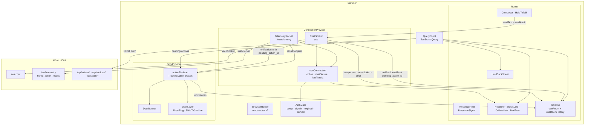

# Alfred Web Frontend

## Overview

The web frontend is the phone-first PWA client that replaced the Mission Control SPA
(icon rail, telemetry rail, data tables, shadcn component library — all removed in the
phase 1 rewrite). It is a single-page application built and served by the Alfred
channels process on port 8081.

It has **one screen** (the Room), **one interrupt** (the Door), and **four identity
gates** that rise over both. There is no navigation: a notification tap deep-links to
the approval it names, and everything else is one merged timeline.

Design source: `docs/design/2026-09-04-pwa-client-handoff/` (tokens, copy, and the
`Alfred.dc.html` prototype the presence field and the slide maths were ported from).
Spec: `docs/superpowers/specs/2026-09-04-mobile-first-pwa-client-design.md`.
Client-side working notes: `web/README.md`.

Phase 1 of six. The Workshop (Activity, Memory, Triggers, System), the service worker,
icons, Web Push and the desktop composition are later phases — see
"What phase 1 does not cover" at the end.

---

## Stack

| Concern | Tool | Version |
|---|---|---|
| Build | Vite | 8.x |
| Runtime | React | 19.x |
| Language | TypeScript | ~6.x |
| Styling | Tailwind CSS | v4.x (Vite plugin, `@theme inline`) |
| Data fetching | TanStack Query | 5.x |
| Routing | react-router-dom | 7.x |
| Testing | Vitest + Testing Library (jsdom) | Vitest 4.x, `@testing-library/react` 16.x, `jest-dom` 6.x |
| Lint | ESLint | 10.x |
| Fonts | DM Sans Variable (sans), Geist Mono (mono) |

No component library, no icon package, no markdown renderer, no toast library, no
command palette. The presence field is a `<canvas>`, the Door's fuse is a
`conic-gradient`, and slide-to-confirm is four pointer handlers and a keyboard path.

---

## Directory Map

```
web/
  index.html       # viewport-fit=cover, interactive-widget=resizes-content,
                   # one theme-color meta (applyTheme rewrites it), Apple standalone metas
  src/
    lib/           # No React: transport, formatters, physics, pure reducers
      api.ts             # api/post/put, ApiError{status,detail}; 401→expired, 403→denied
      auth-events.ts     # authEvents.on/emit — the emitter api() announces gates on
      auth.ts            # fetchAuthStatus, DEVICE_KEY, rememberDevice, deviceFootLine
      webauthn.ts        # registerPasskey(), loginPasskey(), sessionChannel()
      ws.ts              # ReconnectingSocket — backoff, code-4001 gate, ping keepalive
      chat-socket.ts     # ChatSocket over /ws (channel "web_pwa", timezone, session_id)
      telemetry-socket.ts# TelemetrySocket over /ws/telemetry (carried over unchanged)
      types.ts           # The shared type contract (hand-mirrors the bus/admin schemas)
      format.ts          # hhmm, dayMonth, dayLabel, mmss, usd, evs, shortId,
                         # humaniseTool, rawCall, notificationText
      theme.ts           # Theme, THEME_KEY, resolveInitialTheme, applyTheme, storedTheme
      viewport.ts        # installViewportVars, keyboardInset, useKeyboardOpen
      lifecycle.ts       # onVisible(fn) — the one visibilitychange subscription
      audio.ts           # One unlocked AudioContext: installAudioUnlock, playWavBase64
      recorder.ts        # pickMimeType (mp4→aac→default), Recorder, blobToDataUrl
      presence-signal.ts # PresenceSignal — the ported signal() envelopes
      headline.ts        # greetingFor, pickHeadline — the whole priority table, pure
      history.ts         # TimelineItem, fetchRoomHistory, toTimelineItems,
                         # sessionWindow, withDividers, SESSION_IDLE_MS
      actions.ts         # actionReducer, fuseRemaining, tombstoneItems, the three fetches
      slide.ts           # CONFIRM_RATIO, slideKnob, hintOpacity
    shell/         # Providers, and the two surfaces everything rises on
      QueryProvider.tsx      # QueryClient defaults
      ThemeProvider.tsx      # useTheme(); writes data-theme and the theme-color meta
      ThemeToggle.tsx        # 44x44 half-filled circle
      ConnectionProvider.tsx # Socket singletons, useConnection(), markTrue()
      presence.ts            # usePresence, useModalFocus, riseStyle, prefersReducedMotion
      Layer.tsx              # Portal + rise in/out + focus trap + inert + level
      Sheet.tsx              # Bottom sheet + scrim + explicit Done + Escape
    gates/         # Identity, over whatever is on screen
      AuthGate.tsx     # Which gate, over what
      Gate.tsx         # kicker / title / body / children / footer
      GateField.tsx    # 220px dot field, drifting slowly
      StepList.tsx     # 48px rows, 22px ring; progress and toggle variants
      SetupGate.tsx    # First run: passkey → home-service credentials → attention set
      SignInGate.tsx   # Passkey sign-in
      ExpiredGate.tsx  # 401
      DeniedGate.tsx   # 403
    room/          # The one screen
      Room.tsx           # Composes all of it
      PresenceField.tsx  # 393x190 canvas; the ported presence()
      Headline.tsx       # The page's one h1
      OfflineNote.tsx    # role="status", mounted always, filled only when not online
      DndRow.tsx         # Do-not-disturb + "{n} held ›"
      StatusLine.tsx     # The mono-12 status line: clock or last-true, cloud, reflex, rate
      Timeline.tsx       # The list and its scroll anchoring
      rows/              # Divider, YouBubble, AlfredRow, ActRow, Tombstone,
                         # TranscribingBubble, ThinkingRow, FirstDay
      Composer.tsx       # 50px field, send / hold slot, keyboard padding
      HoldToTalk.tsx     # Pointer hold, mic, caption, bars
      useOverview.ts     # ["overview"], 30s poll, isFirstRun(), sessionIdleMs()
      useRoomHistory.ts  # ["room-history"], read once, re-read on return
      useRoom.ts         # Live timeline state, the session window, send,
                         # unsent queue, no-reply timeout
    door/          # The approval interrupt
      DoorProvider.tsx  # useDoor(); the reducer's three feeds and the 1s tick
      DoorBanner.tsx    # The ink banner above the composer
      DoorLayer.tsx     # The full inverted layer
      FuseRing.tsx      # 34px and 168px conic ring
      SlideToConfirm.tsx# Slide with travel
      useActionRoute.ts # /actions/:id
    sheets/
      HeldBackSheet.tsx # ["deferred"] + drain
    test/
      setup.ts      # jsdom stubs: matchMedia, ResizeObserver, visualViewport, PointerEvent
      fixtures.ts   # Shared fixtures: overview, streams, deferred, pending actions
    index.css     # Tailwind import, fonts, tokens per [data-theme], @theme inline,
                  # the type scale, keyframes, safe areas, the fuse arc and its masks
    main.tsx      # installViewportVars() → installAudioUnlock() → createRoot
    App.tsx       # Providers and the three routes
```

Tests live beside their source (`lib/history.ts` → `lib/history.test.ts`). One test file
may cover a small family that ships together (`Layer.test.tsx` covers `Sheet`,
`Headline.test.tsx` covers `OfflineNote` and `DndRow`).

---

## Design Tokens

Two themes — dark and light — defined as CSS custom properties under
`:root[data-theme="dark"]` and `:root[data-theme="light"]` in `web/src/index.css`, and
registered into Tailwind via `@theme inline`. Nothing in the client uses a Tailwind
palette colour.

| Token | Meaning |
|---|---|
| `--bg` | The room itself |
| `--surface` | Raised paper: notes, bubbles, sheets |
| `--field` | Input fill |
| `--line` | Hairlines |
| `--keyboard` | The composer's own ground — a design-system token; no phase-1 component paints it |
| `--muted`, `--fg2`, `--fg` | The three text weights, quietest first |
| `--accent` | Alfred's warm signal — presence, focus, the fuse |
| `--green` | Applied / healthy |
| `--ink`, `--paper`, `--paper-muted` | The Door's inverted surface and its text |
| `--ring`, `--scrim` | Focus ring, and the dim behind a layer |
| `--ease-rise`, `--ease-settle`, `--ease-sink` | The three easing curves: rise in, settle, leave |
| `--app-height`, `--keyboard-inset` | Written by `installViewportVars()` (below) |

`ThemeProvider` writes `data-theme` on `<html>` and rewrites the single
`<meta name="theme-color">` so Safari's chrome matches. The choice is stored under
`alfred.theme`; with nothing stored, the clock picks (dark at night).

### Type scale

Type comes from the `.t-*` classes in `index.css`, never an ad-hoc size:
`.t-gate`, `.t-headline`, `.t-title`, `.t-alfred`, `.t-you`, `.t-body`, `.t-row`,
`.t-label`, `.t-meta`, `.t-fuse`, `.t-status` — and `.t-monogram`, defined for the
Workshop and used by nothing in phase 1. The sizes outside the scale are written as
explicit arbitrary values: 15px (body copy in the gates, sheets, composer and Door),
16px (the gates' buttons, the Door's title and pill), 13px (the offline, DND and banner
notes), 13.5px (the held-back sheet's note), 11px (the Door's mono labels), 11.5px (the
raw call) and 10.5px (the bubbles' stamps).

### The closed status vocabulary

System state is said in mono, lower case, and only in the words spec §10 closes:
`queued`, `applied`, `last true HH:MM`, `unknown since HH:MM`, `hot / cold`,
`candidate · active · dormant · archived`, `expired · not done`,
`takes effect within 60 s`. Phase 1 uses the first three and `expired · not done`; the
rest are the Workshop's and arrive with it. The one exception to mono-and-lower-case is
the Door's phase pill (`Confirmed · queued`, `Applied`, `Expired`, `Answered`), set in
the inverted layer's own type. Do not invent new words — the vocabulary is the contract
the spec's honesty rules (§5.2) are written against.

---

## The gates

`AuthGate` reads `GET /api/auth/status` (`["auth-status"]`) and decides what rises:

| Condition | Gate | Over |
|---|---|---|
| `registered: false` | `SetupGate` — passkey → home-service credentials → attention set | Nothing yet |
| `registered: true, authenticated: false` | `SignInGate` — passkey | Nothing yet |
| `authEvents` emitted `expired` (any HTTP 401) | `ExpiredGate` | The last-known Room |
| `authEvents` emitted `denied` (any HTTP 403) | `DeniedGate` | The last-known Room |

**401 and 403 never redirect.** `api()` emits on `authEvents` (`lib/auth-events.ts`) and
the gate rises *over* whatever is on screen, so a lapsed session never blanks the state
the user was looking at (spec §5.2). A rejected passkey assertion is a 401 too, and is
excluded: `/api/auth/login/*` and `/api/auth/register/*` show the failure in the gate
that asked rather than raising a second one.

The session TTL is 8 hours, a hard cap from login with no sliding renewal, and the
Expired gate says so.

The copy region inside `Gate` scrolls: the shell is a fixed height (constraint §4.4), so
an inner `mt-auto` column keeps short copy bottom-aligned while setup's tall credential
step scrolls instead of clipping.

---

## The Room

Everything on screen is one timeline.

- **Presence field** — a 393x190 `<canvas>` driven by `PresenceSignal`: the microphone
  while you hold the button, a thinking envelope while Alfred is working, and a still
  frame under `prefers-reduced-motion`.
- **Headline** — the page's one `<h1>`. `pickHeadline()` is a pure priority table:
  offline and reconnecting outrank everything (an unreachable house must not say
  "Good morning, sir."), then holding, then busy, then DND, then the first-day greeting.
- **Status line and offline note** — the vitals, and `last true HH:MM` whenever the
  socket is not online. The note's `role="status"` region stays mounted and empty while
  online: VoiceOver can miss a live region inserted with its text already in it.
- **Timeline** — `useRoomHistory` reads four stream pages once
  (`user_requests`, `user_responses`, `reflex_observations` with an `action`, and
  `notifications` without a `pending_action_id`) and `toTimelineItems` merges them by
  timestamp. `sessionWindow` then keeps **the current session** — the turns since the
  last silence of the session idle timeout (satellite turns included; they land on the
  same two streams) — plus the house's own rows for the day, or from the session's start
  if that came earlier. That window is conversational continuity across every channel,
  not a claim about what Alfred still has in context: which server session a turn belongs
  to is `chat-socket.ts`'s business ("Sessions" below), and that id can turn over inside
  one window. `useRoom` merges
  the result with the live rows (what you sent, what Alfred said, what he did while you
  watched) and the Door's tombstones, neither of which is ever windowed. After a break
  the Room opens on the day's house rows alone — on nothing at all when there are none;
  older turns are the Activity view's (phase 2). Row text comes from `notificationText`
  ("WebSocket Protocols" below).
- **Composer and hold-to-talk** — text queues under `alfred.unsent` while the house is
  unreachable and retries in order on the next socket open; holding records through
  `MediaRecorder` with a one-second floor.
- **Held-back sheet** — the DND row's `{n} held ›` opens `["deferred"]` and can drain it.

Nothing in the Room polls except the overview (30 s). The telemetry socket starts at `$`
and replays nothing, so `ConnectionProvider` invalidates `["overview"]`,
`["room-history"]`, `["pending-actions"]` and `["deferred"]` on `visibilitychange` —
that is what makes a suspended PWA correct on return (constraint §4.10).

---

## The Door

A critical action needing approval. It is tracked by `actionReducer` over
`TrackedAction[]`, fed from three independent places so it survives a cold launch, a
notification tap and a suspended app:

1. `GET /api/actions/pending` (`["pending-actions"]`) — the cold-launch read.
2. A `/ws` `notification` frame carrying `metadata.pending_action_id`.
3. The `home_action_results` telemetry stream.

Phases: `pending` → `queued` → `applied`, plus `expired` and `answered`.

**A 200 from `POST /api/actions/{request_id}/confirm` means queued, never applied** —
the endpoint republishes the action and returns before anything runs. `applied` comes
only from `home_action_results`. A 404 on confirm means the approval was already
consumed: the phase becomes `answered`.

Confirmation is a slide with travel (`CONFIRM_RATIO = 0.85`), never a tap; iOS gives the
client no haptics, so the resistance is the confirmation. An approval that lapses leaves
a struck-through tombstone in the thread. `/actions/:id` renders the same Room with the
Door open over it — `useActionRoute` reads the action once and tells the Door when the
deep link finds one already gone.

---

## Routes

| Path | Element | Notes |
|---|---|---|
| `/` | `Room` | The one screen |
| `/actions/:id` | `Room` | Same screen; `useActionRoute` opens the Door over it (spec §6.3) |
| `*` | `<Navigate to="/" replace>` | There is nowhere else |

Provider order in `App.tsx` is load-bearing:
`QueryProvider → ThemeProvider → ConnectionProvider → BrowserRouter → AuthGate →
DoorProvider → Routes`. `DoorProvider` sits inside `AuthGate` so nothing reads
`/api/actions/pending` before there is a session to read it with.

### Client state keys

| Kind | Keys |
|---|---|
| TanStack Query | `["auth-status"]`, `["overview"]`, `["integrations"]`, `["attention"]`, `["room-history"]`, `["deferred"]`, `["pending-actions"]` |
| `localStorage` | `alfred.theme`, `alfred.device`, `alfred.unsent`, `alfred.session`, `alfred.session-at` — every key is `alfred.<noun>`, `alfred.session-at` the one compound noun |

---

## WebSocket Protocols

### Chat (`/ws`)

Used by `ChatSocket` (`lib/chat-socket.ts`).

#### Client → Server

```json
{"type": "text",  "content": "<message>", "channel": "web_pwa", "timezone": "<IANA>", "session_id": "<id>"}
{"type": "audio", "content": "<base64-audio-data-url>", "channel": "web_pwa", "timezone": "<IANA>", "session_id": "<id>"}
{"type": "ping"}
```

`session_id` rides the connection's first text or audio frame — `payload()` in
`chat-socket.ts` is shared by both — and only when the client holds an id the server does
not already have. **Sessions** below has the rules.

`ping` is a keepalive (Cloudflare drops proxied sockets idle ~100s); the server answers
`{"type": "pong"}` and does nothing else — in particular a ping does not count as the
first message, so `session_id` restore still works after any number of them. The pong is
answered on the same serial receive loop as chat turns, so it can lag a full
conscious-engine turn (`publish_and_wait` timeout 60s) — pong latency is not a liveness
signal. `ReconnectingSocket` sends these on a 30s interval and tracks `lastMessageAt`, so
unlike the outgoing SPA this client does keep an idle socket open through a proxy.

The audio data URL is whatever `pickMimeType()` negotiated — `audio/mp4`, then
`audio/aac`, then the browser default. Safari has no WebM and throws from the
`MediaRecorder` constructor if you ask for it.

A frame that is malformed JSON, valid JSON but not an object (`[]`, `"str"`, `1`), or
binary rather than text, is refused with
`{"type": "error", "text": "Expected a JSON object", "session_id": "<id>"}` and the
connection stays open.

#### Sessions

The server assigns an id per connection and pushes it in a `session` frame before the
client has said anything (`core/channels/web_server.py`); a client holding no id of its
own adopts that one. `alfred.session` holds the id, and `alfred.session-at` an ISO stamp
that only a send writes; `adopt` and `forget` are the id's only writers, and `forget`
takes the stamp with it, so an id adopted but never sent on carries no stamp at all.

The first message of a connection decides which session the turn belongs to. A stored id
whose stamp has been idle for the timeout or longer is let go, stamp and all, and this
connection's assigned id takes its place; a missing or unreadable stamp counts as idle,
so a phone from before the stamp existed gets one fresh session. What survives is sent as
`session_id` only if the server does not already have it — when the two agree the frame
says nothing, because the server named that id itself. Only a send the socket actually
took commits anything: one it refused spends neither the connection's one chance to carry
`session_id` nor a record of activity the server never saw. After that first frame,
`session_id` is omitted until the next open.

The timeout is the server's own rather than a client constant:
`Overview.session.idle_minutes` → `sessionIdleMs()` (`room/useOverview.ts`) →
`chat.setIdleMs()` in a `Room` effect, with `SESSION_IDLE_MS` (30 min, `lib/history.ts`)
standing in until the overview answers. It is the same boundary the Room windows its
timeline on, so the thread and the id turn over together.

The server locks the id after the first message (`session_locked`), so a session that
idles out mid-connection cannot rotate until the socket next reopens — which on iOS it
does, every time the app is backgrounded long enough.

#### Server → Client (`ChatServerMessage`)

```ts
| { type: "session";       session_id: string }
| { type: "transcription"; text: string; session_id: string }
| { type: "response";      text: string; audio?: string; session_id: string;
                            actions_taken?: string[]; mood?: Mood }
| { type: "notification";  title: string; body: string; urgency: Urgency;
                            notification_id: string; audio?: string;
                            metadata?: Record<string, unknown> }
| { type: "error";         text: string; session_id?: string }
| { type: "pong" }
```

- `response.actions_taken` — tool names the Conscious Engine executed; the Alfred row's
  meta reads them.
- `response.mood` — affective tone label. An `error` frame has neither, and says
  `error · HH:MM` rather than inventing a mood.
- `response.audio` — base64 WAV data URL, played through the one unlocked `AudioContext`.
- `notification.metadata.pending_action_id`, when present, routes the frame to the Door
  instead of the thread. The frame carries no `source`, so a live act row reads
  `HH:MM · live · {urgency}`; the same notification re-read from the stream later shows
  its real source. The row's text is the body, else the title — a title is often a bare
  label such as "Routine Suggestion" — from `notificationText` (`lib/format.ts`), which
  the live row, the history row and the held-back sheet all share so a live row and its
  history copy still pair on the read-back.
- `pong` is swallowed in `ChatSocket` and never reaches listeners.

#### Reconnect / backoff / 4001

`ReconnectingSocket` (`lib/ws.ts`) handles reconnection automatically:

- Initial connect: emits `"connecting"` status.
- On successful open: resets attempt counter, emits `"online"`.
- On close with code **4001**: emits `"unauthorized"` and stops — no retry. The socket is
  reopened by `ConnectionProvider` after a successful sign-in, not by a backoff timer.
- On other close: exponential backoff starting at 500ms, doubling per attempt, capped
  at 8 seconds. Emits `"reconnecting"` for the first two failures and `"offline"` from
  the third (`OFFLINE_AFTER_ATTEMPTS`), or at once while `navigator.onLine` is false —
  and keeps retrying either way; the next open makes it `"online"` again. The Room
  says `Reconnecting…` for the one and `Unreachable.` for the other.
- `ChatSocket.onopen` clears `firstMessageSent` and the previous connection's assigned
  id, so a live stored id is offered again on the next connection. `ws.ts` calls
  `onopen()` **before** `onstatus("online")` on purpose: `useRoom` flushes the unsent
  queue on that status, and a flush that ran first would send the new connection's first
  message with the old connection's state behind it.

### Telemetry (`/ws/telemetry`)

Used by `TelemetrySocket` (`lib/telemetry-socket.ts`). Provides a live push of Redis
stream entries. Phase 1 subscribes to exactly one stream, `home_action_results` — it is
what turns a queued approval into an applied one.

#### Client → Server

```json
{"type": "subscribe", "streams": ["home_action_results"]}
{"type": "ping"}
```

The server also takes `{"type": "unsubscribe", "streams": [...]}`; `TelemetrySocket` has
no method for it, because phase 1 never lets a subscription go.

`ping` is the same keepalive as on `/ws`: answered with `{"type": "pong"}`, and it emits
no `subscribed` ack and leaves the subscription set untouched.

On reconnect, all current subscriptions are re-sent automatically (`onopen` replays
`this.subscriptions`). `TelemetrySocket.subscribe()` persists the set so reconnects
restore state without consumer involvement. Subscriptions start at `$`: nothing that
happened while the app was suspended is replayed, which is why the query keys above are
invalidated on return instead.

#### Server → Client (`TelemetryMessage`)

```ts
| { type: "subscribed"; streams: string[] }
| { type: "entry"; stream: string; id: string; event: Record<string, unknown> }
| { type: "status"; detail: string }
| { type: "error"; message: string }
| { type: "pong" }
```

- `subscribed` — full current subscription set, sent after every subscribe/unsubscribe.
- `entry` — one per new Redis stream entry; `event` is the deserialized payload
  (not a raw JSON string).
- `status` — transient pump error (`detail: "redis_error"`); connection stays alive, pump
  retries after 1s backoff.
- `error` — a frame the server could not read (`message: "invalid JSON"`). Note the field
  is `message` here and `text` on `/ws`.

`ConnectionProvider` puts `status` and `error` on the console (`console.warn`), the same
complaint at most once a minute (`WARN_EVERY_MS` — the pump repeats `redis_error` every
second for the whole of an outage); nothing on screen shows them until the Workshop's
health page (phase 3).

---

## Data Flow


```mermaid
graph TD
    subgraph Browser
        QC[QueryClient<br/>TanStack Query]
        Router[BrowserRouter<br/>react-router v7]

        subgraph ConnectionProvider
            ChatSock[ChatSocket<br/>/ws]
            TelSock[TelemetrySocket<br/>/ws/telemetry]
            Conn[useConnection<br/>online · chatStatus · lastTrueAt]
        end

        AuthGate[AuthGate<br/>setup · sign-in · expired · denied]

        subgraph Room
            Presence[PresenceField<br/>PresenceSignal]
            Head[Headline · StatusLine · OfflineNote · DndRow]
            TL[Timeline<br/>useRoom + useRoomHistory]
            Comp[Composer · HoldToTalk]
            Sheet[HeldBackSheet]
        end

        subgraph DoorProvider
            Reducer[actionReducer<br/>TrackedAction phases]
            Banner[DoorBanner]
            Layer[DoorLayer<br/>FuseRing · SlideToConfirm]
        end
    end

    subgraph "Alfred :8081"
        WS_CHAT["/ws chat"]
        WS_TEL["/ws/telemetry<br/>home_action_results"]
        REST["/api/admin/* · /api/actions/* · /api/auth/*"]
    end

    ChatSock -->|WebSocket| WS_CHAT
    TelSock  -->|WebSocket| WS_TEL
    QC       -->|REST fetch| REST

    ChatSock --> Conn
    TelSock  --> Conn
    Conn --> Head
    Conn --> AuthGate

    ChatSock -->|response · transcription · error| TL
    ChatSock -->|notification without pending_action_id| TL
    ChatSock -->|notification with pending_action_id| Reducer
    TelSock  -->|result: applied| Reducer
    QC       -->|pending-actions| Reducer

    QC --> Head
    QC --> TL
    QC --> Sheet
    Reducer --> Banner
    Reducer --> Layer
    Reducer -->|tombstones| TL
    Comp -->|sendText · sendAudio| ChatSock
```

---

## iOS constraints

Spec §4 lists twelve. The automated half lives in `web/src`
(`index-html.test.ts` for the metas, `viewport.test.ts` and `Composer.test.tsx` for
`--app-height` / `--keyboard-inset`, `audio.test.ts` for the single unlocked context,
`recorder.test.ts` for codec negotiation, `lifecycle.test.ts` and
`ConnectionProvider.test.tsx` for rehydration, `Layer.test.tsx` and `DoorLayer.test.tsx`
for explicit dismissal, `PresenceField.test.tsx` for reduce-motion). The half that needs
a real phone is `docs/superpowers/qa/2026-09-07-pwa-phase1-ios-checklist.md`.

Two of them bite hardest:

- **`100vh` is wrong in Safari.** `installViewportVars()` writes `--app-height` from
  `innerHeight` and `--keyboard-inset` from `visualViewport`. `#root` takes `--app-height`
  as `height` — not `min-height` — with `overflow: hidden`, so the shell *is* the viewport
  and nothing scrolls but the regions that opt in: the Timeline, the Sheet body, the
  gate's copy region. A root that can grow scrolls the document instead, carrying the
  header and composer off-screen and leaving the Timeline's follow-the-bottom anchor
  nothing to scroll. The composer pays for the keyboard once, via `.pb-keyboard`.
- **Audio needs a gesture.** `installAudioUnlock()` runs in `main.tsx`, before the first
  tap. iOS will not retroactively allow a sound requested before a gesture resumed a
  context, so a fresh `new Audio()` is silently dropped.

---

## Dev Workflow

```bash
cd web
npm install           # first time
npm run dev           # Vite dev server, HMR, proxies /api + /health + /ws* → localhost:8081
npm run lint          # ESLint
npm test              # Vitest (jsdom)
npm run build         # tsc -b && vite build → web/dist/
npm run preview       # serve web/dist/ locally
```

The type check lives in `build` (`tsc -b`), not in `lint`. CI runs `lint`, `test` and
`build`, in that order, then serves the built `dist/` to
`tests/core/channels/test_spa_ci.py`.

The Vite proxy routes all `/api/*`, `/health` (backend healthcheck), and `/ws*` requests
to `http://localhost:8081` (or `ws://localhost:8081` for WebSocket upgrades) during
development. No CORS configuration is required — all traffic appears to come from the
same origin.

Alfred must be running (`uv run python -m runner`) before `npm run dev` is useful.

---

## Build / Serve / Container

### Production build

```bash
cd web && npm run build   # outputs to web/dist/
```

### Serving (Python side)

`core/channels/web_server.py` calls `mount_spa(app, _SPA_DIST)` at startup if
`web/dist/` exists. The `mount_spa` function (`core/channels/spa.py`):

1. Mounts `web/dist/assets/` at `/assets` via FastAPI `StaticFiles`.
2. Adds a catch-all `GET /{full_path:path}` handler that:
   - Returns the file at `web/dist/{full_path}` if it exists and is within `dist/`
     (path containment check: `candidate.is_relative_to(dist.resolve())`).
   - Falls back to `web/dist/index.html` for all other paths — which is what makes
     `/actions/{id}` load from a cold notification tap.
   - **Except** `api/*`, `ws*` and `health` (`_NON_SPA_PREFIXES` / `_NON_SPA_PATHS`),
     which raise a real 404. A REST or WebSocket client hitting a renamed endpoint —
     the iOS AlfredKit client, say — must get a 404, not 200 and a page of HTML.

If `web/dist/` is absent (dev mode), `mount_spa` is a no-op — the dev Vite server handles
the SPA.

### Container (Containerfile)

The `Containerfile` has a dedicated build stage:

```dockerfile
FROM node:22-slim AS webbuild
WORKDIR /web
COPY alfred/web/package.json alfred/web/package-lock.json ./
RUN npm ci
COPY alfred/web/ ./
RUN npm run build

# In the main stage:
COPY --from=webbuild /web/dist /app/web/dist
```

(The build context is the directory *above* the checkout — hence `alfred/web/`.)

The `webbuild` stage produces `web/dist/`; the main stage copies only the compiled
output. Node.js is not present in the production image.

Hashed asset filenames (e.g. `/assets/index-Bx3kYp9z.js`) are generated by Vite for
cache busting. `SpaCacheMiddleware` (`core/channels/spa.py`) turns that into a
three-tier `Cache-Control` policy over everything outside `/api/`, which is left
untouched:

| Response | Header | Why |
| --- | --- | --- |
| `/assets/*`, status < 400 | `public, max-age=31536000, immutable` | Content-hashed, so the bytes behind a URL never change. Errors are excluded — a pinned 404 has no URL to bust it. |
| `text/html` | `no-cache, no-store, must-revalidate` | `index.html` and every SPA-fallback route: never stored, so a deploy is picked up on the next load. |
| everything else | `no-cache, must-revalidate` | Unhashed `web/public/` files (`/icon.svg`, `/manifest.json`): revalidated on every load. |

Tier 3 does not save bandwidth today. `mount_spa`'s fallback serves those files through a
bare `FileResponse`, which ignores `If-None-Match`/`If-Modified-Since` — only
`StaticFiles.get_response` honours conditional requests — so a revalidation returns 200
with the full body, not a 304. `no-cache, must-revalidate` is still the correct header:
it is what a caching proxy in front of Alfred needs, and the 304 arrives for free if the
fallback ever grows conditional handling.

---

## What phase 1 does not cover

- **The Workshop** (Activity, Memory, Triggers, System) — phases 2 and 3. There is no
  handle, no `why?` button and no causal thread yet.
- **Install, standalone and Reach gates, the service worker, icons and Web Push** —
  phases 4 and 5. `web/public/manifest.json` ships SVG only and carries the phase-1
  palette's dark ground; it cannot follow the theme the way `applyTheme` rewrites the
  `theme-color` meta, so a light-hour install gets a dark splash until phase 4 says
  otherwise.
- **Desktop** — phase 6. The client is phone-first and there is no wide composition.

Open follow-ups: `docs/backlog/low/pwa-phase1-followups.md`.
