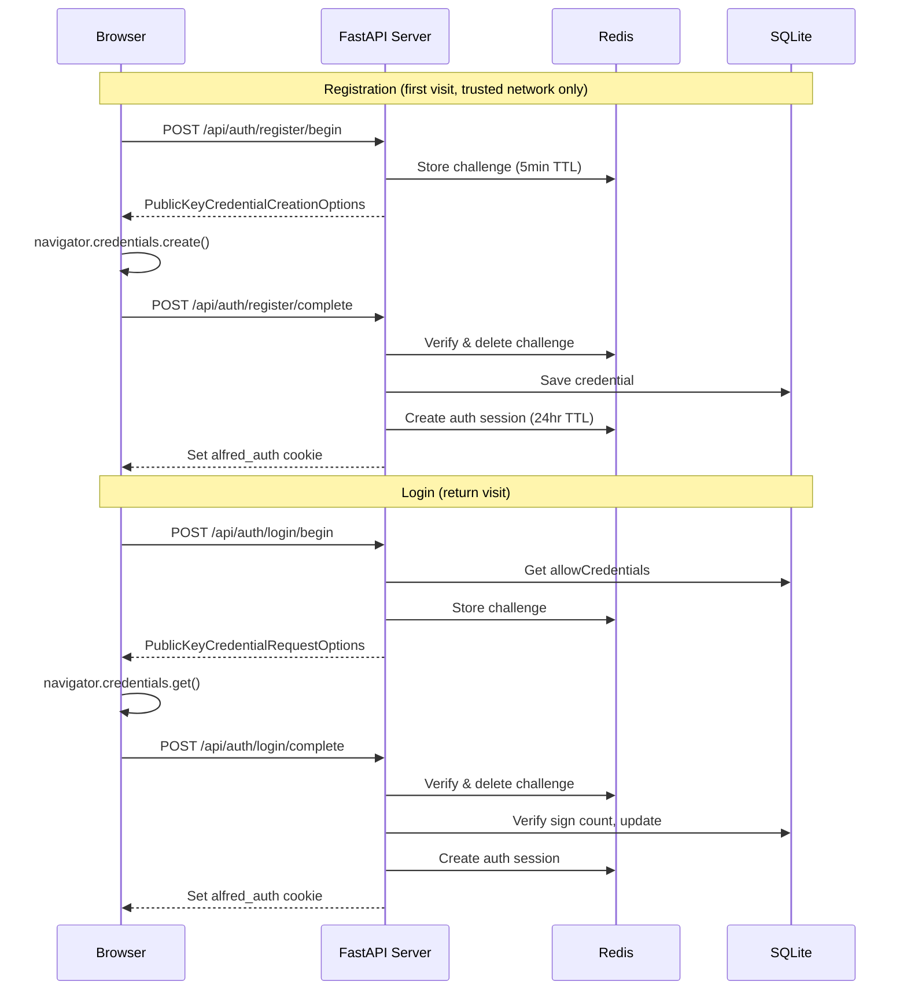

# WebAuthn Authentication

Passkey-based authentication for Alfred's web PWA.

## Architecture

## Key Components

| Component | File | Purpose |
|-----------|------|---------|
| CredentialStore | `core/identity/credentials.py` | SQLite CRUD for WebAuthn credentials |
| Auth Routes | `core/identity/auth_routes.py` | 6 REST endpoints for registration/login/logout |
| Auth Middleware | `core/identity/auth_middleware.py` | Cookie validation on every request |
| Frontend Auth | `web/auth.js` | Client-side WebAuthn ceremonies + Conditional UI |

## Data Stores

- **Credentials:** SQLite at `data/credentials.db` -- credential ID, public key, sign count, device name
- **Auth Sessions:** Redis at `alfred:auth:{session_id}` -- 24hr TTL
- **Challenges:** Redis at `alfred:webauthn:challenge:{id}` -- 5min TTL, one-time use

## Security Properties

- Registration requires Tailscale trusted network
- Cookies: HttpOnly, SameSite=Strict, Secure (HTTPS)
- Challenges: one-time use, 5min expiry
- Sign count verification on each login (clone detection)
- Hard gate: unauthenticated WebSocket connections are rejected (code 4001)

## Frontend Flow

1. Page load -> `GET /api/auth/status`
2. Not registered -> onboarding (step 0 = WebAuthn registration)
3. Registered but not authenticated -> login screen with Conditional UI
4. Authenticated -> chat interface
