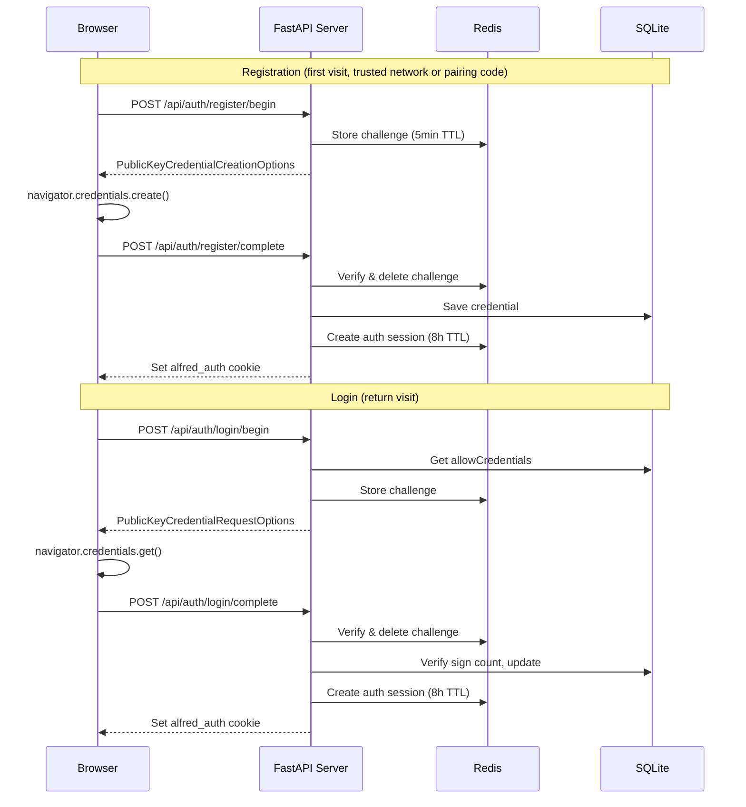

# WebAuthn Authentication

Passkey-based authentication for Alfred's web PWA.

## Architecture

```mermaid
sequenceDiagram
    participant B as Browser
    participant S as FastAPI Server
    participant R as Redis
    participant DB as SQLite

    Note over B,DB: Registration (first visit, trusted network or pairing code)
    B->>S: POST /api/auth/register/begin
    S->>R: Store challenge (5min TTL)
    S-->>B: PublicKeyCredentialCreationOptions
    B->>B: navigator.credentials.create()
    B->>S: POST /api/auth/register/complete
    S->>R: Verify & delete challenge
    S->>DB: Save credential
    S->>R: Create auth session (8h TTL)
    S-->>B: Set alfred_auth cookie

    Note over B,DB: Login (return visit)
    B->>S: POST /api/auth/login/begin
    S->>DB: Get allowCredentials
    S->>R: Store challenge
    S-->>B: PublicKeyCredentialRequestOptions
    B->>B: navigator.credentials.get()
    B->>S: POST /api/auth/login/complete
    S->>R: Verify & delete challenge
    S->>DB: Verify sign count, update
    S->>R: Create auth session (8h TTL)
    S-->>B: Set alfred_auth cookie
```

## Key Components

| Component | File | Purpose |
|-----------|------|---------|
| CredentialStore | `core/identity/credentials.py` | SQLite CRUD for WebAuthn credentials |
| Auth Routes | `core/identity/auth_routes.py` | 11 REST endpoints: registration/login/logout, sessions, passkeys, pairing |
| Auth Middleware | `core/identity/auth_middleware.py` | Cookie validation on every request |
| Frontend Auth | `web/src/lib/webauthn.ts` | Client-side WebAuthn ceremonies + Conditional UI |

## Data Stores

- **Credentials:** SQLite at `data/credentials.db` -- credential ID, public key, sign count, device name
- **Auth Sessions:** Redis at `alfred:auth:{session_id}` -- 8h TTL, a hard cap from
  login: the cookie's `max_age` and the Redis key's TTL are both set once at
  register/login-complete and never renewed, so activity does not extend a session
- **Challenges:** Redis at `alfred:webauthn:challenge:{id}` -- 5min TTL, one-time use
- **Pairing code:** Redis at `alfred:webauthn:pairing` -- 5min TTL, single-use; wrong
  guesses are counted in `alfred:webauthn:pairing:fails` and burn the code at 10

## Security Properties

- Registration requires a trusted network (`require_trusted_network`) **or** a valid
  `X-Pairing-Code` header on both `register/begin` and `register/complete`. The other
  credential-minting endpoints (credential writes, `POST`/`DELETE
  /api/devices/register`, `POST /api/voice/enroll`) take the network gate *and* the
  session; see [`admin-api.md` → Auth Model](admin-api.md#auth-model). Admin reads and
  controls — and session/passkey management — need only the session
- Pairing codes are minted only by an authenticated session, live 5 minutes, are consumed
  the moment the new passkey is saved, and are burned after 10 wrong guesses
- The last passkey can never be deleted (409), so the account cannot lock itself out
- **The RP ID is the request's `Host`.** Passkeys are bound to the hostname Alfred is
  served from — behind a public proxy that is the public hostname, which must therefore
  never change once passkeys exist
- Cookies: HttpOnly, SameSite=Strict, Secure (HTTPS — including behind a trusted proxy
  that sends `X-Forwarded-Proto`, see `FORWARDED_ALLOW_IPS`)
- Sessions expire 8h after login with no sliding renewal — a phone re-auths with Face ID
- Challenges: one-time use, 5min expiry
- Sign count verification on each login (clone detection)
- Hard gate: unauthenticated WebSocket connections are rejected (code 4001)

## Sessions, passkeys and pairing

Every session hash (`alfred:auth:{session_id}`) records `authenticated`, `credential_id`,
`created_at`, `ip`, `user_agent` (truncated to 200 characters) and `channel` -- `web`,
`pwa` or `ios`, sent by the client as `_channel` in the `*/complete` body; any other
value, or none, is stored as `web`. `ip` is the peer the request arrived from as the
process sees it, so it is the real client only where uvicorn has already rewritten the
peer from `X-Forwarded-For` (`FORWARDED_ALLOW_IPS`) -- an untrusted caller cannot name
its own address.

| Method   | Path                                    | Auth    | Purpose |
|----------|-----------------------------------------|---------|---------|
| `GET`    | `/api/auth/sessions`                    | session | Every live session, newest first; `current: true` marks the caller's and `expires_in` counts the seconds left (never negative) |
| `DELETE` | `/api/auth/sessions/{session_id}`       | session | End one session -> `{"deleted": bool}`; clears the cookie when it is your own |
| `POST`   | `/api/auth/logout?all=1`                | cookie  | End every session; without `all` only the caller's |
| `GET`    | `/api/auth/credentials`                 | session | Registered passkeys: `credential_id`, `device_name`, `transports`, `created_at`, `last_used_at`, `current` -- never the public key or the sign count |
| `DELETE` | `/api/auth/credentials/{credential_id}` | session | Remove a passkey and end its sessions -> `{"deleted": true, "sessions_ended": N}`; 409 if it is the last one |
| `POST`   | `/api/auth/pairing`                     | session | Mint a 6-digit pairing code: `{"code", "expires_at", "ttl_seconds": 300}` |

**Ending sessions.** `DELETE /api/auth/sessions/{session_id}` refuses an id outside
`[A-Za-z0-9_-]{1,128}` with **400** `Invalid session id`, before Redis or the log line
sees it. On `POST /api/auth/logout` the `all` parameter is read as a *flag* -- `1`,
`true` or `yes`, case-insensitively -- so `?all=on` and a bare `?all` end only the
caller's own session rather than 422ing a client that cannot then log out at all. The
caller's own key is deleted first, before the sweep, so the cookie cleared on the way out
never names a live session; the cookie is cleared even when the answer is 503.

**Removing a passkey.** `DELETE /api/auth/credentials/{credential_id}` refuses an id that
is not unpadded base64url of at most 1364 characters (CTAP2's 1023-byte credential-id
ceiling, encoded) with **400** `Invalid credential id`, an unknown id with **404**
`Passkey not found`, and the last remaining passkey with **409**
`Cannot remove the last passkey — register another first`. The last-passkey rule is a
condition inside the `DELETE` statement (`CredentialStore.delete_credential`), not a
read-then-delete, so two concurrent removals of *different* passkeys cannot both pass and
lock the house out; the loser gets the same 409 after its sessions are already gone. That
ordering is deliberate: the passkey's sessions are ended **before** the credential row is
deleted, so a failure between the two leaves a passkey with fewer sessions rather than a
live session for a passkey that no longer exists. If the caller's own session was among
those ended, the cookie is cleared -- including on the 503 path, so the PWA is never left
holding a session id that has already been deleted.

Note the gate: removing a passkey needs **only the session**, unlike
`DELETE /api/integrations/{name}/credentials` and `POST`/`DELETE /api/devices/register`,
which also require a trusted network. Removal neither mints nor widens a credential, so
the rule that reserves the network gate does not reach it.

**Outages.** Every failure in this router answers **503**
`{"detail": "Session store unavailable"}` -- one vocabulary, so a client branches once.
That includes the credential store behind `GET /api/auth/credentials` and the passkey
delete: the wording names the router, not the store that failed.

**Pairing a new phone.** The signed-in device calls `POST /api/auth/pairing` and shows the
code; the new device sends it as `X-Pairing-Code` on `register/begin` **and**
`register/complete`, from any network. Minting overwrites any code already active and
resets the guess counter, and the route is session-gated *only* -- deliberately, because
the device doing the minting is usually the one that is away. What stands in for the
network half is the code's own budget: five minutes and ten guesses.

- An absent, empty or all-whitespace header is treated as no header at all and falls
  through to the trusted-network gate (a PWA fetch spells the optional header
  `code ?? ""`, and 403ing that would lock the LAN flow out of registration).
- A malformed non-empty header -- anything but exactly six ASCII digits -- is **403**
  `Invalid or expired pairing code` without being counted; it could never equal a minted
  code.
- Well-formed wrong guesses are counted only while a code is actually live, and the tenth
  burns it. A guess after the burn is another 403 and does not burn anything twice.
- The code is consumed once the new passkey is saved. A consume that fails is logged and
  the registration stands -- telling a device that is registered that it is not would
  leave it unable to retry the ceremony.
- Ten wrong guesses from off-LAN will burn a code someone is waiting on. That is an
  accepted trade: the alternative to a capped code is a guessable one, and recovery is
  minting another.

## Frontend Flow

1. Page load -> `GET /api/auth/status`
2. Not registered -> onboarding (step 0 = WebAuthn registration)
3. Registered but not authenticated -> login screen with Conditional UI
4. Authenticated -> chat interface
