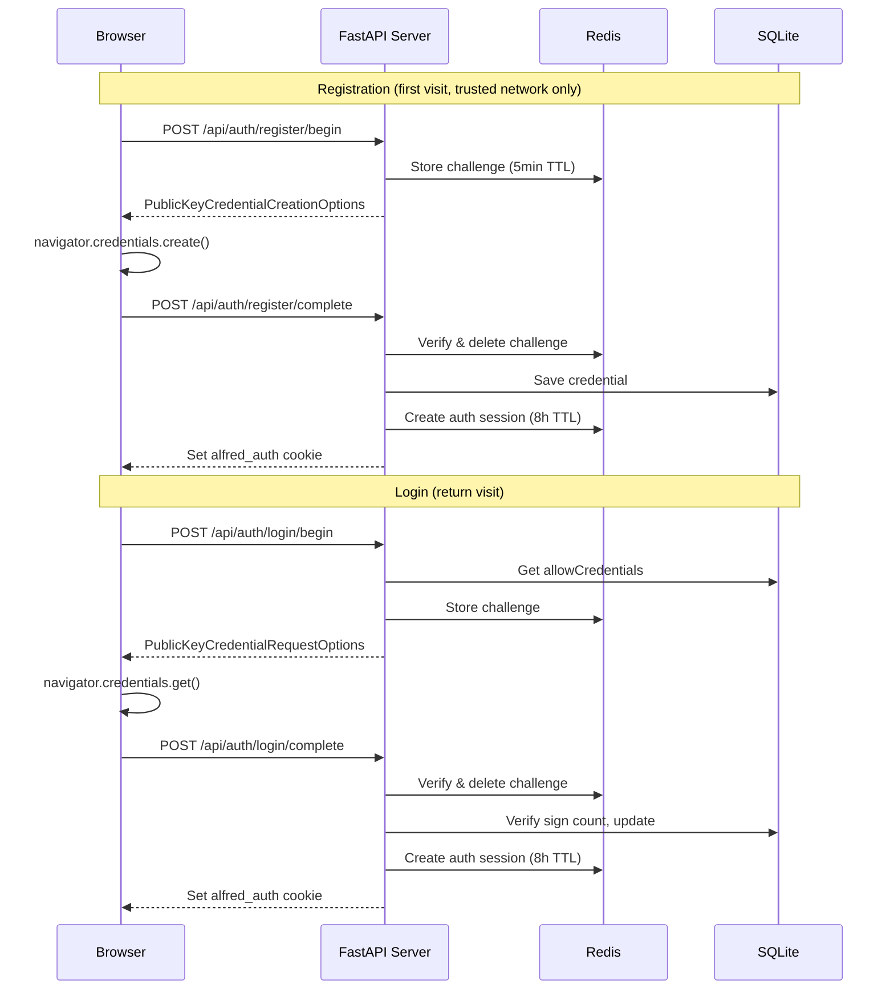

# WebAuthn Authentication

Passkey-based authentication for Alfred's web PWA.

## Architecture

```mermaid
sequenceDiagram
    participant B as Browser
    participant S as FastAPI Server
    participant R as Redis
    participant DB as SQLite

    Note over B,DB: Registration (first visit, trusted network only)
    B->>S: POST /api/auth/register/begin
    S->>R: Store challenge (5min TTL)
    S-->>B: PublicKeyCredentialCreationOptions
    B->>B: navigator.credentials.create()
    B->>S: POST /api/auth/register/complete
    S->>R: Verify & delete challenge
    S->>DB: Save credential
    S->>R: Create auth session (8h TTL)
    S-->>B: Set alfred_auth cookie

    Note over B,DB: Login (return visit)
    B->>S: POST /api/auth/login/begin
    S->>DB: Get allowCredentials
    S->>R: Store challenge
    S-->>B: PublicKeyCredentialRequestOptions
    B->>B: navigator.credentials.get()
    B->>S: POST /api/auth/login/complete
    S->>R: Verify & delete challenge
    S->>DB: Verify sign count, update
    S->>R: Create auth session (8h TTL)
    S-->>B: Set alfred_auth cookie
```

## Key Components

| Component | File | Purpose |
|-----------|------|---------|
| CredentialStore | `core/identity/credentials.py` | SQLite CRUD for WebAuthn credentials |
| Auth Routes | `core/identity/auth_routes.py` | 6 REST endpoints for registration/login/logout |
| Auth Middleware | `core/identity/auth_middleware.py` | Cookie validation on every request |
| Frontend Auth | `web/src/lib/webauthn.ts` | Client-side WebAuthn ceremonies + Conditional UI |

## Data Stores

- **Credentials:** SQLite at `data/credentials.db` -- credential ID, public key, sign count, device name
- **Auth Sessions:** Redis at `alfred:auth:{session_id}` -- 8h TTL, a hard cap from
  login: the cookie's `max_age` and the Redis key's TTL are both set once at
  register/login-complete and never renewed, so activity does not extend a session
- **Challenges:** Redis at `alfred:webauthn:challenge:{id}` -- 5min TTL, one-time use

## Security Properties

- Registration requires a trusted network (`require_trusted_network`) — as do the other
  credential-minting endpoints (credential writes, `POST`/`DELETE
  /api/devices/register`, `POST /api/voice/enroll`); see
  [`admin-api.md` → Auth Model](admin-api.md#auth-model). Admin reads and controls need
  only the session
- **The RP ID is the request's `Host`.** Passkeys are bound to the hostname Alfred is
  served from — behind a public proxy that is the public hostname, which must therefore
  never change once passkeys exist
- Cookies: HttpOnly, SameSite=Strict, Secure (HTTPS — including behind a trusted proxy
  that sends `X-Forwarded-Proto`, see `FORWARDED_ALLOW_IPS`)
- Sessions expire 8h after login with no sliding renewal — a phone re-auths with Face ID
- Challenges: one-time use, 5min expiry
- Sign count verification on each login (clone detection)
- Hard gate: unauthenticated WebSocket connections are rejected (code 4001)

## Frontend Flow

1. Page load -> `GET /api/auth/status`
2. Not registered -> onboarding (step 0 = WebAuthn registration)
3. Registered but not authenticated -> login screen with Conditional UI
4. Authenticated -> chat interface
